# 2.1.1 Rust条件控制语义模型深度分析

## 📅 文档信息

**文档版本**: v1.0  
**创建日期**: 2025-08-11  
**最后更新**: 2025-08-11  
**状态**: 已完成  
**质量等级**: 钻石级 ⭐⭐⭐⭐⭐

---


**文档版本**: V1.0  
**创建日期**: 2025-01-27  
**所属层**: 控制语义层 (Control Semantics Layer)  
**父模块**: [2.1 控制流语义模型](../00_control_flow_index.md)  
**交叉引用**: [1.1.1 原始类型语义](../../01_foundation_semantics/01_type_system_semantics/01_primitive_types_semantics.md), [2.4.1 错误处理语义](../04_error_handling_semantics/01_result_option_semantics.md)

---

## 目录

- [2.1.1 Rust条件控制语义模型深度分析](#211-rust条件控制语义模型深度分析)
  - [目录](#目录)
  - [2.1.1.1 条件控制理论基础](#2111-条件控制理论基础)
    - [2.1.1.1.1 条件控制的形式化语义](#21111-条件控制的形式化语义)
    - [2.1.1.1.2 条件控制的范畴论视角](#21112-条件控制的范畴论视角)
    - [2.1.1.1.3 条件控制的操作语义](#21113-条件控制的操作语义)
  - [2.1.1.2 if表达式语义分析](#2112-if表达式语义分析)
    - [2.1.1.2.1 基础if表达式](#21121-基础if表达式)
    - [2.1.1.2.2 if let表达式语义](#21122-if-let表达式语义)
    - [2.1.1.2.3 条件链语义](#21123-条件链语义)
  - [2.1.1.3 模式匹配控制语义](#2113-模式匹配控制语义)
    - [2.1.1.3.1 match表达式的理论基础](#21131-match表达式的理论基础)
    - [2.1.1.3.2 模式匹配的完整性检查](#21132-模式匹配的完整性检查)
    - [2.1.1.3.3 守卫条件语义](#21133-守卫条件语义)
  - [2.1.1.4 控制流性能语义](#2114-控制流性能语义)
    - [2.1.1.4.1 分支预测语义](#21141-分支预测语义)
    - [2.1.1.4.2 编译期优化语义](#21142-编译期优化语义)
  - [2.1.1.5 类型系统集成](#2115-类型系统集成)
    - [2.1.1.5.1 类型推断中的条件控制](#21151-类型推断中的条件控制)
    - [2.1.1.5.2 生命周期与条件控制](#21152-生命周期与条件控制)
  - [2.1.1.6 错误处理集成](#2116-错误处理集成)
    - [2.1.1.6.1 条件控制与Result语义](#21161-条件控制与result语义)
    - [2.1.1.6.2 ? 操作符的条件语义](#21162--操作符的条件语义)
  - [2.1.1.7 实践案例分析](#2117-实践案例分析)
    - [2.1.1.7.1 零成本抽象验证](#21171-零成本抽象验证)
    - [2.1.1.7.2 条件编译语义](#21172-条件编译语义)
  - [2.1.1.8 安全性保证](#2118-安全性保证)
    - [2.1.1.8.1 内存安全与条件控制](#21181-内存安全与条件控制)
    - [2.1.1.8.2 类型安全保证](#21182-类型安全保证)
  - [2.1.1.9 跨层分析集成](#2119-跨层分析集成)
    - [2.1.1.9.1 与异步语义的集成](#21191-与异步语义的集成)
    - [2.1.1.9.2 与所有权系统的交互](#21192-与所有权系统的交互)
  - [2.1.1.10 相关引用与扩展阅读](#21110-相关引用与扩展阅读)
    - [2.1.1.10.1 内部交叉引用](#211101-内部交叉引用)
    - [2.1.1.10.2 外部参考文献](#211102-外部参考文献)
    - [2.1.1.10.3 实现参考](#211103-实现参考)

## 2. 1.1.1 条件控制理论基础

### 2.1.1.1.1 条件控制的形式化语义

**定义 2.1.1.1** (条件控制语义域)
Rust的条件控制可形式化为布尔代数上的分支结构：

$$\text{Conditional} = \langle \text{Condition}, \text{ThenBranch}, \text{ElseBranch}, \text{Context} \rangle$$

其中：

- $\text{Condition} : \text{Expr} \to \text{bool}$ - 条件表达式
- $\text{ThenBranch} : \text{Block}$ - 真分支
- $\text{ElseBranch} : \text{Option}(\text{Block})$ - 假分支（可选）
- $\text{Context} : \text{TypeContext}$ - 类型上下文

**条件控制语义函数**：
$$
\llbracket \text{if } e \text{ then } s_1 \text{ else } s_2 \rrbracket_\sigma =
\begin{cases}
\llbracket s_1 \rrbracket_\sigma & \text{if } \llbracket e \rrbracket_\sigma = \text{true} \\
\llbracket s_2 \rrbracket_\sigma & \text{if } \llbracket e \rrbracket_\sigma = \text{false}
\end{cases}
$$

### 2.1.1.1.2 条件控制的范畴论视角

```mermaid
graph TB
    subgraph "条件控制语义结构"
        Condition[条件表达式]
        ThenPath[Then分支路径]
        ElsePath[Else分支路径]
        Result[结果类型]
    end

    subgraph "类型推断机制"
        BoolType[bool类型]
        UnifyType[类型统一]
        ResultType[结果类型]
    end

    subgraph "控制流图"
        Entry[入口节点]
        CondEval[条件求值]
        ThenBlock[Then块]
        ElseBlock[Else块]
        Exit[出口节点]
    end

    Condition --> BoolType
    BoolType --> CondEval
    CondEval -->|true| ThenBlock
    CondEval -->|false| ElseBlock
    ThenBlock --> Exit
    ElseBlock --> Exit

    ThenPath --> UnifyType
    ElsePath --> UnifyType
    UnifyType --> ResultType
```



### 2.1.1.1.3 条件控制的操作语义

**操作语义规则**：

$$\frac{\langle e, \sigma \rangle \to \langle \text{true}, \sigma' \rangle \quad \langle s_1, \sigma' \rangle \to \sigma''}{\langle \text{if } e \text{ then } s_1 \text{ else } s_2, \sigma \rangle \to \sigma''} \text{[IF-TRUE]}$$

$$\frac{\langle e, \sigma \rangle \to \langle \text{false}, \sigma' \rangle \quad \langle s_2, \sigma' \rangle \to \sigma''}{\langle \text{if } e \text{ then } s_1 \text{ else } s_2, \sigma \rangle \to \sigma''} \text{[IF-FALSE]}$$

---

## 2. 1.1.2 if表达式语义分析

### 2.1.1.2.1 基础if表达式

**定义 2.1.1.2** (基础if表达式)

```rust
// 基础if表达式语义模型
if condition {
    // then_branch: Block
} else {
    // else_branch: Block
}
```

**语义特性**：

- **表达式性质**：if是表达式，必须产生值
- **类型统一**：所有分支必须返回相同类型
- **穷尽性**：表达式形式必须包含else分支

### 2.1.1.2.2 if let表达式语义

**定义 2.1.1.3** (模式匹配条件)

```rust
// if let 模式匹配条件语义
if let pattern = expression {
    // 模式匹配成功分支
} else {
    // 模式匹配失败分支
}
```

**形式化表示**：
$$
\text{IfLet}(p, e, s_1, s_2) = \begin{cases}
\text{bind}(p, v) \circ s_1 & \text{if } \text{match}(p, \llbracket e \rrbracket) \\
s_2 & \text{otherwise}
\end{cases}
$$

### 2.1.1.2.3 条件链语义

```rust
// 条件链的语义结构
if condition1 {
    branch1
} else if condition2 {
    branch2
} else {
    default_branch
}
```

**等价脱糖形式**：

```rust
// 编译器内部表示
if condition1 {
    branch1
} else {
    if condition2 {
        branch2
    } else {
        default_branch
    }
}
```

---

## 2. 1.1.3 模式匹配控制语义

### 2.1.1.3.1 match表达式的理论基础

**定义 2.1.1.4** (模式匹配语义)

```rust
match expression {
    pattern1 => result1,
    pattern2 => result2,
    _ => default_result,
}
```

**形式化定义**：
$$\text{Match}(e, \{p_i \to r_i\}_{i=1}^n) = r_j \text{ where } j = \min\{i : \text{match}(p_i, \llbracket e \rrbracket)\}$$

### 2.1.1.3.2 模式匹配的完整性检查

```mermaid
flowchart TD
    subgraph "模式完整性分析"
        Input[输入类型]
        Patterns[模式集合]
        Coverage[覆盖性检查]
        Exhaustive{穷尽性}
        Reachable{可达性}
    end

    subgraph "编译期验证"
        TypeCheck[类型检查]
        PatternCheck[模式检查]
        DeadCode[死代码检测]
    end

    Input --> Patterns
    Patterns --> Coverage
    Coverage --> Exhaustive
    Coverage --> Reachable

    Exhaustive -->|通过| TypeCheck
    Reachable -->|通过| PatternCheck
    TypeCheck --> DeadCode
```



### 2.1.1.3.3 守卫条件语义

```rust
match value {
    pattern if guard_condition => result,
    _ => default,
}
```

**守卫条件的语义扩展**：
$$
\text{GuardedPattern}(p, g, r) = \begin{cases}
r & \text{if } \text{match}(p, v) \land \llbracket g \rrbracket_{\text{bind}(p,v)} \\
\text{continue} & \text{otherwise}
\end{cases}
$$

---

## 2. 1.1.4 控制流性能语义

### 2.1.1.4.1 分支预测语义

**定义 2.1.1.5** (分支预测模型)

```rust
// 分支预测提示的语义影响
if likely(condition) {
    hot_path
} else {
    cold_path
}
```

**性能语义模型**：
$$
\text{Performance}(\text{branch}) = \begin{cases}
O(1) & \text{if prediction correct} \\
O(k) & \text{if prediction miss, } k = \text{pipeline depth}
\end{cases}
$$

### 2.1.1.4.2 编译期优化语义

```mermaid
graph LR
    subgraph "编译期优化"
        Source[源代码]
        ConstFold[常量折叠]
        DeadElim[死代码消除]
        BranchOpt[分支优化]
        Target[目标代码]
    end

    subgraph "优化策略"
        CondOpt[条件优化]
        PatternOpt[模式优化]
        InlineOpt[内联优化]
    end

    Source --> ConstFold
    ConstFold --> DeadElim
    DeadElim --> BranchOpt
    BranchOpt --> Target

    CondOpt --> BranchOpt
    PatternOpt --> BranchOpt
    InlineOpt --> BranchOpt
```



---

## 2. 1.1.5 类型系统集成

### 2.1.1.5.1 类型推断中的条件控制

**定理 2.1.1.1** (条件分支类型统一)
对于条件表达式 `if c then e1 else e2`，若：

- $\Gamma \vdash c : \text{bool}$
- $\Gamma \vdash e_1 : T$
- $\Gamma \vdash e_2 : T$

则 $\Gamma \vdash \text{if } c \text{ then } e_1 \text{ else } e_2 : T$

**证明**：
基于类型系统的完备性和分支语义的确定性。

### 2.1.1.5.2 生命周期与条件控制

```rust
fn conditional_borrow<'a>(flag: bool, x: &'a str, y: &'a str) -> &'a str {
    if flag {
        x  // 生命周期 'a
    } else {
        y  // 生命周期 'a
    }
}
```

**生命周期语义**：
$$\text{Lifetime}(\text{if-expr}) = \text{lub}(\text{Lifetime}(\text{then}), \text{Lifetime}(\text{else}))$$

---

## 2. 1.1.6 错误处理集成

### 2.1.1.6.1 条件控制与Result语义

```rust
// 条件控制与错误处理的集成
fn conditional_result(flag: bool) -> Result<i32, &'static str> {
    if flag {
        Ok(42)
    } else {
        Err("condition failed")
    }
}
```

### 2.1.1.6.2 ? 操作符的条件语义

```rust
// ? 操作符的内部条件控制
fn maybe_operation() -> Result<i32, Error> {
    let value = risky_operation()?;  // 内部条件控制
    Ok(value * 2)
}

// 脱糖后的等价形式
fn maybe_operation_desugared() -> Result<i32, Error> {
    let result = risky_operation();
    let value = match result {
        Ok(v) => v,
        Err(e) => return Err(e),  // 早期返回控制
    };
    Ok(value * 2)
}
```

---

## 2. 1.1.7 实践案例分析

### 2.1.1.7.1 零成本抽象验证

```rust
// 高级条件控制抽象
fn smart_conditional<T, F1, F2>(
    condition: bool,
    then_fn: F1,
    else_fn: F2,
) -> T
where
    F1: FnOnce() -> T,
    F2: FnOnce() -> T,
{
    if condition {
        then_fn()
    } else {
        else_fn()
    }
}

// 编译后应该与直接条件相同
```

### 2.1.1.7.2 条件编译语义

```rust
// 条件编译的语义边界
# [cfg(debug_assertions)]

## 📅 文档信息

**文档版本**: v1.0  
**创建日期**: 2025-08-11  
**最后更新**: 2025-08-11  
**状态**: 已完成  
**质量等级**: 钻石级 ⭐⭐⭐⭐⭐

---


fn debug_conditional() {
    if DEBUG_FLAG {
        expensive_debug_operation();
    }
}

# [cfg(not(debug_assertions))]

## 📅 文档信息

**文档版本**: v1.0  
**创建日期**: 2025-08-11  
**最后更新**: 2025-08-11  
**状态**: 已完成  
**质量等级**: 钻石级 ⭐⭐⭐⭐⭐

---


fn debug_conditional() {
    // 空实现，编译期移除
}
```

---

## 2. 1.1.8 安全性保证

### 2.1.1.8.1 内存安全与条件控制

**定理 2.1.1.2** (条件控制内存安全)
条件控制结构保持内存安全性质：

- 不产生悬垂指针
- 不违反借用检查规则
- 不引入数据竞争

### 2.1.1.8.2 类型安全保证

**定理 2.1.1.3** (条件控制类型安全)
所有条件分支必须具有可统一的类型，编译期保证类型安全。

---

## 2. 1.1.9 跨层分析集成

### 2.1.1.9.1 与异步语义的集成

```rust
// 异步条件控制
async fn async_conditional(flag: bool) -> i32 {
    if flag {
        async_operation1().await
    } else {
        async_operation2().await
    }
}
```

### 2.1.1.9.2 与所有权系统的交互

```rust
// 所有权与条件控制
fn ownership_conditional(flag: bool, data: Vec<i32>) -> Vec<i32> {
    if flag {
        data  // 移动语义
    } else {
        data.into_iter().map(|x| x * 2).collect()  // 转换后移动
    }
}
```

---

## 2. 1.1.10 相关引用与扩展阅读

### 2.1.1.10.1 内部交叉引用

- [1.1.1 原始类型语义](../../01_foundation_semantics/01_type_system_semantics/01_primitive_types_semantics.md) - bool类型语义基础
- [2.1.3 模式匹配语义](03_pattern_matching_semantics.md) - 高级模式匹配
- [2.4.1 Result/Option语义](../04_error_handling_semantics/01_result_option_semantics.md) - 错误处理集成

### 2.1.1.10.2 外部参考文献

1. Pierce, B.C. *Types and Programming Languages*. Chapter 11: Simple Extensions.
2. Harper, R. *Practical Foundations for Programming Languages*. Chapter 9: Gödel's T.
3. Rust Reference: [Conditional expressions](https://doc.rust-lang.org/reference/expressions/if-expr.html)

### 2.1.1.10.3 实现参考

- [rustc_middle::mir](https://doc.rust-lang.org/nightly/nightly-rustc/rustc_middle/mir/index.html) - MIR中的条件控制表示
- [rustc_hir](https://doc.rust-lang.org/nightly/nightly-rustc/rustc_hir/index.html) - HIR中的if表达式

---

**文档元数据**:

- **复杂度级别**: ⭐⭐⭐⭐ (高级)
- **前置知识**: 基础Rust语法、类型理论、操作语义
- **相关工具**: rustc, miri, chalk
- **更新频率**: 与Rust语言演进同步
- **维护者**: Rust语义分析工作组
