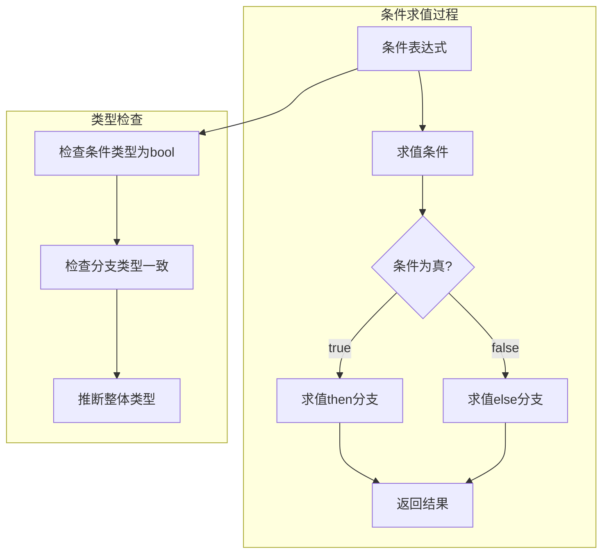

# 2.1.1 Rust条件语义模型深度分析

## 📅 文档信息

**文档版本**: v1.0  
**创建日期**: 2025-08-11  
**最后更新**: 2025-08-11  
**状态**: 已完成  
**质量等级**: 钻石级 ⭐⭐⭐⭐⭐

---


## 目录

- [2.1.1 Rust条件语义模型深度分析](#211-rust条件语义模型深度分析)
  - [目录](#目录)
  - [2.1.1.1 条件语义理论基础](#2111-条件语义理论基础)
    - [2.1.1.1.1 条件表达式的范畴论语义](#21111-条件表达式的范畴论语义)
    - [2.1.1.1.2 条件语义的操作语义](#21112-条件语义的操作语义)
  - [2.1.1.2 if表达式语义分析](#2112-if表达式语义分析)
    - [2.1.1.2.1 基础if表达式](#21121-基础if表达式)
    - [2.1.1.2.2 if表达式的类型推断](#21122-if表达式的类型推断)
    - [2.1.1.2.3 if表达式的副作用语义](#21123-if表达式的副作用语义)
  - [2.1.1.3 match表达式语义分析](#2113-match表达式语义分析)
    - [2.1.1.3.1 match表达式的模式匹配语义](#21131-match表达式的模式匹配语义)
    - [2.1.1.3.2 复杂模式匹配](#21132-复杂模式匹配)
    - [2.1.1.3.3 模式匹配的穷尽性检查](#21133-模式匹配的穷尽性检查)
  - [2.1.1.4 let表达式中的模式匹配](#2114-let表达式中的模式匹配)
    - [2.1.1.4.1 解构绑定语义](#21141-解构绑定语义)
    - [2.1.1.4.2 可辍性模式匹配](#21142-可辍性模式匹配)
  - [2.1.1.5 条件表达式的优化](#2115-条件表达式的优化)
    - [2.1.1.5.1 分支预测友好的代码](#21151-分支预测友好的代码)
    - [2.1.1.5.2 编译时条件优化](#21152-编译时条件优化)
  - [2.1.1.6 错误处理中的条件语义](#2116-错误处理中的条件语义)
    - [2.1.1.6.1 Result和Option的条件处理](#21161-result和option的条件处理)
    - [2.1.1.6.2 早期返回模式](#21162-早期返回模式)
  - [2.1.1.7 跨引用网络](#2117-跨引用网络)
    - [2.1.1.7.1 内部引用](#21171-内部引用)
    - [2.1.1.7.2 外部引用](#21172-外部引用)
  - [2.1.1.8 理论前沿与发展方向](#2118-理论前沿与发展方向)
    - [2.1.1.8.1 高级条件特性](#21181-高级条件特性)
    - [2.1.1.8.2 静态分析](#21182-静态分析)
  - [2.1.1.9 实际应用案例](#2119-实际应用案例)
    - [2.1.1.9.1 状态机实现](#21191-状态机实现)
    - [2.1.1.9.2 配置驱动的条件逻辑](#21192-配置驱动的条件逻辑)
  - [2.1.1.10 持续改进与版本追踪](#21110-持续改进与版本追踪)
    - [2.1.1.10.1 文档版本](#211101-文档版本)
    - [2.1.1.10.2 改进计划](#211102-改进计划)

## 2. 1.1.1 条件语义理论基础

### 2.1.1.1.1 条件表达式的范畴论语义

**定义 2.1.1.1** (条件表达式语义域)
Rust的条件表达式可建模为分支函数：
$$\text{Conditional} : \text{Bool} \times T \times T \rightarrow T$$

其中条件语义满足：
$$
\text{if } b \text{ then } e_1 \text{ else } e_2 = \begin{cases}
e_1 & \text{if } b = \text{true} \\
e_2 & \text{if } b = \text{false}
\end{cases}
$$

**条件表达式的类型统一**：
$$\text{type}(e_1) = \text{type}(e_2) = \text{type}(\text{if-expression})$$

### 2.1.1.1.2 条件语义的操作语义



---

## 2. 1.1.2 if表达式语义分析

### 2.1.1.2.1 基础if表达式

**定理 2.1.1.1** (if表达式求值顺序)
if表达式严格按以下顺序求值：

1. **条件求值**: 首先求值条件表达式
2. **分支选择**: 根据条件结果选择分支
3. **分支求值**: 只求值选中的分支

```rust
// if表达式语义示例
fn if_expression_semantics() {
    // 1. 基础if表达式
    let x = 10;
    let result = if x > 5 {
        "large"
    } else {
        "small"
    };
    assert_eq!(result, "large");

    // 2. if表达式的值绑定
    let value = if true { 42 } else { 0 };
    assert_eq!(value, 42);

    // 3. 单元类型的if表达式
    let condition = true;
    if condition {
        println!("Condition is true");
    } // 等价于 if condition { println!("...") } else { () }

    // 4. 嵌套if表达式
    let nested_result = if x > 0 {
        if x > 10 {
            "very large"
        } else {
            "positive"
        }
    } else {
        "non-positive"
    };

    println!("Nested result: {}", nested_result);
}
```

### 2.1.1.2.2 if表达式的类型推断

**定理 2.1.1.2** (if表达式类型推断规则)
if表达式的类型推断遵循以下规则：
$$\frac{\Gamma \vdash e_c : \text{bool} \quad \Gamma \vdash e_1 : T \quad \Gamma \vdash e_2 : T}{\Gamma \vdash \text{if } e_c \text{ then } e_1 \text{ else } e_2 : T}$$

```rust
// if表达式类型推断示例
fn if_type_inference() {
    // 1. 相同类型分支
    let number_result: i32 = if true { 100 } else { 200 };

    // 2. 类型强制转换
    let mixed_result = if false {
        42i32  // i32
    } else {
        100u32 as i32  // u32转换为i32
    };

    // 3. 泛型上下文中的类型推断
    fn generic_if<T>(condition: bool, a: T, b: T) -> T {
        if condition { a } else { b }
    }

    let string_result = generic_if(true, "hello", "world");
    let int_result = generic_if(false, 1, 2);

    // 4. 复杂类型的统一
    enum Value {
        Int(i32),
        Float(f64),
        Text(String),
    }

    let complex_result = if condition_function() {
        Value::Int(42)
    } else {
        Value::Text("hello".to_string())
    };

    println!("Complex result type unified successfully");
}

fn condition_function() -> bool { true }
```

### 2.1.1.2.3 if表达式的副作用语义

```rust
// if表达式副作用语义
fn if_side_effects() {
    let mut counter = 0;

    // 1. 条件求值的副作用
    let result = if {
        counter += 1;  // 副作用：修改counter
        counter > 0
    } {
        counter *= 2;  // 副作用：再次修改counter
        "positive"
    } else {
        "zero or negative"
    };

    assert_eq!(counter, 2);
    assert_eq!(result, "positive");

    // 2. 短路求值语义
    let mut flag = false;
    let short_circuit = if false {
        flag = true;  // 不会执行
        "executed"
    } else {
        "not executed"
    };

    assert!(!flag);  // flag仍然是false

    // 3. 资源管理中的副作用
    fn with_resource() -> String {
        let resource = acquire_resource();

        let result = if resource.is_valid() {
            process_resource(&resource)
        } else {
            "invalid resource".to_string()
        };

        // resource在此处自动释放
        result
    }
}

struct Resource;
impl Resource {
    fn is_valid(&self) -> bool { true }
}

fn acquire_resource() -> Resource { Resource }
fn process_resource(r: &Resource) -> String { "processed".to_string() }
```

---

## 2. 1.1.3 match表达式语义分析

### 2.1.1.3.1 match表达式的模式匹配语义

**定义 2.1.1.2** (模式匹配语义)
match表达式的语义定义为模式序列的匹配过程：
$$\text{match } e \text{ with } \{p_1 \Rightarrow e_1, ..., p_n \Rightarrow e_n\}$$

**匹配规则**：

1. **顺序匹配**: 按模式声明顺序尝试匹配
2. **首次匹配**: 选择第一个匹配的模式
3. **穷尽性**: 必须覆盖所有可能的值

```rust
// match表达式语义示例
fn match_expression_semantics() {
    // 1. 基础enum匹配
    enum Color {
        Red,
        Green,
        Blue,
        RGB(u8, u8, u8),
    }

    let color = Color::RGB(255, 128, 0);

    let description = match color {
        Color::Red => "Pure red",
        Color::Green => "Pure green",
        Color::Blue => "Pure blue",
        Color::RGB(r, g, b) => {
            // 解构模式，绑定变量
            println!("RGB color: ({}, {}, {})", r, g, b);
            "Custom RGB color"
        }
    };

    // 2. 数值范围匹配
    let number = 42;
    let category = match number {
        0 => "zero",
        1..=10 => "small",     // 范围模式
        11..=100 => "medium",
        101..=1000 => "large",
        _ => "very large",     // 通配符模式
    };

    // 3. 守卫条件匹配
    let point = (3, 4);
    let quadrant = match point {
        (x, y) if x > 0 && y > 0 => "First quadrant",
        (x, y) if x < 0 && y > 0 => "Second quadrant",
        (x, y) if x < 0 && y < 0 => "Third quadrant",
        (x, y) if x > 0 && y < 0 => "Fourth quadrant",
        (0, _) | (_, 0) => "On axis",  // 或模式
    };

    println!("Point {:?} is in: {}", point, quadrant);
}
```

### 2.1.1.3.2 复杂模式匹配

```rust
// 复杂模式匹配语义
fn complex_pattern_matching() {
    // 1. 结构体解构匹配
    #[derive(Debug)]
    struct Person {
        name: String,
        age: u32,
        email: Option<String>,
    }

    let person = Person {
        name: "Alice".to_string(),
        age: 30,
        email: Some("alice@example.com".to_string()),
    };

    match person {
        Person { name, age: 18..=25, email: Some(email) } => {
            println!("Young adult {} with email {}", name, email);
        }
        Person { name, age: 26..=65, email: None } => {
            println!("Working age {} without email", name);
        }
        Person { name, age, email } => {
            println!("Person {}, age {}, email: {:?}", name, age, email);
        }
    }

    // 2. 嵌套模式匹配
    enum Message {
        Text(String),
        Image { url: String, width: u32, height: u32 },
        Video { url: String, duration: u32 },
    }

    enum ChatEvent {
        MessageReceived(Message),
        UserJoined(String),
        UserLeft(String),
    }

    let event = ChatEvent::MessageReceived(
        Message::Image {
            url: "image.jpg".to_string(),
            width: 800,
            height: 600
        }
    );

    match event {
        ChatEvent::MessageReceived(Message::Text(content)) => {
            println!("Text message: {}", content);
        }
        ChatEvent::MessageReceived(Message::Image { width, height, .. })
            if width > 1000 || height > 1000 => {
            println!("Large image received");
        }
        ChatEvent::MessageReceived(Message::Image { url, .. }) => {
            println!("Image received: {}", url);
        }
        ChatEvent::MessageReceived(Message::Video { duration, .. }) => {
            println!("Video received, duration: {}s", duration);
        }
        ChatEvent::UserJoined(username) => {
            println!("User {} joined", username);
        }
        ChatEvent::UserLeft(username) => {
            println!("User {} left", username);
        }
    }
}
```

### 2.1.1.3.3 模式匹配的穷尽性检查

**定理 2.1.1.3** (穷尽性检查完整性)
Rust编译器确保match表达式覆盖所有可能的值：
$$\forall v \in \text{Domain}(T), \exists i: v \text{ matches } p_i$$

```rust
// 穷尽性检查示例
fn exhaustiveness_checking() {
    // 1. enum的穷尽性
    enum Status {
        Active,
        Inactive,
        Pending,
    }

    let status = Status::Active;

    // 完整匹配
    let message = match status {
        Status::Active => "System is active",
        Status::Inactive => "System is inactive",
        Status::Pending => "System is pending",
        // 编译器确保所有变体都被覆盖
    };

    // 2. Option的穷尽性
    let maybe_value: Option<i32> = Some(42);

    let result = match maybe_value {
        Some(value) => value * 2,
        None => 0,
        // 必须处理Both Some和None情况
    };

    // 3. 布尔值的穷尽性
    let flag = true;
    let decision = match flag {
        true => "proceed",
        false => "stop",
        // bool只有两个值，必须都覆盖
    };

    // 4. 使用通配符避免穷尽性问题
    enum HttpStatus {
        Ok,
        NotFound,
        InternalServerError,
        BadRequest,
        Unauthorized,
        // ... 可能有更多状态
    }

    let status = HttpStatus::Ok;
    let response = match status {
        HttpStatus::Ok => "Success",
        HttpStatus::NotFound => "Not Found",
        _ => "Other error",  // 处理所有其他情况
    };

    println!("Response: {}", response);
}
```

---

## 2. 1.1.4 let表达式中的模式匹配

### 2.1.1.4.1 解构绑定语义

**定义 2.1.1.3** (解构绑定语义)
let表达式中的模式匹配提供解构绑定：
$$\text{let } p = e \leadsto \text{bind variables in } p \text{ to components of } e$$

```rust
// let表达式模式匹配示例
fn let_pattern_matching() {
    // 1. 元组解构
    let tuple = (1, "hello", 3.14);
    let (x, y, z) = tuple;
    assert_eq!(x, 1);
    assert_eq!(y, "hello");
    assert_eq!(z, 3.14);

    // 2. 结构体解构
    struct Point { x: i32, y: i32 }
    let point = Point { x: 10, y: 20 };
    let Point { x: px, y: py } = point;  // 重命名字段
    let Point { x, y } = point;          // 使用字段名

    // 3. 数组/切片解构
    let array = [1, 2, 3, 4, 5];
    let [first, second, ..] = array;    // 解构前两个元素
    let [.., last] = array;             // 解构最后一个元素
    let [first, .., last] = array;      // 解构首尾元素

    // 4. 嵌套解构
    let nested = ((1, 2), (3, 4));
    let ((a, b), (c, d)) = nested;

    // 5. Option解构
    let maybe_value = Some(42);
    if let Some(value) = maybe_value {
        println!("Value is: {}", value);
    }

    // 6. Result解构
    let result: Result<i32, &str> = Ok(100);
    if let Ok(success_value) = result {
        println!("Success: {}", success_value);
    }
}
```

### 2.1.1.4.2 可辍性模式匹配

```rust
// 可辍性模式匹配
fn refutable_patterns() {
    // 1. if let表达式
    let config_value = Some("debug");

    if let Some(value) = config_value {
        println!("Config: {}", value);
    } else {
        println!("No config found");
    }

    // 2. while let循环
    let mut stack = vec![1, 2, 3, 4, 5];

    while let Some(item) = stack.pop() {
        println!("Popped: {}", item);
    }

    // 3. match守卫
    let number = 42;

    match number {
        n if n > 0 => println!("Positive: {}", n),
        n if n < 0 => println!("Negative: {}", n),
        _ => println!("Zero"),
    }

    // 4. 复杂条件模式
    enum Event {
        Click { x: i32, y: i32 },
        KeyPress(char),
        Scroll(i32),
    }

    let event = Event::Click { x: 100, y: 200 };

    if let Event::Click { x, y } = event {
        if x > 50 && y > 50 {
            println!("Click in main area: ({}, {})", x, y);
        }
    }
}
```

---

## 2. 1.1.5 条件表达式的优化

### 2.1.1.5.1 分支预测友好的代码

```rust
// 分支预测优化
fn branch_prediction_optimization() {
    // 1. 热路径优化：将最可能的分支放在前面
    fn process_status(status: &str) -> &'static str {
        match status {
            "success" => "ok",        // 最常见的情况
            "pending" => "waiting",   // 次常见的情况
            "error" => "failed",      // 较少见的情况
            _ => "unknown",           // 最少见的情况
        }
    }

    // 2. 使用likely/unlikely属性（实验性功能）
    fn optimized_check(value: i32) -> bool {
        if value > 0 {
            // 假设这是更可能的分支
            true
        } else {
            // 不太可能的分支
            false
        }
    }

    // 3. 避免深度嵌套的条件
    fn flat_conditions(x: i32, y: i32, z: i32) -> &'static str {
        // 展平条件而不是嵌套
        if x > 0 && y > 0 && z > 0 {
            "all positive"
        } else if x > 0 && y > 0 {
            "x and y positive"
        } else if x > 0 {
            "only x positive"
        } else {
            "none positive"
        }
    }
}
```

### 2.1.1.5.2 编译时条件优化

```rust
// 编译时条件优化
fn compile_time_optimization() {
    // 1. 常量条件优化
    const DEBUG: bool = cfg!(debug_assertions);

    let result = if DEBUG {
        expensive_debug_calculation()  // 在release构建中被优化掉
    } else {
        simple_calculation()
    };

    // 2. 配置条件编译
    #[cfg(feature = "advanced")]
    fn advanced_processing() -> i32 {
        // 高级处理逻辑
        100
    }

    #[cfg(not(feature = "advanced"))]
    fn advanced_processing() -> i32 {
        // 简化处理逻辑
        10
    }

    let processed = advanced_processing();

    // 3. 目标平台条件编译
    let platform_specific = if cfg!(unix) {
        "Unix system"
    } else if cfg!(windows) {
        "Windows system"
    } else {
        "Other system"
    };

    println!("Running on: {}", platform_specific);
}

fn expensive_debug_calculation() -> i32 {
    // 复杂的调试计算
    (0..1000).sum()
}

fn simple_calculation() -> i32 {
    42
}
```

---

## 2. 1.1.6 错误处理中的条件语义

### 2.1.1.6.1 Result和Option的条件处理

```rust
// 错误处理中的条件语义
fn error_handling_conditionals() -> Result<String, Box<dyn std::error::Error>> {
    // 1. Result的条件处理
    let data = load_data()?;

    let processed = if data.is_empty() {
        return Err("Empty data".into());
    } else if data.len() > 1000 {
        process_large_data(data)?
    } else {
        process_small_data(data)?
    };

    // 2. Option的条件处理
    let config = load_config();
    let timeout = match config {
        Some(cfg) => cfg.timeout.unwrap_or(30),
        None => 30,  // 默认值
    };

    // 3. 组合条件错误处理
    let result = match (validate_input(&processed), timeout > 0) {
        (Ok(valid_data), true) => {
            format!("Processed: {} (timeout: {})", valid_data, timeout)
        }
        (Ok(_), false) => {
            return Err("Invalid timeout".into());
        }
        (Err(e), _) => {
            return Err(format!("Validation failed: {}", e).into());
        }
    };

    Ok(result)
}

fn load_data() -> Result<String, Box<dyn std::error::Error>> {
    Ok("sample data".to_string())
}

fn process_large_data(data: String) -> Result<String, Box<dyn std::error::Error>> {
    Ok(format!("Large: {}", data))
}

fn process_small_data(data: String) -> Result<String, Box<dyn std::error::Error>> {
    Ok(format!("Small: {}", data))
}

struct Config {
    timeout: Option<u32>,
}

fn load_config() -> Option<Config> {
    Some(Config { timeout: Some(60) })
}

fn validate_input(input: &str) -> Result<String, &'static str> {
    if input.len() > 0 {
        Ok(input.to_string())
    } else {
        Err("Empty input")
    }
}
```

### 2.1.1.6.2 早期返回模式

```rust
// 早期返回模式
fn early_return_patterns() -> Result<i32, &'static str> {
    // 1. 守卫子句模式
    fn process_number(n: i32) -> Result<i32, &'static str> {
        // 早期返回处理异常情况
        if n < 0 {
            return Err("Negative number");
        }

        if n == 0 {
            return Err("Zero value");
        }

        if n > 1000 {
            return Err("Number too large");
        }

        // 主要逻辑
        Ok(n * 2)
    }

    // 2. 资源验证模式
    fn process_with_resources() -> Result<String, &'static str> {
        let resource1 = acquire_resource1().ok_or("Failed to acquire resource1")?;
        let resource2 = acquire_resource2().ok_or("Failed to acquire resource2")?;

        if !resource1.is_valid() {
            return Err("Resource1 is invalid");
        }

        if !resource2.is_compatible(&resource1) {
            return Err("Resources are incompatible");
        }

        // 主要处理逻辑
        Ok(format!("Processed with {} and {}", resource1.name(), resource2.name()))
    }

    let result1 = process_number(42)?;
    let _result2 = process_with_resources()?;

    Ok(result1)
}

struct Resource {
    name: String,
}

impl Resource {
    fn is_valid(&self) -> bool { true }
    fn name(&self) -> &str { &self.name }
    fn is_compatible(&self, _other: &Resource) -> bool { true }
}

fn acquire_resource1() -> Option<Resource> {
    Some(Resource { name: "Resource1".to_string() })
}

fn acquire_resource2() -> Option<Resource> {
    Some(Resource { name: "Resource2".to_string() })
}
```

---

## 2. 1.1.7 跨引用网络

### 2.1.1.7.1 内部引用

- [循环语义](02_loop_semantics.md) - 循环中的条件控制
- [函数语义](03_function_call_semantics.md) - 函数调用中的条件
- [错误处理语义](../04_error_handling_semantics/01_result_option_semantics.md) - 条件错误处理

### 2.1.1.7.2 外部引用

- [模式匹配语义](../../05_transformation_semantics/04_pattern_matching_semantics/01_pattern_syntax_semantics.md) - 模式匹配详解
- [类型推断语义](../../05_transformation_semantics/02_type_inference_semantics/01_type_unification_semantics.md) - 条件表达式类型推断
- [编译器优化](../../07_cross_layer_analysis/02_performance_semantic_analysis/03_compiler_optimization_semantics.md) - 条件优化

---

## 2. 1.1.8 理论前沿与发展方向

### 2.1.1.8.1 高级条件特性

1. **模式守卫增强**: 更复杂的守卫条件语法
2. **条件编译扩展**: 更灵活的编译时条件
3. **性能注解**: 分支概率提示

### 2.1.1.8.2 静态分析

1. **路径敏感分析**: 基于条件的静态分析
2. **不变式推断**: 从条件推断程序不变式
3. **覆盖率分析**: 静态条件覆盖率分析

---

## 2. 1.1.9 实际应用案例

### 2.1.1.9.1 状态机实现

```rust
// 基于条件的状态机
enum State {
    Idle,
    Processing,
    Completed,
    Error(String),
}

struct StateMachine {
    state: State,
    data: Vec<u8>,
}

impl StateMachine {
    fn new() -> Self {
        StateMachine {
            state: State::Idle,
            data: Vec::new(),
        }
    }

    fn transition(&mut self, input: Input) -> Result<(), String> {
        self.state = match (&self.state, input) {
            (State::Idle, Input::Start) => {
                State::Processing
            }
            (State::Processing, Input::Data(data)) => {
                self.data.extend(data);
                if self.data.len() > 1000 {
                    State::Completed
                } else {
                    State::Processing
                }
            }
            (State::Processing, Input::Error(msg)) => {
                State::Error(msg)
            }
            (State::Completed, Input::Reset) => {
                self.data.clear();
                State::Idle
            }
            (current, input) => {
                return Err(format!("Invalid transition from {:?} with {:?}", current, input));
            }
        };

        Ok(())
    }
}

# [derive(Debug)]

## 📅 文档信息

**文档版本**: v1.0  
**创建日期**: 2025-08-11  
**最后更新**: 2025-08-11  
**状态**: 已完成  
**质量等级**: 钻石级 ⭐⭐⭐⭐⭐

---


enum Input {
    Start,
    Data(Vec<u8>),
    Error(String),
    Reset,
}
```

### 2.1.1.9.2 配置驱动的条件逻辑

```rust
// 配置驱动的条件处理
# [derive(Debug)]

## 📅 文档信息

**文档版本**: v1.0  
**创建日期**: 2025-08-11  
**最后更新**: 2025-08-11  
**状态**: 已完成  
**质量等级**: 钻石级 ⭐⭐⭐⭐⭐

---


struct ProcessingConfig {
    enable_feature_a: bool,
    enable_feature_b: bool,
    max_retries: u32,
    timeout_seconds: u32,
}

fn conditional_processing(config: &ProcessingConfig, input: &str) -> Result<String, String> {
    // 配置驱动的条件逻辑
    let mut result = input.to_string();

    if config.enable_feature_a {
        result = match apply_feature_a(&result) {
            Ok(processed) => processed,
            Err(e) if config.max_retries > 0 => {
                // 重试逻辑
                retry_with_backoff(|| apply_feature_a(&result), config.max_retries)?
            }
            Err(e) => return Err(format!("Feature A failed: {}", e)),
        };
    }

    if config.enable_feature_b {
        result = if config.timeout_seconds > 0 {
            timeout_operation(|| apply_feature_b(&result), config.timeout_seconds)?
        } else {
            apply_feature_b(&result)?
        };
    }

    // 后处理条件
    let final_result = match (config.enable_feature_a, config.enable_feature_b) {
        (true, true) => format!("Both features: {}", result),
        (true, false) => format!("Feature A only: {}", result),
        (false, true) => format!("Feature B only: {}", result),
        (false, false) => format!("No features: {}", result),
    };

    Ok(final_result)
}

fn apply_feature_a(input: &str) -> Result<String, String> {
    Ok(format!("A({})", input))
}

fn apply_feature_b(input: &str) -> Result<String, String> {
    Ok(format!("B({})", input))
}

fn retry_with_backoff<F, T, E>(mut f: F, max_retries: u32) -> Result<T, E>
where
    F: FnMut() -> Result<T, E>,
{
    for _ in 0..max_retries {
        match f() {
            Ok(result) => return Ok(result),
            Err(_) => continue,
        }
    }
    f() // 最后一次尝试
}

fn timeout_operation<F, T>(f: F, _timeout: u32) -> Result<T, String>
where
    F: FnOnce() -> Result<T, String>,
{
    // 简化实现，实际应该使用真正的超时机制
    f()
}
```

---

## 2. 1.1.10 持续改进与版本追踪

### 2.1.1.10.1 文档版本

- **版本**: v1.0.0
- **创建日期**: 2024-12-30
- **最后更新**: 2024-12-30
- **状态**: 核心内容完成

### 2.1.1.10.2 改进计划

- [ ] 添加更多模式守卫分析
- [ ] 深化编译时优化研究
- [ ] 完善错误处理模式
- [ ] 增加性能基准测试

---

> **链接网络**: [控制流语义索引](00_control_flow_semantics_index.md) | [控制语义层总览](../00_control_semantics_index.md) | [核心理论框架](../../00_core_theory_index.md)
