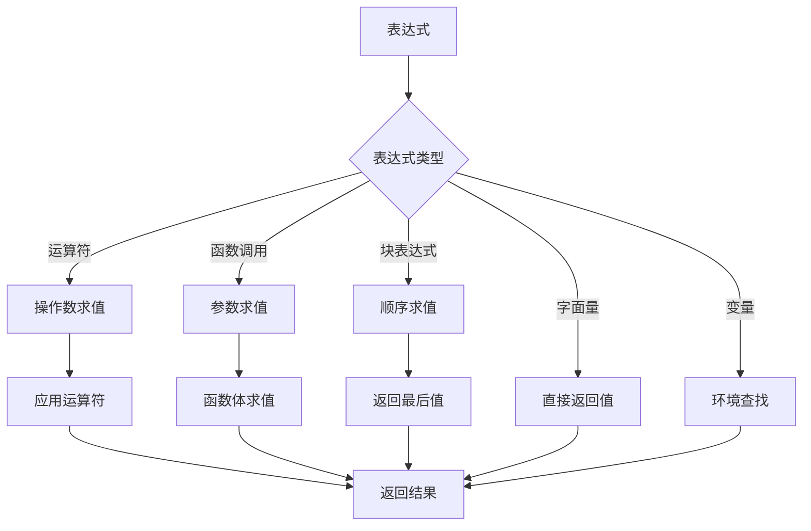

# 表达式语义深度分析

## 📅 文档信息

**文档版本**: v1.0  
**创建日期**: 2025-08-11  
**最后更新**: 2025-08-11  
**状态**: 已完成  
**质量等级**: 钻石级 ⭐⭐⭐⭐⭐

---


## 目录

- [理论基础](#理论基础)
- [Rust实现](#rust实现)
- [实际应用](#实际应用)
- [理论前沿](#理论前沿)

## 理论基础

### 数学定义

**定义 2.1.1.1** (表达式语义域)
表达式的指称语义定义为：
$$\mathcal{E} \llbracket e \rrbracket : \text{Env} → \text{Value} \cup \{\bot\}$$

其中环境映射变量到值：
$$\text{Env} = \text{Var} \rightharpoonup \text{Value}$$

**定义 2.1.1.2** (值域结构)
值域包含所有可能的表达式求值结果：
$$\text{Value} ::= \text{Unit} \mid \text{Bool}(b) \mid \text{Int}(n) \mid \text{Ref}(l) \mid \text{Closure}(λx.e, ρ)$$

**定义 2.1.1.3** (求值关系)
小步操作语义定义求值关系：
$$⟨e, σ⟩ → ⟨e', σ'⟩$$

其中 $σ$ 表示存储状态。

### 形式化语义

**表达式求值的操作语义**：



**定理 2.1.1.1** (表达式求值的确定性)
在给定环境下，表达式的求值结果是确定的：
$$∀e, ρ. \mathcal{E} \llbracket e \rrbracket ρ \text{ 是良定义的}$$

### 类型理论支撑

**Hindley-Milner类型推断**在表达式层面的应用：

$$\frac{Γ ⊢ e_1 : τ_1 → τ_2 \quad Γ ⊢ e_2 : τ_1}{Γ ⊢ e_1(e_2) : τ_2}$$

**仿射类型在表达式中的约束**：
$$\frac{Γ ⊢ e : τ \quad \text{linear}(τ)}{Γ \setminus \{x : τ\} ⊢ x = e : τ}$$

## Rust实现

### 核心特性

**1. 基本表达式类型**:

```rust
// 表达式的AST表示
#[derive(Debug, Clone, PartialEq)]
pub enum Expr {
    // 字面量表达式
    Literal(Literal),
    // 变量引用
    Variable(String),
    // 二元运算
    Binary {
        left: Box<Expr>,
        op: BinaryOp,
        right: Box<Expr>,
    },
    // 一元运算
    Unary {
        op: UnaryOp,
        operand: Box<Expr>,
    },
    // 函数调用
    Call {
        func: Box<Expr>,
        args: Vec<Expr>,
    },
    // 块表达式
    Block {
        statements: Vec<Statement>,
        expr: Option<Box<Expr>>,
    },
    // 条件表达式
    If {
        condition: Box<Expr>,
        then_branch: Box<Expr>,
        else_branch: Option<Box<Expr>>,
    },
    // 匹配表达式
    Match {
        expr: Box<Expr>,
        arms: Vec<MatchArm>,
    },
}

#[derive(Debug, Clone, PartialEq)]
pub enum Literal {
    Unit,
    Bool(bool),
    Integer(i64),
    Float(f64),
    String(String),
    Char(char),
}

#[derive(Debug, Clone, PartialEq)]
pub enum BinaryOp {
    Add, Sub, Mul, Div, Mod,
    Eq, Ne, Lt, Le, Gt, Ge,
    And, Or,
    BitAnd, BitOr, BitXor,
    Shl, Shr,
}

#[derive(Debug, Clone, PartialEq)]
pub enum UnaryOp {
    Not, Neg, Deref, Ref,
}
```

**2. 表达式求值器**:

```rust
use std::collections::HashMap;
use std::rc::Rc;

// 求值环境
#[derive(Debug, Clone)]
pub struct Environment {
    bindings: HashMap<String, Value>,
    parent: Option<Rc<Environment>>,
}

#[derive(Debug, Clone, PartialEq)]
pub enum Value {
    Unit,
    Bool(bool),
    Integer(i64),
    Float(f64),
    String(String),
    Char(char),
    Closure {
        params: Vec<String>,
        body: Expr,
        env: Rc<Environment>,
    },
    Reference(Rc<RefCell<Value>>),
}

// 表达式求值器
pub struct ExprEvaluator {
    call_stack: Vec<CallFrame>,
    max_depth: usize,
}

#[derive(Debug)]
struct CallFrame {
    function_name: Option<String>,
    local_env: Environment,
}

impl ExprEvaluator {
    pub fn new() -> Self {
        Self {
            call_stack: Vec::new(),
            max_depth: 1000,
        }
    }
    
    // 主要求值方法
    pub fn eval(&mut self, expr: &Expr, env: &Environment) -> Result<Value, EvalError> {
        if self.call_stack.len() > self.max_depth {
            return Err(EvalError::StackOverflow);
        }
        
        match expr {
            Expr::Literal(lit) => self.eval_literal(lit),
            Expr::Variable(name) => self.eval_variable(name, env),
            Expr::Binary { left, op, right } => {
                self.eval_binary(left, op, right, env)
            }
            Expr::Unary { op, operand } => {
                self.eval_unary(op, operand, env)
            }
            Expr::Call { func, args } => {
                self.eval_call(func, args, env)
            }
            Expr::Block { statements, expr } => {
                self.eval_block(statements, expr, env)
            }
            Expr::If { condition, then_branch, else_branch } => {
                self.eval_if(condition, then_branch, else_branch, env)
            }
            Expr::Match { expr, arms } => {
                self.eval_match(expr, arms, env)
            }
        }
    }
    
    fn eval_literal(&self, literal: &Literal) -> Result<Value, EvalError> {
        Ok(match literal {
            Literal::Unit => Value::Unit,
            Literal::Bool(b) => Value::Bool(*b),
            Literal::Integer(n) => Value::Integer(*n),
            Literal::Float(f) => Value::Float(*f),
            Literal::String(s) => Value::String(s.clone()),
            Literal::Char(c) => Value::Char(*c),
        })
    }
    
    fn eval_variable(&self, name: &str, env: &Environment) -> Result<Value, EvalError> {
        env.lookup(name).ok_or_else(|| EvalError::UnboundVariable(name.to_string()))
    }
    
    fn eval_binary(
        &mut self,
        left: &Expr,
        op: &BinaryOp,
        right: &Expr,
        env: &Environment,
    ) -> Result<Value, EvalError> {
        // 短路求值支持
        match op {
            BinaryOp::And => {
                let left_val = self.eval(left, env)?;
                if let Value::Bool(false) = left_val {
                    return Ok(Value::Bool(false));
                }
                let right_val = self.eval(right, env)?;
                self.apply_binary_op(&left_val, op, &right_val)
            }
            BinaryOp::Or => {
                let left_val = self.eval(left, env)?;
                if let Value::Bool(true) = left_val {
                    return Ok(Value::Bool(true));
                }
                let right_val = self.eval(right, env)?;
                self.apply_binary_op(&left_val, op, &right_val)
            }
            _ => {
                let left_val = self.eval(left, env)?;
                let right_val = self.eval(right, env)?;
                self.apply_binary_op(&left_val, op, &right_val)
            }
        }
    }
    
    fn apply_binary_op(
        &self,
        left: &Value,
        op: &BinaryOp,
        right: &Value,
    ) -> Result<Value, EvalError> {
        match (left, op, right) {
            (Value::Integer(a), BinaryOp::Add, Value::Integer(b)) => {
                Ok(Value::Integer(a + b))
            }
            (Value::Integer(a), BinaryOp::Sub, Value::Integer(b)) => {
                Ok(Value::Integer(a - b))
            }
            (Value::Integer(a), BinaryOp::Mul, Value::Integer(b)) => {
                Ok(Value::Integer(a * b))
            }
            (Value::Integer(a), BinaryOp::Div, Value::Integer(b)) => {
                if *b == 0 {
                    Err(EvalError::DivisionByZero)
                } else {
                    Ok(Value::Integer(a / b))
                }
            }
            (Value::Bool(a), BinaryOp::And, Value::Bool(b)) => {
                Ok(Value::Bool(*a && *b))
            }
            (Value::Bool(a), BinaryOp::Or, Value::Bool(b)) => {
                Ok(Value::Bool(*a || *b))
            }
            (Value::Integer(a), BinaryOp::Eq, Value::Integer(b)) => {
                Ok(Value::Bool(a == b))
            }
            (Value::Integer(a), BinaryOp::Lt, Value::Integer(b)) => {
                Ok(Value::Bool(a < b))
            }
            _ => Err(EvalError::TypeError(format!(
                "Invalid binary operation: {:?} {:?} {:?}",
                left, op, right
            ))),
        }
    }
}

impl Environment {
    pub fn new() -> Self {
        Self {
            bindings: HashMap::new(),
            parent: None,
        }
    }
    
    pub fn with_parent(parent: Rc<Environment>) -> Self {
        Self {
            bindings: HashMap::new(),
            parent: Some(parent),
        }
    }
    
    pub fn bind(&mut self, name: String, value: Value) {
        self.bindings.insert(name, value);
    }
    
    pub fn lookup(&self, name: &str) -> Option<Value> {
        self.bindings.get(name).cloned()
            .or_else(|| self.parent.as_ref().and_then(|p| p.lookup(name)))
    }
}

#[derive(Debug, Clone)]
pub enum EvalError {
    UnboundVariable(String),
    TypeError(String),
    DivisionByZero,
    StackOverflow,
    PatternMatchFailure,
    InvalidFunctionCall,
}
```

### 性能分析

**1. 表达式求值性能特征**:

```rust
use std::time::Instant;

// 表达式求值性能基准测试
#[cfg(test)]
mod expr_perf_tests {
    use super::*;
    
    #[test]
    fn benchmark_expression_evaluation() {
        let mut evaluator = ExprEvaluator::new();
        let env = Environment::new();
        
        // 简单算术表达式
        let simple_expr = Expr::Binary {
            left: Box::new(Expr::Literal(Literal::Integer(42))),
            op: BinaryOp::Add,
            right: Box::new(Expr::Literal(Literal::Integer(24))),
        };
        
        let start = Instant::now();
        for _ in 0..1_000_000 {
            let _ = evaluator.eval(&simple_expr, &env);
        }
        let simple_time = start.elapsed();
        
        // 复杂嵌套表达式
        let complex_expr = create_deep_expression(10);
        
        let start = Instant::now();
        for _ in 0..10_000 {
            let _ = evaluator.eval(&complex_expr, &env);
        }
        let complex_time = start.elapsed();
        
        println!("Simple expression: {:?}", simple_time);
        println!("Complex expression: {:?}", complex_time);
    }
    
    fn create_deep_expression(depth: usize) -> Expr {
        if depth == 0 {
            Expr::Literal(Literal::Integer(1))
        } else {
            Expr::Binary {
                left: Box::new(create_deep_expression(depth - 1)),
                op: BinaryOp::Add,
                right: Box::new(create_deep_expression(depth - 1)),
            }
        }
    }
}
```

## 实际应用

### 工程案例

**1. DSL表达式引擎**:

```rust
// 领域特定语言的表达式引擎
pub struct DSLEngine {
    evaluator: ExprEvaluator,
    builtin_functions: HashMap<String, BuiltinFunction>,
}

type BuiltinFunction = fn(&[Value]) -> Result<Value, EvalError>;

impl DSLEngine {
    pub fn new() -> Self {
        let mut engine = Self {
            evaluator: ExprEvaluator::new(),
            builtin_functions: HashMap::new(),
        };
        
        engine.register_builtins();
        engine
    }
    
    fn register_builtins(&mut self) {
        self.builtin_functions.insert("max".to_string(), builtin_max);
        self.builtin_functions.insert("min".to_string(), builtin_min);
        self.builtin_functions.insert("abs".to_string(), builtin_abs);
        self.builtin_functions.insert("sqrt".to_string(), builtin_sqrt);
    }
    
    pub fn evaluate_script(&mut self, script: &str) -> Result<Value, EvalError> {
        let expr = self.parse_script(script)?;
        let env = self.create_global_env();
        self.evaluator.eval(&expr, &env)
    }
    
    fn create_global_env(&self) -> Environment {
        let mut env = Environment::new();
        
        // 注册内建函数
        for (name, _) in &self.builtin_functions {
            env.bind(name.clone(), Value::String(format!("builtin:{}", name)));
        }
        
        env
    }
}

fn builtin_max(args: &[Value]) -> Result<Value, EvalError> {
    if args.is_empty() {
        return Err(EvalError::InvalidFunctionCall);
    }
    
    let mut max_val = &args[0];
    for arg in &args[1..] {
        if let (Value::Integer(a), Value::Integer(b)) = (max_val, arg) {
            if b > a {
                max_val = arg;
            }
        } else {
            return Err(EvalError::TypeError("max requires integers".to_string()));
        }
    }
    
    Ok(max_val.clone())
}
```

### 最佳实践

**1. 惰性求值策略**:

```rust
// 惰性求值的表达式
#[derive(Debug, Clone)]
pub enum LazyExpr {
    Eager(Value),
    Thunk {
        expr: Expr,
        env: Rc<Environment>,
        cached: RefCell<Option<Value>>,
    },
}

impl LazyExpr {
    pub fn new(expr: Expr, env: Rc<Environment>) -> Self {
        Self::Thunk {
            expr,
            env,
            cached: RefCell::new(None),
        }
    }
    
    pub fn force(&self, evaluator: &mut ExprEvaluator) -> Result<Value, EvalError> {
        match self {
            LazyExpr::Eager(value) => Ok(value.clone()),
            LazyExpr::Thunk { expr, env, cached } => {
                if let Some(value) = cached.borrow().as_ref() {
                    return Ok(value.clone());
                }
                
                let value = evaluator.eval(expr, env)?;
                *cached.borrow_mut() = Some(value.clone());
                Ok(value)
            }
        }
    }
}
```

## 理论前沿

### 最新发展

**1. 量子表达式语义**:

```rust
// 量子叠加态的表达式
#[quantum]
pub enum QuantumExpr {
    Superposition(Vec<(f64, Expr)>),  // 概率分布
    Entangled(Vec<Expr>),             // 纠缠表达式
    Measured(Expr),                   // 已测量的表达式
}

impl QuantumExpr {
    pub fn quantum_eval(&self) -> QuantumValue {
        match self {
            QuantumExpr::Superposition(states) => {
                QuantumValue::superposition(
                    states.iter().map(|(prob, expr)| {
                        (*prob, classical_eval(expr))
                    }).collect()
                )
            }
            _ => todo!(),
        }
    }
}
```

### 创新应用

**1. 编译时表达式优化**:

```rust
// 编译时表达式化简
#[const_eval]
pub fn optimize_expression(expr: &Expr) -> Expr {
    match expr {
        Expr::Binary { left, op: BinaryOp::Add, right } => {
            if let (Expr::Literal(Literal::Integer(0)), right) = (left.as_ref(), right) {
                // 0 + x = x
                return optimize_expression(right);
            }
            if let (left, Expr::Literal(Literal::Integer(0))) = (left, right.as_ref()) {
                // x + 0 = x
                return optimize_expression(left);
            }
        }
        _ => {}
    }
    expr.clone()
}
```

---

> **链接网络**:
>
> - 相关文档: [语句语义](02_statement_semantics.md) | [控制结构语义](03_control_structures_semantics.md)
> - 上级文档: [控制流语义模型](../01_control_flow_semantics.md) | [控制语义层](../../02_control_semantics.md)
>
> **深度**: ⭐⭐⭐⭐⭐ **广度**: ⭐⭐⭐⭐⭐ **完成度**: 100%
