# 2.1.2 Rust循环语义模型深度分析

## 📅 文档信息

**文档版本**: v1.0  
**创建日期**: 2025-08-11  
**最后更新**: 2025-08-11  
**状态**: 已完成  
**质量等级**: 钻石级 ⭐⭐⭐⭐⭐

---


**文档版本**: V1.0  
**创建日期**: 2025-01-27  
**所属层**: 控制语义层 (Control Semantics Layer)  
**父模块**: [2.1 控制流语义](../00_control_flow_index.md)  
**交叉引用**: [2.1.1 条件控制语义](01_conditional_control_semantics.md), [2.1.3 模式匹配语义](03_pattern_matching_semantics.md)

---

## 目录

- [2.1.2 Rust循环语义模型深度分析](#212-rust循环语义模型深度分析)
  - [目录](#目录)
  - [2.1.2.1 循环理论基础](#2121-循环理论基础)
    - [2.1.2.1.1 循环语义域定义](#21211-循环语义域定义)
    - [2.1.2.1.2 循环控制流的操作语义](#21212-循环控制流的操作语义)
  - [2.1.2.2 loop循环语义](#2122-loop循环语义)
    - [2.1.2.2.1 无限循环的基础语义](#21221-无限循环的基础语义)
    - [2.1.2.2.2 loop的状态机模型](#21222-loop的状态机模型)
  - [2.1.2.3 while循环语义](#2123-while循环语义)
    - [2.1.2.3.1 条件循环的语义模型](#21231-条件循环的语义模型)
    - [2.1.2.3.2 while循环的优化语义](#21232-while循环的优化语义)
  - [2.1.2.4 for循环语义](#2124-for循环语义)
    - [2.1.2.4.1 迭代器基础的for循环](#21241-迭代器基础的for循环)
    - [2.1.2.4.2 自定义迭代器与for循环](#21242-自定义迭代器与for循环)
  - [2.1.2.5 循环控制语义](#2125-循环控制语义)
    - [2.1.2.5.1 break和continue的语义](#21251-break和continue的语义)
    - [2.1.2.5.2 循环中的错误处理](#21252-循环中的错误处理)
  - [2.1.2.6 循环性能语义](#2126-循环性能语义)
    - [2.1.2.6.1 零成本抽象与循环优化](#21261-零成本抽象与循环优化)
    - [2.1.2.6.2 循环的内存访问模式](#21262-循环的内存访问模式)
  - [2.1.2.7 异步循环语义](#2127-异步循环语义)
    - [2.1.2.7.1 异步迭代器](#21271-异步迭代器)
    - [2.1.2.7.2 并发循环模式](#21272-并发循环模式)
  - [2.1.2.8 相关引用与扩展阅读](#2128-相关引用与扩展阅读)
    - [2.1.2.8.1 内部交叉引用](#21281-内部交叉引用)
    - [2.1.2.8.2 外部参考文献](#21282-外部参考文献)
    - [2.1.2.8.3 实现参考](#21283-实现参考)

## 2. 1.2.1 循环理论基础

### 2.1.2.1.1 循环语义域定义

**定义 2.1.2.1** (循环语义域)
$$\text{Loop} = \langle \text{Iteration}, \text{Condition}, \text{Break}, \text{Continue}, \text{Label} \rangle$$

其中：

- $\text{Iteration} : \text{State} \rightarrow \text{State}$ - 迭代状态转换
- $\text{Condition} : \text{State} \rightarrow \text{Boolean}$ - 循环条件判定
- $\text{Break} : \text{LoopContext} \rightarrow \text{Exit}$ - 循环中断
- $\text{Continue} : \text{LoopContext} \rightarrow \text{NextIteration}$ - 循环继续
- $\text{Label} : \text{LoopIdentifier}$ - 循环标签

### 2.1.2.1.2 循环控制流的操作语义

```mermaid
graph TB
    subgraph "循环类型"
        Loop[loop无限循环]
        While[while条件循环]
        For[for迭代循环]
    end
    
    subgraph "控制流"
        Entry[循环入口]
        Condition[条件检查]
        Body[循环体]
        Update[状态更新]
        Exit[循环出口]
    end
    
    subgraph "跳转控制"
        Break[break中断]
        Continue[continue继续]
        Label[标签跳转]
        Return[提前返回]
    end
    
    Entry --> Condition
    Condition -->|true| Body
    Condition -->|false| Exit
    Body --> Update
    Update --> Condition
    
    Body --> Break
    Body --> Continue
    Body --> Return
    Break --> Exit
    Continue --> Condition
```



**循环语义规则**：
$$\frac{\text{condition}(s) = \text{true} \quad \text{body}(s) \rightarrow s'}{\text{while } \text{condition } \text{body}(s) \rightarrow \text{while } \text{condition } \text{body}(s')} \text{[WHILE-STEP]}$$

$$\frac{\text{condition}(s) = \text{false}}{\text{while } \text{condition } \text{body}(s) \rightarrow s} \text{[WHILE-EXIT]}$$

---

## 2. 1.2.2 loop循环语义

### 2.1.2.2.1 无限循环的基础语义

```rust
// 基础loop循环
fn basic_loop_semantics() {
    let mut counter = 0;
    
    loop {
        println!("Counter: {}", counter);
        counter += 1;
        
        if counter >= 5 {
            break;  // 显式退出
        }
    }
    
    println!("Loop completed");
}

// loop作为表达式
fn loop_as_expression() {
    let result = loop {
        let input = std::io::stdin()
            .read_line(&mut String::new())
            .map(|_| 42)  // 简化：直接返回42
            .unwrap_or(0);
        
        if input > 0 {
            break input * 2;  // break可以返回值
        }
        
        println!("Invalid input, try again");
    };
    
    println!("Result from loop: {}", result);
}

// 嵌套loop与标签
fn nested_loops_with_labels() {
    'outer: loop {
        println!("Entered outer loop");
        
        'inner: loop {
            println!("Entered inner loop");
            
            let condition = rand::random::<bool>();
            if condition {
                break 'outer;  // 跳出外层循环
            } else {
                break 'inner;  // 跳出内层循环
            }
        }
        
        println!("Inner loop completed");
        break;  // 正常退出外层
    }
    
    println!("All loops completed");
}
```

**loop循环的语义特性**：

- **无条件入口**: 总是执行循环体
- **显式退出**: 必须通过break退出
- **表达式语义**: 可以返回值
- **标签支持**: 支持多层循环控制

### 2.1.2.2.2 loop的状态机模型

```rust
// loop循环的状态机实现
#[derive(Debug, Clone)]
enum LoopState<T> {
    Continue(T),
    Break(T),
    Return(T),
}

struct LoopMachine<T> {
    state: T,
    iteration: usize,
}

impl<T> LoopMachine<T> 
where 
    T: Clone,
{
    fn new(initial_state: T) -> Self {
        LoopMachine {
            state: initial_state,
            iteration: 0,
        }
    }
    
    fn run<F, R>(&mut self, mut body: F) -> R
    where
        F: FnMut(&mut T, usize) -> LoopState<R>,
    {
        loop {
            match body(&mut self.state, self.iteration) {
                LoopState::Continue(_) => {
                    self.iteration += 1;
                    continue;
                }
                LoopState::Break(result) => {
                    return result;
                }
                LoopState::Return(result) => {
                    return result;
                }
            }
        }
    }
}

fn loop_state_machine_example() {
    let mut machine = LoopMachine::new(0);
    
    let result = machine.run(|counter, iteration| {
        println!("Iteration {}: counter = {}", iteration, counter);
        *counter += 1;
        
        if *counter >= 5 {
            LoopState::Break(*counter)
        } else {
            LoopState::Continue(*counter)
        }
    });
    
    println!("Final result: {}", result);
}
```

---

## 2. 1.2.3 while循环语义

### 2.1.2.3.1 条件循环的语义模型

```rust
// 基础while循环
fn basic_while_semantics() {
    let mut count = 0;
    
    while count < 10 {
        println!("Count: {}", count);
        count += 1;
    }
    
    println!("While loop completed, count = {}", count);
}

// while let模式匹配循环
fn while_let_semantics() {
    let mut stack = vec![1, 2, 3, 4, 5];
    
    // while let结合模式匹配
    while let Some(top) = stack.pop() {
        println!("Popped: {}", top);
    }
    
    println!("Stack is now empty");
    
    // 复杂的while let模式
    let mut iterator = (0..5).map(|x| if x % 2 == 0 { Some(x) } else { None });
    
    while let Some(Some(value)) = iterator.next() {
        println!("Even value: {}", value);
    }
}

// while循环的条件求值
fn while_condition_evaluation() {
    fn expensive_condition(counter: &mut i32) -> bool {
        *counter += 1;
        println!("Evaluating condition (call {})", counter);
        *counter < 3
    }
    
    let mut call_count = 0;
    let mut i = 0;
    
    // 条件在每次迭代时都会重新求值
    while expensive_condition(&mut call_count) {
        println!("Loop body iteration {}", i);
        i += 1;
    }
    
    println!("Total condition evaluations: {}", call_count);
}
```

**while循环的语义特征**：

- **前置条件检查**: 循环体执行前检查条件
- **可能零次执行**: 如果初始条件为假，循环体不执行
- **条件重求值**: 每次迭代都重新求值条件

### 2.1.2.3.2 while循环的优化语义

```rust
// while循环的编译器优化
fn while_loop_optimizations() {
    // 循环不变代码移动
    fn loop_invariant_code_motion() {
        let data = vec![1, 2, 3, 4, 5];
        let threshold = 3;  // 循环不变量
        let mut i = 0;
        
        while i < data.len() {
            // 编译器可能优化：将data.len()提取到循环外
            if data[i] > threshold {  // threshold是循环不变的
                println!("Found: {}", data[i]);
            }
            i += 1;
        }
    }
    
    // 循环展开优化
    fn loop_unrolling_candidate() {
        let mut sum = 0;
        let mut i = 0;
        
        // 小的、固定次数的循环可能被展开
        while i < 4 {
            sum += i * i;
            i += 1;
        }
        
        // 编译器可能展开为：
        // sum += 0 * 0;
        // sum += 1 * 1;
        // sum += 2 * 2;
        // sum += 3 * 3;
        
        println!("Sum: {}", sum);
    }
    
    // 边界检查消除
    fn bounds_check_elimination() {
        let data = vec![1, 2, 3, 4, 5];
        let mut i = 0;
        
        // 编译器可能消除边界检查，因为条件保证i有效
        while i < data.len() {
            let value = data[i];  // 无需边界检查
            println!("Value: {}", value);
            i += 1;
        }
    }
    
    loop_invariant_code_motion();
    loop_unrolling_candidate();
    bounds_check_elimination();
}
```

---

## 2. 1.2.4 for循环语义

### 2.1.2.4.1 迭代器基础的for循环

```rust
// 基础for循环语义
fn basic_for_semantics() {
    // for循环是while let的语法糖
    let numbers = vec![1, 2, 3, 4, 5];
    
    // 这个for循环：
    for number in numbers.iter() {
        println!("Number: {}", number);
    }
    
    // 等价于：
    let numbers2 = vec![1, 2, 3, 4, 5];
    let mut iter = numbers2.iter();
    loop {
        match iter.next() {
            Some(number) => println!("Number: {}", number),
            None => break,
        }
    }
}

// 不同的迭代方式
fn different_iteration_modes() {
    let mut data = vec![1, 2, 3, 4, 5];
    
    // 按引用迭代（不消耗集合）
    for item in &data {
        println!("By reference: {}", item);  // item: &i32
    }
    
    // 按可变引用迭代
    for item in &mut data {
        *item *= 2;  // item: &mut i32
        println!("Modified: {}", item);
    }
    
    // 按值迭代（消耗集合）
    for item in data {
        println!("By value: {}", item);  // item: i32
    }
    
    // data现在不可用，因为已被移动
}

// 复杂的for循环模式
fn complex_for_patterns() {
    let pairs = vec![(1, "one"), (2, "two"), (3, "three")];
    
    // 解构模式
    for (number, word) in pairs {
        println!("{}: {}", number, word);
    }
    
    // 枚举迭代
    let items = vec!["a", "b", "c"];
    for (index, item) in items.iter().enumerate() {
        println!("Index {}: {}", index, item);
    }
    
    // 链式迭代
    let first = vec![1, 2, 3];
    let second = vec![4, 5, 6];
    for item in first.iter().chain(second.iter()) {
        println!("Chained: {}", item);
    }
}
```

### 2.1.2.4.2 自定义迭代器与for循环

```rust
// 实现自定义迭代器
struct Counter {
    start: usize,
    end: usize,
}

impl Counter {
    fn new(start: usize, end: usize) -> Self {
        Counter { start, end }
    }
}

impl Iterator for Counter {
    type Item = usize;
    
    fn next(&mut self) -> Option<Self::Item> {
        if self.start < self.end {
            let current = self.start;
            self.start += 1;
            Some(current)
        } else {
            None
        }
    }
}

// IntoIterator trait的实现
impl IntoIterator for Counter {
    type Item = usize;
    type IntoIter = Counter;
    
    fn into_iter(self) -> Self::IntoIter {
        self
    }
}

fn custom_iterator_with_for() {
    // 使用自定义迭代器
    for number in Counter::new(0, 5) {
        println!("Custom iterator: {}", number);
    }
    
    // 手动迭代器使用
    let mut counter = Counter::new(10, 15);
    while let Some(value) = counter.next() {
        println!("Manual iteration: {}", value);
    }
}

// 实现更复杂的迭代器
struct FibonacciIterator {
    current: u64,
    next: u64,
    count: usize,
    max_count: usize,
}

impl FibonacciIterator {
    fn new(max_count: usize) -> Self {
        FibonacciIterator {
            current: 0,
            next: 1,
            count: 0,
            max_count,
        }
    }
}

impl Iterator for FibonacciIterator {
    type Item = u64;
    
    fn next(&mut self) -> Option<Self::Item> {
        if self.count >= self.max_count {
            return None;
        }
        
        let result = self.current;
        let new_next = self.current + self.next;
        self.current = self.next;
        self.next = new_next;
        self.count += 1;
        
        Some(result)
    }
}

fn fibonacci_iterator_example() {
    println!("Fibonacci sequence:");
    for fib in FibonacciIterator::new(10) {
        println!("Fib: {}", fib);
    }
}
```

---

## 2. 1.2.5 循环控制语义

### 2.1.2.5.1 break和continue的语义

```rust
// break和continue的基础语义
fn break_continue_semantics() {
    // break：立即退出循环
    for i in 0..10 {
        if i == 5 {
            break;  // 退出循环
        }
        println!("Break example: {}", i);
    }
    
    // continue：跳到下一次迭代
    for i in 0..10 {
        if i % 2 == 0 {
            continue;  // 跳过偶数
        }
        println!("Continue example (odd): {}", i);
    }
}

// 带值的break
fn break_with_value() {
    let result = loop {
        let random = rand::random::<u8>();
        if random > 200 {
            break random;  // 返回值
        }
        println!("Generated {}, trying again...", random);
    };
    
    println!("Final result: {}", result);
    
    // 嵌套循环中的break with value
    let matrix_result = 'outer: loop {
        for i in 0..3 {
            for j in 0..3 {
                if i * j > 3 {
                    break 'outer (i, j);  // 返回元组
                }
            }
        }
        break (0, 0);  // 默认值
    };
    
    println!("Matrix result: {:?}", matrix_result);
}

// 标签控制的复杂语义
fn labeled_loop_control() {
    'search: for i in 0..5 {
        'inner: for j in 0..5 {
            'deepest: for k in 0..5 {
                println!("Checking ({}, {}, {})", i, j, k);
                
                if i + j + k == 6 {
                    println!("Found target at ({}, {}, {})", i, j, k);
                    break 'search;  // 跳出最外层
                }
                
                if k == 3 {
                    continue 'inner;  // 继续中间层的下一次迭代
                }
                
                if j == 2 && k == 2 {
                    break 'deepest;  // 跳出最内层
                }
            }
        }
    }
    
    println!("Search completed");
}
```

### 2.1.2.5.2 循环中的错误处理

```rust
// 循环中的错误处理模式
fn error_handling_in_loops() -> Result<Vec<i32>, String> {
    let inputs = vec!["1", "2", "invalid", "4", "5"];
    let mut results = Vec::new();
    
    // 遇到错误就停止
    for input in inputs.iter() {
        match input.parse::<i32>() {
            Ok(number) => results.push(number),
            Err(_) => return Err(format!("Invalid input: {}", input)),
        }
    }
    
    Ok(results)
}

fn collect_valid_results() -> Vec<i32> {
    let inputs = vec!["1", "2", "invalid", "4", "5"];
    let mut results = Vec::new();
    
    // 跳过错误，继续处理
    for input in inputs.iter() {
        if let Ok(number) = input.parse::<i32>() {
            results.push(number);
        }
        // 忽略解析错误，继续下一个
    }
    
    results
}

// 使用try操作符的循环
fn try_operator_in_loops() -> Result<i32, Box<dyn std::error::Error>> {
    let inputs = vec!["1", "2", "3", "4", "5"];
    let mut sum = 0;
    
    for input in inputs {
        let number: i32 = input.parse()?;  // 错误会提前返回
        sum += number;
    }
    
    Ok(sum)
}

fn error_handling_examples() {
    match error_handling_in_loops() {
        Ok(results) => println!("Parsed results: {:?}", results),
        Err(error) => println!("Error: {}", error),
    }
    
    let valid_results = collect_valid_results();
    println!("Valid results: {:?}", valid_results);
    
    match try_operator_in_loops() {
        Ok(sum) => println!("Sum: {}", sum),
        Err(error) => println!("Error: {}", error),
    }
}
```

---

## 2. 1.2.6 循环性能语义

### 2.1.2.6.1 零成本抽象与循环优化

```rust
// 迭代器的零成本抽象
fn zero_cost_iterations() {
    let data = vec![1, 2, 3, 4, 5, 6, 7, 8, 9, 10];
    
    // 高级迭代器操作
    let result: Vec<i32> = data
        .iter()
        .filter(|&&x| x % 2 == 0)
        .map(|&x| x * x)
        .collect();
    
    // 编译器可能优化为类似这样的代码：
    let mut optimized_result = Vec::new();
    for &item in &data {
        if item % 2 == 0 {
            optimized_result.push(item * item);
        }
    }
    
    println!("Iterator result: {:?}", result);
    println!("Optimized equivalent: {:?}", optimized_result);
}

// 循环展开示例
fn loop_unrolling_example() {
    let mut array = [0; 8];
    
    // 可能被展开的循环
    for i in 0..8 {
        array[i] = i * 2;
    }
    
    // 编译器可能展开为：
    let mut unrolled_array = [0; 8];
    unrolled_array[0] = 0 * 2;
    unrolled_array[1] = 1 * 2;
    unrolled_array[2] = 2 * 2;
    unrolled_array[3] = 3 * 2;
    unrolled_array[4] = 4 * 2;
    unrolled_array[5] = 5 * 2;
    unrolled_array[6] = 6 * 2;
    unrolled_array[7] = 7 * 2;
    
    println!("Original: {:?}", array);
    println!("Unrolled: {:?}", unrolled_array);
}

// 向量化友好的循环
fn vectorization_friendly_loops() {
    let a = vec![1.0; 1000];
    let b = vec![2.0; 1000];
    let mut c = vec![0.0; 1000];
    
    // SIMD友好的循环
    for i in 0..1000 {
        c[i] = a[i] + b[i];  // 可能被向量化
    }
    
    // 使用迭代器的等价版本
    let c_iter: Vec<f64> = a.iter()
        .zip(b.iter())
        .map(|(x, y)| x + y)
        .collect();
    
    println!("First 5 elements: {:?}", &c[..5]);
    println!("Iterator version: {:?}", &c_iter[..5]);
}
```

### 2.1.2.6.2 循环的内存访问模式

```rust
// 缓存友好的循环模式
fn cache_friendly_loops() {
    const SIZE: usize = 1000;
    let mut matrix = vec![vec![0; SIZE]; SIZE];
    
    // 行优先访问（缓存友好）
    for i in 0..SIZE {
        for j in 0..SIZE {
            matrix[i][j] = i + j;  // 连续内存访问
        }
    }
    
    // 列优先访问（缓存不友好）
    for j in 0..SIZE {
        for i in 0..SIZE {
            matrix[i][j] += 1;  // 跳跃式内存访问
        }
    }
    
    println!("Matrix element [0][0]: {}", matrix[0][0]);
}

// 分块访问优化
fn blocked_access_pattern() {
    const SIZE: usize = 1000;
    const BLOCK_SIZE: usize = 64;
    
    let mut a = vec![vec![1.0; SIZE]; SIZE];
    let mut b = vec![vec![2.0; SIZE]; SIZE];
    let mut c = vec![vec![0.0; SIZE]; SIZE];
    
    // 分块矩阵乘法（提高缓存局部性）
    for ii in (0..SIZE).step_by(BLOCK_SIZE) {
        for jj in (0..SIZE).step_by(BLOCK_SIZE) {
            for kk in (0..SIZE).step_by(BLOCK_SIZE) {
                // 块内循环
                for i in ii..std::cmp::min(ii + BLOCK_SIZE, SIZE) {
                    for j in jj..std::cmp::min(jj + BLOCK_SIZE, SIZE) {
                        for k in kk..std::cmp::min(kk + BLOCK_SIZE, SIZE) {
                            c[i][j] += a[i][k] * b[k][j];
                        }
                    }
                }
            }
        }
    }
    
    println!("Blocked computation result: {}", c[0][0]);
}
```

---

## 2. 1.2.7 异步循环语义

### 2.1.2.7.1 异步迭代器

```rust
// 异步迭代器的概念（需要futures crate）
use std::pin::Pin;
use std::task::{Context, Poll};

// 简化的异步迭代器trait
trait AsyncIterator {
    type Item;
    
    fn poll_next(
        self: Pin<&mut Self>, 
        cx: &mut Context<'_>
    ) -> Poll<Option<Self::Item>>;
}

// 异步for循环的概念（实验性特性）
async fn async_iteration_concept() {
    // 注意：这需要实验性特性 #![feature(async_iterator)]
    /*
    async fn process_async_items() {
        let async_iter = create_async_iterator();
        
        for await item in async_iter {
            process_item(item).await;
        }
    }
    */
    
    // 当前可用的替代方案
    let mut stream = create_stream();
    
    loop {
        match stream.next().await {
            Some(item) => {
                process_item(item).await;
            }
            None => break,
        }
    }
}

async fn create_stream() -> impl Stream<Item = i32> {
    // 简化的流实现
    futures::stream::iter(0..5)
}

async fn process_item(item: i32) {
    println!("Processing async item: {}", item);
    // 模拟异步工作
    tokio::time::sleep(std::time::Duration::from_millis(100)).await;
}

use futures::Stream;
use futures::StreamExt;
```

### 2.1.2.7.2 并发循环模式

```rust
// 并行迭代处理
async fn parallel_processing() {
    use tokio::task;
    
    let items = vec![1, 2, 3, 4, 5, 6, 7, 8];
    let mut handles = Vec::new();
    
    // 并发处理每个项目
    for item in items {
        let handle = task::spawn(async move {
            // 模拟异步工作
            tokio::time::sleep(std::time::Duration::from_millis(item * 10)).await;
            item * item
        });
        handles.push(handle);
    }
    
    // 收集所有结果
    let mut results = Vec::new();
    for handle in handles {
        match handle.await {
            Ok(result) => results.push(result),
            Err(e) => eprintln!("Task failed: {}", e),
        }
    }
    
    println!("Parallel results: {:?}", results);
}

// 流式处理
async fn stream_processing() {
    use futures::stream;
    
    let data_stream = stream::iter(0..10)
        .map(|x| async move {
            tokio::time::sleep(std::time::Duration::from_millis(100)).await;
            x * 2
        })
        .buffer_unordered(3);  // 并发度为3
    
    let results: Vec<i32> = data_stream.collect().await;
    println!("Stream results: {:?}", results);
}
```

---

## 2. 1.2.8 相关引用与扩展阅读

### 2.1.2.8.1 内部交叉引用

- [2.1.1 条件控制语义](01_conditional_control_semantics.md) - 循环条件的语义基础
- [2.1.3 模式匹配语义](03_pattern_matching_semantics.md) - while let中的模式匹配
- [3.2.1 Future语义](../../03_concurrency_semantics/02_async_programming_semantics/01_future_semantics.md) - 异步循环

### 2.1.2.8.2 外部参考文献

1. Aho, A.V. et al. *Compilers: Principles, Techniques, and Tools*. 2nd Edition, 2006.
2. Muchnick, S.S. *Advanced Compiler Design and Implementation*. Morgan Kaufmann, 1997.
3. Rust Reference: [Loops and other breakable expressions](https://doc.rust-lang.org/reference/expressions/loop-expr.html)

### 2.1.2.8.3 实现参考

- [std::iter](https://doc.rust-lang.org/std/iter/index.html) - 迭代器标准库
- [rayon](https://crates.io/crates/rayon) - 并行迭代器
- [futures](https://crates.io/crates/futures) - 异步流处理

---

**文档元数据**:

- **复杂度级别**: ⭐⭐⭐⭐ (高级)
- **前置知识**: Rust基础语法、迭代器概念、控制流理解
- **相关工具**: rustc, cargo, rust-analyzer
- **更新频率**: 与Rust循环和迭代器演进同步
- **维护者**: Rust控制语义分析工作组
