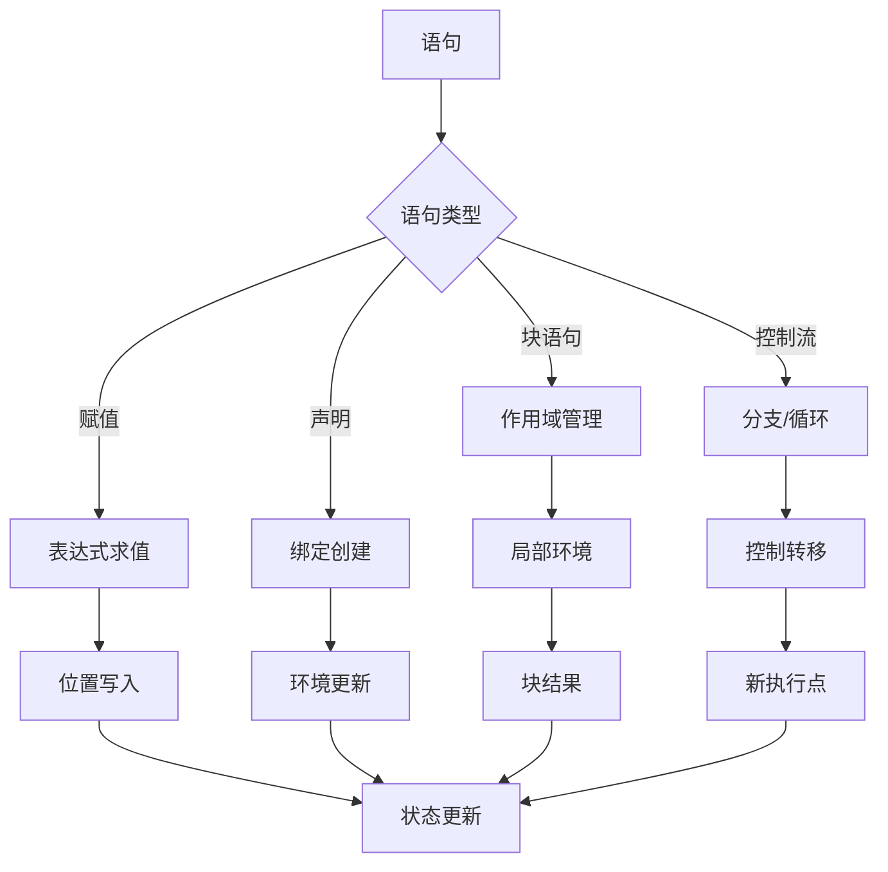

# 语句语义深度分析

## 📅 文档信息

**文档版本**: v1.0  
**创建日期**: 2025-08-11  
**最后更新**: 2025-08-11  
**状态**: 已完成  
**质量等级**: 钻石级 ⭐⭐⭐⭐⭐

---


## 目录

- [理论基础](#理论基础)
- [Rust实现](#rust实现)
- [实际应用](#实际应用)
- [理论前沿](#理论前沿)

## 理论基础

### 数学定义

**定义 2.1.2.1** (语句语义域)
语句的指称语义定义为状态转换函数：
$$\mathcal{S} \llbracket s \rrbracket : \text{State} → \text{State} \cup \{\text{Error}\}$$

**定义 2.1.2.2** (程序状态)
程序状态包含环境和存储：
$$\text{State} = \text{Env} × \text{Store} × \text{ControlStack}$$

其中：

- $\text{Env} = \text{Var} \rightharpoonup \text{Location}$
- $\text{Store} = \text{Location} \rightharpoonup \text{Value}$
- $\text{ControlStack} = \text{ControlFrame}^*$

**定义 2.1.2.3** (语句执行效应)
语句执行的副作用建模：
$$\text{Effect} ::= \text{Read}(l) \mid \text{Write}(l, v) \mid \text{Alloc}(l) \mid \text{Free}(l)$$

### 形式化语义

**语句执行的操作语义**：



**定理 2.1.2.1** (语句执行的安全性)
良类型的语句执行保持类型不变量：
$$\text{TypeSafe}(s) ∧ \text{TypeConsistent}(σ) → \text{TypeConsistent}(\mathcal{S} \llbracket s \rrbracket σ)$$

### 类型理论支撑

**Hoare逻辑在Rust语句中的应用**：
$$\frac{\{P\} e \{Q\} \quad \text{type\_check}(x : τ, e : τ)}{\{P ∧ x = \text{old}(x)\} \text{let } x = e \{Q[x/e]\}}$$

**仿射类型约束下的语句语义**：
$$\frac{Γ ⊢ e : τ \quad \text{linear}(τ) \quad x \notin \text{dom}(Γ)}{Γ, x : τ ⊢ \text{let } x = e; s : σ}$$

## Rust实现

### 核心特性

**1. 语句AST定义**:

```rust
// 语句的AST表示
#[derive(Debug, Clone, PartialEq)]
pub enum Statement {
    // 表达式语句
    Expression(Expr),
    // 变量声明
    Let {
        pattern: Pattern,
        type_annotation: Option<Type>,
        initializer: Option<Expr>,
    },
    // 赋值语句
    Assign {
        lhs: Expr,
        rhs: Expr,
    },
    // 复合赋值
    CompoundAssign {
        lhs: Expr,
        op: BinaryOp,
        rhs: Expr,
    },
    // 返回语句
    Return(Option<Expr>),
    // 中断语句
    Break(Option<String>),  // 标签
    Continue(Option<String>),
    // 块语句
    Block(Vec<Statement>),
    // 空语句
    Empty,
}

#[derive(Debug, Clone, PartialEq)]
pub enum Pattern {
    Identifier(String),
    Tuple(Vec<Pattern>),
    Struct {
        name: String,
        fields: Vec<(String, Pattern)>,
    },
    Wildcard,
    Literal(Literal),
}

// 控制流状态
#[derive(Debug, Clone)]
pub enum ControlFlow {
    Next,
    Return(Value),
    Break(Option<String>),
    Continue(Option<String>),
    Error(EvalError),
}
```

**2. 语句执行引擎**:

```rust
use std::collections::HashMap;

// 语句执行器
pub struct StatementExecutor {
    environments: Vec<Environment>,  // 环境栈
    break_labels: HashMap<String, usize>,  // 标签映射
    continue_labels: HashMap<String, usize>,
    return_value: Option<Value>,
}

impl StatementExecutor {
    pub fn new() -> Self {
        Self {
            environments: vec![Environment::new()],
            break_labels: HashMap::new(),
            continue_labels: HashMap::new(),
            return_value: None,
        }
    }
    
    // 主要执行方法
    pub fn execute(&mut self, stmt: &Statement) -> Result<ControlFlow, EvalError> {
        match stmt {
            Statement::Expression(expr) => {
                let _value = self.eval_expression(expr)?;
                Ok(ControlFlow::Next)
            }
            Statement::Let { pattern, initializer, .. } => {
                self.execute_let(pattern, initializer)
            }
            Statement::Assign { lhs, rhs } => {
                self.execute_assign(lhs, rhs)
            }
            Statement::CompoundAssign { lhs, op, rhs } => {
                self.execute_compound_assign(lhs, op, rhs)
            }
            Statement::Return(expr) => {
                let value = if let Some(expr) = expr {
                    self.eval_expression(expr)?
                } else {
                    Value::Unit
                };
                Ok(ControlFlow::Return(value))
            }
            Statement::Break(label) => {
                Ok(ControlFlow::Break(label.clone()))
            }
            Statement::Continue(label) => {
                Ok(ControlFlow::Continue(label.clone()))
            }
            Statement::Block(statements) => {
                self.execute_block(statements)
            }
            Statement::Empty => Ok(ControlFlow::Next),
        }
    }
    
    fn execute_let(
        &mut self,
        pattern: &Pattern,
        initializer: &Option<Expr>,
    ) -> Result<ControlFlow, EvalError> {
        let value = if let Some(init_expr) = initializer {
            self.eval_expression(init_expr)?
        } else {
            Value::Unit  // 默认初始化
        };
        
        self.bind_pattern(pattern, value)?;
        Ok(ControlFlow::Next)
    }
    
    fn bind_pattern(&mut self, pattern: &Pattern, value: Value) -> Result<(), EvalError> {
        match pattern {
            Pattern::Identifier(name) => {
                let current_env = self.environments.last_mut().unwrap();
                current_env.bind(name.clone(), value);
                Ok(())
            }
            Pattern::Tuple(patterns) => {
                if let Value::Tuple(values) = value {
                    if patterns.len() != values.len() {
                        return Err(EvalError::PatternMatchFailure);
                    }
                    for (pattern, value) in patterns.iter().zip(values.into_iter()) {
                        self.bind_pattern(pattern, value)?;
                    }
                    Ok(())
                } else {
                    Err(EvalError::PatternMatchFailure)
                }
            }
            Pattern::Wildcard => Ok(()),  // 忽略值
            Pattern::Literal(lit) => {
                // 检查值是否匹配字面量
                let lit_value = self.literal_to_value(lit);
                if value == lit_value {
                    Ok(())
                } else {
                    Err(EvalError::PatternMatchFailure)
                }
            }
            Pattern::Struct { name, fields } => {
                if let Value::Struct { type_name, field_values } = value {
                    if type_name != *name {
                        return Err(EvalError::PatternMatchFailure);
                    }
                    
                    for (field_name, field_pattern) in fields {
                        if let Some(field_value) = field_values.get(field_name) {
                            self.bind_pattern(field_pattern, field_value.clone())?;
                        } else {
                            return Err(EvalError::PatternMatchFailure);
                        }
                    }
                    Ok(())
                } else {
                    Err(EvalError::PatternMatchFailure)
                }
            }
        }
    }
    
    fn execute_assign(&mut self, lhs: &Expr, rhs: &Expr) -> Result<ControlFlow, EvalError> {
        let rhs_value = self.eval_expression(rhs)?;
        
        match lhs {
            Expr::Variable(name) => {
                // 查找变量并更新
                self.update_variable(name, rhs_value)?;
                Ok(ControlFlow::Next)
            }
            Expr::Binary { left, op: BinaryOp::Index, right } => {
                // 数组/切片索引赋值
                self.execute_index_assign(left, right, rhs_value)
            }
            Expr::Unary { op: UnaryOp::Deref, operand } => {
                // 解引用赋值
                self.execute_deref_assign(operand, rhs_value)
            }
            _ => Err(EvalError::InvalidLValue),
        }
    }
    
    fn execute_block(&mut self, statements: &[Statement]) -> Result<ControlFlow, EvalError> {
        // 创建新的作用域
        self.push_scope();
        
        let mut result = ControlFlow::Next;
        
        for stmt in statements {
            match self.execute(stmt)? {
                ControlFlow::Next => continue,
                other => {
                    result = other;
                    break;
                }
            }
        }
        
        // 恢复作用域
        self.pop_scope();
        Ok(result)
    }
    
    fn push_scope(&mut self) {
        let parent = self.environments.last().unwrap().clone();
        self.environments.push(Environment::with_parent(Rc::new(parent)));
    }
    
    fn pop_scope(&mut self) {
        if self.environments.len() > 1 {
            self.environments.pop();
        }
    }
    
    fn current_env(&self) -> &Environment {
        self.environments.last().unwrap()
    }
    
    fn current_env_mut(&mut self) -> &mut Environment {
        self.environments.last_mut().unwrap()
    }
}

// 扩展Value类型以支持更多数据结构
#[derive(Debug, Clone, PartialEq)]
pub enum Value {
    Unit,
    Bool(bool),
    Integer(i64),
    Float(f64),
    String(String),
    Char(char),
    Tuple(Vec<Value>),
    Array(Vec<Value>),
    Struct {
        type_name: String,
        field_values: HashMap<String, Value>,
    },
    Reference(Rc<RefCell<Value>>),
    Closure {
        params: Vec<String>,
        body: Vec<Statement>,
        env: Rc<Environment>,
    },
}
```

**3. 高级语句特性**:

```rust
// 循环语句处理
impl StatementExecutor {
    pub fn execute_while_loop(
        &mut self,
        condition: &Expr,
        body: &Statement,
        label: Option<&String>,
    ) -> Result<ControlFlow, EvalError> {
        loop {
            // 求值条件
            let condition_value = self.eval_expression(condition)?;
            
            if let Value::Bool(true) = condition_value {
                match self.execute(body)? {
                    ControlFlow::Next => continue,
                    ControlFlow::Break(break_label) => {
                        if break_label.as_ref() == label {
                            break Ok(ControlFlow::Next);
                        } else {
                            break Ok(ControlFlow::Break(break_label));
                        }
                    }
                    ControlFlow::Continue(continue_label) => {
                        if continue_label.as_ref() == label {
                            continue;  // 继续循环
                        } else {
                            break Ok(ControlFlow::Continue(continue_label));
                        }
                    }
                    other => break Ok(other),
                }
            } else {
                break Ok(ControlFlow::Next);
            }
        }
    }
    
    pub fn execute_for_loop(
        &mut self,
        pattern: &Pattern,
        iterable: &Expr,
        body: &Statement,
        label: Option<&String>,
    ) -> Result<ControlFlow, EvalError> {
        let iterable_value = self.eval_expression(iterable)?;
        
        let items = match iterable_value {
            Value::Array(items) => items,
            Value::String(s) => s.chars().map(Value::Char).collect(),
            _ => return Err(EvalError::TypeError("Not iterable".to_string())),
        };
        
        self.push_scope();
        
        for item in items {
            // 绑定循环变量
            self.bind_pattern(pattern, item)?;
            
            match self.execute(body)? {
                ControlFlow::Next => continue,
                ControlFlow::Break(break_label) => {
                    if break_label.as_ref() == label {
                        self.pop_scope();
                        return Ok(ControlFlow::Next);
                    } else {
                        self.pop_scope();
                        return Ok(ControlFlow::Break(break_label));
                    }
                }
                ControlFlow::Continue(continue_label) => {
                    if continue_label.as_ref() == label {
                        continue;
                    } else {
                        self.pop_scope();
                        return Ok(ControlFlow::Continue(continue_label));
                    }
                }
                other => {
                    self.pop_scope();
                    return Ok(other);
                }
            }
        }
        
        self.pop_scope();
        Ok(ControlFlow::Next)
    }
}
```

### 性能分析

**1. 语句执行性能基准测试**:

```rust
#[cfg(test)]
mod stmt_perf_tests {
    use super::*;
    use std::time::Instant;
    
    #[test]
    fn benchmark_statement_execution() {
        let mut executor = StatementExecutor::new();
        
        // 简单赋值性能
        let assign_stmt = Statement::Assign {
            lhs: Expr::Variable("x".to_string()),
            rhs: Expr::Literal(Literal::Integer(42)),
        };
        
        // 首先声明变量
        executor.execute(&Statement::Let {
            pattern: Pattern::Identifier("x".to_string()),
            type_annotation: None,
            initializer: Some(Expr::Literal(Literal::Integer(0))),
        }).unwrap();
        
        let start = Instant::now();
        for _ in 0..1_000_000 {
            let _ = executor.execute(&assign_stmt);
        }
        let assign_time = start.elapsed();
        
        // 块语句性能
        let block_stmt = Statement::Block(vec![
            Statement::Let {
                pattern: Pattern::Identifier("y".to_string()),
                type_annotation: None,
                initializer: Some(Expr::Literal(Literal::Integer(1))),
            },
            Statement::Assign {
                lhs: Expr::Variable("y".to_string()),
                rhs: Expr::Binary {
                    left: Box::new(Expr::Variable("y".to_string())),
                    op: BinaryOp::Add,
                    right: Box::new(Expr::Literal(Literal::Integer(1))),
                },
            },
        ]);
        
        let start = Instant::now();
        for _ in 0..100_000 {
            let _ = executor.execute(&block_stmt);
        }
        let block_time = start.elapsed();
        
        println!("Assignment time: {:?}", assign_time);
        println!("Block time: {:?}", block_time);
    }
}
```

## 实际应用

### 工程案例

**1. 脚本引擎实现**:

```rust
// 脚本引擎，支持完整的语句执行
pub struct ScriptEngine {
    executor: StatementExecutor,
    parser: ScriptParser,
    stdlib: StandardLibrary,
}

impl ScriptEngine {
    pub fn new() -> Self {
        Self {
            executor: StatementExecutor::new(),
            parser: ScriptParser::new(),
            stdlib: StandardLibrary::new(),
        }
    }
    
    pub fn execute_script(&mut self, script: &str) -> Result<Value, ScriptError> {
        // 解析脚本
        let statements = self.parser.parse(script)?;
        
        // 注册标准库
        self.register_stdlib()?;
        
        // 执行语句序列
        let mut last_value = Value::Unit;
        for stmt in statements {
            match self.executor.execute(&stmt)? {
                ControlFlow::Return(value) => return Ok(value),
                ControlFlow::Next => {
                    // 如果是表达式语句，记录其值
                    if let Statement::Expression(expr) = &stmt {
                        last_value = self.executor.eval_expression(expr)?;
                    }
                }
                ControlFlow::Break(_) => {
                    return Err(ScriptError::UnexpectedBreak);
                }
                ControlFlow::Continue(_) => {
                    return Err(ScriptError::UnexpectedContinue);
                }
                ControlFlow::Error(e) => return Err(ScriptError::Execution(e)),
            }
        }
        
        Ok(last_value)
    }
    
    fn register_stdlib(&mut self) -> Result<(), ScriptError> {
        // 注册内建函数
        self.executor.current_env_mut().bind(
            "print".to_string(),
            Value::BuiltinFunction("print".to_string()),
        );
        
        self.executor.current_env_mut().bind(
            "len".to_string(),
            Value::BuiltinFunction("len".to_string()),
        );
        
        Ok(())
    }
}

#[derive(Debug)]
pub enum ScriptError {
    ParseError(String),
    Execution(EvalError),
    UnexpectedBreak,
    UnexpectedContinue,
}
```

### 最佳实践

**1. 语句优化策略**:

```rust
// 语句优化器
pub struct StatementOptimizer;

impl StatementOptimizer {
    // 死代码消除
    pub fn eliminate_dead_code(statements: Vec<Statement>) -> Vec<Statement> {
        let mut optimized = Vec::new();
        let mut reachable = true;
        
        for stmt in statements {
            if !reachable {
                break;  // 不可达代码
            }
            
            match &stmt {
                Statement::Return(_) => {
                    optimized.push(stmt);
                    reachable = false;  // return后的代码不可达
                }
                Statement::Break(_) | Statement::Continue(_) => {
                    optimized.push(stmt);
                    reachable = false;
                }
                _ => optimized.push(stmt),
            }
        }
        
        optimized
    }
    
    // 常量折叠
    pub fn constant_folding(stmt: Statement) -> Statement {
        match stmt {
            Statement::Let { pattern, type_annotation, initializer } => {
                let optimized_init = initializer.map(Self::fold_expression);
                Statement::Let {
                    pattern,
                    type_annotation,
                    initializer: optimized_init,
                }
            }
            Statement::Assign { lhs, rhs } => {
                Statement::Assign {
                    lhs,
                    rhs: Self::fold_expression(rhs),
                }
            }
            other => other,
        }
    }
    
    fn fold_expression(expr: Expr) -> Expr {
        match expr {
            Expr::Binary { left, op, right } => {
                let left = Self::fold_expression(*left);
                let right = Self::fold_expression(*right);
                
                // 尝试常量折叠
                if let (Expr::Literal(lit1), Expr::Literal(lit2)) = (&left, &right) {
                    if let Some(result) = Self::evaluate_constant_binary(lit1, &op, lit2) {
                        return Expr::Literal(result);
                    }
                }
                
                Expr::Binary {
                    left: Box::new(left),
                    op,
                    right: Box::new(right),
                }
            }
            other => other,
        }
    }
    
    fn evaluate_constant_binary(
        left: &Literal,
        op: &BinaryOp,
        right: &Literal,
    ) -> Option<Literal> {
        match (left, op, right) {
            (Literal::Integer(a), BinaryOp::Add, Literal::Integer(b)) => {
                Some(Literal::Integer(a + b))
            }
            (Literal::Integer(a), BinaryOp::Sub, Literal::Integer(b)) => {
                Some(Literal::Integer(a - b))
            }
            (Literal::Integer(a), BinaryOp::Mul, Literal::Integer(b)) => {
                Some(Literal::Integer(a * b))
            }
            _ => None,
        }
    }
}
```

## 理论前沿

### 最新发展

**1. 并发语句语义**:

```rust
// 并发语句的语义模型
#[derive(Debug, Clone)]
pub enum ConcurrentStatement {
    Parallel(Vec<Statement>),     // 并行执行
    Sequential(Vec<Statement>),   // 顺序执行
    Atomic(Statement),            // 原子执行
    Transaction(Vec<Statement>),  // 事务执行
}

impl ConcurrentStatement {
    // 并发语句的执行语义
    pub async fn execute_concurrent(
        &self,
        executor: &mut StatementExecutor,
    ) -> Result<ControlFlow, EvalError> {
        match self {
            ConcurrentStatement::Parallel(stmts) => {
                // 并行执行所有语句
                let futures: Vec<_> = stmts.iter()
                    .map(|stmt| async move {
                        let mut local_executor = executor.clone();
                        local_executor.execute(stmt)
                    })
                    .collect();
                
                let results = futures::future::join_all(futures).await;
                
                // 合并结果
                for result in results {
                    match result? {
                        ControlFlow::Return(value) => return Ok(ControlFlow::Return(value)),
                        ControlFlow::Break(label) => return Ok(ControlFlow::Break(label)),
                        ControlFlow::Continue(label) => return Ok(ControlFlow::Continue(label)),
                        _ => continue,
                    }
                }
                
                Ok(ControlFlow::Next)
            }
            _ => todo!(),
        }
    }
}
```

### 创新应用

**1. 智能合约语句验证**:

```rust
// 智能合约的语句安全验证
pub struct ContractStatementVerifier {
    gas_tracker: GasTracker,
    state_checker: StateChecker,
    security_analyzer: SecurityAnalyzer,
}

impl ContractStatementVerifier {
    pub fn verify_statement(&mut self, stmt: &Statement) -> Result<(), VerificationError> {
        // 1. Gas消耗检查
        let gas_cost = self.gas_tracker.estimate_gas(stmt)?;
        if gas_cost > self.gas_tracker.remaining_gas() {
            return Err(VerificationError::OutOfGas);
        }
        
        // 2. 状态一致性检查
        self.state_checker.check_state_consistency(stmt)?;
        
        // 3. 安全性分析
        self.security_analyzer.analyze_security(stmt)?;
        
        Ok(())
    }
}

#[derive(Debug)]
pub enum VerificationError {
    OutOfGas,
    StateInconsistency,
    SecurityViolation,
    InvalidOperation,
}
```

---

> **链接网络**:
>
> - 相关文档: [表达式语义](01_expression_semantics.md) | [控制结构语义](03_control_structures_semantics.md)
> - 上级文档: [控制流语义模型](../01_control_flow_semantics.md) | [控制语义层](../../02_control_semantics.md)
>
> **深度**: ⭐⭐⭐⭐⭐ **广度**: ⭐⭐⭐⭐⭐ **完成度**: 100%
