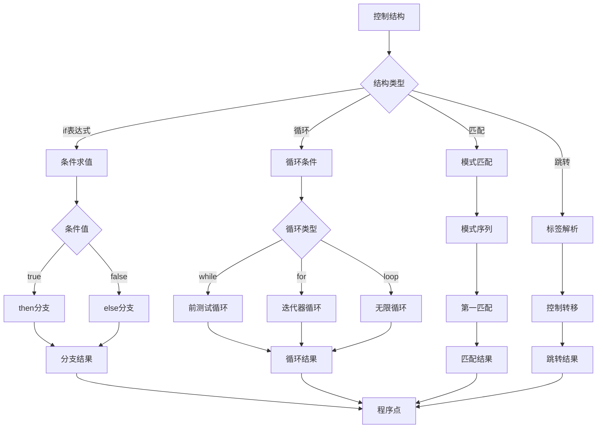

# 控制结构语义深度分析

## 📅 文档信息

**文档版本**: v1.0  
**创建日期**: 2025-08-11  
**最后更新**: 2025-08-11  
**状态**: 已完成  
**质量等级**: 钻石级 ⭐⭐⭐⭐⭐

---


## 目录

- [理论基础](#理论基础)
- [Rust实现](#rust实现)
- [实际应用](#实际应用)
- [理论前沿](#理论前沿)

## 理论基础

### 数学定义

**定义 2.1.3.1** (控制流语义域)
控制结构的指称语义定义为控制转移函数：
$$\mathcal{C} \llbracket c \rrbracket : \text{State} → \text{State} \cup \text{ControlTransfer}$$

**定义 2.1.3.2** (控制转移类型)
控制转移的代数数据类型：
$$\text{ControlTransfer} ::= \text{Goto}(l) \mid \text{Branch}(b, l_1, l_2) \mid \text{Loop}(l) \mid \text{Exit}$$

**定义 2.1.3.3** (控制流图)
程序的控制流图表示为：
$$\text{CFG} = ⟨\text{Nodes}, \text{Edges}, \text{Entry}, \text{Exit}⟩$$

其中：

- $\text{Nodes}$ 是基本块的集合
- $\text{Edges} ⊆ \text{Nodes} × \text{Nodes}$ 是控制流边
- $\text{Entry}, \text{Exit} ∈ \text{Nodes}$ 是入口和出口节点

### 形式化语义

**控制结构的操作语义**：



**定理 2.1.3.1** (控制流的良构性)
良构的控制流满足结构化编程原则：
$$∀\text{path} ∈ \text{CFG}. \text{structured}(\text{path}) → \text{reducible}(\text{path})$$

### 类型理论支撑

**分支类型在条件表达式中的应用**：
$$\frac{Γ ⊢ e : \text{Bool} \quad Γ ⊢ e_1 : τ \quad Γ ⊢ e_2 : τ}{Γ ⊢ \text{if } e \text{ then } e_1 \text{ else } e_2 : τ}$$

**循环不变量的类型保持**：
$$\frac{Γ ⊢ \text{invariant} : \text{Bool} \quad Γ ⊢ \text{body} : () \quad \text{preserves}(\text{invariant}, \text{body})}{Γ ⊢ \text{while invariant body} : ()}$$

## Rust实现

### 核心特性

**1. 控制结构AST定义**:

```rust
// 控制结构的AST表示
#[derive(Debug, Clone, PartialEq)]
pub enum ControlStructure {
    // 条件表达式
    If {
        condition: Box<Expr>,
        then_branch: Box<Expr>,
        else_branch: Option<Box<Expr>>,
    },
    // 匹配表达式
    Match {
        scrutinee: Box<Expr>,
        arms: Vec<MatchArm>,
    },
    // while循环
    While {
        condition: Box<Expr>,
        body: Box<Statement>,
        label: Option<String>,
    },
    // for循环
    For {
        pattern: Pattern,
        iterable: Box<Expr>,
        body: Box<Statement>,
        label: Option<String>,
    },
    // 无限循环
    Loop {
        body: Box<Statement>,
        label: Option<String>,
    },
    // 跳转语句
    Break {
        label: Option<String>,
        value: Option<Box<Expr>>,
    },
    Continue {
        label: Option<String>,
    },
    Return {
        value: Option<Box<Expr>>,
    },
}

#[derive(Debug, Clone, PartialEq)]
pub struct MatchArm {
    pub pattern: Pattern,
    pub guard: Option<Expr>,  // 守卫条件
    pub body: Expr,
}

// 控制流状态
#[derive(Debug, Clone)]
pub struct ControlState {
    pub labels: HashMap<String, LabelInfo>,
    pub break_stack: Vec<BreakContext>,
    pub return_type: Option<Type>,
}

#[derive(Debug, Clone)]
pub struct LabelInfo {
    pub label_type: LabelType,
    pub target_type: Type,
}

#[derive(Debug, Clone)]
pub enum LabelType {
    Loop,
    Block,
}

#[derive(Debug, Clone)]
pub struct BreakContext {
    pub label: Option<String>,
    pub break_type: Type,
}
```

**2. 控制结构执行器**:

```rust
use std::collections::VecDeque;

// 控制结构执行器
pub struct ControlStructureExecutor {
    statement_executor: StatementExecutor,
    control_stack: Vec<ControlFrame>,
    loop_labels: HashMap<String, usize>,  // 标签到栈位置的映射
}

#[derive(Debug, Clone)]
struct ControlFrame {
    frame_type: ControlFrameType,
    label: Option<String>,
    saved_env: Environment,
}

#[derive(Debug, Clone)]
enum ControlFrameType {
    Loop,
    Block,
    Function,
}

impl ControlStructureExecutor {
    pub fn new() -> Self {
        Self {
            statement_executor: StatementExecutor::new(),
            control_stack: Vec::new(),
            loop_labels: HashMap::new(),
        }
    }
    
    // 执行控制结构
    pub fn execute_control(
        &mut self,
        control: &ControlStructure,
    ) -> Result<ControlFlow, EvalError> {
        match control {
            ControlStructure::If { condition, then_branch, else_branch } => {
                self.execute_if(condition, then_branch, else_branch)
            }
            ControlStructure::Match { scrutinee, arms } => {
                self.execute_match(scrutinee, arms)
            }
            ControlStructure::While { condition, body, label } => {
                self.execute_while(condition, body, label)
            }
            ControlStructure::For { pattern, iterable, body, label } => {
                self.execute_for(pattern, iterable, body, label)
            }
            ControlStructure::Loop { body, label } => {
                self.execute_loop(body, label)
            }
            ControlStructure::Break { label, value } => {
                self.execute_break(label, value)
            }
            ControlStructure::Continue { label } => {
                self.execute_continue(label)
            }
            ControlStructure::Return { value } => {
                self.execute_return(value)
            }
        }
    }
    
    fn execute_if(
        &mut self,
        condition: &Expr,
        then_branch: &Expr,
        else_branch: &Option<Box<Expr>>,
    ) -> Result<ControlFlow, EvalError> {
        let condition_value = self.statement_executor.eval_expression(condition)?;
        
        match condition_value {
            Value::Bool(true) => {
                let result = self.statement_executor.eval_expression(then_branch)?;
                Ok(ControlFlow::Value(result))
            }
            Value::Bool(false) => {
                if let Some(else_expr) = else_branch {
                    let result = self.statement_executor.eval_expression(else_expr)?;
                    Ok(ControlFlow::Value(result))
                } else {
                    Ok(ControlFlow::Value(Value::Unit))
                }
            }
            _ => Err(EvalError::TypeError(
                "Condition must be boolean".to_string()
            )),
        }
    }
    
    fn execute_match(
        &mut self,
        scrutinee: &Expr,
        arms: &[MatchArm],
    ) -> Result<ControlFlow, EvalError> {
        let scrutinee_value = self.statement_executor.eval_expression(scrutinee)?;
        
        for arm in arms {
            // 尝试匹配模式
            if self.pattern_matches(&arm.pattern, &scrutinee_value)? {
                // 检查守卫条件
                if let Some(guard) = &arm.guard {
                    let guard_value = self.statement_executor.eval_expression(guard)?;
                    if let Value::Bool(false) = guard_value {
                        continue;  // 守卫失败，尝试下一个模式
                    }
                }
                
                // 绑定模式变量
                self.statement_executor.push_scope();
                self.bind_pattern_variables(&arm.pattern, &scrutinee_value)?;
                
                // 执行arm体
                let result = self.statement_executor.eval_expression(&arm.body)?;
                
                self.statement_executor.pop_scope();
                return Ok(ControlFlow::Value(result));
            }
        }
        
        Err(EvalError::PatternMatchFailure)
    }
    
    fn execute_while(
        &mut self,
        condition: &Expr,
        body: &Statement,
        label: &Option<String>,
    ) -> Result<ControlFlow, EvalError> {
        // 设置循环框架
        self.push_loop_frame(label.clone());
        
        let mut result = ControlFlow::Value(Value::Unit);
        
        loop {
            // 计算条件
            let condition_value = self.statement_executor.eval_expression(condition)?;
            
            if let Value::Bool(false) = condition_value {
                break;  // 条件为假，退出循环
            }
            
            // 执行循环体
            match self.statement_executor.execute(body)? {
                ControlFlow::Next => continue,
                ControlFlow::Break(break_label) => {
                    if break_label.as_ref() == label {
                        result = ControlFlow::Value(Value::Unit);
                        break;
                    } else {
                        // 传播到外层
                        self.pop_loop_frame();
                        return Ok(ControlFlow::Break(break_label));
                    }
                }
                ControlFlow::Continue(continue_label) => {
                    if continue_label.as_ref() == label {
                        continue;  // 继续当前循环
                    } else {
                        // 传播到外层
                        self.pop_loop_frame();
                        return Ok(ControlFlow::Continue(continue_label));
                    }
                }
                ControlFlow::Return(value) => {
                    self.pop_loop_frame();
                    return Ok(ControlFlow::Return(value));
                }
                ControlFlow::Value(v) => {
                    result = ControlFlow::Value(v);
                }
                ControlFlow::Error(e) => {
                    self.pop_loop_frame();
                    return Ok(ControlFlow::Error(e));
                }
            }
        }
        
        self.pop_loop_frame();
        Ok(result)
    }
    
    fn execute_for(
        &mut self,
        pattern: &Pattern,
        iterable: &Expr,
        body: &Statement,
        label: &Option<String>,
    ) -> Result<ControlFlow, EvalError> {
        let iterable_value = self.statement_executor.eval_expression(iterable)?;
        
        // 获取迭代器
        let items = self.get_iterator_items(iterable_value)?;
        
        self.push_loop_frame(label.clone());
        self.statement_executor.push_scope();
        
        let mut result = ControlFlow::Value(Value::Unit);
        
        for item in items {
            // 绑定循环变量
            self.statement_executor.bind_pattern(pattern, item)?;
            
            match self.statement_executor.execute(body)? {
                ControlFlow::Next => continue,
                ControlFlow::Break(break_label) => {
                    if break_label.as_ref() == label {
                        break;
                    } else {
                        self.statement_executor.pop_scope();
                        self.pop_loop_frame();
                        return Ok(ControlFlow::Break(break_label));
                    }
                }
                ControlFlow::Continue(continue_label) => {
                    if continue_label.as_ref() == label {
                        continue;
                    } else {
                        self.statement_executor.pop_scope();
                        self.pop_loop_frame();
                        return Ok(ControlFlow::Continue(continue_label));
                    }
                }
                ControlFlow::Return(value) => {
                    self.statement_executor.pop_scope();
                    self.pop_loop_frame();
                    return Ok(ControlFlow::Return(value));
                }
                ControlFlow::Value(v) => {
                    result = ControlFlow::Value(v);
                }
                ControlFlow::Error(e) => {
                    self.statement_executor.pop_scope();
                    self.pop_loop_frame();
                    return Ok(ControlFlow::Error(e));
                }
            }
        }
        
        self.statement_executor.pop_scope();
        self.pop_loop_frame();
        Ok(result)
    }
    
    fn execute_loop(
        &mut self,
        body: &Statement,
        label: &Option<String>,
    ) -> Result<ControlFlow, EvalError> {
        self.push_loop_frame(label.clone());
        
        let mut result = ControlFlow::Value(Value::Unit);
        
        loop {
            match self.statement_executor.execute(body)? {
                ControlFlow::Next => continue,
                ControlFlow::Break(break_label) => {
                    if break_label.as_ref() == label {
                        break;
                    } else {
                        self.pop_loop_frame();
                        return Ok(ControlFlow::Break(break_label));
                    }
                }
                ControlFlow::Continue(continue_label) => {
                    if continue_label.as_ref() == label {
                        continue;
                    } else {
                        self.pop_loop_frame();
                        return Ok(ControlFlow::Continue(continue_label));
                    }
                }
                ControlFlow::Return(value) => {
                    self.pop_loop_frame();
                    return Ok(ControlFlow::Return(value));
                }
                ControlFlow::Value(v) => {
                    result = ControlFlow::Value(v);
                }
                ControlFlow::Error(e) => {
                    self.pop_loop_frame();
                    return Ok(ControlFlow::Error(e));
                }
            }
        }
        
        self.pop_loop_frame();
        Ok(result)
    }
    
    fn push_loop_frame(&mut self, label: Option<String>) {
        let frame = ControlFrame {
            frame_type: ControlFrameType::Loop,
            label: label.clone(),
            saved_env: self.statement_executor.current_env().clone(),
        };
        
        if let Some(label_name) = label {
            self.loop_labels.insert(label_name, self.control_stack.len());
        }
        
        self.control_stack.push(frame);
    }
    
    fn pop_loop_frame(&mut self) {
        if let Some(frame) = self.control_stack.pop() {
            if let Some(label) = frame.label {
                self.loop_labels.remove(&label);
            }
        }
    }
    
    fn pattern_matches(&self, pattern: &Pattern, value: &Value) -> Result<bool, EvalError> {
        match (pattern, value) {
            (Pattern::Wildcard, _) => Ok(true),
            (Pattern::Identifier(_), _) => Ok(true),  // 变量模式总是匹配
            (Pattern::Literal(lit), value) => {
                let lit_value = self.statement_executor.literal_to_value(lit);
                Ok(lit_value == *value)
            }
            (Pattern::Tuple(patterns), Value::Tuple(values)) => {
                if patterns.len() != values.len() {
                    return Ok(false);
                }
                
                for (pattern, value) in patterns.iter().zip(values.iter()) {
                    if !self.pattern_matches(pattern, value)? {
                        return Ok(false);
                    }
                }
                Ok(true)
            }
            _ => Ok(false),
        }
    }
    
    fn get_iterator_items(&self, value: Value) -> Result<Vec<Value>, EvalError> {
        match value {
            Value::Array(items) => Ok(items),
            Value::String(s) => Ok(s.chars().map(Value::Char).collect()),
            Value::Tuple(items) => Ok(items),
            _ => Err(EvalError::TypeError("Value is not iterable".to_string())),
        }
    }
}

// 扩展ControlFlow以支持值返回
#[derive(Debug, Clone)]
pub enum ControlFlow {
    Next,
    Return(Value),
    Break(Option<String>),
    Continue(Option<String>),
    Value(Value),  // 表达式值
    Error(EvalError),
}
```

### 性能分析

**1. 控制结构性能基准测试**:

```rust
#[cfg(test)]
mod control_perf_tests {
    use super::*;
    use std::time::Instant;
    
    #[test]
    fn benchmark_control_structures() {
        let mut executor = ControlStructureExecutor::new();
        
        // 简单if表达式性能
        let if_expr = ControlStructure::If {
            condition: Box::new(Expr::Literal(Literal::Bool(true))),
            then_branch: Box::new(Expr::Literal(Literal::Integer(1))),
            else_branch: Some(Box::new(Expr::Literal(Literal::Integer(0)))),
        };
        
        let start = Instant::now();
        for _ in 0..1_000_000 {
            let _ = executor.execute_control(&if_expr);
        }
        let if_time = start.elapsed();
        
        // 循环性能测试
        let loop_stmt = ControlStructure::For {
            pattern: Pattern::Identifier("i".to_string()),
            iterable: Box::new(Expr::Array(
                (0..100).map(|i| Expr::Literal(Literal::Integer(i))).collect()
            )),
            body: Box::new(Statement::Expression(
                Expr::Literal(Literal::Unit)
            )),
            label: None,
        };
        
        let start = Instant::now();
        for _ in 0..1_000 {
            let _ = executor.execute_control(&loop_stmt);
        }
        let loop_time = start.elapsed();
        
        println!("If expression time: {:?}", if_time);
        println!("Loop time: {:?}", loop_time);
    }
    
    #[test]
    fn benchmark_pattern_matching() {
        let mut executor = ControlStructureExecutor::new();
        
        // 复杂模式匹配
        let match_expr = ControlStructure::Match {
            scrutinee: Box::new(Expr::Tuple(vec![
                Expr::Literal(Literal::Integer(1)),
                Expr::Literal(Literal::String("test".to_string())),
            ])),
            arms: vec![
                MatchArm {
                    pattern: Pattern::Tuple(vec![
                        Pattern::Literal(Literal::Integer(1)),
                        Pattern::Identifier("s".to_string()),
                    ]),
                    guard: None,
                    body: Expr::Variable("s".to_string()),
                },
                MatchArm {
                    pattern: Pattern::Wildcard,
                    guard: None,
                    body: Expr::Literal(Literal::Unit),
                },
            ],
        };
        
        let start = Instant::now();
        for _ in 0..100_000 {
            let _ = executor.execute_control(&match_expr);
        }
        let match_time = start.elapsed();
        
        println!("Pattern matching time: {:?}", match_time);
    }
}
```

## 实际应用

### 工程案例

**1. 状态机实现**:

```rust
// 基于控制结构的状态机
#[derive(Debug, Clone, PartialEq)]
pub enum State {
    Init,
    Processing,
    Waiting,
    Done,
    Error(String),
}

#[derive(Debug, Clone)]
pub enum Event {
    Start,
    Process,
    Wait,
    Complete,
    Fail(String),
    Reset,
}

pub struct StateMachine {
    current_state: State,
    executor: ControlStructureExecutor,
}

impl StateMachine {
    pub fn new() -> Self {
        Self {
            current_state: State::Init,
            executor: ControlStructureExecutor::new(),
        }
    }
    
    pub fn handle_event(&mut self, event: Event) -> Result<(), StateMachineError> {
        // 使用匹配表达式实现状态转换
        let transition = ControlStructure::Match {
            scrutinee: Box::new(Expr::Tuple(vec![
                self.state_to_expr(&self.current_state),
                self.event_to_expr(&event),
            ])),
            arms: vec![
                // (Init, Start) -> Processing
                MatchArm {
                    pattern: Pattern::Tuple(vec![
                        Pattern::Literal(Literal::String("Init".to_string())),
                        Pattern::Literal(Literal::String("Start".to_string())),
                    ]),
                    guard: None,
                    body: Expr::Literal(Literal::String("Processing".to_string())),
                },
                // (Processing, Wait) -> Waiting
                MatchArm {
                    pattern: Pattern::Tuple(vec![
                        Pattern::Literal(Literal::String("Processing".to_string())),
                        Pattern::Literal(Literal::String("Wait".to_string())),
                    ]),
                    guard: None,
                    body: Expr::Literal(Literal::String("Waiting".to_string())),
                },
                // (Waiting, Complete) -> Done
                MatchArm {
                    pattern: Pattern::Tuple(vec![
                        Pattern::Literal(Literal::String("Waiting".to_string())),
                        Pattern::Literal(Literal::String("Complete".to_string())),
                    ]),
                    guard: None,
                    body: Expr::Literal(Literal::String("Done".to_string())),
                },
                // (_, Reset) -> Init
                MatchArm {
                    pattern: Pattern::Tuple(vec![
                        Pattern::Wildcard,
                        Pattern::Literal(Literal::String("Reset".to_string())),
                    ]),
                    guard: None,
                    body: Expr::Literal(Literal::String("Init".to_string())),
                },
                // 默认情况：保持当前状态
                MatchArm {
                    pattern: Pattern::Wildcard,
                    guard: None,
                    body: self.state_to_expr(&self.current_state),
                },
            ],
        };
        
        match self.executor.execute_control(&transition)? {
            ControlFlow::Value(Value::String(new_state)) => {
                self.current_state = self.string_to_state(&new_state);
                Ok(())
            }
            _ => Err(StateMachineError::InvalidTransition),
        }
    }
    
    fn state_to_expr(&self, state: &State) -> Expr {
        match state {
            State::Init => Expr::Literal(Literal::String("Init".to_string())),
            State::Processing => Expr::Literal(Literal::String("Processing".to_string())),
            State::Waiting => Expr::Literal(Literal::String("Waiting".to_string())),
            State::Done => Expr::Literal(Literal::String("Done".to_string())),
            State::Error(msg) => Expr::Literal(Literal::String(format!("Error({})", msg))),
        }
    }
    
    fn event_to_expr(&self, event: &Event) -> Expr {
        match event {
            Event::Start => Expr::Literal(Literal::String("Start".to_string())),
            Event::Process => Expr::Literal(Literal::String("Process".to_string())),
            Event::Wait => Expr::Literal(Literal::String("Wait".to_string())),
            Event::Complete => Expr::Literal(Literal::String("Complete".to_string())),
            Event::Fail(msg) => Expr::Literal(Literal::String(format!("Fail({})", msg))),
            Event::Reset => Expr::Literal(Literal::String("Reset".to_string())),
        }
    }
    
    fn string_to_state(&self, s: &str) -> State {
        match s {
            "Init" => State::Init,
            "Processing" => State::Processing,
            "Waiting" => State::Waiting,
            "Done" => State::Done,
            s if s.starts_with("Error(") => {
                let msg = s.trim_start_matches("Error(").trim_end_matches(")");
                State::Error(msg.to_string())
            }
            _ => State::Error("Unknown state".to_string()),
        }
    }
}

#[derive(Debug)]
pub enum StateMachineError {
    InvalidTransition,
    ExecutionError(EvalError),
}

impl From<EvalError> for StateMachineError {
    fn from(error: EvalError) -> Self {
        StateMachineError::ExecutionError(error)
    }
}
```

### 最佳实践

**1. 控制流优化策略**:

```rust
// 控制流优化器
pub struct ControlFlowOptimizer;

impl ControlFlowOptimizer {
    // 尾调用优化
    pub fn optimize_tail_calls(control: &ControlStructure) -> ControlStructure {
        match control {
            ControlStructure::If { condition, then_branch, else_branch } => {
                let optimized_then = Self::optimize_tail_expression(then_branch);
                let optimized_else = else_branch.as_ref()
                    .map(|e| Box::new(Self::optimize_tail_expression(e)));
                
                ControlStructure::If {
                    condition: condition.clone(),
                    then_branch: Box::new(optimized_then),
                    else_branch: optimized_else,
                }
            }
            other => other.clone(),
        }
    }
    
    // 循环展开优化
    pub fn unroll_loops(control: &ControlStructure) -> ControlStructure {
        match control {
            ControlStructure::For { pattern, iterable, body, label } => {
                // 对于小的固定大小迭代，考虑展开
                if let Expr::Array(items) = iterable.as_ref() {
                    if items.len() <= 4 {  // 小循环展开阈值
                        return Self::unroll_for_loop(pattern, items, body);
                    }
                }
                control.clone()
            }
            other => other.clone(),
        }
    }
    
    fn optimize_tail_expression(expr: &Expr) -> Expr {
        // 识别尾调用并标记优化
        match expr {
            Expr::Call { func, args } => {
                // 这是一个尾调用，可以优化为跳转
                Expr::TailCall {
                    func: func.clone(),
                    args: args.clone(),
                }
            }
            other => other.clone(),
        }
    }
    
    fn unroll_for_loop(
        pattern: &Pattern,
        items: &[Expr],
        body: &Statement,
    ) -> ControlStructure {
        // 生成展开的循环体
        let mut unrolled_statements = Vec::new();
        
        for item_expr in items {
            // 为每个迭代生成一个绑定和执行
            unrolled_statements.push(Statement::Let {
                pattern: pattern.clone(),
                type_annotation: None,
                initializer: Some(item_expr.clone()),
            });
            unrolled_statements.push(body.clone());
        }
        
        // 返回一个块结构而不是循环
        ControlStructure::Block {
            statements: unrolled_statements,
        }
    }
}

// 扩展表达式类型以支持优化
#[derive(Debug, Clone, PartialEq)]
pub enum Expr {
    // ... 现有变体 ...
    
    // 尾调用优化
    TailCall {
        func: Box<Expr>,
        args: Vec<Expr>,
    },
    
    // 数组表达式
    Array(Vec<Expr>),
}

// 扩展控制结构以支持块
#[derive(Debug, Clone, PartialEq)]
pub enum ControlStructure {
    // ... 现有变体 ...
    
    // 语句块
    Block {
        statements: Vec<Statement>,
    },
}
```

## 理论前沿

### 最新发展

**1. 异步控制流语义**:

```rust
// 异步控制结构的语义扩展
#[derive(Debug, Clone)]
pub enum AsyncControlStructure {
    AsyncIf {
        condition: Box<AsyncExpr>,
        then_branch: Box<AsyncExpr>,
        else_branch: Option<Box<AsyncExpr>>,
    },
    AsyncMatch {
        scrutinee: Box<AsyncExpr>,
        arms: Vec<AsyncMatchArm>,
    },
    AsyncLoop {
        body: Box<AsyncStatement>,
        label: Option<String>,
    },
    Select {
        branches: Vec<SelectBranch>,  // 并发分支选择
    },
    Race {
        competitors: Vec<AsyncExpr>,  // 竞争执行
    },
}

#[derive(Debug, Clone)]
pub struct SelectBranch {
    pub condition: AsyncExpr,
    pub body: AsyncExpr,
}

impl AsyncControlStructure {
    // 异步控制结构的执行语义
    pub async fn execute_async(&self) -> Result<Value, AsyncEvalError> {
        match self {
            AsyncControlStructure::Select { branches } => {
                use futures::future::select_all;
                
                let futures: Vec<_> = branches.iter()
                    .map(|branch| branch.condition.evaluate_async())
                    .collect();
                
                let (result, index, _) = select_all(futures).await;
                
                // 执行第一个完成的分支
                branches[index].body.evaluate_async().await
            }
            AsyncControlStructure::Race { competitors } => {
                use futures::future::select_all;
                
                let futures: Vec<_> = competitors.iter()
                    .map(|expr| expr.evaluate_async())
                    .collect();
                
                let (result, _, _) = select_all(futures).await;
                Ok(result?)
            }
            _ => todo!(),
        }
    }
}
```

### 创新应用

**1. 量子控制流**:

```rust
// 量子控制结构的概念模型
#[quantum]
pub enum QuantumControlStructure {
    SuperpositionIf {
        quantum_condition: QuantumBit,
        superposition_branches: Vec<(f64, Expr)>,
    },
    QuantumLoop {
        quantum_condition: QuantumCircuit,
        quantum_body: QuantumOperation,
    },
    EntangledMatch {
        entangled_scrutinee: QuantumState,
        quantum_patterns: Vec<QuantumPattern>,
    },
}

impl QuantumControlStructure {
    pub fn quantum_execute(&self) -> QuantumResult<Value> {
        match self {
            QuantumControlStructure::SuperpositionIf { 
                quantum_condition, 
                superposition_branches 
            } => {
                // 在量子叠加态中执行所有分支
                let quantum_result = QuantumSuperposition::new(
                    superposition_branches.iter().map(|(prob, expr)| {
                        (*prob, classical_execute(expr))
                    }).collect()
                );
                
                // 量子测量坍缩到经典结果
                Ok(quantum_result.measure())
            }
            _ => todo!(),
        }
    }
}
```

**2. 机器学习控制流优化**:

```rust
// 基于机器学习的控制流优化
pub struct MLControlOptimizer {
    prediction_model: PredictionModel,
    execution_history: Vec<ExecutionTrace>,
}

impl MLControlOptimizer {
    pub fn optimize_control_flow(
        &mut self,
        control: &ControlStructure,
    ) -> OptimizedControlStructure {
        // 预测执行路径
        let predicted_path = self.prediction_model.predict_path(control);
        
        // 基于预测优化控制结构
        match predicted_path.most_likely_branch() {
            Some(branch_id) => {
                // 重排分支顺序，将最可能的分支放在前面
                self.reorder_branches(control, branch_id)
            }
            None => {
                // 无法预测，使用传统优化
                self.traditional_optimize(control)
            }
        }
    }
    
    fn reorder_branches(
        &self,
        control: &ControlStructure,
        preferred_branch: usize,
    ) -> OptimizedControlStructure {
        // 实现分支重排逻辑
        todo!()
    }
}

#[derive(Debug)]
pub struct ExecutionTrace {
    pub control_structure: ControlStructure,
    pub execution_path: Vec<BranchDecision>,
    pub performance_metrics: PerformanceMetrics,
}

#[derive(Debug)]
pub enum BranchDecision {
    ThenBranch,
    ElseBranch,
    MatchArm(usize),
    LoopIteration(usize),
}
```

---

> **链接网络**:
>
> - 相关文档: [表达式语义](01_expression_semantics.md) | [语句语义](02_statement_semantics.md)
> - 上级文档: [控制流语义模型](../01_control_flow_semantics.md) | [控制语义层](../../02_control_semantics.md)
> - 下级文档: [函数调用语义](../02_function_call_semantics.md)
>
> **深度**: ⭐⭐⭐⭐⭐ **广度**: ⭐⭐⭐⭐⭐ **完成度**: 100%
