# 2.1.3 Rust模式匹配语义模型深度分析

## 📅 文档信息

**文档版本**: v1.0  
**创建日期**: 2025-08-11  
**最后更新**: 2025-08-11  
**状态**: 已完成  
**质量等级**: 钻石级 ⭐⭐⭐⭐⭐

---


**文档版本**: V1.0  
**创建日期**: 2025-01-27  
**所属层**: 控制语义层 (Control Semantics Layer)  
**父模块**: [2.1 控制流语义](../00_control_flow_index.md)  
**交叉引用**: [2.1.1 条件控制语义](01_conditional_control_semantics.md), [1.1.2 复合类型语义](../../01_foundation_semantics/01_type_system_semantics/02_composite_types_semantics.md)

---

## 目录

- [2.1.3 Rust模式匹配语义模型深度分析](#213-rust模式匹配语义模型深度分析)
  - [目录](#目录)
  - [2.1.3.1 模式匹配理论基础](#2131-模式匹配理论基础)
    - [2.1.3.1.1 模式匹配语义域的形式化定义](#21311-模式匹配语义域的形式化定义)
    - [2.1.3.1.2 模式匹配的范畴论语义](#21312-模式匹配的范畴论语义)
    - [2.1.3.1.3 模式匹配的操作语义](#21313-模式匹配的操作语义)
  - [2.1.3.2 基础模式匹配语义](#2132-基础模式匹配语义)
    - [2.1.3.2.1 字面量模式匹配](#21321-字面量模式匹配)
    - [2.1.3.2.2 变量模式与通配符](#21322-变量模式与通配符)
    - [2.1.3.2.3 结构化数据模式匹配](#21323-结构化数据模式匹配)
  - [2.1.3.3 枚举模式匹配语义](#2133-枚举模式匹配语义)
    - [2.1.3.3.1 简单枚举匹配](#21331-简单枚举匹配)
    - [2.1.3.3.2 Option和Result模式匹配](#21332-option和result模式匹配)
    - [2.1.3.3.3 递归数据结构匹配](#21333-递归数据结构匹配)
  - [2.1.3.4 高级模式匹配特性](#2134-高级模式匹配特性)
    - [2.1.3.4.1 守卫条件 (Guards)](#21341-守卫条件-guards)
    - [2.1.3.4.2 引用模式匹配](#21342-引用模式匹配)
    - [2.1.3.4.3 切片模式匹配](#21343-切片模式匹配)
  - [2.1.3.5 模式匹配的穷尽性检查](#2135-模式匹配的穷尽性检查)
    - [2.1.3.5.1 穷尽性分析算法](#21351-穷尽性分析算法)
    - [2.1.3.5.2 可达性分析](#21352-可达性分析)
    - [2.1.3.5.3 有用性分析](#21353-有用性分析)
  - [2.1.3.6 模式匹配的编译器优化](#2136-模式匹配的编译器优化)
    - [2.1.3.6.1 决策树优化](#21361-决策树优化)
    - [2.1.3.6.2 跳转表优化](#21362-跳转表优化)
    - [2.1.3.6.3 模式匹配的分支预测](#21363-模式匹配的分支预测)
  - [2.1.3.7 模式匹配的高级应用](#2137-模式匹配的高级应用)
    - [2.1.3.7.1 函数式编程模式](#21371-函数式编程模式)
    - [2.1.3.7.2 状态机实现](#21372-状态机实现)
    - [2.1.3.7.3 解析器组合子](#21373-解析器组合子)
  - [2.1.3.8 相关引用与扩展阅读](#2138-相关引用与扩展阅读)
    - [2.1.3.8.1 内部交叉引用](#21381-内部交叉引用)
    - [2.1.3.8.2 外部参考文献](#21382-外部参考文献)
    - [2.1.3.8.3 实现参考](#21383-实现参考)

## 2. 1.3.1 模式匹配理论基础

### 2.1.3.1.1 模式匹配语义域的形式化定义

**定义 2.1.3.1** (模式匹配语义域)
Rust的模式匹配系统可形式化为结构化数据解构的代数系统：

$$\text{PatternMatching} = \langle \text{Pattern}, \text{Value}, \text{Match}, \text{Guard}, \text{Binding} \rangle$$

其中：

- $\text{Pattern} : \text{StructuralTemplate}$ - 模式结构模板
- $\text{Value} : \text{StructuredData}$ - 被匹配的结构化数据
- $\text{Match} : \text{Pattern} \times \text{Value} \rightarrow \text{Boolean}$ - 匹配判定函数
- $\text{Guard} : \text{BooleanExpression}$ - 附加条件守卫
- $\text{Binding} : \text{Pattern} \times \text{Value} \rightarrow \text{Environment}$ - 变量绑定映射

### 2.1.3.1.2 模式匹配的范畴论语义

```mermaid
graph TB
    subgraph "模式匹配结构"
        MatchExpr[match表达式]
        Arms[匹配分支]
        Pattern[模式]
        Guard[守卫条件]
        Body[分支体]
    end
    
    subgraph "模式类型"
        Literal[字面量模式]
        Variable[变量模式]
        Wildcard[通配符模式]
        Struct[结构体模式]
        Enum[枚举模式]
        Tuple[元组模式]
        Slice[切片模式]
        Reference[引用模式]
    end
    
    subgraph "匹配语义"
        Exhaustive[穷尽性检查]
        Reachable[可达性分析]
        Binding[变量绑定]
        Refutable[可反驳性]
    end
    
    MatchExpr --> Arms
    Arms --> Pattern
    Arms --> Guard
    Arms --> Body
    
    Pattern --> Literal
    Pattern --> Variable
    Pattern --> Wildcard
    Pattern --> Struct
    Pattern --> Enum
    Pattern --> Tuple
    Pattern --> Slice
    Pattern --> Reference
    
    Pattern --> Exhaustive
    Pattern --> Reachable
    Pattern --> Binding
    Pattern --> Refutable
```



### 2.1.3.1.3 模式匹配的操作语义

**匹配规则**：
$$\frac{\text{pattern } p \text{ matches } \text{value } v \quad \text{guard}(g) = \text{true}}{\text{match } v \{ p \text{ if } g \Rightarrow e \} \rightarrow e[\text{bindings}(p, v)]} \text{[PATTERN-MATCH]}$$

**穷尽性规则**：
$$\frac{\text{patterns } P = \{p_1, \ldots, p_n\} \quad \text{covers\_all}(P, \text{Type}(v))}{\text{exhaustive}(\text{match } v \{P\})} \text{[EXHAUSTIVENESS]}$$

---

## 2. 1.3.2 基础模式匹配语义

### 2.1.3.2.1 字面量模式匹配

```rust
// 基础字面量模式匹配
fn literal_pattern_matching() {
    let number = 42;
    
    match number {
        0 => println!("Zero"),
        1 => println!("One"),
        42 => println!("The answer"),  // 匹配字面量42
        _ => println!("Something else"),
    }
    
    // 字符模式匹配
    let character = 'A';
    match character {
        'A'..='Z' => println!("Uppercase letter"),
        'a'..='z' => println!("Lowercase letter"),
        '0'..='9' => println!("Digit"),
        _ => println!("Other character"),
    }
    
    // 字符串模式匹配
    let text = "hello";
    match text {
        "hello" => println!("Greeting"),
        "goodbye" => println!("Farewell"),
        "" => println!("Empty string"),
        _ => println!("Other text"),
    }
}

// 范围模式匹配
fn range_pattern_matching(value: i32) {
    match value {
        1..=5 => println!("Small number (1-5)"),
        6..=10 => println!("Medium number (6-10)"),
        11..=100 => println!("Large number (11-100)"),
        101.. => println!("Very large number (101+)"),
        ..=0 => println!("Non-positive number"),
    }
}
```

**字面量匹配语义**：
$$\frac{\text{literal } l = \text{value } v}{\text{matches}(l, v) = \text{true}} \text{[LITERAL-MATCH]}$$

$$\frac{a \leq v \leq b}{\text{matches}(a..=b, v) = \text{true}} \text{[RANGE-MATCH]}$$

### 2.1.3.2.2 变量模式与通配符

```rust
// 变量模式匹配
fn variable_pattern_matching() {
    let data = Some(42);
    
    match data {
        Some(x) => {
            println!("Found value: {}", x);  // x绑定到42
        }
        None => println!("No value"),
    }
    
    // 通配符模式
    let tuple = (1, 2, 3);
    match tuple {
        (1, _, _) => println!("First element is 1"),  // 忽略后两个元素
        (_, 2, _) => println!("Second element is 2"),
        _ => println!("Other pattern"),
    }
}

// 变量绑定与类型推断
fn variable_binding_with_types() {
    let result: Result<i32, String> = Ok(42);
    
    match result {
        Ok(value) => {
            // value的类型被推断为i32
            println!("Success: {}", value);
        }
        Err(error) => {
            // error的类型被推断为String
            println!("Error: {}", error);
        }
    }
}

// @ 绑定语法
fn at_binding() {
    let message = Some(42);
    
    match message {
        Some(x @ 1..=50) => {
            // x绑定到具体值，同时检查范围
            println!("Small number: {}", x);
        }
        Some(x @ 51..=100) => {
            println!("Large number: {}", x);
        }
        Some(x) => {
            println!("Other number: {}", x);
        }
        None => println!("No number"),
    }
}
```

**变量绑定语义**：
$$\frac{\text{pattern } x \text{ matches } \text{value } v}{\text{bindings}(x, v) = \{x \mapsto v\}} \text{[VAR-BINDING]}$$

$$\frac{\text{pattern } (x \text{ @ } p) \text{ matches } \text{value } v \quad \text{matches}(p, v)}{\text{bindings}(x \text{ @ } p, v) = \{x \mapsto v\} \cup \text{bindings}(p, v)} \text{[AT-BINDING]}$$

### 2.1.3.2.3 结构化数据模式匹配

```rust
// 元组模式匹配
fn tuple_pattern_matching() {
    let point = (3, 4);
    
    match point {
        (0, 0) => println!("Origin"),
        (0, y) => println!("On Y-axis at {}", y),
        (x, 0) => println!("On X-axis at {}", x),
        (x, y) => println!("Point at ({}, {})", x, y),
    }
    
    // 嵌套元组模式
    let nested = ((1, 2), (3, 4));
    match nested {
        ((a, b), (c, d)) => {
            println!("Nested values: {} {} {} {}", a, b, c, d);
        }
    }
}

// 结构体模式匹配
#[derive(Debug)]
struct Point {
    x: i32,
    y: i32,
}

#[derive(Debug)]
struct Circle {
    center: Point,
    radius: f64,
}

fn struct_pattern_matching() {
    let point = Point { x: 3, y: 4 };
    
    match point {
        Point { x: 0, y: 0 } => println!("Origin"),
        Point { x: 0, y } => println!("On Y-axis at {}", y),
        Point { x, y: 0 } => println!("On X-axis at {}", x),
        Point { x, y } => println!("Point at ({}, {})", x, y),
    }
    
    // 部分匹配结构体
    let circle = Circle {
        center: Point { x: 1, y: 1 },
        radius: 5.0,
    };
    
    match circle {
        Circle { center: Point { x: 0, y: 0 }, .. } => {
            println!("Circle at origin");
        }
        Circle { radius, .. } if radius > 10.0 => {
            println!("Large circle with radius {}", radius);
        }
        Circle { center, radius } => {
            println!("Circle at {:?} with radius {}", center, radius);
        }
    }
}

// 简写语法
fn struct_shorthand_matching() {
    let point = Point { x: 5, y: 10 };
    
    match point {
        Point { x, y } if x == y => println!("On diagonal"),
        Point { x, y } => println!("Point: ({}, {})", x, y),
    }
}
```

**结构体匹配语义**：
$$\frac{\text{struct } S \{ f_1: v_1, \ldots, f_n: v_n \} \quad \text{matches}(p_i, v_i) \forall i}{\text{matches}(S \{ f_1: p_1, \ldots, f_n: p_n \}, S \{ f_1: v_1, \ldots, f_n: v_n \})} \text{[STRUCT-MATCH]}$$

---

## 2. 1.3.3 枚举模式匹配语义

### 2.1.3.3.1 简单枚举匹配

```rust
// 简单枚举定义
#[derive(Debug, PartialEq)]
enum Direction {
    North,
    South,
    East,
    West,
}

fn simple_enum_matching() {
    let direction = Direction::North;
    
    match direction {
        Direction::North => println!("Going north"),
        Direction::South => println!("Going south"),
        Direction::East => println!("Going east"),
        Direction::West => println!("Going west"),
    }
}

// 带数据的枚举
#[derive(Debug)]
enum Message {
    Quit,
    Move { x: i32, y: i32 },
    Write(String),
    ChangeColor(i32, i32, i32),
}

fn enum_with_data_matching() {
    let messages = vec![
        Message::Quit,
        Message::Move { x: 10, y: 20 },
        Message::Write("Hello".to_string()),
        Message::ChangeColor(255, 0, 0),
    ];
    
    for message in messages {
        match message {
            Message::Quit => {
                println!("Quit message received");
            }
            Message::Move { x, y } => {
                println!("Move to ({}, {})", x, y);
            }
            Message::Write(text) => {
                println!("Write message: {}", text);
            }
            Message::ChangeColor(r, g, b) => {
                println!("Change color to RGB({}, {}, {})", r, g, b);
            }
        }
    }
}
```

### 2.1.3.3.2 Option和Result模式匹配

```rust
// Option模式匹配
fn option_pattern_matching() {
    let values = vec![Some(1), None, Some(42), Some(100)];
    
    for value in values {
        match value {
            Some(x) if x < 10 => println!("Small value: {}", x),
            Some(x) if x >= 100 => println!("Large value: {}", x),
            Some(x) => println!("Medium value: {}", x),
            None => println!("No value"),
        }
    }
}

// Result模式匹配
fn result_pattern_matching() {
    let results: Vec<Result<i32, String>> = vec![
        Ok(42),
        Err("Error message".to_string()),
        Ok(100),
        Err("Another error".to_string()),
    ];
    
    for result in results {
        match result {
            Ok(value) if value > 50 => {
                println!("Large success value: {}", value);
            }
            Ok(value) => {
                println!("Success value: {}", value);
            }
            Err(ref error) if error.contains("Another") => {
                println!("Specific error: {}", error);
            }
            Err(error) => {
                println!("Error: {}", error);
            }
        }
    }
}

// 嵌套Option/Result匹配
fn nested_option_result() {
    let complex_data: Option<Result<i32, String>> = Some(Ok(42));
    
    match complex_data {
        Some(Ok(value)) => println!("Nested success: {}", value),
        Some(Err(error)) => println!("Nested error: {}", error),
        None => println!("No data"),
    }
    
    // 使用? 操作符的等价模式
    fn process_complex_data(data: Option<Result<i32, String>>) -> Result<i32, String> {
        match data {
            Some(result) => result,
            None => Err("No data provided".to_string()),
        }
    }
}
```

### 2.1.3.3.3 递归数据结构匹配

```rust
// 递归枚举定义
#[derive(Debug)]
enum List<T> {
    Nil,
    Cons(T, Box<List<T>>),
}

impl<T> List<T> {
    fn new() -> Self {
        List::Nil
    }
    
    fn prepend(self, element: T) -> Self {
        List::Cons(element, Box::new(self))
    }
}

// 递归模式匹配
fn recursive_pattern_matching() {
    let list = List::new()
        .prepend(1)
        .prepend(2)
        .prepend(3);
    
    fn print_list<T: std::fmt::Display>(list: &List<T>) {
        match list {
            List::Nil => println!("End of list"),
            List::Cons(head, tail) => {
                println!("Element: {}", head);
                print_list(tail);  // 递归调用
            }
        }
    }
    
    print_list(&list);
}

// 二叉树模式匹配
#[derive(Debug)]
enum BinaryTree<T> {
    Empty,
    Node {
        value: T,
        left: Box<BinaryTree<T>>,
        right: Box<BinaryTree<T>>,
    },
}

impl<T> BinaryTree<T> {
    fn new() -> Self {
        BinaryTree::Empty
    }
    
    fn leaf(value: T) -> Self {
        BinaryTree::Node {
            value,
            left: Box::new(BinaryTree::Empty),
            right: Box::new(BinaryTree::Empty),
        }
    }
}

fn tree_pattern_matching() {
    let tree = BinaryTree::Node {
        value: 10,
        left: Box::new(BinaryTree::leaf(5)),
        right: Box::new(BinaryTree::leaf(15)),
    };
    
    fn tree_sum(tree: &BinaryTree<i32>) -> i32 {
        match tree {
            BinaryTree::Empty => 0,
            BinaryTree::Node { value, left, right } => {
                value + tree_sum(left) + tree_sum(right)
            }
        }
    }
    
    println!("Tree sum: {}", tree_sum(&tree));
}
```

---

## 2. 1.3.4 高级模式匹配特性

### 2.1.3.4.1 守卫条件 (Guards)

```rust
// 基础守卫条件
fn guard_conditions() {
    let number = Some(42);
    
    match number {
        Some(x) if x < 10 => println!("Small number: {}", x),
        Some(x) if x >= 10 && x < 100 => println!("Medium number: {}", x),
        Some(x) if x >= 100 => println!("Large number: {}", x),
        Some(x) => println!("Other number: {}", x),  // 不会到达
        None => println!("No number"),
    }
}

// 复杂守卫条件
fn complex_guards() {
    let point = Some((3, 4));
    let threshold = 5;
    
    match point {
        Some((x, y)) if x * x + y * y < threshold * threshold => {
            println!("Point ({}, {}) is close to origin", x, y);
        }
        Some((x, y)) if x == y => {
            println!("Point ({}, {}) is on diagonal", x, y);
        }
        Some((x, y)) if x > 0 && y > 0 => {
            println!("Point ({}, {}) is in first quadrant", x, y);
        }
        Some((x, y)) => {
            println!("Point ({}, {}) is somewhere else", x, y);
        }
        None => println!("No point"),
    }
}

// 守卫条件中的函数调用
fn is_even(n: i32) -> bool {
    n % 2 == 0
}

fn guard_with_function_calls() {
    let numbers = vec![1, 2, 3, 4, 5, 6];
    
    for number in numbers {
        match number {
            x if is_even(x) && x > 3 => println!("{} is a large even number", x),
            x if is_even(x) => println!("{} is a small even number", x),
            x => println!("{} is an odd number", x),
        }
    }
}
```

### 2.1.3.4.2 引用模式匹配

```rust
// 引用模式匹配
fn reference_pattern_matching() {
    let data = &Some(42);
    
    // 匹配引用
    match data {
        &Some(x) => println!("Found value by reference: {}", x),
        &None => println!("No value by reference"),
    }
    
    // 使用ref关键字
    let value = Some(String::from("hello"));
    match value {
        Some(ref s) => {
            // s是&String，value没有被移动
            println!("String length: {}", s.len());
        }
        None => println!("No string"),
    }
    
    // value仍然可用
    println!("Original value: {:?}", value);
}

// 可变引用模式匹配
fn mutable_reference_patterns() {
    let mut data = Some(vec![1, 2, 3]);
    
    match data {
        Some(ref mut vec) => {
            // vec是&mut Vec<i32>
            vec.push(4);
            println!("Modified vector: {:?}", vec);
        }
        None => println!("No vector"),
    }
    
    println!("Final data: {:?}", data);
}

// 解引用模式
fn dereference_patterns() {
    let boxed = Box::new(42);
    
    match boxed {
        box value => {
            // 解构Box，获得内部值
            println!("Boxed value: {}", value);
        }
    }
    
    // 使用*进行解引用匹配
    let reference = &42;
    match reference {
        &value => println!("Dereferenced value: {}", value),
    }
}
```

### 2.1.3.4.3 切片模式匹配

```rust
// 数组和切片模式匹配
fn slice_pattern_matching() {
    let arrays = vec![
        vec![],
        vec![1],
        vec![1, 2],
        vec![1, 2, 3],
        vec![1, 2, 3, 4, 5],
    ];
    
    for array in arrays {
        match array.as_slice() {
            [] => println!("Empty slice"),
            [x] => println!("Single element: {}", x),
            [x, y] => println!("Two elements: {} and {}", x, y),
            [first, .., last] => {
                println!("First: {}, Last: {}, Length: {}", first, last, array.len());
            }
        }
    }
}

// 复杂切片模式
fn complex_slice_patterns() {
    let data = vec![1, 2, 3, 4, 5, 6, 7, 8];
    
    match data.as_slice() {
        [1, 2, rest @ ..] => {
            println!("Starts with 1, 2. Rest: {:?}", rest);
        }
        [.., 7, 8] => {
            println!("Ends with 7, 8");
        }
        [first, middle @ .., last] => {
            println!("First: {}, Middle: {:?}, Last: {}", first, middle, last);
        }
        [] => println!("Empty"),
    }
}

// 字符串切片模式匹配
fn string_slice_patterns() {
    let strings = vec!["", "a", "ab", "abc", "abcdef"];
    
    for s in strings {
        match s.as_bytes() {
            [] => println!("Empty string"),
            [b'a'] => println!("Just 'a'"),
            [b'a', b'b'] => println!("'ab'"),
            [b'a', rest @ ..] => {
                println!("Starts with 'a', rest length: {}", rest.len());
            }
            _ => println!("Other pattern"),
        }
    }
}
```

---

## 2. 1.3.5 模式匹配的穷尽性检查

### 2.1.3.5.1 穷尽性分析算法

```rust
// 编译器的穷尽性检查
#[derive(Debug)]
enum Color {
    Red,
    Green,
    Blue,
    Custom(u8, u8, u8),
}

// 完整的穷尽匹配
fn exhaustive_color_matching(color: Color) {
    match color {
        Color::Red => println!("Red color"),
        Color::Green => println!("Green color"),
        Color::Blue => println!("Blue color"),
        Color::Custom(r, g, b) => println!("Custom color: ({}, {}, {})", r, g, b),
    }
    // 编译器确认所有可能的变体都被覆盖
}

// 非穷尽匹配会导致编译错误
/*
fn incomplete_matching(color: Color) {
    match color {
        Color::Red => println!("Red"),
        Color::Green => println!("Green"),
        // 编译错误：缺少Blue和Custom的匹配
    }
}
*/

// 使用通配符确保穷尽性
fn wildcard_exhaustive(color: Color) {
    match color {
        Color::Red => println!("Red color"),
        Color::Green => println!("Green color"),
        _ => println!("Other color"),  // 覆盖剩余的所有情况
    }
}
```

**穷尽性检查算法**：

```text
algorithm ExhaustivenessCheck(patterns: Set[Pattern], type: Type) -> Bool {
    match type {
        BoolType => check_bool_exhaustiveness(patterns)
        IntType => check_int_exhaustiveness(patterns)  // 通常需要通配符
        EnumType(variants) => check_enum_exhaustiveness(patterns, variants)
        TupleType(types) => check_tuple_exhaustiveness(patterns, types)
        _ => check_general_exhaustiveness(patterns, type)
    }
}

function check_enum_exhaustiveness(patterns: Set[Pattern], variants: Set[Variant]) -> Bool {
    covered_variants = Set::new()
    has_wildcard = false
    
    for pattern in patterns {
        match pattern {
            VariantPattern(variant, _) => covered_variants.insert(variant)
            WildcardPattern => has_wildcard = true
            _ => continue
        }
    }
    
    return has_wildcard || (covered_variants == variants)
}
```

### 2.1.3.5.2 可达性分析

```rust
// 可达性检查：检测不可达的模式
fn reachability_analysis() {
    let value = Some(42);
    
    match value {
        Some(x) if x > 10 => println!("Large number: {}", x),
        Some(42) => println!("The answer"),  // 编译器警告：不可达
        Some(x) => println!("Other number: {}", x),
        None => println!("No value"),
    }
}

// 模式的特异性排序
fn pattern_specificity() {
    let tuple = (1, 2);
    
    match tuple {
        (1, 2) => println!("Specific match"),     // 最特异
        (1, _) => println!("First is 1"),        // 较特异，但不可达
        (_, 2) => println!("Second is 2"),       // 较特异，但不可达
        _ => println!("General match"),           // 最一般，但不可达
    }
}

// 正确的模式排序
fn correct_pattern_ordering() {
    let value = Some(42);
    
    match value {
        None => println!("No value"),
        Some(42) => println!("The answer"),      // 特殊情况在前
        Some(x) if x > 100 => println!("Large: {}", x),
        Some(x) => println!("Other: {}", x),     // 一般情况在后
    }
}
```

### 2.1.3.5.3 有用性分析

```rust
// 有用性分析：检测无用的模式
#[derive(Debug)]
enum OptionalResult<T, E> {
    Some(T),
    None,
    Error(E),
}

fn usefulness_analysis() {
    let result = OptionalResult::Some(42);
    
    match result {
        OptionalResult::Some(x) => println!("Value: {}", x),
        OptionalResult::Error(e) => println!("Error: {:?}", e),
        OptionalResult::None => println!("No value"),
        // _ => println!("Other"),  // 编译器警告：无用的模式
    }
}

// 复杂结构的有用性
fn complex_usefulness() {
    let data: Result<Option<i32>, String> = Ok(Some(42));
    
    match data {
        Ok(Some(x)) if x > 0 => println!("Positive: {}", x),
        Ok(Some(0)) => println!("Zero"),
        Ok(Some(x)) => println!("Negative: {}", x),
        Ok(None) => println!("Ok but None"),
        Err(e) => println!("Error: {}", e),
        // 所有情况都已覆盖，不需要通配符
    }
}
```

---

## 2. 1.3.6 模式匹配的编译器优化

### 2.1.3.6.1 决策树优化

```rust
// 编译器将模式匹配编译为决策树
enum Shape {
    Circle(f64),
    Rectangle(f64, f64),
    Triangle(f64, f64, f64),
    Point,
}

fn decision_tree_example(shape: Shape) -> f64 {
    match shape {
        Shape::Circle(radius) => std::f64::consts::PI * radius * radius,
        Shape::Rectangle(width, height) => width * height,
        Shape::Triangle(a, b, c) => {
            // 海伦公式
            let s = (a + b + c) / 2.0;
            (s * (s - a) * (s - b) * (s - c)).sqrt()
        }
        Shape::Point => 0.0,
    }
}

// 编译器生成的决策树（概念性）
/*
Decision Tree for Shape matching:
1. Check discriminant of Shape
   - If Circle: extract radius, compute area
   - If Rectangle: extract width, height, compute area  
   - If Triangle: extract sides, compute area with Heron's formula
   - If Point: return 0.0
*/
```

### 2.1.3.6.2 跳转表优化

```rust
// 对于连续的整数模式，编译器可能生成跳转表
fn jump_table_optimization(day: u8) -> &'static str {
    match day {
        1 => "Monday",
        2 => "Tuesday", 
        3 => "Wednesday",
        4 => "Thursday",
        5 => "Friday",
        6 => "Saturday",
        7 => "Sunday",
        _ => "Invalid day",
    }
}

// 编译器可能生成类似以下的跳转表：
/*
static DAYS: [&str; 8] = [
    "Invalid day",  // index 0
    "Monday",       // index 1
    "Tuesday",      // index 2
    "Wednesday",    // index 3
    "Thursday",     // index 4
    "Friday",       // index 5
    "Saturday",     // index 6
    "Sunday",       // index 7
];

fn optimized_day_lookup(day: u8) -> &'static str {
    if day >= 1 && day <= 7 {
        DAYS[day as usize]
    } else {
        DAYS[0]
    }
}
*/
```

### 2.1.3.6.3 模式匹配的分支预测

```rust
// 编译器考虑分支概率进行优化
fn branch_prediction_optimization(option: Option<i32>) -> i32 {
    match option {
        Some(value) => {
            // 如果Some分支更常见，编译器会优化为快速路径
            value * 2
        }
        None => {
            // None分支作为慢速路径
            0
        }
    }
}

// 使用#[cold]属性提示编译器
fn error_handling_optimization(result: Result<i32, String>) -> i32 {
    match result {
        Ok(value) => value,  // 快速路径
        
        #[cold]
        Err(_) => {         // 标记为冷路径，优化器会相应调整
            -1
        }
    }
}

// 复杂模式的优化策略
fn complex_pattern_optimization(data: (Option<i32>, Option<String>)) -> String {
    match data {
        (Some(num), Some(text)) => {
            // 最常见的情况放在前面
            format!("{}: {}", num, text)
        }
        (Some(num), None) => {
            format!("Number only: {}", num)
        }
        (None, Some(text)) => {
            format!("Text only: {}", text)
        }
        (None, None) => {
            "No data".to_string()
        }
    }
}
```

---

## 2. 1.3.7 模式匹配的高级应用

### 2.1.3.7.1 函数式编程模式

```rust
// 使用模式匹配实现函数式风格
fn functional_style_with_patterns() {
    let numbers = vec![1, 2, 3, 4, 5, 6, 7, 8, 9, 10];
    
    // 使用模式匹配进行函数式过滤和转换
    let result: Vec<String> = numbers
        .iter()
        .filter_map(|&n| match n {
            x if x % 2 == 0 && x > 5 => Some(format!("large_even_{}", x)),
            x if x % 2 == 0 => Some(format!("small_even_{}", x)),
            _ => None,
        })
        .collect();
    
    println!("Filtered results: {:?}", result);
}

// 递归数据处理
fn recursive_processing() {
    #[derive(Debug)]
    enum Expr {
        Number(i32),
        Add(Box<Expr>, Box<Expr>),
        Multiply(Box<Expr>, Box<Expr>),
        Variable(String),
    }
    
    fn evaluate(expr: &Expr, vars: &std::collections::HashMap<String, i32>) -> Option<i32> {
        match expr {
            Expr::Number(n) => Some(*n),
            Expr::Add(left, right) => {
                match (evaluate(left, vars), evaluate(right, vars)) {
                    (Some(l), Some(r)) => Some(l + r),
                    _ => None,
                }
            }
            Expr::Multiply(left, right) => {
                match (evaluate(left, vars), evaluate(right, vars)) {
                    (Some(l), Some(r)) => Some(l * r),
                    _ => None,
                }
            }
            Expr::Variable(name) => vars.get(name).copied(),
        }
    }
    
    let expr = Expr::Add(
        Box::new(Expr::Number(5)),
        Box::new(Expr::Multiply(
            Box::new(Expr::Variable("x".to_string())),
            Box::new(Expr::Number(3)),
        ))
    );
    
    let mut vars = std::collections::HashMap::new();
    vars.insert("x".to_string(), 4);
    
    println!("Expression result: {:?}", evaluate(&expr, &vars));
}
```

### 2.1.3.7.2 状态机实现

```rust
// 使用模式匹配实现状态机
#[derive(Debug, Clone)]
enum ConnectionState {
    Disconnected,
    Connecting,
    Connected { session_id: String },
    Error { message: String },
}

#[derive(Debug)]
enum ConnectionEvent {
    Connect,
    Disconnect,
    Success(String),
    Failure(String),
    Reset,
}

fn state_machine_with_patterns() {
    let mut state = ConnectionState::Disconnected;
    let events = vec![
        ConnectionEvent::Connect,
        ConnectionEvent::Success("session_123".to_string()),
        ConnectionEvent::Disconnect,
        ConnectionEvent::Connect,
        ConnectionEvent::Failure("Network error".to_string()),
        ConnectionEvent::Reset,
    ];
    
    for event in events {
        state = match (&state, event) {
            (ConnectionState::Disconnected, ConnectionEvent::Connect) => {
                println!("Starting connection...");
                ConnectionState::Connecting
            }
            
            (ConnectionState::Connecting, ConnectionEvent::Success(session_id)) => {
                println!("Connected with session: {}", session_id);
                ConnectionState::Connected { session_id }
            }
            
            (ConnectionState::Connecting, ConnectionEvent::Failure(error)) => {
                println!("Connection failed: {}", error);
                ConnectionState::Error { message: error }
            }
            
            (ConnectionState::Connected { session_id }, ConnectionEvent::Disconnect) => {
                println!("Disconnecting session: {}", session_id);
                ConnectionState::Disconnected
            }
            
            (_, ConnectionEvent::Reset) => {
                println!("Resetting connection state");
                ConnectionState::Disconnected
            }
            
            (current_state, event) => {
                println!("Invalid transition from {:?} with event {:?}", current_state, event);
                state  // 保持当前状态
            }
        };
        
        println!("New state: {:?}\n", state);
    }
}
```

### 2.1.3.7.3 解析器组合子

```rust
// 使用模式匹配实现简单的解析器组合子
#[derive(Debug, Clone, PartialEq)]
enum Token {
    Number(i32),
    Plus,
    Minus,
    LeftParen,
    RightParen,
    EOF,
}

type ParseResult<T> = Result<(T, Vec<Token>), String>;

fn parse_expression(tokens: Vec<Token>) -> ParseResult<i32> {
    parse_term(tokens)
}

fn parse_term(tokens: Vec<Token>) -> ParseResult<i32> {
    let (mut left, mut remaining) = parse_factor(tokens)?;
    
    loop {
        match remaining.first() {
            Some(Token::Plus) => {
                let (right, new_remaining) = parse_factor(remaining[1..].to_vec())?;
                left += right;
                remaining = new_remaining;
            }
            Some(Token::Minus) => {
                let (right, new_remaining) = parse_factor(remaining[1..].to_vec())?;
                left -= right;
                remaining = new_remaining;
            }
            _ => break,
        }
    }
    
    Ok((left, remaining))
}

fn parse_factor(tokens: Vec<Token>) -> ParseResult<i32> {
    match tokens.first() {
        Some(Token::Number(n)) => Ok((*n, tokens[1..].to_vec())),
        Some(Token::LeftParen) => {
            let (expr, remaining) = parse_expression(tokens[1..].to_vec())?;
            match remaining.first() {
                Some(Token::RightParen) => Ok((expr, remaining[1..].to_vec())),
                _ => Err("Expected closing parenthesis".to_string()),
            }
        }
        _ => Err("Expected number or opening parenthesis".to_string()),
    }
}

fn parser_combinator_example() {
    let tokens = vec![
        Token::Number(3),
        Token::Plus,
        Token::LeftParen,
        Token::Number(4),
        Token::Minus,
        Token::Number(1),
        Token::RightParen,
        Token::EOF,
    ];
    
    match parse_expression(tokens) {
        Ok((result, _)) => println!("Parse result: {}", result),
        Err(error) => println!("Parse error: {}", error),
    }
}
```

---

## 2. 1.3.8 相关引用与扩展阅读

### 2.1.3.8.1 内部交叉引用

- [2.1.1 条件控制语义](01_conditional_control_semantics.md) - 条件控制基础
- [2.1.2 循环语义](02_loop_semantics.md) - 循环控制结构
- [1.1.2 复合类型语义](../../01_foundation_semantics/01_type_system_semantics/02_composite_types_semantics.md) - 复合类型理论

### 2.1.3.8.2 外部参考文献

1. Wadler, P. *Views: A way for pattern matching to cohabit with data abstraction*. POPL 1987.
2. Maranget, L. *Compiling Pattern Matching to Good Decision Trees*. ML Workshop 2008.
3. Rust Reference: [Patterns](https://doc.rust-lang.org/reference/patterns.html)

### 2.1.3.8.3 实现参考

- [rustc_mir_build](https://doc.rust-lang.org/nightly/nightly-rustc/rustc_mir_build/index.html) - MIR构建和模式匹配
- [rustc_pattern_analysis](https://doc.rust-lang.org/nightly/nightly-rustc/rustc_pattern_analysis/index.html) - 模式分析

---

**文档元数据**:

- **复杂度级别**: ⭐⭐⭐⭐ (高级)
- **前置知识**: Rust基础语法、枚举和结构体、控制流概念
- **相关工具**: rustc, rust-analyzer, cargo
- **更新频率**: 与Rust模式匹配系统演进同步
- **维护者**: Rust控制语义分析工作组
