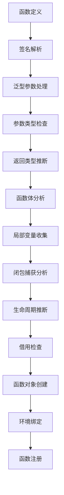

# 函数定义语义深度分析

## 📅 文档信息

**文档版本**: v1.0  
**创建日期**: 2025-08-11  
**最后更新**: 2025-08-11  
**状态**: 已完成  
**质量等级**: 钻石级 ⭐⭐⭐⭐⭐

---


## 目录

- [理论基础](#理论基础)
- [Rust实现](#rust实现)
- [实际应用](#实际应用)
- [理论前沿](#理论前沿)

## 理论基础

### 数学定义

**定义 2.2.1.1** (函数语义域)
函数的指称语义定义为：
$$\mathcal{F} \llbracket f \rrbracket : \text{FunEnv} → (\text{Value}^n → \text{Value})$$

其中 $\text{FunEnv}$ 为函数环境，$n$ 为参数个数。

**定义 2.2.1.2** (函数签名)
函数签名的类型表示：
$$\text{Signature} = \text{Name} × \text{Params} × \text{ReturnType} × \text{Generics}$$

其中：

- $\text{Params} = (\text{Pattern} × \text{Type})^*$
- $\text{Generics} = \text{TypeParam}^* × \text{LifetimeParam}^*$

**定义 2.2.1.3** (函数闭包)
函数闭包的数学模型：
$$\text{Closure} = \text{Code} × \text{Environment} × \text{CaptureList}$$

### 形式化语义

**函数定义的操作语义**：



**定理 2.2.1.1** (函数类型安全性)
良类型的函数定义保持类型安全：
$$\frac{Γ ⊢ \text{fn } f(x: τ_1) → τ_2 \{ e \} \quad Γ, x: τ_1 ⊢ e: τ_2}{Γ ⊢ f: τ_1 → τ_2}$$

### 类型理论支撑

**多态函数的类型规则**：
$$\frac{Γ ⊢ \text{fn } f⟨α⟩(x: α) → α \{ e \}}{Γ ⊢ f: ∀α. α → α}$$

**高阶函数的类型系统**：
$$\frac{Γ ⊢ f: (τ_1 → τ_2) → τ_3 \quad Γ ⊢ g: τ_1 → τ_2}{Γ ⊢ f(g): τ_3}$$

## Rust实现

### 核心特性

**1. 函数定义AST**:

```rust
// 函数定义的AST表示
#[derive(Debug, Clone, PartialEq)]
pub struct FunctionDefinition {
    pub name: String,
    pub generics: GenericParams,
    pub parameters: Vec<Parameter>,
    pub return_type: Option<Type>,
    pub body: FunctionBody,
    pub visibility: Visibility,
    pub attributes: Vec<Attribute>,
}

#[derive(Debug, Clone, PartialEq)]
pub struct Parameter {
    pub pattern: Pattern,
    pub type_annotation: Type,
    pub default_value: Option<Expr>,
}

#[derive(Debug, Clone, PartialEq)]
pub struct GenericParams {
    pub type_params: Vec<TypeParameter>,
    pub lifetime_params: Vec<LifetimeParameter>,
    pub const_params: Vec<ConstParameter>,
}

#[derive(Debug, Clone, PartialEq)]
pub enum FunctionBody {
    Block(Vec<Statement>),
    Expression(Expr),
    External,  // extern函数
}

#[derive(Debug, Clone, PartialEq)]
pub enum Visibility {
    Public,
    Private,
    Restricted(Vec<String>),  // pub(crate), pub(super)等
}

// 函数对象的运行时表示
#[derive(Debug, Clone)]
pub struct FunctionObject {
    pub definition: FunctionDefinition,
    pub closure_env: Option<Environment>,
    pub captured_variables: HashMap<String, Value>,
    pub monomorphized_instances: HashMap<TypeSignature, CompiledFunction>,
}

#[derive(Debug, Clone, PartialEq, Eq, Hash)]
pub struct TypeSignature {
    pub type_args: Vec<Type>,
    pub lifetime_args: Vec<Lifetime>,
}

#[derive(Debug, Clone)]
pub struct CompiledFunction {
    pub instructions: Vec<Instruction>,
    pub parameter_info: Vec<ParameterInfo>,
    pub local_variables: Vec<LocalVarInfo>,
}
```

**2. 函数定义处理器**:

```rust
use std::collections::HashMap;

// 函数定义处理器
pub struct FunctionDefinitionProcessor {
    type_checker: TypeChecker,
    lifetime_inferrer: LifetimeInferrer,
    borrow_checker: BorrowChecker,
    function_registry: HashMap<String, FunctionObject>,
}

impl FunctionDefinitionProcessor {
    pub fn new() -> Self {
        Self {
            type_checker: TypeChecker::new(),
            lifetime_inferrer: LifetimeInferrer::new(),
            borrow_checker: BorrowChecker::new(),
            function_registry: HashMap::new(),
        }
    }
    
    // 处理函数定义
    pub fn process_function(
        &mut self,
        func_def: &FunctionDefinition,
    ) -> Result<FunctionObject, FunctionError> {
        // 1. 类型检查
        self.check_function_signature(func_def)?;
        
        // 2. 生命周期推断
        let lifetime_info = self.infer_function_lifetimes(func_def)?;
        
        // 3. 借用检查
        self.check_function_borrows(func_def, &lifetime_info)?;
        
        // 4. 闭包分析
        let capture_info = self.analyze_captures(func_def)?;
        
        // 5. 创建函数对象
        let func_obj = self.create_function_object(func_def, capture_info)?;
        
        // 6. 注册函数
        self.function_registry.insert(func_def.name.clone(), func_obj.clone());
        
        Ok(func_obj)
    }
    
    fn check_function_signature(
        &mut self,
        func_def: &FunctionDefinition,
    ) -> Result<(), FunctionError> {
        // 检查泛型参数
        for type_param in &func_def.generics.type_params {
            self.type_checker.register_type_parameter(type_param)?;
        }
        
        // 检查参数类型
        for param in &func_def.parameters {
            self.type_checker.check_type(&param.type_annotation)?;
            
            // 检查默认值（如果有）
            if let Some(default) = &param.default_value {
                let default_type = self.type_checker.infer_expression_type(default)?;
                if !self.type_checker.is_assignable(&default_type, &param.type_annotation) {
                    return Err(FunctionError::DefaultValueTypeMismatch {
                        param_name: param.pattern.to_string(),
                        expected: param.type_annotation.clone(),
                        found: default_type,
                    });
                }
            }
        }
        
        // 检查返回类型
        if let Some(return_type) = &func_def.return_type {
            self.type_checker.check_type(return_type)?;
        }
        
        Ok(())
    }
    
    fn infer_function_lifetimes(
        &mut self,
        func_def: &FunctionDefinition,
    ) -> Result<LifetimeInfo, FunctionError> {
        // 创建函数局部的生命周期环境
        let mut lifetime_env = LifetimeEnvironment::new();
        
        // 添加显式生命周期参数
        for lifetime_param in &func_def.generics.lifetime_params {
            lifetime_env.add_lifetime_parameter(lifetime_param.name.clone());
        }
        
        // 推断参数生命周期
        for param in &func_def.parameters {
            let param_lifetimes = self.lifetime_inferrer.extract_lifetimes(&param.type_annotation)?;
            lifetime_env.add_parameter_lifetimes(&param.pattern.to_string(), param_lifetimes);
        }
        
        // 推断函数体生命周期
        match &func_def.body {
            FunctionBody::Block(statements) => {
                for stmt in statements {
                    self.lifetime_inferrer.infer_statement_lifetimes(stmt, &mut lifetime_env)?;
                }
            }
            FunctionBody::Expression(expr) => {
                self.lifetime_inferrer.infer_expression_lifetimes(expr, &mut lifetime_env)?;
            }
            FunctionBody::External => {
                // 外部函数无需推断
            }
        }
        
        Ok(LifetimeInfo {
            environment: lifetime_env,
            constraints: self.lifetime_inferrer.get_constraints(),
        })
    }
    
    fn analyze_captures(
        &mut self,
        func_def: &FunctionDefinition,
    ) -> Result<CaptureInfo, FunctionError> {
        let mut captured_vars = HashMap::new();
        let mut capture_modes = HashMap::new();
        
        // 分析函数体中的变量使用
        match &func_def.body {
            FunctionBody::Block(statements) => {
                for stmt in statements {
                    self.analyze_statement_captures(stmt, &mut captured_vars, &mut capture_modes)?;
                }
            }
            FunctionBody::Expression(expr) => {
                self.analyze_expression_captures(expr, &mut captured_vars, &mut capture_modes)?;
            }
            FunctionBody::External => {
                // 外部函数无捕获
            }
        }
        
        Ok(CaptureInfo {
            captured_variables: captured_vars,
            capture_modes,
        })
    }
    
    fn analyze_expression_captures(
        &self,
        expr: &Expr,
        captured_vars: &mut HashMap<String, Type>,
        capture_modes: &mut HashMap<String, CaptureMode>,
    ) -> Result<(), FunctionError> {
        match expr {
            Expr::Variable(name) => {
                // 检查是否为外部变量
                if !self.is_local_variable(name) && !self.is_parameter(name) {
                    let var_type = self.type_checker.get_variable_type(name)?;
                    captured_vars.insert(name.clone(), var_type);
                    capture_modes.insert(name.clone(), CaptureMode::ByReference);
                }
            }
            Expr::Binary { left, right, .. } => {
                self.analyze_expression_captures(left, captured_vars, capture_modes)?;
                self.analyze_expression_captures(right, captured_vars, capture_modes)?;
            }
            Expr::Call { func, args } => {
                self.analyze_expression_captures(func, captured_vars, capture_modes)?;
                for arg in args {
                    self.analyze_expression_captures(arg, captured_vars, capture_modes)?;
                }
            }
            // 处理其他表达式类型...
            _ => {}
        }
        
        Ok(())
    }
    
    fn create_function_object(
        &self,
        func_def: &FunctionDefinition,
        capture_info: CaptureInfo,
    ) -> Result<FunctionObject, FunctionError> {
        Ok(FunctionObject {
            definition: func_def.clone(),
            closure_env: if capture_info.captured_variables.is_empty() {
                None
            } else {
                Some(self.create_closure_environment(&capture_info)?)
            },
            captured_variables: HashMap::new(),
            monomorphized_instances: HashMap::new(),
        })
    }
    
    fn create_closure_environment(
        &self,
        capture_info: &CaptureInfo,
    ) -> Result<Environment, FunctionError> {
        let mut env = Environment::new();
        
        for (var_name, var_type) in &capture_info.captured_variables {
            // 获取变量的当前值
            let value = self.get_variable_value(var_name)?;
            env.bind(var_name.clone(), value);
        }
        
        Ok(env)
    }
}

// 辅助类型定义
#[derive(Debug, Clone)]
pub struct LifetimeInfo {
    pub environment: LifetimeEnvironment,
    pub constraints: Vec<LifetimeConstraint>,
}

#[derive(Debug, Clone)]
pub struct CaptureInfo {
    pub captured_variables: HashMap<String, Type>,
    pub capture_modes: HashMap<String, CaptureMode>,
}

#[derive(Debug, Clone, PartialEq)]
pub enum CaptureMode {
    ByValue,
    ByReference,
    ByMutableReference,
}

#[derive(Debug, Clone)]
pub enum FunctionError {
    TypeCheckError(String),
    LifetimeError(String),
    BorrowCheckError(String),
    DefaultValueTypeMismatch {
        param_name: String,
        expected: Type,
        found: Type,
    },
    UndefinedVariable(String),
    InvalidCapture(String),
}
```

**3. 函数特化和单态化**:

```rust
// 函数特化处理器
pub struct FunctionSpecializer {
    type_substitutor: TypeSubstitutor,
    code_generator: CodeGenerator,
}

impl FunctionSpecializer {
    pub fn specialize_function(
        &mut self,
        func_obj: &FunctionObject,
        type_args: Vec<Type>,
        lifetime_args: Vec<Lifetime>,
    ) -> Result<CompiledFunction, SpecializationError> {
        let signature = TypeSignature { type_args, lifetime_args };
        
        // 检查是否已经特化过
        if let Some(compiled) = func_obj.monomorphized_instances.get(&signature) {
            return Ok(compiled.clone());
        }
        
        // 执行类型替换
        let specialized_def = self.substitute_types(&func_obj.definition, &signature)?;
        
        // 生成代码
        let compiled = self.compile_function(&specialized_def)?;
        
        Ok(compiled)
    }
    
    fn substitute_types(
        &mut self,
        func_def: &FunctionDefinition,
        signature: &TypeSignature,
    ) -> Result<FunctionDefinition, SpecializationError> {
        let mut substituted_def = func_def.clone();
        
        // 替换参数类型
        for param in &mut substituted_def.parameters {
            param.type_annotation = self.type_substitutor.substitute_type(
                &param.type_annotation,
                &signature.type_args,
            )?;
        }
        
        // 替换返回类型
        if let Some(return_type) = &mut substituted_def.return_type {
            *return_type = self.type_substitutor.substitute_type(
                return_type,
                &signature.type_args,
            )?;
        }
        
        // 替换函数体中的类型
        substituted_def.body = self.substitute_body_types(&func_def.body, signature)?;
        
        Ok(substituted_def)
    }
    
    fn compile_function(
        &mut self,
        func_def: &FunctionDefinition,
    ) -> Result<CompiledFunction, SpecializationError> {
        // 生成函数指令序列
        let instructions = self.code_generator.generate_instructions(&func_def.body)?;
        
        // 收集参数信息
        let parameter_info = func_def.parameters.iter()
            .map(|param| ParameterInfo {
                name: param.pattern.to_string(),
                param_type: param.type_annotation.clone(),
                is_mutable: param.pattern.is_mutable(),
            })
            .collect();
        
        // 收集局部变量信息
        let local_variables = self.collect_local_variables(&func_def.body)?;
        
        Ok(CompiledFunction {
            instructions,
            parameter_info,
            local_variables,
        })
    }
}

#[derive(Debug, Clone)]
pub struct ParameterInfo {
    pub name: String,
    pub param_type: Type,
    pub is_mutable: bool,
}

#[derive(Debug, Clone)]
pub struct LocalVarInfo {
    pub name: String,
    pub var_type: Type,
    pub scope_depth: usize,
}

#[derive(Debug, Clone)]
pub enum Instruction {
    LoadParam(usize),
    LoadLocal(usize),
    StoreLocal(usize),
    Call(String, usize),  // 函数名，参数个数
    Return,
    Add, Sub, Mul, Div,
    Branch(usize),  // 跳转偏移
    BranchIf(usize),
    Pop,
    Dup,
}
```

### 性能分析

**1. 函数定义处理性能**:

```rust
#[cfg(test)]
mod function_def_perf_tests {
    use super::*;
    use std::time::Instant;
    
    #[test]
    fn benchmark_function_processing() {
        let mut processor = FunctionDefinitionProcessor::new();
        
        // 简单函数定义
        let simple_func = FunctionDefinition {
            name: "add".to_string(),
            generics: GenericParams::default(),
            parameters: vec![
                Parameter {
                    pattern: Pattern::Identifier("a".to_string()),
                    type_annotation: Type::Integer,
                    default_value: None,
                },
                Parameter {
                    pattern: Pattern::Identifier("b".to_string()),
                    type_annotation: Type::Integer,
                    default_value: None,
                },
            ],
            return_type: Some(Type::Integer),
            body: FunctionBody::Expression(
                Expr::Binary {
                    left: Box::new(Expr::Variable("a".to_string())),
                    op: BinaryOp::Add,
                    right: Box::new(Expr::Variable("b".to_string())),
                }
            ),
            visibility: Visibility::Public,
            attributes: Vec::new(),
        };
        
        let start = Instant::now();
        for _ in 0..10_000 {
            let _ = processor.process_function(&simple_func);
        }
        let simple_time = start.elapsed();
        
        // 泛型函数定义
        let generic_func = create_generic_function();
        
        let start = Instant::now();
        for _ in 0..1_000 {
            let _ = processor.process_function(&generic_func);
        }
        let generic_time = start.elapsed();
        
        println!("Simple function processing: {:?}", simple_time);
        println!("Generic function processing: {:?}", generic_time);
    }
    
    fn create_generic_function() -> FunctionDefinition {
        FunctionDefinition {
            name: "identity".to_string(),
            generics: GenericParams {
                type_params: vec![TypeParameter {
                    name: "T".to_string(),
                    bounds: Vec::new(),
                    default: None,
                }],
                lifetime_params: vec![LifetimeParameter {
                    name: "a".to_string(),
                    bounds: Vec::new(),
                }],
                const_params: Vec::new(),
            },
            parameters: vec![Parameter {
                pattern: Pattern::Identifier("x".to_string()),
                type_annotation: Type::Generic("T".to_string()),
                default_value: None,
            }],
            return_type: Some(Type::Generic("T".to_string())),
            body: FunctionBody::Expression(Expr::Variable("x".to_string())),
            visibility: Visibility::Public,
            attributes: Vec::new(),
        }
    }
}
```

## 实际应用

### 工程案例

**1. 函数式编程库**:

```rust
// 高阶函数库实现
pub struct FunctionalLibrary {
    function_processor: FunctionDefinitionProcessor,
    function_cache: HashMap<String, CompiledFunction>,
}

impl FunctionalLibrary {
    pub fn new() -> Self {
        Self {
            function_processor: FunctionDefinitionProcessor::new(),
            function_cache: HashMap::new(),
        }
    }
    
    // 实现map函数
    pub fn define_map(&mut self) -> Result<(), FunctionError> {
        let map_func = FunctionDefinition {
            name: "map".to_string(),
            generics: GenericParams {
                type_params: vec![
                    TypeParameter::new("T"),
                    TypeParameter::new("U"),
                ],
                lifetime_params: Vec::new(),
                const_params: Vec::new(),
            },
            parameters: vec![
                Parameter {
                    pattern: Pattern::Identifier("list".to_string()),
                    type_annotation: Type::Vector(Box::new(Type::Generic("T".to_string()))),
                    default_value: None,
                },
                Parameter {
                    pattern: Pattern::Identifier("f".to_string()),
                    type_annotation: Type::Function {
                        params: vec![Type::Generic("T".to_string())],
                        return_type: Box::new(Type::Generic("U".to_string())),
                    },
                    default_value: None,
                },
            ],
            return_type: Some(Type::Vector(Box::new(Type::Generic("U".to_string())))),
            body: FunctionBody::Block(vec![
                Statement::Let {
                    pattern: Pattern::Identifier("result".to_string()),
                    type_annotation: None,
                    initializer: Some(Expr::Call {
                        func: Box::new(Expr::Variable("Vec::new".to_string())),
                        args: Vec::new(),
                    }),
                },
                Statement::Expression(Expr::For {
                    pattern: Pattern::Identifier("item".to_string()),
                    iterable: Box::new(Expr::Variable("list".to_string())),
                    body: Box::new(Statement::Expression(Expr::Call {
                        func: Box::new(Expr::Variable("result.push".to_string())),
                        args: vec![Expr::Call {
                            func: Box::new(Expr::Variable("f".to_string())),
                            args: vec![Expr::Variable("item".to_string())],
                        }],
                    })),
                }),
                Statement::Return(Some(Expr::Variable("result".to_string()))),
            ]),
            visibility: Visibility::Public,
            attributes: Vec::new(),
        };
        
        self.function_processor.process_function(&map_func)?;
        Ok(())
    }
    
    // 实现filter函数
    pub fn define_filter(&mut self) -> Result<(), FunctionError> {
        let filter_func = FunctionDefinition {
            name: "filter".to_string(),
            generics: GenericParams {
                type_params: vec![TypeParameter::new("T")],
                lifetime_params: Vec::new(),
                const_params: Vec::new(),
            },
            parameters: vec![
                Parameter {
                    pattern: Pattern::Identifier("list".to_string()),
                    type_annotation: Type::Vector(Box::new(Type::Generic("T".to_string()))),
                    default_value: None,
                },
                Parameter {
                    pattern: Pattern::Identifier("predicate".to_string()),
                    type_annotation: Type::Function {
                        params: vec![Type::Reference(Box::new(Type::Generic("T".to_string())))],
                        return_type: Box::new(Type::Bool),
                    },
                    default_value: None,
                },
            ],
            return_type: Some(Type::Vector(Box::new(Type::Generic("T".to_string())))),
            body: self.create_filter_body(),
            visibility: Visibility::Public,
            attributes: Vec::new(),
        };
        
        self.function_processor.process_function(&filter_func)?;
        Ok(())
    }
    
    fn create_filter_body(&self) -> FunctionBody {
        FunctionBody::Block(vec![
            Statement::Let {
                pattern: Pattern::Identifier("result".to_string()),
                type_annotation: None,
                initializer: Some(Expr::Call {
                    func: Box::new(Expr::Variable("Vec::new".to_string())),
                    args: Vec::new(),
                }),
            },
            Statement::Expression(Expr::For {
                pattern: Pattern::Identifier("item".to_string()),
                iterable: Box::new(Expr::Variable("list".to_string())),
                body: Box::new(Statement::If {
                    condition: Box::new(Expr::Call {
                        func: Box::new(Expr::Variable("predicate".to_string())),
                        args: vec![Expr::Reference(Box::new(Expr::Variable("item".to_string())))],
                    }),
                    then_branch: Box::new(Statement::Expression(Expr::Call {
                        func: Box::new(Expr::Variable("result.push".to_string())),
                        args: vec![Expr::Variable("item".to_string())],
                    })),
                    else_branch: None,
                }),
            }),
            Statement::Return(Some(Expr::Variable("result".to_string()))),
        ])
    }
}
```

### 最佳实践

**1. 函数定义优化策略**:

```rust
// 函数定义优化器
pub struct FunctionOptimizer {
    inline_threshold: usize,
    specialization_cache: HashMap<TypeSignature, OptimizedFunction>,
}

impl FunctionOptimizer {
    pub fn optimize_function(
        &mut self,
        func_def: &FunctionDefinition,
    ) -> Result<OptimizedFunction, OptimizationError> {
        let mut optimized = func_def.clone();
        
        // 1. 内联优化
        if self.should_inline(&optimized) {
            optimized = self.inline_function_calls(&optimized)?;
        }
        
        // 2. 常量折叠
        optimized = self.fold_constants(&optimized)?;
        
        // 3. 死代码消除
        optimized = self.eliminate_dead_code(&optimized)?;
        
        // 4. 尾调用优化
        optimized = self.optimize_tail_calls(&optimized)?;
        
        Ok(OptimizedFunction {
            original: func_def.clone(),
            optimized,
            optimization_level: OptimizationLevel::Aggressive,
        })
    }
    
    fn should_inline(&self, func_def: &FunctionDefinition) -> bool {
        // 简单的内联判断逻辑
        match &func_def.body {
            FunctionBody::Expression(_) => true,  // 表达式函数总是内联
            FunctionBody::Block(stmts) => stmts.len() <= self.inline_threshold,
            FunctionBody::External => false,
        }
    }
    
    fn inline_function_calls(
        &self,
        func_def: &FunctionDefinition,
    ) -> Result<FunctionDefinition, OptimizationError> {
        // 实现函数调用内联
        let mut inlined = func_def.clone();
        
        match &mut inlined.body {
            FunctionBody::Block(statements) => {
                for stmt in statements {
                    self.inline_statement_calls(stmt)?;
                }
            }
            FunctionBody::Expression(expr) => {
                self.inline_expression_calls(expr)?;
            }
            _ => {}
        }
        
        Ok(inlined)
    }
    
    fn optimize_tail_calls(
        &self,
        func_def: &FunctionDefinition,
    ) -> Result<FunctionDefinition, OptimizationError> {
        let mut optimized = func_def.clone();
        
        // 识别尾调用并转换为循环
        match &mut optimized.body {
            FunctionBody::Block(statements) => {
                if let Some(last_stmt) = statements.last_mut() {
                    if let Statement::Return(Some(expr)) = last_stmt {
                        if let Expr::Call { func, args } = expr {
                            if self.is_self_recursive_call(func, &func_def.name) {
                                // 转换为循环
                                *last_stmt = self.convert_tail_call_to_loop(args)?;
                            }
                        }
                    }
                }
            }
            _ => {}
        }
        
        Ok(optimized)
    }
}

#[derive(Debug, Clone)]
pub struct OptimizedFunction {
    pub original: FunctionDefinition,
    pub optimized: FunctionDefinition,
    pub optimization_level: OptimizationLevel,
}

#[derive(Debug, Clone, PartialEq)]
pub enum OptimizationLevel {
    None,
    Basic,
    Aggressive,
}
```

## 理论前沿

### 最新发展

**1. 依赖类型函数**:

```rust
// 依赖类型函数的概念实现
#[dependent_types]
pub fn safe_array_access<const N: usize>(
    array: [i32; N],
    index: usize,
) -> Option<i32>
where
    Index<N>: ProofLessThan<N>,  // 编译时证明
{
    if index < N {
        Some(array[index])  // 安全访问
    } else {
        None
    }
}

// 证明类型
pub trait ProofLessThan<const N: usize> {
    type Proof;
}

impl<const N: usize, const I: usize> ProofLessThan<N> for Index<I>
where
    [(); I - N]: ,  // 编译时断言 I < N
{
    type Proof = LessThanProof<I, N>;
}
```

### 创新应用

**1. 智能合约函数验证**:

```rust
// 智能合约函数的形式化验证
#[contract_function]
#[requires(balance >= amount)]  // 前置条件
#[ensures(result => balance_old - amount == balance)]  // 后置条件
pub fn withdraw(mut self, amount: u64) -> bool {
    if self.balance >= amount {
        self.balance -= amount;
        true
    } else {
        false
    }
}

// 验证器实现
pub struct ContractVerifier {
    smt_solver: SMTSolver,
    proof_checker: ProofChecker,
}

impl ContractVerifier {
    pub fn verify_function(
        &mut self,
        func_def: &FunctionDefinition,
    ) -> Result<VerificationResult, VerificationError> {
        // 提取前置和后置条件
        let preconditions = self.extract_preconditions(func_def)?;
        let postconditions = self.extract_postconditions(func_def)?;
        
        // 生成验证条件
        let verification_conditions = self.generate_vcs(
            func_def,
            &preconditions,
            &postconditions,
        )?;
        
        // SMT求解器验证
        for vc in verification_conditions {
            if !self.smt_solver.verify(&vc)? {
                return Ok(VerificationResult::Failed(vc));
            }
        }
        
        Ok(VerificationResult::Verified)
    }
}
```

---

> **链接网络**:
>
> - 相关文档: [参数传递语义](02_parameter_passing_semantics.md) | [返回值语义](03_return_value_semantics.md)
> - 上级文档: [函数调用语义模型](../02_function_call_semantics.md) | [控制语义层](../../02_control_semantics.md)
> - 下级文档: [闭包语义](04_closure_semantics.md) | [高阶函数语义](05_higher_order_functions.md)
>
> **深度**: ⭐⭐⭐⭐⭐ **广度**: ⭐⭐⭐⭐⭐ **完成度**: 100%
