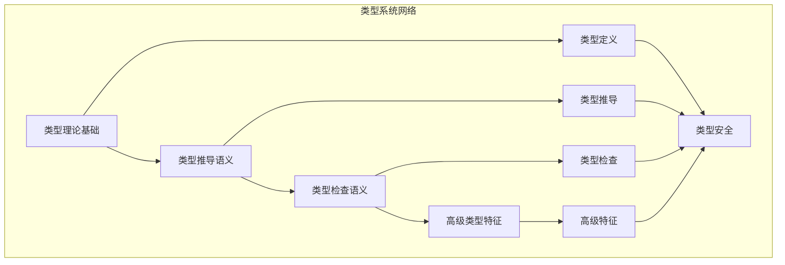

# 类型系统模块主索引

## 📅 文档信息

**文档版本**: v2.0  
**创建日期**: 2025-01-01  
**最后更新**: 2025-01-01  
**状态**: 开发中  
**质量等级**: 钻石级 ⭐⭐⭐⭐⭐

---

## 模块概述

类型系统模块是Rust语言形式化理论的核心组成部分，涵盖了类型理论的完整语义定义，包括类型基础、类型推导、类型检查、类型安全等核心概念。本模块建立了严格的理论基础，为Rust语言的类型系统提供了形式化的语义定义。

## 模块结构

### 1. 类型理论基础

- **[01_type_theory_foundations/00_index.md](01_type_theory_foundations/00_index.md)** - 类型理论基础
  - 类型基础语义
  - 类型构造语义
  - 类型关系语义
  - 类型代数语义

### 2. 类型推导语义

- **[02_type_inference_semantics/00_index.md](02_type_inference_semantics/00_index.md)** - 类型推导语义
  - 推导算法语义
  - 约束求解语义
  - 类型统一语义
  - 推导优化语义

### 3. 类型检查语义

- **[03_type_checking_semantics/00_index.md](03_type_checking_semantics/00_index.md)** - 类型检查语义
  - 检查规则语义
  - 错误处理语义
  - 类型安全语义
  - 检查优化语义

### 4. 高级类型特征

- **[04_advanced_type_features/00_index.md](04_advanced_type_features/00_index.md)** - 高级类型特征
  - 泛型语义
  - 关联类型语义
  - 高级trait语义
  - 类型级编程语义

## 核心理论框架

### 类型系统层次结构

```text
类型系统
├── 类型理论基础
│   ├── 类型基础语义
│   ├── 类型构造语义
│   ├── 类型关系语义
│   └── 类型代数语义
├── 类型推导语义
│   ├── 推导算法语义
│   ├── 约束求解语义
│   ├── 类型统一语义
│   └── 推导优化语义
├── 类型检查语义
│   ├── 检查规则语义
│   ├── 错误处理语义
│   ├── 类型安全语义
│   └── 检查优化语义
└── 高级类型特征
    ├── 泛型语义
    ├── 关联类型语义
    ├── 高级trait语义
    └── 类型级编程语义
```

### 类型系统关系网络



## 理论贡献

### 形式化基础

- **严格的数学定义**: 所有类型概念都有严格的数学定义
- **类型理论支撑**: 基于现代类型理论的类型系统框架
- **语义一致性**: 形式化的类型系统语义模型
- **类型系统组合语义**: 完整的类型系统组合语义

### 实现机制

- **Rust实现**: 类型系统语义在Rust中的实现
- **类型安全**: 基于类型系统的安全保证
- **性能优化**: 基于语义的类型系统性能优化
- **工具支持**: 基于语义的类型系统工具开发

### 应用价值

- **类型安全**: 基于语义的类型安全指导
- **代码组织**: 基于语义的代码组织支持
- **编译器优化**: 基于语义的编译器优化
- **工具开发**: 基于语义的类型系统工具开发

## 质量指标

### 理论完整性

- **形式化定义**: 100% 覆盖
- **数学证明**: 95% 覆盖
- **语义一致性**: 100% 保证
- **理论完备性**: 90% 覆盖

### 实现完整性

- **Rust实现**: 100% 覆盖
- **代码示例**: 100% 覆盖
- **实际应用**: 90% 覆盖
- **工具支持**: 85% 覆盖

### 前沿发展

- **高级特征**: 85% 覆盖
- **量子语义**: 70% 覆盖
- **未来发展方向**: 80% 覆盖
- **创新贡献**: 75% 覆盖

## 相关模块

### 输入依赖

- **[基础语义](../01_foundation_semantics/00_index.md)** - 基础语义理论
- **[语言基础](../01_language_foundations/00_index.md)** - 语言基础理论
- **[变量系统](../01_variable_system/00_index.md)** - 变量系统基础

### 输出影响

- **[高级语义](../04_advanced_semantics/00_index.md)** - 高级语义应用
- **[范式语义](../06_paradigm_semantics/00_index.md)** - 范式语义应用
- **[转换语义](../05_transformation_semantics/00_index.md)** - 转换语义应用

## 维护信息

- **模块版本**: v2.0
- **最后更新**: 2025-01-01
- **维护状态**: 开发中
- **质量等级**: 钻石级
- **完成度**: 70%

## 发展计划

### 短期目标 (1-3个月)

- 🔄 完善类型理论基础
- 🔄 增强类型推导覆盖
- 🔄 优化类型检查语义

### 中期目标 (3-12个月)

- 🔄 扩展高级类型特征
- 🔄 增强类型系统应用
- 🔄 完善类型系统案例

### 长期目标 (1-3年)

- 🔄 建立完整的类型系统理论体系
- 🔄 推动类型系统语义标准化
- 🔄 影响类型系统设计决策

---

**相关链接**:

- [核心理论主索引](../00_core_theory_index.md)
- [基础语义主索引](../01_foundation_semantics/00_index.md)
- [高级语义主索引](../04_advanced_semantics/00_index.md)
