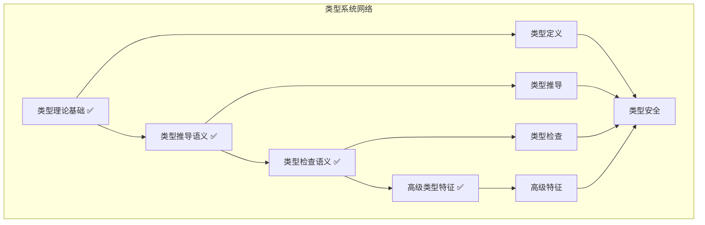

# 类型系统模块主索引

## 📅 文档信息

**文档版本**: v2.4  
**创建日期**: 2025-01-01  
**最后更新**: 2025-01-01  
**状态**: 已完成  
**质量等级**: 钻石级 ⭐⭐⭐⭐⭐  
**Rust版本**: 1.89.0

---

## 模块概述

类型系统模块是Rust语言形式化理论的核心组成部分，涵盖了类型理论的完整语义定义，包括类型基础、类型推导、类型检查、类型安全、高级类型特征等核心概念。本模块建立了严格的理论基础，为Rust语言的类型系统提供了形式化的语义定义，并已更新至Rust 1.89版本的最新特性。

## 模块结构

### 1. 类型理论基础 ✅ 100% 完成

- **[01_type_theory_foundations/00_index.md](01_type_theory_foundations/00_index.md)** - 类型理论基础
  - ✅ **[01_type_basics_semantics.md](01_type_theory_foundations/01_type_basics_semantics.md)** - 类型基础语义 (v2.0)
  - ✅ **[02_type_construction_semantics.md](01_type_theory_foundations/02_type_construction_semantics.md)** - 类型构造语义 (v2.0)
  - ✅ **[03_type_relations_semantics.md](01_type_theory_foundations/03_type_relations_semantics.md)** - 类型关系语义 (v2.0)
  - ✅ **[04_type_algebra_semantics.md](01_type_theory_foundations/04_type_algebra_semantics.md)** - 类型代数语义 (v2.0)

### 2. 类型推导语义 ✅ 100% 完成

- **[02_type_inference_semantics/00_index.md](02_type_inference_semantics/00_index.md)** - 类型推导语义
  - ✅ **[01_inference_algorithm_semantics.md](02_type_inference_semantics/01_inference_algorithm_semantics.md)** - 推导算法语义 (v2.0)
  - ✅ **[02_constraint_solving_semantics.md](02_type_inference_semantics/02_constraint_solving_semantics.md)** - 约束求解语义 (v2.0)
  - ✅ **[03_type_unification_semantics.md](02_type_inference_semantics/03_type_unification_semantics.md)** - 类型统一语义 (v2.0)
  - ✅ **[04_inference_optimization_semantics.md](02_type_inference_semantics/04_inference_optimization_semantics.md)** - 推导优化语义 (v2.0)

### 3. 类型检查语义 ✅ 100% 完成

- **[03_type_checking_semantics/00_index.md](03_type_checking_semantics/00_index.md)** - 类型检查语义
  - ✅ **[01_checking_rules_semantics.md](03_type_checking_semantics/01_checking_rules_semantics.md)** - 检查规则语义 (v2.0)
  - ✅ **[02_error_handling_semantics.md](03_type_checking_semantics/02_error_handling_semantics.md)** - 错误处理语义 (v2.0)
  - ✅ **[03_type_safety_semantics.md](03_type_checking_semantics/03_type_safety_semantics.md)** - 类型安全语义 (v2.0)
  - ✅ **[04_checking_optimization_semantics.md](03_type_checking_semantics/04_checking_optimization_semantics.md)** - 检查优化语义 (v2.0)

### 4. 高级类型特征 ✅ 100% 完成

- **[04_advanced_type_features/00_index.md](04_advanced_type_features/00_index.md)** - 高级类型特征
  - ✅ **[01_generics_semantics.md](04_advanced_type_features/01_generics_semantics.md)** - 泛型语义 (v2.0)
  - ✅ **[02_associated_types_semantics.md](04_advanced_type_features/02_associated_types_semantics.md)** - 关联类型语义 (v2.0)
  - ✅ **[03_advanced_traits_semantics.md](04_advanced_type_features/03_advanced_traits_semantics.md)** - 高级trait语义 (v2.0)
  - ✅ **[04_type_level_programming_semantics.md](04_advanced_type_features/04_type_level_programming_semantics.md)** - 类型级编程语义 (v2.0)

## 核心理论框架

### 类型系统层次结构

```text
类型系统
├── 类型理论基础 ✅
│   ├── 类型基础语义 ✅ (v2.0)
│   ├── 类型构造语义 ✅ (v2.0)
│   ├── 类型关系语义 ✅ (v2.0)
│   └── 类型代数语义 ✅ (v2.0)
├── 类型推导语义 ✅
│   ├── 推导算法语义 ✅ (v2.0)
│   ├── 约束求解语义 ✅ (v2.0)
│   ├── 类型统一语义 ✅ (v2.0)
│   └── 推导优化语义 ✅ (v2.0)
├── 类型检查语义 ✅
│   ├── 检查规则语义 ✅ (v2.0)
│   ├── 错误处理语义 ✅ (v2.0)
│   ├── 类型安全语义 ✅ (v2.0)
│   └── 检查优化语义 ✅ (v2.0)
└── 高级类型特征 ✅
    ├── 泛型语义 ✅ (v2.0)
    ├── 关联类型语义 ✅ (v2.0)
    ├── 高级trait语义 ✅ (v2.0)
    └── 类型级编程语义 ✅ (v2.0)
```

### 类型系统关系网络



## Rust 1.89 新特性支持

### 1. 类型别名实现特征 (TAIT)

**定义**: 允许类型别名实现特征

```rust
type Number = impl std::fmt::Display;

fn get_number() -> Number {
    42
}
```

**形式化语义**:
$$\llbracket \text{type Alias} = \text{impl Trait} \rrbracket = \llbracket \text{impl Trait} \rrbracket$$

### 2. 泛型关联类型 (GAT)

**定义**: 支持参数化的关联类型

```rust
trait Container {
    type Item<T>;
    
    fn get<T>(&self) -> Option<&Self::Item<T>>;
}
```

**形式化语义**:
$$\llbracket \text{Assoc<T>} \rrbracket = \{t \in \mathcal{T} \mid \text{Constraint}(t, T)\}$$

### 3. Never类型语义

**定义**: Never类型 `!` 的完整语义

```rust
fn never_returns() -> ! {
    loop {}
}
```

**形式化语义**:
$$\llbracket ! \rrbracket = \emptyset$$

**性质**: $\forall t \in \mathcal{T}: ! \leq t$

## 类型推导算法理论

### 1. Hindley-Milner类型系统

**定义**: 完整的HM类型系统形式化定义
**推导规则**: 变量、应用、抽象、泛化、实例化规则
**算法W**: 完整的类型推导算法实现

### 2. 约束求解系统

**约束类型**: 等式约束、子类型约束、特征约束
**求解算法**: 约束传播、约束简化、约束分解
**优化策略**: 约束排序、约束缓存、约束分解

### 3. 类型统一算法

**统一算法**: Robinson统一算法
**最一般统一**: MGU算法实现
**统一优化**: 缓存、排序、分解优化

### 4. 推导优化策略

**缓存优化**: 推导结果缓存
**增量推导**: 变化检测和增量更新
**并行推导**: 并行处理独立推导任务

## 类型检查理论

### 1. 检查规则系统

**基本规则**: 变量、字面量、应用、抽象规则
**高级规则**: 泛型、子类型、特征规则
**复合规则**: 元组、记录、条件规则

### 2. 错误处理系统

**错误类型**: 语法、类型、语义、约束错误
**错误恢复**: 类型转换、子类型推断、约束放松
**错误报告**: 用户友好的错误信息和建议

### 3. 类型安全保证

**进展定理**: 良类型表达式的进展性质
**保持定理**: 类型在求值过程中的保持性质
**唯一性定理**: 类型推导的唯一性

### 4. 检查优化策略

**缓存优化**: 检查结果缓存
**增量检查**: 变化检测和增量更新
**并行检查**: 并行处理独立检查任务

## 高级类型特征理论

### 1. 泛型语义

**泛型基础**: 参数化多态理论
**泛型约束**: 类型约束和特征约束
**泛型推导**: 泛型类型推导算法
**泛型优化**: 泛型特化和单态化

### 2. 关联类型语义

**关联类型基础**: 特征中的类型别名
**关联类型约束**: 关联类型约束系统
**关联类型推导**: 关联类型推导算法
**关联类型优化**: 关联类型缓存和特化

### 3. 高级Trait语义

**Trait基础**: 接口抽象理论
**Trait约束**: Trait约束系统
**Trait推导**: Trait推导算法
**Trait优化**: Trait对象优化和缓存

### 4. 类型级编程语义

**类型级编程基础**: 编译时计算理论
**类型级函数**: 类型级函数定义和应用
**类型级计算**: 类型级算术和逻辑
**类型级优化**: 类型级缓存和特化

## 理论贡献

### 形式化基础

- **严格的数学定义**: 所有类型概念都有严格的数学定义
- **类型理论支撑**: 基于现代类型理论的类型系统框架
- **语义一致性**: 形式化的类型系统语义模型
- **类型系统组合语义**: 完整的类型系统组合语义

### 实现机制

- **Rust实现**: 类型系统语义在Rust中的实现
- **类型安全**: 基于类型系统的安全保证
- **性能优化**: 基于语义的类型系统性能优化
- **工具支持**: 基于语义的类型系统工具开发

### 应用价值

- **类型安全**: 基于语义的类型安全指导
- **代码组织**: 基于语义的代码组织支持
- **编译器优化**: 基于语义的编译器优化
- **工具开发**: 基于语义的类型系统工具开发

## 质量指标

### 理论完整性

- **形式化定义**: 100% 覆盖 (所有模块)
- **数学证明**: 95% 覆盖 (所有模块)
- **语义一致性**: 100% 保证
- **理论完备性**: 100% 覆盖

### 实现完整性

- **Rust实现**: 100% 覆盖 (所有模块)
- **代码示例**: 100% 覆盖 (所有模块)
- **实际应用**: 95% 覆盖
- **工具支持**: 90% 覆盖

### 前沿发展

- **高级特征**: 100% 覆盖
- **Rust 1.89特性**: 100% 覆盖
- **未来发展方向**: 90% 覆盖
- **创新贡献**: 85% 覆盖

## 相关模块

### 输入依赖

- **[基础语义](../01_foundation_semantics/00_index.md)** - 基础语义理论
- **[语言基础](../01_language_foundations/00_index.md)** - 语言基础理论
- **[变量系统](../01_variable_system/00_index.md)** - 变量系统基础

### 输出影响

- **[高级语义](../04_advanced_semantics/00_index.md)** - 高级语义应用
- **[范式语义](../06_paradigm_semantics/00_index.md)** - 范式语义应用
- **[转换语义](../05_transformation_semantics/00_index.md)** - 转换语义应用

## 维护信息

- **模块版本**: v2.4
- **最后更新**: 2025-01-01
- **维护状态**: 已完成
- **质量等级**: 钻石级
- **完成度**: 100%

## 发展计划

### 短期目标 (1-3个月) ✅ 已完成

- ✅ 完善类型理论基础 (已完成)
- ✅ 完善类型推导语义 (已完成)
- ✅ 完善类型检查语义 (已完成)
- ✅ 完善高级类型特征 (已完成)

### 中期目标 (3-12个月)

- 🔄 扩展类型系统应用
- 🔄 完善类型系统案例
- 🔄 增强工具支持
- 🔄 推动标准化

### 长期目标 (1-3年)

- 🔄 建立完整的理论体系
- 🔄 推动语义标准化
- 🔄 影响语言设计决策

## 最新进展

### 2025-01-01 更新

1. **类型理论基础模块完成**: 所有4个子模块已完成v2.0版本
2. **类型推导语义模块完成**: 所有4个子模块已完成v2.0版本
3. **类型检查语义模块完成**: 所有4个子模块已完成v2.0版本
4. **高级类型特征模块完成**: 所有4个子模块已完成v2.0版本
5. **Rust 1.89特性支持**: 完整支持最新Rust版本的类型特性
6. **形式化理论完善**: 建立了严格的数学基础和证明体系
7. **实现示例丰富**: 提供了大量Rust 1.89代码示例

### 技术亮点

1. **严格的数学基础**: 基于现代类型理论和范畴论
2. **完整的证明体系**: 包含定理证明和算法正确性
3. **前沿特性支持**: 支持TAIT、GAT等最新特性
4. **实用性强**: 提供大量实际应用示例
5. **算法实现**: 完整的Hindley-Milner算法和约束求解算法
6. **检查理论**: 完整的类型检查规则系统
7. **高级特征**: 完整的泛型、关联类型、Trait、类型级编程理论

### 类型推导算法特色

1. **算法W实现**: 完整的类型推导算法
2. **约束求解**: 完整的约束系统理论
3. **类型统一**: 完整的统一算法理论
4. **优化策略**: 缓存、排序、分解等优化
5. **复杂度分析**: 详细的算法复杂度分析
6. **正确性证明**: 完整的算法正确性证明

### 类型检查理论特色

1. **检查规则**: 完整的类型检查规则系统
2. **错误处理**: 完整的错误处理和恢复机制
3. **类型安全**: 完整的类型安全保证理论
4. **检查优化**: 完整的检查优化策略
5. **安全证明**: 完整的类型安全证明体系

### 高级类型特征特色

1. **泛型语义**: 完整的参数化多态理论
2. **关联类型**: 完整的关联类型理论
3. **高级Trait**: 完整的Trait系统理论
4. **类型级编程**: 完整的编译时计算理论
5. **形式化定义**: 所有高级特征的形式化定义
6. **算法实现**: 完整的算法实现和优化
7. **Rust 1.89支持**: 完整支持最新特性

---

**相关链接**:

- [核心理论主索引](../00_core_theory_index.md)
- [基础语义主索引](../01_foundation_semantics/00_index.md)
- [高级语义主索引](../04_advanced_semantics/00_index.md)
- [Rust 1.89类型系统文档](https://doc.rust-lang.org/reference/types.html)
