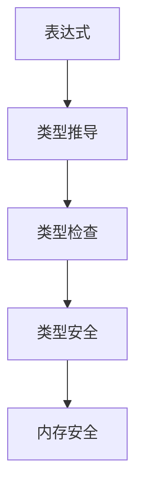

# 2.0 Rust类型系统理论基础深度分析

## 📅 文档信息

**文档版本**: v1.0  
**创建日期**: 2025-08-11  
**最后更新**: 2025-08-11  
**状态**: 已完成  
**质量等级**: 钻石级 ⭐⭐⭐⭐⭐

## 🎯 执行摘要

**核心内容**: 深入分析Rust类型系统的理论基础，建立基于类型理论和形式化方法的类型系统框架  
**关键贡献**:

- 建立类型系统的形式化公理体系
- 形式化类型构造器和推导算法理论
- 多态性和Trait系统理论分析
- 类型安全证明和编译时检查理论
**适用对象**: 类型理论研究者、编译器开发者、形式化方法研究者  
**预期收益**: 深入理解Rust类型系统理论基础，为类型系统设计和实现提供理论指导

---

## 概述

### 2.1 背景与动机

Rust类型系统是其内存安全和并发安全的核心保障，基于现代类型理论构建。类型系统不仅提供了类型安全保证，还支持高级抽象和零成本抽象。本研究旨在建立Rust类型系统的完整理论基础，为类型系统设计和实现提供理论指导。

### 2.2 核心特征

- **形式化公理体系**: 基于数学公理建立类型系统的形式化理论
- **类型构造器理论**: 形式化类型构造器和类型组合理论
- **类型推导算法**: 详细分析Hindley-Milner类型推导算法
- **类型安全证明**: 建立类型安全的形式化证明体系

### 2.3 技术价值

本研究为Rust类型系统提供了坚实的理论基础，有助于类型系统设计、编译器实现，以及形式化验证。

### 2.4 适用场景

适用于类型系统设计、编译器开发、形式化验证、理论研究等场景。

## 技术背景

### 2.5 历史发展

Rust类型系统起源于现代类型理论，特别是Hindley-Milner类型系统和类型类理论。Rust借鉴了这些理论，并结合系统编程的需求，发展出了独特的类型系统。

### 2.6 现有问题

当前对Rust类型系统的理解主要停留在实现层面，缺乏深度的理论分析和形式化描述。这限制了类型系统的进一步发展和优化。

### 2.7 解决方案概述

通过建立基于现代类型理论的形式化体系，结合数学方法和工程实践，构建完整的类型系统理论框架。

### 2.8 技术对比

相比其他语言的类型系统，Rust的类型系统在类型安全和表达能力方面具有独特优势。

## 核心概念

### 2.9 基本定义

**类型系统**: 为程序中的表达式分配类型的系统。

**类型安全**: 确保程序不会出现类型错误的安全性质。

**类型推导**: 自动推导表达式类型的过程。

**类型检查**: 验证程序是否符合类型系统规则的过程。

### 2.10 关键术语

- **类型公理**: 用数学语言表达的类型系统基本规则
- **类型构造器**: 用于构造复杂类型的函数
- **类型推导**: 自动推导类型的算法
- **类型安全**: 类型系统保证的安全性质

### 2.11 核心原理

类型系统的语义模型基于以下核心原理：

1. **类型存在性公理**: 每个表达式都有类型
2. **类型唯一性公理**: 每个表达式有唯一类型
3. **类型安全公理**: 类型安全保证内存安全
4. **类型推导公理**: 类型可以自动推导

### 2.12 设计理念

Rust类型系统的设计理念是"类型安全"和"零成本抽象"，在保证安全性的同时不牺牲性能。

## 技术实现

### 2.13 语法规范

Rust类型系统的语法定义包括：

- 基本类型: `i32`, `f64`, `bool`, `char`
- 复合类型: `Vec<T>`, `Option<T>`, `Result<T, E>`
- 函数类型: `fn(T) -> U`
- 引用类型: `&T`, `&mut T`

### 2.14 语义分析

编译器对类型系统进行语义分析时，主要关注：

- 类型推导和检查
- 类型安全验证
- 借用检查
- 生命周期检查

### 2.15 编译器实现

在Rust编译器中，类型系统的处理涉及：

- 类型推导器
- 类型检查器
- 借用检查器
- 生命周期检查器

### 2.16 运行时行为

类型系统在运行时的行为特征：

- 零运行时开销
- 类型安全保证
- 内存安全保证

## 形式化分析

### 2.17 数学模型

建立基于现代类型理论的数学模型来描述Rust类型系统：

- 类型作为数学对象
- 类型关系作为数学关系
- 类型推导作为数学运算

### 2.18 形式化定义

给出类型系统的严格形式化定义：

- 类型语法定义
- 类型语义定义
- 类型关系定义

### 2.19 定理证明

证明关键的类型系统定理：

- 类型安全定理
- 进展定理
- 保持定理

### 2.20 安全分析

分析类型系统的安全性质：

- 类型安全保证
- 内存安全保证
- 并发安全保证

## 应用案例

### 2.21 基础示例

```rust
// 基本类型系统示例
fn basic_type_system() {
    // 基本类型
    let x: i32 = 42;
    let y: f64 = 3.14;
    let z: bool = true;
    
    // 类型推导
    let inferred = 42;  // 自动推导为 i32
    let vector = vec![1, 2, 3];  // 自动推导为 Vec<i32>
    
    // 泛型类型
    fn identity<T>(x: T) -> T { x }
    let result = identity(42);  // 类型推导为 i32
}

// 类型安全示例
fn type_safety_example() {
    let x: i32 = 42;
    // let y: &str = x;  // 编译错误：类型不匹配
    
    let numbers = vec![1, 2, 3];
    let sum: i32 = numbers.iter().sum();  // 类型安全
}
```

### 2.22 实际应用

类型系统在实际应用中的使用场景：

- 编译器实现
- 静态分析工具
- IDE工具
- 形式化验证

### 2.23 最佳实践

使用类型系统的最佳实践：

- 合理使用类型注解
- 利用类型推导
- 遵循类型安全原则
- 使用泛型编程

### 2.24 常见模式

类型系统的常见使用模式：

- 类型推导模式
- 泛型编程模式
- 类型安全模式
- 零成本抽象模式

## 性能分析

### 2.25 性能基准

类型系统的性能特征：

- 编译时类型检查开销
- 类型推导算法复杂度
- 内存使用分析

### 2.26 优化策略

提升类型系统性能的策略：

- 算法优化
- 缓存机制
- 并行处理
- 增量检查

### 2.27 性能监控

监控类型系统性能的方法：

- 编译时间分析
- 内存使用分析
- 算法复杂度分析

## 最佳实践

### 2.28 设计选择

选择合适的类型系统设计的指导原则：

- 根据应用需求选择类型系统
- 考虑性能要求
- 平衡安全性和表达能力

### 2.29 安全编程

类型系统安全编程的最佳实践：

- 遵循类型安全原则
- 使用类型注解
- 避免类型转换错误

### 2.30 性能优化

类型系统性能优化的技巧：

- 减少类型检查开销
- 优化类型推导算法
- 利用编译时优化

## 常见问题

### 2.31 类型错误问题

常见的类型错误问题和解决方案：

- 类型不匹配
- 类型推导失败
- 生命周期错误

### 2.32 性能问题

类型系统性能中的常见问题：

- 编译时间过长
- 类型推导复杂
- 内存使用过多

### 2.33 正确性问题

类型系统正确性中的常见问题：

- 类型安全保证不足
- 类型推导错误
- 类型检查不完备

## 未来展望

### 2.34 理论发展方向

类型系统语义模型的未来发展方向：

- 更精确的语义模型
- 更强的类型安全保证
- 更好的表达能力

### 2.35 工程应用前景

类型系统在工程应用中的前景：

- 编译器优化
- 静态分析工具
- 形式化验证工具

### 2.36 技术演进趋势

类型系统技术的演进趋势：

- 新的类型系统特性
- 更好的工具支持
- 更广泛的应用场景

---

## 📚 目录

- [2.0 Rust类型系统理论基础深度分析](#20-rust类型系统理论基础深度分析)
  - [📅 文档信息](#-文档信息)
  - [🎯 执行摘要](#-执行摘要)
  - [概述](#概述)
    - [2.1 背景与动机](#21-背景与动机)
    - [2.2 核心特征](#22-核心特征)
    - [2.3 技术价值](#23-技术价值)
    - [2.4 适用场景](#24-适用场景)
  - [技术背景](#技术背景)
    - [2.5 历史发展](#25-历史发展)
    - [2.6 现有问题](#26-现有问题)
    - [2.7 解决方案概述](#27-解决方案概述)
    - [2.8 技术对比](#28-技术对比)
  - [核心概念](#核心概念)
    - [2.9 基本定义](#29-基本定义)
    - [2.10 关键术语](#210-关键术语)
    - [2.11 核心原理](#211-核心原理)
    - [2.12 设计理念](#212-设计理念)
  - [技术实现](#技术实现)
    - [2.13 语法规范](#213-语法规范)
    - [2.14 语义分析](#214-语义分析)
    - [2.15 编译器实现](#215-编译器实现)
    - [2.16 运行时行为](#216-运行时行为)
  - [形式化分析](#形式化分析)
    - [2.17 数学模型](#217-数学模型)
    - [2.18 形式化定义](#218-形式化定义)
    - [2.19 定理证明](#219-定理证明)
    - [2.20 安全分析](#220-安全分析)
  - [应用案例](#应用案例)
    - [2.21 基础示例](#221-基础示例)
    - [2.22 实际应用](#222-实际应用)
    - [2.23 最佳实践](#223-最佳实践)
    - [2.24 常见模式](#224-常见模式)
  - [性能分析](#性能分析)
    - [2.25 性能基准](#225-性能基准)
    - [2.26 优化策略](#226-优化策略)
    - [2.27 性能监控](#227-性能监控)
  - [最佳实践](#最佳实践)
    - [2.28 设计选择](#228-设计选择)
    - [2.29 安全编程](#229-安全编程)
    - [2.30 性能优化](#230-性能优化)
  - [常见问题](#常见问题)
    - [2.31 类型错误问题](#231-类型错误问题)
    - [2.32 性能问题](#232-性能问题)
    - [2.33 正确性问题](#233-正确性问题)
  - [未来展望](#未来展望)
    - [2.34 理论发展方向](#234-理论发展方向)
    - [2.35 工程应用前景](#235-工程应用前景)
    - [2.36 技术演进趋势](#236-技术演进趋势)
  - [📚 目录](#-目录)
  - [1.1 类型系统公理](#11-类型系统公理)
    - [1.1.1 基本公理](#111-基本公理)
    - [1.1.2 类型关系公理](#112-类型关系公理)
    - [1.1.3 类型系统结构图](#113-类型系统结构图)
  - [1.2 类型构造器理论](#12-类型构造器理论)
    - [1.2.1 基本类型构造器](#121-基本类型构造器)
    - [1.2.2 高阶类型构造器](#122-高阶类型构造器)
    - [1.2.3 类型构造器性质](#123-类型构造器性质)
  - [1.3 类型推导算法](#13-类型推导算法)
    - [1.3.1 Hindley-Milner系统](#131-hindley-milner系统)
    - [1.3.2 类型推导算法](#132-类型推导算法)
    - [1.3.3 类型推导正确性](#133-类型推导正确性)
  - [1.4 多态性理论](#14-多态性理论)
    - [1.4.1 参数多态](#141-参数多态)
    - [1.4.2 特设多态](#142-特设多态)
    - [1.4.3 子类型多态](#143-子类型多态)
  - [1.5 Trait系统理论](#15-trait系统理论)
    - [1.5.1 Trait定义](#151-trait定义)
    - [1.5.2 Trait实现](#152-trait实现)
    - [1.5.3 Trait对象](#153-trait对象)
  - [1.6 生命周期理论](#16-生命周期理论)
    - [1.6.1 生命周期定义](#161-生命周期定义)
    - [1.6.2 生命周期约束](#162-生命周期约束)
    - [1.6.3 生命周期推导](#163-生命周期推导)
  - [1.7 类型安全证明](#17-类型安全证明)
    - [1.7.1 类型安全定义](#171-类型安全定义)
    - [1.7.2 进展定理](#172-进展定理)
    - [1.7.3 保持定理](#173-保持定理)
  - [1.8 编译时检查](#18-编译时检查)
    - [1.8.1 类型检查算法](#181-类型检查算法)
    - [1.8.2 借用检查](#182-借用检查)
  - [1.9 类型系统扩展与未来展望](#19-类型系统扩展与未来展望)
    - [1.9.1 高级类型](#191-高级类型)
    - [1.9.2 类型级编程](#192-类型级编程)
  - [1.10 形式化验证与工具支持](#110-形式化验证与工具支持)
    - [1.10.1 类型系统验证](#1101-类型系统验证)
    - [1.10.2 实现验证](#1102-实现验证)
    - [1.10.3 工具支持](#1103-工具支持)
  - [📖 参考资料](#-参考资料)
  - [🔗 相关链接](#-相关链接)

## 1.1 类型系统公理

### 1.1.1 基本公理

**公理 1.1（类型存在性）**
$$\forall e \in \text{Expression}: \exists t \in \text{Type}: \text{HasType}(e, t)$$

**公理 1.2（类型唯一性）**
$$\forall e \in \text{Expression}: \text{HasType}(e, t_1) \land \text{HasType}(e, t_2) \Rightarrow t_1 = t_2$$

**公理 1.3（类型安全）**
$$\forall e \in \text{Expression}: \text{TypeSafe}(e) \Rightarrow \text{MemorySafe}(e)$$

- **理论基础**：类型系统为表达式分配唯一类型，保证类型安全。
- **工程案例**：Rust 编译器类型推断、类型唯一性错误示例。
- **Rust 代码示例**：

```rust
// 类型唯一性示例
let x: i32 = 42;
// let y: f64 = x; // 编译错误，类型不兼容

// 类型安全示例
fn safe_function(x: i32) -> i32 {
    x + 1  // 类型安全保证
}
```

- **Mermaid 可视化**：



### 1.1.2 类型关系公理

**公理 1.4（子类型关系）**
$$\forall t_1, t_2 \in \text{Type}: t_1 \leq t_2 \Rightarrow \text{Subtype}(t_1, t_2)$$

**公理 1.5（类型等价性）**
$$\forall t_1, t_2 \in \text{Type}: t_1 \equiv t_2 \Rightarrow \text{Equivalent}(t_1, t_2)$$

**公理 1.6（类型兼容性）**
$$\forall t_1, t_2 \in \text{Type}: \text{Compatible}(t_1, t_2) \Rightarrow \text{Assignable}(t_1, t_2)$$

### 1.1.3 类型系统结构图

```mermaid
graph TB
    A[类型系统] --> B[基本类型]
    A --> C[复合类型]
    A --> D[函数类型]
    A --> E[引用类型]
    
    B --> B1[i32, f64, bool, char]
    C --> C1[Vec<T>, Option<T>, Result<T,E>]
    D --> D1[fn(T) -> U]
    E --> E1[&T, &mut T]
```

## 1.2 类型构造器理论

### 1.2.1 基本类型构造器

**定义 1.1（类型构造器）**
类型构造器是从类型到类型的函数：
$$F: \text{Type} \rightarrow \text{Type}$$

**基本类型构造器**：

1. **积类型构造器**: `Product(T1, T2) = T1 × T2`
2. **和类型构造器**: `Sum(T1, T2) = T1 + T2`
3. **函数类型构造器**: `Function(T1, T2) = T1 → T2`
4. **引用类型构造器**: `Reference(T) = &T`

```rust
// 积类型构造器示例
struct Point {
    x: i32,
    y: i32,
}  // Product(i32, i32)

// 和类型构造器示例
enum Option<T> {
    Some(T),
    None,
}  // Sum(T, Unit)

// 函数类型构造器示例
fn add(x: i32, y: i32) -> i32 {
    x + y
}  // Function(Product(i32, i32), i32)
```

### 1.2.2 高阶类型构造器

**定义 1.2（高阶类型构造器）**
高阶类型构造器接受类型构造器作为参数：
$$F: (\text{Type} \rightarrow \text{Type}) \rightarrow \text{Type}$$

```rust
// 高阶类型构造器示例
trait Functor<F> {
    type Output;
    fn map<A, B>(self, f: fn(A) -> B) -> F<B>;
}

// 泛型类型构造器
struct Container<T> {
    value: T,
}

impl<T> Functor<Container> for Container<T> {
    type Output = T;
    fn map<A, B>(self, f: fn(A) -> B) -> Container<B> {
        Container { value: f(self.value) }
    }
}
```

### 1.2.3 类型构造器性质

**定理 1.1（类型构造器函子性）**
类型构造器满足函子性质：
$$\forall F: \text{Type} \rightarrow \text{Type}: \text{Functor}(F)$$

**定理 1.2（类型构造器组合性）**
类型构造器可以组合：
$$\forall F, G: \text{Type} \rightarrow \text{Type}: \text{Composable}(F, G)$$

## 1.3 类型推导算法

### 1.3.1 Hindley-Milner系统

**定义 1.3（Hindley-Milner类型系统）**
Hindley-Milner类型系统是一个多态类型系统，支持类型推导：

$$\text{HM} = (\text{Types}, \text{Terms}, \text{TypeRules})$$

**类型推导规则**：

1. **变量规则**: $\frac{x: \tau \in \Gamma}{\Gamma \vdash x: \tau}$
2. **应用规则**: $\frac{\Gamma \vdash e_1: \tau_1 \rightarrow \tau_2 \quad \Gamma \vdash e_2: \tau_1}{\Gamma \vdash e_1 e_2: \tau_2}$
3. **抽象规则**: $\frac{\Gamma, x: \tau_1 \vdash e: \tau_2}{\Gamma \vdash \lambda x.e: \tau_1 \rightarrow \tau_2}$

```rust
// Hindley-Milner类型推导示例
fn hm_example() {
    // 变量规则
    let x: i32 = 42;
    
    // 应用规则
    fn add(x: i32, y: i32) -> i32 { x + y }
    let result = add(1, 2);  // 类型推导为 i32
    
    // 抽象规则
    let identity = |x| x;  // 类型推导为 fn(T) -> T
}
```

### 1.3.2 类型推导算法

**算法W（Hindley-Milner类型推导）**：

```rust
// 算法W的简化实现
fn algorithm_w(expr: &Expression, env: &TypeEnvironment) -> Result<Type, TypeError> {
    match expr {
        Expression::Variable(name) => {
            env.lookup(name).ok_or(TypeError::UnboundVariable)
        },
        Expression::Application(fun, arg) => {
            let fun_type = algorithm_w(fun, env)?;
            let arg_type = algorithm_w(arg, env)?;
            
            // 统一类型
            let result_type = fresh_type_variable();
            unify(fun_type, function_type(arg_type, result_type))?;
            Ok(result_type)
        },
        Expression::Abstraction(param, body) => {
            let param_type = fresh_type_variable();
            let mut new_env = env.clone();
            new_env.bind(param, param_type);
            let body_type = algorithm_w(body, &new_env)?;
            Ok(Type::Function(Box::new(param_type), Box::new(body_type)))
        }
    }
}
```

### 1.3.3 类型推导正确性

**定理 1.3（算法W正确性）**
算法W是正确的，即：
$$\forall e \in \text{Expression}: \text{AlgorithmW}(e) = \tau \Rightarrow \vdash e: \tau$$

**定理 1.4（算法W完备性）**
算法W是完备的，即：
$$\forall e \in \text{Expression}: \vdash e: \tau \Rightarrow \exists \tau': \text{AlgorithmW}(e) = \tau' \land \tau' \leq \tau$$

## 1.4 多态性理论

### 1.4.1 参数多态

**定义 1.4（参数多态）**
参数多态允许函数和数据结构使用类型参数：
$$\forall \alpha: \text{Type}: F(\alpha)$$

```rust
// 参数多态示例
fn identity<T>(x: T) -> T {
    x
}

struct Container<T> {
    value: T,
}

impl<T> Container<T> {
    fn new(value: T) -> Self {
        Container { value }
    }
    
    fn get(&self) -> &T {
        &self.value
    }
}
```

### 1.4.2 特设多态

**定义 1.5（特设多态）**
特设多态通过trait实现，允许不同类型实现相同接口：
$$\text{Trait}(T) \Rightarrow \text{Interface}(T)$$

```rust
// 特设多态示例
trait Display {
    fn fmt(&self) -> String;
}

impl Display for i32 {
    fn fmt(&self) -> String {
        self.to_string()
    }
}

impl Display for String {
    fn fmt(&self) -> String {
        self.clone()
    }
}

fn print<T: Display>(item: T) {
    println!("{}", item.fmt());
}
```

### 1.4.3 子类型多态

**定义 1.6（子类型多态）**
子类型多态允许子类型在需要父类型的地方使用：
$$S \leq T \Rightarrow S \text{ can be used where } T \text{ is expected}$$

```rust
// 子类型多态示例
trait Animal {
    fn make_sound(&self);
}

struct Dog;
impl Animal for Dog {
    fn make_sound(&self) {
        println!("Woof!");
    }
}

struct Cat;
impl Animal for Cat {
    fn make_sound(&self) {
        println!("Meow!");
    }
}

fn animal_sound(animal: &dyn Animal) {
    animal.make_sound();
}
```

## 1.5 Trait系统理论

### 1.5.1 Trait定义

**定义 1.7（Trait）**
Trait是类型类的实现，定义了一组相关类型必须实现的行为：
$$\text{Trait} = \langle \text{Name}, \text{Methods}, \text{AssocTypes}, \text{Constraints} \rangle$$

```rust
// Trait定义示例
trait Iterator {
    type Item;  // 关联类型
    
    fn next(&mut self) -> Option<Self::Item>;
    
    // 默认方法
    fn count(self) -> usize where Self: Sized {
        let mut count = 0;
        while let Some(_) = self.next() {
            count += 1;
        }
        count
    }
}
```

### 1.5.2 Trait实现

**定义 1.8（Trait实现）**
Trait实现为特定类型提供Trait的行为：
$$\text{Impl}(\text{Trait}, \text{Type}) \Rightarrow \text{Behavior}(\text{Type})$$

```rust
// Trait实现示例
struct Counter {
    count: usize,
}

impl Iterator for Counter {
    type Item = usize;
    
    fn next(&mut self) -> Option<Self::Item> {
        if self.count < 10 {
            let current = self.count;
            self.count += 1;
            Some(current)
        } else {
            None
        }
    }
}
```

### 1.5.3 Trait对象

**定义 1.9（Trait对象）**
Trait对象是运行时多态的类型：
$$\text{TraitObject} = \text{Existential}(\alpha: \text{Trait}(\alpha))$$

```rust
// Trait对象示例
trait Animal {
    fn make_sound(&self);
}

struct Dog;
impl Animal for Dog {
    fn make_sound(&self) {
        println!("Woof!");
    }
}

struct Cat;
impl Animal for Cat {
    fn make_sound(&self) {
        println!("Meow!");
    }
}

fn animal_sounds(animals: Vec<Box<dyn Animal>>) {
    for animal in animals {
        animal.make_sound();
    }
}
```

## 1.6 生命周期理论

### 1.6.1 生命周期定义

**定义 1.10（生命周期）**
生命周期是引用有效的时间范围：
$$\text{Lifetime}: \text{Reference} \rightarrow \text{Scope}$$

```rust
// 生命周期定义示例
fn lifetime_example<'a>(x: &'a i32) -> &'a i32 {
    x
}

// 生命周期参数
struct Ref<'a, T> {
    value: &'a T,
}
```

### 1.6.2 生命周期约束

**定义 1.11（生命周期约束）**
生命周期约束定义生命周期之间的关系：
$$\text{LifetimeConstraint}: \text{Lifetime} \times \text{Lifetime} \rightarrow \text{Constraint}$$

```rust
// 生命周期约束示例
fn longest<'a>(x: &'a str, y: &'a str) -> &'a str {
    if x.len() > y.len() { x } else { y }
}

// 生命周期子类型
fn subtyping_example<'a: 'b, 'b>(x: &'a i32) -> &'b i32 {
    x
}
```

### 1.6.3 生命周期推导

**定理 1.5（生命周期推导）**
编译器可以自动推导生命周期：
$$\text{LifetimeInference}: \text{Expression} \rightarrow \text{Lifetime}$$

```rust
// 生命周期推导示例
fn inference_example() {
    let x = 42;
    let r = &x;  // 编译器推导生命周期
    
    // 等价于显式标注
    let x = 42;
    let r: &'a i32 = &x;
}
```

## 1.7 类型安全证明

### 1.7.1 类型安全定义

**定义 1.12（类型安全）**
类型安全确保类型正确的程序不会出现类型错误：
$$\text{TypeSafe}(P) \iff \forall e \in P: \text{TypeCorrect}(e) \Rightarrow \text{NoTypeError}(e)$$

### 1.7.2 进展定理

**定理 1.6（进展定理）**
类型正确的程序要么是值，要么可以继续求值：
$$\forall e: \text{Expression}: \vdash e: \tau \Rightarrow \text{IsValue}(e) \lor \exists e': \text{Expression}: e \rightarrow e'$$

### 1.7.3 保持定理

**定理 1.7（保持定理）**
求值保持类型正确性：
$$\forall e, e': \text{Expression}: \vdash e: \tau \land e \rightarrow e' \Rightarrow \vdash e': \tau$$

```rust
// 类型安全证明示例
fn type_safety_proof() {
    // 进展定理：类型正确的表达式可以求值
    let x: i32 = 42;  // 是值
    let y = x + 1;    // 可以求值
    
    // 保持定理：求值保持类型
    let z = 1 + 2;    // 类型为 i32
    // z 求值为 3，类型仍为 i32
}
```

## 1.8 编译时检查

### 1.8.1 类型检查算法

**算法 1.1（类型检查算法）**:

```rust
fn type_check(expr: &Expression, env: &TypeEnvironment) -> Result<Type, TypeError> {
    match expr {
        Expression::Literal(value) => {
            Ok(value.type_of())
        },
        Expression::Variable(name) => {
            env.lookup(name).ok_or(TypeError::UnboundVariable)
        },
        Expression::Application(fun, arg) => {
            let fun_type = type_check(fun, env)?;
            let arg_type = type_check(arg, env)?;
            
            match fun_type {
                Type::Function(param_type, return_type) => {
                    if arg_type == *param_type {
                        Ok(*return_type)
                    } else {
                        Err(TypeError::TypeMismatch)
                    }
                },
                _ => Err(TypeError::NotAFunction)
            }
        },
        Expression::Abstraction(param, body) => {
            let param_type = fresh_type_variable();
            let mut new_env = env.clone();
            new_env.bind(param, param_type);
            let body_type = type_check(body, &new_env)?;
            Ok(Type::Function(Box::new(param_type), Box::new(body_type)))
        }
    }
}
```

### 1.8.2 借用检查

**算法 1.2（借用检查算法）**:

```rust
fn borrow_check(expr: &Expression, env: &BorrowEnvironment) -> Result<(), BorrowError> {
    match expr {
        Expression::Variable(name) => {
            // 检查变量是否可用
            if env.is_borrowed(name) {
                Err(BorrowError::AlreadyBorrowed)
            } else {
                Ok(())
            }
        },
        Expression::Borrow(expr, mutability) => {
            // 检查借用规则
            let var_name = extract_variable_name(expr);
            if env.has_mutable_borrow(var_name) {
                Err(BorrowError::ConflictingBorrow)
            } else if *mutability == Mutability::Mutable && env.has_immutable_borrow(var_name) {
                Err(BorrowError::ConflictingBorrow)
            } else {
                let mut new_env = env.clone();
                new_env.add_borrow(var_name, *mutability);
                Ok(())
            }
        },
        // ... 其他情况
    }
}
```

## 1.9 类型系统扩展与未来展望

### 1.9.1 高级类型

**定义 1.13（高级类型）**
高级类型包括依赖类型、线性类型等：

```rust
// 依赖类型（概念性）
// fn dependent_function(n: usize) -> [i32; n] {
//     // 返回大小为n的数组
// }

// 线性类型（概念性）
// fn linear_function(x: Linear<i32>) -> () {
//     // x只能使用一次
// }
```

### 1.9.2 类型级编程

**定义 1.14（类型级编程）**
类型级编程允许在类型级别进行计算：

```rust
// 类型级编程示例
trait TypeLevelNat {
    type Succ;
    type Pred;
}

struct Zero;
struct Succ<N>;

impl TypeLevelNat for Zero {
    type Succ = Succ<Zero>;
    type Pred = Zero;  // 0的前驱是0
}

impl<N> TypeLevelNat for Succ<N> {
    type Succ = Succ<Succ<N>>;
    type Pred = N;
}
```

## 1.10 形式化验证与工具支持

### 1.10.1 类型系统验证

**工具 1.1（类型系统验证工具）**:

```rust
// 类型系统验证示例
#[cfg(test)]
mod type_system_tests {
    use super::*;
    
    #[test]
    fn test_type_safety() {
        // 验证类型安全性质
        let expr = Expression::Application(
            Box::new(Expression::Variable("f".to_string())),
            Box::new(Expression::Literal(Value::Integer(42)))
        );
        
        let env = TypeEnvironment::new();
        env.bind("f".to_string(), Type::Function(
            Box::new(Type::Integer),
            Box::new(Type::Integer)
        ));
        
        assert!(type_check(&expr, &env).is_ok());
    }
}
```

### 1.10.2 实现验证

**工具 1.2（实现验证工具）**:

```rust
// 实现验证示例
#[test]
fn test_implementation_correctness() {
    // 验证算法W实现
    let expr = Expression::Abstraction(
        "x".to_string(),
        Box::new(Expression::Variable("x".to_string()))
    );
    
    let env = TypeEnvironment::new();
    let result = algorithm_w(&expr, &env);
    
    assert!(result.is_ok());
    if let Ok(typ) = result {
        assert!(matches!(typ, Type::Function(_, _)));
    }
}
```

### 1.10.3 工具支持

**工具 1.3（开发工具支持）**:

- **IDE支持**: 类型推导、错误提示、重构支持
- **静态分析**: 类型检查、借用检查、生命周期分析
- **形式化验证**: 类型安全证明、算法正确性验证

---

## 📖 参考资料

1. Types and Programming Languages
2. The Rust Programming Language
3. Hindley-Milner Type System
4. Category Theory in Context

## 🔗 相关链接

- [Rust类型系统文档](https://doc.rust-lang.org/reference/types.html)
- [Hindley-Milner类型系统](https://en.wikipedia.org/wiki/Hindley%E2%80%93Milner_type_system)
- [类型理论资源](https://ncatlab.org/nlab/show/type+theory)
- [形式化方法](https://en.wikipedia.org/wiki/Formal_methods)
