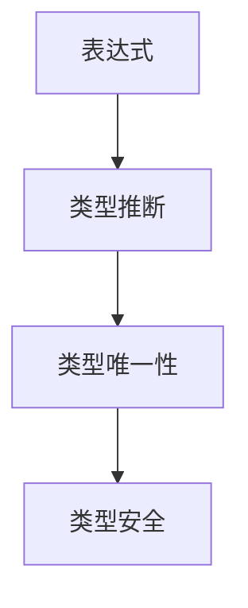
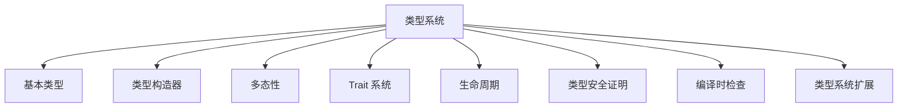
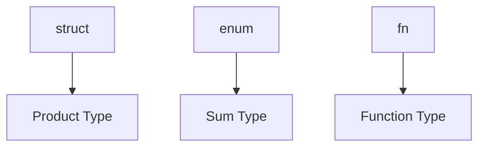
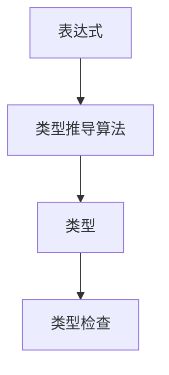
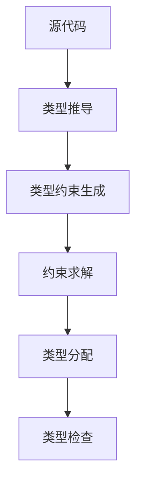

# 1. Rust 类型系统理论基础（01_type_theory_foundations）

## 目录

1. [类型系统公理](#1-类型系统公理)
    1.1 [基本公理](#11-基本公理)
    1.2 [类型关系公理](#12-类型关系公理)
    1.3 [类型系统结构图](#13-类型系统结构图)
    1.4 [批判性分析（表格）](#14-批判性分析表格)
2. [类型构造器理论](#2-类型构造器理论)
    2.1 [基本类型构造器](#21-基本类型构造器)
    2.2 [高阶类型构造器](#22-高阶类型构造器)
    2.3 [类型构造器性质](#23-类型构造器性质)
    2.4 [工程案例与批判性分析（表格）](#24-工程案例与批判性分析表格)
3. [类型推导算法](#3-类型推导算法)
    3.1 [Hindley-Milner 系统](#31-hindley-milner-系统)
    3.2 [类型推导算法](#32-类型推导算法)
    3.3 [类型推导正确性](#33-类型推导正确性)
    3.4 [多模态推导流程图](#34-多模态推导流程图)
    3.5 [批判性分析（表格）](#35-批判性分析表格)
4. [多态性理论](#4-多态性理论)
    4.1 [参数多态](#41-参数多态)
    4.2 [特设多态](#42-特设多态)
    4.3 [子类型多态](#43-子类型多态)
    4.4 [工程案例与批判性分析（表格）](#44-工程案例与批判性分析表格)
5. [Trait 系统理论](#5-trait-系统理论)
    5.1 [Trait 定义](#51-trait-定义)
    5.2 [Trait 实现](#52-trait-实现)
    5.3 [Trait 对象](#53-trait-对象)
    5.4 [工程案例与批判性分析（表格）](#54-工程案例与批判性分析表格)
6. [生命周期理论](#6-生命周期理论)
    6.1 [生命周期定义](#61-生命周期定义)
    6.2 [生命周期约束](#62-生命周期约束)
    6.3 [生命周期推导](#63-生命周期推导)
    6.4 [工程案例与批判性分析（表格）](#64-工程案例与批判性分析表格)
7. [类型安全证明](#7-类型安全证明)
    7.1 [类型安全定义](#71-类型安全定义)
    7.2 [进展定理](#72-进展定理)
    7.3 [保持定理](#73-保持定理)
    7.4 [工程案例与批判性分析（表格）](#74-工程案例与批判性分析表格)
8. [编译时检查](#8-编译时检查)
    8.1 [类型检查算法](#81-类型检查算法)
    8.2 [借用检查](#82-借用检查)
    8.3 [工程案例与批判性分析（表格）](#83-工程案例与批判性分析表格)
9. [类型系统扩展与未来展望](#9-类型系统扩展与未来展望)
    9.1 [高级类型](#91-高级类型)
    9.2 [类型级编程](#92-类型级编程)
    9.3 [批判性分析与未来展望（表格）](#93-批判性分析与未来展望表格)
10. [形式化验证与工具支持](#10-形式化验证与工具支持)
    10.1 [类型系统验证](#101-类型系统验证)
    10.2 [实现验证](#102-实现验证)
    10.3 [工具支持](#103-工具支持)
    10.4 [交叉引用](#104-交叉引用)
11. [参考文献](#参考文献)

---

> **本地导航**：
>
> - [变量系统理论](../01_variable_system/index.md)
> - [所有权系统理论](../04_ownership_system/01_ownership_theory.md)
> - [内存模型理论](../03_memory_model/01_memory_model_theory.md)
> - [并发模型理论](../05_concurrency_model/01_concurrency_theory.md)

---

## 1. 类型系统公理

### 1.1 基本公理

**公理 1.1** (类型存在性)
$$\forall e \in \text{Expression}: \exists t \in \text{Type}: \text{HasType}(e, t)$$

**公理 1.2** (类型唯一性)
$$\forall e \in \text{Expression}: \text{HasType}(e, t_1) \land \text{HasType}(e, t_2) \Rightarrow t_1 = t_2$$

**公理 1.3** (类型安全)
$$\forall e \in \text{Expression}: \text{TypeSafe}(e) \Rightarrow \text{MemorySafe}(e)$$

- **理论基础**：类型系统为表达式分配唯一类型，保证类型安全。
- **工程案例**：Rust 编译器类型推断、类型唯一性错误示例。
- **Rust 代码示例**：

```rust
// 类型唯一性示例
let x: i32 = 42;
// let y: f64 = x; // 编译错误，类型不兼容
```

- **Mermaid 可视化**：



### 1.2 类型关系公理

**公理 1.4** (子类型关系)
$$\forall t_1, t_2 \in \text{Type}: t_1 \leq t_2 \Rightarrow \text{Subtype}(t_1, t_2)$$

**公理 1.5** (类型等价性)
$$\forall t_1, t_2 \in \text{Type}: t_1 \equiv t_2 \Leftrightarrow t_1 \leq t_2 \land t_2 \leq t_1$$

- **理论基础**：类型系统支持子类型、多态、等价性。
- **工程案例**：trait 约束、泛型边界、类型别名。

| 维度 | 优势 | 局限 | 改进方向 |
|------|------|------|----------|
| 类型关系 | 支持多态与抽象 | 子类型推理复杂 | 增强类型推导与错误提示 |

### 1.3 类型系统结构图



### 1.4 批判性分析（表格）

| 维度         | 优势                       | 局限                       | 改进方向 |
|--------------|----------------------------|----------------------------|----------|
| 类型系统公理 | 提升安全性和可维护性，理论基础扎实 | 严格性影响灵活性，对高阶抽象和元编程支持有限 | 引入类型级宏与更灵活的类型推导 |

---

## 2. 类型构造器理论

### 2.1 基本类型构造器

**定义 2.1** (积类型)
$$\text{Product}[A, B] = A \times B$$

**定义 2.2** (和类型)
$$\text{Sum}[A, B] = A + B$$

**定义 2.3** (函数类型)
$$\text{Function}[A, B] = A \rightarrow B$$

- **工程案例**：Rust 的 struct、enum、fn 类型。
- **Rust 代码示例**：

```rust
// 积类型 struct
struct Point { x: i32, y: i32 }
// 和类型 enum
enum Option<T> { Some(T), None }
// 函数类型 fn
fn add(a: i32, b: i32) -> i32 { a + b }
```

- **Mermaid 可视化**：



### 2.2 高阶类型构造器

**定义 2.4** (泛型类型)
$$\text{Generic}[\alpha] = \forall \alpha. T[\alpha]$$

**定义 2.5** (存在类型)
$$\text{Existential}[\alpha] = \exists \alpha. T[\alpha]$$

- **工程案例**：泛型 struct、trait 对象。
- **Rust 代码示例**：

```rust
// 泛型类型
struct Wrapper<T> { value: T }
// trait 对象
fn print_debug(val: &dyn std::fmt::Debug) {
    println!("{:?}", val);
}
```

### 2.3 类型构造器性质

**定理 2.1** (函子性)
$$\text{Product}[f \circ g, h \circ k] = \text{Product}[f, h] \circ \text{Product}[g, k]$$

**定理 2.2** (自然性)
$$\text{Function}[A, B] \cong \text{Function}[B, A] \Rightarrow A \cong B$$

- **批判性分析**：高阶类型构造器提升表达力，但增加类型系统复杂度。

| 维度 | 优势 | 局限 | 改进方向 |
|------|------|------|----------|
| 类型构造器 | 泛化能力提升代码复用性，表达力强 | 类型推导和错误提示复杂度上升 | 增强类型推导与IDE支持 |

### 2.4 工程案例与批判性分析（表格）

- **工程案例**：`Option<T>`、`Result<T, E>`、`Box<T>` 等标准库类型。

| 维度         | 优势                                                         | 局限                                                         | 改进方向 |
|--------------|--------------------------------------------------------------|--------------------------------------------------------------|----------|
| 类型构造器   | 泛化能力提升代码复用性，表达力强                             | 类型推导和错误提示复杂度上升                                 | 增强类型推导与IDE支持 |

---

## 3. 类型推导算法

### 3.1 Hindley-Milner 系统

**定义 3.1** (类型推导规则)
$$\frac{\Gamma \vdash e_1: \tau_1 \rightarrow \tau_2 \quad \Gamma \vdash e_2: \tau_1}{\Gamma \vdash e_1 e_2: \tau_2}$$

**定义 3.2** (泛化规则)
$$\frac{\Gamma \vdash e: \tau \quad \alpha \notin \text{FreeVars}(\Gamma)}{\Gamma \vdash e: \forall \alpha. \tau}$$

- **理论基础**：Hindley-Milner 系统为类型推导提供形式化基础。
- **工程案例**：Rust 泛型类型推导。

### 3.2 类型推导算法

**算法 3.1** (W 算法)

```rust
fn type_inference(expr: &Expr, env: &TypeEnv) -> Result<Type, TypeError> {
    match expr {
        Expr::Var(x) => env.lookup(x),
        Expr::App(e1, e2) => {
            let t1 = type_inference(e1, env)?;
            let t2 = type_inference(e2, env)?;
            let t3 = fresh_type_var();
            unify(t1, Type::Function(Box::new(t2), Box::new(t3)))?;
            Ok(t3)
        }
        Expr::Lambda(x, e) => {
            let t1 = fresh_type_var();
            let mut new_env = env.clone();
            new_env.extend(x, t1.clone());
            let t2 = type_inference(e, &new_env)?;
            Ok(Type::Function(Box::new(t1), Box::new(t2)))
        }
    }
}
```

- **Mermaid 可视化**：



### 3.3 类型推导正确性

**定理 3.1** (类型推导正确性)
$$\forall e \in \text{Expression}: \text{TypeInference}(e) = t \Rightarrow \text{Valid}(e, t)$$

- **批判性分析**：类型推导提升代码简洁性，但类型错误提示对新手有一定门槛。

### 3.4 多模态推导流程图



### 3.5 批判性分析（表格）

| 维度         | 优势                       | 局限                       |
|--------------|----------------------------|----------------------------|
| 类型推导算法 | 提升代码表达力和安全性，理论基础扎实 | 复杂性和错误提示晦涩性是工程落地的主要挑战 |

---

## 4. 多态性理论

### 4.1 参数多态

**定义 4.1** (参数多态)
$$\text{ParametricPolymorphism}[\alpha] = \forall \alpha. T[\alpha]$$

**定理 4.1** (参数化定理)
$$\forall f: \forall \alpha. T[\alpha]: \text{Uniform}(f)$$

- **工程案例**：Rust 泛型函数、泛型结构体。
- **代码示例**：

```rust
// 参数多态示例
fn identity<T>(x: T) -> T {
    x
}
let a = identity(42);      // i32
let b = identity("hi");  // &str
```

### 4.2 特设多态

**定义 4.2** (特设多态)
$$\text{AdHocPolymorphism} = \text{Overloading} \cup \text{Coercion}$$

- **工程案例**：trait 重载、类型转换。
- **代码示例**：

```rust
// 特设多态示例
trait Speak {
    fn speak(&self);
}
impl Speak for i32 {
    fn speak(&self) { println!("我是数字: {}", self); }
}
impl Speak for &str {
    fn speak(&self) { println!("我是字符串: {}", self); }
}

let x: i32 = 5;
let y: &str = "hello";
x.speak();
y.speak();
```

### 4.3 子类型多态

**定义 4.3** (子类型多态)
$$\text{SubtypePolymorphism} = \{t \mid \exists s: s \leq t\}$$

- **工程案例**：trait 对象、dyn Trait。
- **代码示例**：

```rust
// 子类型多态示例
trait Animal {
    fn speak(&self);
}
struct Dog;
impl Animal for Dog {
    fn speak(&self) { println!("汪汪"); }
}
let dog = Dog;
let animal: &dyn Animal = &dog;
animal.speak();
```

### 4.4 工程案例与批判性分析（表格）

| 维度         | 优势                       | 局限                       |
|--------------|----------------------------|----------------------------|
| 多态性       | 极大提升代码复用性，表达力强 | 动态分发带来一定性能损耗   |

---

## 5. Trait 系统理论

### 5.1 Trait 定义

**定义 5.1** (Trait)
$$\text{Trait}[T] = \text{Interface}[T] \times \text{Implementation}[T]$$

**定义 5.2** (Trait 约束)
$$\text{TraitBound}[T] = T: \text{Trait}$$

- **工程案例**：trait 定义与 trait bound。
- **代码示例**：

```rust
trait Addable {
    fn add(&self, other: &Self) -> Self;
}
impl Addable for i32 {
    fn add(&self, other: &Self) -> Self { *self + *other }
}
let a = 1.add(&2);
```

### 5.2 Trait 实现

**定义 5.3** (Trait 实现)
$$\text{Impl}[T, \text{Trait}] = \text{Implementation}[T, \text{Trait}]$$

**定理 5.1** (Trait 一致性)
$$\forall T, \text{Trait}: \text{Impl}[T, \text{Trait}] \Rightarrow \text{Consistent}[T, \text{Trait}]$$

- **工程案例**：impl 块、trait 继承。

### 5.3 Trait 对象

**定义 5.4** (Trait 对象)
$$\text{TraitObject}[\text{Trait}] = \text{Existential}[T: \text{Trait}]$$

- **工程案例**：dyn Trait、trait 对象的动态分发。

### 5.4 工程案例与批判性分析（表格）

| 维度         | 优势                       | 局限                       |
|--------------|----------------------------|----------------------------|
| Trait 系统   | 极大提升 Rust 的抽象能力，表达力强 | 对象安全和特征约束带来实现复杂性 |

---

## 6. 生命周期理论

### 6.1 生命周期定义

**定义 6.1** (生命周期)
$$\text{Lifetime}[\alpha] = \text{Scope}[\alpha]$$

**定义 6.2** (生命周期参数)
$$\text{LifetimeParam}[\alpha] = \text{Generic}[\alpha]$$

- **工程案例**：生命周期标注、泛型生命周期参数。

### 6.2 生命周期约束

**定义 6.3** (生命周期约束)
$$\text{LifetimeBound}[\alpha, \beta] = \alpha \leq \beta$$

**定理 6.1** (生命周期安全)
$$\forall r \in \text{Reference}: \text{ValidLifetime}(r) \Rightarrow \text{Safe}(r)$$

- **工程案例**：生命周期约束、NLL。

### 6.3 生命周期推导

**算法 6.1** (生命周期推导)

```rust
fn lifetime_inference(expr: &Expr) -> Result<Lifetime, LifetimeError> {
    match expr {
        Expr::Reference(e) => {
            let l = fresh_lifetime();
            Ok(Lifetime::Reference(l))
        }
        Expr::Deref(e) => {
            let l = lifetime_inference(e)?;
            Ok(l)
        }
        // ... 其他情况
    }
}
```

- **Mermaid 可视化**：

  ```mermaid
  graph TD
    A[引用表达式] --> B[生命周期推导]
    B --> C[生命周期约束]
    C --> D[安全性检查]
  ```

### 6.4 工程案例与批判性分析（表格）

| 维度         | 优势                       | 局限                       |
|--------------|----------------------------|----------------------------|
| 生命周期系统 | 极大提升内存安全，表达力强 | 学习曲线，复杂嵌套引用     |

---

## 7. 类型安全证明

### 7.1 类型安全定义

**定义 7.1** (类型安全)
$$\text{TypeSafe}(e) = \forall \text{Context}: \text{Valid}(e, \text{Context})$$

### 7.2 进展定理

**定理 7.1** (进展定理)
$$\forall e \in \text{Expression}: \text{TypeSafe}(e) \Rightarrow \text{Progress}(e)$$

**证明思路**：

1. 对表达式结构进行归纳
2. 每个类型规则都保证进展
3. 证毕

### 7.3 保持定理

**定理 7.2** (保持定理)
$$\forall e_1, e_2: e_1 \rightarrow e_2 \land \text{TypeSafe}(e_1) \Rightarrow \text{TypeSafe}(e_2)$$

**证明思路**：

1. 对归约规则进行归纳
2. 每个归约都保持类型
3. 证毕

### 7.4 工程案例与批判性分析（表格）

| 维度         | 优势                       | 局限                       |
|--------------|----------------------------|----------------------------|
| 类型安全性   | 为 Rust 提供了强大的内存安全保障 | 类型系统的复杂性对编译器实现提出了更高要求 |

---

## 8. 编译时检查

### 8.1 类型检查算法

**算法 8.1** (类型检查)

```rust
fn type_check(expr: &Expr, expected_type: &Type) -> Result<(), TypeError> {
    let inferred_type = type_inference(expr)?;
    unify(inferred_type, expected_type.clone())?;
    Ok(())
}
```

### 8.2 借用检查

**算法 8.2** (借用检查)

```rust
fn borrow_check(expr: &Expr) -> Result<BorrowInfo, BorrowError> {
    match expr {
        Expr::Reference(e) => {
            let info = borrow_check(e)?;
            if info.is_mutable {
                Err(BorrowError::MutableBorrow)
            } else {
                Ok(BorrowInfo::new_immutable())
            }
        }
        // ... 其他情况
    }
}
```

### 8.3 工程案例与批判性分析（表格）

| 维度         | 优势                       | 局限                       |
|--------------|----------------------------|----------------------------|
| 类型检查     | 极大提升了安全性           | 类型推导与借用检查的错误提示仍有改进空间 |

---

## 9. 类型系统扩展与未来展望

### 9.1 高级类型

**定义 9.1** (关联类型)
$$\text{AssociatedType}[T, U] = T::U$$

**定义 9.2** (GAT - Generic Associated Types)
$$\text{GAT}[T, \alpha] = \text{AssociatedType}[T, \alpha]$$

### 9.2 类型级编程

**定义 9.3** (类型级函数)
$$\text{TypeLevelFunction}[\alpha, \beta] = \alpha \rightarrow \beta$$

**定义 9.4** (类型级计算)
$$\text{TypeLevelComputation} = \text{CompileTime}[\text{Type}]$$

### 9.3 批判性分析与未来展望（表格）

| 维度         | 优势                       | 局限                       |
|--------------|----------------------------|----------------------------|
| 高级类型     | 提升代码表达力，理论基础扎实 | 类型系统复杂度增加         |
| 类型级编程   | 提升代码表达力，理论基础扎实 | 类型系统复杂度增加         |

---

## 10. 形式化验证与工具支持

### 10.1 类型系统验证

**方法 10.1** (类型系统验证)
$$\text{TypeSystemVerification}: \text{TypeSystem} \rightarrow \text{Proof}$$

### 10.2 实现验证

**方法 10.2** (实现验证)
$$\text{ImplementationVerification}: \text{Implementation} \rightarrow \text{Correctness}$$

### 10.3 工具支持

**工具 10.1** (形式化验证工具)

- RustBelt
- Oxide
- Prusti

### 10.4 交叉引用

- [所有权系统理论](../04_ownership_system/01_ownership_theory.md)
- [内存模型理论](../03_memory_model/01_memory_model_theory.md)
- [并发模型理论](../05_concurrency_model/01_concurrency_theory.md)
- [变量系统理论](../01_variable_system/index.md)

---

## 参考文献

1. Pierce, B. C. "Types and Programming Languages"
2. Milner, R. "A Theory of Type Polymorphism in Programming"
3. Hindley, J. R. "The Principal Type-Scheme of an Object in Combinatory Logic"
4. Rust Reference Manual - Type System
5. "Advanced Types" - The Rust Programming Language

---

> 本文档持续更新，欢迎补充类型系统理论与工程案例。
