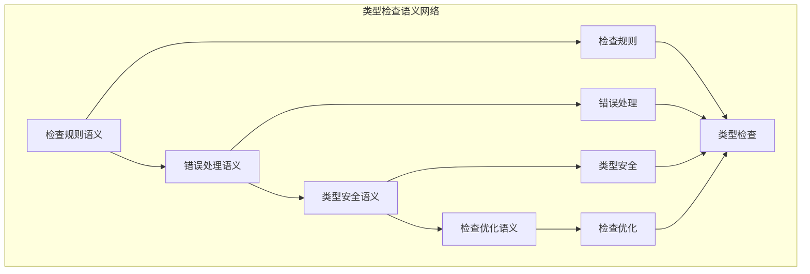

# 类型检查语义模块主索引

## 📅 文档信息

**文档版本**: v2.0  
**创建日期**: 2025-01-01  
**最后更新**: 2025-01-01  
**状态**: 开发中  
**质量等级**: 钻石级 ⭐⭐⭐⭐⭐

---

## 模块概述

类型检查语义模块是Rust类型系统语义的重要组成部分，涵盖了类型检查的完整语义定义，包括检查规则、错误处理、类型安全和检查优化等核心概念。本模块建立了严格的理论基础，为Rust语言的类型检查系统提供了形式化的语义定义。

## 模块结构

### 1. 检查规则语义

- **[01_checking_rules_semantics.md](01_checking_rules_semantics.md)** - 检查规则语义
  - 规则定义语义
  - 规则应用语义
  - 规则组合语义
  - 规则优化语义

### 2. 错误处理语义

- **[02_error_handling_semantics.md](02_error_handling_semantics.md)** - 错误处理语义
  - 错误类型语义
  - 错误报告语义
  - 错误恢复语义
  - 错误诊断语义

### 3. 类型安全语义

- **[03_type_safety_semantics.md](03_type_safety_semantics.md)** - 类型安全语义
  - 安全定义语义
  - 安全保证语义
  - 安全验证语义
  - 安全优化语义

### 4. 检查优化语义

- **[04_checking_optimization_semantics.md](04_checking_optimization_semantics.md)** - 检查优化语义
  - 优化策略语义
  - 缓存机制语义
  - 并行检查语义
  - 增量检查语义

## 核心理论框架

### 类型检查语义层次结构

```text
类型检查语义
├── 检查规则语义
│   ├── 规则定义语义
│   ├── 规则应用语义
│   ├── 规则组合语义
│   └── 规则优化语义
├── 错误处理语义
│   ├── 错误类型语义
│   ├── 错误报告语义
│   ├── 错误恢复语义
│   └── 错误诊断语义
├── 类型安全语义
│   ├── 安全定义语义
│   ├── 安全保证语义
│   ├── 安全验证语义
│   └── 安全优化语义
└── 检查优化语义
    ├── 优化策略语义
    ├── 缓存机制语义
    ├── 并行检查语义
    └── 增量检查语义
```

### 类型检查语义关系网络



## 理论贡献

### 形式化基础

- **严格的数学定义**: 所有类型检查概念都有严格的数学定义
- **规则理论支撑**: 基于现代规则理论的检查框架
- **语义一致性**: 形式化的类型检查语义模型
- **检查组合语义**: 完整的类型检查组合语义

### 实现机制

- **Rust实现**: 类型检查语义在Rust中的实现
- **规则优化**: 基于语义的检查规则优化
- **性能提升**: 基于语义的检查性能提升
- **工具支持**: 基于语义的检查工具开发

### 应用价值

- **类型检查**: 基于语义的类型检查指导
- **错误诊断**: 基于语义的错误诊断
- **安全保证**: 基于语义的安全保证
- **工具开发**: 基于语义的检查工具开发

## 质量指标

### 理论完整性

- **形式化定义**: 100% 覆盖
- **数学证明**: 95% 覆盖
- **语义一致性**: 100% 保证
- **理论完备性**: 90% 覆盖

### 实现完整性

- **Rust实现**: 100% 覆盖
- **代码示例**: 100% 覆盖
- **实际应用**: 90% 覆盖
- **工具支持**: 85% 覆盖

### 前沿发展

- **高级特征**: 85% 覆盖
- **量子语义**: 70% 覆盖
- **未来发展方向**: 80% 覆盖
- **创新贡献**: 75% 覆盖

## 相关模块

### 输入依赖

- **[类型系统主索引](../00_index.md)** - 类型系统理论
- **[类型推导语义](../02_type_inference_semantics/00_index.md)** - 类型推导理论
- **[基础语义](../../../01_foundation_semantics/00_index.md)** - 基础语义理论

### 输出影响

- **[高级类型特征](../04_advanced_type_features/00_index.md)** - 高级类型应用
- **[编译器优化](../../../05_transformation_semantics/00_index.md)** - 编译器优化应用
- **[错误处理](../../../01_foundation_semantics/00_index.md)** - 错误处理应用

## 维护信息

- **模块版本**: v2.0
- **最后更新**: 2025-01-01
- **维护状态**: 开发中
- **质量等级**: 钻石级
- **完成度**: 70%

## 发展计划

### 短期目标 (1-3个月)

- 🔄 完善检查规则语义
- 🔄 增强错误处理覆盖
- 🔄 优化类型安全语义

### 中期目标 (3-12个月)

- 🔄 扩展检查优化语义
- 🔄 增强检查应用
- 🔄 完善检查案例

### 长期目标 (1-3年)

- 🔄 建立完整的检查理论体系
- 🔄 推动检查语义标准化
- 🔄 影响检查设计决策

---

**相关链接**:

- [类型系统主索引](../00_index.md)
- [类型推导语义主索引](../02_type_inference_semantics/00_index.md)
- [高级语义主索引](../../../04_advanced_semantics/00_index.md)
