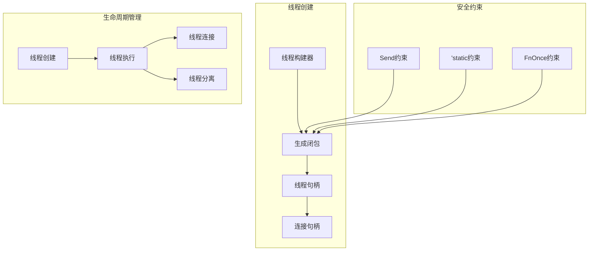

# 3.1.1 Rust线程创建语义模型深度分析

**文档版本**: V1.0  
**创建日期**: 2025-01-27  
**所属层**: 并发语义层 (Concurrency Semantics Layer)  
**父模块**: [3.1 线程语义](../00_threading_index.md)  
**交叉引用**: [1.4.3 生命周期语义](../../01_foundation_semantics/04_ownership_system_semantics/03_lifetime_semantics.md), [3.2.1 Future语义](../02_async_programming_semantics/01_future_semantics.md)

---

## 3.1.1.1 线程创建理论基础

### 3.1.1.1.1 线程语义域定义

**定义 3.1.1.1** (线程创建语义域)
$$\text{Thread} = \langle \text{Creation}, \text{Spawn}, \text{Join}, \text{Handle}, \text{Safety} \rangle$$

其中：

- $\text{Creation} : \text{Closure} \rightarrow \text{ThreadHandle}$ - 线程创建
- $\text{Spawn} : \text{FnOnce} + \text{Send} + 'static$ - 线程生成约束
- $\text{Join} : \text{ThreadHandle} \rightarrow \text{Result}$ - 线程连接
- $\text{Handle} : \text{ThreadId} \times \text{JoinHandle}$ - 线程句柄
- $\text{Safety} : \text{Send} \times \text{Sync}$ - 线程安全



### 3.1.1.1.2 基础线程创建

```rust
use std::thread;
use std::time::Duration;

// 基础线程创建
fn basic_thread_creation() {
    // 最简单的线程创建
    let handle = thread::spawn(|| {
        println!("Hello from spawned thread!");
        42
    });
    
    // 等待线程完成并获取返回值
    match handle.join() {
        Ok(result) => println!("Thread returned: {}", result),
        Err(_) => println!("Thread panicked"),
    }
    
    // 带参数的线程
    let data = "shared data".to_string();
    let handle = thread::spawn(move || {
        println!("Thread received: {}", data);
        data.len()
    });
    
    let length = handle.join().unwrap();
    println!("Data length: {}", length);
}

// 线程构建器
fn thread_builder_example() {
    let builder = thread::Builder::new()
        .name("worker-thread".to_string())
        .stack_size(4 * 1024 * 1024); // 4MB stack
    
    let handle = builder.spawn(|| {
        let current = thread::current();
        println!("Thread name: {:?}", current.name());
        println!("Thread ID: {:?}", current.id());
        
        // 模拟工作
        thread::sleep(Duration::from_millis(100));
        "work completed"
    }).unwrap();
    
    let result = handle.join().unwrap();
    println!("Worker result: {}", result);
}
```

**线程创建的语义规则**：
$$\frac{\text{closure} : \text{FnOnce}() \rightarrow T + \text{Send} + 'static}{\text{thread::spawn}(\text{closure}) \rightarrow \text{JoinHandle}<T>} \text{[THREAD-SPAWN]}$$

---

## 3.1.1.2 线程安全约束

### 3.1.1.2.1 Send和Sync约束

```rust
use std::sync::{Arc, Mutex};
use std::thread;

// Send约束示例
fn send_constraint_examples() {
    // 可以Send的类型
    let data = vec![1, 2, 3, 4, 5];
    let handle = thread::spawn(move || {
        println!("Vec can be sent: {:?}", data);
        data.len()
    });
    
    let _result = handle.join().unwrap();
    
    // 使用Arc共享数据
    let shared_data = Arc::new(vec![1, 2, 3]);
    let shared_data_clone = Arc::clone(&shared_data);
    
    let handle = thread::spawn(move || {
        println!("Shared data: {:?}", shared_data_clone);
        shared_data_clone.len()
    });
    
    println!("Original data: {:?}", shared_data);
    let _length = handle.join().unwrap();
}

// 不能Send的类型示例
fn non_send_examples() {
    use std::rc::Rc;
    
    // Rc不实现Send
    let rc_data = Rc::new(vec![1, 2, 3]);
    
    // 这会编译失败
    /*
    let handle = thread::spawn(move || {
        println!("Rc data: {:?}", rc_data);
    });
    */
    
    // 正确的方式：转换为Arc
    let arc_data = Arc::new(vec![1, 2, 3]);
    let arc_clone = Arc::clone(&arc_data);
    
    let handle = thread::spawn(move || {
        println!("Arc data: {:?}", arc_clone);
    });
    
    handle.join().unwrap();
}

// Sync约束示例
fn sync_constraint_examples() {
    // 可以在多线程间安全共享的类型
    let counter = Arc::new(Mutex::new(0));
    let mut handles = vec![];
    
    for i in 0..10 {
        let counter_clone = Arc::clone(&counter);
        let handle = thread::spawn(move || {
            let mut num = counter_clone.lock().unwrap();
            *num += i;
            println!("Thread {} incremented counter", i);
        });
        handles.push(handle);
    }
    
    // 等待所有线程完成
    for handle in handles {
        handle.join().unwrap();
    }
    
    println!("Final counter value: {}", *counter.lock().unwrap());
}
```

### 3.1.1.2.2 'static生命周期约束

```rust
// 'static生命周期约束
fn static_lifetime_constraints() {
    // 字符串字面量是'static
    let handle = thread::spawn(|| {
        let static_str: &'static str = "This lives forever";
        println!("Static string: {}", static_str);
    });
    
    handle.join().unwrap();
    
    // 拥有数据的类型满足'static
    let owned_data = String::from("owned data");
    let handle = thread::spawn(move || {
        println!("Owned data: {}", owned_data);
        owned_data.len()
    });
    
    let _length = handle.join().unwrap();
    
    // 错误示例：引用本地变量
    let local_data = String::from("local");
    
    // 这会编译失败，因为local_data_ref不是'static
    /*
    let local_data_ref = &local_data;
    let handle = thread::spawn(move || {
        println!("Local ref: {}", local_data_ref);
    });
    */
    
    // 正确方式：移动所有权
    let handle = thread::spawn(move || {
        println!("Moved local data: {}", local_data);
    });
    
    handle.join().unwrap();
}

// 处理非'static引用
fn handling_non_static_references() {
    use std::sync::mpsc;
    
    let data = vec![1, 2, 3, 4, 5];
    let (tx, rx) = mpsc::channel();
    
    // 克隆数据以满足'static约束
    let data_clone = data.clone();
    let handle = thread::spawn(move || {
        let sum: i32 = data_clone.iter().sum();
        tx.send(sum).unwrap();
    });
    
    let result = rx.recv().unwrap();
    println!("Sum calculated in thread: {}", result);
    println!("Original data still available: {:?}", data);
    
    handle.join().unwrap();
}
```

---

## 3.1.1.3 线程句柄管理

### 3.1.1.3.1 JoinHandle的使用

```rust
use std::thread::{self, JoinHandle};
use std::time::{Duration, Instant};

// JoinHandle的基础操作
fn join_handle_operations() {
    // 创建返回不同类型的线程
    let handle1: JoinHandle<i32> = thread::spawn(|| {
        thread::sleep(Duration::from_millis(100));
        42
    });
    
    let handle2: JoinHandle<String> = thread::spawn(|| {
        thread::sleep(Duration::from_millis(200));
        "Hello from thread".to_string()
    });
    
    let handle3: JoinHandle<()> = thread::spawn(|| {
        thread::sleep(Duration::from_millis(50));
        println!("Side effect thread completed");
    });
    
    // 等待所有线程
    let result1 = handle1.join().unwrap();
    let result2 = handle2.join().unwrap();
    handle3.join().unwrap();
    
    println!("Results: {}, {}", result1, result2);
}

// 线程集合管理
fn thread_collection_management() {
    let mut handles = Vec::new();
    let start_time = Instant::now();
    
    // 创建多个工作线程
    for i in 0..5 {
        let handle = thread::spawn(move || {
            let sleep_duration = Duration::from_millis(100 * (i + 1) as u64);
            thread::sleep(sleep_duration);
            format!("Worker {} completed", i)
        });
        handles.push(handle);
    }
    
    // 收集所有结果
    let mut results = Vec::new();
    for handle in handles {
        match handle.join() {
            Ok(result) => results.push(result),
            Err(_) => results.push("Thread panicked".to_string()),
        }
    }
    
    let elapsed = start_time.elapsed();
    println!("All threads completed in {:?}", elapsed);
    println!("Results: {:?}", results);
}

// 线程超时和取消（概念）
fn thread_timeout_concept() {
    use std::sync::mpsc;
    use std::sync::atomic::{AtomicBool, Ordering};
    use std::sync::Arc;
    
    // 使用channel实现超时
    let (tx, rx) = mpsc::channel();
    let (cancel_tx, cancel_rx) = mpsc::channel();
    
    let handle = thread::spawn(move || {
        for i in 0..100 {
            // 检查取消信号
            if cancel_rx.try_recv().is_ok() {
                return "Cancelled".to_string();
            }
            
            thread::sleep(Duration::from_millis(50));
            
            if i == 50 {
                tx.send("Completed").unwrap();
                return "Success".to_string();
            }
        }
        "Timeout".to_string()
    });
    
    // 等待结果或超时
    let timeout = Duration::from_secs(1);
    match rx.recv_timeout(timeout) {
        Ok(_) => println!("Thread completed successfully"),
        Err(_) => {
            println!("Thread timed out, sending cancel signal");
            cancel_tx.send(()).unwrap();
        }
    }
    
    let result = handle.join().unwrap();
    println!("Final thread result: {}", result);
}
```

### 3.1.1.3.2 错误处理和恐慌传播

```rust
// 线程恐慌处理
fn thread_panic_handling() {
    // 恐慌的线程
    let handle1 = thread::spawn(|| {
        panic!("Something went wrong!");
    });
    
    // 正常的线程
    let handle2 = thread::spawn(|| {
        "Normal completion"
    });
    
    // 检查线程结果
    match handle1.join() {
        Ok(result) => println!("Thread 1 result: {}", result),
        Err(e) => {
            println!("Thread 1 panicked!");
            if let Some(s) = e.downcast_ref::<&str>() {
                println!("Panic message: {}", s);
            }
        }
    }
    
    match handle2.join() {
        Ok(result) => println!("Thread 2 result: {}", result),
        Err(_) => println!("Thread 2 panicked!"),
    }
}

// 自定义错误类型的线程
fn custom_error_thread_handling() {
    use std::fmt;
    
    #[derive(Debug)]
    struct CustomError {
        message: String,
    }
    
    impl fmt::Display for CustomError {
        fn fmt(&self, f: &mut fmt::Formatter) -> fmt::Result {
            write!(f, "Custom error: {}", self.message)
        }
    }
    
    impl std::error::Error for CustomError {}
    
    // 返回Result的线程
    let handle = thread::spawn(|| -> Result<String, CustomError> {
        if rand::random::<bool>() {
            Ok("Success!".to_string())
        } else {
            Err(CustomError {
                message: "Random failure".to_string(),
            })
        }
    });
    
    match handle.join() {
        Ok(thread_result) => match thread_result {
            Ok(value) => println!("Thread succeeded: {}", value),
            Err(error) => println!("Thread failed: {}", error),
        },
        Err(_) => println!("Thread panicked"),
    }
}

// 恐慌钩子设置
fn panic_hook_setup() {
    use std::panic;
    
    // 设置全局恐慌钩子
    panic::set_hook(Box::new(|panic_info| {
        let thread = thread::current();
        let thread_name = thread.name().unwrap_or("unnamed");
        
        if let Some(location) = panic_info.location() {
            println!(
                "Thread '{}' panicked at '{}', {}:{}",
                thread_name,
                panic_info.payload().downcast_ref::<&str>()
                    .unwrap_or(&"Box<Any>"),
                location.file(),
                location.line()
            );
        } else {
            println!("Thread '{}' panicked", thread_name);
        }
    }));
    
    // 创建会恐慌的线程
    let handle = thread::Builder::new()
        .name("panic-test".to_string())
        .spawn(|| {
            panic!("Test panic in named thread");
        })
        .unwrap();
    
    // 忽略恐慌（已经被钩子处理）
    let _ = handle.join();
    
    // 恢复默认钩子
    let _ = panic::take_hook();
}
```

---

## 3.1.1.4 线程生命周期

### 3.1.1.4.1 线程状态转换

```rust
use std::sync::{Arc, Mutex, Condvar};
use std::thread;
use std::time::Duration;

// 线程状态管理
#[derive(Debug, Clone, PartialEq)]
enum ThreadState {
    Created,
    Running,
    Waiting,
    Blocked,
    Terminated,
}

struct ManagedThread {
    state: Arc<Mutex<ThreadState>>,
    handle: Option<thread::JoinHandle<()>>,
}

impl ManagedThread {
    fn new<F>(f: F) -> Self 
    where
        F: FnOnce() + Send + 'static,
    {
        let state = Arc::new(Mutex::new(ThreadState::Created));
        let state_clone = Arc::clone(&state);
        
        let handle = thread::spawn(move || {
            // 更新状态为运行中
            {
                let mut s = state_clone.lock().unwrap();
                *s = ThreadState::Running;
            }
            
            // 执行用户函数
            f();
            
            // 更新状态为终止
            {
                let mut s = state_clone.lock().unwrap();
                *s = ThreadState::Terminated;
            }
        });
        
        ManagedThread {
            state,
            handle: Some(handle),
        }
    }
    
    fn get_state(&self) -> ThreadState {
        let state = self.state.lock().unwrap();
        state.clone()
    }
    
    fn join(mut self) -> thread::Result<()> {
        if let Some(handle) = self.handle.take() {
            handle.join()
        } else {
            Ok(())
        }
    }
}

fn thread_lifecycle_example() {
    let managed = ManagedThread::new(|| {
        println!("Thread is running");
        thread::sleep(Duration::from_millis(100));
        println!("Thread work completed");
    });
    
    // 检查状态变化
    thread::sleep(Duration::from_millis(10));
    println!("Thread state: {:?}", managed.get_state());
    
    thread::sleep(Duration::from_millis(200));
    println!("Thread state: {:?}", managed.get_state());
    
    managed.join().unwrap();
}
```

### 3.1.1.4.2 条件变量和线程协调

```rust
// 使用条件变量进行线程协调
fn thread_coordination_with_condvar() {
    let pair = Arc::new((Mutex::new(false), Condvar::new()));
    let pair_clone = Arc::clone(&pair);
    
    // 工作线程
    let worker = thread::spawn(move || {
        let (lock, cvar) = &*pair_clone;
        
        // 模拟工作
        println!("Worker: Starting work...");
        thread::sleep(Duration::from_millis(500));
        println!("Worker: Work completed!");
        
        // 通知等待的线程
        let mut started = lock.lock().unwrap();
        *started = true;
        cvar.notify_one();
    });
    
    // 等待线程
    let waiter = {
        let pair_clone = Arc::clone(&pair);
        thread::spawn(move || {
            let (lock, cvar) = &*pair_clone;
            let mut started = lock.lock().unwrap();
            
            // 等待条件满足
            while !*started {
                println!("Waiter: Waiting for work to complete...");
                started = cvar.wait(started).unwrap();
            }
            
            println!("Waiter: Work has been completed!");
        })
    };
    
    worker.join().unwrap();
    waiter.join().unwrap();
}

// 生产者-消费者模式
fn producer_consumer_pattern() {
    use std::collections::VecDeque;
    
    let queue = Arc::new(Mutex::new(VecDeque::new()));
    let not_empty = Arc::new(Condvar::new());
    let not_full = Arc::new(Condvar::new());
    const MAX_SIZE: usize = 5;
    
    // 生产者线程
    let producer_queue = Arc::clone(&queue);
    let producer_not_empty = Arc::clone(&not_empty);
    let producer_not_full = Arc::clone(&not_full);
    
    let producer = thread::spawn(move || {
        for i in 0..10 {
            let mut q = producer_queue.lock().unwrap();
            
            // 等待队列不满
            while q.len() >= MAX_SIZE {
                q = producer_not_full.wait(q).unwrap();
            }
            
            q.push_back(i);
            println!("Produced: {}", i);
            
            // 通知消费者
            producer_not_empty.notify_one();
            drop(q); // 显式释放锁
            
            thread::sleep(Duration::from_millis(100));
        }
    });
    
    // 消费者线程
    let consumer_queue = Arc::clone(&queue);
    let consumer_not_empty = Arc::clone(&not_empty);
    let consumer_not_full = Arc::clone(&not_full);
    
    let consumer = thread::spawn(move || {
        for _ in 0..10 {
            let mut q = consumer_queue.lock().unwrap();
            
            // 等待队列不空
            while q.is_empty() {
                q = consumer_not_empty.wait(q).unwrap();
            }
            
            let item = q.pop_front().unwrap();
            println!("Consumed: {}", item);
            
            // 通知生产者
            consumer_not_full.notify_one();
            drop(q); // 显式释放锁
            
            thread::sleep(Duration::from_millis(150));
        }
    });
    
    producer.join().unwrap();
    consumer.join().unwrap();
}
```

---

## 3.1.1.5 相关引用与扩展阅读

### 3.1.1.5.1 内部交叉引用

- [1.4.3 生命周期语义](../../01_foundation_semantics/04_ownership_system_semantics/03_lifetime_semantics.md) - 线程'static约束
- [3.1.2 线程同步语义](02_thread_synchronization_semantics.md) - 线程间同步
- [3.2.1 Future语义](../02_async_programming_semantics/01_future_semantics.md) - 异步vs线程

### 3.1.1.5.2 外部参考文献

1. Herlihy, M. & Shavit, N. *The Art of Multiprocessor Programming*. 2nd Edition, 2020.
2. Lee, E.A. *The Problem with Threads*. Computer, 2006.
3. Rust Reference: [Thread Spawning](https://doc.rust-lang.org/std/thread/fn.spawn.html)

### 3.1.1.5.3 实现参考

- [std::thread](https://doc.rust-lang.org/std/thread/index.html) - 标准线程库
- [crossbeam](https://crates.io/crates/crossbeam) - 高级并发原语
- [rayon](https://crates.io/crates/rayon) - 并行处理库

---

**文档元数据**:

- **复杂度级别**: ⭐⭐⭐⭐ (高级)
- **前置知识**: Rust所有权系统、Send/Sync概念、生命周期
- **相关工具**: rustc, cargo, rust-analyzer
- **更新频率**: 与Rust并发模型演进同步
- **维护者**: Rust并发语义分析工作组
