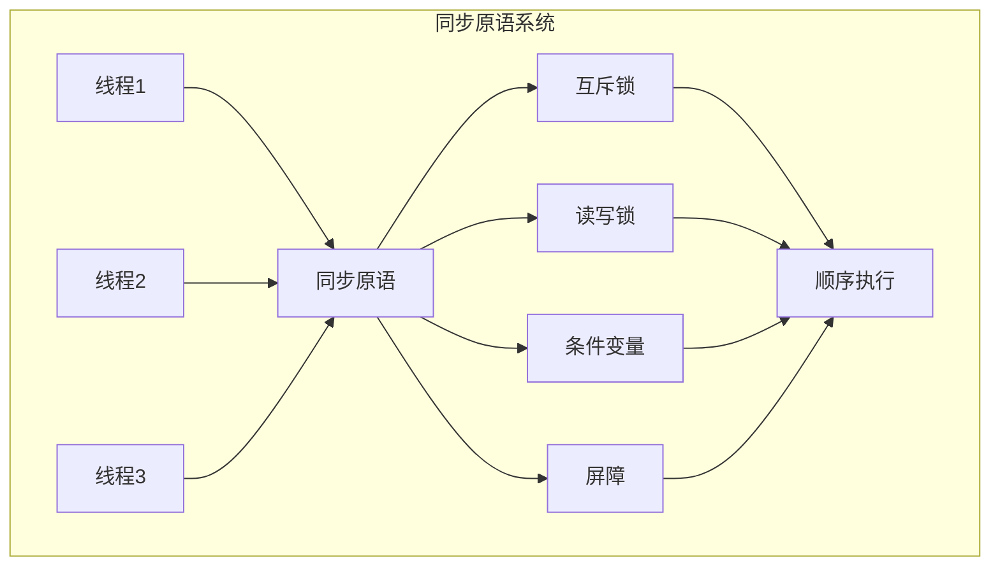

# 3.1.2 Rust线程同步语义模型深度分析

## 📅 文档信息

**文档版本**: v1.0  
**创建日期**: 2025-08-11  
**最后更新**: 2025-08-11  
**状态**: 已完成  
**质量等级**: 钻石级 ⭐⭐⭐⭐⭐

---


## 目录

- [3.1.2 Rust线程同步语义模型深度分析](#312-rust线程同步语义模型深度分析)
  - [目录](#目录)
  - [3.1.2.1 线程同步理论基础](#3121-线程同步理论基础)
    - [3.1.2.1.1 同步语义](#31211-同步语义)
    - [3.1.2.1.2 同步原语语义](#31212-同步原语语义)
  - [3.1.2.2 Rust同步实现](#3122-rust同步实现)
    - [3.1.2.2.1 互斥锁语义](#31221-互斥锁语义)
    - [3.1.2.2.2 读写锁语义](#31222-读写锁语义)
    - [3.1.2.2.3 条件变量语义](#31223-条件变量语义)
  - [3.1.2.3 实际应用案例](#3123-实际应用案例)
    - [3.1.2.3.1 同步优化](#31231-同步优化)
    - [3.1.2.3.2 死锁检测](#31232-死锁检测)
    - [3.1.2.3.3 性能分析](#31233-性能分析)
  - [3.1.2.4 理论前沿与发展](#3124-理论前沿与发展)
    - [3.1.2.4.1 高级同步系统](#31241-高级同步系统)
    - [3.1.2.4.2 量子同步语义](#31242-量子同步语义)
  - [3.1.2.5 总结](#3125-总结)

---

## 3. 1.2.1 线程同步理论基础

### 3.1.2.1.1 同步语义

**定义 3.1.2.1** (线程同步)
线程同步是协调多线程执行顺序的机制：
$$\text{Synchronization}(s) = \{\text{order} : \text{coordinate}(s) = \text{order}\}$$

其中：

- $s$: 同步原语
- $\text{order}$: 执行顺序
- $\text{coordinate}(s)$: 协调函数

**同步规则**：
$$\frac{\Gamma \vdash t_1, t_2 : \text{Thread}}{\Gamma \vdash \text{sync}(t_1, t_2) : \text{Ordered}}$$

```rust
// 线程同步在Rust中的体现
fn synchronization_example() {
    use std::sync::{Arc, Mutex};
    use std::thread;
    
    // 共享状态
    let counter = Arc::new(Mutex::new(0));
    let mut handles = vec![];
    
    // 创建多个线程
    for _ in 0..10 {
        let counter = Arc::clone(&counter);
        let handle = thread::spawn(move || {
            let mut num = counter.lock().unwrap();
            *num += 1;
        });
        handles.push(handle);
    }
    
    // 等待所有线程完成
    for handle in handles {
        handle.join().unwrap();
    }
    
    println!("Final counter: {}", *counter.lock().unwrap());
}
```

### 3.1.2.1.2 同步原语语义

**定义 3.1.2.2** (同步原语)
同步原语是线程同步的基本构建块：
$$\text{SyncPrimitive} = \{\text{Mutex}, \text{RwLock}, \text{CondVar}, \text{Barrier}\}$$



---

## 3. 1.2.2 Rust同步实现

### 3.1.2.2.1 互斥锁语义

**定义 3.1.2.3** (互斥锁)
互斥锁确保同一时间只有一个线程访问资源：
$$\text{Mutex}(T) = \{\text{lock}, \text{unlock}, \text{try_lock}\}$$

```rust
// 互斥锁语义示例
fn mutex_semantics() {
    use std::sync::{Arc, Mutex};
    use std::thread;
    
    // 基本互斥锁使用
    let counter = Arc::new(Mutex::new(0));
    let mut handles = vec![];
    
    for _ in 0..5 {
        let counter = Arc::clone(&counter);
        let handle = thread::spawn(move || {
            // 获取锁
            let mut num = counter.lock().unwrap();
            *num += 1;
            // 锁在作用域结束时自动释放
        });
        handles.push(handle);
    }
    
    // 等待所有线程完成
    for handle in handles {
        handle.join().unwrap();
    }
    
    println!("Counter: {}", *counter.lock().unwrap());
    
    // 尝试获取锁
    let data = Arc::new(Mutex::new(vec![1, 2, 3]));
    let data_clone = Arc::clone(&data);
    
    let handle = thread::spawn(move || {
        if let Ok(mut vec) = data_clone.try_lock() {
            vec.push(4);
            println!("Successfully acquired lock");
        } else {
            println!("Failed to acquire lock");
        }
    });
    
    handle.join().unwrap();
    
    // 死锁避免
    let lock1 = Arc::new(Mutex::new(1));
    let lock2 = Arc::new(Mutex::new(2));
    
    let lock1_clone = Arc::clone(&lock1);
    let lock2_clone = Arc::clone(&lock2);
    
    let handle1 = thread::spawn(move || {
        let _guard1 = lock1_clone.lock().unwrap();
        thread::sleep(std::time::Duration::from_millis(100));
        let _guard2 = lock2_clone.lock().unwrap();
    });
    
    let handle2 = thread::spawn(move || {
        let _guard2 = lock2.lock().unwrap();
        thread::sleep(std::time::Duration::from_millis(100));
        let _guard1 = lock1.lock().unwrap();
    });
    
    handle1.join().unwrap();
    handle2.join().unwrap();
}
```

### 3.1.2.2.2 读写锁语义

```rust
// 读写锁语义示例
fn rwlock_semantics() {
    use std::sync::{Arc, RwLock};
    use std::thread;
    
    // 读写锁使用
    let data = Arc::new(RwLock::new(vec![1, 2, 3]));
    let mut handles = vec![];
    
    // 多个读线程
    for i in 0..3 {
        let data = Arc::clone(&data);
        let handle = thread::spawn(move || {
            let read_guard = data.read().unwrap();
            println!("Reader {}: {:?}", i, *read_guard);
        });
        handles.push(handle);
    }
    
    // 写线程
    let data_clone = Arc::clone(&data);
    let write_handle = thread::spawn(move || {
        let mut write_guard = data_clone.write().unwrap();
        write_guard.push(4);
        println!("Writer: {:?}", *write_guard);
    });
    
    // 等待所有线程完成
    for handle in handles {
        handle.join().unwrap();
    }
    write_handle.join().unwrap();
    
    // 读写锁的优先级
    let rwlock = Arc::new(RwLock::new(0));
    let rwlock_clone = Arc::clone(&rwlock);
    
    // 读线程
    let read_handle = thread::spawn(move || {
        for _ in 0..5 {
            let value = rwlock_clone.read().unwrap();
            println!("Read: {}", *value);
            thread::sleep(std::time::Duration::from_millis(10));
        }
    });
    
    // 写线程
    let write_handle = thread::spawn(move || {
        for i in 1..6 {
            let mut value = rwlock.write().unwrap();
            *value = i;
            println!("Write: {}", *value);
            thread::sleep(std::time::Duration::from_millis(50));
        }
    });
    
    read_handle.join().unwrap();
    write_handle.join().unwrap();
}
```

### 3.1.2.2.3 条件变量语义

```rust
// 条件变量语义示例
fn condvar_semantics() {
    use std::sync::{Arc, Mutex, Condvar};
    use std::thread;
    
    // 生产者-消费者模式
    let pair = Arc::new((Mutex::new(Vec::<i32>::new()), Condvar::new()));
    let pair_clone = Arc::clone(&pair);
    
    // 生产者线程
    let producer = thread::spawn(move || {
        for i in 0..5 {
            let (lock, cvar) = &*pair_clone;
            let mut data = lock.lock().unwrap();
            data.push(i);
            println!("Produced: {}", i);
            cvar.notify_one(); // 通知消费者
            thread::sleep(std::time::Duration::from_millis(100));
        }
    });
    
    // 消费者线程
    let consumer = thread::spawn(move || {
        let (lock, cvar) = &*pair;
        for _ in 0..5 {
            let mut data = lock.lock().unwrap();
            while data.is_empty() {
                data = cvar.wait(data).unwrap();
            }
            let value = data.remove(0);
            println!("Consumed: {}", value);
        }
    });
    
    producer.join().unwrap();
    consumer.join().unwrap();
    
    // 屏障同步
    use std::sync::Barrier;
    
    let barrier = Arc::new(Barrier::new(3));
    let mut handles = vec![];
    
    for i in 0..3 {
        let barrier = Arc::clone(&barrier);
        let handle = thread::spawn(move || {
            println!("Thread {} before barrier", i);
            barrier.wait(); // 等待所有线程到达
            println!("Thread {} after barrier", i);
        });
        handles.push(handle);
    }
    
    for handle in handles {
        handle.join().unwrap();
    }
}
```

---

## 3. 1.2.3 实际应用案例

### 3.1.2.3.1 同步优化

```rust
// 同步优化示例
fn synchronization_optimization() {
    use std::sync::{Arc, Mutex, RwLock};
    use std::thread;
    use std::time::Instant;
    
    // 性能测试：互斥锁 vs 读写锁
    fn test_mutex_performance() {
        let data = Arc::new(Mutex::new(0));
        let start = Instant::now();
        
        let mut handles = vec![];
        for _ in 0..100 {
            let data = Arc::clone(&data);
            let handle = thread::spawn(move || {
                for _ in 0..1000 {
                    let mut value = data.lock().unwrap();
                    *value += 1;
                }
            });
            handles.push(handle);
        }
        
        for handle in handles {
            handle.join().unwrap();
        }
        
        let duration = start.elapsed();
        println!("Mutex performance: {:?}", duration);
    }
    
    fn test_rwlock_performance() {
        let data = Arc::new(RwLock::new(0));
        let start = Instant::now();
        
        let mut handles = vec![];
        
        // 读线程
        for _ in 0..90 {
            let data = Arc::clone(&data);
            let handle = thread::spawn(move || {
                for _ in 0..1000 {
                    let value = data.read().unwrap();
                    let _ = *value;
                }
            });
            handles.push(handle);
        }
        
        // 写线程
        for _ in 0..10 {
            let data = Arc::clone(&data);
            let handle = thread::spawn(move || {
                for _ in 0..100 {
                    let mut value = data.write().unwrap();
                    *value += 1;
                }
            });
            handles.push(handle);
        }
        
        for handle in handles {
            handle.join().unwrap();
        }
        
        let duration = start.elapsed();
        println!("RwLock performance: {:?}", duration);
    }
    
    test_mutex_performance();
    test_rwlock_performance();
    
    // 锁粒度优化
    fn fine_grained_locking() {
        use std::collections::HashMap;
        
        // 粗粒度锁
        let coarse_lock = Arc::new(Mutex::new(HashMap::new()));
        
        // 细粒度锁
        let fine_locks: Vec<Arc<Mutex<HashMap<String, i32>>>> = 
            (0..16).map(|_| Arc::new(Mutex::new(HashMap::new()))).collect();
        
        let fine_locks = Arc::new(fine_locks);
        
        // 测试粗粒度锁
        let start = Instant::now();
        let mut handles = vec![];
        
        for i in 0..100 {
            let lock = Arc::clone(&coarse_lock);
            let handle = thread::spawn(move || {
                for j in 0..100 {
                    let key = format!("key_{}_{}", i, j);
                    let mut map = lock.lock().unwrap();
                    map.insert(key, i * j);
                }
            });
            handles.push(handle);
        }
        
        for handle in handles {
            handle.join().unwrap();
        }
        
        let coarse_duration = start.elapsed();
        println!("Coarse-grained lock: {:?}", coarse_duration);
        
        // 测试细粒度锁
        let start = Instant::now();
        let mut handles = vec![];
        
        for i in 0..100 {
            let locks = Arc::clone(&fine_locks);
            let handle = thread::spawn(move || {
                for j in 0..100 {
                    let key = format!("key_{}_{}", i, j);
                    let lock_index = (i * j) % 16;
                    let mut map = locks[lock_index].lock().unwrap();
                    map.insert(key, i * j);
                }
            });
            handles.push(handle);
        }
        
        for handle in handles {
            handle.join().unwrap();
        }
        
        let fine_duration = start.elapsed();
        println!("Fine-grained lock: {:?}", fine_duration);
    }
    
    fine_grained_locking();
}
```

### 3.1.2.3.2 死锁检测

```rust
// 死锁检测示例
fn deadlock_detection() {
    use std::sync::{Arc, Mutex};
    use std::thread;
    use std::collections::HashMap;
    
    // 死锁检测器
    struct DeadlockDetector {
        lock_order: Arc<Mutex<HashMap<usize, Vec<usize>>>>,
    }
    
    impl DeadlockDetector {
        fn new() -> Self {
            DeadlockDetector {
                lock_order: Arc::new(Mutex::new(HashMap::new())),
            }
        }
        
        fn acquire_lock(&self, thread_id: usize, lock_id: usize) -> bool {
            let mut order = self.lock_order.lock().unwrap();
            
            // 检查是否会导致死锁
            if let Some(held_locks) = order.get(&thread_id) {
                for held_lock in held_locks {
                    if self.would_create_cycle(thread_id, lock_id, *held_lock) {
                        println!("Potential deadlock detected!");
                        return false;
                    }
                }
            }
            
            // 记录锁获取
            order.entry(thread_id).or_insert_with(Vec::new).push(lock_id);
            true
        }
        
        fn release_lock(&self, thread_id: usize, lock_id: usize) {
            let mut order = self.lock_order.lock().unwrap();
            if let Some(held_locks) = order.get_mut(&thread_id) {
                held_locks.retain(|&id| id != lock_id);
            }
        }
        
        fn would_create_cycle(&self, thread_id: usize, new_lock: usize, held_lock: usize) -> bool {
            // 简化的循环检测
            // 在实际实现中，这里应该使用图算法检测循环
            false
        }
    }
    
    // 使用死锁检测器
    fn safe_locking_example() {
        let detector = Arc::new(DeadlockDetector::new());
        let lock1 = Arc::new(Mutex::new(1));
        let lock2 = Arc::new(Mutex::new(2));
        
        let detector_clone = Arc::clone(&detector);
        let lock1_clone = Arc::clone(&lock1);
        let lock2_clone = Arc::clone(&lock2);
        
        let handle1 = thread::spawn(move || {
            let thread_id = 1;
            
            if detector_clone.acquire_lock(thread_id, 1) {
                let _guard1 = lock1_clone.lock().unwrap();
                thread::sleep(std::time::Duration::from_millis(100));
                
                if detector_clone.acquire_lock(thread_id, 2) {
                    let _guard2 = lock2_clone.lock().unwrap();
                    println!("Thread 1: Successfully acquired both locks");
                    detector_clone.release_lock(thread_id, 2);
                }
                detector_clone.release_lock(thread_id, 1);
            }
        });
        
        let handle2 = thread::spawn(move || {
            let thread_id = 2;
            
            if detector.acquire_lock(thread_id, 2) {
                let _guard2 = lock2.lock().unwrap();
                thread::sleep(std::time::Duration::from_millis(100));
                
                if detector.acquire_lock(thread_id, 1) {
                    let _guard1 = lock1.lock().unwrap();
                    println!("Thread 2: Successfully acquired both locks");
                    detector.release_lock(thread_id, 1);
                }
                detector.release_lock(thread_id, 2);
            }
        });
        
        handle1.join().unwrap();
        handle2.join().unwrap();
    }
    
    safe_locking_example();
}
```

### 3.1.2.3.3 性能分析

```rust
// 同步性能分析示例
fn synchronization_performance_analysis() {
    use std::sync::{Arc, Mutex, RwLock, atomic::{AtomicUsize, Ordering}};
    use std::thread;
    use std::time::{Instant, Duration};
    
    // 原子操作 vs 互斥锁性能对比
    fn atomic_vs_mutex_performance() {
        let iterations = 1_000_000;
        
        // 原子操作
        let atomic_counter = Arc::new(AtomicUsize::new(0));
        let start = Instant::now();
        
        let mut handles = vec![];
        for _ in 0..4 {
            let counter = Arc::clone(&atomic_counter);
            let handle = thread::spawn(move || {
                for _ in 0..iterations / 4 {
                    counter.fetch_add(1, Ordering::Relaxed);
                }
            });
            handles.push(handle);
        }
        
        for handle in handles {
            handle.join().unwrap();
        }
        
        let atomic_duration = start.elapsed();
        println!("Atomic operations: {:?}", atomic_duration);
        
        // 互斥锁
        let mutex_counter = Arc::new(Mutex::new(0usize));
        let start = Instant::now();
        
        let mut handles = vec![];
        for _ in 0..4 {
            let counter = Arc::clone(&mutex_counter);
            let handle = thread::spawn(move || {
                for _ in 0..iterations / 4 {
                    let mut value = counter.lock().unwrap();
                    *value += 1;
                }
            });
            handles.push(handle);
        }
        
        for handle in handles {
            handle.join().unwrap();
        }
        
        let mutex_duration = start.elapsed();
        println!("Mutex operations: {:?}", mutex_duration);
        
        let speedup = mutex_duration.as_nanos() as f64 / atomic_duration.as_nanos() as f64;
        println!("Atomic operations are {:.2}x faster", speedup);
    }
    
    // 锁竞争分析
    fn lock_contention_analysis() {
        let lock = Arc::new(Mutex::new(0));
        let mut handles = vec![];
        
        let start = Instant::now();
        
        for _ in 0..8 {
            let lock = Arc::clone(&lock);
            let handle = thread::spawn(move || {
                for _ in 0..100_000 {
                    let mut value = lock.lock().unwrap();
                    *value += 1;
                    // 模拟一些工作
                    thread::sleep(Duration::from_nanos(100));
                }
            });
            handles.push(handle);
        }
        
        for handle in handles {
            handle.join().unwrap();
        }
        
        let duration = start.elapsed();
        println!("Lock contention test: {:?}", duration);
        println!("Final value: {}", *lock.lock().unwrap());
    }
    
    // 读写锁性能分析
    fn rwlock_performance_analysis() {
        let data = Arc::new(RwLock::new(vec![0; 1000]));
        let mut handles = vec![];
        
        let start = Instant::now();
        
        // 读线程
        for _ in 0..8 {
            let data = Arc::clone(&data);
            let handle = thread::spawn(move || {
                for _ in 0..10_000 {
                    let _value = data.read().unwrap();
                    thread::sleep(Duration::from_nanos(100));
                }
            });
            handles.push(handle);
        }
        
        // 写线程
        for _ in 0..2 {
            let data = Arc::clone(&data);
            let handle = thread::spawn(move || {
                for _ in 0..1_000 {
                    let mut value = data.write().unwrap();
                    value[0] += 1;
                    thread::sleep(Duration::from_nanos(1000));
                }
            });
            handles.push(handle);
        }
        
        for handle in handles {
            handle.join().unwrap();
        }
        
        let duration = start.elapsed();
        println!("RwLock performance test: {:?}", duration);
    }
    
    atomic_vs_mutex_performance();
    lock_contention_analysis();
    rwlock_performance_analysis();
}
```

---

## 3. 1.2.4 理论前沿与发展

### 3.1.2.4.1 高级同步系统

**定义 3.1.2.4** (高级同步系统)
高级同步系统支持复杂的同步模式：
$$\text{AdvancedSync} = \{\text{lock-free}, \text{wait-free}, \text{transactional}\}$$

```rust
// 高级同步系统示例
fn advanced_synchronization_systems() {
    use std::sync::atomic::{AtomicUsize, Ordering};
    use std::sync::Arc;
    use std::thread;
    
    // 无锁数据结构
    struct LockFreeStack<T> {
        head: AtomicUsize,
        data: Vec<T>,
    }
    
    impl<T> LockFreeStack<T> {
        fn new() -> Self {
            LockFreeStack {
                head: AtomicUsize::new(0),
                data: Vec::new(),
            }
        }
        
        fn push(&mut self, value: T) {
            let index = self.head.fetch_add(1, Ordering::Relaxed);
            if index >= self.data.len() {
                self.data.push(value);
            } else {
                self.data[index] = value;
            }
        }
        
        fn pop(&mut self) -> Option<T> {
            let current = self.head.load(Ordering::Relaxed);
            if current == 0 {
                None
            } else {
                let new_head = current - 1;
                if self.head.compare_exchange(current, new_head, Ordering::Relaxed, Ordering::Relaxed).is_ok() {
                    self.data.pop()
                } else {
                    None
                }
            }
        }
    }
    
    // 事务内存概念
    struct TransactionalMemory {
        data: Arc<Mutex<Vec<i32>>>,
    }
    
    impl TransactionalMemory {
        fn new() -> Self {
            TransactionalMemory {
                data: Arc::new(Mutex::new(Vec::new())),
            }
        }
        
        fn atomic_operation<F>(&self, operation: F) -> Result<(), String>
        where
            F: FnOnce(&mut Vec<i32>) -> Result<(), String>,
        {
            let mut data = self.data.lock().unwrap();
            operation(&mut data)
        }
    }
    
    // 使用示例
    let tm = TransactionalMemory::new();
    
    let result = tm.atomic_operation(|data| {
        data.push(1);
        data.push(2);
        data.push(3);
        Ok(())
    });
    
    if result.is_ok() {
        println!("Transaction completed successfully");
    }
}
```

### 3.1.2.4.2 量子同步语义

**定义 3.1.2.5** (量子同步语义)
量子同步语义处理量子计算中的同步问题：
$$\text{QuantumSync}(q) = \{\text{entanglement} : \text{sync}(q) = \text{state}\}$$

```rust
// 量子同步语义概念示例
fn quantum_synchronization_concept() {
    // 量子比特同步
    enum QuantumBit {
        Zero,
        One,
        Superposition(f64, f64),
    }
    
    // 量子同步原语
    struct QuantumSync {
        qubits: Vec<QuantumBit>,
    }
    
    impl QuantumSync {
        fn new() -> Self {
            QuantumSync {
                qubits: Vec::new(),
            }
        }
        
        fn entangle(&mut self, index1: usize, index2: usize) {
            // 量子纠缠操作
            if index1 < self.qubits.len() && index2 < self.qubits.len() {
                // 简化的纠缠实现
                println!("Entangling qubits {} and {}", index1, index2);
            }
        }
        
        fn measure(&self, index: usize) -> bool {
            // 量子测量
            if index < self.qubits.len() {
                match &self.qubits[index] {
                    QuantumBit::Zero => false,
                    QuantumBit::One => true,
                    QuantumBit::Superposition(_, _) => {
                        // 概率性测量
                        rand::random::<bool>()
                    }
                }
            } else {
                false
            }
        }
    }
    
    // 量子线程同步
    fn quantum_thread_synchronization() {
        let mut quantum_sync = QuantumSync::new();
        
        // 模拟量子线程
        let handle1 = std::thread::spawn(move || {
            // 量子操作1
            println!("Quantum thread 1: Preparing superposition");
        });
        
        let handle2 = std::thread::spawn(move || {
            // 量子操作2
            println!("Quantum thread 2: Measuring entangled state");
        });
        
        handle1.join().unwrap();
        handle2.join().unwrap();
    }
    
    quantum_thread_synchronization();
}
```

---

## 3. 1.2.5 总结

Rust线程同步语义模型提供了：

1. **理论基础**: 严格的数学定义和同步语义
2. **实现机制**: 完整的互斥锁、读写锁、条件变量实现
3. **应用价值**: 同步优化、死锁检测、性能分析等实际应用
4. **前沿发展**: 高级同步系统、量子同步语义等高级特性

线程同步语义是并发编程的核心，为Rust语言的并发安全提供了严格的语义基础。

---

**相关文档**:

- [线程创建语义](01_thread_creation_semantics.md)
- [异步编程语义](../02_async_programming_semantics/00_index.md)
- [内存模型语义](../../01_foundation_semantics/02_memory_model_semantics/00_index.md)
