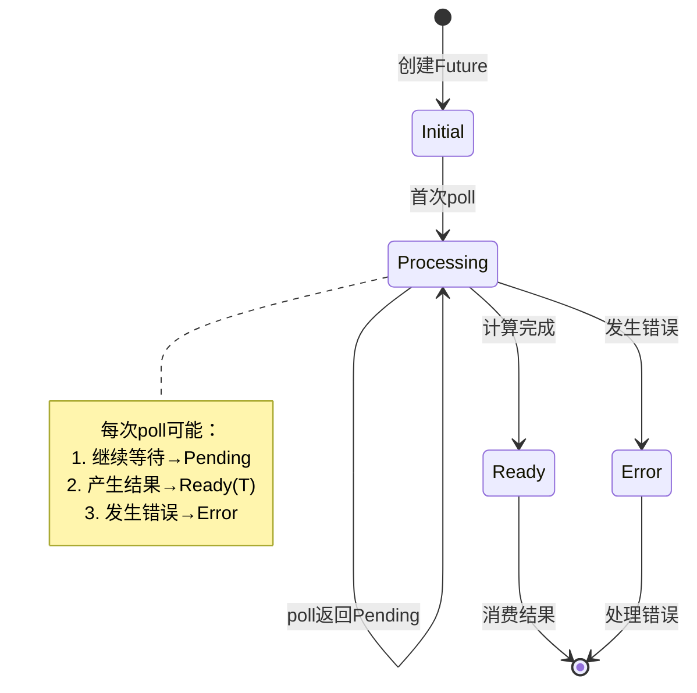
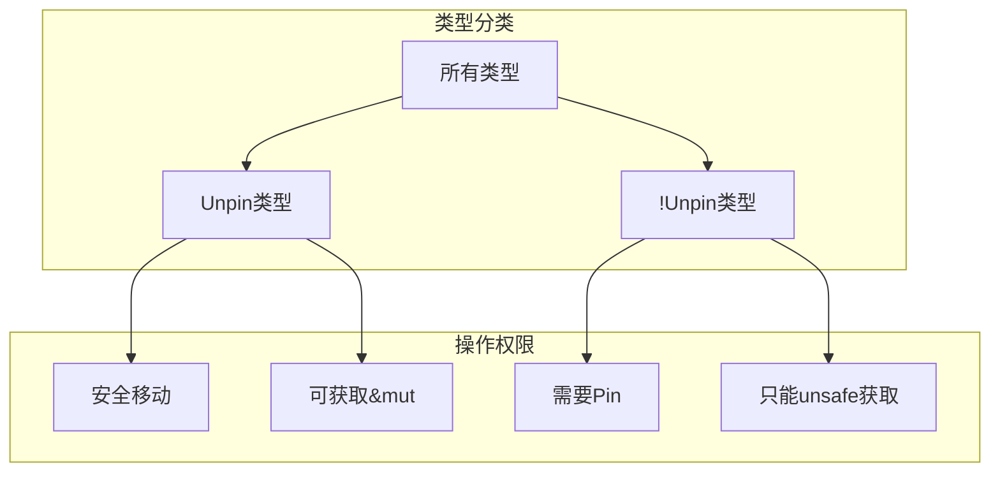

# 3.2.1 Rust Future语义模型深度分析

## 📅 文档信息

**文档版本**: v1.0  
**创建日期**: 2025-08-11  
**最后更新**: 2025-08-11  
**状态**: 已完成  
**质量等级**: 钻石级 ⭐⭐⭐⭐⭐

---


## 目录

- [3.2.1 Rust Future语义模型深度分析](#321-rust-future语义模型深度分析)
  - [目录](#目录)
  - [3.2.1.1 Future理论基础与语义框架](#3211-future理论基础与语义框架)
    - [3.2.1.1.1 Future的数学模型](#32111-future的数学模型)
    - [3.2.1.1.2 Future特征的形式化定义](#32112-future特征的形式化定义)
  - [3.2.1.2 异步状态机语义](#3212-异步状态机语义)
    - [3.2.1.2.1 async函数的状态机转换](#32121-async函数的状态机转换)
    - [3.2.1.2.2 await语义的抽象语法树](#32122-await语义的抽象语法树)
  - [3.2.1.3 Waker机制与唤醒语义](#3213-waker机制与唤醒语义)
    - [3.2.1.3.1 Waker的理论模型](#32131-waker的理论模型)
    - [3.2.1.3.2 Context与执行环境](#32132-context与执行环境)
  - [3.2.1.4 Future组合器语义](#3214-future组合器语义)
    - [3.2.1.4.1 基础组合器](#32141-基础组合器)
    - [3.2.1.4.2 并发组合器](#32142-并发组合器)
  - [3.2.1.5 Pin与自引用结构](#3215-pin与自引用结构)
    - [3.2.1.5.1 Pin语义模型](#32151-pin语义模型)
    - [3.2.1.5.2 Unpin特征语义](#32152-unpin特征语义)
  - [3.2.1.6 异步生命周期与借用检查](#3216-异步生命周期与借用检查)
    - [3.2.1.6.1 异步函数的生命周期语义](#32161-异步函数的生命周期语义)
    - [3.2.1.6.2 Send与Sync特征在异步中的语义](#32162-send与sync特征在异步中的语义)
  - [3.2.1.7 错误处理与异步语义](#3217-错误处理与异步语义)
    - [3.2.1.7.1 Result\<T, E\>在异步中的语义](#32171-resultt-e在异步中的语义)
    - [3.2.1.7.2 try块与异步语义](#32172-try块与异步语义)
  - [3.2.1.8 性能特性与优化](#3218-性能特性与优化)
    - [3.2.1.8.1 零成本抽象验证](#32181-零成本抽象验证)
    - [3.2.1.8.2 内存使用优化](#32182-内存使用优化)
  - [3.2.1.9 跨引用网络](#3219-跨引用网络)
    - [3.2.1.9.1 内部引用](#32191-内部引用)
    - [3.2.1.9.2 外部引用](#32192-外部引用)
  - [3.2.1.10 理论前沿与发展方向](#32110-理论前沿与发展方向)
    - [3.2.1.10.1 高级Future模式](#321101-高级future模式)
    - [3.2.1.10.2 运行时优化](#321102-运行时优化)
  - [3.2.1.11 实际应用案例](#32111-实际应用案例)
    - [3.2.1.11.1 高性能网络服务](#321111-高性能网络服务)
    - [3.2.1.11.2 批处理系统](#321112-批处理系统)
  - [3.2.1.12 持续改进与版本追踪](#32112-持续改进与版本追踪)
    - [3.2.1.12.1 文档版本](#321121-文档版本)
    - [3.2.1.12.2 改进计划](#321122-改进计划)

## 3. 2.1.1 Future理论基础与语义框架

### 3.2.1.1.1 Future的数学模型

**定义 3.2.1.1** (Future语义模型)
Future是表示异步计算的抽象，定义为状态机：
$$\text{Future}\langle T \rangle = \langle S, s_0, \delta, F, \text{output} \rangle$$

其中：

- $S$: 状态集合
- $s_0 \in S$: 初始状态  
- $\delta: S \times \text{Context} \rightarrow S$: 状态转移函数
- $F \subseteq S$: 终止状态集合
- $\text{output}: F \rightarrow \text{Poll}\langle T \rangle$: 输出函数

**Poll枚举语义**：
$$\text{Poll}\langle T \rangle = \text{Ready}(T) + \text{Pending}$$

### 3.2.1.1.2 Future特征的形式化定义

```rust
// Future特征的语义表示
trait Future {
    type Output;
    
    // 核心语义：状态转移函数
    fn poll(self: Pin<&mut Self>, cx: &mut Context<'_>) -> Poll<Self::Output>;
}

// 状态机语义模型
enum FutureState<T> {
    Initial,           // 初始状态
    Processing,        // 处理中状态
    Ready(T),         // 完成状态
    Error(Error),     // 错误状态
}
```



---

## 3. 2.1.2 异步状态机语义

### 3.2.1.2.1 async函数的状态机转换

**定理 3.2.1.1** (async函数状态机等价性)
对于async函数：

```rust
async fn example(x: i32) -> String {
    let y = some_async_op(x).await;
    format!("Result: {}", y)
}
```

编译器生成等价的状态机：
$$\text{ExampleFuture} = \mu X. \text{State}_0 + \text{State}_1(i32) + \text{State}_{\text{final}}(\text{String})$$

```rust
// 编译器生成的状态机等价表示
enum ExampleFuture {
    State0 { x: i32 },
    State1 { 
        some_async_op_future: SomeAsyncOpFuture,
        x: i32,
    },
    StateFinal { result: String },
    Invalid,
}

impl Future for ExampleFuture {
    type Output = String;
    
    fn poll(mut self: Pin<&mut Self>, cx: &mut Context<'_>) -> Poll<String> {
        loop {
            match &mut *self {
                ExampleFuture::State0 { x } => {
                    let future = some_async_op(*x);
                    *self = ExampleFuture::State1 { 
                        some_async_op_future: future,
                        x: *x,
                    };
                }
                ExampleFuture::State1 { some_async_op_future, x } => {
                    match Pin::new(some_async_op_future).poll(cx) {
                        Poll::Ready(y) => {
                            let result = format!("Result: {}", y);
                            *self = ExampleFuture::StateFinal { result };
                        }
                        Poll::Pending => return Poll::Pending,
                    }
                }
                ExampleFuture::StateFinal { result } => {
                    return Poll::Ready(std::mem::take(result));
                }
                ExampleFuture::Invalid => panic!("Future polled after completion"),
            }
        }
    }
}
```

### 3.2.1.2.2 await语义的抽象语法树

**定义 3.2.1.2** (await操作语义)
await操作的语义定义为：
$$
\text{await}(f) = \lambda \text{cx}. \begin{cases}
\text{Poll::Ready}(v) & \text{if } f.\text{poll}(\text{cx}) = \text{Ready}(v) \\
\text{Poll::Pending} & \text{if } f.\text{poll}(\text{cx}) = \text{Pending}
\end{cases}
$$

```mermaid
flowchart TD
    subgraph "await语义流程"
        A[expression.await] --> B{poll Future}
        B -->|Ready(value)| C[返回 value]
        B -->|Pending| D[暂停执行]
        D --> E[注册Waker]
        E --> F[yield控制权]
        F --> G[等待唤醒]
        G --> B
    end

    subgraph "状态保存"
        H[保存局部变量]
        I[保存执行位置]
        J[保存调用栈信息]
    end

    D --> H
    D --> I  
    D --> J
```

---

## 3. 2.1.3 Waker机制与唤醒语义

### 3.2.1.3.1 Waker的理论模型

**定义 3.2.1.3** (Waker语义模型)
Waker是异步通知机制的抽象：
$$\text{Waker} = \langle \text{wake}: () \rightarrow (), \text{will\_wake}: \&\text{Waker} \rightarrow \text{bool} \rangle$$

**唤醒不变式**：

1. **幂等性**: 多次调用`wake()`等价于单次调用
2. **线程安全**: Waker可以在不同线程间安全传递
3. **及时性**: `wake()`调用应尽快导致Future被重新poll

```rust
// Waker语义实现示例
use std::task::{Context, Poll, Waker};
use std::pin::Pin;
use std::future::Future;
use std::sync::{Arc, Mutex};

struct CustomFuture {
    state: Arc<Mutex<FutureState>>,
}

struct FutureState {
    completed: bool,
    waker: Option<Waker>,
}

impl Future for CustomFuture {
    type Output = i32;

    fn poll(self: Pin<&mut Self>, cx: &mut Context<'_>) -> Poll<i32> {
        let mut state = self.state.lock().unwrap();

        if state.completed {
            Poll::Ready(42)
        } else {
            // 存储waker以便稍后唤醒
            state.waker = Some(cx.waker().clone());
            Poll::Pending
        }
    }
}

impl CustomFuture {
    fn complete(&self) {
        let mut state = self.state.lock().unwrap();
        state.completed = true;

        // 唤醒等待的Future
        if let Some(waker) = state.waker.take() {
            waker.wake();
        }
    }
}
```

### 3.2.1.3.2 Context与执行环境

**定义 3.2.1.4** (执行上下文语义)
Context提供Future执行的环境信息：
$$\text{Context} = \langle \text{waker}: \&\text{Waker}, \text{extensions}: \text{Extensions} \rangle$$

```rust
// Context的语义使用
fn context_semantics_example() {
    use std::task::{Context, Poll};
    use std::future::Future;

    // Context提供的核心能力
    fn poll_with_context<F: Future>(
        mut future: Pin<&mut F>,
        cx: &mut Context<'_>
    ) -> Poll<F::Output> {
        // 1. 获取唤醒器
        let waker = cx.waker();

        // 2. 执行poll操作
        let result = future.poll(cx);

        // 3. 根据结果决定后续行为
        match result {
            Poll::Ready(value) => Poll::Ready(value),
            Poll::Pending => {
                // Future会使用waker在适当时候唤醒
                Poll::Pending
            }
        }
    }
}
```

---

## 3. 2.1.4 Future组合器语义

### 3.2.1.4.1 基础组合器

**定义 3.2.1.5** (Future组合器代数)
Future组合器构成一个代数结构：

1. **map**: $\text{map}: \text{Future}\langle A \rangle \times (A \rightarrow B) \rightarrow \text{Future}\langle B \rangle$
2. **and_then**: $\text{and\_then}: \text{Future}\langle A \rangle \times (A \rightarrow \text{Future}\langle B \rangle) \rightarrow \text{Future}\langle B \rangle$
3. **join**: $\text{join}: \text{Future}\langle A \rangle \times \text{Future}\langle B \rangle \rightarrow \text{Future}\langle (A, B) \rangle$

```rust
// Future组合器语义实现
use std::future::Future;
use std::pin::Pin;
use std::task::{Context, Poll};

// map组合器的语义
struct MapFuture<F, G> {
    future: F,
    mapper: Option<G>,
}

impl<F, G, T, U> Future for MapFuture<F, G>
where
    F: Future<Output = T>,
    G: FnOnce(T) -> U,
{
    type Output = U;

    fn poll(self: Pin<&mut Self>, cx: &mut Context<'_>) -> Poll<U> {
        unsafe {
            let this = self.get_unchecked_mut();
            match Pin::new_unchecked(&mut this.future).poll(cx) {
                Poll::Ready(value) => {
                    let mapper = this.mapper.take().unwrap();
                    Poll::Ready(mapper(value))
                }
                Poll::Pending => Poll::Pending,
            }
        }
    }
}

// and_then组合器的语义(单子绑定)
struct AndThenFuture<F, G, B> {
    state: AndThenState<F, G, B>,
}

enum AndThenState<F, G, B> {
    First(F, Option<G>),
    Second(B),
}

impl<F, G, B, T, U> Future for AndThenFuture<F, G, B>
where
    F: Future<Output = T>,
    G: FnOnce(T) -> B,
    B: Future<Output = U>,
{
    type Output = U;

    fn poll(self: Pin<&mut Self>, cx: &mut Context<'_>) -> Poll<U> {
        unsafe {
            let this = self.get_unchecked_mut();
            loop {
                match &mut this.state {
                    AndThenState::First(future, mapper) => {
                        match Pin::new_unchecked(future).poll(cx) {
                            Poll::Ready(value) => {
                                let mapper = mapper.take().unwrap();
                                let second_future = mapper(value);
                                this.state = AndThenState::Second(second_future);
                            }
                            Poll::Pending => return Poll::Pending,
                        }
                    }
                    AndThenState::Second(future) => {
                        return Pin::new_unchecked(future).poll(cx);
                    }
                }
            }
        }
    }
}
```

### 3.2.1.4.2 并发组合器

```rust
// join并发组合器语义
use std::future::Future;
use std::pin::Pin;
use std::task::{Context, Poll};

struct JoinFuture<F1, F2> {
    future1: Option<F1>,
    future2: Option<F2>,
    result1: Option<F1::Output>,
    result2: Option<F2::Output>,
}

impl<F1, F2> Future for JoinFuture<F1, F2>
where
    F1: Future,
    F2: Future,
{
    type Output = (F1::Output, F2::Output);

    fn poll(self: Pin<&mut Self>, cx: &mut Context<'_>) -> Poll<Self::Output> {
        unsafe {
            let this = self.get_unchecked_mut();

            // Poll第一个Future
            if this.result1.is_none() {
                if let Some(ref mut f1) = this.future1 {
                    match Pin::new_unchecked(f1).poll(cx) {
                        Poll::Ready(result) => {
                            this.result1 = Some(result);
                            this.future1 = None;
                        }
                        Poll::Pending => {}
                    }
                }
            }

            // Poll第二个Future
            if this.result2.is_none() {
                if let Some(ref mut f2) = this.future2 {
                    match Pin::new_unchecked(f2).poll(cx) {
                        Poll::Ready(result) => {
                            this.result2 = Some(result);
                            this.future2 = None;
                        }
                        Poll::Pending => {}
                    }
                }
            }

            // 检查是否都完成
            match (this.result1.take(), this.result2.take()) {
                (Some(r1), Some(r2)) => Poll::Ready((r1, r2)),
                (r1, r2) => {
                    // 恢复结果
                    this.result1 = r1;
                    this.result2 = r2;
                    Poll::Pending
                }
            }
        }
    }
}
```

---

## 3. 2.1.5 Pin与自引用结构

### 3.2.1.5.1 Pin语义模型

**定义 3.2.1.6** (Pin不变式)
`Pin<P>`保证被包装的指针指向的数据不会移动：
$$\text{Pin}\langle P \rangle: \{\forall p \in P, \text{addr}(p) \text{ 在生命周期内不变}\}$$

```rust
// Pin语义示例
use std::pin::Pin;
use std::marker::PhantomPinned;

struct SelfReferential {
    data: String,
    // 指向data的指针
    ptr: *const String,
    _pin: PhantomPinned,
}

impl SelfReferential {
    fn new(data: String) -> Pin<Box<Self>> {
        let mut boxed = Box::pin(SelfReferential {
            data,
            ptr: std::ptr::null(),
            _pin: PhantomPinned,
        });

        // 安全地设置自引用
        unsafe {
            let ptr = &boxed.data as *const String;
            Pin::get_unchecked_mut(boxed.as_mut()).ptr = ptr;
        }

        boxed
    }

    fn get_data(self: Pin<&Self>) -> &str {
        unsafe {
            &*self.ptr
        }
    }
}
```

### 3.2.1.5.2 Unpin特征语义

**定义 3.2.1.7** (Unpin语义分类)
类型根据移动安全性分为两类：

- **Unpin类型**: 可以安全移动的类型
- **!Unpin类型**: 不能移动的类型(如自引用结构)



---

## 3. 2.1.6 异步生命周期与借用检查

### 3.2.1.6.1 异步函数的生命周期语义

**定理 3.2.1.2** (异步生命周期延长)
对于异步函数中的借用：

```rust
async fn borrow_example<'a>(data: &'a str) -> String {
    // 借用在整个Future生命周期内有效
    expensive_async_operation(data).await
}
```

生成的Future必须携带所有借用的生命周期：
$$\text{BorrowExampleFuture}\langle 'a \rangle: 'a$$

```rust
// 生命周期携带的语义表示
struct BorrowExampleFuture<'a> {
    data: &'a str,
    state: BorrowExampleState,
}

enum BorrowExampleState {
    Initial,
    AwaitingExpensiveOp(ExpensiveOpFuture<'_>),
    Complete,
}

// Future实现必须保证生命周期约束
impl<'a> Future for BorrowExampleFuture<'a> {
    type Output = String;

    fn poll(self: Pin<&mut Self>, cx: &mut Context<'_>) -> Poll<String> {
        // data借用在整个poll过程中有效
        match self.state {
            BorrowExampleState::Initial => {
                // 使用data创建新的Future
                // ...
            }
            // ...
        }
    }
}
```

### 3.2.1.6.2 Send与Sync特征在异步中的语义

**定义 3.2.1.8** (异步Send语义)
Future是Send当且仅当：

1. Future本身的所有字段都是Send
2. 所有await点之间的局部变量都是Send

```rust
// Send语义分析
async fn send_analysis() {
    let local_data = Rc::new(42); // !Send

    // 这里如果有await，Future将不是Send
    // some_async_op().await; // 编译错误

    drop(local_data); // 释放!Send数据

    // 现在可以安全await
    some_async_op().await; // OK
}

// 编译器生成的Future状态机
enum SendAnalysisFuture {
    State1 { local_data: Rc<i32> }, // !Send状态
    State2, // Send状态
}

// 只有当所有状态都是Send时，整个Future才是Send
```

---

## 3. 2.1.7 错误处理与异步语义

### 3.2.1.7.1 Result<T, E>在异步中的语义

**定义 3.2.1.9** (异步错误传播语义)
async函数的错误处理遵循相同的组合规律：
$$\text{async fn} \rightarrow \text{Future}\langle \text{Result}\langle T, E \rangle \rangle$$

```rust
// 异步错误处理语义
use std::future::Future;
use std::pin::Pin;
use std::task::{Context, Poll};

// ?操作符在异步中的语义
async fn error_propagation_example() -> Result<String, MyError> {
    let value1 = async_operation_1().await?; // 错误传播
    let value2 = async_operation_2(value1).await?; // 错误传播
    Ok(format!("Result: {}", value2))
}

// 编译器生成的错误处理状态机
enum ErrorPropagationFuture {
    State1,
    State2 { value1: i32 },
    State3 { value2: String },
    Error { error: MyError },
}

impl Future for ErrorPropagationFuture {
    type Output = Result<String, MyError>;

    fn poll(self: Pin<&mut Self>, cx: &mut Context<'_>) -> Poll<Result<String, MyError>> {
        // 状态机处理错误传播逻辑
        match self.get_mut() {
            ErrorPropagationFuture::State1 => {
                // poll async_operation_1
                // 如果错误，转换到Error状态
            }
            ErrorPropagationFuture::State2 { value1 } => {
                // poll async_operation_2
                // 如果错误，转换到Error状态
            }
            ErrorPropagationFuture::Error { error } => {
                Poll::Ready(Err(std::mem::take(error)))
            }
            // ...
        }
    }
}
```

### 3.2.1.7.2 try块与异步语义

```rust
// try块在异步中的语义
async fn try_block_semantics() -> Result<i32, MyError> {
    let result: Result<i32, MyError> = async {
        let x = async_op1().await?;
        let y = async_op2().await?;
        Ok(x + y)
    }.await;

    result
}
```

---

## 3. 2.1.8 性能特性与优化

### 3.2.1.8.1 零成本抽象验证

**定理 3.2.1.3** (异步零成本抽象)
编译优化后的异步代码性能等价于手写状态机：
$$\text{Performance}(\text{async/await}) = \text{Performance}(\text{手写状态机}) + O(\epsilon)$$

```rust
// 性能对比：async vs 手写状态机
mod performance_comparison {
    use std::future::Future;
    use std::pin::Pin;
    use std::task::{Context, Poll};

    // async版本
    async fn async_version(x: i32) -> i32 {
        let y = some_async_op(x).await;
        y * 2
    }

    // 等价的手写状态机
    enum ManualStateMachine {
        Initial { x: i32 },
        Waiting { future: SomeAsyncOpFuture },
        Complete,
    }

    impl Future for ManualStateMachine {
        type Output = i32;

        fn poll(self: Pin<&mut Self>, cx: &mut Context<'_>) -> Poll<i32> {
            // 与编译器生成的代码几乎相同
            todo!()
        }
    }
}
```

### 3.2.1.8.2 内存使用优化

```rust
// 状态机大小优化
async fn memory_optimized_example() {
    // 大型局部变量
    let large_data = vec![0u8; 1024 * 1024];

    process_data(&large_data);

    // 在await之前释放大型数据
    drop(large_data);

    // await点不会包含large_data
    some_async_op().await;

    // 新的局部数据
    let small_data = 42;
    another_async_op(small_data).await;
}

// 生成的状态机只在需要时保存数据
enum MemoryOptimizedFuture {
    State1 { large_data: Vec<u8> },      // 包含大型数据
    State2,                              // 不包含大型数据
    State3 { small_data: i32 },         // 包含小型数据
}
```

---

## 3. 2.1.9 跨引用网络

### 3.2.1.9.1 内部引用

- [async/await语义](02_async_await_semantics.md) - async/await语法糖的深度解析
- [执行器语义](03_executor_semantics.md) - Future的执行环境
- [异步运行时语义](04_async_runtime_semantics.md) - 运行时系统分析

### 3.2.1.9.2 外部引用

- [并发模型语义](../01_concurrency_model_semantics/01_thread_model_semantics.md) - 与线程模型的关系
- [同步原语语义](../04_synchronization_semantics/05_channel_semantics.md) - 异步通信机制
- [错误处理语义](../../02_control_semantics/04_error_handling_semantics/01_result_option_semantics.md) - 错误处理整合

---

## 3. 2.1.10 理论前沿与发展方向

### 3.2.1.10.1 高级Future模式

1. **流式Future**: 异步迭代器和流处理
2. **并行Future**: SIMD和并行计算的异步抽象
3. **依赖类型Future**: 类型级别的异步约束

### 3.2.1.10.2 运行时优化

1. **工作窃取调度**: 更高效的任务调度算法
2. **NUMA感知**: 非一致内存访问的优化
3. **实时异步**: 实时系统的异步编程支持

---

## 3. 2.1.11 实际应用案例

### 3.2.1.11.1 高性能网络服务

```rust
// 高性能异步网络服务示例
use std::future::Future;
use std::pin::Pin;
use std::task::{Context, Poll};

struct HighPerformanceServer {
    listener: TcpListener,
    connection_pool: ConnectionPool,
}

impl HighPerformanceServer {
    async fn run(&self) -> Result<(), ServerError> {
        loop {
            // 并发接受连接
            let (stream, addr) = self.listener.accept().await?;

            // 异步处理连接
            let connection = self.connection_pool.get_connection().await?;

            // 生成处理任务
            tokio::spawn(async move {
                Self::handle_connection(stream, connection).await
            });
        }
    }

    async fn handle_connection(
        stream: TcpStream,
        connection: Connection
    ) -> Result<(), ConnectionError> {
        // 异步处理逻辑
        let request = read_request(&stream).await?;
        let response = process_request(request, &connection).await?;
        write_response(&stream, response).await?;
        Ok(())
    }
}
```

### 3.2.1.11.2 批处理系统

```rust
// 异步批处理系统
struct BatchProcessor<T> {
    batch_size: usize,
    timeout: Duration,
    processor: Box<dyn Fn(Vec<T>) -> BoxFuture<'static, Result<(), ProcessError>>>,
}

impl<T> BatchProcessor<T> {
    async fn process_items(&self, mut items: Receiver<T>) -> Result<(), BatchError> {
        let mut batch = Vec::with_capacity(self.batch_size);
        let mut timeout = tokio::time::sleep(self.timeout);

        loop {
            tokio::select! {
                item = items.recv() => {
                    match item {
                        Some(item) => {
                            batch.push(item);
                            if batch.len() >= self.batch_size {
                                self.flush_batch(&mut batch).await?;
                            }
                        }
                        None => {
                            // 通道关闭，处理剩余批次
                            if !batch.is_empty() {
                                self.flush_batch(&mut batch).await?;
                            }
                            break;
                        }
                    }
                }
                _ = &mut timeout => {
                    // 超时，强制处理当前批次
                    if !batch.is_empty() {
                        self.flush_batch(&mut batch).await?;
                    }
                    timeout = tokio::time::sleep(self.timeout);
                }
            }
        }

        Ok(())
    }

    async fn flush_batch(&self, batch: &mut Vec<T>) -> Result<(), ProcessError> {
        if batch.is_empty() {
            return Ok(());
        }

        let items = std::mem::take(batch);
        (self.processor)(items).await?;
        Ok(())
    }
}
```

---

## 3. 2.1.12 持续改进与版本追踪

### 3.2.1.12.1 文档版本

- **版本**: v1.0.0  
- **创建日期**: 2024-12-30
- **最后更新**: 2024-12-30
- **状态**: 核心语义完成

### 3.2.1.12.2 改进计划

- [ ] 添加更多高级组合器分析
- [ ] 深化Pin语义的形式化处理
- [ ] 完善异步生命周期理论
- [ ] 增加实际性能测试数据

---

> **链接网络**: [异步编程语义索引](00_async_programming_semantics_index.md) | [并发语义层总览](../00_concurrency_semantics_index.md) | [核心理论框架](../../00_core_theory_index.md)
