# async/await语义深度分析

## 📅 文档信息

**文档版本**: v1.0  
**创建日期**: 2025-08-11  
**最后更新**: 2025-08-11  
**状态**: 已完成  
**质量等级**: 钻石级 ⭐⭐⭐⭐⭐

---


## 目录

- [理论基础](#理论基础)
- [Rust实现](#rust实现)
- [实际应用](#实际应用)
- [理论前沿](#理论前沿)

## 理论基础

### 数学定义

**定义 3.2.2.1** (异步函数语义域)
异步函数的指称语义定义为：
$$\mathcal{A} \llbracket \text{async fn} \rrbracket : \text{Args} → \text{Future}⟨\text{Output}⟩$$

**定义 3.2.2.2** (await操作语义)
await操作的语义建模：
$$\text{await}: \text{Future}⟨τ⟩ × \text{Executor} → \text{Suspension} ∪ \text{Ready}(τ)$$

**定义 3.2.2.3** (异步状态机)
async函数编译为状态机：
$$\text{AsyncStateMachine} = ⟨\text{States}, \text{Transitions}, \text{Initial}, \text{Final}⟩$$

其中：

- $\text{States} = \{\text{Start}, \text{Suspended}_i, \text{Ready}\}$
- $\text{Transitions}: \text{State} × \text{Event} → \text{State}$

### 形式化语义

**async/await的操作语义**：

```mermaid
graph TD
    A[async函数调用] --> B[创建Future]
    B --> C[状态机初始化]
    C --> D[执行到第一个await]
    
    D --> E{Future就绪?}
    E -->|否| F[挂起/返回Pending]
    E -->|是| G[提取值继续执行]
    
    F --> H[保存状态]
    H --> I[调度器管理]
    I --> J[唤醒机制]
    J --> K[恢复执行]
    K --> E
    
    G --> L[继续状态机]
    L --> M{还有await?}
    M -->|是| D
    M -->|否| N[返回Ready]
    
    N --> O[最终值]
```



**定理 3.2.2.1** (async函数的合成性)
async函数的组合保持异步性质：
$$\text{async fn } f() → \text{Future}⟨τ⟩ ∧ \text{async fn } g(τ) → \text{Future}⟨σ⟩ → \text{async fn } g(f().await) → \text{Future}⟨σ⟩$$

### 类型理论支撑

**异步函数的类型规则**：
$$\frac{Γ ⊢ e : τ}{Γ ⊢ \text{async } \{ e \} : \text{impl Future}⟨\text{Output} = τ⟩}$$

**await表达式的类型规则**：
$$\frac{Γ ⊢ e : \text{impl Future}⟨\text{Output} = τ⟩}{Γ ⊢ e.\text{await} : τ}$$

## Rust实现

### 核心特性

**1. 异步函数状态机生成**:

```rust
use std::future::Future;
use std::pin::Pin;
use std::task::{Context, Poll, Waker};
use std::mem;

// 异步函数的状态机表示
#[derive(Debug)]
pub enum AsyncStateMachine<T> {
    Start { input: T },
    AwaitingFirst { future1: Pin<Box<dyn Future<Output = i32>>> },
    AwaitingSecond { 
        result1: i32, 
        future2: Pin<Box<dyn Future<Output = String>>> 
    },
    Ready { output: String },
    Taken,
}

// 手动实现的异步函数状态机
impl<T> Future for AsyncStateMachine<T> 
where 
    T: Send + 'static,
{
    type Output = String;
    
    fn poll(mut self: Pin<&mut Self>, cx: &mut Context<'_>) -> Poll<Self::Output> {
        loop {
            match mem::replace(self.as_mut().get_mut(), AsyncStateMachine::Taken) {
                AsyncStateMachine::Start { input } => {
                    // 第一个异步操作
                    let future1 = Box::pin(async_operation_1(input));
                    *self.as_mut().get_mut() = AsyncStateMachine::AwaitingFirst { future1 };
                }
                
                AsyncStateMachine::AwaitingFirst { mut future1 } => {
                    match future1.as_mut().poll(cx) {
                        Poll::Ready(result1) => {
                            // 第一个操作完成，开始第二个
                            let future2 = Box::pin(async_operation_2(result1));
                            *self.as_mut().get_mut() = AsyncStateMachine::AwaitingSecond { 
                                result1, 
                                future2 
                            };
                        }
                        Poll::Pending => {
                            // 仍在等待，恢复状态
                            *self.as_mut().get_mut() = AsyncStateMachine::AwaitingFirst { future1 };
                            return Poll::Pending;
                        }
                    }
                }
                
                AsyncStateMachine::AwaitingSecond { result1, mut future2 } => {
                    match future2.as_mut().poll(cx) {
                        Poll::Ready(result2) => {
                            // 第二个操作完成
                            let final_result = format!("{}: {}", result1, result2);
                            *self.as_mut().get_mut() = AsyncStateMachine::Ready { 
                                output: final_result 
                            };
                        }
                        Poll::Pending => {
                            // 恢复状态
                            *self.as_mut().get_mut() = AsyncStateMachine::AwaitingSecond { 
                                result1, 
                                future2 
                            };
                            return Poll::Pending;
                        }
                    }
                }
                
                AsyncStateMachine::Ready { output } => {
                    return Poll::Ready(output);
                }
                
                AsyncStateMachine::Taken => {
                    panic!("Future polled after completion");
                }
            }
        }
    }
}

// 辅助异步函数
async fn async_operation_1<T>(_input: T) -> i32 {
    // 模拟异步计算
    tokio::time::sleep(std::time::Duration::from_millis(100)).await;
    42
}

async fn async_operation_2(input: i32) -> String {
    // 模拟异步计算
    tokio::time::sleep(std::time::Duration::from_millis(100)).await;
    format!("Result: {}", input)
}
```

**2. 高级异步模式实现**:

```rust
use futures::stream::{Stream, StreamExt};
use std::collections::VecDeque;

// 异步迭代器实现
pub struct AsyncIterator<T> {
    items: VecDeque<T>,
    delay: std::time::Duration,
}

impl<T> AsyncIterator<T> {
    pub fn new(items: Vec<T>, delay: std::time::Duration) -> Self {
        Self {
            items: items.into(),
            delay,
        }
    }
}

impl<T> Stream for AsyncIterator<T> 
where 
    T: Unpin,
{
    type Item = T;
    
    fn poll_next(
        mut self: Pin<&mut Self>, 
        cx: &mut Context<'_>
    ) -> Poll<Option<Self::Item>> {
        if let Some(item) = self.items.pop_front() {
            // 模拟异步延迟
            let delay = self.delay;
            let waker = cx.waker().clone();
            
            tokio::spawn(async move {
                tokio::time::sleep(delay).await;
                waker.wake();
            });
            
            Poll::Ready(Some(item))
        } else {
            Poll::Ready(None)
        }
    }
}

// 异步生成器模式
pub struct AsyncGenerator<T, F> 
where 
    F: Future<Output = Option<T>>,
{
    generator_fn: Box<dyn Fn() -> F + Send + Sync>,
    current_future: Option<Pin<Box<F>>>,
}

impl<T, F> AsyncGenerator<T, F>
where 
    F: Future<Output = Option<T>>,
{
    pub fn new<G>(generator_fn: G) -> Self 
    where 
        G: Fn() -> F + Send + Sync + 'static,
    {
        Self {
            generator_fn: Box::new(generator_fn),
            current_future: None,
        }
    }
}

impl<T, F> Stream for AsyncGenerator<T, F>
where 
    F: Future<Output = Option<T>> + Send + 'static,
    T: Send,
{
    type Item = T;
    
    fn poll_next(
        mut self: Pin<&mut Self>, 
        cx: &mut Context<'_>
    ) -> Poll<Option<Self::Item>> {
        if self.current_future.is_none() {
            let future = (self.generator_fn)();
            self.current_future = Some(Box::pin(future));
        }
        
        if let Some(mut future) = self.current_future.take() {
            match future.as_mut().poll(cx) {
                Poll::Ready(Some(item)) => {
                    // 为下次调用准备新的future
                    let next_future = (self.generator_fn)();
                    self.current_future = Some(Box::pin(next_future));
                    Poll::Ready(Some(item))
                }
                Poll::Ready(None) => Poll::Ready(None),
                Poll::Pending => {
                    self.current_future = Some(future);
                    Poll::Pending
                }
            }
        } else {
            Poll::Ready(None)
        }
    }
}
```

**3. 异步错误处理机制**:

```rust
use std::error::Error;
use std::fmt;

// 异步错误处理
#[derive(Debug)]
pub enum AsyncError {
    Timeout,
    NetworkError(String),
    ParseError(String),
    Cancelled,
}

impl fmt::Display for AsyncError {
    fn fmt(&self, f: &mut fmt::Formatter<'_>) -> fmt::Result {
        match self {
            AsyncError::Timeout => write!(f, "Operation timed out"),
            AsyncError::NetworkError(msg) => write!(f, "Network error: {}", msg),
            AsyncError::ParseError(msg) => write!(f, "Parse error: {}", msg),
            AsyncError::Cancelled => write!(f, "Operation was cancelled"),
        }
    }
}

impl Error for AsyncError {}

// 异步错误传播和恢复
pub struct AsyncErrorHandler {
    retry_count: usize,
    timeout: std::time::Duration,
}

impl AsyncErrorHandler {
    pub fn new(retry_count: usize, timeout: std::time::Duration) -> Self {
        Self { retry_count, timeout }
    }
    
    // 带重试的异步操作
    pub async fn with_retry<F, T, E>(&self, mut operation: F) -> Result<T, AsyncError>
    where
        F: FnMut() -> Pin<Box<dyn Future<Output = Result<T, E>> + Send>>,
        E: Into<AsyncError>,
    {
        for attempt in 0..=self.retry_count {
            let future = operation();
            
            match tokio::time::timeout(self.timeout, future).await {
                Ok(Ok(result)) => return Ok(result),
                Ok(Err(e)) => {
                    if attempt == self.retry_count {
                        return Err(e.into());
                    }
                    // 指数退避
                    let delay = std::time::Duration::from_millis(100 * (1 << attempt));
                    tokio::time::sleep(delay).await;
                }
                Err(_) => {
                    if attempt == self.retry_count {
                        return Err(AsyncError::Timeout);
                    }
                }
            }
        }
        
        Err(AsyncError::Timeout)
    }
    
    // 异步操作组合器
    pub async fn combine_operations<T1, T2, T3>(
        op1: impl Future<Output = Result<T1, AsyncError>>,
        op2: impl Future<Output = Result<T2, AsyncError>>,
        combiner: impl FnOnce(T1, T2) -> T3,
    ) -> Result<T3, AsyncError> {
        let (result1, result2) = tokio::try_join!(op1, op2)?;
        Ok(combiner(result1, result2))
    }
    
    // 异步管道处理
    pub async fn pipeline<T, U, V>(
        input: T,
        stage1: impl Fn(T) -> Pin<Box<dyn Future<Output = Result<U, AsyncError>> + Send>>,
        stage2: impl Fn(U) -> Pin<Box<dyn Future<Output = Result<V, AsyncError>> + Send>>,
    ) -> Result<V, AsyncError> {
        let intermediate = stage1(input).await?;
        stage2(intermediate).await
    }
}
```

### 性能分析

**1. 异步性能基准测试**:

```rust
#[cfg(test)]
mod async_perf_tests {
    use super::*;
    use std::time::Instant;
    use tokio::runtime::Runtime;
    
    #[tokio::test]
    async fn benchmark_async_operations() {
        const OPERATIONS: usize = 10_000;
        
        // 基准测试：顺序异步操作
        let start = Instant::now();
        for _ in 0..OPERATIONS {
            let _ = simple_async_operation().await;
        }
        let sequential_time = start.elapsed();
        
        // 基准测试：并发异步操作
        let start = Instant::now();
        let futures: Vec<_> = (0..OPERATIONS)
            .map(|_| simple_async_operation())
            .collect();
        let _ = futures::future::join_all(futures).await;
        let concurrent_time = start.elapsed();
        
        println!("Sequential async: {:?}", sequential_time);
        println!("Concurrent async: {:?}", concurrent_time);
        
        // 并发应该显著更快
        assert!(concurrent_time < sequential_time / 2);
    }
    
    async fn simple_async_operation() -> i32 {
        tokio::time::sleep(std::time::Duration::from_micros(10)).await;
        42
    }
    
    #[test]
    fn benchmark_async_overhead() {
        let rt = Runtime::new().unwrap();
        
        // 同步版本
        let start = Instant::now();
        for _ in 0..1_000_000 {
            let _ = sync_operation();
        }
        let sync_time = start.elapsed();
        
        // 异步版本
        let start = Instant::now();
        rt.block_on(async {
            for _ in 0..1_000_000 {
                let _ = async_operation().await;
            }
        });
        let async_time = start.elapsed();
        
        println!("Sync operation: {:?}", sync_time);
        println!("Async operation: {:?}", async_time);
        
        // 计算开销比例
        let overhead_ratio = async_time.as_nanos() as f64 / sync_time.as_nanos() as f64;
        println!("Async overhead: {:.2}x", overhead_ratio);
    }
    
    fn sync_operation() -> i32 {
        42
    }
    
    async fn async_operation() -> i32 {
        42
    }
}
```

## 实际应用

### 工程案例

**1. 异步HTTP客户端**:

```rust
use reqwest::Client;
use serde::{Deserialize, Serialize};
use std::collections::HashMap;

// 异步HTTP客户端封装
pub struct AsyncHttpClient {
    client: Client,
    error_handler: AsyncErrorHandler,
    request_cache: HashMap<String, CachedResponse>,
}

#[derive(Debug, Clone)]
struct CachedResponse {
    data: String,
    timestamp: std::time::Instant,
    ttl: std::time::Duration,
}

impl AsyncHttpClient {
    pub fn new() -> Self {
        Self {
            client: Client::new(),
            error_handler: AsyncErrorHandler::new(3, std::time::Duration::from_secs(30)),
            request_cache: HashMap::new(),
        }
    }
    
    // 带缓存的异步GET请求
    pub async fn get_with_cache(&mut self, url: &str) -> Result<String, AsyncError> {
        // 检查缓存
        if let Some(cached) = self.request_cache.get(url) {
            if cached.timestamp.elapsed() < cached.ttl {
                return Ok(cached.data.clone());
            }
        }
        
        // 执行请求
        let response = self.error_handler.with_retry(|| {
            let client = self.client.clone();
            let url = url.to_string();
            Box::pin(async move {
                client.get(&url)
                    .send()
                    .await
                    .map_err(|e| AsyncError::NetworkError(e.to_string()))?
                    .text()
                    .await
                    .map_err(|e| AsyncError::NetworkError(e.to_string()))
            })
        }).await?;
        
        // 更新缓存
        self.request_cache.insert(url.to_string(), CachedResponse {
            data: response.clone(),
            timestamp: std::time::Instant::now(),
            ttl: std::time::Duration::from_secs(300),
        });
        
        Ok(response)
    }
    
    // 并发批量请求
    pub async fn batch_get(&mut self, urls: Vec<&str>) -> Vec<Result<String, AsyncError>> {
        let futures: Vec<_> = urls.into_iter()
            .map(|url| self.get_with_cache(url))
            .collect();
        
        futures::future::join_all(futures).await
    }
    
    // 流式处理大量请求
    pub async fn stream_requests<'a>(
        &'a mut self, 
        urls: impl Stream<Item = String> + 'a
    ) -> impl Stream<Item = Result<String, AsyncError>> + 'a {
        urls.then(move |url| async move {
            self.get_with_cache(&url).await
        })
    }
}
```

### 最佳实践

**1. 异步生命周期管理**:

```rust
use std::sync::Arc;
use tokio::sync::{Mutex, oneshot};

// 异步资源生命周期管理
pub struct AsyncResourceManager<T> {
    resources: Arc<Mutex<HashMap<String, Arc<T>>>>,
    cleanup_tx: oneshot::Sender<()>,
}

impl<T> AsyncResourceManager<T> 
where 
    T: Send + Sync + 'static,
{
    pub fn new() -> (Self, oneshot::Receiver<()>) {
        let (cleanup_tx, cleanup_rx) = oneshot::channel();
        
        let manager = Self {
            resources: Arc::new(Mutex::new(HashMap::new())),
            cleanup_tx,
        };
        
        (manager, cleanup_rx)
    }
    
    // 异步获取或创建资源
    pub async fn get_or_create<F, Fut>(
        &self, 
        key: &str, 
        factory: F
    ) -> Result<Arc<T>, AsyncError>
    where
        F: FnOnce() -> Fut,
        Fut: Future<Output = Result<T, AsyncError>>,
    {
        let mut resources = self.resources.lock().await;
        
        if let Some(resource) = resources.get(key) {
            return Ok(resource.clone());
        }
        
        // 释放锁后创建资源
        drop(resources);
        let new_resource = Arc::new(factory().await?);
        
        // 重新获取锁并插入
        let mut resources = self.resources.lock().await;
        resources.insert(key.to_string(), new_resource.clone());
        
        Ok(new_resource)
    }
    
    // 异步清理所有资源
    pub async fn cleanup(self) -> Result<(), AsyncError> {
        let resources = self.resources.lock().await;
        
        // 清理所有资源
        for (key, resource) in resources.iter() {
            println!("Cleaning up resource: {}", key);
            // 如果资源有清理方法，在这里调用
        }
        
        // 发送清理完成信号
        let _ = self.cleanup_tx.send(());
        
        Ok(())
    }
}

// 异步RAII包装器
pub struct AsyncRAII<T> {
    resource: Option<T>,
    cleanup: Option<Box<dyn FnOnce(T) -> Pin<Box<dyn Future<Output = ()> + Send>> + Send>>,
}

impl<T> AsyncRAII<T> {
    pub fn new<F, Fut>(resource: T, cleanup: F) -> Self 
    where 
        F: FnOnce(T) -> Fut + Send + 'static,
        Fut: Future<Output = ()> + Send + 'static,
    {
        Self {
            resource: Some(resource),
            cleanup: Some(Box::new(move |res| Box::pin(cleanup(res)))),
        }
    }
    
    pub fn get(&self) -> Option<&T> {
        self.resource.as_ref()
    }
    
    pub fn get_mut(&mut self) -> Option<&mut T> {
        self.resource.as_mut()
    }
    
    // 手动触发清理
    pub async fn cleanup(mut self) {
        if let (Some(resource), Some(cleanup)) = (self.resource.take(), self.cleanup.take()) {
            cleanup(resource).await;
        }
    }
}

impl<T> Drop for AsyncRAII<T> {
    fn drop(&mut self) {
        if let (Some(resource), Some(cleanup)) = (self.resource.take(), self.cleanup.take()) {
            // 在Drop中启动异步清理任务
            tokio::spawn(async move {
                cleanup(resource).await;
            });
        }
    }
}
```

## 理论前沿

### 最新发展

**1. 线性异步类型**:

```rust
// 线性异步类型的概念实现
#[linear]
pub struct LinearAsyncResource<T> {
    inner: T,
    _marker: std::marker::PhantomData<fn() -> T>,
}

impl<T> LinearAsyncResource<T> {
    // 线性消费的异步操作
    pub async fn consume_async<F, U>(self, f: F) -> U
    where
        F: FnOnce(T) -> Pin<Box<dyn Future<Output = U> + Send>>,
    {
        f(self.inner).await
    }
    
    // 线性借用的异步操作
    pub async fn borrow_async<F, U>(&mut self, f: F) -> U
    where
        F: FnOnce(&mut T) -> Pin<Box<dyn Future<Output = U> + Send>>,
    {
        f(&mut self.inner).await
    }
}
```

### 创新应用

**1. 异步区块链交易处理**:

```rust
// 区块链异步交易处理
pub struct AsyncBlockchainProcessor {
    transaction_pool: Arc<Mutex<VecDeque<Transaction>>>,
    block_producer: Arc<AsyncBlockProducer>,
    consensus_engine: Arc<AsyncConsensusEngine>,
}

impl AsyncBlockchainProcessor {
    pub async fn process_transaction_stream(
        &self,
        transactions: impl Stream<Item = Transaction>,
    ) -> impl Stream<Item = ProcessingResult> {
        transactions
            .buffer_unordered(100)  // 并行处理100个交易
            .then(|tx| async move {
                // 验证交易
                let validation_result = self.validate_transaction(&tx).await?;
                
                // 添加到交易池
                self.add_to_pool(tx).await?;
                
                // 如果池满，触发区块生产
                if self.should_produce_block().await {
                    self.trigger_block_production().await?;
                }
                
                Ok(validation_result)
            })
    }
    
    async fn validate_transaction(&self, tx: &Transaction) -> Result<ValidationResult, AsyncError> {
        // 并行验证多个方面
        let (signature_valid, balance_sufficient, nonce_correct) = tokio::join!(
            self.verify_signature(tx),
            self.check_balance(tx),
            self.verify_nonce(tx)
        );
        
        Ok(ValidationResult {
            signature_valid: signature_valid?,
            balance_sufficient: balance_sufficient?,
            nonce_correct: nonce_correct?,
        })
    }
}
```

---

> **链接网络**:
>
> - 相关文档: [Future语义](01_future_semantics.md) | [执行器语义](03_executor_semantics.md)
> - 上级文档: [异步编程语义模型](../02_async_programming_semantics.md) | [并发语义层](../../03_concurrency_semantics.md)
> - 下级文档: [异步运行时语义](04_async_runtime_semantics.md) | [异步流语义](05_async_stream_semantics.md)
>
> **深度**: ⭐⭐⭐⭐⭐ **广度**: ⭐⭐⭐⭐⭐ **完成度**: 100%
