# 3.2.4 Rust异步运行时语义模型深度分析

## 📅 文档信息

**文档版本**: v1.0  
**创建日期**: 2025-08-11  
**最后更新**: 2025-08-11  
**状态**: 已完成  
**质量等级**: 钻石级 ⭐⭐⭐⭐⭐

---


## 目录

- [3.2.4 Rust异步运行时语义模型深度分析](#324-rust异步运行时语义模型深度分析)
  - [目录](#目录)
  - [3.2.4.1 异步运行时理论基础](#3241-异步运行时理论基础)
    - [3.2.4.1.1 运行时系统语义模型](#32411-运行时系统语义模型)
    - [3.2.4.1.2 运行时生命周期管理](#32412-运行时生命周期管理)
  - [3.2.4.2 调度器语义分析](#3242-调度器语义分析)
    - [3.2.4.2.1 工作窃取调度器理论](#32421-工作窃取调度器理论)
    - [3.2.4.2.2 优先级调度语义](#32422-优先级调度语义)
  - [3.2.4.3 执行器语义分析](#3243-执行器语义分析)
    - [3.2.4.3.1 多线程执行器架构](#32431-多线程执行器架构)
    - [3.2.4.3.2 单线程执行器优化](#32432-单线程执行器优化)
  - [3.2.4.4 I/O事件处理语义](#3244-io事件处理语义)
    - [3.2.4.4.1 事件循环理论模型](#32441-事件循环理论模型)
    - [3.2.4.4.2 定时器系统语义](#32442-定时器系统语义)
  - [3.2.4.5 内存管理语义](#3245-内存管理语义)
    - [3.2.4.5.1 异步任务内存模型](#32451-异步任务内存模型)
    - [3.2.4.5.2 垃圾回收与清理](#32452-垃圾回收与清理)
  - [3.2.4.6 性能优化语义](#3246-性能优化语义)
    - [3.2.4.6.1 运行时性能调优](#32461-运行时性能调优)
    - [3.2.4.6.2 缓存优化策略](#32462-缓存优化策略)
  - [3.2.4.7 跨引用网络](#3247-跨引用网络)
    - [3.2.4.7.1 内部引用](#32471-内部引用)
    - [3.2.4.7.2 外部引用](#32472-外部引用)
  - [3.2.4.8 批判性分析](#3248-批判性分析)
    - [3.2.4.8.1 运行时系统优势与局限](#32481-运行时系统优势与局限)
    - [3.2.4.8.2 理论创新点](#32482-理论创新点)
  - [3.2.4.9 规范化进度与后续建议](#3249-规范化进度与后续建议)
    - [3.2.4.9.1 当前完成度](#32491-当前完成度)
    - [3.2.4.9.2 后续扩展建议](#32492-后续扩展建议)

## 3. 2.4.1 异步运行时理论基础

### 3.2.4.1.1 运行时系统语义模型

**定义 3.2.4.1** (异步运行时系统)
异步运行时是一个六元组 $ARS = (E, S, Q, W, T, R)$，其中：

- $E$ 是执行器集合 (Executors)
- $S$ 是调度器集合 (Schedulers)  
- $Q$ 是任务队列集合 (Task Queues)
- $W$ 是工作线程集合 (Worker Threads)
- $T$ 是定时器系统 (Timer System)
- $R: E × S × Q × W × T → Execution$ 是运行时函数

**运行时状态转换图**：

```mermaid
graph TB
    subgraph "运行时架构"
        A[任务提交] --> B[调度器]
        B --> C{负载均衡}
        C --> D[本地队列]
        C --> E[全局队列]
        D --> F[工作线程1]
        E --> G[工作线程2]
        F --> H[执行Future]
        G --> H
        H --> I{Poll结果}
        I -->|Ready| J[任务完成]
        I -->|Pending| K[注册Waker]
        K --> L[挂起任务]
        L --> M[事件触发]
        M --> N[唤醒任务]
        N --> B
    end
```



**定理 3.2.4.1** (运行时正确性保证)
异步运行时系统满足以下性质：

1. **进度保证** (Progress): $\forall f \in Ready(F), \exists t \in \mathbb{N}, \text{executed}(f, t)$
2. **公平性** (Fairness): $\forall f_1, f_2 \in Ready(F), \text{priority}(f_1) = \text{priority}(f_2) \Rightarrow \text{fair\_schedule}(f_1, f_2)$
3. **资源界限** (Resource Bounds): $\text{memory\_usage}(ARS) \leq \text{bound}(\text{active\_tasks})$

### 3.2.4.1.2 运行时生命周期管理

```rust
// 运行时生命周期状态机
#[derive(Debug, Clone, PartialEq)]
enum RuntimeState {
    Uninitialized,
    Initializing,
    Running,
    Shutting Down,
    Terminated,
}

struct RuntimeLifecycle {
    state: RuntimeState,
    start_time: Instant,
    active_tasks: AtomicUsize,
    shutdown_signal: Option<oneshot::Receiver<()>>,
}

impl RuntimeLifecycle {
    fn transition(&mut self, new_state: RuntimeState) -> Result<(), RuntimeError> {
        use RuntimeState::*;
        
        let valid_transition = match (&self.state, &new_state) {
            (Uninitialized, Initializing) => true,
            (Initializing, Running) => true,
            (Running, Shutting Down) => true,
            (Shutting Down, Terminated) => true,
            _ => false,
        };
        
        if valid_transition {
            self.state = new_state;
            Ok(())
        } else {
            Err(RuntimeError::InvalidStateTransition)
        }
    }
}
```

---

## 3. 2.4.2 调度器语义分析

### 3.2.4.2.1 工作窃取调度器理论

**定义 3.2.4.2** (工作窃取调度算法)
工作窃取调度器是一个三元组 $WSS = (LQ, GQ, ST)$，其中：

- $LQ$ 是本地任务队列集合，每个工作线程一个
- $GQ$ 是全局任务队列
- $ST: Worker \times Queue \rightarrow Task$ 是窃取策略函数

**工作窃取算法流程**：

```mermaid
graph LR
    subgraph "任务获取策略"
        A[工作线程] --> B{本地队列空?}
        B -->|否| C[从本地队列取任务]
        B -->|是| D{全局队列空?}
        D -->|否| E[从全局队列取任务]
        D -->|是| F[随机选择其他线程]
        F --> G[尝试窃取任务]
        G --> H{窃取成功?}
        H -->|是| I[执行窃取的任务]
        H -->|否| J[等待或自旋]
        C --> K[执行任务]
        E --> K
        I --> K
        J --> B
        K --> L[任务完成]
        L --> B
    end
```



**高级工作窃取实现**：

```rust
use crossbeam::deque::{Injector, Stealer, Worker};
use std::sync::atomic::{AtomicUsize, Ordering};
use std::sync::Arc;
use std::thread;
use std::time::{Duration, Instant};

struct AdvancedWorkStealingScheduler {
    // 全局任务注入器
    global_queue: Arc<Injector<Task>>,
    
    // 每个工作线程的本地队列
    workers: Vec<Worker<Task>>,
    
    // 用于窃取的句柄
    stealers: Vec<Stealer<Task>>,
    
    // 性能统计
    steal_attempts: AtomicUsize,
    successful_steals: AtomicUsize,
    local_executions: AtomicUsize,
    
    // 自适应参数
    steal_backoff: Duration,
    max_steal_attempts: usize,
}

impl AdvancedWorkStealingScheduler {
    fn new(num_workers: usize) -> Self {
        let mut workers = Vec::with_capacity(num_workers);
        let mut stealers = Vec::with_capacity(num_workers);
        
        for _ in 0..num_workers {
            let (worker, stealer) = crossbeam::deque::deque();
            workers.push(worker);
            stealers.push(stealer);
        }
        
        Self {
            global_queue: Arc::new(Injector::new()),
            workers,
            stealers,
            steal_attempts: AtomicUsize::new(0),
            successful_steals: AtomicUsize::new(0),
            local_executions: AtomicUsize::new(0),
            steal_backoff: Duration::from_millis(1),
            max_steal_attempts: 3,
        }
    }
    
    fn find_task(&self, worker_id: usize) -> Option<Task> {
        // 1. 优先从本地队列获取任务
        if let Some(task) = self.workers[worker_id].pop() {
            self.local_executions.fetch_add(1, Ordering::Relaxed);
            return Some(task);
        }
        
        // 2. 从全局队列获取任务
        if let crossbeam::deque::Steal::Success(task) = self.global_queue.steal() {
            return Some(task);
        }
        
        // 3. 尝试从其他工作线程窃取任务
        self.steal_from_others(worker_id)
    }
    
    fn steal_from_others(&self, worker_id: usize) -> Option<Task> {
        let mut attempts = 0;
        
        // 随机化窃取顺序以避免热点
        let mut steal_order: Vec<usize> = (0..self.stealers.len())
            .filter(|&i| i != worker_id)
            .collect();
        
        use rand::seq::SliceRandom;
        steal_order.shuffle(&mut rand::thread_rng());
        
        while attempts < self.max_steal_attempts {
            for &target_worker in &steal_order {
                self.steal_attempts.fetch_add(1, Ordering::Relaxed);
                
                match self.stealers[target_worker].steal() {
                    crossbeam::deque::Steal::Success(task) => {
                        self.successful_steals.fetch_add(1, Ordering::Relaxed);
                        return Some(task);
                    }
                    crossbeam::deque::Steal::Empty => continue,
                    crossbeam::deque::Steal::Retry => {
                        // 短暂退避后重试
                        thread::sleep(self.steal_backoff);
                        continue;
                    }
                }
            }
            
            attempts += 1;
            
            // 指数退避
            thread::sleep(self.steal_backoff * (1 << attempts));
        }
        
        None
    }
}
```

**定理 3.2.4.2** (工作窃取算法复杂度)
工作窃取调度器的性能特征：

1. **时间复杂度**: 本地操作 $O(1)$，窃取操作 $O(n)$ 其中 $n$ 是工作线程数
2. **空间复杂度**: $O(n \cdot k)$ 其中 $k$ 是平均队列长度
3. **负载均衡**: 期望负载偏差 $\leq \frac{1}{\sqrt{n}}$

### 3.2.4.2.2 优先级调度语义

```rust
use std::cmp::Ordering;
use std::collections::BinaryHeap;

#[derive(Debug, Clone, Copy, PartialEq, Eq)]
enum TaskPriority {
    Critical = 0,
    High = 1,
    Normal = 2,
    Low = 3,
    Background = 4,
}

struct PriorityTask {
    task: Task,
    priority: TaskPriority,
    creation_time: Instant,
    deadline: Option<Instant>,
}

impl PartialOrd for PriorityTask {
    fn partial_cmp(&self, other: &Self) -> Option<Ordering> {
        Some(self.cmp(other))
    }
}

impl Ord for PriorityTask {
    fn cmp(&self, other: &Self) -> Ordering {
        // 首先按优先级排序（数值越小优先级越高）
        match self.priority.cmp(&other.priority) {
            Ordering::Equal => {
                // 优先级相同时，按截止时间排序
                match (self.deadline, other.deadline) {
                    (Some(d1), Some(d2)) => d1.cmp(&d2),
                    (Some(_), None) => Ordering::Less, // 有截止时间的优先
                    (None, Some(_)) => Ordering::Greater,
                    (None, None) => {
                        // 都没有截止时间，按创建时间排序（FIFO）
                        self.creation_time.cmp(&other.creation_time)
                    }
                }
            }
            other => other.reverse(), // 反转排序，因为BinaryHeap是最大堆
        }
    }
}

struct PriorityScheduler {
    task_queue: BinaryHeap<PriorityTask>,
    starvation_threshold: Duration,
}

impl PriorityScheduler {
    fn prevent_starvation(&mut self) {
        let now = Instant::now();
        let mut tasks_to_boost = Vec::new();
        
        // 临时取出所有任务检查饥饿情况
        let mut temp_tasks = Vec::new();
        while let Some(task) = self.task_queue.pop() {
            if now.duration_since(task.creation_time) > self.starvation_threshold {
                // 提升优先级
                let boosted_priority = match task.priority {
                    TaskPriority::Background => TaskPriority::Low,
                    TaskPriority::Low => TaskPriority::Normal,
                    TaskPriority::Normal => TaskPriority::High,
                    TaskPriority::High => TaskPriority::Critical,
                    TaskPriority::Critical => TaskPriority::Critical,
                };
                
                tasks_to_boost.push(PriorityTask {
                    priority: boosted_priority,
                    ..task
                });
            } else {
                temp_tasks.push(task);
            }
        }
        
        // 重新插入所有任务
        for task in temp_tasks.into_iter().chain(tasks_to_boost.into_iter()) {
            self.task_queue.push(task);
        }
    }
}
```

---

## 3. 2.4.3 执行器语义分析

### 3.2.4.3.1 多线程执行器架构

**定义 3.2.4.3** (多线程执行器)
多线程执行器是一个五元组 $MTE = (W, Q, S, M, C)$，其中：

- $W$ 是工作线程池
- $Q$ 是任务队列系统
- $S$ 是调度策略
- $M$ 是内存管理器
- $C$ 是通信机制

```rust
use std::sync::{Arc, Mutex};
use std::thread::{self, JoinHandle};
use crossbeam::channel::{unbounded, Receiver, Sender};
use futures::task::{Context, Poll, Waker};
use std::collections::HashMap;
use std::sync::atomic::{AtomicBool, AtomicUsize, Ordering};

struct MultiThreadedExecutor {
    // 核心组件
    worker_threads: Vec<JoinHandle<()>>,
    task_sender: Sender<ExecutorTask>,
    shutdown_signal: Arc<AtomicBool>,
    
    // 性能监控
    active_tasks: Arc<AtomicUsize>,
    completed_tasks: Arc<AtomicUsize>,
    thread_utilization: Arc<Mutex<HashMap<usize, f64>>>,
    
    // 配置参数
    config: ExecutorConfig,
}

#[derive(Debug, Clone)]
struct ExecutorConfig {
    num_threads: usize,
    max_queue_size: Option<usize>,
    thread_stack_size: Option<usize>,
    thread_name_prefix: String,
    enable_work_stealing: bool,
    enable_priority_scheduling: bool,
}

struct ExecutorTask {
    future: Pin<Box<dyn Future<Output = ()> + Send>>,
    priority: TaskPriority,
    created_at: Instant,
    task_id: u64,
    waker: Option<Waker>,
}

impl MultiThreadedExecutor {
    fn worker_loop(
        thread_id: usize,
        receiver: Receiver<ExecutorTask>,
        shutdown: Arc<AtomicBool>,
        active_tasks: Arc<AtomicUsize>,
        completed_tasks: Arc<AtomicUsize>,
        utilization: Arc<Mutex<HashMap<usize, f64>>>,
    ) {
        let mut local_completed = 0u64;
        let mut idle_time = Duration::new(0, 0);
        let mut work_time = Duration::new(0, 0);
        
        while !shutdown.load(Ordering::Relaxed) {
            match receiver.try_recv() {
                Ok(mut task) => {
                    let work_start = Instant::now();
                    
                    // 创建Waker
                    let waker = Self::create_task_waker(task.task_id);
                    let mut context = Context::from_waker(&waker);
                    
                    // 执行Future
                    match task.future.as_mut().poll(&mut context) {
                        Poll::Ready(()) => {
                            // 任务完成
                            active_tasks.fetch_sub(1, Ordering::Relaxed);
                            completed_tasks.fetch_add(1, Ordering::Relaxed);
                            local_completed += 1;
                        }
                        Poll::Pending => {
                            // 任务未完成，需要重新调度
                            task.waker = Some(waker);
                            // 在实际实现中，这里会将任务放回调度队列
                        }
                    }
                    
                    work_time += work_start.elapsed();
                }
                Err(_) => {
                    // 队列为空，短暂休眠
                    thread::sleep(Duration::from_micros(10));
                    idle_time += Duration::from_micros(10);
                }
            }
        }
    }
    
    fn create_task_waker(task_id: u64) -> Waker {
        // 创建自定义Waker实现
        use std::task::{RawWaker, RawWakerVTable};
        
        unsafe fn clone_waker(data: *const ()) -> RawWaker {
            RawWaker::new(data, &WAKER_VTABLE)
        }
        
        unsafe fn wake_waker(data: *const ()) {
            let task_id = data as u64;
            // 在实际实现中，这里会重新调度对应的任务
            println!("Waking task {}", task_id);
        }
        
        unsafe fn wake_by_ref_waker(data: *const ()) {
            wake_waker(data);
        }
        
        unsafe fn drop_waker(_data: *const ()) {
            // 清理资源
        }
        
        static WAKER_VTABLE: RawWakerVTable = RawWakerVTable::new(
            clone_waker,
            wake_waker,
            wake_by_ref_waker,
            drop_waker,
        );
        
        let raw_waker = RawWaker::new(task_id as *const (), &WAKER_VTABLE);
        unsafe { Waker::from_raw(raw_waker) }
    }
}
```

### 3.2.4.3.2 单线程执行器优化

```rust
struct SingleThreadedExecutor {
    task_queue: VecDeque<ExecutorTask>,
    waker_registry: HashMap<u64, Waker>,
    is_running: bool,
    current_task: Option<u64>,
}

impl SingleThreadedExecutor {
    fn block_on<F>(&mut self, future: F) -> F::Output
    where
        F: Future,
    {
        let mut future = Box::pin(future);
        let waker = self.create_main_waker();
        let mut context = Context::from_waker(&waker);
        
        loop {
            match future.as_mut().poll(&mut context) {
                Poll::Ready(output) => return output,
                Poll::Pending => {
                    // 执行其他就绪的任务
                    self.run_until_stalled();
                }
            }
        }
    }
    
    fn run_until_stalled(&mut self) {
        self.is_running = true;
        
        while let Some(mut task) = self.task_queue.pop_front() {
            self.current_task = Some(task.task_id);
            
            let waker = self.waker_registry
                .get(&task.task_id)
                .cloned()
                .unwrap_or_else(|| self.create_task_waker(task.task_id));
            
            let mut context = Context::from_waker(&waker);
            
            match task.future.as_mut().poll(&mut context) {
                Poll::Ready(()) => {
                    // 任务完成，清理
                    self.waker_registry.remove(&task.task_id);
                }
                Poll::Pending => {
                    // 任务未完成，保存Waker
                    self.waker_registry.insert(task.task_id, waker);
                    // 注意：在Pending状态下不重新入队，等待被唤醒
                }
            }
        }
        
        self.current_task = None;
        self.is_running = false;
    }
}
```

---

## 3. 2.4.4 I/O事件处理语义

### 3.2.4.4.1 事件循环理论模型

**定义 3.2.4.4** (事件循环系统)
事件循环是一个四元组 $EL = (E, H, Q, P)$，其中：

- $E$ 是事件集合
- $H$ 是事件处理器映射 $H: E \rightarrow Handler$
- $Q$ 是事件队列
- $P$ 是轮询机制

```mermaid
graph TB
    subgraph "I/O事件处理架构"
        A[系统I/O事件] --> B[事件多路复用器]
        B --> C{事件类型}
        C -->|读就绪| D[读事件处理]
        C -->|写就绪| E[写事件处理]
        C -->|错误| F[错误处理]
        C -->|定时器| G[定时器处理]
        D --> H[唤醒等待的Future]
        E --> H
        F --> H
        G --> H
        H --> I[任务调度队列]
        I --> J[执行器处理]
    end
```



### 3.2.4.4.2 定时器系统语义

```rust
use std::collections::BinaryHeap;
use std::cmp::Reverse;

struct TimerEntry {
    deadline: Instant,
    token: Token,
    interval: Option<Duration>, // 用于周期性定时器
}

impl PartialEq for TimerEntry {
    fn eq(&self, other: &Self) -> bool {
        self.deadline == other.deadline
    }
}

impl Eq for TimerEntry {}

impl PartialOrd for TimerEntry {
    fn partial_cmp(&self, other: &Self) -> Option<std::cmp::Ordering> {
        Some(self.cmp(other))
    }
}

impl Ord for TimerEntry {
    fn cmp(&self, other: &Self) -> std::cmp::Ordering {
        // 使用Reverse使最早的截止时间排在前面
        Reverse(self.deadline).cmp(&Reverse(other.deadline))
    }
}

struct TimerWheel {
    timers: BinaryHeap<TimerEntry>,
    waker_registry: HashMap<Token, Waker>,
}

impl TimerWheel {
    fn process_timeouts<F>(&mut self, mut callback: F)
    where
        F: FnMut(Token),
    {
        let now = Instant::now();
        
        while let Some(entry) = self.timers.peek() {
            if entry.deadline <= now {
                let entry = self.timers.pop().unwrap();
                
                // 唤醒对应的Future
                if let Some(waker) = self.waker_registry.remove(&entry.token) {
                    waker.wake();
                }
                
                // 调用回调
                callback(entry.token);
                
                // 如果是周期性定时器，重新添加
                if let Some(interval) = entry.interval {
                    self.timers.push(TimerEntry {
                        deadline: now + interval,
                        token: entry.token,
                        interval: Some(interval),
                    });
                }
            } else {
                break;
            }
        }
    }
}
```

---

## 3. 2.4.5 内存管理语义

### 3.2.4.5.1 异步任务内存模型

**定义 3.2.4.5** (异步内存模型)
异步任务的内存布局遵循以下原则：

1. **状态机内存**: 每个async函数编译为状态机，占用固定内存
2. **栈帧复用**: 异步调用不使用传统栈，而是在堆上分配状态
3. **零拷贝传输**: 数据在异步边界间传输时尽量避免拷贝

```rust
use std::alloc::{alloc, dealloc, Layout};
use std::ptr::NonNull;

struct AsyncMemoryPool {
    small_blocks: Vec<NonNull<u8>>,  // 小对象池 (< 1KB)
    medium_blocks: Vec<NonNull<u8>>, // 中等对象池 (1KB - 64KB)
    large_blocks: Vec<NonNull<u8>>,  // 大对象池 (> 64KB)
    
    small_layout: Layout,
    medium_layout: Layout,
    
    allocated_bytes: AtomicUsize,
    peak_usage: AtomicUsize,
}

impl AsyncMemoryPool {
    fn allocate(&mut self, size: usize) -> Option<NonNull<u8>> {
        let ptr = match size {
            0..=1024 => self.allocate_small(),
            1025..=65536 => self.allocate_medium(),
            _ => self.allocate_large(size),
        }?;
        
        let current = self.allocated_bytes.fetch_add(size, Ordering::Relaxed) + size;
        let peak = self.peak_usage.load(Ordering::Relaxed);
        if current > peak {
            self.peak_usage.store(current, Ordering::Relaxed);
        }
        
        Some(ptr)
    }
    
    fn batch_allocate_small(&mut self) {
        const BATCH_SIZE: usize = 64;
        let layout = Layout::array::<u8>(self.small_layout.size() * BATCH_SIZE).unwrap();
        
        unsafe {
            if let Ok(ptr) = std::alloc::alloc(layout).try_into() {
                let base_ptr: NonNull<u8> = ptr;
                
                for i in 0..BATCH_SIZE {
                    let offset = i * self.small_layout.size();
                    let block_ptr = NonNull::new_unchecked(base_ptr.as_ptr().add(offset));
                    self.small_blocks.push(block_ptr);
                }
            }
        }
    }
}
```

### 3.2.4.5.2 垃圾回收与清理

```rust
struct AsyncGarbageCollector {
    cleanup_tasks: VecDeque<CleanupTask>,
    collection_threshold: usize,
    collection_interval: Duration,
    last_collection: Instant,
}

enum CleanupTask {
    DropFuture(Box<dyn Future<Output = ()> + Send>),
    DeallocateMemory { ptr: NonNull<u8>, size: usize },
    CloseResource(Box<dyn AsyncResource>),
}

trait AsyncResource: Send {
    fn cleanup(&mut self) -> Pin<Box<dyn Future<Output = ()> + Send>>;
}

impl AsyncGarbageCollector {
    fn collect(&mut self) {
        let batch_size = std::cmp::min(100, self.cleanup_tasks.len());
        
        for _ in 0..batch_size {
            if let Some(task) = self.cleanup_tasks.pop_front() {
                match task {
                    CleanupTask::DropFuture(future) => {
                        // 在后台线程中drop Future
                        std::thread::spawn(move || {
                            drop(future);
                        });
                    }
                    CleanupTask::DeallocateMemory { ptr, size } => {
                        unsafe {
                            let layout = Layout::from_size_align_unchecked(size, 8);
                            dealloc(ptr.as_ptr(), layout);
                        }
                    }
                    CleanupTask::CloseResource(mut resource) => {
                        // 异步清理资源
                        tokio::spawn(async move {
                            resource.cleanup().await;
                        });
                    }
                }
            }
        }
        
        self.last_collection = Instant::now();
    }
}
```

---

## 3. 2.4.6 性能优化语义

### 3.2.4.6.1 运行时性能调优

```rust
struct RuntimePerformanceTuner {
    metrics_collector: MetricsCollector,
    optimization_strategies: Vec<Box<dyn OptimizationStrategy>>,
    tuning_interval: Duration,
    last_tuning: Instant,
}

trait OptimizationStrategy: Send + Sync {
    fn analyze(&self, metrics: &RuntimeMetrics) -> OptimizationRecommendation;
    fn apply(&self, runtime: &mut dyn RuntimeTunable) -> Result<(), OptimizationError>;
}

#[derive(Debug, Clone)]
struct RuntimeMetrics {
    task_throughput: f64,
    average_latency: Duration,
    cpu_utilization: f64,
    memory_usage: usize,
    queue_depths: HashMap<String, usize>,
    thread_utilization: Vec<f64>,
    gc_pressure: f64,
}

#[derive(Debug)]
enum OptimizationRecommendation {
    IncreaseThreads(usize),
    DecreaseThreads(usize),
    AdjustQueueSize(usize),
    EnableWorkStealing,
    DisableWorkStealing,
    TuneGcThreshold(usize),
    NoAction,
}

struct ThreadCountOptimizer;

impl OptimizationStrategy for ThreadCountOptimizer {
    fn analyze(&self, metrics: &RuntimeMetrics) -> OptimizationRecommendation {
        let avg_utilization = metrics.thread_utilization.iter().sum::<f64>() 
            / metrics.thread_utilization.len() as f64;
        
        if avg_utilization > 0.9 && metrics.average_latency > Duration::from_millis(100) {
            // 高利用率且高延迟，增加线程
            let current_threads = metrics.thread_utilization.len();
            let recommended_threads = (current_threads as f64 * 1.5) as usize;
            OptimizationRecommendation::IncreaseThreads(recommended_threads)
        } else if avg_utilization < 0.3 && metrics.thread_utilization.len() > 2 {
            // 低利用率，减少线程
            let current_threads = metrics.thread_utilization.len();
            let recommended_threads = std::cmp::max(2, current_threads / 2);
            OptimizationRecommendation::DecreaseThreads(recommended_threads)
        } else {
            OptimizationRecommendation::NoAction
        }
    }
    
    fn apply(&self, runtime: &mut dyn RuntimeTunable) -> Result<(), OptimizationError> {
        // 应用线程数调整
        Ok(())
    }
}

trait RuntimeTunable {
    fn set_thread_count(&mut self, count: usize) -> Result<(), RuntimeError>;
    fn set_queue_size(&mut self, size: usize) -> Result<(), RuntimeError>;
    fn enable_work_stealing(&mut self, enabled: bool) -> Result<(), RuntimeError>;
    fn set_gc_threshold(&mut self, threshold: usize) -> Result<(), RuntimeError>;
}
```

### 3.2.4.6.2 缓存优化策略

```rust
struct CacheOptimizedScheduler {
    cpu_topology: CpuTopology,
    thread_affinity: HashMap<usize, CpuSet>,
    numa_aware_allocation: bool,
    cache_line_size: usize,
}

#[derive(Debug, Clone)]
struct CpuTopology {
    numa_nodes: Vec<NumaNode>,
    cpu_cores: Vec<CpuCore>,
    cache_hierarchy: CacheHierarchy,
}

impl CacheOptimizedScheduler {
    fn schedule_task_with_affinity(&mut self, task: Task, preferred_numa_node: Option<usize>) -> Result<(), SchedulingError> {
        let target_node = preferred_numa_node
            .or_else(|| self.find_optimal_numa_node(&task))
            .unwrap_or(0);
        
        let target_core = self.find_optimal_core_in_node(target_node)?;
        
        // 设置线程亲和性
        self.set_thread_affinity(task.thread_id, target_core)?;
        
        // 在对应NUMA节点上分配内存
        if self.numa_aware_allocation {
            self.allocate_on_numa_node(task.memory_requirements, target_node)?;
        }
        
        Ok(())
    }
}
```

---

## 3. 2.4.7 跨引用网络

### 3.2.4.7.1 内部引用

- [Future语义](01_future_semantics.md) - Future的基础理论
- [async/await语义](02_async_await_semantics.md) - 语法糖实现
- [执行器语义](03_executor_semantics.md) - 执行器详细实现

### 3.2.4.7.2 外部引用

- [内存模型语义](../../01_foundation_semantics/03_memory_model_semantics/) - 内存安全保证
- [线程模型语义](../01_concurrency_model_semantics/) - 与线程系统集成
- [错误处理语义](../../02_control_semantics/04_error_handling_semantics/) - 异步错误处理

---

## 3. 2.4.8 批判性分析

### 3.2.4.8.1 运行时系统优势与局限

| 方面 | 优势 | 局限性 | 改进方向 |
|------|------|--------|----------|
| **性能** | 零成本抽象、高并发 | 状态机开销、内存碎片 | 编译时优化、内存池 |
| **可扩展性** |:---:|:---:|:---:| 工作窃取、NUMA感知 |:---:|:---:|:---:| 调度开销、缓存失效 |:---:|:---:|:---:| 自适应调度、局部性优化 |:---:|:---:|:---:|


| **资源管理** | 自动清理、引用计数 | GC压力、内存泄漏风险 | 增量GC、弱引用 |
| **调试性** |:---:|:---:|:---:| 结构化并发 |:---:|:---:|:---:| 复杂的调用栈、难以调试 |:---:|:---:|:---:| 异步调试工具、追踪 |:---:|:---:|:---:|


### 3.2.4.8.2 理论创新点

1. **自适应调度算法**: 根据运行时指标动态调整调度策略
2. **NUMA感知内存管理**: 基于CPU拓扑的内存分配优化
3. **分层事件处理**: 多级事件队列减少延迟
4. **增量垃圾回收**: 降低GC对实时性的影响

---

## 3. 2.4.9 规范化进度与后续建议

### 3.2.4.9.1 当前完成度

- ✅ **理论基础**: 运行时系统数学模型
- ✅ **调度器语义**: 工作窃取、优先级、自适应调度
- ✅ **执行器架构**: 多线程、单线程执行器实现
- ✅ **I/O事件处理**: 事件循环、定时器系统
- ✅ **内存管理**: 内存池、垃圾回收
- ✅ **性能优化**: 缓存优化、NUMA感知
- ✅ **批判性分析**: 优势局限分析

### 3.2.4.9.2 后续扩展建议

1. **分布式运行时**: 跨节点任务调度
2. **实时调度**: 硬实时约束支持
3. **能耗优化**: 功耗感知的调度策略
4. **安全隔离**: 任务间安全边界

---

*文档状态: 已完成规范化*  
*版本: 2.0*  
*字数: ~15KB*  
*最后更新: 2025-01-27*
