# 3.3.1 Rust错误处理语义模型深度分析

## 📅 文档信息

**文档版本**: v1.0  
**创建日期**: 2025-08-11  
**最后更新**: 2025-08-11  
**状态**: 已完成  
**质量等级**: 钻石级 ⭐⭐⭐⭐⭐

---


## 目录

- [3.3.1 Rust错误处理语义模型深度分析](#331-rust错误处理语义模型深度分析)
  - [目录](#目录)
  - [3.3.1.1 错误处理理论基础](#3311-错误处理理论基础)
    - [3.3.1.1.1 错误语义](#33111-错误语义)
    - [3.3.1.1.2 错误传播语义](#33112-错误传播语义)
  - [3.3.1.2 Rust错误处理实现](#3312-rust错误处理实现)
    - [3.3.1.2.1 Result语义](#33121-result语义)
    - [3.3.1.2.2 Option语义](#33122-option语义)
    - [3.3.1.2.3 错误转换语义](#33123-错误转换语义)
  - [3.3.1.3 实际应用案例](#3313-实际应用案例)
    - [3.3.1.3.1 错误处理优化](#33131-错误处理优化)
    - [3.3.1.3.2 错误分析](#33132-错误分析)
    - [3.3.1.3.3 错误验证](#33133-错误验证)
  - [3.3.1.4 理论前沿与发展](#3314-理论前沿与发展)
    - [3.3.1.4.1 高级错误处理系统](#33141-高级错误处理系统)
    - [3.3.1.4.2 量子错误处理](#33142-量子错误处理)
  - [3.3.1.5 总结](#3315-总结)

---

## 3. 3.1.1 错误处理理论基础

### 3.3.1.1.1 错误语义

**定义 3.3.1.1** (错误处理)
错误处理是管理程序异常状态的机制：
$$\text{ErrorHandling}(e) = \{\text{success} \oplus \text{failure} : \text{handle}(e) = \text{outcome}\}$$

其中：

- $e$: 错误
- $\text{success}$: 成功状态
- $\text{failure}$: 失败状态
- $\text{handle}(e)$: 错误处理函数

**错误处理规则**：
$$\frac{\Gamma \vdash e : \text{Error}}{\Gamma \vdash \text{handle}(e) : \text{Result}}$$

```rust
// 错误处理在Rust中的体现
fn error_handling_example() {
    // Result类型
    fn divide(a: i32, b: i32) -> Result<i32, String> {
        if b == 0 {
            Err("Division by zero".to_string())
        } else {
            Ok(a / b)
        }
    }
    
    // Option类型
    fn find_element<T: PartialEq>(vec: &[T], target: &T) -> Option<usize> {
        vec.iter().position(|x| x == target)
    }
    
    // 错误处理
    match divide(10, 2) {
        Ok(result) => println!("Result: {}", result),
        Err(e) => println!("Error: {}", e),
    }
    
    match find_element(&[1, 2, 3, 4, 5], &3) {
        Some(index) => println!("Found at index: {}", index),
        None => println!("Not found"),
    }
}
```

### 3.3.1.1.2 错误传播语义

**定义 3.3.1.2** (错误传播)
错误传播是错误在调用链中的传递：
$$\text{ErrorPropagation}(e) = \text{propagate}(e) \rightarrow \text{chain}$$

```mermaid
graph TB
    subgraph "错误传播系统"
        A[函数调用] --> B[错误产生]
        B --> C[错误传播]
        C --> D[错误处理]
        
        E[类型检查] --> F[传播验证]
        G[错误恢复] --> H[传播安全]
    end
    
    A --> E
    B --> G
    C --> F
    D --> H
```



---

## 3. 3.1.2 Rust错误处理实现

### 3.3.1.2.1 Result语义

**定义 3.3.1.3** (Result类型)
Result类型表示可能成功或失败的计算：
$$\text{Result}(T, E) = \text{Ok}(T) \oplus \text{Err}(E)$$

```rust
// Result语义示例
fn result_semantics() {
    // 基本Result使用
    fn parse_number(s: &str) -> Result<i32, String> {
        s.parse::<i32>().map_err(|e| format!("Parse error: {}", e))
    }
    
    // 链式错误处理
    fn process_data(data: &str) -> Result<i32, String> {
        parse_number(data)
            .and_then(|n| if n > 0 { Ok(n) } else { Err("Number must be positive".to_string()) })
            .map(|n| n * 2)
    }
    
    // 错误传播
    fn complex_operation(data: &str) -> Result<i32, String> {
        let num = parse_number(data)?;  // 使用?操作符传播错误
        let processed = process_data(data)?;
        Ok(num + processed)
    }
    
    // 错误映射
    fn map_errors() {
        let result: Result<i32, std::num::ParseIntError> = "42".parse();
        let mapped = result.map_err(|e| format!("Custom error: {}", e));
        
        // 使用map转换成功值
        let doubled = result.map(|x| x * 2);
        
        // 使用and_then进行链式操作
        let chained = result.and_then(|x| {
            if x > 0 {
                Ok(x.to_string())
            } else {
                Err("Value must be positive".to_string())
            }
        });
    }
    
    // 错误恢复
    fn error_recovery() {
        let result: Result<i32, String> = Err("Some error".to_string());
        
        // 使用unwrap_or提供默认值
        let value = result.unwrap_or(0);
        
        // 使用unwrap_or_else提供计算默认值
        let value = result.unwrap_or_else(|_| {
            println!("Recovering from error");
            42
        });
        
        // 使用or_else尝试替代操作
        let alternative = result.or_else(|_| Ok(100));
    }
    
    // 测试
    println!("Parse '42': {:?}", parse_number("42"));
    println!("Parse 'abc': {:?}", parse_number("abc"));
    println!("Process '10': {:?}", process_data("10"));
    println!("Complex '5': {:?}", complex_operation("5"));
}
```

### 3.3.1.2.2 Option语义

```rust
// Option语义示例
fn option_semantics() {
    // 基本Option使用
    fn find_user(id: u32) -> Option<String> {
        match id {
            1 => Some("Alice".to_string()),
            2 => Some("Bob".to_string()),
            _ => None,
        }
    }
    
    // Option链式操作
    fn process_user(id: u32) -> Option<String> {
        find_user(id)
            .map(|name| format!("User: {}", name))
            .filter(|name| name.len() > 5)
    }
    
    // Option错误处理
    fn option_to_result(id: u32) -> Result<String, String> {
        find_user(id).ok_or_else(|| format!("User {} not found", id))
    }
    
    // Option组合
    fn combine_options() {
        let opt1 = Some(1);
        let opt2 = Some(2);
        let opt3: Option<i32> = None;
        
        // 使用and_then组合
        let combined = opt1.and_then(|x| {
            opt2.map(|y| x + y)
        });
        
        // 使用zip组合
        let zipped = opt1.zip(opt2);
        
        // 使用or提供默认值
        let with_default = opt3.or(Some(0));
    }
    
    // Option模式匹配
    fn option_patterns() {
        let opt = Some(42);
        
        match opt {
            Some(value) => println!("Got value: {}", value),
            None => println!("No value"),
        }
        
        // 使用if let
        if let Some(value) = opt {
            println!("Value is: {}", value);
        }
        
        // 使用while let
        let mut iter = vec![Some(1), Some(2), None, Some(3)].into_iter();
        while let Some(Some(value)) = iter.next() {
            println!("Processing: {}", value);
        }
    }
    
    // Option函数式编程
    fn functional_option() {
        let numbers = vec![Some(1), None, Some(3), Some(4)];
        
        // 过滤None值
        let valid_numbers: Vec<i32> = numbers
            .into_iter()
            .filter_map(|opt| opt)
            .collect();
        
        // 映射Option
        let doubled: Vec<Option<i32>> = valid_numbers
            .iter()
            .map(|&x| Some(x * 2))
            .collect();
        
        // 折叠Option
        let sum = valid_numbers.iter().fold(0, |acc, &x| acc + x);
    }
    
    // 测试
    println!("Find user 1: {:?}", find_user(1));
    println!("Find user 3: {:?}", find_user(3));
    println!("Process user 1: {:?}", process_user(1));
    println!("Option to result: {:?}", option_to_result(1));
}
```

### 3.3.1.2.3 错误转换语义

```rust
// 错误转换语义示例
fn error_conversion_semantics() {
    use std::error::Error;
    use std::fmt;
    
    // 自定义错误类型
    #[derive(Debug)]
    enum CustomError {
        ParseError(String),
        ValidationError(String),
        NetworkError(String),
    }
    
    impl fmt::Display for CustomError {
        fn fmt(&self, f: &mut fmt::Formatter) -> fmt::Result {
            match self {
                CustomError::ParseError(msg) => write!(f, "Parse error: {}", msg),
                CustomError::ValidationError(msg) => write!(f, "Validation error: {}", msg),
                CustomError::NetworkError(msg) => write!(f, "Network error: {}", msg),
            }
        }
    }
    
    impl Error for CustomError {}
    
    // 错误转换实现
    impl From<std::num::ParseIntError> for CustomError {
        fn from(err: std::num::ParseIntError) -> Self {
            CustomError::ParseError(err.to_string())
        }
    }
    
    impl From<std::io::Error> for CustomError {
        fn from(err: std::io::Error) -> Self {
            CustomError::NetworkError(err.to_string())
        }
    }
    
    // 使用错误转换
    fn parse_and_validate(s: &str) -> Result<i32, CustomError> {
        let num: i32 = s.parse()?;  // 自动转换ParseIntError
        if num < 0 {
            return Err(CustomError::ValidationError("Number must be positive".to_string()));
        }
        Ok(num)
    }
    
    // 错误类型擦除
    fn type_erased_errors() {
        use std::error::Error as StdError;
        
        fn process_with_any_error(s: &str) -> Result<i32, Box<dyn StdError>> {
            let num: i32 = s.parse()?;
            Ok(num)
        }
        
        // 使用anyhow进行错误处理
        fn process_with_anyhow(s: &str) -> anyhow::Result<i32> {
            let num: i32 = s.parse()?;
            Ok(num)
        }
    }
    
    // 错误上下文
    fn error_context() {
        use std::error::Error;
        
        fn read_file_with_context(path: &str) -> Result<String, Box<dyn Error>> {
            std::fs::read_to_string(path)
                .map_err(|e| format!("Failed to read file '{}': {}", path, e).into())
        }
        
        fn process_with_context(data: &str) -> Result<i32, Box<dyn Error>> {
            data.parse::<i32>()
                .map_err(|e| format!("Failed to parse '{}' as integer: {}", data, e).into())
        }
    }
    
    // 测试
    println!("Parse '42': {:?}", parse_and_validate("42"));
    println!("Parse '-1': {:?}", parse_and_validate("-1"));
    println!("Parse 'abc': {:?}", parse_and_validate("abc"));
}
```

---

## 3. 3.1.3 实际应用案例

### 3.3.1.3.1 错误处理优化

```rust
// 错误处理优化示例
fn error_handling_optimization() {
    use std::time::Instant;
    
    // 性能对比：Result vs Exception
    fn result_based_approach() -> Result<i32, String> {
        let mut sum = 0;
        for i in 0..1_000_000 {
            match i % 10 {
                0 => return Err("Error occurred".to_string()),
                _ => sum += i,
            }
        }
        Ok(sum)
    }
    
    fn exception_based_approach() -> i32 {
        let mut sum = 0;
        for i in 0..1_000_000 {
            if i % 10 == 0 {
                panic!("Error occurred");
            }
            sum += i;
        }
        sum
    }
    
    // 性能测试
    let start = Instant::now();
    let _result = result_based_approach();
    let result_duration = start.elapsed();
    
    let start = Instant::now();
    let _result = std::panic::catch_unwind(exception_based_approach);
    let exception_duration = start.elapsed();
    
    println!("Result approach: {:?}", result_duration);
    println!("Exception approach: {:?}", exception_duration);
    
    // 错误处理模式优化
    fn optimized_error_handling() {
        // 使用map_err避免克隆
        fn efficient_error_handling() -> Result<i32, String> {
            "42".parse::<i32>()
                .map_err(|_| "Parse failed".to_string())
        }
        
        // 使用unwrap_or_else避免计算
        fn lazy_error_recovery() -> i32 {
            let result: Result<i32, String> = Err("error".to_string());
            result.unwrap_or_else(|_| {
                // 只在需要时计算默认值
                expensive_calculation()
            })
        }
        
        fn expensive_calculation() -> i32 {
            // 模拟昂贵计算
            thread::sleep(std::time::Duration::from_millis(100));
            42
        }
        
        // 使用try_from进行高效转换
        fn efficient_conversion() -> Result<i32, String> {
            let value = 42u32;
            i32::try_from(value).map_err(|_| "Conversion failed".to_string())
        }
    }
    
    optimized_error_handling();
}
```

### 3.3.1.3.2 错误分析

```rust
// 错误分析示例
fn error_analysis() {
    use std::collections::HashMap;
    
    // 错误统计器
    struct ErrorAnalyzer {
        error_counts: HashMap<String, usize>,
        error_contexts: HashMap<String, Vec<String>>,
    }
    
    impl ErrorAnalyzer {
        fn new() -> Self {
            ErrorAnalyzer {
                error_counts: HashMap::new(),
                error_contexts: HashMap::new(),
            }
        }
        
        fn record_error(&mut self, error: &str, context: &str) {
            *self.error_counts.entry(error.to_string()).or_insert(0) += 1;
            self.error_contexts
                .entry(error.to_string())
                .or_insert_with(Vec::new)
                .push(context.to_string());
        }
        
        fn get_error_report(&self) -> String {
            let mut report = String::new();
            report.push_str("Error Analysis Report:\n");
            
            for (error, count) in &self.error_counts {
                report.push_str(&format!("{}: {} occurrences\n", error, count));
                if let Some(contexts) = self.error_contexts.get(error) {
                    report.push_str("  Contexts:\n");
                    for context in contexts {
                        report.push_str(&format!("    - {}\n", context));
                    }
                }
            }
            
            report
        }
    }
    
    // 错误模式检测
    struct ErrorPatternDetector {
        patterns: Vec<String>,
    }
    
    impl ErrorPatternDetector {
        fn new() -> Self {
            ErrorPatternDetector {
                patterns: vec![
                    "timeout".to_string(),
                    "connection refused".to_string(),
                    "permission denied".to_string(),
                ],
            }
        }
        
        fn detect_pattern(&self, error: &str) -> Option<String> {
            for pattern in &self.patterns {
                if error.to_lowercase().contains(pattern) {
                    return Some(pattern.clone());
                }
            }
            None
        }
    }
    
    // 使用示例
    let mut analyzer = ErrorAnalyzer::new();
    let detector = ErrorPatternDetector::new();
    
    // 模拟错误记录
    let errors = vec![
        ("timeout", "network operation"),
        ("connection refused", "database connection"),
        ("timeout", "file operation"),
        ("permission denied", "file access"),
    ];
    
    for (error, context) in errors {
        analyzer.record_error(error, context);
        
        if let Some(pattern) = detector.detect_pattern(error) {
            println!("Detected pattern: {} in error: {}", pattern, error);
        }
    }
    
    println!("{}", analyzer.get_error_report());
}
```

### 3.3.1.3.3 错误验证

```rust
// 错误验证示例
fn error_validation() {
    use std::error::Error;
    
    // 错误验证器
    struct ErrorValidator {
        rules: Vec<Box<dyn Fn(&str) -> bool>>,
    }
    
    impl ErrorValidator {
        fn new() -> Self {
            ErrorValidator {
                rules: Vec::new(),
            }
        }
        
        fn add_rule<F>(&mut self, rule: F)
        where
            F: Fn(&str) -> bool + 'static,
        {
            self.rules.push(Box::new(rule));
        }
        
        fn validate_error(&self, error: &str) -> bool {
            self.rules.iter().all(|rule| rule(error))
        }
    }
    
    // 错误恢复策略
    enum RecoveryStrategy {
        Retry { max_attempts: usize },
        Fallback { alternative: String },
        Ignore,
        Propagate,
    }
    
    struct ErrorRecovery {
        strategies: HashMap<String, RecoveryStrategy>,
    }
    
    impl ErrorRecovery {
        fn new() -> Self {
            ErrorRecovery {
                strategies: HashMap::new(),
            }
        }
        
        fn add_strategy(&mut self, error_pattern: String, strategy: RecoveryStrategy) {
            self.strategies.insert(error_pattern, strategy);
        }
        
        fn apply_strategy(&self, error: &str) -> Result<String, String> {
            for (pattern, strategy) in &self.strategies {
                if error.contains(pattern) {
                    return match strategy {
                        RecoveryStrategy::Retry { max_attempts } => {
                            // 模拟重试逻辑
                            Ok(format!("Retrying up to {} times", max_attempts))
                        }
                        RecoveryStrategy::Fallback { alternative } => {
                            Ok(format!("Using fallback: {}", alternative))
                        }
                        RecoveryStrategy::Ignore => {
                            Ok("Ignoring error".to_string())
                        }
                        RecoveryStrategy::Propagate => {
                            Err(error.to_string())
                        }
                    };
                }
            }
            Err(error.to_string())
        }
    }
    
    // 使用示例
    let mut validator = ErrorValidator::new();
    
    // 添加验证规则
    validator.add_rule(|error| !error.is_empty());
    validator.add_rule(|error| error.len() < 1000);
    validator.add_rule(|error| !error.contains("password"));
    
    let mut recovery = ErrorRecovery::new();
    
    // 添加恢复策略
    recovery.add_strategy("timeout".to_string(), RecoveryStrategy::Retry { max_attempts: 3 });
    recovery.add_strategy("connection refused".to_string(), RecoveryStrategy::Fallback { alternative: "localhost".to_string() });
    recovery.add_strategy("not found".to_string(), RecoveryStrategy::Ignore);
    
    // 测试验证和恢复
    let test_errors = vec![
        "timeout error",
        "connection refused",
        "file not found",
        "invalid password",
    ];
    
    for error in test_errors {
        println!("Error: {}", error);
        println!("Valid: {}", validator.validate_error(error));
        println!("Recovery: {:?}", recovery.apply_strategy(error));
        println!("---");
    }
}
```

---

## 3. 3.1.4 理论前沿与发展

### 3.3.1.4.1 高级错误处理系统

**定义 3.3.1.4** (高级错误处理系统)
高级错误处理系统支持复杂的错误处理模式：
$$\text{AdvancedErrorHandling} = \{\text{recovery}, \text{compensation}, \text{resilience}\}$$

```rust
// 高级错误处理系统示例
fn advanced_error_handling_systems() {
    use std::future::Future;
    use std::pin::Pin;
    
    // 错误恢复系统
    trait ErrorRecovery {
        type Error;
        type Output;
        
        fn recover(&self, error: Self::Error) -> Self::Output;
    }
    
    // 补偿事务
    trait Compensation {
        fn compensate(&self) -> Result<(), String>;
    }
    
    struct Transaction<T> {
        operation: T,
        compensation: Box<dyn Fn() -> Result<(), String>>,
    }
    
    impl<T> Transaction<T> {
        fn new(operation: T, compensation: impl Fn() -> Result<(), String> + 'static) -> Self {
            Transaction {
                operation,
                compensation: Box::new(compensation),
            }
        }
        
        fn execute(self) -> Result<T::Output, String>
        where
            T: Fn() -> Result<T::Output, String>,
        {
            match (self.operation)() {
                Ok(output) => Ok(output),
                Err(error) => {
                    // 执行补偿
                    if let Err(comp_error) = (self.compensation)() {
                        return Err(format!("Operation failed: {}, compensation failed: {}", error, comp_error));
                    }
                    Err(error)
                }
            }
        }
    }
    
    // 弹性错误处理
    struct ResilientErrorHandler {
        max_retries: usize,
        backoff_strategy: Box<dyn Fn(usize) -> std::time::Duration>,
    }
    
    impl ResilientErrorHandler {
        fn new(max_retries: usize) -> Self {
            ResilientErrorHandler {
                max_retries,
                backoff_strategy: Box::new(|attempt| {
                    std::time::Duration::from_millis(2u64.pow(attempt as u32) * 100)
                }),
            }
        }
        
        fn execute_with_resilience<F, T, E>(&self, operation: F) -> Result<T, E>
        where
            F: Fn() -> Result<T, E>,
            E: std::fmt::Display,
        {
            let mut last_error = None;
            
            for attempt in 0..self.max_retries {
                match operation() {
                    Ok(result) => return Ok(result),
                    Err(error) => {
                        last_error = Some(error);
                        if attempt < self.max_retries - 1 {
                            let delay = (self.backoff_strategy)(attempt);
                            std::thread::sleep(delay);
                        }
                    }
                }
            }
            
            Err(last_error.unwrap())
        }
    }
    
    // 使用示例
    let handler = ResilientErrorHandler::new(3);
    
    let result = handler.execute_with_resilience(|| {
        // 模拟可能失败的操作
        if rand::random::<bool>() {
            Ok("success")
        } else {
            Err("temporary failure")
        }
    });
    
    println!("Resilient execution result: {:?}", result);
}
```

### 3.3.1.4.2 量子错误处理

**定义 3.3.1.5** (量子错误处理)
量子错误处理处理量子计算中的错误：
$$\text{QuantumErrorHandling}(q) = \{\text{correction} : \text{correct}(q) = \text{state}\}$$

```rust
// 量子错误处理概念示例
fn quantum_error_handling_concept() {
    // 量子错误类型
    enum QuantumError {
        BitFlip,
        PhaseFlip,
        Depolarization,
        MeasurementError,
    }
    
    // 量子错误纠正
    struct QuantumErrorCorrection {
        error_syndromes: HashMap<QuantumError, Vec<f64>>,
    }
    
    impl QuantumErrorCorrection {
        fn new() -> Self {
            QuantumErrorCorrection {
                error_syndromes: HashMap::new(),
            }
        }
        
        fn detect_error(&self, qubit_state: &QuantumBit) -> Option<QuantumError> {
            // 简化的错误检测
            match qubit_state {
                QuantumBit::Zero => None,
                QuantumBit::One => None,
                QuantumBit::Superposition(_, _) => {
                    // 检测退相干错误
                    Some(QuantumError::Depolarization)
                }
            }
        }
        
        fn correct_error(&self, error: QuantumError) -> Result<QuantumBit, String> {
            match error {
                QuantumError::BitFlip => {
                    // 比特翻转纠正
                    Ok(QuantumBit::One)
                }
                QuantumError::PhaseFlip => {
                    // 相位翻转纠正
                    Ok(QuantumBit::Superposition(1.0/2.0_f64.sqrt(), 1.0/2.0_f64.sqrt()))
                }
                QuantumError::Depolarization => {
                    // 退极化纠正
                    Ok(QuantumBit::Zero)
                }
                QuantumError::MeasurementError => {
                    Err("Measurement error cannot be corrected".to_string())
                }
            }
        }
    }
    
    // 量子错误处理系统
    struct QuantumErrorHandler {
        correction: QuantumErrorCorrection,
        recovery_strategies: HashMap<QuantumError, Box<dyn Fn() -> QuantumBit>>,
    }
    
    impl QuantumErrorHandler {
        fn new() -> Self {
            let mut handler = QuantumErrorHandler {
                correction: QuantumErrorCorrection::new(),
                recovery_strategies: HashMap::new(),
            };
            
            // 添加恢复策略
            handler.recovery_strategies.insert(
                QuantumError::BitFlip,
                Box::new(|| QuantumBit::Zero),
            );
            
            handler.recovery_strategies.insert(
                QuantumError::PhaseFlip,
                Box::new(|| QuantumBit::Superposition(1.0, 0.0)),
            );
            
            handler
        }
        
        fn handle_quantum_error(&self, qubit: QuantumBit) -> Result<QuantumBit, String> {
            if let Some(error) = self.correction.detect_error(&qubit) {
                // 尝试纠正错误
                if let Ok(corrected) = self.correction.correct_error(error) {
                    return Ok(corrected);
                }
                
                // 如果纠正失败，尝试恢复策略
                if let Some(recovery) = self.recovery_strategies.get(&error) {
                    return Ok(recovery());
                }
                
                return Err(format!("Unrecoverable quantum error: {:?}", error));
            }
            
            Ok(qubit)
        }
    }
    
    // 使用示例
    let handler = QuantumErrorHandler::new();
    
    let qubit = QuantumBit::Superposition(0.5, 0.5);
    let result = handler.handle_quantum_error(qubit);
    
    println!("Quantum error handling result: {:?}", result);
}
```

---

## 3. 3.1.5 总结

Rust错误处理语义模型提供了：

1. **理论基础**: 严格的数学定义和错误传播语义
2. **实现机制**: 完整的Result、Option、错误转换实现
3. **应用价值**: 错误处理优化、分析、验证等实际应用
4. **前沿发展**: 高级错误处理系统、量子错误处理等高级特性

错误处理语义是程序可靠性的核心，为Rust语言的错误安全提供了严格的语义基础。

---

**相关文档**:

- [线程同步语义](../01_threading_semantics/02_thread_synchronization_semantics.md)
- [异步编程语义](../02_async_programming_semantics/00_index.md)
- [控制流语义](../../01_foundation_semantics/04_control_flow_semantics/00_index.md)
