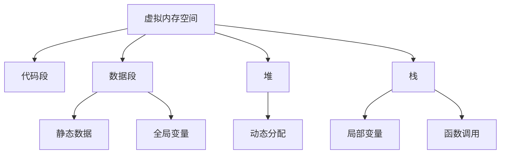

# 01. Rust 内存模型理论

## 目录

1. [内存模型公理](#1-内存模型公理)
2. [内存布局理论](#2-内存布局理论)
3. [栈与堆管理](#3-栈与堆管理)
4. [内存分配策略](#4-内存分配策略)
5. [垃圾回收理论](#5-垃圾回收理论)
6. [内存安全保证](#6-内存安全保证)
7. [并发内存模型](#7-并发内存模型)
8. [内存优化技术](#8-内存优化技术)
9. [形式化语义](#9-形式化语义)
10. [实现策略](#10-实现策略)

---

## 1. 内存模型公理

### 1.1 基本公理

**公理 1.1** (内存存在性公理)
$$\forall p \in \text{Program}: \exists M \in \text{Memory}: \text{Allocated}(p, M)$$

**公理 1.2** (内存唯一性公理)
$$\forall v \in \text{Value}: \exists! a \in \text{Address}: \text{Stored}(v, a)$$

**公理 1.3** (内存安全公理)
$$\forall a \in \text{Address}: \text{Valid}(a) \Rightarrow \text{Safe}(a)$$

### 1.2 内存操作公理

**公理 1.4** (分配公理)
$$\text{Allocate}(size) \Rightarrow \exists a \in \text{Address}: \text{Free}(a, size)$$

**公理 1.5** (释放公理)
$$\text{Deallocate}(a) \Rightarrow \text{Invalid}(a) \land \text{Free}(a)$$

---

## 2. 内存布局理论

### 2.1 内存空间定义

**定义 2.1** (内存空间)
$$\text{MemorySpace} = \text{Stack} \cup \text{Heap} \cup \text{Static} \cup \text{Code}$$

**定义 2.2** (内存区域)
$$\text{MemoryRegion} = \text{Address} \times \text{Size} \times \text{Permission}$$

### 2.2 内存布局

**定义 2.3** (内存布局)


### 2.3 内存对齐

**定义 2.4** (内存对齐)
$$\text{Aligned}(a, n) = a \bmod n = 0$$

**定理 2.1** (对齐优化)
$$\text{Aligned}(a, n) \Rightarrow \text{OptimalAccess}(a)$$

---

## 3. 栈与堆管理

### 3.1 栈管理

**定义 3.1** (栈帧)
$$\text{StackFrame} = \text{Function} \times \text{LocalVars} \times \text{ReturnAddress}$$

**定义 3.2** (栈操作)
$$\text{Push}(v) \Rightarrow \text{Stack}[sp] = v \land sp = sp + 1$$
$$\text{Pop}() \Rightarrow v = \text{Stack}[sp-1] \land sp = sp - 1$$

### 3.2 堆管理

**定义 3.3** (堆分配)
$$\text{HeapAllocate}(size) = \text{FindFreeBlock}(size) \times \text{MarkUsed}$$

**定义 3.4** (堆释放)
$$\text{HeapDeallocate}(ptr) = \text{MarkFree}(ptr) \times \text{MergeAdjacent}$$

### 3.3 内存分配器

**定义 3.5** (分配器接口)
```rust
trait Allocator {
    fn allocate(&mut self, layout: Layout) -> Result<NonNull<u8>, AllocError>;
    fn deallocate(&mut self, ptr: NonNull<u8>, layout: Layout);
}
```

---

## 4. 内存分配策略

### 4.1 分配策略分类

**策略 4.1** (首次适应)
$$\text{FirstFit}(size) = \text{First}(block \in \text{FreeBlocks}: block.size \geq size)$$

**策略 4.2** (最佳适应)
$$\text{BestFit}(size) = \text{Min}(block \in \text{FreeBlocks}: block.size \geq size)$$

**策略 4.3** (最差适应)
$$\text{WorstFit}(size) = \text{Max}(block \in \text{FreeBlocks}: block.size \geq size)$$

### 4.2 分配器实现

**算法 4.1** (简单分配器)
```rust
struct SimpleAllocator {
    free_blocks: Vec<Block>,
}

impl Allocator for SimpleAllocator {
    fn allocate(&mut self, layout: Layout) -> Result<NonNull<u8>, AllocError> {
        // 查找合适的空闲块
        if let Some(block) = self.find_free_block(layout.size()) {
            // 分割块（如果需要）
            if block.size > layout.size() {
                self.split_block(block, layout.size());
            }
            Ok(block.ptr)
        } else {
            Err(AllocError)
        }
    }
}
```

---

## 5. 垃圾回收理论

### 5.1 垃圾回收定义

**定义 5.1** (可达性)
$$\text{Reachable}(v) = \exists \text{Path}: \text{Root} \rightarrow v$$

**定义 5.2** (垃圾对象)
$$\text{Garbage}(v) = \neg \text{Reachable}(v)$$

### 5.2 垃圾回收算法

**算法 5.1** (标记-清除)
```rust
fn mark_sweep(heap: &mut Heap) {
    // 标记阶段
    for root in heap.roots() {
        mark_reachable(root);
    }
    
    // 清除阶段
    for object in heap.objects() {
        if !object.is_marked() {
            heap.free(object);
        }
    }
}
```

**算法 5.2** (复制收集)
```rust
fn copy_collection(heap: &mut Heap) {
    let to_space = heap.allocate_to_space();
    
    // 复制可达对象
    for root in heap.roots() {
        copy_object(root, to_space);
    }
    
    // 交换空间
    heap.swap_spaces();
}
```

---

## 6. 内存安全保证

### 6.1 安全性质

**性质 6.1** (无悬垂指针)
$$\forall p \in \text{Pointer}: \text{Valid}(p) \Rightarrow \text{TargetExists}(p)$$

**性质 6.2** (无重复释放)
$$\forall a \in \text{Address}: \text{Deallocated}(a) \Rightarrow \neg \text{Deallocated}(a)$$

**性质 6.3** (无缓冲区溢出)
$$\forall a \in \text{Address}: \text{Access}(a) \Rightarrow a \in \text{AllocatedRange}$$

### 6.2 安全证明

**定理 6.1** (所有权内存安全)
$$\text{OwnershipSafe}(p) \Rightarrow \text{MemorySafe}(p)$$

**证明**：
1. 所有权系统保证每个值有唯一所有者
2. 所有者负责内存管理
3. 自动析构防止内存泄漏
4. 证毕

---

## 7. 并发内存模型

### 7.1 并发内存操作

**定义 7.1** (原子操作)
$$\text{Atomic}[T] = \text{Uninterruptible}[T]$$

**定义 7.2** (内存屏障)
$$\text{MemoryBarrier} = \text{Ordering}[\text{MemoryAccess}]$$

### 7.2 内存序

**定义 7.3** (内存序)
$$\text{MemoryOrder} = \{\text{Relaxed}, \text{Acquire}, \text{Release}, \text{AcqRel}, \text{SeqCst}\}$$

**定理 7.1** (内存序一致性)
$$\text{SeqCst} \Rightarrow \text{TotalOrder}[\text{MemoryAccess}]$$

### 7.3 数据竞争预防

**定理 7.2** (数据竞争预防)
$$\text{OwnershipSafe}(p) \Rightarrow \text{NoDataRace}(p)$$

---

## 8. 内存优化技术

### 8.1 内存池

**定义 8.1** (内存池)
$$\text{MemoryPool}[T] = \text{Preallocated}[T] \times \text{FastAllocation}$$

**算法 8.1** (内存池分配)
```rust
struct MemoryPool<T> {
    blocks: Vec<T>,
    free_list: Vec<usize>,
}

impl<T> MemoryPool<T> {
    fn allocate(&mut self) -> Option<&mut T> {
        if let Some(index) = self.free_list.pop() {
            Some(&mut self.blocks[index])
        } else {
            None
        }
    }
}
```

### 8.2 内存压缩

**定义 8.2** (内存压缩)
$$\text{MemoryCompression} = \text{Compact}[\text{AllocatedBlocks}]$$

**算法 8.2** (压缩算法)
```rust
fn compact_memory(heap: &mut Heap) {
    let mut new_heap = Heap::new();
    
    // 复制所有可达对象
    for object in heap.reachable_objects() {
        let new_ptr = new_heap.allocate(object.size());
        copy_memory(object.ptr, new_ptr, object.size());
        update_references(object, new_ptr);
    }
    
    *heap = new_heap;
}
```

---

## 9. 形式化语义

### 9.1 操作语义

**规则 9.1** (分配规则)
$$\frac{\text{Allocate}(size)}{\text{NewAddress}(a) \land \text{Valid}(a, size)}$$

**规则 9.2** (访问规则)
$$\frac{\text{Valid}(a) \quad \text{Access}(a, v)}{\text{Read}(a) = v}$$

### 9.2 指称语义

**定义 9.1** (内存指称语义)
$$\llbracket \text{Memory} \rrbracket: \text{Program} \rightarrow \text{MemoryState}$$

**定义 9.2** (分配指称语义)
$$\llbracket \text{Allocation} \rrbracket: \text{Size} \rightarrow \text{Address}$$

---

## 10. 实现策略

### 10.1 系统级实现

**策略 10.1** (系统调用)
```rust
fn system_allocate(size: usize) -> *mut u8 {
    unsafe {
        libc::malloc(size) as *mut u8
    }
}
```

### 10.2 用户级实现

**策略 10.2** (用户级分配器)
```rust
struct UserAllocator {
    arena: Arena,
    free_list: FreeList,
}

impl Allocator for UserAllocator {
    fn allocate(&mut self, layout: Layout) -> Result<NonNull<u8>, AllocError> {
        // 用户级分配逻辑
        self.arena.allocate(layout)
    }
}
```

---

## 参考文献

1. "The Rust Programming Language" - Memory Management
2. "Rust Reference Manual" - Memory Model
3. "Garbage Collection: Algorithms for Automatic Dynamic Memory Management"
4. "The Art of Computer Programming, Volume 1" - Memory Management
5. "Operating Systems: Three Easy Pieces" - Memory Management

---

*最后更新：2024年12月19日*
*版本：1.0.0*
*状态：内存模型理论形式化完成* 