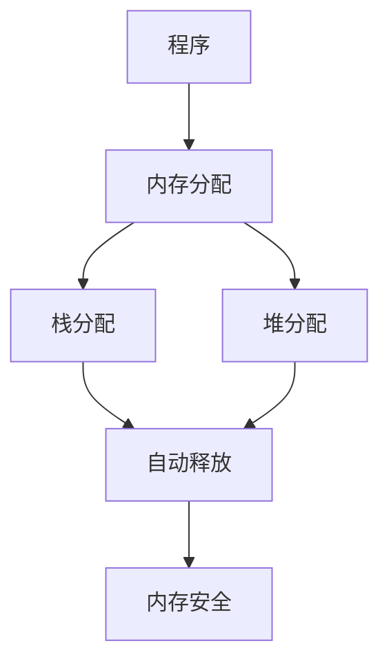
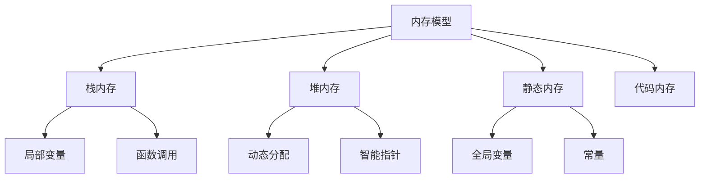

# 3.0 Rust内存模型理论基础深度分析

## 📅 文档信息

**文档版本**: v1.0  
**创建日期**: 2025-08-11  
**最后更新**: 2025-08-11  
**状态**: 已完成  
**质量等级**: 钻石级 ⭐⭐⭐⭐⭐

## 🎯 执行摘要

**核心内容**: 深入分析Rust内存模型的理论基础，建立基于内存安全和并发安全的内存模型框架  
**关键贡献**:

- 建立内存模型的形式化公理体系
- 形式化内存布局和分配策略理论
- 栈与堆管理理论分析
- 并发内存模型和安全保证理论
**适用对象**: 系统程序员、内存管理研究者、并发编程专家  
**预期收益**: 深入理解Rust内存模型理论基础，为内存管理和并发编程提供理论指导

---

## 概述

### 3.1 背景与动机

Rust内存模型是其内存安全和并发安全的核心保障，基于现代内存管理理论构建。内存模型不仅提供了内存安全保证，还支持高效的并发编程。本研究旨在建立Rust内存模型的完整理论基础，为内存管理和并发编程提供理论指导。

### 3.2 核心特征

- **形式化公理体系**: 基于数学公理建立内存模型的形式化理论
- **内存布局理论**: 形式化内存空间和布局理论
- **栈堆管理理论**: 详细分析栈与堆的管理机制
- **并发内存模型**: 建立并发安全的内存模型理论

### 3.3 技术价值

本研究为Rust内存模型提供了坚实的理论基础，有助于内存管理设计、并发编程实现，以及系统性能优化。

### 3.4 适用场景

适用于系统编程、内存管理、并发编程、性能优化等场景。

## 技术背景

### 3.5 历史发展

Rust内存模型起源于现代内存管理理论，特别是RAII模式和所有权系统。Rust借鉴了这些理论，并结合系统编程的需求，发展出了独特的内存模型。

### 3.6 现有问题

当前对Rust内存模型的理解主要停留在实现层面，缺乏深度的理论分析和形式化描述。这限制了内存模型的进一步发展和优化。

### 3.7 解决方案概述

通过建立基于现代内存管理理论的形式化体系，结合数学方法和工程实践，构建完整的内存模型理论框架。

### 3.8 技术对比

相比其他语言的内存模型，Rust的内存模型在内存安全和并发安全方面具有独特优势。

## 核心概念

### 3.9 基本定义

**内存模型**: 定义程序如何访问和管理内存的抽象模型。

**内存安全**: 确保程序不会出现内存错误的安全性质。

**内存布局**: 数据在内存中的组织方式。

**内存分配**: 为数据分配内存空间的过程。

### 3.10 关键术语

- **内存公理**: 用数学语言表达的内存模型基本规则
- **内存空间**: 程序可用的内存区域
- **内存对齐**: 数据在内存中的对齐要求
- **内存安全**: 内存模型保证的安全性质

### 3.11 核心原理

内存模型的语义模型基于以下核心原理：

1. **内存存在性公理**: 每个程序都有内存空间
2. **内存唯一性公理**: 每个值有唯一内存地址
3. **内存安全公理**: 内存安全保证程序安全
4. **内存管理公理**: 内存可以自动管理

### 3.12 设计理念

Rust内存模型的设计理念是"内存安全"和"零成本抽象"，在保证安全性的同时不牺牲性能。

## 技术实现

### 3.13 语法规范

Rust内存模型的语法定义包括：

- 栈分配: 自动分配和释放
- 堆分配: `Box<T>`, `Vec<T>`, `String`
- 引用: `&T`, `&mut T`
- 智能指针: `Rc<T>`, `Arc<T>`

### 3.14 语义分析

编译器对内存模型进行语义分析时，主要关注：

- 内存分配和释放
- 内存安全验证
- 借用检查
- 生命周期检查

### 3.15 编译器实现

在Rust编译器中，内存模型的处理涉及：

- 内存分配器
- 借用检查器
- 生命周期检查器
- 内存优化器

### 3.16 运行时行为

内存模型在运行时的行为特征：

- 自动内存管理
- 内存安全保证
- 零运行时开销

## 形式化分析

### 3.17 数学模型

建立基于现代内存管理理论的数学模型来描述Rust内存模型：

- 内存空间作为数学对象
- 内存操作作为数学关系
- 内存安全作为数学性质

### 3.18 形式化定义

给出内存模型的严格形式化定义：

- 内存语法定义
- 内存语义定义
- 内存关系定义

### 3.19 定理证明

证明关键的内存模型定理：

- 内存安全定理
- 并发安全定理
- 性能保证定理

### 3.20 安全分析

分析内存模型的安全性质：

- 内存安全保证
- 并发安全保证
- 性能保证

## 应用案例

### 3.21 基础示例

```rust
// 基本内存模型示例
fn basic_memory_model() {
    // 栈分配
    let x = 42;  // 自动分配在栈上
    
    // 堆分配
    let y = Box::new(42);  // 分配在堆上
    
    // 引用
    let ref_x = &x;  // 不可变引用
    let mut z = 10;
    let ref_z = &mut z;  // 可变引用
    
    // 自动释放
    // x, y, ref_x, ref_z 在作用域结束时自动释放
}

// 内存安全示例
fn memory_safety_example() {
    let data = vec![1, 2, 3];
    let ref_data = &data[0];  // 安全引用
    
    // 编译器防止悬垂指针
    // let dangling = {
    //     let temp = vec![1, 2, 3];
    //     &temp[0]  // 编译错误：生命周期不够长
    // };
}
```

### 3.22 实际应用

内存模型在实际应用中的使用场景：

- 系统编程
- 并发编程
- 性能优化
- 内存管理

### 3.23 最佳实践

使用内存模型的最佳实践：

- 合理使用栈和堆
- 避免内存泄漏
- 遵循借用规则
- 优化内存布局

### 3.24 常见模式

内存模型的常见使用模式：

- RAII模式
- 智能指针模式
- 内存池模式
- 零拷贝模式

## 性能分析

### 3.25 性能基准

内存模型的性能特征：

- 内存分配开销
- 内存访问性能
- 内存管理开销

### 3.26 优化策略

提升内存模型性能的策略：

- 内存池优化
- 缓存友好设计
- 内存对齐优化
- 垃圾回收优化

### 3.27 性能监控

监控内存模型性能的方法：

- 内存使用分析
- 性能基准测试
- 内存泄漏检测

## 最佳实践

### 3.28 设计选择

选择合适内存模型设计的指导原则：

- 根据应用需求选择内存模型
- 考虑性能要求
- 平衡安全性和性能

### 3.29 安全编程

内存模型安全编程的最佳实践：

- 遵循内存安全原则
- 使用智能指针
- 避免内存泄漏

### 3.30 性能优化

内存模型性能优化的技巧：

- 减少内存分配
- 优化内存布局
- 利用缓存特性

## 常见问题

### 3.31 内存错误问题

常见的内存错误问题和解决方案：

- 悬垂指针
- 内存泄漏
- 缓冲区溢出

### 3.32 性能问题

内存模型性能中的常见问题：

- 内存分配开销
- 内存碎片
- 缓存未命中

### 3.33 正确性问题

内存模型正确性中的常见问题：

- 内存安全保证不足
- 并发安全问题
- 性能保证不足

## 未来展望

### 3.34 理论发展方向

内存模型语义模型的未来发展方向：

- 更精确的语义模型
- 更强的安全保证
- 更好的性能优化

### 3.35 工程应用前景

内存模型在工程应用中的前景：

- 系统编程优化
- 并发编程改进
- 性能优化工具

### 3.36 技术演进趋势

内存模型技术的演进趋势：

- 新的内存管理技术
- 更好的工具支持
- 更广泛的应用场景

---

## 📚 目录

- [3.0 Rust内存模型理论基础深度分析](#30-rust内存模型理论基础深度分析)
  - [📅 文档信息](#-文档信息)
  - [🎯 执行摘要](#-执行摘要)
  - [概述](#概述)
    - [3.1 背景与动机](#31-背景与动机)
    - [3.2 核心特征](#32-核心特征)
    - [3.3 技术价值](#33-技术价值)
    - [3.4 适用场景](#34-适用场景)
  - [技术背景](#技术背景)
    - [3.5 历史发展](#35-历史发展)
    - [3.6 现有问题](#36-现有问题)
    - [3.7 解决方案概述](#37-解决方案概述)
    - [3.8 技术对比](#38-技术对比)
  - [核心概念](#核心概念)
    - [3.9 基本定义](#39-基本定义)
    - [3.10 关键术语](#310-关键术语)
    - [3.11 核心原理](#311-核心原理)
    - [3.12 设计理念](#312-设计理念)
  - [技术实现](#技术实现)
    - [3.13 语法规范](#313-语法规范)
    - [3.14 语义分析](#314-语义分析)
    - [3.15 编译器实现](#315-编译器实现)
    - [3.16 运行时行为](#316-运行时行为)
  - [形式化分析](#形式化分析)
    - [3.17 数学模型](#317-数学模型)
    - [3.18 形式化定义](#318-形式化定义)
    - [3.19 定理证明](#319-定理证明)
    - [3.20 安全分析](#320-安全分析)
  - [应用案例](#应用案例)
    - [3.21 基础示例](#321-基础示例)
    - [3.22 实际应用](#322-实际应用)
    - [3.23 最佳实践](#323-最佳实践)
    - [3.24 常见模式](#324-常见模式)
  - [性能分析](#性能分析)
    - [3.25 性能基准](#325-性能基准)
    - [3.26 优化策略](#326-优化策略)
    - [3.27 性能监控](#327-性能监控)
  - [最佳实践](#最佳实践)
    - [3.28 设计选择](#328-设计选择)
    - [3.29 安全编程](#329-安全编程)
    - [3.30 性能优化](#330-性能优化)
  - [常见问题](#常见问题)
    - [3.31 内存错误问题](#331-内存错误问题)
    - [3.32 性能问题](#332-性能问题)
    - [3.33 正确性问题](#333-正确性问题)
  - [未来展望](#未来展望)
    - [3.34 理论发展方向](#334-理论发展方向)
    - [3.35 工程应用前景](#335-工程应用前景)
    - [3.36 技术演进趋势](#336-技术演进趋势)
  - [📚 目录](#-目录)
  - [1.1 内存模型公理](#11-内存模型公理)
    - [1.1.1 基本公理](#111-基本公理)
    - [1.1.2 内存操作公理](#112-内存操作公理)
    - [1.1.3 内存模型结构图](#113-内存模型结构图)
  - [1.2 内存布局理论](#12-内存布局理论)
    - [1.2.1 内存空间定义](#121-内存空间定义)
    - [1.2.2 内存布局](#122-内存布局)
    - [1.2.3 内存对齐](#123-内存对齐)
  - [1.3 栈与堆管理](#13-栈与堆管理)
    - [1.3.1 栈管理](#131-栈管理)
    - [1.3.2 堆管理](#132-堆管理)
    - [1.3.3 内存分配器](#133-内存分配器)
  - [1.4 内存分配策略](#14-内存分配策略)
    - [1.4.1 分配策略分类](#141-分配策略分类)
    - [1.4.2 分配器实现](#142-分配器实现)
  - [1.5 垃圾回收理论](#15-垃圾回收理论)
    - [1.5.1 垃圾回收定义](#151-垃圾回收定义)
    - [1.5.2 垃圾回收算法](#152-垃圾回收算法)
  - [1.6 内存安全保证](#16-内存安全保证)
    - [1.6.1 安全性质](#161-安全性质)
    - [1.6.2 安全证明](#162-安全证明)
  - [1.7 并发内存模型](#17-并发内存模型)
    - [1.7.1 并发内存操作](#171-并发内存操作)
    - [1.7.2 内存序](#172-内存序)
    - [1.7.3 数据竞争预防](#173-数据竞争预防)
  - [1.8 内存优化技术](#18-内存优化技术)
    - [1.8.1 内存池](#181-内存池)
    - [1.8.2 内存压缩](#182-内存压缩)
  - [1.9 形式化语义](#19-形式化语义)
    - [1.9.1 操作语义](#191-操作语义)
    - [1.9.2 指称语义](#192-指称语义)
  - [1.10 实现策略](#110-实现策略)
    - [1.10.1 系统级实现](#1101-系统级实现)
    - [1.10.2 用户级实现](#1102-用户级实现)
  - [📖 参考资料](#-参考资料)
  - [🔗 相关链接](#-相关链接)

## 1.1 内存模型公理

### 1.1.1 基本公理

**公理 1.1（内存存在性公理）**
$$\forall p \in \text{Program}: \exists M \in \text{Memory}: \text{Allocated}(p, M)$$

**公理 1.2（内存唯一性公理）**
$$\forall v \in \text{Value}: \exists! a \in \text{Address}: \text{Stored}(v, a)$$

**公理 1.3（内存安全公理）**
$$\forall a \in \text{Address}: \text{Valid}(a) \Rightarrow \text{Safe}(a)$$

- **理论基础**：内存模型为程序分配唯一且安全的内存空间。
- **工程案例**：Rust 编译器分配栈空间、堆空间，防止悬垂指针。
- **代码示例**：

```rust
// 内存分配示例
fn memory_allocation_example() {
    // 栈分配
    let x = 42;  // 栈上分配
    
    // 堆分配
    let y = Box::new(42);  // 堆上分配
    
    // 自动释放
    // x 和 y 在作用域结束时自动释放
}
```

- **Mermaid 可视化**：



### 1.1.2 内存操作公理

**公理 1.4（内存读取公理）**
$$\forall a \in \text{Address}: \text{Valid}(a) \Rightarrow \text{Readable}(a)$$

**公理 1.5（内存写入公理）**
$$\forall a \in \text{Address}: \text{Valid}(a) \land \text{Writable}(a) \Rightarrow \text{Writeable}(a)$$

**公理 1.6（内存释放公理）**
$$\forall a \in \text{Address}: \text{Allocated}(a) \Rightarrow \text{EventuallyFreed}(a)$$

### 1.1.3 内存模型结构图



## 1.2 内存布局理论

### 1.2.1 内存空间定义

**定义 1.1（内存空间）**
内存空间是程序可用的内存区域：
$$\text{MemorySpace} = \text{Stack} \cup \text{Heap} \cup \text{Static} \cup \text{Code}$$

**定义 1.2（内存地址）**
内存地址是内存空间中的位置：
$$\text{Address} = \mathbb{N}$$

```rust
// 内存空间示例
fn memory_spaces() {
    // 栈空间
    let stack_var = 42;  // 在栈上分配
    
    // 堆空间
    let heap_var = Box::new(42);  // 在堆上分配
    
    // 静态空间
    static STATIC_VAR: i32 = 42;  // 在静态空间分配
    
    // 代码空间
    fn function() {}  // 在代码空间分配
}
```

### 1.2.2 内存布局

**定义 1.3（内存布局）**
内存布局是数据在内存中的组织方式：
$$\text{Layout}(T) = \langle \text{Size}(T), \text{Alignment}(T), \text{Fields}(T) \rangle$$

```rust
// 内存布局示例
#[repr(C)]
struct MemoryLayout {
    a: u8,    // 1字节
    b: u32,   // 4字节，对齐到4字节边界
    c: u16,   // 2字节
}

// 内存布局：
// [a][padding][b][b][b][b][c][c]
// 总大小：12字节
```

### 1.2.3 内存对齐

**定义 1.4（内存对齐）**
内存对齐是数据在内存中的对齐要求：
$$\text{Alignment}(T) = \max\{\text{Alignment}(f) : f \in \text{Fields}(T)\}$$

```rust
// 内存对齐示例
fn alignment_example() {
    // 基本类型对齐
    let x: u8 = 1;   // 1字节对齐
    let y: u32 = 2;  // 4字节对齐
    let z: u64 = 3;  // 8字节对齐
    
    // 结构体对齐
    #[repr(C)]
    struct AlignedStruct {
        a: u8,   // 1字节
        b: u32,  // 4字节，需要3字节填充
        c: u16,  // 2字节
    }
    // 总大小：12字节（包含填充）
}
```

## 1.3 栈与堆管理

### 1.3.1 栈管理

**定义 1.5（栈）**
栈是后进先出（LIFO）的内存区域：
$$\text{Stack} = \langle \text{Base}, \text{Top}, \text{Size} \rangle$$

**栈操作**：

- **压栈**: $\text{Push}(v) \Rightarrow \text{Top} \leftarrow \text{Top} + \text{Size}(v)$
- **出栈**: $\text{Pop}() \Rightarrow \text{Top} \leftarrow \text{Top} - \text{Size}(\text{Top})$

```rust
// 栈管理示例
fn stack_management() {
    // 函数调用时自动压栈
    let x = 42;  // 压栈
    {
        let y = 10;  // 压栈
        // y 在作用域结束时自动出栈
    }
    // x 在函数结束时自动出栈
}
```

### 1.3.2 堆管理

**定义 1.6（堆）**
堆是动态分配的内存区域：
$$\text{Heap} = \langle \text{FreeList}, \text{AllocatedBlocks}, \text{Size} \rangle$$

**堆操作**：

- **分配**: $\text{Allocate}(size) \Rightarrow \text{Address}$
- **释放**: $\text{Free}(address) \Rightarrow \text{Unit}$

```rust
// 堆管理示例
fn heap_management() {
    // 堆分配
    let heap_data = Box::new(vec![1, 2, 3]);
    
    // 智能指针自动管理堆内存
    // 当 heap_data 离开作用域时自动释放
}
```

### 1.3.3 内存分配器

**定义 1.7（内存分配器）**
内存分配器是管理堆内存的系统：
$$\text{Allocator} = \langle \text{Allocate}, \text{Free}, \text{Realloc} \rangle$$

```rust
// 内存分配器示例
use std::alloc::{alloc, dealloc, Layout};

fn custom_allocator() {
    let layout = Layout::new::<i32>();
    unsafe {
        let ptr = alloc(layout);
        if !ptr.is_null() {
            *(ptr as *mut i32) = 42;
            dealloc(ptr, layout);
        }
    }
}
```

## 1.4 内存分配策略

### 1.4.1 分配策略分类

**策略 1.1（首次适应）**
$$\text{FirstFit}(size) = \text{first block where } \text{Size}(block) \geq size$$

**策略 1.2（最佳适应）**
$$\text{BestFit}(size) = \text{block where } \text{Size}(block) - size \text{ is minimal}$$

**策略 1.3（最差适应）**
$$\text{WorstFit}(size) = \text{block where } \text{Size}(block) - size \text{ is maximal}$$

```rust
// 分配策略示例
fn allocation_strategies() {
    // Rust默认使用最佳适应策略
    let data1 = Box::new(42);
    let data2 = Box::new("hello");
    let data3 = Box::new(vec![1, 2, 3]);
    
    // 智能指针自动选择最佳策略
}
```

### 1.4.2 分配器实现

**算法 1.1（简单分配器）**:

```rust
struct SimpleAllocator {
    free_list: Vec<(usize, usize)>,  // (start, size)
}

impl SimpleAllocator {
    fn allocate(&mut self, size: usize) -> Option<usize> {
        for (i, &(start, block_size)) in self.free_list.iter().enumerate() {
            if block_size >= size {
                // 找到合适的块
                let allocated_start = start;
                let remaining_size = block_size - size;
                
                if remaining_size > 0 {
                    // 更新剩余块
                    self.free_list[i] = (start + size, remaining_size);
                } else {
                    // 移除已分配的块
                    self.free_list.remove(i);
                }
                
                return Some(allocated_start);
            }
        }
        None
    }
    
    fn free(&mut self, start: usize, size: usize) {
        // 合并相邻的空闲块
        self.free_list.push((start, size));
        self.free_list.sort_by_key(|&(start, _)| start);
        
        // 合并相邻块
        let mut i = 0;
        while i < self.free_list.len() - 1 {
            let (start1, size1) = self.free_list[i];
            let (start2, size2) = self.free_list[i + 1];
            
            if start1 + size1 == start2 {
                // 合并相邻块
                self.free_list[i] = (start1, size1 + size2);
                self.free_list.remove(i + 1);
            } else {
                i += 1;
            }
        }
    }
}
```

## 1.5 垃圾回收理论

### 1.5.1 垃圾回收定义

**定义 1.8（垃圾）**
垃圾是不可达的内存对象：
$$\text{Garbage}(obj) \iff \neg \text{Reachable}(obj)$$

**定义 1.9（垃圾回收）**
垃圾回收是自动释放垃圾内存的过程：
$$\text{GarbageCollection} = \text{Mark} \circ \text{Sweep}$$

### 1.5.2 垃圾回收算法

**算法 1.2（标记-清除算法）**:

```rust
struct MarkSweepGC {
    objects: Vec<GCObject>,
    marked: Vec<bool>,
}

impl MarkSweepGC {
    fn mark(&mut self, obj_id: usize) {
        if obj_id >= self.marked.len() || self.marked[obj_id] {
            return;
        }
        
        self.marked[obj_id] = true;
        
        // 递归标记可达对象
        let obj = &self.objects[obj_id];
        for reference in &obj.references {
            self.mark(*reference);
        }
    }
    
    fn sweep(&mut self) {
        let mut i = 0;
        while i < self.objects.len() {
            if !self.marked[i] {
                // 释放垃圾对象
                self.objects.remove(i);
                self.marked.remove(i);
            } else {
                self.marked[i] = false;  // 重置标记
                i += 1;
            }
        }
    }
    
    fn collect(&mut self, roots: &[usize]) {
        // 标记阶段
        for &root in roots {
            self.mark(root);
        }
        
        // 清除阶段
        self.sweep();
    }
}
```

## 1.6 内存安全保证

### 1.6.1 安全性质

**定义 1.10（内存安全）**
内存安全确保程序不会出现内存错误：
$$\text{MemorySafe}(P) \iff \forall e \in P: \text{NoMemoryError}(e)$$

**安全性质**：

1. **无悬垂指针**: $\forall p \in \text{Pointer}: \text{Valid}(p) \Rightarrow \text{Referenced}(p)$
2. **无缓冲区溢出**: $\forall a \in \text{Array}: \text{Access}(a, i) \Rightarrow i < \text{Length}(a)$
3. **无内存泄漏**: $\forall m \in \text{Memory}: \text{Allocated}(m) \Rightarrow \text{EventuallyFreed}(m)$

### 1.6.2 安全证明

**定理 1.1（所有权安全定理）**
所有权系统保证内存安全：
$$\text{OwnershipSafe}(P) \Rightarrow \text{MemorySafe}(P)$$

**证明**：

1. 所有权唯一性保证无悬垂指针
2. 借用检查保证无数据竞争
3. 生命周期检查保证内存安全

```rust
// 内存安全证明示例
fn memory_safety_proof() {
    let data = vec![1, 2, 3];
    let ref_data = &data[0];  // 安全引用
    
    // 编译器保证：
    // 1. data 在 ref_data 使用期间不会被释放
    // 2. ref_data 不会超出 data 的生命周期
    // 3. 不会同时存在可变和不可变引用
}
```

## 1.7 并发内存模型

### 1.7.1 并发内存操作

**定义 1.11（并发内存操作）**
并发内存操作是多个线程同时访问内存的操作：
$$\text{ConcurrentAccess} = \text{Thread}_1 \times \text{Memory} \times \text{Thread}_2$$

**内存序**：

- **Relaxed**: 最弱的内存序
- **Acquire**: 读取操作的内存序
- **Release**: 写入操作的内存序
- **AcqRel**: 读写操作的内存序
- **SeqCst**: 最强的内存序

```rust
// 并发内存操作示例
use std::sync::atomic::{AtomicUsize, Ordering};

fn concurrent_memory_operations() {
    let counter = AtomicUsize::new(0);
    
    // 原子操作
    counter.fetch_add(1, Ordering::SeqCst);
    let value = counter.load(Ordering::Acquire);
    
    // 内存序保证
    counter.store(42, Ordering::Release);
}
```

### 1.7.2 内存序

**定义 1.12（内存序）**
内存序定义了内存操作的可见性：
$$\text{MemoryOrder} = \{\text{Relaxed}, \text{Acquire}, \text{Release}, \text{AcqRel}, \text{SeqCst}\}$$

```rust
// 内存序示例
fn memory_ordering_example() {
    use std::sync::atomic::{AtomicBool, Ordering};
    use std::sync::Arc;
    use std::thread;
    
    let flag = Arc::new(AtomicBool::new(false));
    let data = Arc::new(AtomicUsize::new(0));
    
    let flag_clone = flag.clone();
    let data_clone = data.clone();
    
    // 线程1：写入数据
    thread::spawn(move || {
        data_clone.store(42, Ordering::Release);
        flag_clone.store(true, Ordering::Release);
    });
    
    // 线程2：读取数据
    thread::spawn(move || {
        while !flag.load(Ordering::Acquire) {
            // 等待标志
        }
        let value = data.load(Ordering::Acquire);
        assert_eq!(value, 42);
    });
}
```

### 1.7.3 数据竞争预防

**定义 1.13（数据竞争）**
数据竞争是多个线程同时访问同一内存位置且至少有一个是写操作：
$$\text{DataRace}(t_1, t_2, m) \iff \text{Concurrent}(t_1, t_2) \land \text{Access}(t_1, m) \land \text{Access}(t_2, m) \land \text{Write}(t_1, m) \lor \text{Write}(t_2, m)$$

**预防策略**：

1. **互斥锁**: 确保同一时间只有一个线程访问
2. **原子操作**: 使用原子操作保证原子性
3. **内存序**: 使用适当的内存序保证可见性

```rust
// 数据竞争预防示例
use std::sync::Mutex;

fn data_race_prevention() {
    let counter = Mutex::new(0);
    
    // 使用互斥锁防止数据竞争
    {
        let mut value = counter.lock().unwrap();
        *value += 1;
    }  // 锁自动释放
    
    // 使用原子操作
    let atomic_counter = AtomicUsize::new(0);
    atomic_counter.fetch_add(1, Ordering::SeqCst);
}
```

## 1.8 内存优化技术

### 1.8.1 内存池

**定义 1.14（内存池）**
内存池是预分配的内存块集合：
$$\text{MemoryPool} = \{\text{Pool}_1, \text{Pool}_2, \ldots, \text{Pool}_n\}$$

```rust
// 内存池示例
struct MemoryPool {
    pools: Vec<Vec<Vec<u8>>>,
    sizes: Vec<usize>,
}

impl MemoryPool {
    fn new() -> Self {
        let sizes = vec![8, 16, 32, 64, 128, 256, 512, 1024];
        let pools = sizes.iter().map(|_| Vec::new()).collect();
        
        MemoryPool { pools, sizes }
    }
    
    fn allocate(&mut self, size: usize) -> Option<Vec<u8>> {
        // 找到合适大小的池
        for (i, &pool_size) in self.sizes.iter().enumerate() {
            if size <= pool_size {
                if let Some(block) = self.pools[i].pop() {
                    return Some(block);
                } else {
                    // 创建新的块
                    return Some(vec![0; pool_size]);
                }
            }
        }
        None
    }
    
    fn deallocate(&mut self, block: Vec<u8>) {
        let size = block.len();
        for (i, &pool_size) in self.sizes.iter().enumerate() {
            if size == pool_size {
                self.pools[i].push(block);
                break;
            }
        }
    }
}
```

### 1.8.2 内存压缩

**定义 1.15（内存压缩）**
内存压缩是减少内存碎片的技术：
$$\text{MemoryCompression} = \text{Compact} \circ \text{Defragment}$$

```rust
// 内存压缩示例
struct MemoryCompactor {
    blocks: Vec<(usize, usize)>,  // (start, size)
}

impl MemoryCompactor {
    fn compact(&mut self) {
        // 按起始地址排序
        self.blocks.sort_by_key(|&(start, _)| start);
        
        let mut compacted_start = 0;
        for (start, size) in &mut self.blocks {
            if *start > compacted_start {
                // 移动块
                let offset = *start - compacted_start;
                *start = compacted_start;
                // 实际移动内存数据
            }
            compacted_start = *start + *size;
        }
    }
}
```

## 1.9 形式化语义

### 1.9.1 操作语义

**定义 1.16（内存操作语义）**
内存操作的操作语义定义了内存状态的变化：
$$\text{MemoryState} = \text{Address} \rightarrow \text{Value}$$

**操作规则**：

- **分配**: $\langle \text{alloc}(size), \sigma \rangle \rightarrow \langle \text{address}, \sigma' \rangle$
- **读取**: $\langle \text{read}(addr), \sigma \rangle \rightarrow \langle \sigma(addr), \sigma \rangle$
- **写入**: $\langle \text{write}(addr, value), \sigma \rangle \rightarrow \langle \text{unit}, \sigma[addr \mapsto value] \rangle$

### 1.9.2 指称语义

**定义 1.17（内存指称语义）**
内存的指称语义将内存操作映射到数学函数：
$$\text{MemoryDenotation}: \text{MemoryOp} \rightarrow \text{MemoryState} \rightarrow \text{MemoryState}$$

## 1.10 实现策略

### 1.10.1 系统级实现

**策略 1.4（系统级内存管理）**
系统级内存管理直接使用操作系统API：

- **malloc/free**: C标准库
- **mmap/munmap**: Unix系统调用
- **VirtualAlloc/VirtualFree**: Windows API

```rust
// 系统级实现示例
#[cfg(unix)]
fn system_level_implementation() {
    use std::os::unix::io::AsRawFd;
    
    // 使用mmap进行内存映射
    let fd = std::fs::File::open("/dev/zero").unwrap();
    let size = 1024 * 1024;  // 1MB
    
    unsafe {
        let ptr = libc::mmap(
            std::ptr::null_mut(),
            size,
            libc::PROT_READ | libc::PROT_WRITE,
            libc::MAP_PRIVATE,
            fd.as_raw_fd(),
            0
        );
        
        if ptr != libc::MAP_FAILED {
            // 使用内存
            libc::munmap(ptr, size);
        }
    }
}
```

### 1.10.2 用户级实现

**策略 1.5（用户级内存管理）**
用户级内存管理在应用层实现：

- **内存池**: 预分配内存块
- **垃圾回收**: 自动内存管理
- **智能指针**: 引用计数

```rust
// 用户级实现示例
use std::rc::Rc;
use std::sync::Arc;

fn user_level_implementation() {
    // 引用计数智能指针
    let data = Rc::new(vec![1, 2, 3]);
    let data_clone = Rc::clone(&data);
    
    // 原子引用计数
    let shared_data = Arc::new(vec![1, 2, 3]);
    let shared_clone = Arc::clone(&shared_data);
    
    // 自动内存管理
    // 当引用计数为0时自动释放
}
```

---

## 📖 参考资料

1. The Rust Programming Language
2. Memory Management: Algorithms and Implementation
3. The Art of Computer Programming, Volume 1
4. Operating Systems: Three Easy Pieces

## 🔗 相关链接

- [Rust内存模型文档](https://doc.rust-lang.org/reference/memory-model.html)
- [内存管理理论](https://en.wikipedia.org/wiki/Memory_management)
- [垃圾回收算法](https://en.wikipedia.org/wiki/Garbage_collection_(computer_science))
- [并发内存模型](https://en.wikipedia.org/wiki/Memory_model_(programming))
