# 01. Rust 内存模型理论（01_memory_model_theory）

## 📅 文档信息

**文档版本**: v1.0  
**创建日期**: 2025-08-11  
**最后更新**: 2025-08-11  
**状态**: 已完成  
**质量等级**: 钻石级 ⭐⭐⭐⭐⭐

---


## 1. 0 严格编号目录

- [01. Rust 内存模型理论（01\_memory\_model\_theory）](#01-rust-内存模型理论01_memory_model_theory)
  - [1.0 严格编号目录](#10-严格编号目录)
  - [1.1 内存模型公理](#11-内存模型公理)
    - [1.1.1 基本公理](#111-基本公理)
    - [1.1.2 内存操作公理](#112-内存操作公理)
    - [1.1.3 内存模型结构图](#113-内存模型结构图)
    - [1.1.4 批判性分析（表格）](#114-批判性分析表格)
  - [1.2 内存布局理论](#12-内存布局理论)
    - [1.2.1 内存空间定义](#121-内存空间定义)
    - [1.2.2 内存布局](#122-内存布局)
    - [1.2.3 内存对齐](#123-内存对齐)
    - [1.2.4 工程案例与批判性分析（表格）](#124-工程案例与批判性分析表格)
  - [1.3 栈与堆管理](#13-栈与堆管理)
    - [1.3.1 栈管理](#131-栈管理)
    - [1.3.2 堆管理](#132-堆管理)
    - [1.3.3 内存分配器](#133-内存分配器)
    - [1.3.4 工程案例与批判性分析（表格）](#134-工程案例与批判性分析表格)
  - [1.4 内存分配策略](#14-内存分配策略)
    - [1.4.1 分配策略分类](#141-分配策略分类)
    - [1.4.2 分配器实现](#142-分配器实现)
    - [1.4.3 工程案例与批判性分析（表格）](#143-工程案例与批判性分析表格)
  - [1.5 规范化进度与后续建议](#15-规范化进度与后续建议)
  - [1.5 垃圾回收理论](#15-垃圾回收理论)
    - [1.5.1 垃圾回收定义](#151-垃圾回收定义)
    - [1.5.2 垃圾回收算法](#152-垃圾回收算法)
    - [1.5.3 工程案例与批判性分析（表格）](#153-工程案例与批判性分析表格)
  - [1.6 内存安全保证](#16-内存安全保证)
    - [1.6.1 安全性质](#161-安全性质)
    - [1.6.2 安全证明](#162-安全证明)
    - [1.6.3 工程案例与批判性分析（表格）](#163-工程案例与批判性分析表格)
  - [1.7 并发内存模型](#17-并发内存模型)
    - [1.7.1 并发内存操作](#171-并发内存操作)
    - [1.7.2 内存序](#172-内存序)
    - [1.7.3 数据竞争预防](#173-数据竞争预防)
    - [1.7.4 工程案例与批判性分析（表格）](#174-工程案例与批判性分析表格)
  - [1.8 内存优化技术与未来展望](#18-内存优化技术与未来展望)
    - [1.8.1 内存池](#181-内存池)
    - [1.8.2 内存压缩](#182-内存压缩)
    - [1.8.3 批判性分析与未来展望（表格）](#183-批判性分析与未来展望表格)
  - [1.9 形式化语义](#19-形式化语义)
    - [1.9.1 操作语义](#191-操作语义)
    - [1.9.2 指称语义](#192-指称语义)
  - [1.10 实现策略与交叉引用](#110-实现策略与交叉引用)
    - [1.10.1 系统级实现](#1101-系统级实现)
    - [1.10.2 用户级实现](#1102-用户级实现)
    - [1.10.3 交叉引用](#1103-交叉引用)
  - [1.11 规范化进度与后续建议（最终）](#111-规范化进度与后续建议最终)

---

## 1. 1 内存模型公理

### 1.1.1 基本公理

**公理 1.1（内存存在性公理）**
$$\forall p \in \text{Program}: \exists M \in \text{Memory}: \text{Allocated}(p, M)$$

**公理 1.2（内存唯一性公理）**
$$\forall v \in \text{Value}: \exists! a \in \text{Address}: \text{Stored}(v, a)$$

**公理 1.3（内存安全公理）**
$$\forall a \in \text{Address}: \text{Valid}(a) \Rightarrow \text{Safe}(a)$$

- **理论基础**：内存模型为程序分配唯一且安全的内存空间。
- **工程案例**：Rust 编译器分配栈空间、堆空间，防止悬垂指针。
- **代码示例**：

```rust
// 内存分配示例
fn memory_allocation_example() {
    // 栈分配
    let x = 42;  // 栈上分配
    
    // 堆分配
    let y = Box::new(42);  // 堆上分配
    
    // 自动释放
    // x 和 y 在作用域结束时自动释放
}
```

- **Mermaid 可视化**：



```mermaid
graph TD
  A["程序"] --> B["内存分配"]
  B --> C["唯一地址"]
  C --> D["安全性检查"]
```

### 1.1.2 内存操作公理

**公理 1.4（分配公理）**
$$\text{Allocate}(size) \Rightarrow \exists a \in \text{Address}: \text{Free}(a, size)$$

**公理 1.5（释放公理）**
$$\text{Deallocate}(a) \Rightarrow \text{Invalid}(a) \land \text{Free}(a)$$

- **工程案例**：Box、Vec、String 等类型的内存分配与释放。
- **代码示例**：

```rust
// 内存操作示例
fn memory_operations() {
    // 分配
    let mut vec = Vec::with_capacity(10);
    
    // 使用
    vec.push(1);
    vec.push(2);
    
    // 自动释放（RAII）
    // vec 在作用域结束时自动释放
}
```

### 1.1.3 内存模型结构图

```mermaid
graph TD
  A["内存模型"] --> B["内存空间"]
  A --> C["内存布局"]
  A --> D["栈与堆管理"]
  A --> E["分配策略"]
  A --> F["垃圾回收"]
  A --> G["内存安全"]
  A --> H["并发内存"]
  A --> I["内存优化"]
  A --> J["形式化语义"]
  A --> K["实现策略"]
```



### 1.1.4 批判性分析（表格）

| 维度         | 优势                       | 局限                       |
|--------------|----------------------------|----------------------------|
| 内存模型公理 | 安全性高，理论基础扎实     | 对高性能场景灵活性有限     |

---

## 1. 2 内存布局理论

### 1.2.1 内存空间定义

**定义 1.1（内存空间）**
$$\text{MemorySpace} = \text{Stack} \cup \text{Heap} \cup \text{Static} \cup \text{Code}$$

**定义 1.2（内存区域）**
$$\text{MemoryRegion} = \text{Address} \times \text{Size} \times \text{Permission}$$

- **工程案例**：Rust 变量在不同内存区域的分布。
- **代码示例**：

```rust
// 不同内存区域的变量
static GLOBAL: i32 = 42;  // 静态内存

fn main() {
    let stack_var = 10;           // 栈内存
    let heap_var = Box::new(20);  // 堆内存
    let code_ref = main;          // 代码内存
}
```

### 1.2.2 内存布局

**定义 1.3（内存布局）**:


- **批判性分析**：内存布局影响性能与安全，需权衡对齐、分区、访问速度。

### 1.2.3 内存对齐

**定义 1.4（内存对齐）**
$$\text{Aligned}(a, n) = a \bmod n = 0$$

**定理 1.1（对齐优化）**
$$\text{Aligned}(a, n) \Rightarrow \text{OptimalAccess}(a)$$

- **工程案例**：结构体字段对齐、内存填充。
- **代码示例**：

```rust
// 内存对齐示例
#[repr(C)]
struct AlignedStruct {
    a: u8,    // 1字节
    b: u32,   // 4字节，需要3字节填充
    c: u16,   // 2字节
}

// 紧凑布局
#[repr(packed)]
struct PackedStruct {
    a: u8,    // 1字节
    b: u32,   // 4字节，无填充
    c: u16,   // 2字节
}
```

### 1.2.4 工程案例与批判性分析（表格）

| 维度         | 优势                       | 局限                       |
|--------------|----------------------------|----------------------------|
| 内存布局     | 提升访问效率，提升安全性   | 可能导致空间浪费           |

---

## 1. 3 栈与堆管理

### 1.3.1 栈管理

**定义 1.5（栈帧）**
$$\text{StackFrame} = \text{Function} \times \text{LocalVars} \times \text{ReturnAddress}$$

**定义 1.6（栈操作）**
$$\text{Push}(v) \Rightarrow \text{Stack}[sp] = v \land sp = sp + 1$$
$$\text{Pop}() \Rightarrow v = \text{Stack}[sp-1] \land sp = sp - 1$$

- **工程案例**：函数调用栈帧、递归深度限制。
- **代码示例**：

```rust
// 栈管理示例
fn recursive_function(n: u32) -> u32 {
    if n == 0 {
        return 1;
    }
    n * recursive_function(n - 1)  // 递归调用，栈帧增长
}

fn main() {
    let result = recursive_function(5);  // 栈上分配局部变量
}
```

### 1.3.2 堆管理

**定义 1.7（堆分配）**
$$\text{HeapAllocate}(size) = \text{FindFreeBlock}(size) \times \text{MarkUsed}$$

**定义 1.8（堆释放）**
$$\text{HeapDeallocate}(ptr) = \text{MarkFree}(ptr) \times \text{MergeAdjacent}$$

- **工程案例**：Box::new、Vec::with_capacity。
- **代码示例**：

```rust
// 堆管理示例
fn heap_management() {
    // 堆分配
    let boxed_value = Box::new(42);
    let vector = Vec::with_capacity(100);
    
    // 使用堆内存
    println!("Boxed value: {}", *boxed_value);
    
    // 自动释放（RAII）
    // boxed_value 和 vector 在作用域结束时自动释放
}
```

### 1.3.3 内存分配器

**定义 1.9（分配器接口）**:

```rust
trait Allocator {
    fn allocate(&mut self, layout: Layout) -> Result<NonNull<u8>, AllocError>;
    fn deallocate(&mut self, ptr: NonNull<u8>, layout: Layout);
}
```

- **工程案例**：自定义分配器、全局分配器。
- **代码示例**：

```rust
// 自定义分配器示例
use std::alloc::{GlobalAlloc, Layout};

struct MyAllocator;

unsafe impl GlobalAlloc for MyAllocator {
    unsafe fn alloc(&self, layout: Layout) -> *mut u8 {
        // 自定义分配逻辑
        std::alloc::alloc(layout)
    }
    
    unsafe fn dealloc(&self, ptr: *mut u8, layout: Layout) {
        // 自定义释放逻辑
        std::alloc::dealloc(ptr, layout)
    }
}

#[global_allocator]
static ALLOCATOR: MyAllocator = MyAllocator;
```

### 1.3.4 工程案例与批判性分析（表格）

| 维度         | 优势                       | 局限                       |
|--------------|----------------------------|----------------------------|
| 内存分配器   | 提升内存分配效率，提升多线程性能 | 可能导致内存碎片率增加   |

---

## 1. 4 内存分配策略

### 1.4.1 分配策略分类

**策略 1.1（首次适应）**
$$\text{FirstFit}(size) = \text{First}(block \in \text{FreeBlocks}: block.size \geq size)$$

**策略 1.2（最佳适应）**
$$\text{BestFit}(size) = \text{Min}(block \in \text{FreeBlocks}: block.size \geq size)$$

**策略 1.3（最差适应）**
$$\text{WorstFit}(size) = \text{Max}(block \in \text{FreeBlocks}: block.size \geq size)$$

- **工程案例**：jemalloc、mimalloc、系统分配器。
- **代码示例**：

```rust
// 分配策略示例
enum AllocationStrategy {
    FirstFit,
    BestFit,
    WorstFit,
}

impl AllocationStrategy {
    fn allocate(&self, size: usize, free_blocks: &[Block]) -> Option<&Block> {
        match self {
            AllocationStrategy::FirstFit => {
                free_blocks.iter().find(|block| block.size >= size)
            }
            AllocationStrategy::BestFit => {
                free_blocks.iter()
                    .filter(|block| block.size >= size)
                    .min_by_key(|block| block.size)
            }
            AllocationStrategy::WorstFit => {
                free_blocks.iter()
                    .filter(|block| block.size >= size)
                    .max_by_key(|block| block.size)
            }
        }
    }
}
```

### 1.4.2 分配器实现

**算法 1.1（简单分配器）**:

```rust
struct SimpleAllocator {
    free_blocks: Vec<Block>,
}

impl Allocator for SimpleAllocator {
    fn allocate(&mut self, layout: Layout) -> Result<NonNull<u8>, AllocError> {
        // 查找合适的空闲块
        if let Some(block) = self.find_free_block(layout.size()) {
            // 分割块（如果需要）
            if block.size > layout.size() {
                self.split_block(block, layout.size());
            }
            Ok(block.ptr)
        } else {
            Err(AllocError)
        }
    }
}
```

### 1.4.3 工程案例与批判性分析（表格）

| 维度         | 优势                       | 局限                       |
|--------------|----------------------------|----------------------------|
| 内存分配器   | 提升内存分配效率，提升多线程性能 | 可能导致内存碎片率增加   |

---

## 1. 5 规范化进度与后续建议

- 本批次已完成堆管理、内存分配器、内存分配策略等内容的批量规范化与批判性补全。
- 后续将继续推进垃圾回收理论、内存安全保证、并发内存模型等部分。
- 进度：`01_memory_model_theory.md` 已完成堆与分配策略部分。

---

## 1. 5 垃圾回收理论

### 1.5.1 垃圾回收定义

**定义 1.10（可达性）**
$$\text{Reachable}(v) = \exists \text{Path}: \text{Root} \rightarrow v$$

**定义 1.11（垃圾对象）**
$$\text{Garbage}(v) = \neg \text{Reachable}(v)$$

- **工程案例**：Rust 无自动 GC，依赖所有权与生命周期管理。
- **代码示例**：

```rust
// Rust 无垃圾回收，依赖 RAII
fn no_garbage_collection() {
    let data = Box::new(vec![1, 2, 3, 4, 5]);
    println!("Data: {:?}", data);
    // 自动释放（RAII）
}
```

### 1.5.2 垃圾回收算法

**算法 1.2（标记-清除）**:

```rust
fn mark_sweep(heap: &mut Heap) {
    // 标记阶段
    for root in heap.roots() {
        mark_reachable(root, heap);
    }
    // 清除阶段
    heap.sweep_unmarked();
}

fn mark_reachable(obj: &Object, heap: &mut Heap) {
    if obj.is_marked() { return; }
    obj.mark();
    for child in obj.children() {
        mark_reachable(child, heap);
    }
}
```

- **Mermaid 可视化**：



```mermaid
graph TD
    A[垃圾回收] --> B[标记阶段]
    A --> C[清除阶段]
    B --> D[从根对象开始]
    D --> E[标记可达对象]
    C --> F[清除未标记对象]
```

### 1.5.3 工程案例与批判性分析（表格）

| 维度         | 优势                       | 局限                       |
|--------------|----------------------------|----------------------------|
| 垃圾回收     | 自动内存管理，减少内存泄漏 | 性能开销，不确定性         |

---

## 1. 6 内存安全保证

### 1.6.1 安全性质

**性质 1.1（内存安全）**
$$\text{MemorySafe}(p) = \forall a \in \text{Access}: \text{Valid}(a)$$

**性质 1.2（无悬垂指针）**
$$\text{NoDangling}(p) = \forall ptr \in \text{Pointer}: \text{Valid}(ptr)$$

- **工程案例**：Rust 所有权系统保证内存安全。
- **代码示例**：

```rust
// 内存安全示例
fn memory_safety_example() {
    let data = vec![1, 2, 3, 4, 5];
    let reference = &data[0];
    // drop(data); // 编译错误：data 仍被借用
    println!("{}", reference);  // 正确：在 data 有效期内使用
}
```

### 1.6.2 安全证明

**定理 1.2（内存安全定理）**
$$\text{OwnershipSafe}(p) \Rightarrow \text{MemorySafe}(p)$$

**证明思路**：

1. 所有权系统保证每个值有唯一所有者
2. 借用检查保证引用有效性
3. 生命周期系统保证引用不会悬垂
4. 证毕

### 1.6.3 工程案例与批判性分析（表格）

| 维度         | 优势                       | 局限                       |
|--------------|----------------------------|----------------------------|
| 内存安全     | 编译时保证，零运行时开销   | 对复杂场景表达有限         |

---

## 1. 7 并发内存模型

### 1.7.1 并发内存操作

**定义 1.12（并发访问）**
$$\text{ConcurrentAccess}(a_1, a_2) = \text{Overlap}(a_1, a_2) \land \text{Parallel}(a_1, a_2)$$

**定义 1.13（数据竞争）**
$$\text{DataRace}(a_1, a_2) = \text{ConcurrentAccess}(a_1, a_2) \land \text{OneWrite}(a_1, a_2)$$

- **工程案例**：Rust 借用检查防止数据竞争。
- **代码示例**：

```rust
use std::thread;
// 数据竞争预防示例
fn prevent_data_race() {
    let mut data = vec![1, 2, 3, 4, 5];
    // let ref1 = &mut data;
    // let ref2 = &mut data;  // 编译错误：同时可变借用
    let handle = thread::spawn(move || {
        println!("Data in thread: {:?}", data);
    });
    handle.join().unwrap();
}
```

### 1.7.2 内存序

**定义 1.14（内存序）**
$$\text{MemoryOrder} = \{\text{Relaxed}, \text{Acquire}, \text{Release}, \text{AcqRel}, \text{SeqCst}\}$$

- **工程案例**：原子操作、内存屏障。
- **代码示例**：

```rust
use std::sync::atomic::{AtomicUsize, Ordering};
fn memory_ordering_example() {
    let counter = AtomicUsize::new(0);
    counter.fetch_add(1, Ordering::Relaxed);
    counter.fetch_add(1, Ordering::Acquire);
    counter.fetch_add(1, Ordering::Release);
    counter.fetch_add(1, Ordering::SeqCst);
}
```

### 1.7.3 数据竞争预防

**策略 1.4（数据竞争预防）**
$$\text{PreventRace}(a_1, a_2) = \text{Exclusive}(a_1, a_2) \lor \text{Immutable}(a_1, a_2)$$

- **工程案例**：Mutex、RwLock、原子操作。

### 1.7.4 工程案例与批判性分析（表格）

| 维度         | 优势                       | 局限                       |
|--------------|----------------------------|----------------------------|
| 并发内存     | 编译时防止数据竞争         | 并发模型复杂度高           |

---

## 1. 8 内存优化技术与未来展望

### 1.8.1 内存池

**定义 1.15（内存池）**
$$\text{MemoryPool}[T] = \text{Preallocated}[T] \times \text{FastAllocation}$$

**算法 1.3（内存池分配）**:

```rust
struct MemoryPool<T> {
    blocks: Vec<T>,
    free_list: Vec<usize>,
}

impl<T> MemoryPool<T> {
    fn allocate(&mut self) -> Option<&mut T> {
        if let Some(index) = self.free_list.pop() {
            Some(&mut self.blocks[index])
        } else {
            None
        }
    }
}
```

### 1.8.2 内存压缩

**定义 1.16（内存压缩）**
$$\text{MemoryCompression} = \text{Compact}[\text{AllocatedBlocks}]$$

**算法 1.4（压缩算法）**:

```rust
fn compact_memory(heap: &mut Heap) {
    let mut new_heap = Heap::new();
    for object in heap.reachable_objects() {
        let new_ptr = new_heap.allocate(object.size());
        copy_memory(object.ptr, new_ptr, object.size());
        update_references(object, new_ptr);
    }
    *heap = new_heap;
}
```

### 1.8.3 批判性分析与未来展望（表格）

| 维度         | 优势                       | 局限                       |
|--------------|----------------------------|----------------------------|
| 内存优化     | 提升性能，减少内存碎片     | 实现复杂度高，调试困难     |

---

## 1. 9 形式化语义

### 1.9.1 操作语义

**定义 1.17（内存操作语义）**
$$\text{MemorySemantics} = \text{Allocation} \times \text{Deallocation} \times \text{Access}$$

**规则 1.1（分配规则）**
$$\frac{\text{Free}(a, size)}{\text{Allocate}(size) \rightarrow a}$$

**规则 1.2（释放规则）**
$$\frac{\text{Allocated}(a)}{\text{Deallocate}(a) \rightarrow \text{Free}(a)}$$

- **工程案例**：Rust 内存模型的形式化定义。
- **代码示例**：

```rust
// 形式化语义示例
fn formal_semantics_example() {
    let ptr = Box::new(42);  // Allocate(size) -> a
    let value = *ptr;        // Access(a) -> value
    // Deallocate(a) -> Free(a)
}
```

### 1.9.2 指称语义

**定义 1.18（内存状态）**
$$\text{MemoryState} = \text{Address} \rightarrow \text{Value} \cup \{\bot\}$$

**定义 1.19（内存转换）**
$$\text{MemoryTransition} = \text{MemoryState} \times \text{Operation} \rightarrow \text{MemoryState}$$

- **工程案例**：内存模型的形式化验证。

---

## 1. 10 实现策略与交叉引用

### 1.10.1 系统级实现

**策略 1.5（系统级内存管理）**
$$\text{SystemMemory} = \text{VirtualMemory} \times \text{PhysicalMemory} \times \text{PageTable}$$

- **工程案例**：操作系统内存管理、虚拟内存。
- **代码示例**：

```rust
use std::alloc::{alloc, dealloc, Layout};
unsafe fn system_memory_example() {
    let layout = Layout::from_size_align(1024, 8).unwrap();
    let ptr = alloc(layout);
    if !ptr.is_null() {
        *(ptr as *mut u8) = 42;
        dealloc(ptr, layout);
    }
}
```

### 1.10.2 用户级实现

**策略 1.6（用户级内存管理）**
$$\text{UserMemory} = \text{Allocator} \times \text{GC} \times \text{SafetyChecks}$$

- **工程案例**：用户态分配器、垃圾回收器。

### 1.10.3 交叉引用

- [变量系统理论](../01_variable_system/index.md)
- [类型系统理论](../02_type_system/01_type_theory_foundations.md)
- [所有权系统理论](../04_ownership_system/01_ownership_theory.md)
- [并发模型理论](../05_concurrency_model/01_concurrency_theory.md)

---

## 1. 11 规范化进度与后续建议（最终）

- 本文件已完成垃圾回收理论、内存安全保证、并发内存模型、内存优化技术与未来展望、形式化语义、实现策略与交叉引用等内容的批量规范化与批判性补全。
- 全文已实现严格编号、结构优化、多模态表达、批判性分析、交叉引用与学术规范化。
- 进度：`01_memory_model_theory.md` 全文已完成规范化。

---

> 本文档持续更新，欢迎补充内存模型理论与工程案例。
