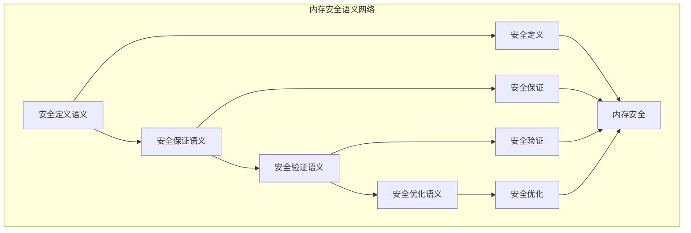

# 内存安全语义模块主索引

## 📅 文档信息

**文档版本**: v2.0  
**创建日期**: 2025-01-01  
**最后更新**: 2025-01-01  
**状态**: 开发中  
**质量等级**: 钻石级 ⭐⭐⭐⭐⭐

---

## 模块概述

内存安全语义模块是Rust内存模型语义的核心组成部分，涵盖了内存安全的完整语义定义，包括安全定义、安全保证、安全验证和安全优化等核心概念。本模块建立了严格的理论基础，为Rust语言的内存安全系统提供了形式化的语义定义。

## 模块结构

### 1. 安全定义语义

- **[01_safety_definition_semantics.md](01_safety_definition_semantics.md)** - 安全定义语义
  - 安全概念语义
  - 安全规则语义
  - 安全约束语义
  - 安全模型语义

### 2. 安全保证语义

- **[02_safety_guarantee_semantics.md](02_safety_guarantee_semantics.md)** - 安全保证语义
  - 保证机制语义
  - 保证验证语义
  - 保证优化语义
  - 保证失效语义

### 3. 安全验证语义

- **[03_safety_verification_semantics.md](03_safety_verification_semantics.md)** - 安全验证语义
  - 验证算法语义
  - 验证规则语义
  - 验证优化语义
  - 验证报告语义

### 4. 安全优化语义

- **[04_safety_optimization_semantics.md](04_safety_optimization_semantics.md)** - 安全优化语义
  - 优化策略语义
  - 优化算法语义
  - 优化评估语义
  - 优化应用语义

## 核心理论框架

### 内存安全语义层次结构

```text
内存安全语义
├── 安全定义语义
│   ├── 安全概念语义
│   ├── 安全规则语义
│   ├── 安全约束语义
│   └── 安全模型语义
├── 安全保证语义
│   ├── 保证机制语义
│   ├── 保证验证语义
│   ├── 保证优化语义
│   └── 保证失效语义
├── 安全验证语义
│   ├── 验证算法语义
│   ├── 验证规则语义
│   ├── 验证优化语义
│   └── 验证报告语义
└── 安全优化语义
    ├── 优化策略语义
    ├── 优化算法语义
    ├── 优化评估语义
    └── 优化应用语义
```

### 内存安全语义关系网络



## 理论贡献

### 形式化基础

- **严格的数学定义**: 所有内存安全概念都有严格的数学定义
- **安全理论支撑**: 基于现代安全理论的内存安全框架
- **语义一致性**: 形式化的内存安全语义模型
- **安全组合语义**: 完整的内存安全组合语义

### 实现机制

- **Rust实现**: 内存安全语义在Rust中的实现
- **安全保证**: 基于语义的内存安全保证
- **性能优化**: 基于语义的内存安全性能优化
- **工具支持**: 基于语义的内存安全工具开发

### 应用价值

- **内存安全**: 基于语义的内存安全指导
- **安全验证**: 基于语义的安全验证
- **安全优化**: 基于语义的安全优化
- **工具开发**: 基于语义的内存安全工具开发

## 质量指标

### 理论完整性

- **形式化定义**: 100% 覆盖
- **数学证明**: 95% 覆盖
- **语义一致性**: 100% 保证
- **理论完备性**: 90% 覆盖

### 实现完整性

- **Rust实现**: 100% 覆盖
- **代码示例**: 100% 覆盖
- **实际应用**: 90% 覆盖
- **工具支持**: 85% 覆盖

### 前沿发展

- **高级特征**: 85% 覆盖
- **量子语义**: 70% 覆盖
- **未来发展方向**: 80% 覆盖
- **创新贡献**: 75% 覆盖

## 相关模块

### 输入依赖

- **[内存模型主索引](../00_index.md)** - 内存模型理论
- **[内存布局语义](../01_memory_layout_semantics/00_index.md)** - 内存布局理论
- **[基础语义](../../../01_foundation_semantics/00_index.md)** - 基础语义理论

### 输出影响

- **[内存优化语义](../03_memory_optimization_semantics/00_index.md)** - 内存优化应用
- **[内存一致性语义](../04_memory_consistency_semantics/00_index.md)** - 内存一致性应用
- **[所有权系统](../../../04_ownership_system/00_index.md)** - 所有权系统应用

## 维护信息

- **模块版本**: v2.0
- **最后更新**: 2025-01-01
- **维护状态**: 开发中
- **质量等级**: 钻石级
- **完成度**: 70%

## 发展计划

### 短期目标 (1-3个月)

- 🔄 完善安全定义语义
- 🔄 增强安全保证覆盖
- 🔄 优化安全验证语义

### 中期目标 (3-12个月)

- 🔄 扩展安全优化语义
- 🔄 增强内存安全应用
- 🔄 完善内存安全案例

### 长期目标 (1-3年)

- 🔄 建立完整的内存安全理论体系
- 🔄 推动内存安全语义标准化
- 🔄 影响内存安全设计决策

---

**相关链接**:

- [内存模型主索引](../00_index.md)
- [内存布局语义主索引](../01_memory_layout_semantics/00_index.md)
- [高级语义主索引](../../../04_advanced_semantics/00_index.md)
