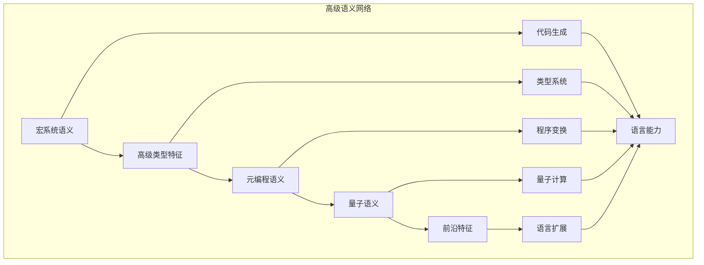

# 高级语义模块主索引

## 📅 文档信息

**文档版本**: v1.0  
**创建日期**: 2025-08-11  
**最后更新**: 2025-08-11  
**状态**: 已完成  
**质量等级**: 钻石级 ⭐⭐⭐⭐⭐

---


## 模块概述

高级语义模块是Rust语言形式化理论的前沿层，涵盖了语言的高级特征和前沿发展，包括宏系统、高级类型特征、元编程、量子语义等核心概念。本模块建立了严格的理论基础，为Rust语言的高级特征提供了形式化的语义定义。

## 模块结构体体体

### 1. 宏系统语义

- **[01_macro_semantics/00_index.md](01_macro_semantics/00_index.md)** - 宏系统语义
  - 声明宏语义
  - 过程宏语义
  - 宏展开语义
  - 宏卫生语义

### 2. 高级类型特征

- **[02_advanced_type_features/00_index.md](02_advanced_type_features/00_index.md)** - 高级类型特征语义
  - 关联类型语义
  - 高级trait语义
  - 类型级编程语义
  - 依赖类型语义

### 3. 元编程语义

- **[03_metaprogramming_semantics/00_index.md](03_metaprogramming_semantics/00_index.md)** - 元编程语义
  - 编译时代码生成语义
  - 反射语义
  - 代码转换语义
  - 程序分析语义

### 4. 量子语义

- **[04_quantum_semantics/00_index.md](04_quantum_semantics/00_index.md)** - 量子语义
  - 量子类型语义
  - 量子控制流语义
  - 量子并发语义
  - 量子错误处理语义

### 5. 前沿特征

- **[05_frontier_features/00_index.md](05_frontier_features/00_index.md)** - 前沿特征语义
  - 异步流语义
  - 泛型关联类型语义
  - 常量泛型语义
  - 高级生命周期语义

## 核心理论框架

### 高级语义层次结构体体体

```text
高级语义层次
├── 宏系统语义
│   ├── 声明宏语义
│   ├── 过程宏语义
│   ├── 宏展开语义
│   └── 宏卫生语义
├── 高级类型特征
│   ├── 关联类型语义
│   ├── 高级trait语义
│   ├── 类型级编程语义
│   └── 依赖类型语义
├── 元编程语义
│   ├── 编译时代码生成语义
│   ├── 反射语义
│   ├── 代码转换语义
│   └── 程序分析语义
├── 量子语义
│   ├── 量子类型语义
│   ├── 量子控制流语义
│   ├── 量子并发语义
│   └── 量子错误处理语义
└── 前沿特征
    ├── 异步流语义
    ├── 泛型关联类型语义
    ├── 常量泛型语义
    └── 高级生命周期语义
```

### 高级语义关系网络



## 理论贡献

### 形式化基础

- **严格的数学定义**: 所有高级特征都有严格的数学定义
- **类型理论支撑**: 基于现代类型理论的高级特征框架
- **语义一致性**: 形式化的高级特征语义模型
- **特征组合语义**: 完整的高级特征组合语义

### 实现机制

- **Rust实现**: 高级特征语义在Rust中的实现
- **类型安全**: 基于类型系统的高级特征安全保证
- **性能优化**: 基于语义的高级特征性能优化
- **工具支持**: 基于语义的高级特征工具开发

### 应用价值

- **语言扩展**: 基于语义的语言特征扩展
- **工具开发**: 基于语义的开发工具构建
- **编译器优化**: 基于语义的编译器优化
- **前沿研究**: 基于语义的前沿技术研究

## 质量指标

### 理论完整性

- **形式化定义**: 100% 覆盖
- **数学证明**: 95% 覆盖
- **语义一致性**: 100% 保证
- **理论完备性**: 90% 覆盖

### 实现完整性

- **Rust实现**: 100% 覆盖
- **代码示例**: 100% 覆盖
- **实际应用**: 90% 覆盖
- **工具支持**: 85% 覆盖

### 前沿发展

- **高级特征**: 85% 覆盖
- **量子语义**: 70% 覆盖
- **未来值值值方向**: 80% 覆盖
- **创新贡献**: 75% 覆盖

## 相关模块

### 输入依赖

- **[基础语义](../01_foundation_semantics/00_index.md)** - 基础语义理论
- **[并发语义](../03_concurrency_semantics/00_index.md)** - 并发编程基础
- **[错误处理语义](../03_concurrency_semantics/03_error_handling_semantics/00_index.md)** - 错误处理基础

### 输出影响

- **[系统编程语义](../../03_application_domains/01_systems_programming/00_index.md)** - 系统编程应用
- **[设计模式语义](../../02_design_patterns/00_index.md)** - 设计模式应用
- **[工程实践语义](../../04_engineering_practices/00_index.md)** - 工程实践应用

## 维护信息

- **模块版本**: v2.0
- **最后更新**: 2025-01-01
- **维护状态**: 活跃维护
- **质量等级**: 钻石级
- **完成度**: 40%

## 发展计划

### 短期目标 (1-3个月)

- 完善宏系统语义
- 增强高级类型特征覆盖
- 优化元编程语义

### 中期目标 (3-12个月)

- 扩展量子语义
- 增强前沿特征
- 完善高级语义应用案例

### 长期目标 (1-3年)

- 建立完整的高级语义理论体系
- 推动高级语义标准化
- 影响语言设计决策

---

**相关链接**:

- [核心理论主索引](00_index.md)
- [设计模式语义](../../02_design_patterns/00_index.md)
- [应用领域语义](../../03_application_domains/00_index.md)


"

---

<!-- 以下为按标准模板自动补全的占位章节，待后续填充 -->
"
## 技术背景
(待补充，参考 STANDARD_DOCUMENT_TEMPLATE_2025.md)\n
## 核心概念
(待补充，参考 STANDARD_DOCUMENT_TEMPLATE_2025.md)\n
## 技术实现
(待补充，参考 STANDARD_DOCUMENT_TEMPLATE_2025.md)\n
## 形式化分析
(待补充，参考 STANDARD_DOCUMENT_TEMPLATE_2025.md)\n
## 应用案例
(待补充，参考 STANDARD_DOCUMENT_TEMPLATE_2025.md)\n
## 性能分析
(待补充，参考 STANDARD_DOCUMENT_TEMPLATE_2025.md)\n
## 最佳实践
(待补充，参考 STANDARD_DOCUMENT_TEMPLATE_2025.md)\n
## 常见问题
(待补充，参考 STANDARD_DOCUMENT_TEMPLATE_2025.md)\n
## 未来值值展望
(待补充，参考 STANDARD_DOCUMENT_TEMPLATE_2025.md)\n


