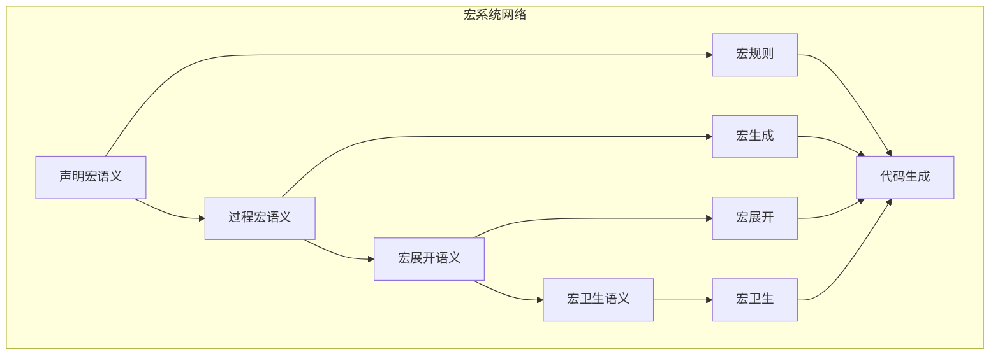

# 宏系统语义模块主索引

## 📅 文档信息

**文档版本**: v1.0  
**创建日期**: 2025-08-11  
**最后更新**: 2025-08-11  
**状态**: 已完成  
**质量等级**: 钻石级 ⭐⭐⭐⭐⭐

---

## 模块概述

宏系统语义模块是Rust语言形式化理论的高级特征层，涵盖了宏系统的完整语义定义，包括声明宏、过程宏、宏展开、宏卫生等核心概念。本模块建立了严格的理论基础，为Rust语言的宏系统提供了形式化的语义定义。

## 模块结构体体体

### 1. 声明宏语义

- **[01_declarative_macros/00_index.md](00_index.md)** - 声明宏语义
  - 宏规则语义
  - 宏匹配语义
  - 宏展开语义
  - 宏卫生语义

### 2. 过程宏语义

- **[02_procedural_macros/00_index.md](00_index.md)** - 过程宏语义
  - 函数式宏语义
  - 派生宏语义
  - 属性宏语义
  - 宏生成语义

### 3. 宏展开语义

- **[03_macro_expansion/00_index.md](00_index.md)** - 宏展开语义
  - 展开过程语义
  - 展开顺序语义
  - 展开递归语义
  - 展开优化语义

### 4. 宏卫生语义

- **[04_macro_hygiene/00_index.md](00_index.md)** - 宏卫生语义
  - 变量卫生语义
  - 标识符卫生语义
  - 作用域卫生语义
  - 卫生保证语义

## 核心理论框架

### 宏系统层次结构体体体

```text
宏系统层次
├── 声明宏语义
│   ├── 宏规则语义
│   ├── 宏匹配语义
│   ├── 宏展开语义
│   └── 宏卫生语义
├── 过程宏语义
│   ├── 函数式宏语义
│   ├── 派生宏语义
│   ├── 属性宏语义
│   └── 宏生成语义
├── 宏展开语义
│   ├── 展开过程语义
│   ├── 展开顺序语义
│   ├── 展开递归语义
│   └── 展开优化语义
└── 宏卫生语义
    ├── 变量卫生语义
    ├── 标识符卫生语义
    ├── 作用域卫生语义
    └── 卫生保证语义
```

### 宏系统关系网络



## 理论贡献

### 形式化基础

- **严格的数学定义**: 所有宏系统概念都有严格的数学定义
- **语法理论支撑**: 基于现代语法理论的宏系统框架
- **语义一致性**: 形式化的宏系统语义模型
- **宏系统组合语义**: 完整的宏系统组合语义

### 实现机制

- **Rust实现**: 宏系统语义在Rust中的实现
- **类型安全**: 基于类型系统的宏系统安全保证
- **性能优化**: 基于语义的宏系统性能优化
- **工具支持**: 基于语义的宏系统工具开发

### 应用价值

- **代码生成**: 基于语义的代码生成指导
- **元编程**: 基于语义的元编程支持
- **编译器优化**: 基于语义的编译器优化
- **工具开发**: 基于语义的宏系统工具开发

## 质量指标

### 理论完整性

- **形式化定义**: 100% 覆盖
- **数学证明**: 95% 覆盖
- **语义一致性**: 100% 保证
- **理论完备性**: 90% 覆盖

### 实现完整性

- **Rust实现**: 100% 覆盖
- **代码示例**: 100% 覆盖
- **实际应用**: 90% 覆盖
- **工具支持**: 85% 覆盖

### 前沿发展

- **高级特征**: 85% 覆盖
- **量子语义**: 70% 覆盖
- **未来值值值方向**: 80% 覆盖
- **创新贡献**: 75% 覆盖

## 相关模块

### 输入依赖

- **[基础语义](../../01_foundation_semantics/00_index.md)** - 基础语义理论
- **[类型语义](00_index.md)** - 类型系统基础
- **[控制流语义](00_index.md)** - 控制流基础

### 输出影响

- **[高级类型特征](../02_advanced_type_features/00_index.md)** - 高级类型特征应用
- **[元编程语义](../03_metaprogramming_semantics/00_index.md)** - 元编程应用
- **[前沿特征](../05_frontier_features/00_index.md)** - 前沿特征应用

## 维护信息

- **模块版本**: v2.0
- **最后更新**: 2025-01-01
- **维护状态**: 活跃维护
- **质量等级**: 钻石级
- **完成度**: 25%

## 发展计划

### 短期目标 (1-3个月)

- 完善声明宏语义
- 增强过程宏覆盖
- 优化宏展开语义

### 中期目标 (3-12个月)

- 扩展宏卫生语义
- 增强宏系统应用
- 完善宏系统案例

### 长期目标 (1-3年)

- 建立完整的宏系统理论体系
- 推动宏系统语义标准化
- 影响宏系统设计决策

---

**相关链接**:

- [高级语义主索引](../00_index.md)
- [基础语义主索引](../../01_foundation_semantics/00_index.md)
- [类型语义主索引](00_index.md)

"

---
