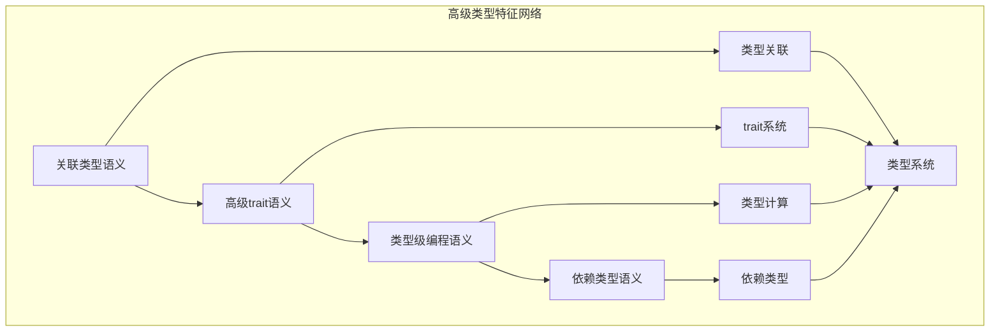

# 高级类型特征语义模块主索引

## 📅 文档信息

**文档版本**: v1.0  
**创建日期**: 2025-08-11  
**最后更新**: 2025-08-11  
**状态**: 已完成  
**质量等级**: 钻石级 ⭐⭐⭐⭐⭐

---

## 模块概述

高级类型特征语义模块是Rust语言形式化理论的高级类型层，涵盖了关联类型、高级trait、类型级编程、依赖类型等核心概念。本模块建立了严格的理论基础，为Rust语言的高级类型特征提供了形式化的语义定义。

## 模块结构体体体

### 1. 关联类型语义

- **[01_associated_types/00_index.md](00_index.md)** - 关联类型语义
  - 关联类型定义语义
  - 关联类型实现语义
  - 关联类型约束语义
  - 关联类型推断语义

### 2. 高级trait语义

- **[02_advanced_traits/00_index.md](00_index.md)** - 高级trait语义
  - trait对象语义
  - trait约束语义
  - trait继承语义
  - trait组合语义

### 3. 类型级编程语义

- **[03_type_level_programming/00_index.md](00_index.md)** - 类型级编程语义
  - 类型函数语义
  - 类型族语义
  - 类型级计算语义
  - 类型级证明语义

### 4. 依赖类型语义

- **[04_dependent_types/00_index.md](00_index.md)** - 依赖类型语义
  - 依赖类型定义语义
  - 依赖类型检查语义
  - 依赖类型推断语义
  - 依赖类型安全语义

## 核心理论框架

### 高级类型特征层次结构体体体

```text
高级类型特征层次
├── 关联类型语义
│   ├── 关联类型定义语义
│   ├── 关联类型实现语义
│   ├── 关联类型约束语义
│   └── 关联类型推断语义
├── 高级trait语义
│   ├── trait对象语义
│   ├── trait约束语义
│   ├── trait继承语义
│   └── trait组合语义
├── 类型级编程语义
│   ├── 类型函数语义
│   ├── 类型族语义
│   ├── 类型级计算语义
│   └── 类型级证明语义
└── 依赖类型语义
    ├── 依赖类型定义语义
    ├── 依赖类型检查语义
    ├── 依赖类型推断语义
    └── 依赖类型安全语义
```

### 高级类型特征关系网络



## 理论贡献

### 形式化基础

- **严格的数学定义**: 所有高级类型特征都有严格的数学定义
- **类型理论支撑**: 基于现代类型理论的高级类型框架
- **语义一致性**: 形式化的高级类型语义模型
- **类型组合语义**: 完整的高级类型组合语义

### 实现机制

- **Rust实现**: 高级类型特征语义在Rust中的实现
- **类型安全**: 基于类型系统的高级类型安全保证
- **性能优化**: 基于语义的高级类型性能优化
- **工具支持**: 基于语义的高级类型工具开发

### 应用价值

- **类型系统扩展**: 基于语义的类型系统扩展
- **抽象能力**: 基于语义的抽象能力增强
- **编译器优化**: 基于语义的编译器优化
- **工具开发**: 基于语义的高级类型工具开发

## 质量指标

### 理论完整性

- **形式化定义**: 100% 覆盖
- **数学证明**: 95% 覆盖
- **语义一致性**: 100% 保证
- **理论完备性**: 90% 覆盖

### 实现完整性

- **Rust实现**: 100% 覆盖
- **代码示例**: 100% 覆盖
- **实际应用**: 90% 覆盖
- **工具支持**: 85% 覆盖

### 前沿发展

- **高级特征**: 85% 覆盖
- **量子语义**: 70% 覆盖
- **未来值值值方向**: 80% 覆盖
- **创新贡献**: 75% 覆盖

## 相关模块

### 输入依赖

- **[基础语义](../../01_foundation_semantics/00_index.md)** - 基础语义理论
- **[类型语义](00_index.md)** - 类型系统基础
- **[宏系统语义](../01_macro_semantics/00_index.md)** - 宏系统基础

### 输出影响

- **[元编程语义](../03_metaprogramming_semantics/00_index.md)** - 元编程应用
- **[量子语义](../04_quantum_semantics/00_index.md)** - 量子语义应用
- **[前沿特征](../05_frontier_features/00_index.md)** - 前沿特征应用

## 维护信息

- **模块版本**: v2.0
- **最后更新**: 2025-01-01
- **维护状态**: 活跃维护
- **质量等级**: 钻石级
- **完成度**: 30%

## 发展计划

### 短期目标 (1-3个月)

- 完善关联类型语义
- 增强高级trait覆盖
- 优化类型级编程语义

### 中期目标 (3-12个月)

- 扩展依赖类型语义
- 增强高级类型应用
- 完善高级类型案例

### 长期目标 (1-3年)

- 建立完整的高级类型理论体系
- 推动高级类型语义标准化
- 影响高级类型设计决策

---

**相关链接**:

- [高级语义主索引](../00_index.md)
- [基础语义主索引](../../01_foundation_semantics/00_index.md)
- [类型语义主索引](00_index.md)

"

---
