# 4. 组织语义层索引

## 📅 文档信息

**文档版本**: v1.0  
**创建日期**: 2025-08-11  
**最后更新**: 2025-08-11  
**状态**: 已完成  
**质量等级**: 钻石级 ⭐⭐⭐⭐⭐

---

**文档编号**: RFTS-04  
**版本**: 1.0  
**最后更新**: 2025-01-27  
**状态**: 核心理论层

---

## 层级概述

组织语义层 (Organization Semantics Layer) 定义了Rust代码组织和模块化的语义模型，包括模块系统、项目结构体体体、代码组织原则和依赖管理机制。

```mermaid
graph TB
    subgraph "4. 组织语义层"
        A[4.1 模块系统语义]
        B[4.2 项目结构体体体语义]
        C[4.3 代码组织语义]
        D[4.4 依赖管理语义]
    end
    
    subgraph "4.1 模块系统"
        A1[4.1.1 模块定义语义]
        A2[4.1.2 模块可见性语义]
        A3[4.1.3 模块路径语义]
        A4[4.1.4 use语句语义]
    end
    
    subgraph "4.2 项目结构体体体"
        B1[4.2.1 Cargo语义]
        B2[4.2.2 crate结构体体体语义]
        B3[4.2.3 工作空间语义]
        B4[4.2.4 包管理语义]
    end
    
    subgraph "4.3 代码组织"
        C1[4.3.1 架构模式语义]
        C2[4.3.2 分层设计语义]
        C3[4.3.3 模块解耦语义]
        C4[4.3.4 接口设计语义]
    end
    
    subgraph "4.4 依赖管理"
        D1[4.4.1 依赖解析语义]
        D2[4.4.2 版本约束语义]
        D3[4.4.3 特征系统语义]
        D4[4.4.4 构建脚本语义]
    end
    
    A --> A1
    A --> A2
    A --> A3
    A --> A4
    
    B --> B1
    B --> B2
    B --> B3
    B --> B4
    
    C --> C1
    C --> C2
    C --> C3
    C --> C4
    
    D --> D1
    D --> D2
    D --> D3
    D --> D4
```

---

## 子系统详述

### 4.1 模块系统语义

- **[模块定义语义](01_module_system_semantics/01_module_definition_semantics.md)** - 模块声明和结构体体体
- **[模块可见性语义](01_module_system_semantics/02_module_visibility_semantics.md)** - 访问控制机制
- **[模块路径语义](01_module_system_semantics/03_module_path_semantics.md)** - 路径解析规则
- **[use语句语义](01_module_system_semantics/04_use_statement_semantics.md)** - 导入机制

### 4.2 项目结构体体体语义

- **[Cargo语义](02_project_structure_semantics/01_cargo_semantics.md)** - 构建系统核心
- **[crate结构体体体语义](02_project_structure_semantics/02_crate_structure_semantics.md)** - 包结构体体体规则
- **[工作空间语义](02_project_structure_semantics/03_workspace_semantics.md)** - 多包管理
- **[包管理语义](02_project_structure_semantics/04_package_management_semantics.md)** - 包生命周期

### 4.3 代码组织语义

- **[架构模式语义](03_code_organization_semantics/01_architecture_patterns_semantics.md)** - 设计模式应用
- **[分层设计语义](03_code_organization_semantics/02_layered_design_semantics.md)** - 分层架构原则
- **[模块解耦语义](03_code_organization_semantics/03_module_decoupling_semantics.md)** - 耦合控制策略
- **[接口设计语义](03_code_organization_semantics/04_interface_design_semantics.md)** - API设计原则

### 4.4 依赖管理语义

- **[依赖解析语义](04_dependency_management_semantics/01_dependency_resolution_semantics.md)** - 依赖图构建
- **[版本约束语义](04_dependency_management_semantics/02_version_constraints_semantics.md)** - 版本兼容性
- **[特征系统语义](04_dependency_management_semantics/03_feature_system_semantics.md)** - 条件编译
- **[构建脚本语义](04_dependency_management_semantics/04_build_scripts_semantics.md)** - 构建时处理

---

## 跨层引用

### 向下依赖

- **[基础语义层](../01_foundation_semantics)** - 类型系统基础
- **[控制语义层](../02_control_semantics)** - 流程控制基础  
- **[并发语义层](../03_concurrency_semantics)** - 并发原语

### 向上支撑

- **[变换语义层](../05_transformation_semantics)** - 宏系统
- **[编译语义层](../06_compilation_semantics/)** - 编译过程
- **[运行时语义层](../07_runtime_semantics/)** - 运行时环境

---

## 理论创新

### 组织语义理论

1. **模块化语义模型** - 形式化模块系统语义
2. **可见性控制理论** - 访问控制的数学模型
3. **依赖图理论** - 包依赖关系的图论分析
4. **架构演化理论** - 代码组织的演化模型

### 实践方法论

1. **模块设计原则** - 高内聚低耦合的量化指标
2. **依赖管理策略** - 版本兼容性保证机制
3. **重构安全** - 结构体体体变更的语义保持
4. **测试组织模式** - 测试代码的模块化策略

---

## 工具集成

### 编译器集成

- **rustc模块解析** - 名称解析和路径查找
- **可见性检查** - 访问权限验证
- **依赖分析** - 循环依赖检测

### 开发工具

- **cargo构建系统** - 项目管理和构建
- **rust-analyzer** - IDE语义分析
- **模块化重构工具** - 结构体体体安全变更

---

## 质量保证

### 完整性验证

- ✅ **理论完备性**: 所有组织概念都有形式化定义
- ✅ **实践覆盖性**: 涵盖实际开发中的组织需求
- ✅ **工具支持性**: 与现有工具链无缝集成

### 一致性检查

- ✅ **命名规范**: 统一的术语和概念定义
- ✅ **引用完整性**: 所有跨引用都有效且准确
- ✅ **版本同步**: 与Rust语言演进保持同步

---

*索引状态: 完成*  
*版本: 1.0*  
*维护者: Rust组织语义分析工作组*

"

---
