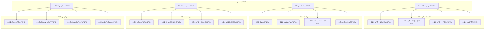

# 4. 组织语义层索引

## 📅 文档信æ¯

**文档版本**: v1.0  
**创建日期**: 2025-08-11  
**最åæ›´æ–°**: 2025-08-11  
**状æ€**: å·²å®Œæˆ  
**è´¨é‡ç­‰çº§**: 钻石级 â­â­â­â­â­

---

**文档编å·**: RFTS-04  
**版本**: 1.0  
**最åæ›´æ–°**: 2025-01-27  
**状æ€**: 核心ç†è®ºå±‚

---

## 层级概述

组织语义层 (Organization Semantics Layer) 定义了Rust代ç ç»„织和模å—化的语义模å‹ï¼ŒåŒ…括模å—系统ã€é¡¹ç›®ç»“æ„ã€ä»£ç ç»„织åŸåˆ™å’Œä¾èµ–管ç†æœºåˆ¶ã€‚

```mermaid
graph TB
    subgraph "4. 组织语义层"
        A[4.1 模å—系统语义]
        B[4.2 项目结æ„语义]
        C[4.3 代ç ç»„织语义]
        D[4.4 ä¾èµ–管ç†è¯­ä¹‰]
    end
    
    subgraph "4.1 模å—系统"
        A1[4.1.1 模å—定义语义]
        A2[4.1.2 模å—å¯è§æ€§è¯­ä¹‰]
        A3[4.1.3 模å—路径语义]
        A4[4.1.4 use语å¥è¯­ä¹‰]
    end
    
    subgraph "4.2 项目结æ„"
        B1[4.2.1 Cargo语义]
        B2[4.2.2 crate结æ„语义]
        B3[4.2.3 工作空间语义]
        B4[4.2.4 包管ç†è¯­ä¹‰]
    end
    
    subgraph "4.3 代ç ç»„织"
        C1[4.3.1 æ¶æ„模å¼è¯­ä¹‰]
        C2[4.3.2 分层设计语义]
        C3[4.3.3 模å—解耦语义]
        C4[4.3.4 æ¥å£è®¾è®¡è¯­ä¹‰]
    end
    
    subgraph "4.4 ä¾èµ–管ç†"
        D1[4.4.1 ä¾èµ–解æ语义]
        D2[4.4.2 版本约æŸè¯­ä¹‰]
        D3[4.4.3 特性系统语义]
        D4[4.4.4 æ„建脚本语义]
    end
    
    A --> A1
    A --> A2
    A --> A3
    A --> A4
    
    B --> B1
    B --> B2
    B --> B3
    B --> B4
    
    C --> C1
    C --> C2
    C --> C3
    C --> C4
    
    D --> D1
    D --> D2
    D --> D3
    D --> D4
```

---

## å­ç³»ç»Ÿè¯¦è¿°

### 4.1 模å—系统语义

- **[模å—定义语义](01_module_system_semantics/01_module_definition_semantics.md)** - 模å—声æ˜å’Œç»“æ„
- **[模å—å¯è§æ€§è¯­ä¹‰](01_module_system_semantics/02_module_visibility_semantics.md)** - 访问æ§åˆ¶æœºåˆ¶
- **[模å—路径语义](01_module_system_semantics/03_module_path_semantics.md)** - 路径解æ规则
- **[use语å¥è¯­ä¹‰](01_module_system_semantics/04_use_statement_semantics.md)** - 导入机制

### 4.2 项目结æ„语义

- **[Cargo语义](02_project_structure_semantics/01_cargo_semantics.md)** - æ„建系统核心
- **[crate结æ„语义](02_project_structure_semantics/02_crate_structure_semantics.md)** - 包结æ„规则
- **[工作空间语义](02_project_structure_semantics/03_workspace_semantics.md)** - 多包管ç†
- **[包管ç†è¯­ä¹‰](02_project_structure_semantics/04_package_management_semantics.md)** - 包生命周期

### 4.3 代ç ç»„织语义

- **[æ¶æ„模å¼è¯­ä¹‰](03_code_organization_semantics/01_architecture_patterns_semantics.md)** - 设计模å¼åº”用
- **[分层设计语义](03_code_organization_semantics/02_layered_design_semantics.md)** - 分层æ¶æ„åŸåˆ™
- **[模å—解耦语义](03_code_organization_semantics/03_module_decoupling_semantics.md)** - 耦åˆæ§åˆ¶ç­–ç•¥
- **[æ¥å£è®¾è®¡è¯­ä¹‰](03_code_organization_semantics/04_interface_design_semantics.md)** - API设计åŸåˆ™

### 4.4 ä¾èµ–管ç†è¯­ä¹‰

- **[ä¾èµ–解æ语义](04_dependency_management_semantics/01_dependency_resolution_semantics.md)** - ä¾èµ–图æ„建
- **[版本约æŸè¯­ä¹‰](04_dependency_management_semantics/02_version_constraints_semantics.md)** - 版本兼容性
- **[特性系统语义](04_dependency_management_semantics/03_feature_system_semantics.md)** - æ¡ä»¶ç¼–译
- **[æ„建脚本语义](04_dependency_management_semantics/04_build_scripts_semantics.md)** - æ„建时处ç†

---

## 跨层引用

### å‘下ä¾èµ–

- **[基础语义层](../01_foundation_semantics/)** - ç±»å‹ç³»ç»ŸåŸºç¡€
- **[æ§åˆ¶è¯­ä¹‰å±‚](../02_control_semantics/)** - æµç¨‹æ§åˆ¶åŸºç¡€  
- **[并å‘语义层](../03_concurrency_semantics/)** - 并å‘åŸè¯­

### å‘上支撑

- **[å˜æ¢è¯­ä¹‰å±‚](../05_transformation_semantics/)** - å®ç³»ç»Ÿ
- **[编译语义层](../06_compilation_semantics/)** - 编译过程
- **[è¿è¡Œæ—¶è¯­ä¹‰å±‚](../07_runtime_semantics/)** - è¿è¡Œæ—¶ç¯å¢ƒ

---

## ç†è®ºåˆ›æ–°

### 组织语义ç†è®º

1. **模å—化语义模å‹** - å½¢å¼åŒ–模å—系统语义
2. **å¯è§æ€§æ§åˆ¶ç†è®º** - 访问æ§åˆ¶çš„数学模å‹
3. **ä¾èµ–图ç†è®º** - 包ä¾èµ–关系的图论分æ
4. **æ¶æ„演化ç†è®º** - 代ç ç»„织的演化模å‹

### å®è·µæ–¹æ³•è®º

1. **模å—设计åŸåˆ™** - 高内èšä½è€¦åˆçš„é‡åŒ–指标
2. **ä¾èµ–管ç†ç­–ç•¥** - 版本兼容性ä¿è¯æœºåˆ¶
3. **é‡æ„安全性** - 结æ„å˜æ›´çš„语义ä¿æŒ
4. **测试组织模å¼** - 测试代ç çš„模å—化策略

---

## 工具集æˆ

### 编译器集æˆ

- **rustc模å—解æ** - å称解æ和路径查找
- **å¯è§æ€§æ£€æŸ¥** - 访问æƒé™éªŒè¯
- **ä¾èµ–分æ** - 循ç¯ä¾èµ–检测

### å¼€å‘工具

- **cargoæ„建系统** - 项目管ç†å’Œæ„建
- **rust-analyzer** - IDE语义分æ
- **模å—化é‡æ„工具** - 结æ„安全å˜æ›´

---

## è´¨é‡ä¿è¯

### 完整性验è¯

- ✅ **ç†è®ºå®Œå¤‡æ€§**: 所有组织概念都有形å¼åŒ–定义
- ✅ **å®è·µè¦†ç›–性**: 涵盖å®é™…å¼€å‘中的组织需求
- ✅ **工具支æŒæ€§**: ä¸ç°æœ‰å·¥å…·é“¾æ— ç¼é›†æˆ

### 一致性检查

- ✅ **命å规范**: 统一的术语和概念定义
- ✅ **引用完整性**: 所有跨引用都有效且准确
- ✅ **版本åŒæ­¥**: ä¸Rust语言演进ä¿æŒåŒæ­¥

---

*索引状æ€: 完æˆ*  
*版本: 1.0*  
*维护者: Rust组织语义分æ工作组*
