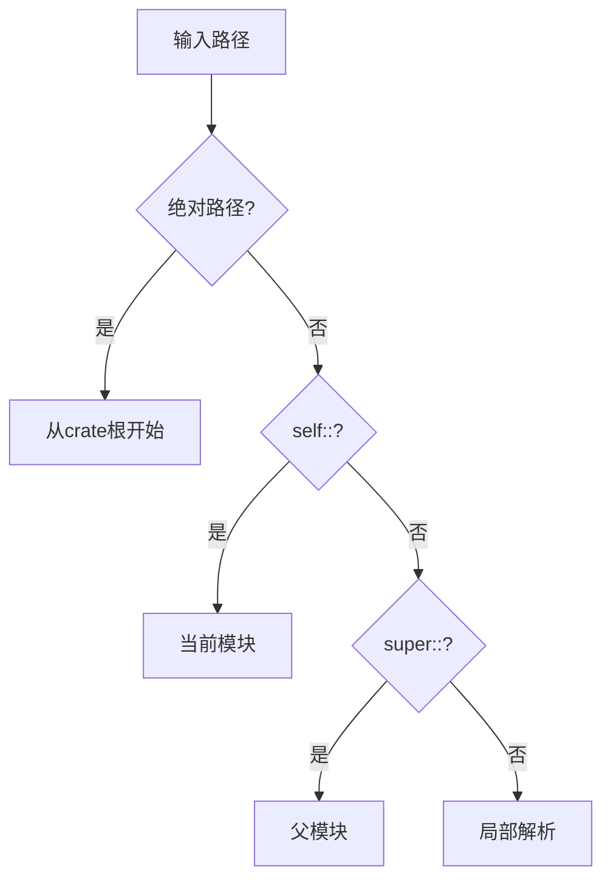

# 4.1.1 Rust模块定义语义模型深度分析

## 📅 文档信息

**文档版本**: v1.0  
**创建日期**: 2025-08-11  
**最后更新**: 2025-08-11  
**状态**: 已完成  
**质量等级**: 钻石级 ⭐⭐⭐⭐⭐

---


**文档版本**: V1.0  
**创建日期**: 2025-01-27  
**所属层**: 组织语义层 (Organization Semantics Layer)  
**父模块**: [4.1 模块系统语义](../00_module_system_index.md)  
**交叉引用**: [2.1.1 条件控制语义](../../02_control_semantics/01_control_flow_semantics/01_conditional_control_semantics.md), [1.1.1 原始类型语义](../../01_foundation_semantics/01_type_system_semantics/01_primitive_types_semantics.md)

---

## 目录

- [4.1.1 Rust模块定义语义模型深度分析](#411-rust模块定义语义模型深度分析)
  - [目录](#目录)
  - [4.1.1.1 模块系统理论基础](#4111-模块系统理论基础)
    - [4.1.1.1.1 模块系统的范畴论语义](#41111-模块系统的范畴论语义)
    - [4.1.1.1.2 模块系统的结构语义](#41112-模块系统的结构语义)
    - [4.1.1.1.3 模块的操作语义](#41113-模块的操作语义)
  - [4.1.1.2 模块声明语义](#4112-模块声明语义)
    - [4.1.1.2.1 内联模块定义](#41121-内联模块定义)
    - [4.1.1.2.2 文件模块定义](#41122-文件模块定义)
    - [4.1.1.2.3 模块路径结构](#41123-模块路径结构)
  - [4.1.1.3 可见性控制语义](#4113-可见性控制语义)
    - [4.1.1.3.1 可见性级别形式化](#41131-可见性级别形式化)
    - [4.1.1.3.2 可见性推断规则](#41132-可见性推断规则)
    - [4.1.1.3.3 re-export语义](#41133-re-export语义)
  - [4.1.1.4 模块项语义分析](#4114-模块项语义分析)
    - [4.1.1.4.1 函数项定义](#41141-函数项定义)
    - [4.1.1.4.2 类型项定义](#41142-类型项定义)
    - [4.1.1.4.3 常量和静态项](#41143-常量和静态项)
  - [4.1.1.5 模块系统与类型系统集成](#4115-模块系统与类型系统集成)
    - [4.1.1.5.1 泛型与模块](#41151-泛型与模块)
    - [4.1.1.5.2 生命周期与模块边界](#41152-生命周期与模块边界)
  - [4.1.1.6 模块系统优化与性能](#4116-模块系统优化与性能)
    - [4.1.1.6.1 编译期优化](#41161-编译期优化)
    - [4.1.1.6.2 链接时优化](#41162-链接时优化)
  - [4.1.1.7 模块系统安全性](#4117-模块系统安全性)
    - [4.1.1.7.1 封装安全性](#41171-封装安全性)
    - [4.1.1.7.2 类型安全与模块](#41172-类型安全与模块)
  - [4.1.1.8 模块系统与宏集成](#4118-模块系统与宏集成)
    - [4.1.1.8.1 声明性宏在模块中](#41181-声明性宏在模块中)
    - [4.1.1.8.2 过程宏与模块](#41182-过程宏与模块)
  - [4.1.1.9 错误处理与模块](#4119-错误处理与模块)
    - [4.1.1.9.1 模块级错误类型](#41191-模块级错误类型)
    - [4.1.1.9.2 错误传播跨模块](#41192-错误传播跨模块)
  - [4.1.1.10 相关引用与扩展阅读](#41110-相关引用与扩展阅读)
    - [4.1.1.10.1 内部交叉引用](#411101-内部交叉引用)
    - [4.1.1.10.2 外部参考文献](#411102-外部参考文献)
    - [4.1.1.10.3 实现参考](#411103-实现参考)

## 4. 1.1.1 模块系统理论基础

### 4.1.1.1.1 模块系统的范畴论语义

**定义 4.1.1.1** (模块语义域)
Rust的模块系统可建模为层次化命名空间：
$$\text{Module} = \langle \text{Name}, \text{Items}, \text{Visibility}, \text{Path} \rangle$$

其中：

- $\text{Name} : \text{Identifier}$ - 模块名称
- $\text{Items} : \mathcal{P}(\text{Item})$ - 模块项集合
- $\text{Visibility} : \text{VisibilityLevel}$ - 可见性级别
- $\text{Path} : \text{List}(\text{Identifier})$ - 模块路径

**模块层次关系**：
$$\text{Parent} \supseteq \text{Child} \text{ and } \text{visibility}(\text{item}) \text{ controls access}$$

### 4.1.1.1.2 模块系统的结构语义

```mermaid
graph TB
    subgraph "模块层次结构"
        Crate[crate根]
        MainMod[main模块]
        SubMod1[子模块1]
        SubMod2[子模块2]
        NestedMod[嵌套模块]
    end
    
    subgraph "可见性控制"
        Private[私有 private]
        PubCrate[crate可见 pub(crate)]
        PubSuper[父模块可见 pub(super)]
        Public[公开 pub]
    end
    
    subgraph "路径解析"
        AbsPath[绝对路径 crate::...]
        RelPath[相对路径 self::...]
        SuperPath[父级路径 super::...]
        UsePath[use导入路径]
    end
    
    Crate --> MainMod
    MainMod --> SubMod1
    MainMod --> SubMod2
    SubMod1 --> NestedMod
    
    Private --> SubMod1
    PubCrate --> SubMod2
    Public --> MainMod
```

### 4.1.1.1.3 模块的操作语义

**模块访问规则**：
$$\frac{\text{path} \in \text{visible\_from}(\text{current\_module})}{\text{resolve}(\text{path}) \text{ succeeds}} \text{[MODULE-ACCESS]}$$

$$\frac{\text{visibility\_level}(\text{item}) \geq \text{required\_level}(\text{access\_context})}{\text{item} \text{ is accessible}} \text{[VISIBILITY-CHECK]}$$

---

## 4. 1.1.2 模块声明语义

### 4.1.1.2.1 内联模块定义

**定义 4.1.1.2** (内联模块语义)
内联模块在当前文件中直接定义：
$$\text{mod } name \{ \text{items} \} \leadsto \text{Module}(name, items, visibility, current\_path)$$

```rust
// 内联模块定义示例
mod graphics {
    pub struct Point {
        pub x: f32,
        pub y: f32,
    }
    
    impl Point {
        pub fn new(x: f32, y: f32) -> Self {
            Point { x, y }
        }
        
        fn distance_from_origin(&self) -> f32 {
            (self.x.powi(2) + self.y.powi(2)).sqrt()
        }
    }
    
    mod internal {
        pub fn helper_function() -> i32 {
            42
        }
    }
}
```

**语义特性**：

- **命名空间隔离**：模块创建独立的命名空间
- **可见性控制**：默认私有，需要 `pub` 关键字公开
- **嵌套能力**：支持任意深度的模块嵌套

### 4.1.1.2.2 文件模块定义

**定义 4.1.1.3** (文件模块映射)

```rust
// main.rs 中声明文件模块
mod utils;  // 对应 utils.rs 或 utils/mod.rs

// utils.rs 的内容自动成为 utils 模块
```

**文件系统映射语义**：
$$\text{mod } name; \leadsto \text{load\_file}(\text{name.rs}) \lor \text{load\_file}(\text{name/mod.rs})$$

### 4.1.1.2.3 模块路径结构

```rust
// 模块路径的层次结构
crate::graphics::Point          // 绝对路径
self::graphics::Point           // 相对路径
super::graphics::Point          // 父模块路径
graphics::Point                 // 简化路径
```

**路径解析算法**：



---

## 4. 1.1.3 可见性控制语义

### 4.1.1.3.1 可见性级别形式化

**定义 4.1.1.4** (可见性层次)
可见性级别构成偏序关系：
$$\text{private} \leq \text{pub(super)} \leq \text{pub(crate)} \leq \text{pub}$$

```rust
mod example {
    struct PrivateStruct;           // private: 仅模块内可见
    
    pub(super) struct SuperVisible; // pub(super): 父模块可见
    
    pub(crate) struct CrateVisible; // pub(crate): crate内可见
    
    pub struct PublicStruct;        // pub: 完全公开
}
```

### 4.1.1.3.2 可见性推断规则

**定理 4.1.1.1** (可见性传递性)
如果项目A可以访问项目B，项目B可以访问项目C，但不意味着A可以访问C：
$$\text{access}(A, B) \land \text{access}(B, C) \not\Rightarrow \text{access}(A, C)$$

```rust
mod outer {
    pub mod inner {
        struct Hidden;  // 私有结构体
        
        pub fn get_hidden() -> Hidden {
            Hidden
        }
    }
}

// 外部代码可以调用 get_hidden()，但不能直接构造 Hidden
```

### 4.1.1.3.3 re-export语义

```rust
// re-export 机制
mod internal {
    pub struct InternalType;
}

// 重新导出到当前模块的公开接口
pub use internal::InternalType;

// 条件性重新导出
#[cfg(feature = "advanced")]
pub use internal::*;
```

**Re-export形式化**：
$$\text{pub use } path \leadsto \text{alias}(\text{local\_name}, \text{resolve}(path))$$

---

## 4. 1.1.4 模块项语义分析

### 4.1.1.4.1 函数项定义

```rust
mod math_utils {
    // 公开函数
    pub fn add(a: i32, b: i32) -> i32 {
        a + b
    }
    
    // 私有辅助函数
    fn validate_input(x: i32) -> bool {
        x >= 0
    }
    
    // 使用私有函数的公开函数
    pub fn safe_sqrt(x: i32) -> Option<f32> {
        if validate_input(x) {
            Some((x as f32).sqrt())
        } else {
            None
        }
    }
}
```

### 4.1.1.4.2 类型项定义

```rust
mod types {
    // 公开结构体，私有字段
    pub struct Config {
        database_url: String,        // 私有字段
        pub debug_mode: bool,        // 公开字段
    }
    
    impl Config {
        // 构造函数必须公开，因为字段私有
        pub fn new(db_url: String, debug: bool) -> Self {
            Config {
                database_url: db_url,
                debug_mode: debug,
            }
        }
        
        pub fn get_database_url(&self) -> &str {
            &self.database_url
        }
    }
    
    // 公开枚举
    pub enum Status {
        Active,
        Inactive,
        Pending,
    }
}
```

### 4.1.1.4.3 常量和静态项

```rust
mod constants {
    // 公开常量
    pub const PI: f64 = 3.14159265359;
    
    // 私有常量
    const INTERNAL_BUFFER_SIZE: usize = 1024;
    
    // 公开静态变量
    pub static GLOBAL_COUNTER: std::sync::atomic::AtomicUsize = 
        std::sync::atomic::AtomicUsize::new(0);
    
    // 私有静态变量
    static mut INTERNAL_STATE: i32 = 0;
    
    pub fn increment_counter() -> usize {
        GLOBAL_COUNTER.fetch_add(1, std::sync::atomic::Ordering::SeqCst)
    }
}
```

---

## 4. 1.1.5 模块系统与类型系统集成

### 4.1.1.5.1 泛型与模块

```rust
mod generic_utils {
    // 带有trait约束的泛型函数
    pub fn process_data<T: Clone + std::fmt::Debug>(data: T) -> T {
        println!("Processing: {:?}", data);
        data.clone()
    }
    
    // 模块内定义的trait
    pub trait Processable {
        fn process(&self) -> String;
    }
    
    // 为外部类型实现内部trait（需要符合孤儿规则）
    impl Processable for String {
        fn process(&self) -> String {
            format!("Processed: {}", self)
        }
    }
}
```

### 4.1.1.5.2 生命周期与模块边界

```rust
mod lifetime_examples {
    // 跨模块边界的生命周期
    pub fn get_first_word(s: &str) -> &str {
        s.split_whitespace().next().unwrap_or("")
    }
    
    // 结构体带有生命周期参数
    pub struct BorrowedData<'a> {
        data: &'a str,
    }
    
    impl<'a> BorrowedData<'a> {
        pub fn new(data: &'a str) -> Self {
            BorrowedData { data }
        }
        
        pub fn get_data(&self) -> &str {
            self.data
        }
    }
}
```

---

## 4. 1.1.6 模块系统优化与性能

### 4.1.1.6.1 编译期优化

```rust
// 内联优化跨模块
mod optimized {
    #[inline]
    pub fn fast_function(x: i32) -> i32 {
        x * 2 + 1
    }
    
    #[inline(always)]
    pub fn always_inlined(x: i32) -> i32 {
        x.wrapping_add(42)
    }
    
    #[cold]
    pub fn error_handler() {
        panic!("An error occurred");
    }
}
```

### 4.1.1.6.2 链接时优化

```rust
// 链接时可见性优化
mod internal {
    #[no_mangle]  // 防止名称修饰
    pub extern "C" fn c_compatible_function(x: i32) -> i32 {
        x + 1
    }
    
    // 内部函数可能被LTO优化掉
    fn unused_internal_function() {
        // 可能在最终二进制中不存在
    }
}
```

---

## 4. 1.1.7 模块系统安全性

### 4.1.1.7.1 封装安全性

**定理 4.1.1.2** (模块封装不变式)
模块的私有项不能被外部代码直接访问：
$$\forall \text{item} \in \text{private}(\text{module}), \forall \text{external} : \neg\text{access}(\text{external}, \text{item})$$

```rust
mod secure {
    struct SecretData {
        value: i32,
    }
    
    static mut GLOBAL_SECRET: SecretData = SecretData { value: 0 };
    
    pub fn safe_operation() -> i32 {
        unsafe {
            GLOBAL_SECRET.value += 1;
            GLOBAL_SECRET.value
        }
    }
    
    // 外部无法直接访问 GLOBAL_SECRET
}
```

### 4.1.1.7.2 类型安全与模块

```rust
mod type_safe {
    // 新类型模式提供类型安全
    pub struct UserId(u64);
    pub struct OrderId(u64);
    
    impl UserId {
        pub fn new(id: u64) -> Self {
            UserId(id)
        }
        
        pub fn value(&self) -> u64 {
            self.0
        }
    }
    
    impl OrderId {
        pub fn new(id: u64) -> Self {
            OrderId(id)
        }
        
        pub fn value(&self) -> u64 {
            self.0
        }
    }
    
    // 函数类型安全：不会意外混淆ID类型
    pub fn get_user_orders(user_id: UserId) -> Vec<OrderId> {
        // 实现细节
        vec![]
    }
}
```

---

## 4. 1.1.8 模块系统与宏集成

### 4.1.1.8.1 声明性宏在模块中

```rust
mod macro_utils {
    // 模块内宏定义
    macro_rules! create_getter {
        ($field:ident, $type:ty) => {
            pub fn $field(&self) -> &$type {
                &self.$field
            }
        };
    }
    
    pub struct Person {
        name: String,
        age: u32,
    }
    
    impl Person {
        create_getter!(name, String);
        create_getter!(age, u32);
        
        pub fn new(name: String, age: u32) -> Self {
            Person { name, age }
        }
    }
}

// 导出宏供外部使用
#[macro_export]
macro_rules! debug_print {
    ($($arg:tt)*) => {
        #[cfg(debug_assertions)]
        println!($($arg)*);
    };
}
```

### 4.1.1.8.2 过程宏与模块

```rust
// 过程宏可以生成模块结构
use proc_macro::TokenStream;

#[proc_macro_derive(ModuleGenerator)]
pub fn derive_module_generator(input: TokenStream) -> TokenStream {
    // 生成包含多个子模块的代码
    // 这展示了元编程如何影响模块结构
    "mod generated { pub fn example() {} }".parse().unwrap()
}
```

---

## 4. 1.1.9 错误处理与模块

### 4.1.1.9.1 模块级错误类型

```rust
mod error_handling {
    // 模块特定的错误类型
    #[derive(Debug)]
    pub enum DatabaseError {
        ConnectionFailed,
        QueryFailed(String),
        TransactionAborted,
    }
    
    impl std::fmt::Display for DatabaseError {
        fn fmt(&self, f: &mut std::fmt::Formatter) -> std::fmt::Result {
            match self {
                DatabaseError::ConnectionFailed => write!(f, "Failed to connect to database"),
                DatabaseError::QueryFailed(query) => write!(f, "Query failed: {}", query),
                DatabaseError::TransactionAborted => write!(f, "Transaction was aborted"),
            }
        }
    }
    
    impl std::error::Error for DatabaseError {}
    
    // 公开的Result类型别名
    pub type DatabaseResult<T> = Result<T, DatabaseError>;
    
    pub fn execute_query(sql: &str) -> DatabaseResult<Vec<String>> {
        if sql.is_empty() {
            Err(DatabaseError::QueryFailed("Empty query".to_string()))
        } else {
            Ok(vec!["result1".to_string(), "result2".to_string()])
        }
    }
}
```

### 4.1.1.9.2 错误传播跨模块

```rust
mod service_layer {
    use super::error_handling::{DatabaseError, DatabaseResult};
    
    #[derive(Debug)]
    pub enum ServiceError {
        Database(DatabaseError),
        ValidationFailed(String),
        NotFound,
    }
    
    impl From<DatabaseError> for ServiceError {
        fn from(err: DatabaseError) -> Self {
            ServiceError::Database(err)
        }
    }
    
    pub fn get_user_data(user_id: u64) -> Result<String, ServiceError> {
        if user_id == 0 {
            return Err(ServiceError::ValidationFailed("Invalid user ID".to_string()));
        }
        
        // 使用 ? 操作符进行错误传播
        let _data = super::error_handling::execute_query("SELECT * FROM users")?;
        Ok(format!("User data for {}", user_id))
    }
}
```

---

## 4. 1.1.10 相关引用与扩展阅读

### 4.1.1.10.1 内部交叉引用

- [4.1.2 模块可见性语义](02_module_visibility_semantics.md) - 详细的可见性规则
- [4.2.1 crate系统语义](../02_crate_system_semantics/01_crate_definition_semantics.md) - crate级别组织
- [5.2.1 宏系统语义](../../05_transformation_semantics/02_macro_semantics/01_declarative_macro_semantics.md) - 宏与模块交互

### 4.1.1.10.2 外部参考文献

1. Cardelli, L. & Wegner, P. *On Understanding Types, Data Abstraction, and Polymorphism*. 1985.
2. Mitchell, J.C. *Concepts in Programming Languages*. Chapter 8: Data Abstraction and Modularity.
3. Rust Reference: [Modules](https://doc.rust-lang.org/reference/items/modules.html)

### 4.1.1.10.3 实现参考

- [rustc_resolve](https://doc.rust-lang.org/nightly/nightly-rustc/rustc_resolve/index.html) - 名称解析实现
- [rustc_privacy](https://doc.rust-lang.org/nightly/nightly-rustc/rustc_privacy/index.html) - 可见性检查

---

**文档元数据**:

- **复杂度级别**: ⭐⭐⭐ (中高级)
- **前置知识**: Rust基础语法、命名空间概念、可见性规则
- **相关工具**: rustc, rust-analyzer, cargo
- **更新频率**: 与Rust模块系统演进同步
- **维护者**: Rust组织语义分析工作组
