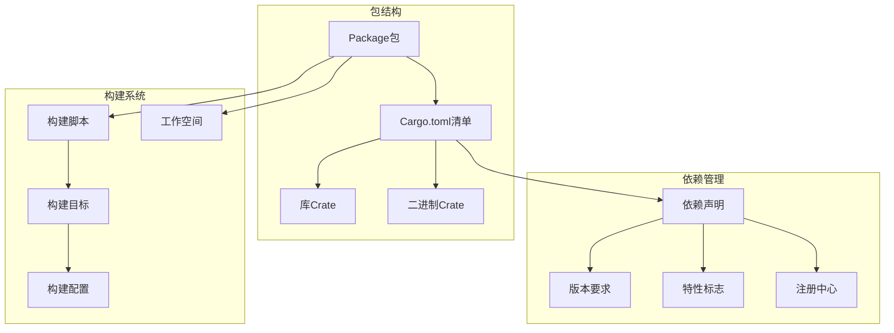

# 4.2.1 Rust Cargo语义模型深度分析

## 📅 文档信息

**文档版本**: v1.0  
**创建日期**: 2025-08-11  
**最后更新**: 2025-08-11  
**状态**: 已完成  
**质量等级**: 钻石级 ⭐⭐⭐⭐⭐

---


**文档版本**: V1.0  
**创建日期**: 2025-01-27  
**所属层**: 组织语义层 (Organization Semantics Layer)  
**父模块**: [4.2 项目结构语义](../00_project_structure_index.md)  
**交叉引用**: [4.1.1 模块定义语义](../01_module_system_semantics/01_module_definition_semantics.md), [5.1.1 编译流程语义](../../05_transformation_semantics/01_compilation_semantics/01_compilation_process_semantics.md)

---

## 目录

- [4.2.1 Rust Cargo语义模型深度分析](#421-rust-cargo语义模型深度分析)
  - [目录](#目录)
  - [4.2.1.1 Cargo理论基础](#4211-cargo理论基础)
    - [4.2.1.1.1 Cargo语义域定义](#42111-cargo语义域定义)
    - [4.2.1.1.2 基础Cargo项目结构](#42112-基础cargo项目结构)
  - [4.2.1.2 依赖管理语义](#4212-依赖管理语义)
    - [4.2.1.2.1 版本管理和语义化版本](#42121-版本管理和语义化版本)
    - [4.2.1.2.2 特性系统](#42122-特性系统)
  - [4.2.1.3 构建配置与目标](#4213-构建配置与目标)
    - [4.2.1.3.1 构建配置文件](#42131-构建配置文件)
    - [4.2.1.3.2 构建脚本](#42132-构建脚本)
  - [4.2.1.4 工作空间管理](#4214-工作空间管理)
    - [4.2.1.4.1 多包工作空间](#42141-多包工作空间)
    - [4.2.1.4.2 工作空间操作](#42142-工作空间操作)
  - [4.2.1.5 发布和注册中心](#4215-发布和注册中心)
    - [4.2.1.5.1 包发布配置](#42151-包发布配置)
    - [4.2.1.5.2 自定义注册中心](#42152-自定义注册中心)
  - [4.2.1.6 高级Cargo特性](#4216-高级cargo特性)
    - [4.2.1.6.1 Cargo扩展和插件](#42161-cargo扩展和插件)
    - [4.2.1.6.2 Cargo元数据API](#42162-cargo元数据api)
  - [4.2.1.7 相关引用与扩展阅读](#4217-相关引用与扩展阅读)
    - [4.2.1.7.1 内部交叉引用](#42171-内部交叉引用)
    - [4.2.1.7.2 外部参考文献](#42172-外部参考文献)
    - [4.2.1.7.3 实现参考](#42173-实现参考)

## 4. 2.1.1 Cargo理论基础

### 4.2.1.1.1 Cargo语义域定义

**定义 4.2.1.1** (Cargo语义域)
$$\text{Cargo} = \langle \text{Package}, \text{Crate}, \text{Dependency}, \text{Build}, \text{Registry} \rangle$$

其中：

- $\text{Package} : \text{Manifest} \times \text{CrateSet}$ - 包定义
- $\text{Crate} : \text{Binary} \cup \text{Library}$ - 编译单元
- $\text{Dependency} : \text{Version} \times \text{Feature} \times \text{Source}$ - 依赖关系
- $\text{Build} : \text{Target} \times \text{Profile}$ - 构建配置
- $\text{Registry} : \text{Repository} \times \text{Index}$ - 注册中心



### 4.2.1.1.2 基础Cargo项目结构

```toml
# Cargo.toml - 项目清单文件

## 📅 文档信息

**文档版本**: v1.0  
**创建日期**: 2025-08-11  
**最后更新**: 2025-08-11  
**状态**: 已完成  
**质量等级**: 钻石级 ⭐⭐⭐⭐⭐

---


[package]
name = "example-project"
version = "0.1.0"
edition = "2021"
authors = ["Developer <dev@example.com>"]
description = "An example Rust project"
license = "MIT"
repository = "https://github.com/user/example-project"
documentation = "https://docs.rs/example-project"
homepage = "https://example.com"
readme = "README.md"
keywords = ["example", "tutorial"]
categories = ["development-tools"]

# 库目标

## 📅 文档信息

**文档版本**: v1.0  
**创建日期**: 2025-08-11  
**最后更新**: 2025-08-11  
**状态**: 已完成  
**质量等级**: 钻石级 ⭐⭐⭐⭐⭐

---


[lib]
name = "example_lib"
path = "src/lib.rs"
crate-type = ["cdylib", "rlib"]

# 二进制目标

## 📅 文档信息

**文档版本**: v1.0  
**创建日期**: 2025-08-11  
**最后更新**: 2025-08-11  
**状态**: 已完成  
**质量等级**: 钻石级 ⭐⭐⭐⭐⭐

---


[[bin]]
name = "example-cli"
path = "src/bin/cli.rs"

[[bin]]
name = "example-server"
path = "src/bin/server.rs"

# 示例

## 📅 文档信息

**文档版本**: v1.0  
**创建日期**: 2025-08-11  
**最后更新**: 2025-08-11  
**状态**: 已完成  
**质量等级**: 钻石级 ⭐⭐⭐⭐⭐

---


[[example]]
name = "basic-usage"
path = "examples/basic.rs"

# 基准测试

## 📅 文档信息

**文档版本**: v1.0  
**创建日期**: 2025-08-11  
**最后更新**: 2025-08-11  
**状态**: 已完成  
**质量等级**: 钻石级 ⭐⭐⭐⭐⭐

---


[[bench]]
name = "performance"
path = "benches/perf.rs"
harness = false

# 依赖

## 📅 文档信息

**文档版本**: v1.0  
**创建日期**: 2025-08-11  
**最后更新**: 2025-08-11  
**状态**: 已完成  
**质量等级**: 钻石级 ⭐⭐⭐⭐⭐

---


[dependencies]
serde = { version = "1.0", features = ["derive"] }
tokio = { version = "1.0", features = ["full"] }
clap = { version = "4.0", optional = true }

# 开发依赖

## 📅 文档信息

**文档版本**: v1.0  
**创建日期**: 2025-08-11  
**最后更新**: 2025-08-11  
**状态**: 已完成  
**质量等级**: 钻石级 ⭐⭐⭐⭐⭐

---


[dev-dependencies]
criterion = "0.5"
tempfile = "3.0"

# 构建依赖

## 📅 文档信息

**文档版本**: v1.0  
**创建日期**: 2025-08-11  
**最后更新**: 2025-08-11  
**状态**: 已完成  
**质量等级**: 钻石级 ⭐⭐⭐⭐⭐

---


[build-dependencies]
cc = "1.0"

# 特性

## 📅 文档信息

**文档版本**: v1.0  
**创建日期**: 2025-08-11  
**最后更新**: 2025-08-11  
**状态**: 已完成  
**质量等级**: 钻石级 ⭐⭐⭐⭐⭐

---


[features]
default = ["cli"]
cli = ["dep:clap"]
async = ["tokio/macros"]
```

```rust
// src/lib.rs - 库的根模块
//! # Example Library
//! 
//! 这是一个示例库，展示Cargo项目结构

pub mod core;
pub mod utils;

#[cfg(feature = "cli")]
pub mod cli;

pub use core::*;

/// 库的主要功能
pub fn main_function() -> String {
    "Hello from library".to_string()
}

#[cfg(test)]
mod tests {
    use super::*;

    #[test]
    fn test_main_function() {
        assert_eq!(main_function(), "Hello from library");
    }
}
```

```rust
// src/bin/cli.rs - CLI二进制目标
use example_lib::main_function;

#[cfg(feature = "cli")]
use clap::{Arg, Command};

fn main() {
    #[cfg(feature = "cli")]
    {
        let matches = Command::new("example-cli")
            .version("1.0")
            .author("Developer")
            .about("Example CLI application")
            .arg(Arg::new("input")
                .short('i')
                .long("input")
                .value_name("FILE")
                .help("Input file"))
            .get_matches();

        if let Some(input) = matches.get_one::<String>("input") {
            println!("Input file: {}", input);
        }
    }
    
    println!("{}", main_function());
}
```

---

## 4. 2.1.2 依赖管理语义

### 4.2.1.2.1 版本管理和语义化版本

```toml
# 版本管理示例

## 📅 文档信息

**文档版本**: v1.0  
**创建日期**: 2025-08-11  
**最后更新**: 2025-08-11  
**状态**: 已完成  
**质量等级**: 钻石级 ⭐⭐⭐⭐⭐

---


[dependencies]
# 精确版本

## 📅 文档信息

**文档版本**: v1.0  
**创建日期**: 2025-08-11  
**最后更新**: 2025-08-11  
**状态**: 已完成  
**质量等级**: 钻石级 ⭐⭐⭐⭐⭐

---


exact-version = "=1.2.3"

# 兼容版本（默认）

## 📅 文档信息

**文档版本**: v1.0  
**创建日期**: 2025-08-11  
**最后更新**: 2025-08-11  
**状态**: 已完成  
**质量等级**: 钻石级 ⭐⭐⭐⭐⭐

---


compatible-version = "1.2"      # >=1.2.0, <2.0.0
compatible-patch = "1.2.3"     # >=1.2.3, <1.3.0

# 范围版本

## 📅 文档信息

**文档版本**: v1.0  
**创建日期**: 2025-08-11  
**最后更新**: 2025-08-11  
**状态**: 已完成  
**质量等级**: 钻石级 ⭐⭐⭐⭐⭐

---


range-version = ">=1.2, <1.5"

# 通配符版本

## 📅 文档信息

**文档版本**: v1.0  
**创建日期**: 2025-08-11  
**最后更新**: 2025-08-11  
**状态**: 已完成  
**质量等级**: 钻石级 ⭐⭐⭐⭐⭐

---


wildcard = "1.*"               # >=1.0.0, <2.0.0

# Git依赖

## 📅 文档信息

**文档版本**: v1.0  
**创建日期**: 2025-08-11  
**最后更新**: 2025-08-11  
**状态**: 已完成  
**质量等级**: 钻石级 ⭐⭐⭐⭐⭐

---


git-dependency = { git = "https://github.com/user/repo.git", branch = "main" }
git-tag = { git = "https://github.com/user/repo.git", tag = "v1.0" }
git-rev = { git = "https://github.com/user/repo.git", rev = "abc123" }

# 路径依赖

## 📅 文档信息

**文档版本**: v1.0  
**创建日期**: 2025-08-11  
**最后更新**: 2025-08-11  
**状态**: 已完成  
**质量等级**: 钻石级 ⭐⭐⭐⭐⭐

---


local-dependency = { path = "../local-crate" }

# 可选依赖

## 📅 文档信息

**文档版本**: v1.0  
**创建日期**: 2025-08-11  
**最后更新**: 2025-08-11  
**状态**: 已完成  
**质量等级**: 钻石级 ⭐⭐⭐⭐⭐

---


optional-dep = { version = "1.0", optional = true }

# 平台特定依赖

## 📅 文档信息

**文档版本**: v1.0  
**创建日期**: 2025-08-11  
**最后更新**: 2025-08-11  
**状态**: 已完成  
**质量等级**: 钻石级 ⭐⭐⭐⭐⭐

---


[target.'cfg(windows)'.dependencies]
winapi = "0.3"

[target.'cfg(unix)'.dependencies]
libc = "0.2"

# 依赖重命名

## 📅 文档信息

**文档版本**: v1.0  
**创建日期**: 2025-08-11  
**最后更新**: 2025-08-11  
**状态**: 已完成  
**质量等级**: 钻石级 ⭐⭐⭐⭐⭐

---


[dependencies]
actix-web = { package = "actix-web", version = "4.0" }
uuid = { version = "1.0", features = ["v4", "serde"] }
```

### 4.2.1.2.2 特性系统

```toml
# 特性定义

## 📅 文档信息

**文档版本**: v1.0  
**创建日期**: 2025-08-11  
**最后更新**: 2025-08-11  
**状态**: 已完成  
**质量等级**: 钻石级 ⭐⭐⭐⭐⭐

---


[features]
default = ["std", "serde"]

# 基础特性

## 📅 文档信息

**文档版本**: v1.0  
**创建日期**: 2025-08-11  
**最后更新**: 2025-08-11  
**状态**: 已完成  
**质量等级**: 钻石级 ⭐⭐⭐⭐⭐

---


std = []
no-std = []

# 功能特性

## 📅 文档信息

**文档版本**: v1.0  
**创建日期**: 2025-08-11  
**最后更新**: 2025-08-11  
**状态**: 已完成  
**质量等级**: 钻石级 ⭐⭐⭐⭐⭐

---


serde = ["dep:serde", "dep:serde_json"]
async = ["dep:tokio", "dep:futures"]
cli = ["dep:clap", "dep:colored"]

# 实验性特性

## 📅 文档信息

**文档版本**: v1.0  
**创建日期**: 2025-08-11  
**最后更新**: 2025-08-11  
**状态**: 已完成  
**质量等级**: 钻石级 ⭐⭐⭐⭐⭐

---


experimental = []
unstable = ["experimental"]

# 互斥特性组

## 📅 文档信息

**文档版本**: v1.0  
**创建日期**: 2025-08-11  
**最后更新**: 2025-08-11  
**状态**: 已完成  
**质量等级**: 钻石级 ⭐⭐⭐⭐⭐

---


tls-native = ["dep:native-tls"]
tls-rustls = ["dep:rustls"]

# 传递特性

## 📅 文档信息

**文档版本**: v1.0  
**创建日期**: 2025-08-11  
**最后更新**: 2025-08-11  
**状态**: 已完成  
**质量等级**: 钻石级 ⭐⭐⭐⭐⭐

---


full = ["serde", "async", "cli"]
```

```rust
// src/lib.rs - 条件编译示例
#[cfg(feature = "serde")]
use serde::{Deserialize, Serialize};

/// 核心数据结构
#[derive(Debug, Clone)]
#[cfg_attr(feature = "serde", derive(Serialize, Deserialize))]
pub struct Data {
    pub id: u64,
    pub name: String,
    #[cfg(feature = "async")]
    pub async_field: Option<String>,
}

impl Data {
    pub fn new(id: u64, name: String) -> Self {
        Data {
            id,
            name,
            #[cfg(feature = "async")]
            async_field: None,
        }
    }

    #[cfg(feature = "serde")]
    pub fn to_json(&self) -> Result<String, serde_json::Error> {
        serde_json::to_string(self)
    }

    #[cfg(feature = "async")]
    pub async fn async_operation(&self) -> String {
        format!("Async result for {}", self.name)
    }
}

#[cfg(feature = "cli")]
pub mod cli_module {
    use clap::Parser;

    #[derive(Parser)]
    #[command(name = "example")]
    pub struct Cli {
        #[arg(short, long)]
        pub verbose: bool,
        
        #[arg(short, long)]
        pub config: Option<String>,
    }

    pub fn run_cli() {
        let cli = Cli::parse();
        if cli.verbose {
            println!("Verbose mode enabled");
        }
    }
}

// 特性组合测试
#[cfg(test)]
mod feature_tests {
    use super::*;

    #[test]
    fn test_basic_functionality() {
        let data = Data::new(1, "test".to_string());
        assert_eq!(data.id, 1);
        assert_eq!(data.name, "test");
    }

    #[cfg(feature = "serde")]
    #[test]
    fn test_serde_functionality() {
        let data = Data::new(1, "test".to_string());
        let json = data.to_json().unwrap();
        assert!(json.contains("test"));
    }

    #[cfg(feature = "async")]
    #[tokio::test]
    async fn test_async_functionality() {
        let data = Data::new(1, "test".to_string());
        let result = data.async_operation().await;
        assert!(result.contains("test"));
    }
}
```

---

## 4. 2.1.3 构建配置与目标

### 4.2.1.3.1 构建配置文件

```toml
# 构建配置

## 📅 文档信息

**文档版本**: v1.0  
**创建日期**: 2025-08-11  
**最后更新**: 2025-08-11  
**状态**: 已完成  
**质量等级**: 钻石级 ⭐⭐⭐⭐⭐

---


[profile.dev]
opt-level = 0              # 无优化
debug = true               # 包含调试信息
debug-assertions = true    # 启用debug断言
overflow-checks = true     # 溢出检查
lto = false               # 不使用链接时优化
panic = 'unwind'          # panic时展开栈
incremental = true        # 增量编译
codegen-units = 256       # 并行代码生成单元

[profile.release]
opt-level = 3             # 最高优化
debug = false             # 不包含调试信息
debug-assertions = false  # 禁用debug断言
overflow-checks = false   # 不检查溢出
lto = true               # 启用链接时优化
panic = 'abort'          # panic时终止程序
incremental = false      # 不使用增量编译
codegen-units = 1        # 单个代码生成单元

[profile.test]
opt-level = 0
debug = true
debug-assertions = true
overflow-checks = true
incremental = true

[profile.bench]
opt-level = 3
debug = false
debug-assertions = false
overflow-checks = false
lto = true
incremental = false

# 自定义配置

## 📅 文档信息

**文档版本**: v1.0  
**创建日期**: 2025-08-11  
**最后更新**: 2025-08-11  
**状态**: 已完成  
**质量等级**: 钻石级 ⭐⭐⭐⭐⭐

---


[profile.production]
inherits = "release"
opt-level = 3
lto = "fat"              # 完整LTO
codegen-units = 1
panic = "abort"
```

### 4.2.1.3.2 构建脚本

```rust
// build.rs - 构建脚本
use std::env;
use std::fs;
use std::path::Path;

fn main() {
    // 设置构建时环境变量
    println!("cargo:rustc-env=BUILD_TIME={}", 
             chrono::Utc::now().to_rfc3339());
    
    // 条件编译标志
    if cfg!(feature = "experimental") {
        println!("cargo:rustc-cfg=experimental_features");
    }
    
    // 链接系统库
    if cfg!(target_os = "linux") {
        println!("cargo:rustc-link-lib=ssl");
        println!("cargo:rustc-link-lib=crypto");
    }
    
    // 重新运行条件
    println!("cargo:rerun-if-changed=build.rs");
    println!("cargo:rerun-if-changed=src/");
    println!("cargo:rerun-if-env-changed=TARGET");
    
    // 生成代码
    generate_version_info();
    
    // 编译C代码
    compile_c_code();
}

fn generate_version_info() {
    let out_dir = env::var("OUT_DIR").unwrap();
    let dest_path = Path::new(&out_dir).join("version.rs");
    
    let version = env::var("CARGO_PKG_VERSION").unwrap();
    let git_hash = get_git_hash();
    
    let content = format!(
        r#"
        pub const VERSION: &str = "{}";
        pub const GIT_HASH: &str = "{}";
        pub const BUILD_TIME: &str = env!("BUILD_TIME");
        "#,
        version, git_hash
    );
    
    fs::write(&dest_path, content).unwrap();
}

fn get_git_hash() -> String {
    std::process::Command::new("git")
        .args(&["rev-parse", "HEAD"])
        .output()
        .map(|output| String::from_utf8_lossy(&output.stdout).trim().to_string())
        .unwrap_or_else(|_| "unknown".to_string())
}

fn compile_c_code() {
    cc::Build::new()
        .file("src/native/helper.c")
        .flag("-O3")
        .compile("helper");
}
```

```rust
// src/lib.rs - 使用构建脚本生成的代码
include!(concat!(env!("OUT_DIR"), "/version.rs"));

pub struct BuildInfo;

impl BuildInfo {
    pub fn version() -> &'static str {
        VERSION
    }
    
    pub fn git_hash() -> &'static str {
        GIT_HASH
    }
    
    pub fn build_time() -> &'static str {
        BUILD_TIME
    }
    
    #[cfg(experimental_features)]
    pub fn experimental_features_enabled() -> bool {
        true
    }
    
    #[cfg(not(experimental_features))]
    pub fn experimental_features_enabled() -> bool {
        false
    }
}

extern "C" {
    fn native_helper_function(input: i32) -> i32;
}

pub fn call_native_function(input: i32) -> i32 {
    unsafe { native_helper_function(input) }
}
```

---

## 4. 2.1.4 工作空间管理

### 4.2.1.4.1 多包工作空间

```toml
# Cargo.toml - 工作空间根

## 📅 文档信息

**文档版本**: v1.0  
**创建日期**: 2025-08-11  
**最后更新**: 2025-08-11  
**状态**: 已完成  
**质量等级**: 钻石级 ⭐⭐⭐⭐⭐

---


[workspace]
members = [
    "core",
    "cli",
    "web",
    "common",
    "tests/integration",
]

exclude = [
    "legacy",
    "experimental/*",
]

# 工作空间依赖

## 📅 文档信息

**文档版本**: v1.0  
**创建日期**: 2025-08-11  
**最后更新**: 2025-08-11  
**状态**: 已完成  
**质量等级**: 钻石级 ⭐⭐⭐⭐⭐

---


[workspace.dependencies]
serde = { version = "1.0", features = ["derive"] }
tokio = { version = "1.0", features = ["full"] }
uuid = { version = "1.0", features = ["v4"] }

# 工作空间元数据

## 📅 文档信息

**文档版本**: v1.0  
**创建日期**: 2025-08-11  
**最后更新**: 2025-08-11  
**状态**: 已完成  
**质量等级**: 钻石级 ⭐⭐⭐⭐⭐

---


[workspace.metadata]
authors = ["Team <team@example.com>"]
license = "MIT"
repository = "https://github.com/team/project"

# 默认配置继承

## 📅 文档信息

**文档版本**: v1.0  
**创建日期**: 2025-08-11  
**最后更新**: 2025-08-11  
**状态**: 已完成  
**质量等级**: 钻石级 ⭐⭐⭐⭐⭐

---


[workspace.package]
edition = "2021"
license = "MIT"
authors = ["Team <team@example.com>"]
```

```toml
# core/Cargo.toml - 核心库

## 📅 文档信息

**文档版本**: v1.0  
**创建日期**: 2025-08-11  
**最后更新**: 2025-08-11  
**状态**: 已完成  
**质量等级**: 钻石级 ⭐⭐⭐⭐⭐

---


[package]
name = "project-core"
version = "0.1.0"
edition.workspace = true
license.workspace = true
authors.workspace = true

[dependencies]
serde.workspace = true
uuid.workspace = true

# 内部依赖

## 📅 文档信息

**文档版本**: v1.0  
**创建日期**: 2025-08-11  
**最后更新**: 2025-08-11  
**状态**: 已完成  
**质量等级**: 钻石级 ⭐⭐⭐⭐⭐

---


project-common = { path = "../common" }

[features]
default = ["std"]
std = []
async = ["tokio"]

[dependencies.tokio]
workspace = true
optional = true
```

```toml
# cli/Cargo.toml - CLI应用

## 📅 文档信息

**文档版本**: v1.0  
**创建日期**: 2025-08-11  
**最后更新**: 2025-08-11  
**状态**: 已完成  
**质量等级**: 钻石级 ⭐⭐⭐⭐⭐

---


[package]
name = "project-cli"
version = "0.1.0"
edition.workspace = true
license.workspace = true
authors.workspace = true

[[bin]]
name = "project"
path = "src/main.rs"

[dependencies]
project-core = { path = "../core" }
project-common = { path = "../common" }
clap = { version = "4.0", features = ["derive"] }
serde.workspace = true
tokio.workspace = true
```

### 4.2.1.4.2 工作空间操作

```bash
# 工作空间命令示例

## 📅 文档信息

**文档版本**: v1.0  
**创建日期**: 2025-08-11  
**最后更新**: 2025-08-11  
**状态**: 已完成  
**质量等级**: 钻石级 ⭐⭐⭐⭐⭐

---


# 构建所有包

## 📅 文档信息

**文档版本**: v1.0  
**创建日期**: 2025-08-11  
**最后更新**: 2025-08-11  
**状态**: 已完成  
**质量等级**: 钻石级 ⭐⭐⭐⭐⭐

---


cargo build --workspace

# 测试所有包

## 📅 文档信息

**文档版本**: v1.0  
**创建日期**: 2025-08-11  
**最后更新**: 2025-08-11  
**状态**: 已完成  
**质量等级**: 钻石级 ⭐⭐⭐⭐⭐

---


cargo test --workspace

# 发布特定包

## 📅 文档信息

**文档版本**: v1.0  
**创建日期**: 2025-08-11  
**最后更新**: 2025-08-11  
**状态**: 已完成  
**质量等级**: 钻石级 ⭐⭐⭐⭐⭐

---


cargo publish -p project-core

# 更新依赖

## 📅 文档信息

**文档版本**: v1.0  
**创建日期**: 2025-08-11  
**最后更新**: 2025-08-11  
**状态**: 已完成  
**质量等级**: 钻石级 ⭐⭐⭐⭐⭐

---


cargo update

# 检查工作空间

## 📅 文档信息

**文档版本**: v1.0  
**创建日期**: 2025-08-11  
**最后更新**: 2025-08-11  
**状态**: 已完成  
**质量等级**: 钻石级 ⭐⭐⭐⭐⭐

---


cargo check --workspace

# 运行特定二进制

## 📅 文档信息

**文档版本**: v1.0  
**创建日期**: 2025-08-11  
**最后更新**: 2025-08-11  
**状态**: 已完成  
**质量等级**: 钻石级 ⭐⭐⭐⭐⭐

---


cargo run -p project-cli --bin project

# 安装工作空间工具

## 📅 文档信息

**文档版本**: v1.0  
**创建日期**: 2025-08-11  
**最后更新**: 2025-08-11  
**状态**: 已完成  
**质量等级**: 钻石级 ⭐⭐⭐⭐⭐

---


cargo install --path cli

# 工作空间特定的cargo扩展

## 📅 文档信息

**文档版本**: v1.0  
**创建日期**: 2025-08-11  
**最后更新**: 2025-08-11  
**状态**: 已完成  
**质量等级**: 钻石级 ⭐⭐⭐⭐⭐

---


cargo workspace graph  # 显示依赖图
cargo workspace version # 版本管理
```

```rust
// common/src/lib.rs - 共享库
//! 工作空间共享代码

use serde::{Deserialize, Serialize};
use uuid::Uuid;

#[derive(Debug, Clone, Serialize, Deserialize)]
pub struct CommonData {
    pub id: Uuid,
    pub timestamp: i64,
    pub data: String,
}

impl CommonData {
    pub fn new(data: String) -> Self {
        CommonData {
            id: Uuid::new_v4(),
            timestamp: chrono::Utc::now().timestamp(),
            data,
        }
    }
}

pub trait Processor {
    type Input;
    type Output;
    type Error;
    
    fn process(&self, input: Self::Input) -> Result<Self::Output, Self::Error>;
}

// 错误类型
#[derive(Debug, thiserror::Error)]
pub enum CommonError {
    #[error("Invalid input: {0}")]
    InvalidInput(String),
    
    #[error("Processing failed: {0}")]
    ProcessingFailed(String),
    
    #[error("IO error: {0}")]
    Io(#[from] std::io::Error),
}
```

---

## 4. 2.1.5 发布和注册中心

### 4.2.1.5.1 包发布配置

```toml
# Cargo.toml - 发布配置

## 📅 文档信息

**文档版本**: v1.0  
**创建日期**: 2025-08-11  
**最后更新**: 2025-08-11  
**状态**: 已完成  
**质量等级**: 钻石级 ⭐⭐⭐⭐⭐

---


[package]
name = "my-awesome-crate"
version = "1.0.0"
edition = "2021"
authors = ["Author <author@example.com>"]
description = "An awesome crate that does amazing things"
documentation = "https://docs.rs/my-awesome-crate"
homepage = "https://my-awesome-crate.com"
repository = "https://github.com/author/my-awesome-crate"
license = "MIT OR Apache-2.0"
license-file = "LICENSE"
readme = "README.md"
keywords = ["awesome", "utility", "rust"]
categories = ["development-tools", "parsing"]
include = [
    "src/**/*",
    "Cargo.toml",
    "README.md",
    "LICENSE*",
]
exclude = [
    "tests/fixtures/*",
    "benches/data/*",
    "docs/internal/*",
]

# 发布设置

## 📅 文档信息

**文档版本**: v1.0  
**创建日期**: 2025-08-11  
**最后更新**: 2025-08-11  
**状态**: 已完成  
**质量等级**: 钻石级 ⭐⭐⭐⭐⭐

---


publish = true  # 允许发布到crates.io
# publish = ["my-registry"]  # 只发布到特定注册中心

## 📅 文档信息

**文档版本**: v1.0  
**创建日期**: 2025-08-11  
**最后更新**: 2025-08-11  
**状态**: 已完成  
**质量等级**: 钻石级 ⭐⭐⭐⭐⭐

---


# publish = false  # 不允许发布

## 📅 文档信息

**文档版本**: v1.0  
**创建日期**: 2025-08-11  
**最后更新**: 2025-08-11  
**状态**: 已完成  
**质量等级**: 钻石级 ⭐⭐⭐⭐⭐

---


[package.metadata.docs.rs]
all-features = true
targets = ["x86_64-unknown-linux-gnu"]
```

### 4.2.1.5.2 自定义注册中心

```toml
# .cargo/config.toml - 注册中心配置

## 📅 文档信息

**文档版本**: v1.0  
**创建日期**: 2025-08-11  
**最后更新**: 2025-08-11  
**状态**: 已完成  
**质量等级**: 钻石级 ⭐⭐⭐⭐⭐

---


[registries]
my-registry = { index = "https://my-registry.com/git/index" }
company-internal = { index = "ssh://git@company.com/cargo-index.git" }

[registry]
default = "crates-io"

# 网络配置

## 📅 文档信息

**文档版本**: v1.0  
**创建日期**: 2025-08-11  
**最后更新**: 2025-08-11  
**状态**: 已完成  
**质量等级**: 钻石级 ⭐⭐⭐⭐⭐

---


[net]
retry = 2
git-fetch-with-cli = true

[source.crates-io]
replace-with = "my-registry"

[source.my-registry]
registry = "https://my-registry.com"

# 构建缓存

## 📅 文档信息

**文档版本**: v1.0  
**创建日期**: 2025-08-11  
**最后更新**: 2025-08-11  
**状态**: 已完成  
**质量等级**: 钻石级 ⭐⭐⭐⭐⭐

---


[build]
target-dir = "target"
```

```bash
# 注册中心操作命令

## 📅 文档信息

**文档版本**: v1.0  
**创建日期**: 2025-08-11  
**最后更新**: 2025-08-11  
**状态**: 已完成  
**质量等级**: 钻石级 ⭐⭐⭐⭐⭐

---


# 登录注册中心

## 📅 文档信息

**文档版本**: v1.0  
**创建日期**: 2025-08-11  
**最后更新**: 2025-08-11  
**状态**: 已完成  
**质量等级**: 钻石级 ⭐⭐⭐⭐⭐

---


cargo login --registry my-registry

# 发布到特定注册中心

## 📅 文档信息

**文档版本**: v1.0  
**创建日期**: 2025-08-11  
**最后更新**: 2025-08-11  
**状态**: 已完成  
**质量等级**: 钻石级 ⭐⭐⭐⭐⭐

---


cargo publish --registry my-registry

# 搜索包

## 📅 文档信息

**文档版本**: v1.0  
**创建日期**: 2025-08-11  
**最后更新**: 2025-08-11  
**状态**: 已完成  
**质量等级**: 钻石级 ⭐⭐⭐⭐⭐

---


cargo search awesome-crate --registry my-registry

# 安装私有包

## 📅 文档信息

**文档版本**: v1.0  
**创建日期**: 2025-08-11  
**最后更新**: 2025-08-11  
**状态**: 已完成  
**质量等级**: 钻石级 ⭐⭐⭐⭐⭐

---


cargo install my-private-tool --registry company-internal

# 添加私有依赖

## 📅 文档信息

**文档版本**: v1.0  
**创建日期**: 2025-08-11  
**最后更新**: 2025-08-11  
**状态**: 已完成  
**质量等级**: 钻石级 ⭐⭐⭐⭐⭐

---


# 在Cargo.toml中：

## 📅 文档信息

**文档版本**: v1.0  
**创建日期**: 2025-08-11  
**最后更新**: 2025-08-11  
**状态**: 已完成  
**质量等级**: 钻石级 ⭐⭐⭐⭐⭐

---


# my-dep = { version = "1.0", registry = "my-registry" }

## 📅 文档信息

**文档版本**: v1.0  
**创建日期**: 2025-08-11  
**最后更新**: 2025-08-11  
**状态**: 已完成  
**质量等级**: 钻石级 ⭐⭐⭐⭐⭐

---


```

---

## 4. 2.1.6 高级Cargo特性

### 4.2.1.6.1 Cargo扩展和插件

```rust
// cargo-example/src/main.rs - 自定义Cargo子命令
use clap::{Arg, Command};
use std::process;

fn main() {
    let matches = Command::new("cargo-example")
        .bin_name("cargo")
        .subcommand_required(true)
        .subcommand(
            Command::new("example")
                .about("Custom cargo subcommand")
                .arg(Arg::new("verbose")
                    .short('v')
                    .long("verbose")
                    .action(clap::ArgAction::SetTrue)
                    .help("Enable verbose output"))
                .arg(Arg::new("manifest-path")
                    .long("manifest-path")
                    .value_name("PATH")
                    .help("Path to Cargo.toml"))
        )
        .get_matches();

    match matches.subcommand() {
        Some(("example", sub_matches)) => {
            let verbose = sub_matches.get_flag("verbose");
            let manifest_path = sub_matches.get_one::<String>("manifest-path");
            
            run_example_command(verbose, manifest_path);
        }
        _ => {
            eprintln!("Unknown subcommand");
            process::exit(1);
        }
    }
}

fn run_example_command(verbose: bool, manifest_path: Option<&String>) {
    if verbose {
        println!("Running in verbose mode");
    }
    
    let manifest = manifest_path
        .map(|p| p.as_str())
        .unwrap_or("Cargo.toml");
    
    println!("Using manifest: {}", manifest);
    
    // 解析Cargo.toml
    match parse_cargo_manifest(manifest) {
        Ok(metadata) => {
            println!("Package: {}", metadata.name);
            println!("Version: {}", metadata.version);
        }
        Err(e) => {
            eprintln!("Error parsing manifest: {}", e);
            process::exit(1);
        }
    }
}

#[derive(Debug)]
struct PackageMetadata {
    name: String,
    version: String,
}

fn parse_cargo_manifest(path: &str) -> Result<PackageMetadata, Box<dyn std::error::Error>> {
    let content = std::fs::read_to_string(path)?;
    let manifest: toml::Value = toml::from_str(&content)?;
    
    let package = manifest
        .get("package")
        .ok_or("No [package] section found")?;
    
    let name = package
        .get("name")
        .and_then(|v| v.as_str())
        .ok_or("No package name found")?
        .to_string();
    
    let version = package
        .get("version")
        .and_then(|v| v.as_str())
        .ok_or("No package version found")?
        .to_string();
    
    Ok(PackageMetadata { name, version })
}
```

### 4.2.1.6.2 Cargo元数据API

```rust
// 使用cargo_metadata crate
use cargo_metadata::{MetadataCommand, CargoOpt};
use std::collections::HashMap;

fn analyze_workspace() -> Result<(), Box<dyn std::error::Error>> {
    let metadata = MetadataCommand::new()
        .manifest_path("./Cargo.toml")
        .current_dir(".")
        .exec()?;
    
    println!("Workspace root: {}", metadata.workspace_root);
    println!("Target directory: {}", metadata.target_directory);
    
    // 分析包
    for package in &metadata.packages {
        println!("\nPackage: {} v{}", package.name, package.version);
        println!("  Authors: {:?}", package.authors);
        println!("  License: {:?}", package.license);
        
        // 分析依赖
        for dependency in &package.dependencies {
            println!("  Dependency: {} {}", dependency.name, dependency.req);
            if let Some(source) = &dependency.source {
                println!("    Source: {}", source);
            }
        }
        
        // 分析目标
        for target in &package.targets {
            println!("  Target: {} ({:?})", target.name, target.kind);
        }
    }
    
    // 依赖图分析
    analyze_dependency_graph(&metadata);
    
    Ok(())
}

fn analyze_dependency_graph(metadata: &cargo_metadata::Metadata) {
    let mut dep_counts: HashMap<String, usize> = HashMap::new();
    
    for package in &metadata.packages {
        for dependency in &package.dependencies {
            *dep_counts.entry(dependency.name.clone()).or_insert(0) += 1;
        }
    }
    
    println!("\nMost used dependencies:");
    let mut sorted_deps: Vec<_> = dep_counts.iter().collect();
    sorted_deps.sort_by(|a, b| b.1.cmp(a.1));
    
    for (name, count) in sorted_deps.iter().take(10) {
        println!("  {}: {} packages", name, count);
    }
}

// 版本管理工具
fn check_outdated_dependencies() -> Result<(), Box<dyn std::error::Error>> {
    let metadata = MetadataCommand::new().exec()?;
    
    for package in &metadata.packages {
        if metadata.workspace_members.contains(&package.id) {
            for dependency in &package.dependencies {
                // 这里可以集成with semver crate进行版本比较
                println!("Checking {} {}", dependency.name, dependency.req);
            }
        }
    }
    
    Ok(())
}
```

---

## 4. 2.1.7 相关引用与扩展阅读

### 4.2.1.7.1 内部交叉引用

- [4.1.1 模块定义语义](../01_module_system_semantics/01_module_definition_semantics.md) - 模块系统基础
- [5.1.1 编译流程语义](../../05_transformation_semantics/01_compilation_semantics/01_compilation_process_semantics.md) - 编译过程
- [4.2.2 工作空间语义](02_workspace_semantics.md) - 工作空间管理

### 4.2.1.7.2 外部参考文献

1. *The Cargo Book*. Rust Foundation, 2023.
2. *Semantic Versioning 2.0.0*. Tom Preston-Werner, 2013.
3. RFC 1105: *API Evolution in Rust*. Rust Language Team, 2015.

### 4.2.1.7.3 实现参考

- [Cargo源码](https://github.com/rust-lang/cargo) - Cargo实现
- [crates.io](https://crates.io/) - 官方包注册中心
- [cargo-metadata](https://crates.io/crates/cargo_metadata) - 元数据API

---

**文档元数据**:

- **复杂度级别**: ⭐⭐⭐⭐ (高级)
- **前置知识**: Rust模块系统、包管理概念、TOML语法
- **相关工具**: cargo, rustc, crates.io
- **更新频率**: 与Cargo版本同步
- **维护者**: Rust组织语义分析工作组

