# 4.3.1 Rust架构模式语义模型深度分析

## 📅 文档信息

**文档版本**: v1.0  
**创建日期**: 2025-08-11  
**最后更新**: 2025-08-11  
**状态**: 已完成  
**质量等级**: 钻石级 ⭐⭐⭐⭐⭐

---


**文档版本**: V1.0  
**创建日期**: 2025-01-27  
**所属层**: 组织语义层 (Organization Semantics Layer)  
**父模块**: [4.3 代码组织语义](../00_code_organization_index.md)  
**交叉引用**: [4.1.1 模块定义语义](../../01_module_system_semantics/01_module_definition_semantics.md), [1.3.1 trait系统语义](../../01_foundation_semantics/01_type_system_semantics/06_trait_semantics.md)

---

## 目录

- [4.3.1 Rust架构模式语义模型深度分析](#431-rust架构模式语义模型深度分析)
  - [目录](#目录)
  - [4.3.1.1 架构模式理论基础](#4311-架构模式理论基础)
    - [4.3.1.1.1 架构模式的分类体系](#43111-架构模式的分类体系)
    - [4.3.1.1.2 架构质量度量](#43112-架构质量度量)
  - [4.3.1.2 分层架构模式](#4312-分层架构模式)
    - [4.3.1.2.1 经典分层架构](#43121-经典分层架构)
    - [4.3.1.2.2 分层架构的依赖注入](#43122-分层架构的依赖注入)
  - [4.3.1.3 微服务架构模式](#4313-微服务架构模式)
    - [4.3.1.3.1 服务边界定义](#43131-服务边界定义)
    - [4.3.1.3.2 服务发现模式](#43132-服务发现模式)
  - [4.3.1.4 插件架构模式](#4314-插件架构模式)
    - [4.3.1.4.1 插件接口定义](#43141-插件接口定义)
    - [4.3.1.4.2 动态插件加载](#43142-动态插件加载)
  - [4.3.1.5 事件驱动架构模式](#4315-事件驱动架构模式)
    - [4.3.1.5.1 事件总线实现](#43151-事件总线实现)
    - [4.3.1.5.2 事件溯源模式](#43152-事件溯源模式)
  - [4.3.1.6 跨引用网络](#4316-跨引用网络)
    - [4.3.1.6.1 内部引用](#43161-内部引用)
    - [4.3.1.6.2 外部引用](#43162-外部引用)
  - [4.3.1.7 批判性分析](#4317-批判性分析)
    - [4.3.1.7.1 架构模式优势与局限](#43171-架构模式优势与局限)
    - [4.3.1.7.2 Rust特定考量](#43172-rust特定考量)
  - [4.3.1.8 规范化进度与后续建议](#4318-规范化进度与后续建议)
    - [4.3.1.8.1 当前完成度](#43181-当前完成度)
    - [4.3.1.8.2 后续扩展建议](#43182-后续扩展建议)

## 4. 3.1.1 架构模式理论基础

### 4.3.1.1.1 架构模式的分类体系

**定义 4.3.1.1** (架构模式空间)
Rust架构模式可建模为三维空间：
$$\text{Pattern} = \langle \text{Structure}, \text{Behavior}, \text{Ownership} \rangle$$

其中：

- $\text{Structure}$ - 组件组织方式
- $\text{Behavior}$ - 控制流模式  
- $\text{Ownership}$ - 所有权分布策略

```mermaid
graph TB
    subgraph "架构模式分类"
        Structural[结构性模式]
        Behavioral[行为性模式]
        Ownership[所有权模式]
        Concurrent[并发模式]
    end
    
    subgraph "结构性模式"
        Layered[分层架构]
        Modular[模块化架构]
        Plugin[插件架构]
        Microkernel[微核架构]
    end
    
    subgraph "行为性模式"
        EventDriven[事件驱动]
        Pipeline[管道模式]
        Actor[Actor模式]
        CQRS[CQRS模式]
    end
    
    subgraph "所有权模式"
        Owned[所有权传递]
        Borrowed[借用共享]
        RefCounted[引用计数]
        Arena[竞技场分配]
    end
    
    Structural --> Layered
    Structural --> Modular
    Structural --> Plugin
    Structural --> Microkernel
    
    Behavioral --> EventDriven
    Behavioral --> Pipeline
    Behavioral --> Actor
    Behavioral --> CQRS
    
    Ownership --> Owned
    Ownership --> Borrowed
    Ownership --> RefCounted
    Ownership --> Arena
```



### 4.3.1.1.2 架构质量度量

**定义 4.3.1.2** (架构质量函数)
架构质量可通过多维度函数评估：
$$Q(A) = \alpha \cdot \text{Cohesion}(A) + \beta \cdot \text{Coupling}^{-1}(A) + \gamma \cdot \text{Maintainability}(A)$$

其中 $\alpha, \beta, \gamma$ 是权重系数。

---

## 4. 3.1.2 分层架构模式

### 4.3.1.2.1 经典分层架构

**定义 4.3.1.3** (分层架构语义)
分层架构是一个偏序关系 $(L, \prec)$，其中 $L$ 是层集合，$\prec$ 是依赖关系：
$$\text{layer}_i \prec \text{layer}_j \Rightarrow i \text{ 可以依赖 } j \text{ 但 } j \text{ 不能依赖 } i$$

```rust
// 典型的Web应用分层架构
pub mod web_app {
    // 表示层 (Presentation Layer)
    pub mod presentation {
        use crate::application::UserService;
        use crate::domain::User;
        
        pub struct UserController {
            user_service: UserService,
        }
        
        impl UserController {
            pub fn new(user_service: UserService) -> Self {
                Self { user_service }
            }
            
            pub async fn get_user(&self, id: u64) -> Result<UserResponse, ControllerError> {
                let user = self.user_service.get_user(id).await?;
                Ok(UserResponse::from(user))
            }
            
            pub async fn create_user(&self, request: CreateUserRequest) -> Result<UserResponse, ControllerError> {
                let user = self.user_service.create_user(request.into()).await?;
                Ok(UserResponse::from(user))
            }
        }
        
        #[derive(serde::Serialize)]
        pub struct UserResponse {
            pub id: u64,
            pub name: String,
            pub email: String,
        }
        
        #[derive(serde::Deserialize)]
        pub struct CreateUserRequest {
            pub name: String,
            pub email: String,
        }
    }
    
    // 应用层 (Application Layer)
    pub mod application {
        use crate::domain::{User, UserRepository, EmailService};
        use crate::infrastructure::DatabaseError;
        
        pub struct UserService {
            repository: Box<dyn UserRepository>,
            email_service: Box<dyn EmailService>,
        }
        
        impl UserService {
            pub fn new(
                repository: Box<dyn UserRepository>,
                email_service: Box<dyn EmailService>,
            ) -> Self {
                Self { repository, email_service }
            }
            
            pub async fn create_user(&self, command: CreateUserCommand) -> Result<User, ServiceError> {
                // 业务逻辑：验证用户数据
                self.validate_user_data(&command)?;
                
                // 创建用户
                let user = User::new(command.name, command.email)?;
                
                // 保存用户
                let saved_user = self.repository.save(user).await?;
                
                // 发送欢迎邮件
                self.email_service.send_welcome_email(&saved_user).await?;
                
                Ok(saved_user)
            }
            
            pub async fn get_user(&self, id: u64) -> Result<User, ServiceError> {
                self.repository.find_by_id(id).await
                    .ok_or(ServiceError::UserNotFound(id))
            }
            
            fn validate_user_data(&self, command: &CreateUserCommand) -> Result<(), ServiceError> {
                if command.name.is_empty() {
                    return Err(ServiceError::InvalidInput("Name cannot be empty".to_string()));
                }
                
                if !command.email.contains('@') {
                    return Err(ServiceError::InvalidInput("Invalid email format".to_string()));
                }
                
                Ok(())
            }
        }
        
        pub struct CreateUserCommand {
            pub name: String,
            pub email: String,
        }
    }
    
    // 领域层 (Domain Layer)
    pub mod domain {
        use std::collections::HashMap;
        
        #[derive(Debug, Clone)]
        pub struct User {
            id: Option<u64>,
            name: String,
            email: String,
            metadata: HashMap<String, String>,
        }
        
        impl User {
            pub fn new(name: String, email: String) -> Result<Self, DomainError> {
                if name.is_empty() {
                    return Err(DomainError::InvalidName);
                }
                
                if !Self::is_valid_email(&email) {
                    return Err(DomainError::InvalidEmail);
                }
                
                Ok(User {
                    id: None,
                    name,
                    email,
                    metadata: HashMap::new(),
                })
            }
            
            pub fn set_id(&mut self, id: u64) {
                self.id = Some(id);
            }
            
            pub fn id(&self) -> Option<u64> {
                self.id
            }
            
            pub fn name(&self) -> &str {
                &self.name
            }
            
            pub fn email(&self) -> &str {
                &self.email
            }
            
            fn is_valid_email(email: &str) -> bool {
                email.contains('@') && email.contains('.')
            }
        }
        
        // 领域服务接口
        #[async_trait::async_trait]
        pub trait UserRepository: Send + Sync {
            async fn save(&self, user: User) -> Result<User, RepositoryError>;
            async fn find_by_id(&self, id: u64) -> Option<User>;
            async fn find_by_email(&self, email: &str) -> Option<User>;
        }
        
        #[async_trait::async_trait]
        pub trait EmailService: Send + Sync {
            async fn send_welcome_email(&self, user: &User) -> Result<(), EmailError>;
        }
    }
    
    // 基础设施层 (Infrastructure Layer)
    pub mod infrastructure {
        use crate::domain::{User, UserRepository, EmailService};
        use std::collections::HashMap;
        use std::sync::Arc;
        use tokio::sync::RwLock;
        
        // 数据库实现
        pub struct PostgresUserRepository {
            connection: Arc<RwLock<HashMap<u64, User>>>, // 简化示例
        }
        
        impl PostgresUserRepository {
            pub fn new() -> Self {
                Self {
                    connection: Arc::new(RwLock::new(HashMap::new())),
                }
            }
        }
        
        #[async_trait::async_trait]
        impl UserRepository for PostgresUserRepository {
            async fn save(&self, mut user: User) -> Result<User, RepositoryError> {
                let mut store = self.connection.write().await;
                let id = store.len() as u64 + 1;
                user.set_id(id);
                store.insert(id, user.clone());
                Ok(user)
            }
            
            async fn find_by_id(&self, id: u64) -> Option<User> {
                let store = self.connection.read().await;
                store.get(&id).cloned()
            }
            
            async fn find_by_email(&self, email: &str) -> Option<User> {
                let store = self.connection.read().await;
                store.values().find(|user| user.email() == email).cloned()
            }
        }
        
        // 邮件服务实现
        pub struct SmtpEmailService {
            smtp_config: SmtpConfig,
        }
        
        #[async_trait::async_trait]
        impl EmailService for SmtpEmailService {
            async fn send_welcome_email(&self, user: &User) -> Result<(), EmailError> {
                // 实际的SMTP发送逻辑
                println!("Sending welcome email to {}", user.email());
                Ok(())
            }
        }
    }
}
```

### 4.3.1.2.2 分层架构的依赖注入

```rust
// 依赖注入容器
pub mod dependency_injection {
    use std::collections::HashMap;
    use std::any::{Any, TypeId};
    use std::sync::Arc;
    
    pub struct Container {
        services: HashMap<TypeId, Box<dyn Any + Send + Sync>>,
    }
    
    impl Container {
        pub fn new() -> Self {
            Self {
                services: HashMap::new(),
            }
        }
        
        pub fn register<T: 'static + Send + Sync>(&mut self, service: T) {
            self.services.insert(TypeId::of::<T>(), Box::new(Arc::new(service)));
        }
        
        pub fn resolve<T: 'static + Send + Sync + Clone>(&self) -> Option<T> {
            self.services
                .get(&TypeId::of::<T>())
                .and_then(|service| service.downcast_ref::<Arc<T>>())
                .map(|arc| (**arc).clone())
        }
    }
    
    // 服务注册宏
    macro_rules! register_services {
        ($container:expr, $($service:expr),*) => {
            $(
                $container.register($service);
            )*
        };
    }
}
```

---

## 4. 3.1.3 微服务架构模式

### 4.3.1.3.1 服务边界定义

```rust
pub mod microservices {
    // 用户服务边界
    pub mod user_service {
        use serde::{Deserialize, Serialize};
        
        #[derive(Debug, Serialize, Deserialize)]
        pub struct User {
            pub id: String,
            pub name: String,
            pub email: String,
        }
        
        #[derive(Debug, Serialize, Deserialize)]
        pub struct CreateUserRequest {
            pub name: String,
            pub email: String,
        }
        
        #[async_trait::async_trait]
        pub trait UserService: Send + Sync {
            async fn create_user(&self, request: CreateUserRequest) -> Result<User, ServiceError>;
            async fn get_user(&self, id: &str) -> Result<Option<User>, ServiceError>;
            async fn update_user(&self, id: &str, user: User) -> Result<User, ServiceError>;
            async fn delete_user(&self, id: &str) -> Result<(), ServiceError>;
        }
    }
    
    // 订单服务边界
    pub mod order_service {
        use serde::{Deserialize, Serialize};
        
        #[derive(Debug, Serialize, Deserialize)]
        pub struct Order {
            pub id: String,
            pub user_id: String,
            pub items: Vec<OrderItem>,
            pub total: f64,
            pub status: OrderStatus,
        }
        
        #[derive(Debug, Serialize, Deserialize)]
        pub struct OrderItem {
            pub product_id: String,
            pub quantity: u32,
            pub price: f64,
        }
        
        #[derive(Debug, Serialize, Deserialize)]
        pub enum OrderStatus {
            Pending,
            Confirmed,
            Shipped,
            Delivered,
            Cancelled,
        }
        
        #[async_trait::async_trait]
        pub trait OrderService: Send + Sync {
            async fn create_order(&self, user_id: &str, items: Vec<OrderItem>) -> Result<Order, ServiceError>;
            async fn get_order(&self, id: &str) -> Result<Option<Order>, ServiceError>;
            async fn update_order_status(&self, id: &str, status: OrderStatus) -> Result<Order, ServiceError>;
        }
    }
    
    // 服务间通信
    pub mod inter_service_communication {
        use super::{user_service::User, order_service::Order};
        use serde::{Deserialize, Serialize};
        
        // 事件驱动通信
        #[derive(Debug, Serialize, Deserialize)]
        pub enum DomainEvent {
            UserCreated { user_id: String, user: User },
            UserUpdated { user_id: String, user: User },
            UserDeleted { user_id: String },
            OrderCreated { order_id: String, order: Order },
            OrderStatusChanged { order_id: String, status: OrderStatus },
        }
        
        #[async_trait::async_trait]
        pub trait EventBus: Send + Sync {
            async fn publish(&self, event: DomainEvent) -> Result<(), EventError>;
            async fn subscribe<F>(&self, handler: F) -> Result<(), EventError>
            where
                F: Fn(DomainEvent) -> BoxFuture<'static, Result<(), EventError>> + Send + Sync + 'static;
        }
        
        // HTTP客户端通信
        pub struct HttpServiceClient {
            base_url: String,
            client: reqwest::Client,
        }
        
        impl HttpServiceClient {
            pub fn new(base_url: String) -> Self {
                Self {
                    base_url,
                    client: reqwest::Client::new(),
                }
            }
            
            pub async fn get_user(&self, user_id: &str) -> Result<Option<User>, ClientError> {
                let url = format!("{}/users/{}", self.base_url, user_id);
                let response = self.client.get(&url).send().await?;
                
                if response.status().is_success() {
                    let user = response.json::<User>().await?;
                    Ok(Some(user))
                } else if response.status() == 404 {
                    Ok(None)
                } else {
                    Err(ClientError::HttpError(response.status().as_u16()))
                }
            }
        }
    }
}
```

### 4.3.1.3.2 服务发现模式

```rust
pub mod service_discovery {
    use std::collections::HashMap;
    use std::sync::Arc;
    use tokio::sync::RwLock;
    
    #[derive(Debug, Clone)]
    pub struct ServiceInstance {
        pub id: String,
        pub name: String,
        pub host: String,
        pub port: u16,
        pub health_check_url: String,
        pub metadata: HashMap<String, String>,
    }
    
    #[async_trait::async_trait]
    pub trait ServiceRegistry: Send + Sync {
        async fn register(&self, instance: ServiceInstance) -> Result<(), RegistryError>;
        async fn deregister(&self, service_name: &str, instance_id: &str) -> Result<(), RegistryError>;
        async fn discover(&self, service_name: &str) -> Result<Vec<ServiceInstance>, RegistryError>;
        async fn health_check(&self) -> Result<(), RegistryError>;
    }
    
    pub struct InMemoryServiceRegistry {
        services: Arc<RwLock<HashMap<String, Vec<ServiceInstance>>>>,
    }
    
    impl InMemoryServiceRegistry {
        pub fn new() -> Self {
            Self {
                services: Arc::new(RwLock::new(HashMap::new())),
            }
        }
    }
    
    #[async_trait::async_trait]
    impl ServiceRegistry for InMemoryServiceRegistry {
        async fn register(&self, instance: ServiceInstance) -> Result<(), RegistryError> {
            let mut services = self.services.write().await;
            services.entry(instance.name.clone())
                .or_insert_with(Vec::new)
                .push(instance);
            Ok(())
        }
        
        async fn deregister(&self, service_name: &str, instance_id: &str) -> Result<(), RegistryError> {
            let mut services = self.services.write().await;
            if let Some(instances) = services.get_mut(service_name) {
                instances.retain(|instance| instance.id != instance_id);
                if instances.is_empty() {
                    services.remove(service_name);
                }
            }
            Ok(())
        }
        
        async fn discover(&self, service_name: &str) -> Result<Vec<ServiceInstance>, RegistryError> {
            let services = self.services.read().await;
            Ok(services.get(service_name).cloned().unwrap_or_default())
        }
        
        async fn health_check(&self) -> Result<(), RegistryError> {
            // 实现健康检查逻辑
            Ok(())
        }
    }
}
```

---

## 4. 3.1.4 插件架构模式

### 4.3.1.4.1 插件接口定义

```rust
pub mod plugin_architecture {
    use std::collections::HashMap;
    use std::sync::Arc;
    use async_trait::async_trait;
    
    // 插件基础接口
    #[async_trait]
    pub trait Plugin: Send + Sync {
        fn name(&self) -> &str;
        fn version(&self) -> &str;
        async fn initialize(&self, context: &PluginContext) -> Result<(), PluginError>;
        async fn execute(&self, input: PluginInput) -> Result<PluginOutput, PluginError>;
        async fn shutdown(&self) -> Result<(), PluginError>;
    }
    
    // 插件上下文
    pub struct PluginContext {
        pub config: HashMap<String, String>,
        pub shared_data: Arc<dyn std::any::Any + Send + Sync>,
    }
    
    // 插件输入输出
    #[derive(Debug, Clone)]
    pub struct PluginInput {
        pub data: Vec<u8>,
        pub metadata: HashMap<String, String>,
    }
    
    #[derive(Debug, Clone)]
    pub struct PluginOutput {
        pub data: Vec<u8>,
        pub metadata: HashMap<String, String>,
    }
    
    // 插件管理器
    pub struct PluginManager {
        plugins: HashMap<String, Box<dyn Plugin>>,
        context: PluginContext,
    }
    
    impl PluginManager {
        pub fn new() -> Self {
            Self {
                plugins: HashMap::new(),
                context: PluginContext {
                    config: HashMap::new(),
                    shared_data: Arc::new(()),
                },
            }
        }
        
        pub async fn register_plugin(&mut self, plugin: Box<dyn Plugin>) -> Result<(), PluginError> {
            let name = plugin.name().to_string();
            plugin.initialize(&self.context).await?;
            self.plugins.insert(name, plugin);
            Ok(())
        }
        
        pub async fn execute_plugin(&self, plugin_name: &str, input: PluginInput) -> Result<PluginOutput, PluginError> {
            let plugin = self.plugins.get(plugin_name)
                .ok_or_else(|| PluginError::PluginNotFound(plugin_name.to_string()))?;
            
            plugin.execute(input).await
        }
        
        pub async fn shutdown_all(&self) -> Result<(), PluginError> {
            for plugin in self.plugins.values() {
                plugin.shutdown().await?;
            }
            Ok(())
        }
    }
    
    // 具体插件实现示例
    pub struct JsonProcessorPlugin;
    
    #[async_trait]
    impl Plugin for JsonProcessorPlugin {
        fn name(&self) -> &str {
            "json_processor"
        }
        
        fn version(&self) -> &str {
            "1.0.0"
        }
        
        async fn initialize(&self, _context: &PluginContext) -> Result<(), PluginError> {
            println!("JSON Processor Plugin initialized");
            Ok(())
        }
        
        async fn execute(&self, input: PluginInput) -> Result<PluginOutput, PluginError> {
            // 处理JSON数据
            let json_str = String::from_utf8(input.data)
                .map_err(|_| PluginError::InvalidInput("Invalid UTF-8".to_string()))?;
            
            let parsed: serde_json::Value = serde_json::from_str(&json_str)
                .map_err(|e| PluginError::ProcessingError(e.to_string()))?;
            
            // 美化JSON
            let pretty_json = serde_json::to_string_pretty(&parsed)
                .map_err(|e| PluginError::ProcessingError(e.to_string()))?;
            
            Ok(PluginOutput {
                data: pretty_json.into_bytes(),
                metadata: input.metadata,
            })
        }
        
        async fn shutdown(&self) -> Result<(), PluginError> {
            println!("JSON Processor Plugin shutdown");
            Ok(())
        }
    }
}
```

### 4.3.1.4.2 动态插件加载

```rust
pub mod dynamic_plugins {
    use libloading::{Library, Symbol};
    use std::collections::HashMap;
    use std::path::Path;
    
    // 动态插件加载器
    pub struct DynamicPluginLoader {
        libraries: HashMap<String, Library>,
    }
    
    impl DynamicPluginLoader {
        pub fn new() -> Self {
            Self {
                libraries: HashMap::new(),
            }
        }
        
        pub unsafe fn load_plugin<P: AsRef<Path>>(&mut self, path: P, plugin_name: &str) -> Result<Box<dyn Plugin>, LoadError> {
            let lib = Library::new(path)?;
            
            // 获取插件创建函数
            let create_plugin: Symbol<unsafe extern "C" fn() -> *mut dyn Plugin> = 
                lib.get(b"create_plugin")?;
            
            let plugin = Box::from_raw(create_plugin());
            self.libraries.insert(plugin_name.to_string(), lib);
            
            Ok(plugin)
        }
        
        pub fn unload_plugin(&mut self, plugin_name: &str) -> Result<(), LoadError> {
            if let Some(lib) = self.libraries.remove(plugin_name) {
                drop(lib);
                Ok(())
            } else {
                Err(LoadError::PluginNotFound(plugin_name.to_string()))
            }
        }
    }
    
    // 插件元数据
    #[derive(Debug, serde::Deserialize)]
    pub struct PluginMetadata {
        pub name: String,
        pub version: String,
        pub author: String,
        pub description: String,
        pub dependencies: Vec<String>,
    }
    
    // 插件注册宏
    #[macro_export]
    macro_rules! register_plugin {
        ($plugin_type:ty) => {
            #[no_mangle]
            pub unsafe extern "C" fn create_plugin() -> *mut dyn Plugin {
                let plugin = Box::new(<$plugin_type>::default());
                Box::into_raw(plugin)
            }
            
            #[no_mangle]
            pub unsafe extern "C" fn destroy_plugin(plugin: *mut dyn Plugin) {
                drop(Box::from_raw(plugin));
            }
        };
    }
}
```

---

## 4. 3.1.5 事件驱动架构模式

### 4.3.1.5.1 事件总线实现

```rust
pub mod event_driven {
    use std::collections::HashMap;
    use std::sync::Arc;
    use tokio::sync::{broadcast, RwLock};
    use serde::{Deserialize, Serialize};
    
    // 事件基础trait
    pub trait Event: Send + Sync + std::fmt::Debug + Clone + 'static {}
    
    // 事件处理器trait
    #[async_trait::async_trait]
    pub trait EventHandler<E: Event>: Send + Sync {
        async fn handle(&self, event: E) -> Result<(), HandlerError>;
    }
    
    // 事件总线
    pub struct EventBus {
        channels: Arc<RwLock<HashMap<std::any::TypeId, broadcast::Sender<Box<dyn std::any::Any + Send + Sync>>>>>,
    }
    
    impl EventBus {
        pub fn new() -> Self {
            Self {
                channels: Arc::new(RwLock::new(HashMap::new())),
            }
        }
        
        pub async fn publish<E: Event>(&self, event: E) -> Result<(), EventError> {
            let type_id = std::any::TypeId::of::<E>();
            let channels = self.channels.read().await;
            
            if let Some(sender) = channels.get(&type_id) {
                let boxed_event: Box<dyn std::any::Any + Send + Sync> = Box::new(event);
                sender.send(boxed_event).map_err(|_| EventError::PublishError)?;
            }
            
            Ok(())
        }
        
        pub async fn subscribe<E: Event, H: EventHandler<E> + 'static>(&self, handler: H) -> Result<(), EventError> {
            let type_id = std::any::TypeId::of::<E>();
            let mut channels = self.channels.write().await;
            
            let sender = channels.entry(type_id)
                .or_insert_with(|| broadcast::channel(1000).0)
                .clone();
            
            let mut receiver = sender.subscribe();
            
            tokio::spawn(async move {
                while let Ok(boxed_event) = receiver.recv().await {
                    if let Ok(event) = boxed_event.downcast::<E>() {
                        if let Err(e) = handler.handle(*event).await {
                            eprintln!("Event handler error: {:?}", e);
                        }
                    }
                }
            });
            
            Ok(())
        }
    }
    
    // 具体事件定义
    #[derive(Debug, Clone, Serialize, Deserialize)]
    pub struct UserRegisteredEvent {
        pub user_id: String,
        pub email: String,
        pub timestamp: chrono::DateTime<chrono::Utc>,
    }
    
    impl Event for UserRegisteredEvent {}
    
    #[derive(Debug, Clone, Serialize, Deserialize)]
    pub struct OrderCreatedEvent {
        pub order_id: String,
        pub user_id: String,
        pub total_amount: f64,
        pub timestamp: chrono::DateTime<chrono::Utc>,
    }
    
    impl Event for OrderCreatedEvent {}
    
    // 事件处理器实现
    pub struct EmailNotificationHandler;
    
    #[async_trait::async_trait]
    impl EventHandler<UserRegisteredEvent> for EmailNotificationHandler {
        async fn handle(&self, event: UserRegisteredEvent) -> Result<(), HandlerError> {
            println!("Sending welcome email to user {} at {}", event.user_id, event.email);
            // 实际的邮件发送逻辑
            Ok(())
        }
    }
    
    pub struct OrderProcessingHandler;
    
    #[async_trait::async_trait]
    impl EventHandler<OrderCreatedEvent> for OrderProcessingHandler {
        async fn handle(&self, event: OrderCreatedEvent) -> Result<(), HandlerError> {
            println!("Processing order {} for user {} with amount ${}", 
                     event.order_id, event.user_id, event.total_amount);
            // 实际的订单处理逻辑
            Ok(())
        }
    }
}
```

### 4.3.1.5.2 事件溯源模式

```rust
pub mod event_sourcing {
    use serde::{Deserialize, Serialize};
    use std::collections::HashMap;
    use chrono::{DateTime, Utc};
    
    // 事件存储接口
    #[async_trait::async_trait]
    pub trait EventStore: Send + Sync {
        async fn append_events(&self, stream_id: &str, events: &[EventEnvelope]) -> Result<(), EventStoreError>;
        async fn load_events(&self, stream_id: &str, from_version: u64) -> Result<Vec<EventEnvelope>, EventStoreError>;
        async fn get_latest_version(&self, stream_id: &str) -> Result<u64, EventStoreError>;
    }
    
    // 事件信封
    #[derive(Debug, Clone, Serialize, Deserialize)]
    pub struct EventEnvelope {
        pub event_id: String,
        pub stream_id: String,
        pub version: u64,
        pub event_type: String,
        pub event_data: serde_json::Value,
        pub metadata: HashMap<String, String>,
        pub timestamp: DateTime<Utc>,
    }
    
    // 聚合根基础trait
    pub trait AggregateRoot: Default + Clone {
        type Event: Clone + Serialize;
        
        fn apply_event(&mut self, event: Self::Event);
        fn get_uncommitted_events(&self) -> &[Self::Event];
        fn mark_events_as_committed(&mut self);
    }
    
    // 事件溯源仓储
    pub struct EventSourcedRepository<T: AggregateRoot> {
        event_store: Box<dyn EventStore>,
        _phantom: std::marker::PhantomData<T>,
    }
    
    impl<T: AggregateRoot> EventSourcedRepository<T> {
        pub fn new(event_store: Box<dyn EventStore>) -> Self {
            Self {
                event_store,
                _phantom: std::marker::PhantomData,
            }
        }
        
        pub async fn load(&self, aggregate_id: &str) -> Result<T, RepositoryError> {
            let events = self.event_store.load_events(aggregate_id, 0).await?;
            let mut aggregate = T::default();
            
            for envelope in events {
                if let Ok(event) = serde_json::from_value::<T::Event>(envelope.event_data) {
                    aggregate.apply_event(event);
                }
            }
            
            Ok(aggregate)
        }
        
        pub async fn save(&self, aggregate_id: &str, aggregate: &mut T) -> Result<(), RepositoryError> {
            let events = aggregate.get_uncommitted_events();
            if events.is_empty() {
                return Ok(());
            }
            
            let current_version = self.event_store.get_latest_version(aggregate_id).await.unwrap_or(0);
            
            let envelopes: Vec<EventEnvelope> = events.iter().enumerate().map(|(i, event)| {
                EventEnvelope {
                    event_id: uuid::Uuid::new_v4().to_string(),
                    stream_id: aggregate_id.to_string(),
                    version: current_version + i as u64 + 1,
                    event_type: std::any::type_name::<T::Event>().to_string(),
                    event_data: serde_json::to_value(event).unwrap(),
                    metadata: HashMap::new(),
                    timestamp: Utc::now(),
                }
            }).collect();
            
            self.event_store.append_events(aggregate_id, &envelopes).await?;
            aggregate.mark_events_as_committed();
            
            Ok(())
        }
    }
    
    // 具体聚合实现示例
    #[derive(Debug, Clone, Default)]
    pub struct BankAccount {
        id: String,
        balance: f64,
        is_closed: bool,
        uncommitted_events: Vec<BankAccountEvent>,
    }
    
    #[derive(Debug, Clone, Serialize, Deserialize)]
    pub enum BankAccountEvent {
        AccountOpened { account_id: String, initial_balance: f64 },
        MoneyDeposited { amount: f64 },
        MoneyWithdrawn { amount: f64 },
        AccountClosed,
    }
    
    impl AggregateRoot for BankAccount {
        type Event = BankAccountEvent;
        
        fn apply_event(&mut self, event: Self::Event) {
            match event {
                BankAccountEvent::AccountOpened { account_id, initial_balance } => {
                    self.id = account_id;
                    self.balance = initial_balance;
                }
                BankAccountEvent::MoneyDeposited { amount } => {
                    self.balance += amount;
                }
                BankAccountEvent::MoneyWithdrawn { amount } => {
                    self.balance -= amount;
                }
                BankAccountEvent::AccountClosed => {
                    self.is_closed = true;
                }
            }
        }
        
        fn get_uncommitted_events(&self) -> &[Self::Event] {
            &self.uncommitted_events
        }
        
        fn mark_events_as_committed(&mut self) {
            self.uncommitted_events.clear();
        }
    }
    
    impl BankAccount {
        pub fn open_account(account_id: String, initial_balance: f64) -> Self {
            let mut account = Self::default();
            let event = BankAccountEvent::AccountOpened { account_id, initial_balance };
            account.apply_event(event.clone());
            account.uncommitted_events.push(event);
            account
        }
        
        pub fn deposit(&mut self, amount: f64) -> Result<(), BankAccountError> {
            if self.is_closed {
                return Err(BankAccountError::AccountClosed);
            }
            
            let event = BankAccountEvent::MoneyDeposited { amount };
            self.apply_event(event.clone());
            self.uncommitted_events.push(event);
            Ok(())
        }
        
        pub fn withdraw(&mut self, amount: f64) -> Result<(), BankAccountError> {
            if self.is_closed {
                return Err(BankAccountError::AccountClosed);
            }
            
            if self.balance < amount {
                return Err(BankAccountError::InsufficientFunds);
            }
            
            let event = BankAccountEvent::MoneyWithdrawn { amount };
            self.apply_event(event.clone());
            self.uncommitted_events.push(event);
            Ok(())
        }
    }
}
```

---

## 4. 3.1.6 跨引用网络

### 4.3.1.6.1 内部引用

- [分层设计语义](02_layered_design_semantics.md) - 分层架构详细设计
- [模块解耦语义](03_module_decoupling_semantics.md) - 解耦策略和方法
- [接口设计语义](04_interface_design_semantics.md) - API设计原则

### 4.3.1.6.2 外部引用

- [模块系统语义](../../01_module_system_semantics/) - 模块组织基础
- [trait系统语义](../../01_foundation_semantics/01_type_system_semantics/06_trait_semantics.md) - 接口抽象机制
- [并发语义](../../03_concurrency_semantics/) - 并发架构模式

---

## 4. 3.1.7 批判性分析

### 4.3.1.7.1 架构模式优势与局限

| 模式 | 优势 | 局限性 | 适用场景 |
|------|------|--------|----------|
| **分层架构** | 清晰分离、易于理解 | 性能开销、跨层依赖 | 企业应用、CRUD系统 |
| **微服务** |:---:|:---:|:---:| 独立部署、技术多样性 |:---:|:---:|:---:| 复杂性增加、网络延迟 |:---:|:---:|:---:| 大型分布式系统 |:---:|:---:|:---:|


| **插件架构** | 高扩展性、模块化 | 接口复杂、版本管理 | 工具软件、框架 |
| **事件驱动** |:---:|:---:|:---:| 松耦合、异步处理 |:---:|:---:|:---:| 调试困难、事件顺序 |:---:|:---:|:---:| 实时系统、消息处理 |:---:|:---:|:---:|


### 4.3.1.7.2 Rust特定考量

1. **所有权系统**: 影响组件间数据传递策略
2. **零成本抽象**: 支持高性能的抽象层设计
3. **类型安全**: 编译时保证架构约束
4. **并发安全**: 内置的线程安全保证

---

## 4. 3.1.8 规范化进度与后续建议

### 4.3.1.8.1 当前完成度

- ✅ **理论基础**: 架构模式分类和质量度量
- ✅ **分层架构**: 详细的分层设计和依赖注入
- ✅ **微服务架构**: 服务边界和通信机制
- ✅ **插件架构**: 静态和动态插件模式
- ✅ **事件驱动**: 事件总线和事件溯源模式
- ✅ **批判性分析**: 模式比较和Rust特定考量

### 4.3.1.8.2 后续扩展建议

1. **性能评估模型**: 架构模式的性能量化分析
2. **重构模式**: 架构演化和迁移策略
3. **测试架构**: 架构模式的测试策略
4. **监控和观察**: 架构运行时监控设计

---

*文档状态: 已完成规范化*  
*版本: 1.0*  
*字数: ~12KB*  
*最后更新: 2025-01-27*
