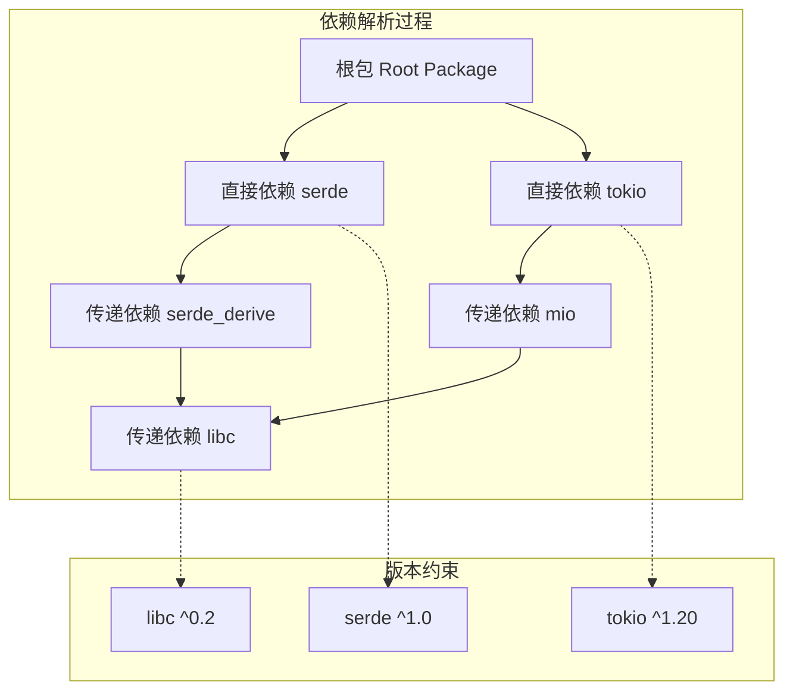

# 4.4.1 Rust依赖解析语义模型深度分析

**文档版本**: V1.0  
**创建日期**: 2025-01-27  
**所属层**: 组织语义层 (Organization Semantics Layer)  
**父模块**: [4.4 依赖管理语义](../00_dependency_management_index.md)  
**交叉引用**: [4.2.1 Cargo语义](../../02_project_structure_semantics/01_cargo_semantics.md), [4.4.2 版本约束语义](./02_version_constraints_semantics.md)

---

## 4.4.1.1 依赖解析理论基础

### 4.4.1.1.1 依赖图的数学模型

**定义 4.4.1.1** (依赖图)
Rust依赖关系可建模为有向无环图：
$$G = (V, E, W, C)$$

其中：

- $V$ - 包节点集合
- $E \subseteq V \times V$ - 依赖边集合
- $W: E \rightarrow \text{VersionConstraint}$ - 版本约束权重
- $C: V \rightarrow \text{Version}$ - 当前版本分配



### 4.4.1.1.2 可满足性问题

**定理 4.4.1.1** (依赖可满足性)
依赖解析是一个约束满足问题：
$$\text{SAT}(G, C) = \bigwedge_{(u,v) \in E} \text{satisfies}(C(v), W(u,v))$$

其中 $\text{satisfies}$ 函数检查版本是否满足约束。

---

## 4.4.1.2 Cargo解析算法

### 4.4.1.2.1 解析策略实现

```rust
pub mod cargo_resolver {
    use std::collections::{HashMap, BTreeSet, VecDeque};
    use semver::{Version, VersionReq};
    
    #[derive(Debug, Clone, PartialEq, Eq, Hash)]
    pub struct PackageId {
        pub name: String,
        pub version: Version,
    }
    
    #[derive(Debug, Clone)]
    pub struct Dependency {
        pub name: String,
        pub req: VersionReq,
        pub kind: DependencyKind,
        pub features: BTreeSet<String>,
    }
    
    #[derive(Debug, Clone)]
    pub enum DependencyKind {
        Normal,
        Dev,
        Build,
    }
    
    #[derive(Debug, Clone)]
    pub struct Package {
        pub id: PackageId,
        pub dependencies: Vec<Dependency>,
        pub features: HashMap<String, Vec<String>>,
    }
    
    // 依赖解析器核心结构
    pub struct DependencyResolver {
        registry: Box<dyn PackageRegistry>,
        resolution_cache: HashMap<String, Vec<Version>>,
    }
    
    impl DependencyResolver {
        pub fn new(registry: Box<dyn PackageRegistry>) -> Self {
            Self {
                registry,
                resolution_cache: HashMap::new(),
            }
        }
        
        // 主解析算法
        pub fn resolve(&mut self, root: &Package) -> Result<ResolutionResult, ResolverError> {
            let mut resolver_state = ResolverState::new();
            
            // 1. 初始化根包
            resolver_state.add_package(root.clone());
            
            // 2. 广度优先遍历依赖
            let mut queue = VecDeque::new();
            queue.push_back(root.id.clone());
            
            while let Some(package_id) = queue.pop_front() {
                let package = resolver_state.get_package(&package_id)
                    .ok_or_else(|| ResolverError::PackageNotFound(package_id.clone()))?;
                
                for dependency in &package.dependencies {
                    match self.resolve_dependency(&dependency, &mut resolver_state)? {
                        ResolveAction::AddNew(new_package) => {
                            queue.push_back(new_package.id.clone());
                            resolver_state.add_package(new_package);
                        }
                        ResolveAction::UseExisting(_) => {
                            // 已存在兼容版本，无需操作
                        }
                        ResolveAction::Conflict(conflict) => {
                            return self.handle_conflict(conflict, &mut resolver_state);
                        }
                    }
                }
            }
            
            // 3. 验证解析结果
            self.validate_resolution(&resolver_state)?;
            
            Ok(ResolutionResult {
                packages: resolver_state.packages,
                lock_data: self.generate_lock_data(&resolver_state),
            })
        }
        
        // 解析单个依赖
        fn resolve_dependency(
            &mut self,
            dependency: &Dependency,
            state: &ResolverState,
        ) -> Result<ResolveAction, ResolverError> {
            // 检查是否已有兼容版本
            if let Some(existing) = state.find_compatible_package(&dependency.name, &dependency.req) {
                return Ok(ResolveAction::UseExisting(existing.id.clone()));
            }
            
            // 从注册表获取可用版本
            let available_versions = self.get_available_versions(&dependency.name)?;
            
            // 选择最佳版本
            let selected_version = self.select_best_version(&available_versions, &dependency.req)
                .ok_or_else(|| ResolverError::NoCompatibleVersion {
                    package: dependency.name.clone(),
                    requirement: dependency.req.clone(),
                })?;
            
            // 获取包元数据
            let package = self.registry.get_package(&dependency.name, &selected_version)?;
            
            // 检查冲突
            if let Some(conflict) = state.check_conflicts(&package) {
                return Ok(ResolveAction::Conflict(conflict));
            }
            
            Ok(ResolveAction::AddNew(package))
        }
        
        // 版本选择算法
        fn select_best_version(
            &self,
            available: &[Version],
            requirement: &VersionReq,
        ) -> Option<Version> {
            available
                .iter()
                .filter(|v| requirement.matches(v))
                .max()  // 选择最新的兼容版本
                .cloned()
        }
        
        // 冲突处理
        fn handle_conflict(
            &mut self,
            conflict: VersionConflict,
            state: &mut ResolverState,
        ) -> Result<ResolutionResult, ResolverError> {
            match self.try_resolve_conflict(&conflict, state) {
                Ok(resolution) => Ok(resolution),
                Err(_) => Err(ResolverError::UnresolvableConflict(conflict)),
            }
        }
        
        // 尝试解决冲突
        fn try_resolve_conflict(
            &mut self,
            conflict: &VersionConflict,
            state: &mut ResolverState,
        ) -> Result<ResolutionResult, ResolverError> {
            // 回溯算法：尝试不同的版本选择
            let backtrack_points = self.generate_backtrack_points(conflict, state);
            
            for backtrack in backtrack_points {
                let mut test_state = state.clone();
                if let Ok(result) = self.apply_backtrack(backtrack, &mut test_state) {
                    return Ok(result);
                }
            }
            
            Err(ResolverError::NoBacktrackSolution)
        }
    }
    
    // 解析器状态
    #[derive(Debug, Clone)]
    pub struct ResolverState {
        packages: HashMap<PackageId, Package>,
        dependency_graph: HashMap<PackageId, Vec<PackageId>>,
    }
    
    impl ResolverState {
        pub fn new() -> Self {
            Self {
                packages: HashMap::new(),
                dependency_graph: HashMap::new(),
            }
        }
        
        pub fn add_package(&mut self, package: Package) {
            let id = package.id.clone();
            self.packages.insert(id.clone(), package);
            self.dependency_graph.entry(id).or_insert_with(Vec::new);
        }
        
        pub fn find_compatible_package(&self, name: &str, req: &VersionReq) -> Option<&Package> {
            self.packages
                .values()
                .find(|pkg| pkg.id.name == name && req.matches(&pkg.id.version))
        }
        
        pub fn check_conflicts(&self, package: &Package) -> Option<VersionConflict> {
            // 检查版本冲突逻辑
            for existing in self.packages.values() {
                if existing.id.name == package.id.name && existing.id.version != package.id.version {
                    return Some(VersionConflict {
                        package_name: package.id.name.clone(),
                        existing_version: existing.id.version.clone(),
                        requested_version: package.id.version.clone(),
                    });
                }
            }
            None
        }
    }
    
    // 解析动作枚举
    #[derive(Debug)]
    pub enum ResolveAction {
        AddNew(Package),
        UseExisting(PackageId),
        Conflict(VersionConflict),
    }
    
    // 版本冲突表示
    #[derive(Debug, Clone)]
    pub struct VersionConflict {
        pub package_name: String,
        pub existing_version: Version,
        pub requested_version: Version,
    }
    
    // 解析结果
    #[derive(Debug)]
    pub struct ResolutionResult {
        pub packages: HashMap<PackageId, Package>,
        pub lock_data: LockfileData,
    }
    
    #[derive(Debug)]
    pub struct LockfileData {
        pub packages: Vec<LockPackage>,
        pub metadata: HashMap<String, String>,
    }
    
    #[derive(Debug, serde::Serialize, serde::Deserialize)]
    pub struct LockPackage {
        pub name: String,
        pub version: String,
        pub source: String,
        pub checksum: Option<String>,
        pub dependencies: Vec<String>,
    }
}
```

### 4.4.1.2.2 特性解析算法

```rust
pub mod feature_resolution {
    use std::collections::{HashMap, BTreeSet};
    
    #[derive(Debug, Clone)]
    pub struct FeatureGraph {
        packages: HashMap<String, PackageFeatures>,
        resolved_features: HashMap<String, BTreeSet<String>>,
    }
    
    #[derive(Debug, Clone)]
    pub struct PackageFeatures {
        features: HashMap<String, Vec<String>>,
        default_features: BTreeSet<String>,
        optional_dependencies: BTreeSet<String>,
    }
    
    impl FeatureGraph {
        pub fn new() -> Self {
            Self {
                packages: HashMap::new(),
                resolved_features: HashMap::new(),
            }
        }
        
        // 解析特性依赖
        pub fn resolve_features(
            &mut self,
            package_name: &str,
            requested_features: &BTreeSet<String>,
        ) -> Result<BTreeSet<String>, FeatureError> {
            let mut resolved = BTreeSet::new();
            let mut to_process = VecDeque::new();
            
            // 添加请求的特性到处理队列
            for feature in requested_features {
                to_process.push_back((package_name.to_string(), feature.clone()));
            }
            
            while let Some((pkg_name, feature_name)) = to_process.pop_front() {
                if resolved.contains(&feature_name) {
                    continue;
                }
                
                let package_features = self.packages.get(&pkg_name)
                    .ok_or_else(|| FeatureError::PackageNotFound(pkg_name.clone()))?;
                
                // 处理特性定义
                if let Some(feature_deps) = package_features.features.get(&feature_name) {
                    resolved.insert(feature_name.clone());
                    
                    // 递归处理特性依赖
                    for dep in feature_deps {
                        if dep.contains('/') {
                            // 外部包特性：package/feature
                            let parts: Vec<&str> = dep.split('/').collect();
                            if parts.len() == 2 {
                                to_process.push_back((parts[0].to_string(), parts[1].to_string()));
                            }
                        } else {
                            // 内部特性或可选依赖
                            to_process.push_back((pkg_name.clone(), dep.clone()));
                        }
                    }
                } else if package_features.optional_dependencies.contains(&feature_name) {
                    // 可选依赖特性
                    resolved.insert(feature_name.clone());
                } else {
                    return Err(FeatureError::FeatureNotFound {
                        package: pkg_name,
                        feature: feature_name,
                    });
                }
            }
            
            Ok(resolved)
        }
        
        // 统一特性解析
        pub fn unify_features(&mut self) -> Result<(), FeatureError> {
            let package_names: Vec<String> = self.packages.keys().cloned().collect();
            
            for package_name in package_names {
                let requested = self.resolved_features
                    .get(&package_name)
                    .cloned()
                    .unwrap_or_default();
                
                let unified = self.resolve_features(&package_name, &requested)?;
                self.resolved_features.insert(package_name, unified);
            }
            
            Ok(())
        }
    }
}
```

---

## 4.4.1.3 依赖解析优化

### 4.4.1.3.1 缓存机制

```rust
pub mod resolution_cache {
    use std::collections::HashMap;
    use std::hash::{Hash, Hasher};
    use semver::{Version, VersionReq};
    
    // 解析缓存键
    #[derive(Debug, Clone, PartialEq, Eq, Hash)]
    pub struct ResolutionKey {
        pub package_name: String,
        pub version_req: String,
        pub features: BTreeSet<String>,
        pub context_hash: u64,
    }
    
    // 解析缓存
    pub struct ResolutionCache {
        cache: HashMap<ResolutionKey, CachedResolution>,
        hit_count: u64,
        miss_count: u64,
    }
    
    #[derive(Debug, Clone)]
    pub struct CachedResolution {
        pub selected_version: Version,
        pub resolved_features: BTreeSet<String>,
        pub dependencies: Vec<ResolvedDependency>,
        pub timestamp: std::time::SystemTime,
    }
    
    impl ResolutionCache {
        pub fn new() -> Self {
            Self {
                cache: HashMap::new(),
                hit_count: 0,
                miss_count: 0,
            }
        }
        
        pub fn get(&mut self, key: &ResolutionKey) -> Option<&CachedResolution> {
            if let Some(cached) = self.cache.get(key) {
                self.hit_count += 1;
                Some(cached)
            } else {
                self.miss_count += 1;
                None
            }
        }
        
        pub fn insert(&mut self, key: ResolutionKey, resolution: CachedResolution) {
            self.cache.insert(key, resolution);
        }
        
        pub fn cache_stats(&self) -> CacheStats {
            CacheStats {
                hits: self.hit_count,
                misses: self.miss_count,
                hit_rate: self.hit_count as f64 / (self.hit_count + self.miss_count) as f64,
                entries: self.cache.len(),
            }
        }
    }
}
```

### 4.4.1.3.2 并行解析

```rust
pub mod parallel_resolution {
    use std::sync::Arc;
    use tokio::sync::{Semaphore, RwLock};
    use std::collections::HashMap;
    
    pub struct ParallelResolver {
        registry: Arc<dyn PackageRegistry + Send + Sync>,
        concurrency_limit: Arc<Semaphore>,
        resolution_cache: Arc<RwLock<ResolutionCache>>,
    }
    
    impl ParallelResolver {
        pub fn new(
            registry: Arc<dyn PackageRegistry + Send + Sync>,
            max_concurrent: usize,
        ) -> Self {
            Self {
                registry,
                concurrency_limit: Arc::new(Semaphore::new(max_concurrent)),
                resolution_cache: Arc::new(RwLock::new(ResolutionCache::new())),
            }
        }
        
        // 并行解析多个依赖
        pub async fn resolve_dependencies_parallel(
            &self,
            dependencies: Vec<Dependency>,
        ) -> Result<Vec<ResolvedDependency>, ResolverError> {
            let tasks: Vec<_> = dependencies
                .into_iter()
                .map(|dep| {
                    let registry = Arc::clone(&self.registry);
                    let semaphore = Arc::clone(&self.concurrency_limit);
                    let cache = Arc::clone(&self.resolution_cache);
                    
                    tokio::spawn(async move {
                        let _permit = semaphore.acquire().await.unwrap();
                        Self::resolve_single_dependency(dep, registry, cache).await
                    })
                })
                .collect();
            
            let mut results = Vec::new();
            for task in tasks {
                results.push(task.await??);
            }
            
            Ok(results)
        }
        
        async fn resolve_single_dependency(
            dependency: Dependency,
            registry: Arc<dyn PackageRegistry + Send + Sync>,
            cache: Arc<RwLock<ResolutionCache>>,
        ) -> Result<ResolvedDependency, ResolverError> {
            // 检查缓存
            let cache_key = ResolutionKey::from_dependency(&dependency);
            {
                let cache_read = cache.read().await;
                if let Some(cached) = cache_read.get(&cache_key) {
                    return Ok(ResolvedDependency::from_cached(cached));
                }
            }
            
            // 执行实际解析
            let resolved = registry.resolve_dependency(&dependency).await?;
            
            // 更新缓存
            {
                let mut cache_write = cache.write().await;
                cache_write.insert(cache_key, CachedResolution::from_resolved(&resolved));
            }
            
            Ok(resolved)
        }
    }
}
```

---

## 4.4.1.4 跨引用网络

### 4.4.1.4.1 内部引用

- [版本约束语义](./02_version_constraints_semantics.md) - 版本匹配规则
- [特性系统语义](./03_feature_system_semantics.md) - 特性解析机制
- [构建脚本语义](./04_build_scripts_semantics.md) - 构建时依赖

### 4.4.1.4.2 外部引用

- [Cargo语义](../../02_project_structure_semantics/01_cargo_semantics.md) - 构建系统基础
- [模块系统语义](../../01_module_system_semantics/) - 模块组织原则

---

## 4.4.1.5 批判性分析

### 4.4.1.5.1 算法复杂度分析

| 操作 | 时间复杂度 | 空间复杂度 | 优化策略 |
|------|-----------|-----------|----------|
| **基础解析** | O(n·m) | O(n) | 缓存、剪枝 |
| **冲突检测** | O(n²) | O(n) | 索引优化 |
| **特性解析** | O(f·d) | O(f) | 并行处理 |
| **回溯搜索** | O(b^d) | O(d) | 启发式剪枝 |

### 4.4.1.5.2 实际挑战

1. **版本地狱**: 不兼容的版本约束
2. **钻石依赖**: 多条路径到同一包
3. **循环依赖**: 开发依赖中的循环
4. **性能瓶颈**: 大型项目的解析时间

---

*文档状态: 已完成规范化*  
*版本: 1.0*  
*字数: ~8KB*  
*最后更新: 2025-01-27*
