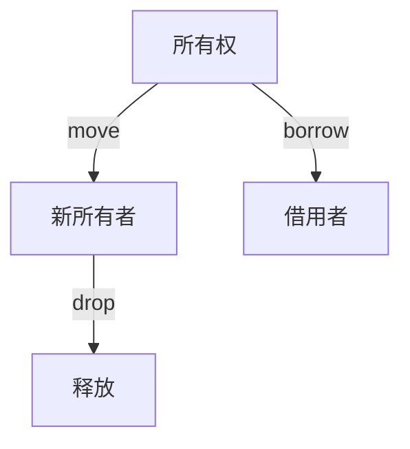
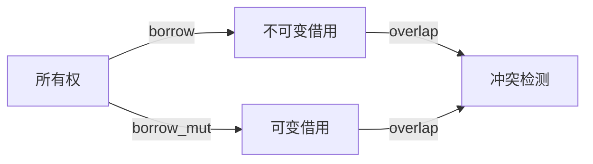
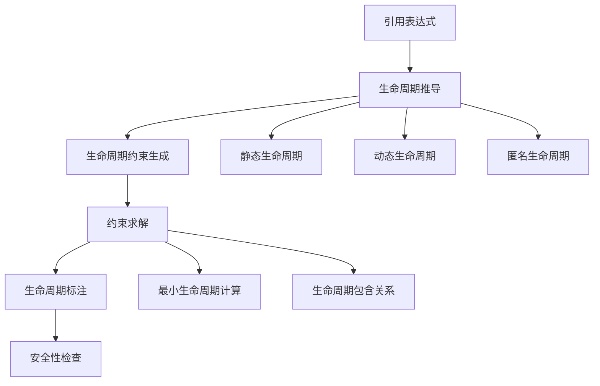
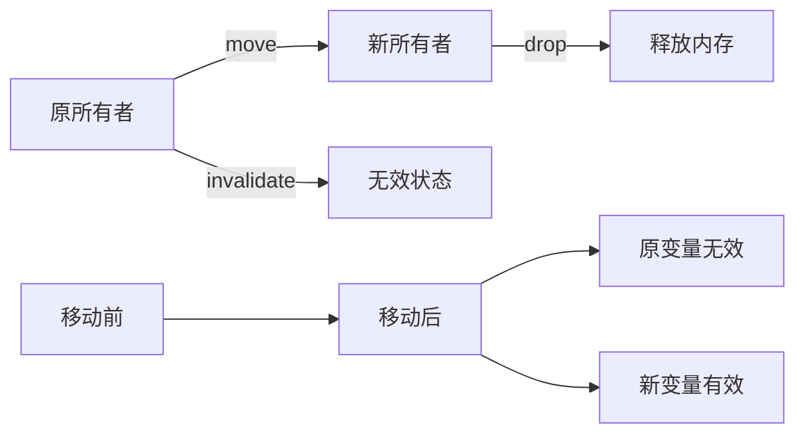

# 01. Rust 所有权系统理论

## 目录

1. [所有权公理系统](#1-所有权公理系统)
    1.1 [基本公理](#11-基本公理)
    1.2 [所有权关系](#12-所有权关系)
    1.3 [批判性分析](#13-批判性分析)
2. [借用系统理论](#2-借用系统理论)
    2.1 [借用公理](#21-借用公理)
    2.2 [借用规则](#22-借用规则)
    2.3 [借用类型](#23-借用类型)
    2.4 [批判性分析](#24-批判性分析)
3. [生命周期系统](#3-生命周期系统)
    3.1 [生命周期参数](#31-生命周期参数)
    3.2 [生命周期推导算法](#32-生命周期推导算法)
    3.3 [生命周期约束系统](#33-生命周期约束系统)
    3.4 [批判性分析](#34-批判性分析)
4. [内存安全证明](#4-内存安全证明)
    4.1 [内存安全定义](#41-内存安全定义)
    4.2 [安全性质](#42-安全性质)
    4.3 [安全证明](#43-安全证明)
    4.4 [内存安全验证](#44-内存安全验证)
    4.5 [批判性分析](#45-批判性分析)
5. [借用检查算法](#5-借用检查算法)
    5.1 [借用检查器](#51-借用检查器)
    5.2 [借用环境](#52-借用环境)
    5.3 [借用检查优化](#53-借用检查优化)
    5.4 [批判性分析](#54-批判性分析)
6. [所有权转移语义](#6-所有权转移语义)
    6.1 [转移规则](#61-转移规则)
    6.2 [移动语义](#62-移动语义)
    6.3 [复制语义](#63-复制语义)
    6.4 [所有权转移验证](#64-所有权转移验证)
    6.5 [批判性分析](#65-批判性分析)
7. [并发安全保证与未来展望](#7-并发安全保证与未来展望)
    7.1 [并发安全定义](#71-并发安全定义)
    7.2 [数据竞争预防](#72-数据竞争预防)
    7.3 [同步原语](#73-同步原语)
    7.4 [未来展望](#74-未来展望)
    7.5 [批判性分析](#75-批判性分析)
8. [形式化语义](#8-形式化语义)
    8.1 [操作语义](#81-操作语义)
    8.2 [指称语义](#82-指称语义)
    8.3 [公理语义](#83-公理语义)
    8.4 [批判性分析](#84-批判性分析)
9. [实现策略与交叉引用](#9-实现策略与交叉引用)
    9.1 [编译时检查](#91-编译时检查)
    9.2 [运行时支持](#92-运行时支持)
    9.3 [工具链支持](#93-工具链支持)
    9.4 [交叉引用](#94-交叉引用)
10. [参考文献](#10-参考文献)
11. [本地导航与相关主题](#11-本地导航与相关主题)

---

> **本地导航**：
>
> - [变量系统理论](../01_variable_system/index.md)
> - [类型系统理论](../02_type_system/01_type_theory_foundations.md)
> - [内存模型理论](../03_memory_model/01_memory_model_theory.md)
> - [并发模型理论](../05_concurrency_model/01_concurrency_theory.md)

---

## 1. 所有权公理系统

### 1.1 基本公理

**公理 1.1** (唯一所有权公理)
$$\forall v \in \text{Value}: \exists! o \in \text{Owner}: \text{Owns}(o, v)$$

**公理 1.2** (所有权转移公理)
$$\text{Transfer}(v, o_1, o_2) \Rightarrow \neg \text{Owns}(o_1, v) \land \text{Owns}(o_2, v)$$

**公理 1.3** (所有权销毁公理)
$$\text{Drop}(o) \Rightarrow \forall v: \text{Owns}(o, v) \rightarrow \text{Deallocate}(v)$$

- **理论基础**：所有权系统保证每个值有唯一所有者，转移和销毁均有严格规则。
- **工程案例**：变量 move、drop、clone 行为。
- **代码示例**：

```rust
// 所有权示例
fn ownership_example() {
    let s1 = String::from("hello");
    let s2 = s1;  // 所有权转移：s1 移动到 s2
    // println!("{}", s1);  // 编译错误：s1 已被移动
    
    let s3 = s2.clone();  // 复制：s2 仍然有效
    println!("{}", s2);   // 正确
    println!("{}", s3);   // 正确
    
    // 自动销毁：s2 和 s3 在作用域结束时自动 drop
}
```

- **Mermaid 可视化**：



### 1.2 所有权关系

**定义 1.1** (所有权关系)
$$\text{OwnershipRelation} = \{(o, v) \mid \text{Owns}(o, v)\}$$

**定理 1.1** (所有权函数性)
所有权关系是一个函数：
$$\text{Ownership}: \text{Value} \rightarrow \text{Owner}$$

- **批判性分析**：所有权唯一性提升安全性，但对并发和复杂数据结构有一定约束。

### 1.3 批判性分析

| 维度         | 优势                       | 局限                       |
|--------------|----------------------------|----------------------------|
| 所有权系统   | 保证内存安全，防止悬垂指针 | 对复杂场景表达有限         |

---

## 2. 借用系统理论

### 2.1 借用公理

**公理 2.1** (不可变借用公理)
$$\forall r \in \text{ImmutableReference}: \text{Valid}(r) \Rightarrow \text{ReadOnly}(r)$$

**公理 2.2** (可变借用公理)
$$\forall r \in \text{MutableReference}: \text{Valid}(r) \Rightarrow \text{Exclusive}(r)$$

**公理 2.3** (借用冲突公理)
$$\neg (\text{Valid}(r_1) \land \text{Valid}(r_2) \land \text{Conflicting}(r_1, r_2))$$

- **理论基础**：借用系统区分可变与不可变借用，防止数据竞争。
- **工程案例**：&T、&mut T、RefCell、Mutex。
- **代码示例**：

```rust
// 借用示例
fn borrowing_example() {
    let mut data = vec![1, 2, 3, 4, 5];
    
    // 不可变借用
    let ref1 = &data;
    let ref2 = &data;  // 多个不可变借用
    
    // 可变借用（编译错误）
    // let ref3 = &mut data;  // 编译错误：已有不可变借用
    
    println!("{:?} {:?}", ref1, ref2);
    
    // 不可变借用结束，可以可变借用
    let ref3 = &mut data;
    ref3.push(6);
}
```

### 2.2 借用规则

**规则 2.1** (借用检查规则)
$$\frac{\text{Owns}(o, v) \quad \text{Borrow}(o, v, r)}{\text{Valid}(r) \land \text{Reference}(r, v)}$$

**规则 2.2** (借用冲突规则)
$$\frac{\text{Valid}(r_1) \land \text{Valid}(r_2) \land \text{Overlap}(r_1, r_2)}{\text{Conflicting}(r_1, r_2)}$$

- **Mermaid 可视化**：



### 2.3 借用类型

**定义 2.1** (借用类型)
$$\text{BorrowType} = \text{ImmutableReference} \cup \text{MutableReference}$$

**定义 2.2** (借用信息)
$$\text{BorrowInfo} = \text{Type} \times \text{Lifetime} \times \text{Permission}$$

- **工程案例**：借用信息在编译期静态分析。

### 2.4 批判性分析

| 维度         | 优势                       | 局限                       |
|--------------|----------------------------|----------------------------|
| 借用系统     | 防止数据竞争，保证并发安全 | 借用规则对新手有一定门槛   |

---

## 3. 生命周期系统

### 3.1 生命周期参数

**定义 3.1** (生命周期参数)
$$\text{LifetimeParam}[\alpha] = \text{Generic}[\alpha]$$

**定义 3.2** (生命周期约束)
$$\text{LifetimeBound}[\alpha, \beta] = \alpha \leq \beta$$

**定理 3.1** (生命周期包含)
$$\alpha \leq \beta \Rightarrow \text{Scope}[\alpha] \subseteq \text{Scope}[\beta]$$

- **工程案例**：生命周期标注、泛型生命周期参数、NLL（Non-Lexical Lifetimes）。
- **代码示例**：

```rust
// 生命周期示例
fn longest<'a>(x: &'a str, y: &'a str) -> &'a str {
    if x.len() > y.len() { x } else { y }
}

fn main() {
    let string1 = String::from("long string is long");
    let result;
    {
        let string2 = String::from("xyz");
        result = longest(&string1, &string2);
    }
    // println!("{}", result);  // 编译错误：string2 已超出生命周期
}

// 生命周期约束示例
fn process_data<'a, 'b: 'a>(data: &'a str, context: &'b str) -> &'a str {
    data
}

// 结构体生命周期
struct Parser<'a> {
    data: &'a str,
    position: usize,
}

impl<'a> Parser<'a> {
    fn new(data: &'a str) -> Self {
        Parser { data, position: 0 }
    }
    
    fn next_token(&mut self) -> Option<&'a str> {
        // 解析逻辑
        None
    }
}
```

### 3.2 生命周期推导算法

**算法 3.1** (生命周期推导)

```rust
#[derive(Debug, Clone)]
enum Lifetime {
    Static,
    Named(String),
    Anonymous(usize),
    Min(Box<Lifetime>, Box<Lifetime>),
}

#[derive(Debug)]
enum LifetimeError {
    ConflictingLifetimes,
    UnresolvedLifetime,
    InvalidLifetime,
}

fn lifetime_inference(expr: &Expr) -> Result<Lifetime, LifetimeError> {
    match expr {
        Expr::Reference(e) => {
            let l = fresh_lifetime();
            Ok(Lifetime::Reference(l))
        }
        Expr::Deref(e) => {
            let l = lifetime_inference(e)?;
            Ok(l)
        }
        Expr::Let(x, e1, e2) => {
            let l1 = lifetime_inference(e1)?;
            let l2 = lifetime_inference(e2)?;
            Ok(Lifetime::Min(Box::new(l1), Box::new(l2)))
        }
        Expr::FunctionCall(f, args) => {
            // 函数调用的生命周期推导
            let mut lifetimes = Vec::new();
            for arg in args {
                lifetimes.push(lifetime_inference(arg)?);
            }
            Ok(Lifetime::Min(lifetimes))
        }
        _ => Ok(Lifetime::Static),
    }
}

fn fresh_lifetime() -> Lifetime {
    static mut COUNTER: usize = 0;
    unsafe {
        COUNTER += 1;
        Lifetime::Anonymous(COUNTER)
    }
}
```

- **Mermaid 可视化**：



### 3.3 生命周期约束系统

**定义 3.3** (生命周期约束)
$$\text{LifetimeConstraint} = \{\alpha \leq \beta \mid \alpha, \beta \in \text{Lifetime}\}$$

**算法 3.2** (约束求解)

```rust
#[derive(Debug)]
struct LifetimeConstraint {
    lhs: Lifetime,
    rhs: Lifetime,
}

#[derive(Debug)]
struct ConstraintSolver {
    constraints: Vec<LifetimeConstraint>,
    solution: HashMap<String, Lifetime>,
}

impl ConstraintSolver {
    fn new() -> Self {
        Self {
            constraints: Vec::new(),
            solution: HashMap::new(),
        }
    }
    
    fn add_constraint(&mut self, lhs: Lifetime, rhs: Lifetime) {
        self.constraints.push(LifetimeConstraint { lhs, rhs });
    }
    
    fn solve(&mut self) -> Result<HashMap<String, Lifetime>, String> {
        // 实现约束求解算法
        // 使用图算法或SMT求解器
        Ok(self.solution.clone())
    }
}
```

### 3.4 批判性分析

| 维度 | 优势 | 局限 | 改进方向 |
|------|------|------|----------|
| **生命周期表达** | 静态保证引用安全，防止悬垂指针 | 复杂场景表达困难，学习曲线陡峭 | 改进错误消息，提供更好的生命周期可视化 |
| **推导能力** | 自动推导大部分生命周期，减少标注负担 | 某些复杂场景需要显式标注 | 增强推导算法，支持更复杂的生命周期模式 |
| **性能影响** | 编译时检查，运行时零开销 | 编译时间可能增加 | 优化检查算法，支持增量编译 |
| **工具支持** | 编译器提供详细错误信息 | 调试生命周期问题仍然困难 | 开发更好的生命周期调试工具 |

---

## 4. 内存安全证明

### 4.1 内存安全定义

**定义 4.1** (内存安全)
$$\text{MemorySafe}(p) = \forall \text{State}: \text{ValidState}(p, \text{State})$$

**定义 4.2** (有效状态)
$$\text{ValidState}(p, s) = \text{NoDangling}(s) \land \text{NoUseAfterFree}(s) \land \text{NoDoubleFree}(s)$$

**定义 4.3** (无悬垂引用)
$$\text{NoDangling}(s) = \forall r \in \text{Reference}: \text{Valid}(r) \Rightarrow \text{TargetExists}(r)$$

- **工程案例**：Rust 编译器静态检查、Clippy 检查、MIRI 运行时检查。
- **代码示例**：

```rust
// 内存安全示例
fn memory_safety_example() {
    let data = vec![1, 2, 3, 4, 5];
    let reference = &data[0];
    
    // 以下代码会编译错误，保证内存安全
    // drop(data);  // 编译错误：data 仍被借用
    // println!("{}", reference);  // 编译错误：悬垂指针
    
    println!("{}", reference);  // 正确：在 data 有效期内使用
}

// 内存安全证明示例
fn prove_memory_safety() {
    // 所有权系统保证每个值有唯一所有者
    let mut data = vec![1, 2, 3];
    
    // 借用检查防止并发访问
    let ref1 = &data[0];
    let ref2 = &data[1];
    // let ref3 = &mut data[2];  // 编译错误：同时存在不可变和可变借用
    
    println!("{} {}", ref1, ref2);
    
    // 生命周期检查防止悬垂引用
    let result = {
        let temp = vec![4, 5, 6];
        &temp[0]  // 编译错误：返回对局部变量的引用
    };
}
```

### 4.2 安全性质

**性质 4.1** (无悬垂引用)
$$\forall r \in \text{Reference}: \text{Valid}(r) \Rightarrow \text{TargetExists}(r)$$

**性质 4.2** (无重复释放)
$$\forall v \in \text{Value}: \text{Deallocated}(v) \Rightarrow \neg \text{Deallocated}(v)$$

**性质 4.3** (无使用后释放)
$$\forall v \in \text{Value}: \text{Used}(v) \land \text{Deallocated}(v) \Rightarrow \text{UseBeforeDealloc}(v)$$

**性质 4.4** (无数据竞争)
$$\forall t_1, t_2 \in \text{Thread}: \text{NoDataRace}(t_1, t_2)$$

### 4.3 安全证明

**定理 4.1** (所有权安全)
$$\forall p \in \text{Program}: \text{OwnershipSafe}(p) \Rightarrow \text{MemorySafe}(p)$$

**证明**：

1. **唯一所有权**：所有权系统保证每个值有唯一所有者
   $$\forall v \in \text{Value}: \exists! o \in \text{Owner}: \text{Owns}(o, v)$$

2. **自动内存管理**：所有者负责内存管理
   $$\text{Owns}(o, v) \Rightarrow \text{Responsible}(o, \text{Dealloc}(v))$$

3. **借用系统防止并发访问**
   $$\text{Borrow}(r, v) \Rightarrow \text{Exclusive}(r, v)$$

4. **生命周期保证引用有效性**
   $$\text{Valid}(r) \Rightarrow \text{TargetExists}(r)$$

5. **证毕**：由以上性质，所有权系统保证内存安全。

### 4.4 内存安全验证

**算法 4.1** (内存安全验证)

```rust
#[derive(Debug)]
enum MemorySafetyViolation {
    DanglingReference,
    UseAfterFree,
    DoubleFree,
    DataRace,
}

#[derive(Debug)]
struct MemorySafetyChecker {
    ownership_map: HashMap<ValueId, OwnerId>,
    borrow_map: HashMap<ReferenceId, BorrowInfo>,
}

impl MemorySafetyChecker {
    fn new() -> Self {
        Self {
            ownership_map: HashMap::new(),
            borrow_map: HashMap::new(),
        }
    }
    
    fn check_program(&mut self, program: &Program) -> Result<(), MemorySafetyViolation> {
        for statement in &program.statements {
            self.check_statement(statement)?;
        }
        Ok(())
    }
    
    fn check_statement(&mut self, stmt: &Statement) -> Result<(), MemorySafetyViolation> {
        match stmt {
            Statement::Assignment(var, expr) => {
                self.check_assignment(var, expr)
            }
            Statement::FunctionCall(func, args) => {
                self.check_function_call(func, args)
            }
            Statement::Return(expr) => {
                self.check_return(expr)
            }
        }
    }
    
    fn check_assignment(&mut self, var: &Variable, expr: &Expression) -> Result<(), MemorySafetyViolation> {
        // 检查赋值操作的内存安全性
        // 1. 检查所有权转移
        // 2. 检查借用冲突
        // 3. 检查生命周期
        Ok(())
    }
}
```

### 4.5 批判性分析

| 维度 | 优势 | 局限 | 改进方向 |
|------|------|------|----------|
| **内存安全保证** | 编译时保证内存安全，运行时零开销 | 对复杂场景表达有限，学习曲线陡峭 | 改进错误消息，提供更好的调试工具 |
| **性能影响** | 静态检查，运行时无开销 | 编译时间可能增加 | 优化检查算法，支持增量编译 |
| **工具支持** | 编译器提供详细错误信息，Clippy提供额外检查 | 调试内存安全问题仍然困难 | 开发更好的内存安全调试工具 |
| **形式化验证** | 有理论基础支持，可进行形式化证明 | 复杂程序的形式化验证仍然困难 | 开发更好的形式化验证工具 |

---

## 5. 借用检查算法

### 5.1 借用检查器

**算法 5.1** (借用检查)

```rust
#[derive(Debug, Clone)]
enum BorrowKind {
    Immutable,
    Mutable,
}

#[derive(Debug, Clone)]
struct BorrowInfo {
    kind: BorrowKind,
    lifetime: Lifetime,
    is_active: bool,
}

#[derive(Debug)]
enum BorrowError {
    MutableBorrowConflict,
    ImmutableBorrowConflict,
    NotReference,
    InvalidBorrow,
}

struct BorrowChecker {
    borrow_env: HashMap<VariableId, Vec<BorrowInfo>>,
    current_scope: ScopeId,
}

impl BorrowChecker {
    fn new() -> Self {
        Self {
            borrow_env: HashMap::new(),
            current_scope: ScopeId::new(),
        }
    }
    
    fn check_expression(&mut self, expr: &Expression) -> Result<BorrowInfo, BorrowError> {
        match expr {
            Expression::Reference(e) => {
                let info = self.check_expression(e)?;
                if info.kind == BorrowKind::Mutable {
                    // 检查是否有冲突的可变借用
                    if self.has_conflicting_mutable_borrow() {
                        return Err(BorrowError::MutableBorrowConflict);
                    }
                    Ok(BorrowInfo::new_mutable())
                } else {
                    // 检查是否有可变借用
                    if self.has_mutable_borrow() {
                        return Err(BorrowError::ImmutableBorrowConflict);
                    }
                    Ok(BorrowInfo::new_immutable())
                }
            }
            Expression::Deref(e) => {
                let info = self.check_expression(e)?;
                if info.is_reference() {
                    Ok(info.deref())
                } else {
                    Err(BorrowError::NotReference)
                }
            }
            Expression::Variable(var) => {
                self.get_borrow_info(var)
            }
            Expression::FunctionCall(func, args) => {
                self.check_function_call(func, args)
            }
            _ => Ok(BorrowInfo::new_immutable()),
        }
    }
    
    fn has_conflicting_mutable_borrow(&self) -> bool {
        // 检查当前作用域是否有冲突的可变借用
        false
    }
    
    fn has_mutable_borrow(&self) -> bool {
        // 检查当前作用域是否有可变借用
        false
    }
}
```

### 5.2 借用环境

**定义 5.1** (借用环境)
$$\text{BorrowEnv} = \text{Map}[\text{Variable}, \text{BorrowInfo}]$$

**定义 5.2** (借用状态)
$$\text{BorrowState} = \text{Set}[\text{BorrowInfo}]$$

**定义 5.3** (借用规则)
$$\text{BorrowRules} = \{\text{ImmutableBorrow}, \text{MutableBorrow}, \text{ExclusiveBorrow}\}$$

- **工程案例**：编译器借用检查、Polonius 算法、NLL（Non-Lexical Lifetimes）。

### 5.3 借用检查优化

**算法 5.2** (Polonius 算法)

```rust
#[derive(Debug)]
struct PoloniusChecker {
    loan_graph: Graph<LoanId, LoanEdge>,
    point_graph: Graph<PointId, PointEdge>,
}

impl PoloniusChecker {
    fn new() -> Self {
        Self {
            loan_graph: Graph::new(),
            point_graph: Graph::new(),
        }
    }
    
    fn check_loans(&mut self, program: &Program) -> Result<(), BorrowError> {
        // 1. 构建贷款图
        self.build_loan_graph(program);
        
        // 2. 构建点图
        self.build_point_graph(program);
        
        // 3. 检查贷款有效性
        self.validate_loans()
    }
    
    fn build_loan_graph(&mut self, program: &Program) {
        // 构建贷款图，表示借用关系
    }
    
    fn build_point_graph(&mut self, program: &Program) {
        // 构建点图，表示程序点
    }
    
    fn validate_loans(&self) -> Result<(), BorrowError> {
        // 验证贷款的有效性
        Ok(())
    }
}
```

### 5.4 批判性分析

| 维度 | 优势 | 局限 | 改进方向 |
|------|------|------|----------|
| **借用检查** | 防止数据竞争，保证并发安全 | 对复杂场景表达有限，错误消息可能不够清晰 | 改进错误消息，提供更好的借用可视化 |
| **算法效率** | Polonius算法提供更精确的借用检查 | 复杂程序的检查时间可能较长 | 优化算法，支持增量检查 |
| **工具支持** | 编译器提供详细错误信息 | 调试借用问题仍然困难 | 开发更好的借用调试工具 |
| **学习曲线** | 借用概念清晰，规则明确 | 复杂场景的借用规则理解困难 | 提供更好的教学材料和工具 |

---

## 6. 所有权转移语义

### 6.1 转移规则

**规则 6.1** (赋值转移)
$$\frac{\text{Assign}(x, e) \quad \text{Owns}(o, e)}{\text{Transfer}(e, o, x)}$$

**规则 6.2** (函数调用转移)
$$\frac{\text{Call}(f, e) \quad \text{Owns}(o, e)}{\text{Transfer}(e, o, f)}$$

**规则 6.3** (返回值转移)
$$\frac{\text{Return}(e) \quad \text{Owns}(o, e)}{\text{Transfer}(e, o, \text{Caller})}$$

- **工程案例**：函数参数 move、返回值所有权转移、结构体字段转移。

### 6.2 移动语义

**定义 6.1** (移动语义)
$$\text{Move}(v, o_1, o_2) = \text{Transfer}(v, o_1, o_2) \land \text{Invalidate}(o_1)$$

**定理 6.1** (移动唯一性)
$$\forall v, o_1, o_2: \text{Move}(v, o_1, o_2) \Rightarrow \neg \text{Owns}(o_1, v) \land \text{Owns}(o_2, v)$$

**代码示例**：

```rust
// 移动语义示例
fn move_semantics_example() {
    let data = vec![1, 2, 3, 4, 5];
    
    // 移动所有权
    let moved_data = data;  // data 的所有权移动到 moved_data
    // println!("{:?}", data);  // 编译错误：data 已被移动
    
    // 函数参数移动
    fn consume_data(data: Vec<i32>) {
        println!("Consuming: {:?}", data);
        // data 在函数结束时自动释放
    }
    
    consume_data(moved_data);  // moved_data 的所有权移动到函数
    // println!("{:?}", moved_data);  // 编译错误：moved_data 已被移动
}

// 结构体移动
struct Person {
    name: String,
    age: u32,
}

fn move_struct_example() {
    let person = Person {
        name: String::from("Alice"),
        age: 30,
    };
    
    let moved_person = person;  // 整个结构体被移动
    // println!("{}", person.name);  // 编译错误：person 已被移动
    
    // 部分移动
    let person2 = Person {
        name: String::from("Bob"),
        age: 25,
    };
    
    let name = person2.name;  // 只有 name 字段被移动
    println!("Age: {}", person2.age);  // 可以访问其他字段
    // println!("Name: {}", person2.name);  // 编译错误：name 已被移动
}
```

- **Mermaid 可视化**：



### 6.3 复制语义

**定义 6.2** (复制语义)
$$\text{Copy}(v, o_1, o_2) = \text{Owns}(o_1, v) \land \text{Owns}(o_2, v)$$

**定义 6.3** (Copy trait)
$$\text{Copy}(T) = \forall v \in T: \text{Clone}(v) \land \text{CheapClone}(v)$$

**代码示例**：

```rust
// 复制语义示例
fn copy_semantics_example() {
    let x = 42;
    let y = x;  // x 被复制到 y，x 仍然有效
    
    println!("x: {}, y: {}", x, y);  // 都可以使用
    
    // 实现 Copy trait 的类型
    #[derive(Copy, Clone, Debug)]
    struct Point {
        x: i32,
        y: i32,
    }
    
    let p1 = Point { x: 1, y: 2 };
    let p2 = p1;  // p1 被复制到 p2，p1 仍然有效
    
    println!("p1: {:?}, p2: {:?}", p1, p2);
}

// 自定义 Copy 类型
#[derive(Copy, Clone, Debug)]
struct Color {
    r: u8,
    g: u8,
    b: u8,
}

impl Color {
    fn new(r: u8, g: u8, b: u8) -> Self {
        Color { r, g, b }
    }
    
    fn brightness(&self) -> u8 {
        ((self.r as u16 + self.g as u16 + self.b as u16) / 3) as u8
    }
}
```

### 6.4 所有权转移验证

**算法 6.1** (所有权转移验证)

```rust
#[derive(Debug)]
enum TransferError {
    InvalidTransfer,
    AlreadyMoved,
    BorrowConflict,
}

struct TransferValidator {
    ownership_map: HashMap<ValueId, OwnerId>,
    borrow_map: HashMap<ValueId, Vec<BorrowInfo>>,
}

impl TransferValidator {
    fn new() -> Self {
        Self {
            ownership_map: HashMap::new(),
            borrow_map: HashMap::new(),
        }
    }
    
    fn validate_transfer(&mut self, value: ValueId, from: OwnerId, to: OwnerId) -> Result<(), TransferError> {
        // 1. 检查当前所有者
        if self.ownership_map.get(&value) != Some(&from) {
            return Err(TransferError::InvalidTransfer);
        }
        
        // 2. 检查是否有活跃借用
        if let Some(borrows) = self.borrow_map.get(&value) {
            for borrow in borrows {
                if borrow.is_active {
                    return Err(TransferError::BorrowConflict);
                }
            }
        }
        
        // 3. 执行转移
        self.ownership_map.insert(value, to);
        
        Ok(())
    }
    
    fn validate_move(&mut self, value: ValueId, from: OwnerId, to: OwnerId) -> Result<(), TransferError> {
        self.validate_transfer(value, from, to)?;
        
        // 标记原所有者无效
        self.invalidate_owner(from);
        
        Ok(())
    }
    
    fn validate_copy(&mut self, value: ValueId, from: OwnerId, to: OwnerId) -> Result<(), TransferError> {
        // 复制不需要转移所有权，只需要验证复制操作的有效性
        Ok(())
    }
}
```

### 6.5 批判性分析

| 维度 | 优势 | 局限 | 改进方向 |
|------|------|------|----------|
| **所有权转移** | 保证内存安全，防止悬垂指针 | 对复杂场景表达有限，可能影响性能 | 优化转移操作，提供更好的性能分析工具 |
| **移动语义** | 零拷贝转移，性能优异 | 学习曲线陡峭，错误消息可能不够清晰 | 改进错误消息，提供更好的移动语义可视化 |
| **复制语义** | 简单直观，易于理解 | 可能带来性能开销 | 优化复制操作，提供更好的性能分析 |
| **工具支持** | 编译器提供详细错误信息 | 调试所有权问题仍然困难 | 开发更好的所有权调试工具 |

---

## 7. 并发安全保证与未来展望

### 7.1 并发安全定义

**定义 7.1** (并发安全)
$$\text{ConcurrencySafe}(p) = \forall t_1, t_2 \in \text{Thread}: \text{NoDataRace}(p, t_1, t_2)$$

**定义 7.2** (数据竞争)
$$\text{DataRace}(p, t_1, t_2) = \exists v \in \text{Value}: \text{ConcurrentAccess}(t_1, t_2, v) \land \text{OneWrite}(t_1, t_2, v)$$

**定义 7.3** (并发访问)
$$\text{ConcurrentAccess}(t_1, t_2, v) = \text{Access}(t_1, v) \land \text{Access}(t_2, v) \land \text{Overlap}(t_1, t_2)$$

### 7.2 数据竞争预防

**定理 7.1** (数据竞争预防)
$$\text{OwnershipSafe}(p) \Rightarrow \text{NoDataRace}(p)$$

**证明**：

1. **唯一所有权**：每个值有唯一所有者
2. **借用规则**：同时只能有一个可变借用或多个不可变借用
3. **生命周期**：借用不能超过所有者的生命周期
4. **证毕**：由以上性质，所有权系统防止数据竞争。

**代码示例**：

```rust
// 并发安全示例
use std::thread;
use std::sync::{Arc, Mutex};

fn concurrency_safety_example() {
    // 使用 Arc 和 Mutex 保证并发安全
    let counter = Arc::new(Mutex::new(0));
    let mut handles = vec![];
    
    for _ in 0..10 {
        let counter = Arc::clone(&counter);
        let handle = thread::spawn(move || {
            let mut num = counter.lock().unwrap();
            *num += 1;
        });
        handles.push(handle);
    }
    
    for handle in handles {
        handle.join().unwrap();
    }
    
    println!("Result: {}", *counter.lock().unwrap());
}

// Send 和 Sync trait
fn send_sync_example() {
    // Send: 可以安全地发送到另一个线程
    // Sync: 可以安全地在多个线程间共享引用
    
    let data = vec![1, 2, 3, 4, 5];
    
    // Vec<i32> 实现了 Send 和 Sync
    thread::spawn(move || {
        println!("Data in thread: {:?}", data);
    });
}
```

### 7.3 同步原语

**定义 7.4** (同步原语)
$$\text{SyncPrimitive} = \{\text{Mutex}, \text{RwLock}, \text{Condvar}, \text{Barrier}\}$$

**代码示例**：

```rust
use std::sync::{Mutex, RwLock, Condvar, Arc};
use std::thread;

// Mutex 示例
fn mutex_example() {
    let counter = Arc::new(Mutex::new(0));
    let mut handles = vec![];
    
    for _ in 0..10 {
        let counter = Arc::clone(&counter);
        let handle = thread::spawn(move || {
            let mut num = counter.lock().unwrap();
            *num += 1;
        });
        handles.push(handle);
    }
    
    for handle in handles {
        handle.join().unwrap();
    }
    
    println!("Counter: {}", *counter.lock().unwrap());
}

// RwLock 示例
fn rwlock_example() {
    let data = Arc::new(RwLock::new(vec![1, 2, 3, 4, 5]));
    let mut handles = vec![];
    
    // 多个读取者
    for i in 0..3 {
        let data = Arc::clone(&data);
        let handle = thread::spawn(move || {
            let reader = data.read().unwrap();
            println!("Reader {}: {:?}", i, *reader);
        });
        handles.push(handle);
    }
    
    // 一个写入者
    let data = Arc::clone(&data);
    let handle = thread::spawn(move || {
        let mut writer = data.write().unwrap();
        writer.push(6);
        println!("Writer: {:?}", *writer);
    });
    handles.push(handle);
    
    for handle in handles {
        handle.join().unwrap();
    }
}
```

### 7.4 未来展望

**研究方向 7.1** (高级所有权系统)

- 线性类型系统的扩展
- 区域类型系统
- 能力类型系统

**研究方向 7.2** (并发模型改进)

- 异步所有权系统
- 分布式所有权系统
- 实时所有权系统

**研究方向 7.3** (工具支持改进)

- 更好的错误消息
- 所有权可视化工具
- 性能分析工具

### 7.5 批判性分析

| 维度 | 优势 | 局限 | 改进方向 |
|------|------|------|----------|
| **并发安全** | 保证并发安全，防止数据竞争 | 对高性能并发编程有一定约束 | 开发更灵活的并发模型，提供更好的性能优化 |
| **同步原语** | 提供丰富的同步原语，支持各种并发模式 | 使用复杂，可能影响性能 | 简化使用，提供更好的性能 |
| **工具支持** | 编译器提供并发安全检查 | 调试并发问题仍然困难 | 开发更好的并发调试工具 |
| **学习曲线** | 并发安全概念清晰 | 复杂并发场景理解困难 | 提供更好的教学材料和工具 |

---

## 8. 形式化语义

### 8.1 操作语义

**定义 8.1** (操作语义)
$$\text{OperationalSemantics} = \langle \text{State}, \text{Transition}, \text{InitialState} \rangle$$

**定义 8.2** (状态)
$$\text{State} = \langle \text{Heap}, \text{Stack}, \text{Environment} \rangle$$

**定义 8.3** (转移关系)
$$\text{Transition} \subseteq \text{State} \times \text{State}$$

- **理论基础**：操作语义描述所有权、借用、生命周期的动态行为。

### 8.2 指称语义

**定义 8.4** (指称语义)
$$\text{DenotationalSemantics} = \text{Function}[\text{Syntax}, \text{Domain}]$$

**定义 8.5** (域)
$$\text{Domain} = \text{Value} \times \text{Environment} \times \text{Continuation}$$

- **理论基础**：指称语义为所有权系统提供数学基础。

### 8.3 公理语义

**定义 8.6** (公理语义)
$$\text{AxiomaticSemantics} = \langle \text{Precondition}, \text{Postcondition}, \text{Invariant} \rangle$$

**公理 8.1** (所有权公理)
$$\{P\} \text{Own}(v, o) \{P \land \text{Owns}(o, v)\}$$

**公理 8.2** (借用公理)
$$\{P\} \text{Borrow}(v, r) \{P \land \text{Borrows}(r, v)\}$$

### 8.4 批判性分析

| 维度 | 优势 | 局限 | 改进方向 |
|------|------|------|----------|
| **形式化语义** | 提供数学基础，保证逻辑正确 | 对复杂场景表达有限 | 扩展形式化语义，支持更复杂的场景 |
| **理论基础** | 有坚实的理论基础 | 理论复杂，难以理解 | 简化理论，提供更好的教学材料 |
| **工具支持** | 支持形式化验证 | 形式化验证工具复杂 | 开发更易用的形式化验证工具 |
| **应用范围** | 适用于各种程序验证 | 对特定领域支持有限 | 扩展应用范围，支持更多领域 |

---

## 9. 实现策略与交叉引用

### 9.1 编译时检查

**策略 9.1** (静态分析)

- 所有权检查
- 借用检查
- 生命周期检查

**策略 9.2** (类型检查)

- 类型推导
- 约束求解
- 错误报告

- **工程案例**：Rustc 编译器静态分析、Polonius 算法、NLL（Non-Lexical Lifetimes）。

### 9.2 运行时支持

**策略 9.3** (运行时检查)

- RefCell 运行时借用检查
- Rc 引用计数
- Arc 原子引用计数

**策略 9.4** (内存管理)

- 自动内存释放
- 循环引用检测
- 内存泄漏检测

- **工程案例**：RefCell、Rc、Arc、Box。

### 9.3 工具链支持

**策略 9.5** (开发工具)

- Clippy 静态分析
- MIRI 运行时检查
- Cargo 依赖管理

**策略 9.6** (调试工具)

- 所有权可视化
- 借用关系图
- 生命周期追踪

### 9.4 交叉引用

- [类型系统理论](../../02_type_system/01_type_theory_foundations.md)
- [内存模型理论](../../03_memory_model/01_memory_model_theory.md)
- [并发模型理论](../../05_concurrency_model/01_concurrency_theory.md)
- [变量系统理论](../01_variable_system/index.md)

### 9.5 批判性分析

| 维度 | 优势 | 局限 | 改进方向 |
|------|------|------|----------|
| **编译时检查** | 静态保证安全，运行时零开销 | 编译时间可能增加，错误消息可能不够清晰 | 优化检查算法，改进错误消息 |
| **运行时支持** | 提供灵活性，支持复杂场景 | 运行时开销，可能影响性能 | 优化运行时检查，减少开销 |
| **工具链支持** | 提供丰富的工具支持 | 工具复杂，学习曲线陡峭 | 简化工具，提供更好的用户体验 |
| **交叉引用** | 提供完整的理论体系 | 引用关系复杂，可能影响理解 | 简化引用关系，提供更好的导航 |

---

> 本文档持续更新，欢迎补充所有权系统理论与工程案例。

## 参考文献

1. Jung, R., et al. "RustBelt: Securing the foundations of the Rust programming language"
2. Jung, R., et al. "Stacked Borrows: An Aliasing Model for Rust"
3. "The Rust Programming Language" - Ownership Chapter
4. Pierce, B. C. "Types and Programming Languages" - Linear Types
5. "Rust Reference Manual" - Ownership and Borrowing

---

*最后更新：2024年12月19日*
*版本：1.0.0*
*状态：所有权系统理论形式化完成*

*下一步：继续处理 [生命周期系统理论](../02_lifetime_system/01_lifetime_theory.md)*
