# 01. Rust 所有权系统理论（01_ownership_theory）

## 📅 文档信息

**文档版本**: v1.0  
**创建日期**: 2025-08-11  
**最后更新**: 2025-08-11  
**状态**: 已完成  
**质量等级**: 钻石级 ⭐⭐⭐⭐⭐

---


## 1. 0 严格编号目录

- [01. Rust 所有权系统理论（01\_ownership\_theory）](#01-rust-所有权系统理论01_ownership_theory)
  - [1.0 严格编号目录](#10-严格编号目录)
  - [1.1 所有权公理系统](#11-所有权公理系统)
    - [1.1.1 基本公理](#111-基本公理)
    - [1.1.2 所有权关系](#112-所有权关系)
    - [1.1.3 批判性分析](#113-批判性分析)
  - [1.2 借用系统理论](#12-借用系统理论)
    - [1.2.1 借用公理](#121-借用公理)
    - [1.2.2 借用规则](#122-借用规则)
    - [1.2.3 借用类型](#123-借用类型)
    - [1.2.4 批判性分析](#124-批判性分析)
  - [1.3 生命周期系统](#13-生命周期系统)
    - [1.3.1 生命周期参数](#131-生命周期参数)
  - [1.4 交叉引用与本地导航](#14-交叉引用与本地导航)
  - [1.5 规范化进度与后续建议](#15-规范化进度与后续建议)
  - [参考文献](#参考文献)

---

## 1. 1 所有权公理系统

### 1.1.1 基本公理

**公理 1.1（唯一所有权公理）**
$$\forall v \in \text{Value}: \exists! o \in \text{Owner}: \text{Owns}(o, v)$$

**公理 1.2（所有权转移公理）**
$$\text{Transfer}(v, o_1, o_2) \Rightarrow \neg \text{Owns}(o_1, v) \land \text{Owns}(o_2, v)$$

**公理 1.3（所有权销毁公理）**
$$\text{Drop}(o) \Rightarrow \forall v: \text{Owns}(o, v) \rightarrow \text{Deallocate}(v)$$

- **理论基础**：所有权系统保证每个值有唯一所有者，转移和销毁均有严格规则。
- **工程案例**：变量 move、drop、clone 行为。
- **代码示例**：

```rust
// 所有权示例
fn ownership_example() {
    let s1 = String::from("hello");
    let s2 = s1;  // 所有权转移：s1 移动到 s2
    // println!("{}", s1);  // 编译错误：s1 已被移动
    
    let s3 = s2.clone();  // 复制：s2 仍然有效
    println!("{}", s2);   // 正确
    println!("{}", s3);   // 正确
    // 自动销毁：s2 和 s3 在作用域结束时自动 drop
}
```

- **Mermaid 可视化**：



```mermaid
graph TD
    A[所有权] -- move --> B[新所有者]
    A -- borrow --> C[借用者]
    B -- drop --> D[释放]
```

### 1.1.2 所有权关系

**定义 1.1（所有权关系）**
$$\text{OwnershipRelation} = \{(o, v) \mid \text{Owns}(o, v)\}$$

**定理 1.1（所有权函数性）**
所有权关系是一个函数：
$$\text{Ownership}: \text{Value} \rightarrow \text{Owner}$$

- **批判性分析**：所有权唯一性提升安全性，但对并发和复杂数据结构有一定约束。

### 1.1.3 批判性分析

| 维度         | 优势                       | 局限                       |
|--------------|----------------------------|----------------------------|
| 所有权系统   | 保证内存安全，防止悬垂指针 | 对复杂场景表达有限         |

---

## 1. 2 借用系统理论

### 1.2.1 借用公理

**公理 1.4（不可变借用公理）**
$$\forall r \in \text{ImmutableReference}: \text{Valid}(r) \Rightarrow \text{ReadOnly}(r)$$

**公理 1.5（可变借用公理）**
$$\forall r \in \text{MutableReference}: \text{Valid}(r) \Rightarrow \text{Exclusive}(r)$$

**公理 1.6（借用冲突公理）**
$$\neg (\text{Valid}(r_1) \land \text{Valid}(r_2) \land \text{Conflicting}(r_1, r_2))$$

- **理论基础**：借用系统区分可变与不可变借用，防止数据竞争。
- **工程案例**：&T、&mut T、RefCell、Mutex。
- **代码示例**：

```rust
// 借用示例
fn borrowing_example() {
    let mut data = vec![1, 2, 3, 4, 5];
    // 不可变借用
    let ref1 = &data;
    let ref2 = &data;  // 多个不可变借用
    // 可变借用（编译错误）
    // let ref3 = &mut data;  // 编译错误：已有不可变借用
    println!("{:?} {:?}", ref1, ref2);
    // 不可变借用结束，可以可变借用
    let ref3 = &mut data;
    ref3.push(6);
}
```

### 1.2.2 借用规则

**规则 1.1（借用检查规则）**
$$\frac{\text{Owns}(o, v) \quad \text{Borrow}(o, v, r)}{\text{Valid}(r) \land \text{Reference}(r, v)}$$

**规则 1.2（借用冲突规则）**
$$\frac{\text{Valid}(r_1) \land \text{Valid}(r_2) \land \text{Overlap}(r_1, r_2)}{\text{Conflicting}(r_1, r_2)}$$

- **Mermaid 可视化**：



```mermaid
graph LR
    A[所有权] -- borrow --> B[不可变借用]
    A -- borrow_mut --> C[可变借用]
    B -- overlap --> D[冲突检测]
    C -- overlap --> D
```

### 1.2.3 借用类型

**定义 1.2（借用类型）**
$$\text{BorrowType} = \text{ImmutableReference} \cup \text{MutableReference}$$

**定义 1.3（借用信息）**
$$\text{BorrowInfo} = \text{Type} \times \text{Lifetime} \times \text{Permission}$$

- **工程案例**：借用信息在编译期静态分析。

### 1.2.4 批判性分析

| 维度         | 优势                       | 局限                       |
|--------------|----------------------------|----------------------------|
| 借用系统     | 防止数据竞争，保证并发安全 | 借用规则对新手有一定门槛   |

---

## 1. 3 生命周期系统

### 1.3.1 生命周期参数

**定义 1.4（生命周期参数）**
$$\text{LifetimeParam}[\alpha] = \text{Generic}[\alpha]$$

**定义 1.5（生命周期约束）**
$$\text{LifetimeBound}[\alpha, \beta] = \alpha \leq \beta$$

**定理 1.2（生命周期包含）**
$$\alpha \leq \beta \Rightarrow \text{Scope}[\alpha] \subseteq \text{Scope}[\beta]$$

- **工程案例**：生命周期标注、泛型生命周期参数、NLL（Non-Lexical Lifetimes）。
- **代码示例**：

```rust
// 生命周期示例
fn longest<'a>(x: &'a str, y: &'a str) -> &'a str {
    if x.len() > y.len() { x } else { y }
}

fn main() {
    let string1 = String::from("long string is long");
    let result;
    {
        let string2 = String::from("xyz");
        result = longest(&string1, &string2);
    }
    // println!("{}", result);  // 编译错误：string2 已超出生命周期
}

// 生命周期约束示例
fn process_data<'a, 'b: 'a>(data: &'a str, context: &'b str) -> &'a str {
    data
}

// 结构体生命周期
struct Parser<'a> {
    data: &'a str,
    position: usize,
}

impl<'a> Parser<'a> {
    fn new(data: &'a str) -> Self {
        Parser { data, position: 0 }
    }
    
    fn next_token(&mut self) -> Option<&'a str> {
        // 解析逻辑
        None
    }
}
```

---

## 1. 4 交叉引用与本地导航

- [变量系统理论](../01_variable_system/index.md)
- [类型系统理论](../02_type_system/01_type_theory_foundations.md)
- [内存模型理论](../03_memory_model/01_memory_model_theory.md)
- [并发模型理论](../05_concurrency_model/01_concurrency_theory.md)

---

## 1. 5 规范化进度与后续建议

- 本文件已完成首批（1-250行）严格编号、结构优化、多模态表达、批判性分析、交叉引用与学术规范化。
- 建议后续持续补充所有权系统理论与工程案例，保持与[核心理论总索引](../00_core_theory_index.md)和[目录索引](index.md)同步。
- 进度：`01_ownership_theory.md` 首批已完成，后续分批推进。

---

> 本文档持续更新，欢迎补充所有权系统理论与工程案例。

## 参考文献

1. Jung, R., et al. "RustBelt: Securing the foundations of the Rust programming language"
2. Jung, R., et al. "Stacked Borrows: An Aliasing Model for Rust"
3. "The Rust Programming Language" - Ownership Chapter
4. Pierce, B. C. "Types and Programming Languages" - Linear Types
5. "Rust Reference Manual" - Ownership and Borrowing

---

*最后更新：2024年12月19日*
*版本：1.0.0*
*状态：所有权系统理论形式化完成*

*下一步：继续处理 [生命周期系统理论](../02_lifetime_system/01_lifetime_theory.md)*
