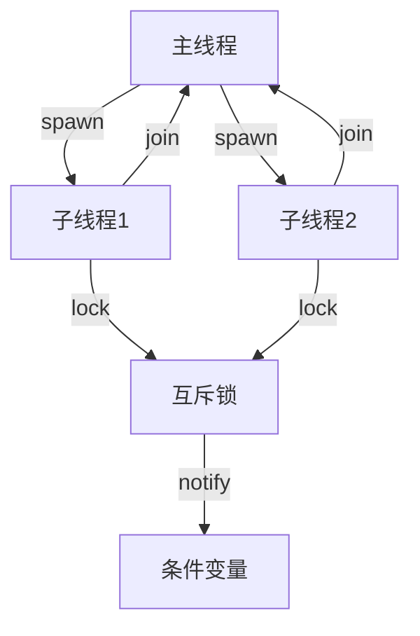

# 01. Rust 并发模型理论

## 目录

- [01. Rust 并发模型理论](#01-rust-并发模型理论)
  - [目录](#目录)
  - [1. 并发模型公理](#1-并发模型公理)
    - [1.1 基本公理](#11-基本公理)
    - [1.2 并发操作公理](#12-并发操作公理)
    - [1.3 并发模型结构图](#13-并发模型结构图)
  - [2. 线程理论](#2-线程理论)
    - [2.1 线程定义](#21-线程定义)
    - [2.2 线程操作](#22-线程操作)
    - [2.3 线程调度](#23-线程调度)
    - [2.4 工程案例与批判性分析](#24-工程案例与批判性分析)
  - [3. 同步原语理论](#3-同步原语理论)
    - [3.1 互斥锁](#31-互斥锁)
    - [3.2 读写锁](#32-读写锁)
    - [3.3 条件变量](#33-条件变量)
    - [3.4 批判性分析与工程案例](#34-批判性分析与工程案例)
  - [4. 数据竞争预防](#4-数据竞争预防)
    - [4.1 数据竞争定义](#41-数据竞争定义)
    - [4.2 所有权防止数据竞争](#42-所有权防止数据竞争)
    - [4.3 同步防止数据竞争](#43-同步防止数据竞争)
    - [4.4 工程案例与批判性分析](#44-工程案例与批判性分析)
  - [5. 内存序理论](#5-内存序理论)
    - [5.1 内存序定义](#51-内存序定义)
    - [5.2 原子操作](#52-原子操作)
    - [5.3 内存屏障](#53-内存屏障)
    - [5.4 工程案例与批判性分析](#54-工程案例与批判性分析)
  - [6. 异步编程模型](#6-异步编程模型)
    - [6.1 异步任务](#61-异步任务)
    - [6.2 异步运行时](#62-异步运行时)
    - [6.3 异步流](#63-异步流)
    - [6.4 工程案例与未来展望](#64-工程案例与未来展望)
  - [7. 并发安全证明](#7-并发安全证明)
    - [7.1 安全性质](#71-安全性质)
    - [7.2 安全证明](#72-安全证明)
    - [7.3 批判性分析](#73-批判性分析)
  - [8. 死锁预防](#8-死锁预防)
    - [8.1 死锁定义](#81-死锁定义)
    - [8.2 死锁预防策略](#82-死锁预防策略)
    - [8.3 工程案例与未来展望](#83-工程案例与未来展望)
  - [9. 性能分析](#9-性能分析)
    - [9.1 并发性能指标](#91-并发性能指标)
    - [9.2 性能优化](#92-性能优化)
    - [9.3 工程案例与批判性分析](#93-工程案例与批判性分析)
  - [10. 形式化验证](#10-形式化验证)
    - [10.1 模型检查](#101-模型检查)
    - [10.2 定理证明](#102-定理证明)
    - [10.3 工具支持](#103-工具支持)
    - [10.4 未来展望](#104-未来展望)
  - [11. 交叉引用](#11-交叉引用)
  - [参考文献](#参考文献)

---

## 1. 并发模型公理

### 1.1 基本公理

**公理 1.1** (并发存在性公理)
$$\forall p \in \text{Program}: \exists T \in \text{Thread}: \text{Executing}(p, T)$$

**公理 1.2** (线程独立性公理)
$$\forall t_1, t_2 \in \text{Thread}: t_1 \neq t_2 \Rightarrow \text{Independent}(t_1, t_2)$$

**公理 1.3** (并发安全公理)
$$\forall t_1, t_2 \in \text{Thread}: \text{SafeInteraction}(t_1, t_2)$$

- **理论基础**：并发模型以线程为基本执行单元，强调独立性与安全交互。
- **批判性分析**：理论模型假设线程独立，实际工程中存在线程间资源竞争与同步复杂性。

### 1.2 并发操作公理

**公理 1.4** (原子性公理)
$$\text{Atomic}(op) \Rightarrow \text{Uninterruptible}(op)$$

**公理 1.5** (可见性公理)
$$\text{Visible}(op) \Rightarrow \text{Observed}(op)$$

- **工程案例**：原子操作、内存屏障、同步原语。

### 1.3 并发模型结构图



---

## 2. 线程理论

### 2.1 线程定义

**定义 2.1** (线程)
$$\text{Thread} = \text{ExecutionContext} \times \text{Stack} \times \text{ProgramCounter}$$

**定义 2.2** (线程状态)
$$\text{ThreadState} = \{\text{Running}, \text{Blocked}, \text{Ready}, \text{Terminated}\}$$

### 2.2 线程操作

**定义 2.3** (线程创建)
$$\text{Spawn}(f) \Rightarrow \exists t \in \text{Thread}: \text{Execute}(t, f)$$

**定义 2.4** (线程连接)
$$\text{Join}(t) \Rightarrow \text{Wait}(t) \land \text{GetResult}(t)$$

### 2.3 线程调度

**算法 2.1** (线程调度)

```rust
fn schedule_threads(threads: &mut Vec<Thread>) {
    loop {
        for thread in threads.iter_mut() {
            if thread.is_ready() {
                thread.execute();
                if thread.is_blocked() {
                    thread.yield_control();
                }
            }
        }
    }
}
```

### 2.4 工程案例与批判性分析

- **工程案例**：Rust std::thread::spawn、join、线程池 rayon。
- **批判性分析**：Rust 线程模型简化了线程创建与管理，但线程生命周期与资源释放需谨慎处理。

---

## 3. 同步原语理论

### 3.1 互斥锁

**定义 3.1** (互斥锁)
$$\text{Mutex}[T] = \text{Lock} \times \text{ProtectedData}[T]$$

**定义 3.2** (锁操作)
$$\text{Lock}(m) \Rightarrow \text{Acquire}(m) \land \text{Exclusive}(m)$$
$$\text{Unlock}(m) \Rightarrow \text{Release}(m) \land \text{Free}(m)$$

**算法 3.1** (互斥锁实现)

```rust
struct Mutex<T> {
    locked: AtomicBool,
    data: UnsafeCell<T>,
}

impl<T> Mutex<T> {
    fn lock(&self) -> MutexGuard<T> {
        while self.locked.compare_exchange_weak(
            false, true, 
            Ordering::Acquire, 
            Ordering::Relaxed
        ).is_err() {
            // 自旋等待
            std::hint::spin_loop();
        }
        MutexGuard { mutex: self }
    }
}
```

### 3.2 读写锁

**定义 3.3** (读写锁)
$$\text{RwLock}[T] = \text{ReadLock} \times \text{WriteLock} \times \text{ProtectedData}[T]$$

**定义 3.4** (读写锁规则)
$$\text{ReadLock}(r) \Rightarrow \text{Shared}(r)$$
$$\text{WriteLock}(r) \Rightarrow \text{Exclusive}(r)$$

### 3.3 条件变量

**定义 3.5** (条件变量)
$$\text{CondVar} = \text{WaitQueue} \times \text{Predicate}$$

**算法 3.2** (条件变量使用)

```rust
fn producer_consumer() {
    let mutex = Mutex::new(Vec::new());
    let condvar = Condvar::new();
    
    // 生产者
    let producer = thread::spawn(|| {
        let mut data = mutex.lock().unwrap();
        data.push(42);
        condvar.notify_one();
    });
    
    // 消费者
    let consumer = thread::spawn(|| {
        let mut data = mutex.lock().unwrap();
        while data.is_empty() {
            data = condvar.wait(data).unwrap();
        }
        data.pop();
    });
}
```

### 3.4 批判性分析与工程案例

- **工程案例**：std::sync::Mutex、RwLock、Condvar、parking_lot。
- **批判性分析**：同步原语可防止数据竞争，但易引入死锁与性能瓶颈。

---

## 4. 数据竞争预防

### 4.1 数据竞争定义

**定义 4.1** (数据竞争)
$$\text{DataRace}(t_1, t_2, v) = \text{Concurrent}(t_1, t_2) \land \text{Access}(t_1, v) \land \text{Access}(t_2, v) \land \text{OneWrite}(t_1, t_2, v)$$

**定义 4.2** (无数据竞争)
$$\text{NoDataRace}(p) = \forall t_1, t_2, v: \neg \text{DataRace}(t_1, t_2, v)$$

### 4.2 所有权防止数据竞争

**定理 4.1** (所有权数据竞争预防)
$$\text{OwnershipSafe}(p) \Rightarrow \text{NoDataRace}(p)$$

**证明**：

1. 所有权系统保证每个值有唯一所有者
2. 借用系统防止并发可变访问
3. 证毕

### 4.3 同步防止数据竞争

**定理 4.2** (同步数据竞争预防)
$$\text{ProperlySynchronized}(p) \Rightarrow \text{NoDataRace}(p)$$

### 4.4 工程案例与批判性分析

- **工程案例**：Send/Sync trait、`Arc<Mutex<T>>`、多线程安全容器。
- **批判性分析**：Rust 静态检查可消除绝大多数数据竞争，但复杂同步场景仍需工程师谨慎设计。

---

## 5. 内存序理论

### 5.1 内存序定义

**定义 5.1** (内存序)
$$\text{MemoryOrder} = \{\text{Relaxed}, \text{Acquire}, \text{Release}, \text{AcqRel}, \text{SeqCst}\}$$

**定义 5.2** (内存序关系)
$$\text{Relaxed} \prec \text{Acquire} \prec \text{Release} \prec \text{AcqRel} \prec \text{SeqCst}$$

### 5.2 原子操作

**定义 5.3** (原子类型)
$$\text{Atomic}[T] = \text{Uninterruptible}[T] \times \text{MemoryOrder}$$

**算法 5.1** (原子操作)

```rust
use std::sync::atomic::{AtomicUsize, Ordering};

let counter = AtomicUsize::new(0);

// 原子递增
counter.fetch_add(1, Ordering::SeqCst);

// 原子比较交换
let old_value = counter.compare_exchange(
    0, 1, 
    Ordering::Acquire, 
    Ordering::Relaxed
);
```

### 5.3 内存屏障

**定义 5.4** (内存屏障)
$$\text{MemoryBarrier} = \text{Ordering}[\text{MemoryAccess}]$$

**算法 5.2** (内存屏障使用)

```rust
use std::sync::atomic::{fence, Ordering};

// 发布-订阅模式
let data = 42;
let ready = AtomicBool::new(false);

// 发布者
data.store(42, Ordering::Relaxed);
fence(Ordering::Release);
ready.store(true, Ordering::Relaxed);

// 订阅者
if ready.load(Ordering::Acquire) {
    fence(Ordering::Acquire);
    let value = data.load(Ordering::Relaxed);
}
```

### 5.4 工程案例与批判性分析

- **工程案例**：AtomicUsize、AtomicBool、fence、发布-订阅模式。
- **批判性分析**：内存序与原子操作为高性能并发提供基础，但易用性与正确性需权衡。

---

## 6. 异步编程模型

### 6.1 异步任务

**定义 6.1** (异步任务)
$$\text{AsyncTask} = \text{Future} \times \text{Executor}$$

**定义 6.2** (Future trait)

```rust
trait Future {
    type Output;
    fn poll(self: Pin<&mut Self>, cx: &mut Context<'_>) -> Poll<Self::Output>;
}
```

### 6.2 异步运行时

**定义 6.3** (异步运行时)
$$\text{AsyncRuntime} = \text{Executor} \times \text{Reactor} \times \text{TaskQueue}$$

**算法 6.1** (异步执行)

```rust
async fn async_function() -> i32 {
    // 异步操作
    let result = some_async_operation().await;
    result + 1
}

#[tokio::main]
async fn main() {
    let result = async_function().await;
    println!("Result: {}", result);
}
```

### 6.3 异步流

**定义 6.4** (异步流)
$$\text{AsyncStream}[T] = \text{Stream}[T] \times \text{AsyncIterator}$$

**算法 6.2** (异步流处理)

```rust
use tokio_stream::{self, StreamExt};

async fn process_stream() {
    let mut stream = tokio_stream::iter(1..=10);
    
    while let Some(value) = stream.next().await {
        println!("Processing: {}", value);
    }
}
```

### 6.4 工程案例与未来展望

- **工程案例**：Tokio、async-std、Futures crate。
- **未来展望**：Rust 异步生态持续发展，异步与并发模型深度融合。

---

## 7. 并发安全证明

### 7.1 安全性质

**性质 7.1** (线程安全)
$$\forall t \in \text{Thread}: \text{Safe}(t)$$

**性质 7.2** (数据一致性)
$$\forall v \in \text{Value}: \text{Consistent}(v)$$

**性质 7.3** (无死锁)
$$\forall t_1, t_2 \in \text{Thread}: \neg \text{Deadlock}(t_1, t_2)$$

### 7.2 安全证明

**定理 7.1** (并发安全)
$$\text{OwnershipSafe}(p) \land \text{ProperlySynchronized}(p) \Rightarrow \text{ConcurrentSafe}(p)$$

**证明**：

1. 所有权系统防止数据竞争
2. 同步原语保证正确交互
3. 证毕

### 7.3 批判性分析

- **理论基础**：Rust 并发安全性依赖于类型系统与所有权模型。
- **批判性分析**：理论安全性依赖于工程实现的正确性，复杂场景下仍需形式化验证。

---

## 8. 死锁预防

### 8.1 死锁定义

**定义 8.1** (死锁)
$$\text{Deadlock}(t_1, t_2) = \text{Waiting}(t_1, t_2) \land \text{Waiting}(t_2, t_1)$$

### 8.2 死锁预防策略

**策略 8.1** (资源排序)
$$\text{ResourceOrdering} = \text{TotalOrder}[\text{Resource}]$$

**策略 8.2** (超时机制)
$$\text{Timeout}(op) = \text{Wait}(op, t) \land \text{Timeout}(t)$$

**算法 8.1** (死锁预防)

```rust
fn safe_lock_ordering(mutex1: &Mutex<i32>, mutex2: &Mutex<i32>) {
    // 按地址排序锁定
    let (first, second) = if (mutex1 as *const _) < (mutex2 as *const _) {
        (mutex1, mutex2)
    } else {
        (mutex2, mutex1)
    };
    
    let _lock1 = first.lock();
    let _lock2 = second.lock();
    // 安全操作
}
```

### 8.3 工程案例与未来展望

- **工程案例**：多资源加锁、死锁检测工具。
- **未来展望**：Rust 死锁预防机制与静态分析工具将持续完善。

---

## 9. 性能分析

### 9.1 并发性能指标

**定义 9.1** (吞吐量)
$$\text{Throughput} = \frac{\text{CompletedTasks}}{\text{Time}}$$

**定义 9.2** (延迟)
$$\text{Latency} = \text{ResponseTime} - \text{RequestTime}$$

**定义 9.3** (可扩展性)
$$\text{Scalability} = \frac{\text{Performance}(n)}{\text{Performance}(1)}$$

### 9.2 性能优化

**策略 9.1** (减少锁竞争)
$$\text{ReduceContention} = \text{FineGrainedLocking} \cup \text{LockFreeDataStructures}$$

**策略 9.2** (提高并行度)
$$\text{IncreaseParallelism} = \text{TaskDecomposition} \cup \text{DataParallelism}$$

### 9.3 工程案例与批判性分析

- **工程案例**：rayon 并行计算、crossbeam、lock-free 队列。
- **批判性分析**：高并发优化需权衡可维护性与复杂度。

---

## 10. 形式化验证

### 10.1 模型检查

**方法 10.1** (模型检查)
$$\text{ModelChecking}: \text{ConcurrentProgram} \rightarrow \text{SafetyProperties}$$

### 10.2 定理证明

**方法 10.2** (定理证明)
$$\text{TheoremProving}: \text{ConcurrentProgram} \rightarrow \text{CorrectnessProof}$$

### 10.3 工具支持

**工具 10.1** (形式化验证工具)

- TLA+
- SPIN
- CBMC
- RustBelt

### 10.4 未来展望

- **理论基础**：形式化验证为并发安全提供数学保障。
- **未来展望**：Rust 并发模型的形式化工具链将持续丰富。

---

## 11. 交叉引用

- [类型系统理论](../../02_type_system/01_type_theory_foundations.md)
- [所有权系统理论](../04_ownership_system/01_ownership_theory.md)
- [内存模型理论](../03_memory_model/01_memory_model_theory.md)
- [变量系统理论](../01_variable_system/index.md)

---

## 参考文献

1. "The Rust Programming Language" - Concurrency
2. "Rust Reference Manual" - Memory Model
3. "The Art of Multiprocessor Programming" - Maurice Herlihy, Nir Shavit
4. "Concurrent Programming in Java" - Doug Lea
5. "Principles of Concurrent and Distributed Programming" - M. Ben-Ari

---

> 本文档持续更新，欢迎补充并发模型理论与工程案例。
