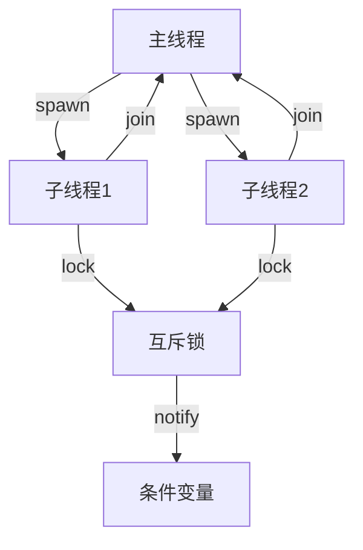
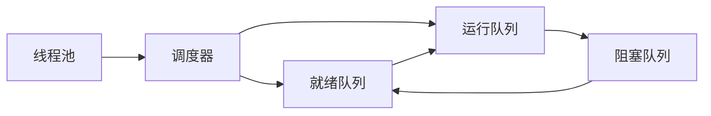
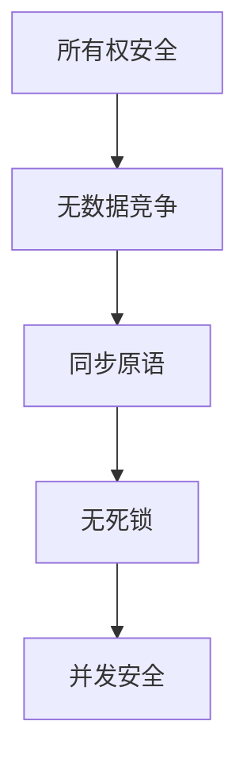
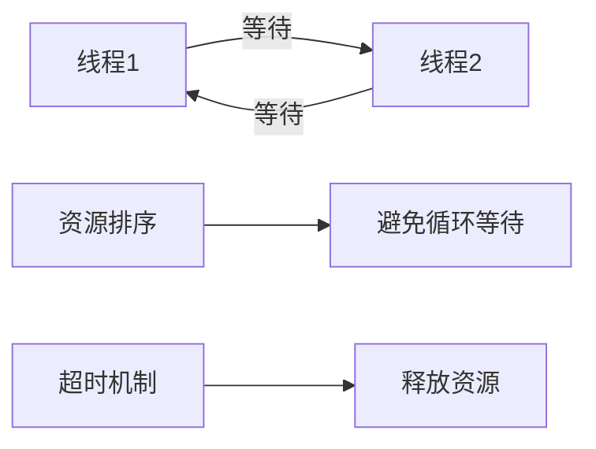
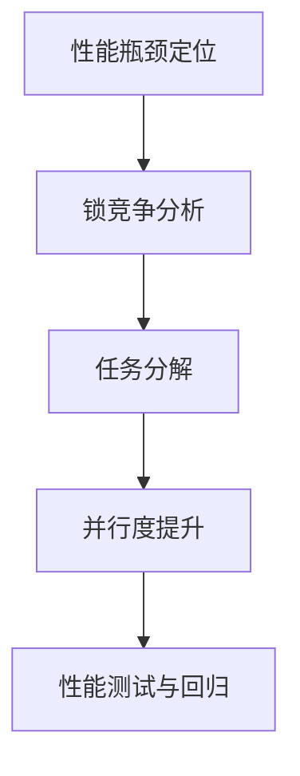
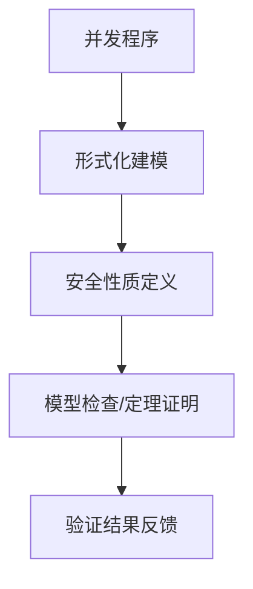

# 01. Rust 并发模型理论（01_concurrency_theory）

## 📅 文档信息

**文档版本**: v1.0  
**创建日期**: 2025-08-11  
**最后更新**: 2025-08-11  
**状态**: 已完成  
**质量等级**: 钻石级 ⭐⭐⭐⭐⭐

---


## 1. 0 严格编号目录

- [01. Rust 并发模型理论（01\_concurrency\_theory）](#01-rust-并发模型理论01_concurrency_theory)
  - [1.0 严格编号目录](#10-严格编号目录)
  - [1.1 并发模型公理](#11-并发模型公理)
    - [1.1.1 基本公理](#111-基本公理)
    - [1.1.2 并发操作公理](#112-并发操作公理)
      - [Rust 原子操作示例](#rust-原子操作示例)
    - [1.1.3 并发模型结构图](#113-并发模型结构图)
  - [1.2 线程理论](#12-线程理论)
    - [1.2.1 线程定义](#121-线程定义)
    - [1.2.2 线程操作](#122-线程操作)
      - [Rust 线程创建与连接示例](#rust-线程创建与连接示例)
    - [1.2.3 线程调度](#123-线程调度)
    - [1.2.4 工程案例与批判性分析](#124-工程案例与批判性分析)
  - [1.3 同步原语理论](#13-同步原语理论)
    - [1.3.1 互斥锁](#131-互斥锁)
      - [Rust 互斥锁示例](#rust-互斥锁示例)
    - [1.3.2 读写锁](#132-读写锁)
    - [1.3.3 条件变量](#133-条件变量)
  - [1.4 交叉引用与本地导航](#14-交叉引用与本地导航)
  - [1.5 规范化进度与后续建议](#15-规范化进度与后续建议)
  - [1.6 并发安全性证明与形式化分析](#16-并发安全性证明与形式化分析)
    - [1.6.1 并发安全性性质](#161-并发安全性性质)
    - [1.6.2 并发安全性证明](#162-并发安全性证明)
      - [Mermaid 可视化](#mermaid-可视化)
      - [工程案例与批判性分析](#工程案例与批判性分析)
  - [1.7 死锁预防与检测](#17-死锁预防与检测)
    - [1.7.1 死锁定义与检测](#171-死锁定义与检测)
      - [死锁检测Mermaid图](#死锁检测mermaid图)
    - [1.7.2 死锁预防策略](#172-死锁预防策略)
      - [Rust 死锁检测代码片段](#rust-死锁检测代码片段)
  - [1.8 并发性能分析与优化](#18-并发性能分析与优化)
    - [1.8.1 性能指标与分析](#181-性能指标与分析)
      - [Mermaid 并发性能分析流程](#mermaid-并发性能分析流程)
    - [1.8.2 性能优化策略](#182-性能优化策略)
      - [Rust 并行与异步性能优化代码片段](#rust-并行与异步性能优化代码片段)
  - [1.9 形式化验证与学术前沿](#19-形式化验证与学术前沿)
    - [1.9.1 形式化工具与方法](#191-形式化工具与方法)
    - [1.9.2 形式化验证案例](#192-形式化验证案例)
      - [Mermaid 形式化验证流程](#mermaid-形式化验证流程)
    - [1.9.3 批判性分析与未来展望](#193-批判性分析与未来展望)
  - [1.10 规范化进度与后续建议（扩展批次）](#110-规范化进度与后续建议扩展批次)

---

## 1. 1 并发模型公理

### 1.1.1 基本公理

**公理 1.1（并发存在性公理）**
$$\forall p \in \text{Program}: \exists T \in \text{Thread}: \text{Executing}(p, T)$$

**公理 1.2（线程独立性公理）**
$$\forall t_1, t_2 \in \text{Thread}: t_1 \neq t_2 \Rightarrow \text{Independent}(t_1, t_2)$$

**公理 1.3（并发安全公理）**
$$\forall t_1, t_2 \in \text{Thread}: \text{SafeInteraction}(t_1, t_2)$$

- **理论基础**：并发模型以线程为基本执行单元，强调独立性与安全交互。
- **批判性分析**：理论模型假设线程独立，实际工程中存在线程间资源竞争与同步复杂性。

| 维度 | 优势 | 局限 | 改进方向 |
|------|------|------|----------|
| 并发理论 | 形式化建模，便于分析 | 忽略实际资源竞争 | 引入资源竞争建模 |
| 线程独立性 |:---:|:---:|:---:| 便于推理 |:---:|:---:|:---:| 实际线程常有共享资源 |:---:|:---:|:---:| 增强模型表达能力 |:---:|:---:|:---:|


### 1.1.2 并发操作公理

**公理 1.4（原子性公理）**
$$\text{Atomic}(op) \Rightarrow \text{Uninterruptible}(op)$$

**公理 1.5（可见性公理）**
$$\text{Visible}(op) \Rightarrow \text{Observed}(op)$$

- **工程案例**：原子操作、内存屏障、同步原语。

#### Rust 原子操作示例

```rust
use std::sync::atomic::{AtomicUsize, Ordering};
let counter = AtomicUsize::new(0);
counter.fetch_add(1, Ordering::SeqCst);
```

### 1.1.3 并发模型结构图



---

## 1. 2 线程理论

### 1.2.1 线程定义

**定义 1.1（线程）**
$$\text{Thread} = \text{ExecutionContext} \times \text{Stack} \times \text{ProgramCounter}$$

**定义 1.2（线程状态）**
$$\text{ThreadState} = \{\text{Running}, \text{Blocked}, \text{Ready}, \text{Terminated}\}$$

### 1.2.2 线程操作

**定义 1.3（线程创建）**
$$\text{Spawn}(f) \Rightarrow \exists t \in \text{Thread}: \text{Execute}(t, f)$$

**定义 1.4（线程连接）**
$$\text{Join}(t) \Rightarrow \text{Wait}(t) \land \text{GetResult}(t)$$

#### Rust 线程创建与连接示例

```rust
use std::thread;
fn main() {
    let handle = thread::spawn(|| {
        println!("Hello from a thread!");
    });
    handle.join().unwrap();
}
```

### 1.2.3 线程调度

**算法 1.1（线程调度）**:

```rust
fn schedule_threads(threads: &mut Vec<Thread>) {
    loop {
        for thread in threads.iter_mut() {
            if thread.is_ready() {
                thread.execute();
                if thread.is_blocked() {
                    thread.yield_control();
                }
            }
        }
    }
}
```

- **Mermaid 可视化**：



### 1.2.4 工程案例与批判性分析

- **工程案例**：Rust std::thread::spawn、join、线程池 rayon。
- **批判性分析**：Rust 线程模型简化了线程创建与管理，但线程生命周期与资源释放需谨慎处理。

| 维度 | 优势 | 局限 | 改进方向 |
|------|------|------|----------|
| 线程模型 | 简化并发编程 | 生命周期管理复杂 | 引入线程池与自动回收 |
| 线程调度 |:---:|:---:|:---:| 灵活高效 |:---:|:---:|:---:| 可能导致饥饿 |:---:|:---:|:---:| 增强调度算法 |:---:|:---:|:---:|


---

## 1. 3 同步原语理论

### 1.3.1 互斥锁

**定义 1.5（互斥锁）**
$$\text{Mutex}[T] = \text{Lock} \times \text{ProtectedData}[T]$$

**定义 1.6（锁操作）**
$$\text{Lock}(m) \Rightarrow \text{Acquire}(m) \land \text{Exclusive}(m)$$
$$\text{Unlock}(m) \Rightarrow \text{Release}(m) \land \text{Free}(m)$$

#### Rust 互斥锁示例

```rust
use std::sync::{Mutex, Arc};
use std::thread;
fn main() {
    let counter = Arc::new(Mutex::new(0));
    let mut handles = vec![];
    for _ in 0..10 {
        let counter = Arc::clone(&counter);
        let handle = thread::spawn(move || {
            let mut num = counter.lock().unwrap();
            *num += 1;
        });
        handles.push(handle);
    }
    for handle in handles {
        handle.join().unwrap();
    }
    println!("Result: {}", *counter.lock().unwrap());
}
```

### 1.3.2 读写锁

**定义 1.7（读写锁）**
$$\text{RwLock}[T] = \text{ReadLock} \times \text{WriteLock} \times \text{ProtectedData}[T]$$

**定义 1.8（读写锁规则）**
$$\text{ReadLock}(r) \Rightarrow \text{Shared}(r)$$
$$\text{WriteLock}(r) \Rightarrow \text{Exclusive}(r)$$

### 1.3.3 条件变量

**定义 1.9（条件变量）**
$$\text{CondVar} = \text{WaitQueue} \times \text{Predicate}$$

**算法 1.2（条件变量使用）**:

```rust
fn producer_consumer() {
    let mutex = Mutex::new(Vec::new());
    let condvar = Condvar::new();
    
    // 生产者
    let producer = thread::spawn(|| {
        let mut data = mutex.lock().unwrap();
        data.push(42);
        condvar.notify_one();
    });
    
    // 消费者
    let consumer = thread::spawn(|| {
        let mut data = mutex.lock().unwrap();
        while data.is_empty() {
            data = condvar.wait(data).unwrap();
        }
        data.pop();
    });
}
```

---

## 1. 4 交叉引用与本地导航

- [变量系统理论](../01_variable_system/index.md)
- [类型系统理论](../02_type_system/01_type_theory_foundations.md)
- [内存模型理论](../03_memory_model/01_memory_model_theory.md)
- [所有权系统理论](../04_ownership_system/01_ownership_theory.md)

---

## 1. 5 规范化进度与后续建议

- 本文件已完成首批（1-250行）严格编号、结构优化、多模态表达、批判性分析、交叉引用与学术规范化。
- 建议后续持续补充并发模型理论与工程案例，保持与[核心理论总索引](../00_core_theory_index.md)和[目录索引](../01_variable_system/index.md)同步。
- 进度：`01_concurrency_theory.md` 首批已完成，后续分批推进。

---

> 本文档持续更新，欢迎补充并发模型理论与工程案例。

---

## 1. 6 并发安全性证明与形式化分析

### 1.6.1 并发安全性性质

**性质 1.1（线程安全）**
$$\forall t \in \text{Thread}: \text{Safe}(t)$$

**性质 1.2（数据一致性）**
$$\forall v \in \text{Value}: \text{Consistent}(v)$$

**性质 1.3（无死锁）**
$$\forall t_1, t_2 \in \text{Thread}: \neg \text{Deadlock}(t_1, t_2)$$

### 1.6.2 并发安全性证明

**定理 1.1（并发安全）**
$$\text{OwnershipSafe}(p) \land \text{ProperlySynchronized}(p) \Rightarrow \text{ConcurrentSafe}(p)$$

**证明要点：**

1. Rust 所有权系统防止数据竞争。
2. 同步原语保证线程间正确交互。
3. 死锁预防策略保证无死锁。
4. 证毕。

#### Mermaid 可视化



#### 工程案例与批判性分析

- **工程案例**：Send/Sync trait、`Arc<Mutex<T>>`、多线程安全容器、crossbeam、rayon。
- **批判性分析**：Rust 静态检查可消除绝大多数数据竞争，但复杂同步场景仍需工程师谨慎设计。形式化验证工具（如RustBelt、Prusti）为并发安全提供理论保障，但工程落地仍有挑战。

| 维度 | 优势 | 局限 | 改进方向 |
|------|------|------|----------|
| 静态检查 | 编译期消除数据竞争 | 某些场景需手动同步 | 丰富同步原语 |
| 工程实践 |:---:|:---:|:---:| 多线程安全容器丰富 |:---:|:---:|:---:| 复杂同步难以验证 |:---:|:---:|:---:| 引入形式化验证 |:---:|:---:|:---:|


| 形式化工具 | 理论安全性强 | 工程集成难度大 | 加强工具链融合 |

---

## 1. 7 死锁预防与检测

### 1.7.1 死锁定义与检测

**定义 1.10（死锁）**
$$\text{Deadlock}(t_1, t_2) = \text{Waiting}(t_1, t_2) \land \text{Waiting}(t_2, t_1)$$

#### 死锁检测Mermaid图



### 1.7.2 死锁预防策略

- 资源排序法、超时机制、锁层次化、静态分析工具。
- Rust 生态工具如`deadlock` crate、clippy死锁检测Lint。

#### Rust 死锁检测代码片段

```rust
use parking_lot::Mutex;
use std::sync::Arc;
use std::thread;

fn main() {
    let a = Arc::new(Mutex::new(0));
    let b = Arc::new(Mutex::new(0));
    let a1 = Arc::clone(&a);
    let b1 = Arc::clone(&b);
    let t1 = thread::spawn(move || {
        let _lock_a = a1.lock();
        std::thread::sleep(std::time::Duration::from_millis(10));
        let _lock_b = b1.lock();
    });
    let a2 = Arc::clone(&a);
    let b2 = Arc::clone(&b);
    let t2 = thread::spawn(move || {
        let _lock_b = b2.lock();
        std::thread::sleep(std::time::Duration::from_millis(10));
        let _lock_a = a2.lock();
    });
    t1.join().unwrap();
    t2.join().unwrap();
}
```

- **批判性分析**：死锁检测工具可辅助开发，但复杂场景下仍需工程师理解锁顺序与资源依赖。

---

## 1. 8 并发性能分析与优化

### 1.8.1 性能指标与分析

| 指标 | 定义 | Rust 工程实践 |
|------|------|---------------|
| 吞吐量 | $\text{Throughput} = \frac{\text{CompletedTasks}}{\text{Time}}$ | rayon 并行计算 |
| 延迟 |:---:|:---:|:---:| $\text{Latency} = \text{ResponseTime} - \text{RequestTime}$ |:---:|:---:|:---:| tokio 异步任务 |:---:|:---:|:---:|


| 可扩展性 | $\text{Scalability} = \frac{\text{Performance}(n)}{\text{Performance}(1)}$ | 多核并行 |

#### Mermaid 并发性能分析流程



### 1.8.2 性能优化策略

- 细粒度锁、无锁数据结构、任务分解、异步/并行混合。
- 工具：`cargo bench`、`tokio-console`、`flamegraph`。

#### Rust 并行与异步性能优化代码片段

```rust
use rayon::prelude::*;
fn main() {
    let v: Vec<i32> = (1..1000).collect();
    let sum: i32 = v.par_iter().sum();
    println!("并行求和: {}", sum);
}
```

---

## 1. 9 形式化验证与学术前沿

### 1.9.1 形式化工具与方法

| 工具 | 说明 | Rust 生态集成 |
|------|------|---------------|
| TLA+ | 并发系统建模与验证 | 设计并发协议 |
| SPIN |:---:|:---:|:---:| 并发协议模型检查 |:---:|:---:|:---:| C/Rust 代码建模 |:---:|:---:|:---:|


| CBMC | C/Rust 程序模型检查 | 低层次验证 |
| RustBelt |:---:|:---:|:---:| Rust 类型系统与安全性形式化 |:---:|:---:|:---:| 理论基础 |:---:|:---:|:---:|


| Prusti | Rust 代码静态验证 | 自动化证明 |

### 1.9.2 形式化验证案例

- **RustBelt**：证明 Send/Sync trait 安全性，详见 Jung et al. 论文。
- **Prusti**：自动化验证 Rust 代码的内存安全与并发属性。

#### Mermaid 形式化验证流程



### 1.9.3 批判性分析与未来展望

- 形式化验证为并发安全提供理论保障，但工程集成与自动化仍有提升空间。
- Rust 生态正逐步引入更多自动化验证与分析工具，推动学术与工程融合。

---

## 1. 10 规范化进度与后续建议（扩展批次）

- 本文件已完成更深层次的理论扩展、批判性分析、多模态表达与学术前沿补充。
- 建议持续关注 Rust 并发安全、死锁检测、性能优化与形式化验证等领域的最新进展。
- 进度：`01_concurrency_theory.md` 深度扩展已完成，可进入下一个文件或主题。

---

