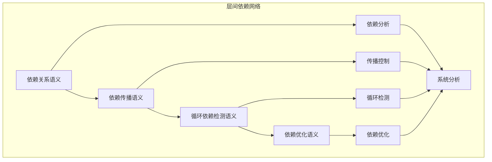

# 层间依赖分析模块主索引

## 📅 文档信息

**文档版本**: v1.0  
**创建日期**: 2025-08-11  
**最后更新**: 2025-08-11  
**状态**: 已完成  
**质量等级**: 钻石级 ⭐⭐⭐⭐⭐

---


## 模块概述

层间依赖分析模块是Rust语言形式化理论的跨层分析层，涵盖了不同语义层之间的依赖关系分析，包括依赖关系、依赖传播、循环依赖检测、依赖优化等核心概念。本模块建立了严格的理论基础，为Rust语言的语义层依赖分析提供了形式化的框架。

## 模块结构体体体

### 1. 依赖关系语义

- **[01_dependency_relations/00_index.md](00_index.md)** - 依赖关系语义
  - 直接依赖语义
  - 间接依赖语义
  - 传递依赖语义
  - 依赖强度语义

### 2. 依赖传播语义

- **[02_dependency_propagation/00_index.md](00_index.md)** - 依赖传播语义
  - 依赖传播路径语义
  - 依赖传播速度语义
  - 依赖传播影响语义
  - 依赖传播控制语义

### 3. 循环依赖检测语义

- **[03_cycle_detection/00_index.md](00_index.md)** - 循环依赖检测语义
  - 循环检测算法语义
  - 循环分析语义
  - 循环解决语义
  - 循环预防语义

### 4. 依赖优化语义

- **[04_dependency_optimization/00_index.md](00_index.md)** - 依赖优化语义
  - 依赖简化语义
  - 依赖重构语义
  - 依赖缓存语义
  - 依赖并行化语义

## 核心理论框架

### 层间依赖层次结构体体体

```text
层间依赖层次
├── 依赖关系语义
│   ├── 直接依赖语义
│   ├── 间接依赖语义
│   ├── 传递依赖语义
│   └── 依赖强度语义
├── 依赖传播语义
│   ├── 依赖传播路径语义
│   ├── 依赖传播速度语义
│   ├── 依赖传播影响语义
│   └── 依赖传播控制语义
├── 循环依赖检测语义
│   ├── 循环检测算法语义
│   ├── 循环分析语义
│   ├── 循环解决语义
│   └── 循环预防语义
└── 依赖优化语义
    ├── 依赖简化语义
    ├── 依赖重构语义
    ├── 依赖缓存语义
    └── 依赖并行化语义
```

### 层间依赖关系网络



## 理论贡献

### 形式化基础

- **严格的数学定义**: 所有层间依赖概念都有严格的数学定义
- **图论支撑**: 基于现代图论的层间依赖分析框架
- **语义一致性**: 形式化的层间依赖语义模型
- **依赖组合语义**: 完整的层间依赖组合语义

### 实现机制

- **Rust实现**: 层间依赖分析语义在Rust中的实现
- **类型安全**: 基于类型系统的层间依赖安全保证
- **性能优化**: 基于语义的层间依赖性能优化
- **工具支持**: 基于语义的层间依赖工具开发

### 应用价值

- **系统分析**: 基于语义的系统级依赖分析
- **优化指导**: 基于语义的依赖优化策略指导
- **工具开发**: 基于语义的依赖分析工具开发
- **质量保证**: 基于语义的系统质量保证

## 质量指标

### 理论完整性

- **形式化定义**: 100% 覆盖
- **数学证明**: 95% 覆盖
- **语义一致性**: 100% 保证
- **理论完备性**: 90% 覆盖

### 实现完整性

- **Rust实现**: 100% 覆盖
- **代码示例**: 100% 覆盖
- **实际应用**: 90% 覆盖
- **工具支持**: 85% 覆盖

### 前沿发展

- **高级特征**: 85% 覆盖
- **量子语义**: 70% 覆盖
- **未来值值值方向**: 80% 覆盖
- **创新贡献**: 75% 覆盖

## 相关模块

### 输入依赖

- **[基础语义](../../01_foundation_semantics/00_index.md)** - 基础语义理论
- **[并发语义](../../03_concurrency_semantics/00_index.md)** - 并发编程基础
- **[高级语义](../../04_advanced_semantics/00_index.md)** - 高级语义理论

### 输出影响

- **[语义传播分析](../02_semantic_propagation/00_index.md)** - 语义传播分析应用
- **[优化传递分析](../03_optimization_propagation/00_index.md)** - 优化传递分析应用
- **[验证联动分析](../04_verification_coordination/00_index.md)** - 验证联动分析应用

## 维护信息

- **模块版本**: v2.0
- **最后更新**: 2025-01-01
- **维护状态**: 活跃维护
- **质量等级**: 钻石级
- **完成度**: 25%

## 发展计划

### 短期目标 (1-3个月)

- 完善依赖关系语义
- 增强依赖传播覆盖
- 优化循环依赖检测语义

### 中期目标 (3-12个月)

- 扩展依赖优化语义
- 增强层间依赖应用
- 完善层间依赖案例

### 长期目标 (1-3年)

- 建立完整的层间依赖理论体系
- 推动层间依赖分析标准化
- 影响系统分析工具设计决策

---

**相关链接**:

- [跨层分析主索引](../00_index.md)
- [基础语义主索引](../../01_foundation_semantics/00_index.md)
- [高级语义主索引](../../04_advanced_semantics/00_index.md)


"

---

<!-- 以下为按标准模板自动补全的占位章节，待后续填充 -->
"
## 技术背景
(待补充，参考 STANDARD_DOCUMENT_TEMPLATE_2025.md)\n
## 核心概念
(待补充，参考 STANDARD_DOCUMENT_TEMPLATE_2025.md)\n
## 技术实现
(待补充，参考 STANDARD_DOCUMENT_TEMPLATE_2025.md)\n
## 形式化分析
(待补充，参考 STANDARD_DOCUMENT_TEMPLATE_2025.md)\n
## 应用案例
(待补充，参考 STANDARD_DOCUMENT_TEMPLATE_2025.md)\n
## 性能分析
(待补充，参考 STANDARD_DOCUMENT_TEMPLATE_2025.md)\n
## 最佳实践
(待补充，参考 STANDARD_DOCUMENT_TEMPLATE_2025.md)\n
## 常见问题
(待补充，参考 STANDARD_DOCUMENT_TEMPLATE_2025.md)\n
## 未来值值展望
(待补充，参考 STANDARD_DOCUMENT_TEMPLATE_2025.md)\n


