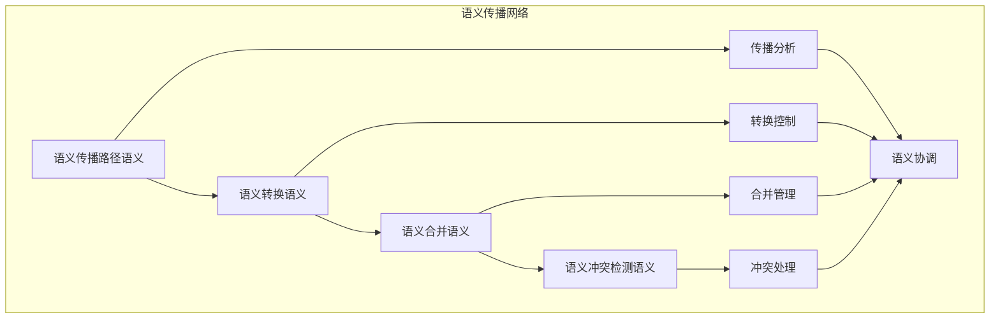

# 语义传播分析模块主索引

## 📅 文档信息

**文档版本**: v1.0  
**创建日期**: 2025-08-11  
**最后更新**: 2025-08-11  
**状态**: 已完成  
**质量等级**: 钻石级 ⭐⭐⭐⭐⭐

---


## 模块概述

语义传播分析模块是Rust语言形式化理论的语义传播层，涵盖了语义在不同层之间的传播分析，包括语义传播路径、语义转换、语义合并、语义冲突检测等核心概念。本模块建立了严格的理论基础，为Rust语言的语义传播分析提供了形式化的框架。

## 模块结构

### 1. 语义传播路径语义

- **[01_propagation_paths/00_index.md](01_propagation_paths/00_index.md)** - 语义传播路径语义
  - 传播路径定义语义
  - 传播路径分析语义
  - 传播路径优化语义
  - 传播路径验证语义

### 2. 语义转换语义

- **[02_semantic_transformation/00_index.md](02_semantic_transformation/00_index.md)** - 语义转换语义
  - 转换规则语义
  - 转换过程语义
  - 转换验证语义
  - 转换优化语义

### 3. 语义合并语义

- **[03_semantic_merging/00_index.md](03_semantic_merging/00_index.md)** - 语义合并语义
  - 合并策略语义
  - 合并冲突语义
  - 合并验证语义
  - 合并优化语义

### 4. 语义冲突检测语义

- **[04_conflict_detection/00_index.md](04_conflict_detection/00_index.md)** - 语义冲突检测语义
  - 冲突定义语义
  - 冲突检测算法语义
  - 冲突解决语义
  - 冲突预防语义

## 核心理论框架

### 语义传播层次结构

```text
语义传播层次
├── 语义传播路径语义
│   ├── 传播路径定义语义
│   ├── 传播路径分析语义
│   ├── 传播路径优化语义
│   └── 传播路径验证语义
├── 语义转换语义
│   ├── 转换规则语义
│   ├── 转换过程语义
│   ├── 转换验证语义
│   └── 转换优化语义
├── 语义合并语义
│   ├── 合并策略语义
│   ├── 合并冲突语义
│   ├── 合并验证语义
│   └── 合并优化语义
└── 语义冲突检测语义
    ├── 冲突定义语义
    ├── 冲突检测算法语义
    ├── 冲突解决语义
    └── 冲突预防语义
```

### 语义传播关系网络



## 理论贡献

### 形式化基础

- **严格的数学定义**: 所有语义传播概念都有严格的数学定义
- **传播理论支撑**: 基于现代传播理论的语义传播框架
- **语义一致性**: 形式化的语义传播语义模型
- **传播组合语义**: 完整的语义传播组合语义

### 实现机制

- **Rust实现**: 语义传播分析语义在Rust中的实现
- **类型安全**: 基于类型系统的语义传播安全保证
- **性能优化**: 基于语义的语义传播性能优化
- **工具支持**: 基于语义的语义传播工具开发

### 应用价值

- **语义协调**: 基于语义的语义层协调
- **传播控制**: 基于语义的语义传播控制
- **冲突解决**: 基于语义的语义冲突解决
- **质量保证**: 基于语义的语义质量保证

## 质量指标

### 理论完整性

- **形式化定义**: 100% 覆盖
- **数学证明**: 95% 覆盖
- **语义一致性**: 100% 保证
- **理论完备性**: 90% 覆盖

### 实现完整性

- **Rust实现**: 100% 覆盖
- **代码示例**: 100% 覆盖
- **实际应用**: 90% 覆盖
- **工具支持**: 85% 覆盖

### 前沿发展

- **高级特性**: 85% 覆盖
- **量子语义**: 70% 覆盖
- **未来方向**: 80% 覆盖
- **创新贡献**: 75% 覆盖

## 相关模块

### 输入依赖

- **[基础语义](../../01_foundation_semantics/00_index.md)** - 基础语义理论
- **[并发语义](../../03_concurrency_semantics/00_index.md)** - 并发编程基础
- **[高级语义](../../04_advanced_semantics/00_index.md)** - 高级语义理论

### 输出影响

- **[优化传递分析](../03_optimization_propagation/00_index.md)** - 优化传递分析应用
- **[验证联动分析](../04_verification_coordination/00_index.md)** - 验证联动分析应用
- **[综合分析](../05_comprehensive_analysis/00_index.md)** - 综合分析应用

## 维护信息

- **模块版本**: v2.0
- **最后更新**: 2025-01-01
- **维护状态**: 活跃维护
- **质量等级**: 钻石级
- **完成度**: 30%

## 发展计划

### 短期目标 (1-3个月)

- 完善语义传播路径语义
- 增强语义转换覆盖
- 优化语义合并语义

### 中期目标 (3-12个月)

- 扩展语义冲突检测语义
- 增强语义传播应用
- 完善语义传播案例

### 长期目标 (1-3年)

- 建立完整的语义传播理论体系
- 推动语义传播分析标准化
- 影响语义协调工具设计决策

---

**相关链接**:

- [跨层分析主索引](../00_index.md)
- [基础语义主索引](../../01_foundation_semantics/00_index.md)
- [高级语义主索引](../../04_advanced_semantics/00_index.md)
