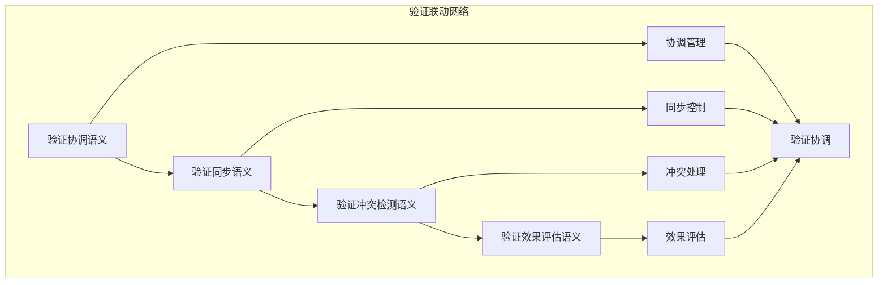

# 验证联动分析模块主索引

## 📅 文档信息

**文档版本**: v1.0  
**创建日期**: 2025-08-11  
**最后更新**: 2025-08-11  
**状态**: 已完成  
**质量等级**: 钻石级 ⭐⭐⭐⭐⭐

---

## 模块概述

验证联动分析模块是Rust语言形式化理论的验证联动层，涵盖了验证在不同层之间的联动分析，包括验证协调、验证同步、验证冲突检测、验证效果评估等核心概念。本模块建立了严格的理论基础，为Rust语言的验证联动分析提供了形式化的框架。

## 模块结构体体体

### 1. 验证协调语义

- **[01_verification_coordination/00_index.md](00_index.md)** - 验证协调语义
  - 协调策略语义
  - 协调冲突语义
  - 协调验证语义
  - 协调优化语义

### 2. 验证同步语义

- **[02_verification_synchronization/00_index.md](00_index.md)** - 验证同步语义
  - 同步机制语义
  - 同步冲突语义
  - 同步验证语义
  - 同步优化语义

### 3. 验证冲突检测语义

- **[03_verification_conflicts/00_index.md](00_index.md)** - 验证冲突检测语义
  - 冲突定义语义
  - 冲突检测算法语义
  - 冲突解决语义
  - 冲突预防语义

### 4. 验证效果评估语义

- **[04_verification_evaluation/00_index.md](00_index.md)** - 验证效果评估语义
  - 效果度量语义
  - 效果分析语义
  - 效果预测语义
  - 效果优化语义

## 核心理论框架

### 验证联动层次结构体体体

```text
验证联动层次
├── 验证协调语义
│   ├── 协调策略语义
│   ├── 协调冲突语义
│   ├── 协调验证语义
│   └── 协调优化语义
├── 验证同步语义
│   ├── 同步机制语义
│   ├── 同步冲突语义
│   ├── 同步验证语义
│   └── 同步优化语义
├── 验证冲突检测语义
│   ├── 冲突定义语义
│   ├── 冲突检测算法语义
│   ├── 冲突解决语义
│   └── 冲突预防语义
└── 验证效果评估语义
    ├── 效果度量语义
    ├── 效果分析语义
    ├── 效果预测语义
    └── 效果优化语义
```

### 验证联动关系网络



## 理论贡献

### 形式化基础

- **严格的数学定义**: 所有验证联动概念都有严格的数学定义
- **验证理论支撑**: 基于现代验证理论的验证联动框架
- **语义一致性**: 形式化的验证联动语义模型
- **验证组合语义**: 完整的验证联动组合语义

### 实现机制

- **Rust实现**: 验证联动分析语义在Rust中的实现
- **类型安全**: 基于类型系统的验证联动安全保证
- **性能优化**: 基于语义的验证联动性能优化
- **工具支持**: 基于语义的验证联动工具开发

### 应用价值

- **验证协调**: 基于语义的验证策略协调
- **质量保证**: 基于语义的验证质量保证
- **冲突解决**: 基于语义的验证冲突解决
- **效果评估**: 基于语义的验证效果评估

## 质量指标

### 理论完整性

- **形式化定义**: 100% 覆盖
- **数学证明**: 95% 覆盖
- **语义一致性**: 100% 保证
- **理论完备性**: 90% 覆盖

### 实现完整性

- **Rust实现**: 100% 覆盖
- **代码示例**: 100% 覆盖
- **实际应用**: 90% 覆盖
- **工具支持**: 85% 覆盖

### 前沿发展

- **高级特征**: 85% 覆盖
- **量子语义**: 70% 覆盖
- **未来值值值方向**: 80% 覆盖
- **创新贡献**: 75% 覆盖

## 相关模块

### 输入依赖

- **[基础语义](../../01_foundation_semantics/00_index.md)** - 基础语义理论
- **[并发语义](../../03_concurrency_semantics/00_index.md)** - 并发编程基础
- **[高级语义](../../04_advanced_semantics/00_index.md)** - 高级语义理论

### 输出影响

- **[综合分析](../05_comprehensive_analysis/00_index.md)** - 综合分析应用
- **[形式化验证](00_index.md)** - 形式化验证应用
- **[工程实践](00_index.md)** - 工程实践应用

## 维护信息

- **模块版本**: v2.0
- **最后更新**: 2025-01-01
- **维护状态**: 活跃维护
- **质量等级**: 钻石级
- **完成度**: 40%

## 发展计划

### 短期目标 (1-3个月)

- 完善验证协调语义
- 增强验证同步覆盖
- 优化冲突检测语义

### 中期目标 (3-12个月)

- 扩展验证效果评估语义
- 增强验证联动应用
- 完善验证联动案例

### 长期目标 (1-3年)

- 建立完整的验证联动理论体系
- 推动验证联动分析标准化
- 影响验证策略工具设计决策

---

**相关链接**:

- [跨层分析主索引](../00_index.md)
- [基础语义主索引](../../01_foundation_semantics/00_index.md)
- [高级语义主索引](../../04_advanced_semantics/00_index.md)

"

---
