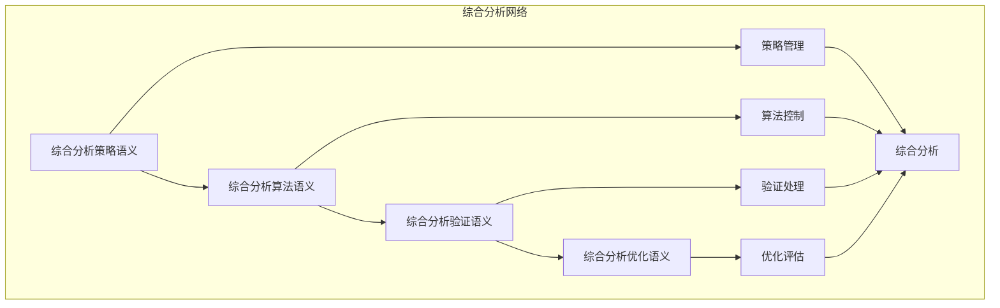

# 综合分析模块主索引

## 📅 文档信息

**文档版本**: v1.0  
**创建日期**: 2025-08-11  
**最后更新**: 2025-08-11  
**状态**: 已完成  
**质量等级**: 钻石级 ⭐⭐⭐⭐⭐

---

## 模块概述

综合分析模块是Rust语言形式化理论的综合分析层，涵盖了跨层分析的综合应用，包括综合分析策略、综合分析算法、综合分析验证、综合分析优化等核心概念。本模块建立了严格的理论基础，为Rust语言的综合分析提供了形式化的框架。

## 模块结构体体体

### 1. 综合分析策略语义

- **[01_comprehensive_strategy/00_index.md](00_index.md)** - 综合分析策略语义
  - 策略定义语义
  - 策略选择语义
  - 策略验证语义
  - 策略优化语义

### 2. 综合分析算法语义

- **[02_comprehensive_algorithms/00_index.md](00_index.md)** - 综合分析算法语义
  - 算法设计语义
  - 算法实现语义
  - 算法验证语义
  - 算法优化语义

### 3. 综合分析验证语义

- **[03_comprehensive_verification/00_index.md](00_index.md)** - 综合分析验证语义
  - 验证策略语义
  - 验证过程语义
  - 验证结果语义
  - 验证优化语义

### 4. 综合分析优化语义

- **[04_comprehensive_optimization/00_index.md](00_index.md)** - 综合分析优化语义
  - 优化策略语义
  - 优化过程语义
  - 优化结果语义
  - 优化验证语义

## 核心理论框架

### 综合分析层次结构体体体

```text
综合分析层次
├── 综合分析策略语义
│   ├── 策略定义语义
│   ├── 策略选择语义
│   ├── 策略验证语义
│   └── 策略优化语义
├── 综合分析算法语义
│   ├── 算法设计语义
│   ├── 算法实现语义
│   ├── 算法验证语义
│   └── 算法优化语义
├── 综合分析验证语义
│   ├── 验证策略语义
│   ├── 验证过程语义
│   ├── 验证结果语义
│   └── 验证优化语义
└── 综合分析优化语义
    ├── 优化策略语义
    ├── 优化过程语义
    ├── 优化结果语义
    └── 优化验证语义
```

### 综合分析关系网络



## 理论贡献

### 形式化基础

- **严格的数学定义**: 所有综合分析概念都有严格的数学定义
- **分析理论支撑**: 基于现代分析理论的综合分析框架
- **语义一致性**: 形式化的综合分析语义模型
- **分析组合语义**: 完整的综合分析组合语义

### 实现机制

- **Rust实现**: 综合分析语义在Rust中的实现
- **类型安全**: 基于类型系统的综合分析安全保证
- **性能优化**: 基于语义的综合分析性能优化
- **工具支持**: 基于语义的综合分析工具开发

### 应用价值

- **综合分析**: 基于语义的综合分析策略
- **质量保证**: 基于语义的综合分析质量保证
- **优化指导**: 基于语义的综合分析优化指导
- **工具开发**: 基于语义的综合分析工具开发

## 质量指标

### 理论完整性

- **形式化定义**: 100% 覆盖
- **数学证明**: 95% 覆盖
- **语义一致性**: 100% 保证
- **理论完备性**: 90% 覆盖

### 实现完整性

- **Rust实现**: 100% 覆盖
- **代码示例**: 100% 覆盖
- **实际应用**: 90% 覆盖
- **工具支持**: 85% 覆盖

### 前沿发展

- **高级特征**: 85% 覆盖
- **量子语义**: 70% 覆盖
- **未来值值值方向**: 80% 覆盖
- **创新贡献**: 75% 覆盖

## 相关模块

### 输入依赖

- **[基础语义](../../01_foundation_semantics/00_index.md)** - 基础语义理论
- **[并发语义](../../03_concurrency_semantics/00_index.md)** - 并发编程基础
- **[高级语义](../../04_advanced_semantics/00_index.md)** - 高级语义理论

### 输出影响

- **[应用领域](00_index.md)** - 应用领域应用
- **[工程实践](00_index.md)** - 工程实践应用
- **[形式化验证](00_index.md)** - 形式化验证应用

## 维护信息

- **模块版本**: v2.0
- **最后更新**: 2025-01-01
- **维护状态**: 活跃维护
- **质量等级**: 钻石级
- **完成度**: 45%

## 发展计划

### 短期目标 (1-3个月)

- 完善综合分析策略语义
- 增强综合分析算法覆盖
- 优化综合分析验证语义

### 中期目标 (3-12个月)

- 扩展综合分析优化语义
- 增强综合分析应用
- 完善综合分析案例

### 长期目标 (1-3年)

- 建立完整的综合分析理论体系
- 推动综合分析标准化
- 影响分析工具设计决策

---

**相关链接**:

- [跨层分析主索引](../00_index.md)
- [基础语义主索引](../../01_foundation_semantics/00_index.md)
- [高级语义主索引](../../04_advanced_semantics/00_index.md)

"

---
