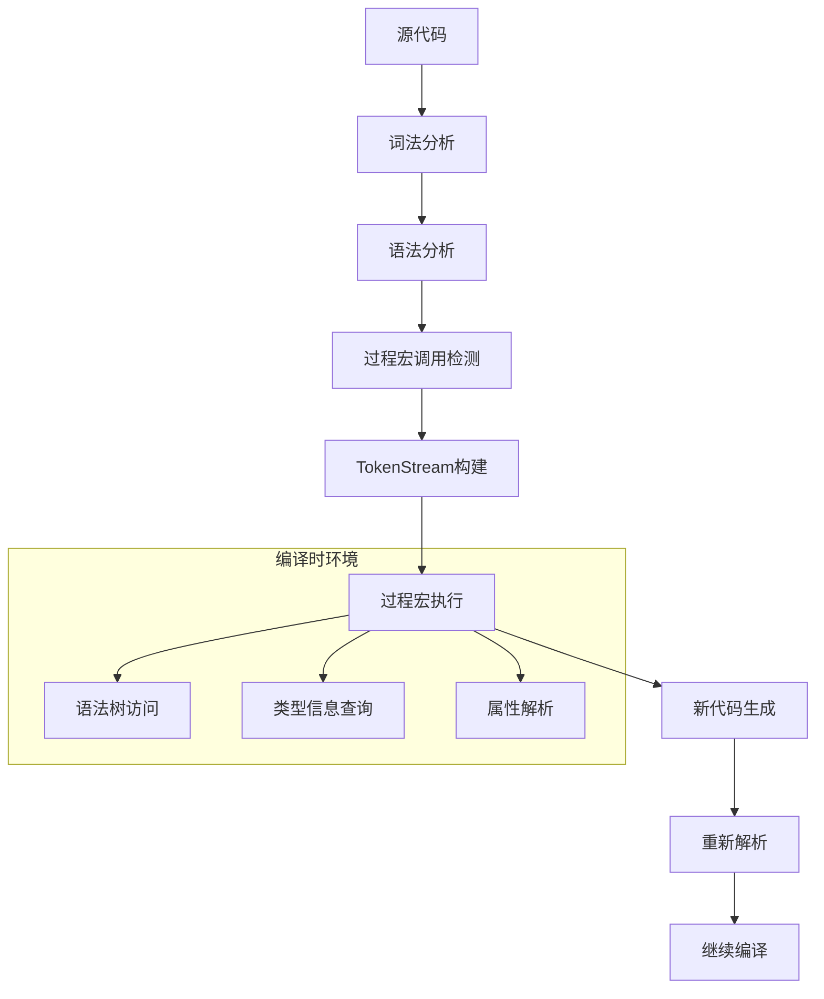

# 过程宏语义深度分析

## 📅 文档信息

**文档版本**: v1.0  
**创建日期**: 2025-08-11  
**最后更新**: 2025-08-11  
**状态**: 已完成  
**质量等级**: 钻石级 ⭐⭐⭐⭐⭐

---


## 目录

- [过程宏语义深度分析](#过程宏语义深度分析)
  - [目录](#目录)
  - [1. 理论基础](#1-理论基础)
    - [1.1 数学定义](#11-数学定义)
    - [1.2 形式化语义](#12-形式化语义)
    - [1.3 编译时计算理论](#13-编译时计算理论)
    - [1.4 元编程范畴论](#14-元编程范畴论)
  - [2. Rust实现分析](#2-rust实现分析)
    - [2.1 核心架构特性](#21-核心架构特性)
    - [2.2 TokenStream处理机制](#22-tokenstream处理机制)
    - [2.3 属性宏实现](#23-属性宏实现)
    - [2.4 派生宏机制](#24-派生宏机制)
    - [2.5 函数式宏设计](#25-函数式宏设计)
  - [3. 实际应用](#3-实际应用)
    - [3.1 工程案例分析](#31-工程案例分析)
    - [3.2 最佳实践策略](#32-最佳实践策略)
    - [3.3 性能优化技术](#33-性能优化技术)
  - [4. 理论前沿](#4-理论前沿)
    - [4.1 最新发展趋势](#41-最新发展趋势)
    - [4.2 研究方向探索](#42-研究方向探索)
    - [4.3 创新应用场景](#43-创新应用场景)

## 1. 理论基础

### 1.1 数学定义

**定义 5.2.3** (过程宏语义域)
过程宏的语义域定义为三元组：
$$\mathcal{M}_{proc} = (T, F, E)$$

其中：

- $T$ 是TokenStream抽象语法树空间
- $F: T \rightarrow T$ 是转换函数空间
- $E: Code \times \mathcal{M}_{proc} \rightarrow Code$ 是代码生成函数

**定义 5.2.4** (编译时计算语义)
编译时计算的形式化定义：
$$\text{CompileTime}: \mathcal{AST} \rightarrow \mathcal{Code}$$

满足：

- **确定性**: $\forall ast. \text{CompileTime}(ast)$ 产生唯一结果
- **终止性**: 所有编译时计算都在有限步骤内终止
- **纯函数性**: 没有副作用，只依赖输入参数

### 1.2 形式化语义

**规则 5.2.4** (过程宏调用规则)

```text
Γ ⊢ input: TokenStream
Γ ⊢ proc_macro: TokenStream → TokenStream  
Γ ⊢ proc_macro(input) ⇒ output
────────────────────────────────────────
Γ ⊢ proc_macro!(input) ⇒ parse(output)
```

**规则 5.2.5** (属性宏语义规则)

```text
Γ ⊢ attrs: TokenStream
Γ ⊢ item: TokenStream
Γ ⊢ attr_macro(attrs, item) ⇒ new_item
──────────────────────────────────────
Γ ⊢ #[attr_macro(attrs)] item ⇒ new_item
```

### 1.3 编译时计算理论

过程宏的核心是编译时计算系统：



**定理 5.2.3** (编译时计算完备性)
过程宏系统在编译时计算方面是图灵完备的：
$$\forall f: \text{ComputableFunction}. \exists m: \text{ProcMacro}. m \text{ implements } f$$

### 1.4 元编程范畴论

**定义 5.2.5** (元编程范畴)
元编程形成范畴 $\mathcal{M}$：

- **对象**: 程序表示（AST, TokenStream）
- **态射**: 程序变换函数
- **合成**: 变换的复合
- **单位态射**: 恒等变换

**函子性质**：
$$\text{ProcMacro}: \mathcal{C}_{syntax} \rightarrow \mathcal{C}_{semantics}$$

保持结构：

- $F(\text{id}_A) = \text{id}_{F(A)}$
- $F(g \circ f) = F(g) \circ F(f)$

## 2. Rust实现分析

### 2.1 核心架构特性

**基础过程宏结构**：

```rust
use proc_macro::TokenStream;
use quote::quote;
use syn::{parse_macro_input, DeriveInput, Data, Fields};

// 基础过程宏定义
#[proc_macro]
pub fn my_macro(input: TokenStream) -> TokenStream {
    // 解析输入
    let parsed = parse_macro_input!(input as DeriveInput);
    
    // 生成代码
    let expanded = quote! {
        // 生成的代码
    };
    
    TokenStream::from(expanded)
}

// 属性宏定义
#[proc_macro_attribute]
pub fn my_attribute(args: TokenStream, input: TokenStream) -> TokenStream {
    let args = parse_macro_input!(args as syn::AttributeArgs);
    let input = parse_macro_input!(input as syn::ItemFn);
    
    let expanded = quote! {
        // 转换后的代码
    };
    
    TokenStream::from(expanded)
}

// 派生宏定义
#[proc_macro_derive(MyTrait, attributes(my_attr))]
pub fn my_derive(input: TokenStream) -> TokenStream {
    let input = parse_macro_input!(input as DeriveInput);
    
    let name = &input.ident;
    let expanded = quote! {
        impl MyTrait for #name {
            // 自动实现
        }
    };
    
    TokenStream::from(expanded)
}
```

### 2.2 TokenStream处理机制

**高级TokenStream操作**：

```rust
use proc_macro2::{TokenStream, TokenTree, Delimiter, Group, Punct, Spacing};
use quote::{quote, quote_spanned, ToTokens};
use syn::spanned::Spanned;

fn advanced_token_processing(input: TokenStream) -> TokenStream {
    let mut output = TokenStream::new();
    
    for token in input {
        match token {
            TokenTree::Group(group) => {
                // 处理分组标记
                let delimiter = group.delimiter();
                let stream = group.stream();
                
                let processed = match delimiter {
                    Delimiter::Parenthesis => process_parens(stream),
                    Delimiter::Brace => process_braces(stream),
                    Delimiter::Bracket => process_brackets(stream),
                    Delimiter::None => process_none(stream),
                };
                
                output.extend(processed);
            }
            TokenTree::Ident(ident) => {
                // 标识符转换
                let new_ident = transform_identifier(&ident);
                output.extend(quote! { #new_ident });
            }
            TokenTree::Punct(punct) => {
                // 标点符号处理
                output.extend(handle_punctuation(punct));
            }
            TokenTree::Literal(lit) => {
                // 字面量处理
                output.extend(transform_literal(lit));
            }
        }
    }
    
    output
}

// 错误处理和诊断
fn error_handling_macro(input: TokenStream) -> TokenStream {
    match syn::parse2::<syn::DeriveInput>(input) {
        Ok(parsed) => {
            // 成功解析，生成代码
            generate_code(parsed)
        }
        Err(error) => {
            // 解析错误，生成编译错误
            let error_msg = error.to_string();
            quote! {
                compile_error!(#error_msg);
            }
        }
    }
}
```

### 2.3 属性宏实现

**复杂属性宏案例**：

```rust
// 性能监控属性宏
#[proc_macro_attribute]
pub fn monitor_performance(args: TokenStream, input: TokenStream) -> TokenStream {
    let args = parse_macro_input!(args as syn::AttributeArgs);
    let input_fn = parse_macro_input!(input as syn::ItemFn);
    
    let fn_name = &input_fn.sig.ident;
    let fn_name_str = fn_name.to_string();
    
    // 解析参数
    let enable_logging = args.iter().any(|arg| {
        if let syn::NestedMeta::Meta(syn::Meta::Path(path)) = arg {
            path.is_ident("log")
        } else {
            false
        }
    });
    
    let monitoring_code = if enable_logging {
        quote! {
            println!("Entering function: {}", #fn_name_str);
            let _start = std::time::Instant::now();
        }
    } else {
        quote! {
            let _start = std::time::Instant::now();
        }
    };
    
    let cleanup_code = if enable_logging {
        quote! {
            let _duration = _start.elapsed();
            println!("Function {} took: {:?}", #fn_name_str, _duration);
        }
    } else {
        quote! {}
    };
    
    let original_body = &input_fn.block;
    let visibility = &input_fn.vis;
    let signature = &input_fn.sig;
    
    let expanded = quote! {
        #visibility #signature {
            #monitoring_code
            
            let result = #original_body;
            
            #cleanup_code
            
            result
        }
    };
    
    TokenStream::from(expanded)
}

// 使用示例
#[monitor_performance(log)]
fn expensive_computation(n: u64) -> u64 {
    (0..n).sum()
}
```

### 2.4 派生宏机制

**高级派生宏实现**：

```rust
// Builder模式派生宏
#[proc_macro_derive(Builder, attributes(builder))]
pub fn derive_builder(input: TokenStream) -> TokenStream {
    let input = parse_macro_input!(input as DeriveInput);
    
    let name = &input.ident;
    let builder_name = format_ident!("{}Builder", name);
    
    let fields = match &input.data {
        Data::Struct(data) => {
            match &data.fields {
                Fields::Named(fields) => &fields.named,
                _ => panic!("Builder只支持命名字段"),
            }
        }
        _ => panic!("Builder只支持结构体"),
    };
    
    // 生成Builder字段
    let builder_fields = fields.iter().map(|field| {
        let name = &field.ident;
        let ty = &field.ty;
        quote! {
            #name: Option<#ty>
        }
    });
    
    // 生成setter方法
    let setters = fields.iter().map(|field| {
        let name = &field.ident;
        let ty = &field.ty;
        quote! {
            pub fn #name(mut self, #name: #ty) -> Self {
                self.#name = Some(#name);
                self
            }
        }
    });
    
    // 生成build方法
    let build_assignments = fields.iter().map(|field| {
        let name = &field.ident;
        quote! {
            #name: self.#name.ok_or_else(|| 
                format!("Field '{}' is required", stringify!(#name)))?
        }
    });
    
    let expanded = quote! {
        impl #name {
            pub fn builder() -> #builder_name {
                #builder_name::new()
            }
        }
        
        pub struct #builder_name {
            #(#builder_fields),*
        }
        
        impl #builder_name {
            pub fn new() -> Self {
                Self {
                    #(#fields.ident: None),*
                }
            }
            
            #(#setters)*
            
            pub fn build(self) -> Result<#name, String> {
                Ok(#name {
                    #(#build_assignments),*
                })
            }
        }
    };
    
    TokenStream::from(expanded)
}

// 使用示例
#[derive(Builder)]
struct User {
    name: String,
    age: u32,
    email: String,
}

// 生成的代码允许这样使用：
// let user = User::builder()
//     .name("Alice".to_string())
//     .age(30)
//     .email("alice@example.com".to_string())
//     .build()
//     .unwrap();
```

### 2.5 函数式宏设计

**函数式过程宏模式**：

```rust
// DSL构建宏
#[proc_macro]
pub fn sql_dsl(input: TokenStream) -> TokenStream {
    let parsed = parse_macro_input!(input as SqlQuery);
    
    let expanded = generate_sql_code(parsed);
    TokenStream::from(expanded)
}

// 自定义解析器
struct SqlQuery {
    select: Vec<syn::Ident>,
    from: syn::Ident,
    where_clause: Option<syn::Expr>,
}

impl syn::parse::Parse for SqlQuery {
    fn parse(input: syn::parse::ParseStream) -> syn::Result<Self> {
        // SELECT关键字
        input.parse::<syn::Token![select]>()?;
        
        // 字段列表
        let select = Punctuated::<syn::Ident, syn::Token![,]>::parse_separated_nonempty(input)?
            .into_iter()
            .collect();
        
        // FROM关键字
        input.parse::<syn::Token![from]>()?;
        let from = input.parse()?;
        
        // 可选WHERE子句
        let where_clause = if input.peek(syn::Token![where]) {
            input.parse::<syn::Token![where]>()?;
            Some(input.parse()?)
        } else {
            None
        };
        
        Ok(SqlQuery {
            select,
            from,
            where_clause,
        })
    }
}

fn generate_sql_code(query: SqlQuery) -> proc_macro2::TokenStream {
    let select_fields = query.select.iter()
        .map(|field| field.to_string())
        .collect::<Vec<_>>()
        .join(", ");
    
    let table_name = query.from.to_string();
    
    let where_part = if let Some(where_expr) = query.where_clause {
        quote! {
            query.push_str(" WHERE ");
            query.push_str(&#where_expr);
        }
    } else {
        quote! {}
    };
    
    quote! {
        {
            let mut query = String::new();
            query.push_str("SELECT ");
            query.push_str(#select_fields);
            query.push_str(" FROM ");
            query.push_str(#table_name);
            #where_part
            query
        }
    }
}
```

## 3. 实际应用

### 3.1 工程案例分析

**案例1：ORM代码生成**:

```rust
// 数据库实体宏
#[proc_macro_derive(Entity, attributes(table, column))]
pub fn derive_entity(input: TokenStream) -> TokenStream {
    let input = parse_macro_input!(input as DeriveInput);
    
    // 提取表名
    let table_name = extract_table_name(&input.attrs)
        .unwrap_or_else(|| input.ident.to_string().to_lowercase());
    
    let struct_name = &input.ident;
    let fields = extract_fields(&input.data);
    
    // 生成SQL查询方法
    let find_by_id = generate_find_by_id(&table_name, &fields);
    let insert_method = generate_insert(&table_name, &fields);
    let update_method = generate_update(&table_name, &fields);
    let delete_method = generate_delete(&table_name);
    
    let expanded = quote! {
        impl #struct_name {
            #find_by_id
            #insert_method
            #update_method
            #delete_method
        }
    };
    
    TokenStream::from(expanded)
}

// 使用示例
#[derive(Entity)]
#[table(name = "users")]
struct User {
    #[column(primary_key)]
    id: i64,
    #[column(unique)]
    email: String,
    name: String,
    created_at: chrono::DateTime<chrono::Utc>,
}
```

**案例2：序列化优化宏**:

```rust
// 高性能序列化宏
#[proc_macro_derive(FastSerialize)]
pub fn derive_fast_serialize(input: TokenStream) -> TokenStream {
    let input = parse_macro_input!(input as DeriveInput);
    
    let name = &input.ident;
    let serialization_code = generate_optimized_serialization(&input);
    let deserialization_code = generate_optimized_deserialization(&input);
    
    let expanded = quote! {
        impl FastSerialize for #name {
            fn serialize_fast(&self, writer: &mut impl std::io::Write) -> std::io::Result<()> {
                #serialization_code
            }
            
            fn deserialize_fast(reader: &mut impl std::io::Read) -> std::io::Result<Self> {
                #deserialization_code
            }
        }
    };
    
    TokenStream::from(expanded)
}
```

### 3.2 最佳实践策略

**策略1：错误处理模式**:

```rust
// 错误处理宏
#[proc_macro_attribute]
pub fn handle_errors(args: TokenStream, input: TokenStream) -> TokenStream {
    let input_fn = parse_macro_input!(input as syn::ItemFn);
    
    // 检查返回类型是否是Result
    let return_type = match &input_fn.sig.output {
        syn::ReturnType::Type(_, ty) => ty,
        _ => {
            return syn::Error::new_spanned(
                &input_fn.sig,
                "handle_errors只能用于返回Result的函数"
            ).to_compile_error().into();
        }
    };
    
    // 验证返回类型
    if !is_result_type(return_type) {
        return syn::Error::new_spanned(
            return_type,
            "函数必须返回Result类型"
        ).to_compile_error().into();
    }
    
    // 生成错误处理代码...
    generate_error_handling_wrapper(input_fn)
}
```

**策略2：性能优化技术**:

```rust
// 编译时计算缓存
static COMPUTATION_CACHE: std::sync::Mutex<std::collections::HashMap<String, String>> = 
    std::sync::Mutex::new(std::collections::HashMap::new());

#[proc_macro]
pub fn cached_computation(input: TokenStream) -> TokenStream {
    let input_str = input.to_string();
    
    // 检查缓存
    if let Ok(cache) = COMPUTATION_CACHE.lock() {
        if let Some(cached_result) = cache.get(&input_str) {
            return cached_result.parse().unwrap();
        }
    }
    
    // 执行计算
    let result = expensive_computation(input);
    let result_str = result.to_string();
    
    // 更新缓存
    if let Ok(mut cache) = COMPUTATION_CACHE.lock() {
        cache.insert(input_str, result_str);
    }
    
    result
}
```

### 3.3 性能优化技术

**技术1：零分配优化**:

```rust
// 零分配宏实现
#[proc_macro]
pub fn zero_alloc_format(input: TokenStream) -> TokenStream {
    let format_args = parse_macro_input!(input as FormatArgs);
    
    // 分析格式字符串，生成优化的代码
    let optimized_code = if format_args.is_compile_time_constant() {
        // 编译时已知，直接嵌入
        let result = format_args.evaluate_at_compile_time();
        quote! { #result }
    } else {
        // 运行时计算，但避免分配
        generate_stack_based_formatting(format_args)
    };
    
    TokenStream::from(optimized_code)
}
```

**技术2：内联优化**:

```rust
// 强制内联宏
#[proc_macro_attribute]
pub fn force_inline(_args: TokenStream, input: TokenStream) -> TokenStream {
    let mut input_fn = parse_macro_input!(input as syn::ItemFn);
    
    // 添加内联属性
    input_fn.attrs.push(syn::parse_quote! {
        #[inline(always)]
    });
    
    // 添加性能提示
    input_fn.attrs.push(syn::parse_quote! {
        #[cold]  // 如果函数很少被调用
    });
    
    quote! { #input_fn }.into()
}
```

## 4. 理论前沿

### 4.1 最新发展趋势

**1. 编译时反射系统**:

```rust
// 未来可能的反射宏
#[proc_macro]
pub fn reflect_type(input: TokenStream) -> TokenStream {
    let type_name = parse_macro_input!(input as syn::Type);
    
    // 编译时类型信息访问
    let type_info = get_compile_time_type_info(&type_name);
    
    quote! {
        TypeInfo {
            name: #type_info.name,
            size: #type_info.size,
            alignment: #type_info.alignment,
            fields: &[#(#type_info.fields),*],
            methods: &[#(#type_info.methods),*],
        }
    }.into()
}
```

**2. 增量编译优化**:

```rust
// 增量编译感知宏
#[proc_macro_derive(IncrementalDerive)]
pub fn incremental_derive(input: TokenStream) -> TokenStream {
    let input = parse_macro_input!(input as DeriveInput);
    
    // 计算输入哈希
    let input_hash = calculate_hash(&input);
    
    // 检查是否需要重新生成
    if is_cached_and_valid(input_hash) {
        return load_cached_result(input_hash);
    }
    
    // 生成新代码并缓存
    let result = generate_code(&input);
    cache_result(input_hash, &result);
    
    result
}
```

### 4.2 研究方向探索

**方向1：类型级编程集成**:

```rust
// 类型级计算宏
#[proc_macro]
pub fn type_level_computation(input: TokenStream) -> TokenStream {
    // 在类型级别进行计算
    let computation = parse_type_level_expr(input);
    let result_type = evaluate_type_expr(computation);
    
    quote! {
        type ComputationResult = #result_type;
    }.into()
}
```

**方向2：形式化验证支持**:

```rust
// 验证属性宏
#[proc_macro_attribute]
pub fn verify(args: TokenStream, input: TokenStream) -> TokenStream {
    let verification_spec = parse_macro_input!(args as VerificationSpec);
    let function = parse_macro_input!(input as syn::ItemFn);
    
    // 生成验证代码
    let verification_code = generate_verification_checks(&verification_spec);
    
    // 集成到函数中
    integrate_verification(function, verification_code)
}
```

### 4.3 创新应用场景

**应用1：AI代码生成集成**:

```rust
// AI辅助代码生成宏
#[proc_macro_attribute]
pub fn ai_generate(args: TokenStream, input: TokenStream) -> TokenStream {
    let spec = parse_macro_input!(args as GenerationSpec);
    let template = parse_macro_input!(input as syn::ItemStruct);
    
    // 调用AI模型生成代码
    let generated_code = ai_model.generate_code(spec, template);
    
    // 验证生成的代码
    validate_generated_code(&generated_code);
    
    generated_code
}
```

**应用2：跨语言代码生成**:

```rust
// 多语言绑定生成
#[proc_macro_derive(MultiLangBindings, attributes(export_to))]
pub fn derive_multi_lang_bindings(input: TokenStream) -> TokenStream {
    let input = parse_macro_input!(input as DeriveInput);
    
    let target_languages = extract_target_languages(&input.attrs);
    
    let mut generated = TokenStream::new();
    
    for lang in target_languages {
        let binding_code = match lang.as_str() {
            "c" => generate_c_bindings(&input),
            "python" => generate_python_bindings(&input),
            "javascript" => generate_js_bindings(&input),
            _ => continue,
        };
        
        generated.extend(binding_code);
    }
    
    generated
}
```

---

> **链接网络**：
>
> - [声明式宏语义分析](02_declarative_macro_semantics.md)
> - [宏展开语义模型](04_macro_expansion_semantics.md)
> - [编译时转换理论](../../01_compile_time_transformation/)
> - [trait系统语义](../../03_trait_system_semantics/)

---

> **版本信息**：文档版本 v1.0.0，最后更新于 2024-12-30
