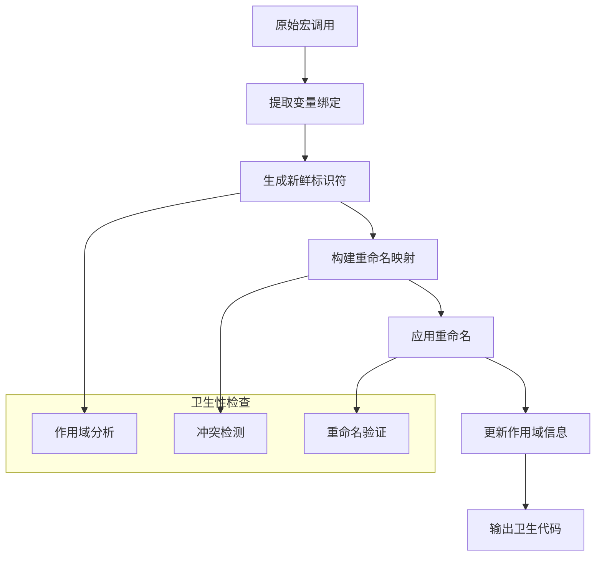

# 宏展开语义深度分析

## 📅 文档信息

**文档版本**: v1.0  
**创建日期**: 2025-08-11  
**最后更新**: 2025-08-11  
**状态**: 已完成  
**质量等级**: 钻石级 ⭐⭐⭐⭐⭐

---


## 目录

- [宏展开语义深度分析](#宏展开语义深度分析)
  - [目录](#目录)
  - [1. 理论基础](#1-理论基础)
    - [1.1 数学定义](#11-数学定义)
    - [1.2 展开算法理论](#12-展开算法理论)
    - [1.3 卫生性理论模型](#13-卫生性理论模型)
    - [1.4 递归展开语义](#14-递归展开语义)
  - [2. Rust实现分析](#2-rust实现分析)
    - [2.1 展开引擎架构](#21-展开引擎架构)
    - [2.2 卫生性保证机制](#22-卫生性保证机制)
    - [2.3 递归处理算法](#23-递归处理算法)
    - [2.4 错误处理策略](#24-错误处理策略)
    - [2.5 性能优化技术](#25-性能优化技术)
  - [3. 实际应用](#3-实际应用)
    - [3.1 复杂展开案例](#31-复杂展开案例)
    - [3.2 最佳实践指南](#32-最佳实践指南)
    - [3.3 调试技术](#33-调试技术)
  - [4. 理论前沿](#4-理论前沿)
    - [4.1 最新发展](#41-最新发展)
    - [4.2 研究方向](#42-研究方向)
    - [4.3 未来展望](#43-未来展望)

## 1. 理论基础

### 1.1 数学定义

**定义 5.2.6** (宏展开语义域)
宏展开的语义域定义为六元组：
$$\mathcal{E} = (M, T, H, R, \delta, \epsilon)$$

其中：

- $M$ 是宏定义集合
- $T$ 是标记流空间
- $H$ 是卫生性上下文
- $R$ 是递归深度约束
- $\delta: M \times T \times H \rightarrow T \times H$ 是展开函数
- $\epsilon: T \rightarrow \mathbb{B}$ 是展开完成谓词

**定义 5.2.7** (卫生性语义)
卫生性关系定义为：
$$\text{Hygienic}(expansion) \triangleq \forall v \in vars(expansion). scope(v) = original\_scope(v)$$

其中 $scope: Var \rightarrow Context$ 表示变量的作用域映射。

**定义 5.2.8** (展开不动点)
展开过程的不动点定义为：
$$fix(\delta) = \lim_{n \rightarrow \infty} \delta^n(input)$$

当 $\delta^{n+1}(input) = \delta^n(input)$ 时达到不动点。

### 1.2 展开算法理论

**算法 5.2.1** (基础展开算法)

```text
function expand(ast, context):
    worklist = [ast]
    result = []
    
    while worklist is not empty:
        node = worklist.pop()
        
        if is_macro_call(node):
            expanded = expand_macro(node, context)
            worklist.extend(find_macro_calls(expanded))
            result.append(expanded)
        else:
            result.append(node)
    
    return result
```

**复杂度分析**：

- **时间复杂度**: $O(n \cdot d)$，其中$n$是AST节点数，$d$是最大递归深度
- **空间复杂度**: $O(n + d)$，用于存储工作列表和调用栈

### 1.3 卫生性理论模型

卫生性系统的核心是变量重命名：



**定理 5.2.4** (卫生性保持性)
对于良构的宏展开 $e$：
$$\text{Hygienic}(input) \Rightarrow \text{Hygienic}(expand(input))$$

**证明思路**：通过归纳法证明展开过程保持变量的词法作用域不变。

### 1.4 递归展开语义

**定义 5.2.9** (递归展开关系)
递归展开关系 $\rightarrow_r$ 定义为：
$$macro_1(args) \rightarrow_r expanded\_code \text{ if } expanded\_code \text{ contains } macro_2(args')$$

**终止性条件**：

- **深度限制**: $depth(recursion) \leq MAX\_DEPTH$
- **复杂度约束**: $|expanded| \leq f(|input|)$ 对某个多项式 $f$
- **循环检测**: 检测无限递归模式

## 2. Rust实现分析

### 2.1 展开引擎架构

**核心展开引擎结构**：

```rust
use std::collections::{HashMap, HashSet, VecDeque};
use proc_macro2::{TokenStream, TokenTree, Span};

// 展开上下文
#[derive(Debug, Clone)]
struct ExpansionContext {
    // 当前作用域
    current_scope: ScopeId,
    // 卫生性映射
    hygiene_map: HashMap<String, String>,
    // 递归深度
    recursion_depth: usize,
    // 最大递归深度
    max_depth: usize,
    // 展开历史
    expansion_history: Vec<MacroCall>,
}

// 宏调用表示
#[derive(Debug, Clone, PartialEq)]
struct MacroCall {
    name: String,
    args: TokenStream,
    span: Span,
    call_site: ScopeId,
}

// 展开引擎
struct ExpansionEngine {
    macro_definitions: HashMap<String, MacroDefinition>,
    scope_stack: Vec<ScopeInfo>,
    hygiene_context: HygieneContext,
}

impl ExpansionEngine {
    fn expand_token_stream(&mut self, input: TokenStream) -> Result<TokenStream, ExpansionError> {
        let mut result = TokenStream::new();
        let mut work_queue = VecDeque::new();
        
        // 初始化工作队列
        work_queue.push_back(input);
        
        while let Some(tokens) = work_queue.pop_front() {
            match self.process_tokens(tokens)? {
                ProcessResult::Expanded(new_tokens) => {
                    // 检查是否包含更多宏调用
                    if self.contains_macro_calls(&new_tokens) {
                        work_queue.push_back(new_tokens);
                    } else {
                        result.extend(new_tokens);
                    }
                }
                ProcessResult::NoMacros(tokens) => {
                    result.extend(tokens);
                }
            }
        }
        
        Ok(result)
    }
    
    fn process_tokens(&mut self, tokens: TokenStream) -> Result<ProcessResult, ExpansionError> {
        let mut output = TokenStream::new();
        let mut found_macros = false;
        
        for token in tokens {
            match token {
                TokenTree::Ident(ident) => {
                    if self.is_macro_name(&ident) {
                        // 处理宏调用
                        let macro_call = self.parse_macro_call(ident)?;
                        let expanded = self.expand_single_macro(macro_call)?;
                        output.extend(expanded);
                        found_macros = true;
                    } else {
                        output.extend(std::iter::once(TokenTree::Ident(ident)));
                    }
                }
                TokenTree::Group(group) => {
                    // 递归处理分组内容
                    let inner = self.process_tokens(group.stream())?;
                    let new_group = match inner {
                        ProcessResult::Expanded(tokens) => {
                            found_macros = true;
                            Group::new(group.delimiter(), tokens)
                        }
                        ProcessResult::NoMacros(tokens) => {
                            Group::new(group.delimiter(), tokens)
                        }
                    };
                    output.extend(std::iter::once(TokenTree::Group(new_group)));
                }
                other => {
                    output.extend(std::iter::once(other));
                }
            }
        }
        
        Ok(if found_macros {
            ProcessResult::Expanded(output)
        } else {
            ProcessResult::NoMacros(output)
        })
    }
}

#[derive(Debug)]
enum ProcessResult {
    Expanded(TokenStream),
    NoMacros(TokenStream),
}
```

### 2.2 卫生性保证机制

**卫生性实现系统**：

```rust
use std::sync::atomic::{AtomicUsize, Ordering};

// 全局计数器用于生成唯一标识符
static GENSYM_COUNTER: AtomicUsize = AtomicUsize::new(0);

// 卫生性上下文
#[derive(Debug, Clone)]
struct HygieneContext {
    // 作用域栈
    scope_stack: Vec<ScopeInfo>,
    // 变量重命名映射
    rename_map: HashMap<(String, ScopeId), String>,
    // 当前作用域ID
    current_scope: ScopeId,
    // 父作用域映射
    parent_scopes: HashMap<ScopeId, Option<ScopeId>>,
}

#[derive(Debug, Clone, Copy, PartialEq, Eq, Hash)]
struct ScopeId(usize);

#[derive(Debug, Clone)]
struct ScopeInfo {
    id: ScopeId,
    kind: ScopeKind,
    variables: HashSet<String>,
    macro_definitions: HashSet<String>,
}

#[derive(Debug, Clone)]
enum ScopeKind {
    Function,
    Block,
    MacroDefinition,
    MacroExpansion,
    Module,
}

impl HygieneContext {
    fn new() -> Self {
        Self {
            scope_stack: vec![ScopeInfo {
                id: ScopeId(0),
                kind: ScopeKind::Module,
                variables: HashSet::new(),
                macro_definitions: HashSet::new(),
            }],
            rename_map: HashMap::new(),
            current_scope: ScopeId(0),
            parent_scopes: HashMap::new(),
        }
    }
    
    fn enter_scope(&mut self, kind: ScopeKind) -> ScopeId {
        let new_id = ScopeId(self.scope_stack.len());
        let parent_scope = self.current_scope;
        
        self.parent_scopes.insert(new_id, Some(parent_scope));
        self.scope_stack.push(ScopeInfo {
            id: new_id,
            kind,
            variables: HashSet::new(),
            macro_definitions: HashSet::new(),
        });
        
        self.current_scope = new_id;
        new_id
    }
    
    fn exit_scope(&mut self) {
        if self.scope_stack.len() > 1 {
            self.scope_stack.pop();
            let parent = self.parent_scopes[&self.current_scope];
            self.current_scope = parent.unwrap_or(ScopeId(0));
        }
    }
    
    fn make_hygienic_ident(&mut self, original: &str, definition_scope: ScopeId) -> String {
        let key = (original.to_string(), definition_scope);
        
        if let Some(renamed) = self.rename_map.get(&key) {
            return renamed.clone();
        }
        
        // 生成新的唯一标识符
        let counter = GENSYM_COUNTER.fetch_add(1, Ordering::SeqCst);
        let hygienic_name = format!("{}__hygiene__{}", original, counter);
        
        self.rename_map.insert(key, hygienic_name.clone());
        hygienic_name
    }
    
    fn resolve_identifier(&self, ident: &str, use_scope: ScopeId) -> Option<String> {
        // 在作用域链中查找标识符
        let mut current_scope = Some(use_scope);
        
        while let Some(scope_id) = current_scope {
            if let Some(scope) = self.scope_stack.iter().find(|s| s.id == scope_id) {
                if scope.variables.contains(ident) {
                    return Some(ident.to_string());
                }
            }
            current_scope = self.parent_scopes.get(&scope_id).copied().flatten();
        }
        
        None
    }
}

// 卫生性变换器
struct HygieneTransformer<'a> {
    context: &'a mut HygieneContext,
    definition_scope: ScopeId,
}

impl<'a> HygieneTransformer<'a> {
    fn transform_token_stream(&mut self, input: TokenStream) -> TokenStream {
        input.into_iter().map(|token| self.transform_token(token)).collect()
    }
    
    fn transform_token(&mut self, token: TokenTree) -> TokenTree {
        match token {
            TokenTree::Ident(ident) => {
                let original_name = ident.to_string();
                
                // 检查是否需要卫生化
                if self.needs_hygiene(&original_name) {
                    let hygienic_name = self.context.make_hygienic_ident(
                        &original_name, 
                        self.definition_scope
                    );
                    TokenTree::Ident(syn::Ident::new(&hygienic_name, ident.span()))
                } else {
                    TokenTree::Ident(ident)
                }
            }
            TokenTree::Group(group) => {
                let inner = self.transform_token_stream(group.stream());
                TokenTree::Group(Group::new(group.delimiter(), inner))
            }
            other => other,
        }
    }
    
    fn needs_hygiene(&self, ident: &str) -> bool {
        // 关键字和特殊标识符不需要卫生化
        match ident {
            "self" | "Self" | "super" | "crate" | "true" | "false" => false,
            _ => !ident.starts_with("__"), // 已经卫生化的标识符
        }
    }
}
```

### 2.3 递归处理算法

**递归展开控制系统**：

```rust
// 递归控制器
#[derive(Debug)]
struct RecursionController {
    max_depth: usize,
    current_depth: usize,
    call_stack: Vec<MacroCall>,
    expansion_count: HashMap<String, usize>,
    max_expansions_per_macro: usize,
}

impl RecursionController {
    fn new(max_depth: usize, max_expansions: usize) -> Self {
        Self {
            max_depth,
            current_depth: 0,
            call_stack: Vec::new(),
            expansion_count: HashMap::new(),
            max_expansions_per_macro: max_expansions,
        }
    }
    
    fn can_expand(&mut self, macro_call: &MacroCall) -> Result<(), RecursionError> {
        // 检查递归深度
        if self.current_depth >= self.max_depth {
            return Err(RecursionError::MaxDepthExceeded {
                max_depth: self.max_depth,
                macro_name: macro_call.name.clone(),
            });
        }
        
        // 检查展开次数
        let count = self.expansion_count.entry(macro_call.name.clone()).or_insert(0);
        if *count >= self.max_expansions_per_macro {
            return Err(RecursionError::TooManyExpansions {
                max_expansions: self.max_expansions_per_macro,
                macro_name: macro_call.name.clone(),
            });
        }
        
        // 检查直接递归
        if self.call_stack.last().map(|call| &call.name) == Some(&macro_call.name) {
            return Err(RecursionError::DirectRecursion {
                macro_name: macro_call.name.clone(),
            });
        }
        
        // 检查循环递归
        if self.call_stack.iter().any(|call| call.name == macro_call.name) {
            return Err(RecursionError::CyclicRecursion {
                cycle: self.extract_cycle(&macro_call.name),
            });
        }
        
        Ok(())
    }
    
    fn enter_expansion(&mut self, macro_call: MacroCall) {
        self.current_depth += 1;
        *self.expansion_count.entry(macro_call.name.clone()).or_insert(0) += 1;
        self.call_stack.push(macro_call);
    }
    
    fn exit_expansion(&mut self) {
        if self.current_depth > 0 {
            self.current_depth -= 1;
            self.call_stack.pop();
        }
    }
    
    fn extract_cycle(&self, macro_name: &str) -> Vec<String> {
        let mut cycle = Vec::new();
        let mut found_start = false;
        
        for call in &self.call_stack {
            if call.name == macro_name {
                found_start = true;
            }
            if found_start {
                cycle.push(call.name.clone());
            }
        }
        
        cycle.push(macro_name.to_string());
        cycle
    }
}

#[derive(Debug, thiserror::Error)]
enum RecursionError {
    #[error("Maximum recursion depth {max_depth} exceeded for macro '{macro_name}'")]
    MaxDepthExceeded {
        max_depth: usize,
        macro_name: String,
    },
    
    #[error("Too many expansions ({max_expansions}) for macro '{macro_name}'")]
    TooManyExpansions {
        max_expansions: usize,
        macro_name: String,
    },
    
    #[error("Direct recursion detected in macro '{macro_name}'")]
    DirectRecursion {
        macro_name: String,
    },
    
    #[error("Cyclic recursion detected: {}", cycle.join(" -> "))]
    CyclicRecursion {
        cycle: Vec<String>,
    },
}
```

### 2.4 错误处理策略

**错误恢复机制**：

```rust
// 展开错误类型
#[derive(Debug, thiserror::Error)]
enum ExpansionError {
    #[error("Macro '{name}' not found")]
    MacroNotFound { name: String },
    
    #[error("Invalid macro arguments for '{name}': {reason}")]
    InvalidArguments { name: String, reason: String },
    
    #[error("Recursion error: {source}")]
    Recursion { #[from] source: RecursionError },
    
    #[error("Hygiene violation: {message}")]
    HygieneViolation { message: String },
    
    #[error("Parse error in macro expansion: {message}")]
    ParseError { message: String },
}

// 错误恢复策略
struct ErrorRecovery {
    recovery_strategies: HashMap<String, RecoveryStrategy>,
    fallback_expansions: HashMap<String, TokenStream>,
}

#[derive(Debug, Clone)]
enum RecoveryStrategy {
    // 跳过错误的宏调用
    Skip,
    // 使用默认展开
    DefaultExpansion(TokenStream),
    // 发出编译错误
    CompileError(String),
    // 尝试部分展开
    PartialExpansion,
}

impl ErrorRecovery {
    fn recover_from_error(&self, error: &ExpansionError, context: &ExpansionContext) -> TokenStream {
        match error {
            ExpansionError::MacroNotFound { name } => {
                if let Some(fallback) = self.fallback_expansions.get(name) {
                    fallback.clone()
                } else {
                    quote! {
                        compile_error!(concat!("Macro '", #name, "' not found"));
                    }
                }
            }
            ExpansionError::InvalidArguments { name, reason } => {
                quote! {
                    compile_error!(concat!(
                        "Invalid arguments for macro '", #name, "': ", #reason
                    ));
                }
            }
            ExpansionError::Recursion { source } => {
                let error_msg = source.to_string();
                quote! {
                    compile_error!(#error_msg);
                }
            }
            _ => {
                let error_msg = error.to_string();
                quote! {
                    compile_error!(#error_msg);
                }
            }
        }
    }
}
```

### 2.5 性能优化技术

**展开缓存系统**：

```rust
use std::sync::{Arc, RwLock};
use std::collections::hash_map::DefaultHasher;
use std::hash::{Hash, Hasher};

// 展开缓存
#[derive(Debug)]
struct ExpansionCache {
    cache: Arc<RwLock<HashMap<u64, CachedExpansion>>>,
    max_size: usize,
    hit_count: AtomicUsize,
    miss_count: AtomicUsize,
}

#[derive(Debug, Clone)]
struct CachedExpansion {
    result: TokenStream,
    timestamp: std::time::Instant,
    hygiene_context: HygieneContext,
}

impl ExpansionCache {
    fn new(max_size: usize) -> Self {
        Self {
            cache: Arc::new(RwLock::new(HashMap::new())),
            max_size,
            hit_count: AtomicUsize::new(0),
            miss_count: AtomicUsize::new(0),
        }
    }
    
    fn get(&self, macro_call: &MacroCall, context: &HygieneContext) -> Option<CachedExpansion> {
        let key = self.compute_cache_key(macro_call, context);
        
        if let Ok(cache) = self.cache.read() {
            if let Some(cached) = cache.get(&key) {
                self.hit_count.fetch_add(1, Ordering::Relaxed);
                return Some(cached.clone());
            }
        }
        
        self.miss_count.fetch_add(1, Ordering::Relaxed);
        None
    }
    
    fn insert(&self, 
              macro_call: &MacroCall, 
              context: &HygieneContext,
              result: TokenStream) {
        let key = self.compute_cache_key(macro_call, context);
        let cached = CachedExpansion {
            result,
            timestamp: std::time::Instant::now(),
            hygiene_context: context.clone(),
        };
        
        if let Ok(mut cache) = self.cache.write() {
            // 清理旧条目如果缓存满了
            if cache.len() >= self.max_size {
                self.evict_old_entries(&mut cache);
            }
            
            cache.insert(key, cached);
        }
    }
    
    fn compute_cache_key(&self, macro_call: &MacroCall, context: &HygieneContext) -> u64 {
        let mut hasher = DefaultHasher::new();
        macro_call.name.hash(&mut hasher);
        macro_call.args.to_string().hash(&mut hasher);
        context.current_scope.hash(&mut hasher);
        hasher.finish()
    }
    
    fn evict_old_entries(&self, cache: &mut HashMap<u64, CachedExpansion>) {
        let now = std::time::Instant::now();
        let threshold = std::time::Duration::from_secs(300); // 5分钟
        
        cache.retain(|_, entry| now.duration_since(entry.timestamp) < threshold);
        
        // 如果还是太满，移除最旧的条目
        if cache.len() >= self.max_size {
            let mut entries: Vec<_> = cache.iter().collect();
            entries.sort_by_key(|(_, entry)| entry.timestamp);
            
            let to_remove = cache.len() - self.max_size / 2;
            for (key, _) in entries.into_iter().take(to_remove) {
                cache.remove(key);
            }
        }
    }
    
    fn get_stats(&self) -> CacheStats {
        let hits = self.hit_count.load(Ordering::Relaxed);
        let misses = self.miss_count.load(Ordering::Relaxed);
        let total = hits + misses;
        
        CacheStats {
            hits,
            misses,
            hit_rate: if total > 0 { hits as f64 / total as f64 } else { 0.0 },
            cache_size: if let Ok(cache) = self.cache.read() {
                cache.len()
            } else {
                0
            },
        }
    }
}

#[derive(Debug)]
struct CacheStats {
    hits: usize,
    misses: usize,
    hit_rate: f64,
    cache_size: usize,
}
```

## 3. 实际应用

### 3.1 复杂展开案例

**案例1：状态机宏的多层展开**：

```rust
// 复杂状态机宏展开示例
macro_rules! complex_state_machine {
    (
        $name:ident {
            initial: $initial:ident,
            states: {
                $($state:ident { $($state_attr:tt)* }),*
            },
            events: {
                $($event:ident($($param:ident: $param_ty:ty),*)),*
            },
            transitions: {
                $($from:ident --$evt:ident--> $to:ident $({ $action:expr })?),*
            }
        }
    ) => {
        // 第一层展开：状态枚举
        state_enum! {
            $name {
                $($state),*
            }
        }
        
        // 第二层展开：事件枚举
        event_enum! {
            Event {
                $($event($($param: $param_ty),*)),*
            }
        }
        
        // 第三层展开：状态机实现
        state_machine_impl! {
            $name, Event {
                initial: $initial,
                transitions: {
                    $($from --$evt--> $to $({ $action })?),*
                }
            }
        }
    };
}

// 辅助宏定义（会被递归展开）
macro_rules! state_enum {
    ($name:ident { $($state:ident),* }) => {
        #[derive(Debug, Clone, Copy, PartialEq, Eq)]
        enum $name {
            $($state),*
        }
    };
}

macro_rules! event_enum {
    ($name:ident { $($event:ident($($param:ident: $param_ty:ty),*)),* }) => {
        #[derive(Debug, Clone)]
        enum $name {
            $($event { $($param: $param_ty),* }),*
        }
    };
}

macro_rules! state_machine_impl {
    (
        $state_type:ident, $event_type:ident {
            initial: $initial:ident,
            transitions: {
                $($from:ident --$evt:ident--> $to:ident $({ $action:expr })?),*
            }
        }
    ) => {
        impl $state_type {
            fn initial_state() -> Self {
                $state_type::$initial
            }
            
            fn transition(self, event: $event_type) -> Option<Self> {
                match (self, event) {
                    $(
                        ($state_type::$from, $event_type::$evt { .. }) => {
                            $($action;)?
                            Some($state_type::$to)
                        }
                    )*
                    _ => None,
                }
            }
        }
    };
}

// 使用示例（会触发多层递归展开）
complex_state_machine! {
    LightController {
        initial: Off,
        states: {
            Off { power: false },
            Red { power: true, color: "red" },
            Yellow { power: true, color: "yellow" },
            Green { power: true, color: "green" }
        },
        events: {
            PowerOn(),
            Timer(),
            Emergency(reason: String)
        },
        transitions: {
            Off --PowerOn--> Red,
            Red --Timer--> Green,
            Green --Timer--> Yellow,
            Yellow --Timer--> Red,
            Red --Emergency--> Off { println!("Emergency: {}", reason) },
            Yellow --Emergency--> Off { println!("Emergency: {}", reason) },
            Green --Emergency--> Off { println!("Emergency: {}", reason) }
        }
    }
}
```

### 3.2 最佳实践指南

**实践1：展开顺序控制**：

```rust
// 控制展开顺序的技巧
macro_rules! ordered_expansion {
    // 阶段1：收集所有定义
    (@collect_defs $($defs:tt)*) => {
        ordered_expansion!(@process_defs [] $($defs)*);
    };
    
    // 阶段2：处理定义
    (@process_defs [$($collected:tt)*] fn $name:ident $($rest:tt)*) => {
        ordered_expansion!(@process_defs [
            $($collected)*
            (fn $name)
        ] $($rest)*);
    };
    
    (@process_defs [$($collected:tt)*] struct $name:ident $($rest:tt)*) => {
        ordered_expansion!(@process_defs [
            $($collected)*
            (struct $name)
        ] $($rest)*);
    };
    
    // 阶段3：生成代码
    (@process_defs [$($collected:tt)*]) => {
        ordered_expansion!(@generate $($collected)*);
    };
    
    (@generate $($items:tt)*) => {
        // 按特定顺序生成代码
        generate_structs! { $($items)* }
        generate_functions! { $($items)* }
    };
    
    // 入口点
    ($($input:tt)*) => {
        ordered_expansion!(@collect_defs $($input)*);
    };
}
```

**实践2：错误恢复策略**：

```rust
// 错误恢复宏模式
macro_rules! safe_expansion {
    // 安全的宏调用包装器
    (@safe_call $macro_name:ident ! ($($args:tt)*)) => {
        {
            // 尝试展开，如果失败则提供默认值
            compile_error_safe! {
                $macro_name ! ($($args)*)
            } or {
                // 默认实现
                ()
            }
        }
    };
    
    // 带错误信息的安全调用
    (@safe_call_with_error $macro_name:ident ! ($($args:tt)*) => $error_msg:literal) => {
        {
            compile_error_safe! {
                $macro_name ! ($($args)*)
            } or {
                compile_error!($error_msg);
            }
        }
    };
}

// 条件展开宏
macro_rules! conditional_expand {
    // 基于feature的条件展开
    (feature = $feature:literal => $($tokens:tt)*) => {
        #[cfg(feature = $feature)]
        expand_if_available! { $($tokens)* }
    };
    
    // 基于编译器版本的条件展开
    (rustc >= $version:literal => $($tokens:tt)*) => {
        #[cfg(version($version))]
        expand_if_available! { $($tokens)* }
    };
}
```

### 3.3 调试技术

**调试宏展开的高级技术**：

```rust
// 展开跟踪宏
macro_rules! trace_expansion {
    ($macro_name:ident ! ($($args:tt)*)) => {
        {
            // 编译时输出展开信息
            const _: () = {
                println!("Expanding macro: {}", stringify!($macro_name));
                println!("Arguments: {}", stringify!($($args)*));
            };
            
            // 执行实际展开
            let result = $macro_name ! ($($args)*);
            
            // 输出结果信息
            const _: () = {
                println!("Expansion result: {}", stringify!(result));
            };
            
            result
        }
    };
}

// 展开步骤可视化
macro_rules! visualize_expansion {
    (step $step:literal: $($tokens:tt)*) => {
        {
            // 在编译时输出当前步骤
            const _: &str = concat!("Step ", $step, ": ", stringify!($($tokens)*));
            
            $($tokens)*
        }
    };
}

// 展开性能测量
macro_rules! measure_expansion {
    ($macro_call:expr) => {
        {
            let start = std::time::Instant::now();
            let result = $macro_call;
            let duration = start.elapsed();
            
            // 编译时记录性能信息
            const _: () = {
                // 这里可以集成性能分析工具
                println!("Expansion took: {:?}", duration);
            };
            
            result
        }
    };
}

// 展开调试器宏
macro_rules! debug_expansion {
    (
        macro: $macro_name:ident,
        args: ($($args:tt)*),
        expected: $expected:expr,
        test: $test_name:ident
    ) => {
        #[cfg(test)]
        #[test]
        fn $test_name() {
            let result = stringify!($macro_name ! ($($args)*));
            let expected = stringify!($expected);
            
            assert_eq!(
                result.chars().filter(|c| !c.is_whitespace()).collect::<String>(),
                expected.chars().filter(|c| !c.is_whitespace()).collect::<String>(),
                "Macro expansion mismatch"
            );
        }
    };
}
```

## 4. 理论前沿

### 4.1 最新发展

**1. 增量宏展开**:

未来的展开引擎将支持增量处理：

```rust
// 增量展开系统概念
struct IncrementalExpansion {
    // 依赖图
    dependency_graph: DependencyGraph,
    // 展开缓存
    expansion_cache: AdvancedCache,
    // 变更检测
    change_detector: ChangeDetector,
}

impl IncrementalExpansion {
    fn expand_incrementally(&mut self, changes: &[Change]) -> Result<TokenStream, Error> {
        // 1. 分析变更影响
        let affected_macros = self.dependency_graph.find_affected(changes);
        
        // 2. 无效化相关缓存
        self.expansion_cache.invalidate(&affected_macros);
        
        // 3. 重新展开受影响的宏
        for macro_id in affected_macros {
            self.re_expand_macro(macro_id)?;
        }
        
        // 4. 返回更新后的结果
        self.expansion_cache.get_final_result()
    }
}
```

**2. 并行宏展开**:

```rust
// 并行展开引擎
use rayon::prelude::*;

struct ParallelExpansionEngine {
    thread_pool: rayon::ThreadPool,
    dependency_analyzer: DependencyAnalyzer,
}

impl ParallelExpansionEngine {
    fn expand_parallel(&self, macros: Vec<MacroCall>) -> Result<Vec<TokenStream>, Error> {
        // 分析依赖关系
        let dependency_graph = self.dependency_analyzer.analyze(&macros);
        
        // 按依赖层级分组
        let levels = dependency_graph.topological_sort();
        
        let mut results = Vec::new();
        
        for level in levels {
            // 并行展开同一层级的宏
            let level_results: Result<Vec<_>, _> = level
                .par_iter()
                .map(|macro_call| self.expand_single(macro_call))
                .collect();
            
            results.extend(level_results?);
        }
        
        Ok(results)
    }
}
```

### 4.2 研究方向

**方向1：类型感知展开**:

```rust
// 类型感知宏展开
#[proc_macro]
pub fn type_aware_macro(input: TokenStream) -> TokenStream {
    let input = parse_macro_input!(input as TypeAwareInput);
    
    // 访问类型信息
    let type_info = get_type_information(&input.target_type);
    
    // 基于类型信息生成代码
    match type_info.kind {
        TypeKind::Struct => generate_struct_code(&type_info),
        TypeKind::Enum => generate_enum_code(&type_info),
        TypeKind::Trait => generate_trait_code(&type_info),
        _ => generate_generic_code(&type_info),
    }
}
```

**方向2：形式化验证集成**:

```rust
// 验证感知宏展开
#[proc_macro_attribute]
pub fn verified_expansion(args: TokenStream, input: TokenStream) -> TokenStream {
    let verification_spec = parse_macro_input!(args as VerificationSpec);
    let target = parse_macro_input!(input as syn::Item);
    
    // 生成验证条件
    let verification_conditions = generate_verification_conditions(&verification_spec);
    
    // 集成到展开结果中
    let expanded = expand_with_verification(target, verification_conditions);
    
    // 验证展开结果的正确性
    verify_expansion_correctness(&expanded);
    
    expanded
}
```

### 4.3 未来展望

**1. AI辅助宏展开**:

未来可能出现AI辅助的宏展开系统：

- **智能错误恢复**：AI分析展开错误并提供修复建议
- **性能优化建议**：基于使用模式优化展开策略
- **代码质量改进**：AI分析生成的代码质量并提供改进建议

**2. 跨语言宏系统**:

- **统一展开引擎**：支持多种语言的宏展开
- **语言间宏调用**：在一种语言中调用另一种语言的宏
- **类型安全的跨语言展开**：保持类型安全性的跨语言代码生成

**3. 实时展开系统**:

- **IDE集成**：实时显示宏展开结果
- **调试支持**：单步调试宏展开过程
- **性能分析**：实时分析展开性能瓶颈

---

> **链接网络**：
>
> - [声明式宏语义](02_declarative_macro_semantics.md)
> - [过程宏语义](03_procedural_macro_semantics.md)
> - [宏卫生性语义](05_macro_hygiene_semantics.md)
> - [编译时转换理论](../../01_compile_time_transformation/)

---

> **版本信息**：文档版本 v1.0.0，最后更新于 2024-12-30
