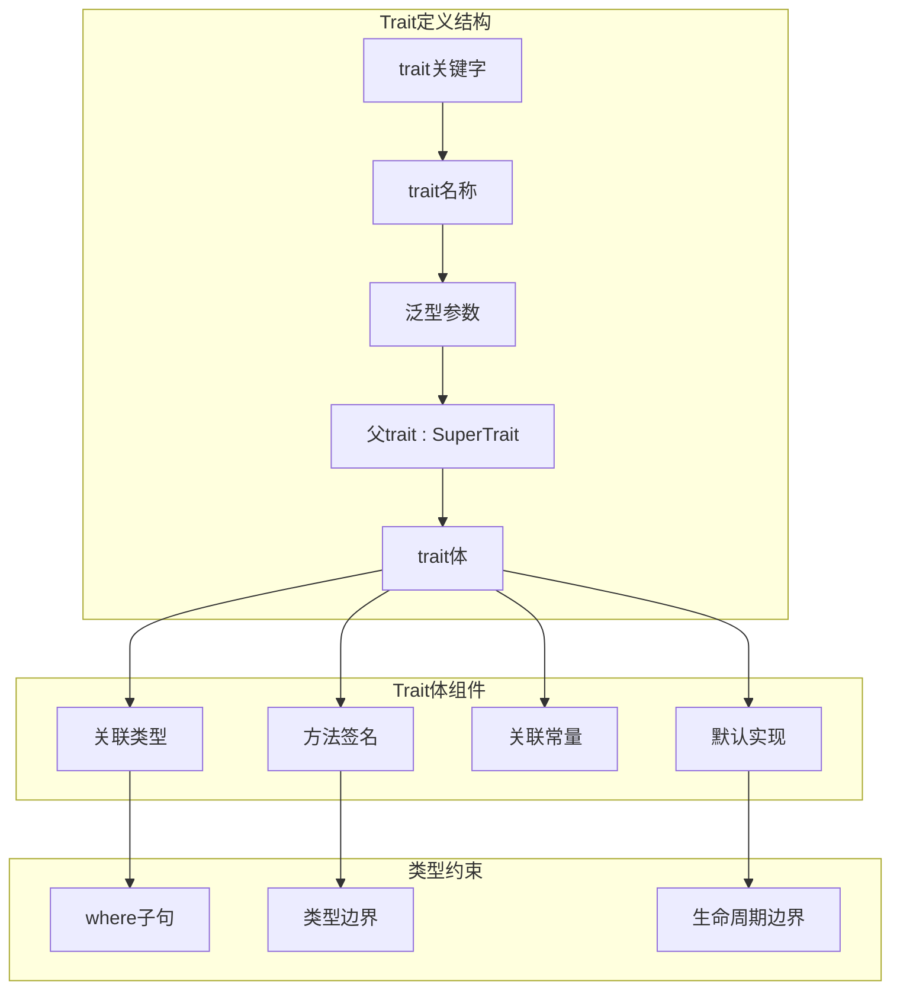

# 5.3.1 Rust Trait定义语义模型深度分析

**文档版本**: V1.0  
**创建日期**: 2025-01-27  
**所属层**: 转换语义层 (Transformation Semantics Layer)  
**父模块**: [5.3 Trait系统语义](../00_trait_system_index.md)  
**交叉引用**: [1.1.5 Trait类型语义](../../01_foundation_semantics/01_type_system_semantics/05_trait_types_semantics.md), [5.3.2 impl语义](02_impl_semantics.md)

---

## 5.3.1.1 Trait定义理论基础

### 5.3.1.1.1 Trait语义域的形式化定义

**定义 5.3.1.1** (Trait语义域)
Rust的trait系统可形式化为类型类（type class）的扩展：

$$\text{Trait} = \langle \text{Name}, \text{Methods}, \text{AssocTypes}, \text{SuperTraits}, \text{Bounds} \rangle$$

其中：
- $\text{Name} : \text{Identifier}$ - trait名称
- $\text{Methods} : \text{Set}(\text{MethodSignature})$ - 方法签名集合
- $\text{AssocTypes} : \text{Set}(\text{AssociatedType})$ - 关联类型集合
- $\text{SuperTraits} : \text{Set}(\text{Trait})$ - 父trait集合
- $\text{Bounds} : \text{Set}(\text{TypeConstraint})$ - 类型约束集合

### 5.3.1.1.2 Trait的范畴论语义

**Trait作为函子**：
在范畴论中，trait可以建模为函子 $F: \mathcal{C} \rightarrow \mathcal{D}$，其中：
- $\mathcal{C}$ 是类型范畴
- $\mathcal{D}$ 是带有trait方法的类型范畴



### 5.3.1.1.3 Trait定义的操作语义

**Trait定义规则**：
$$\frac{\text{trait } T\langle \alpha_1, \ldots, \alpha_n \rangle : S_1 + \cdots + S_m \{ \text{items} \}}{\Gamma \vdash T : \forall \alpha_1, \ldots, \alpha_n. \text{Trait}} \text{[TRAIT-DEF]}$$

其中 $S_1, \ldots, S_m$ 是父trait，$\text{items}$ 是trait的成员项。

---

## 5.3.1.2 基础Trait定义语义

### 5.3.1.2.1 简单方法trait

```rust
// 基础trait定义
trait Drawable {
    fn draw(&self);
    fn area(&self) -> f64;
    
    // 带默认实现的方法
    fn description(&self) -> String {
        format!("A drawable object with area: {}", self.area())
    }
}

// 带参数的方法
trait Scalable {
    fn scale(&mut self, factor: f64);
    fn get_scale(&self) -> f64;
    
    // 静态方法
    fn default_scale() -> f64 {
        1.0
    }
}

// 泛型trait
trait Container<T> {
    fn add(&mut self, item: T);
    fn remove(&mut self) -> Option<T>;
    fn is_empty(&self) -> bool;
    
    // 带where子句的方法
    fn find<F>(&self, predicate: F) -> Option<&T>
    where
        F: Fn(&T) -> bool;
}
```

**方法签名语义**：
$$\frac{\text{fn } m(self, p_1: \tau_1, \ldots, p_n: \tau_n) \rightarrow \tau_{ret}}{\text{method}(m) : \text{Self} \times \tau_1 \times \cdots \times \tau_n \rightarrow \tau_{ret}} \text{[METHOD-SIG]}$$

### 5.3.1.2.2 关联类型trait

```rust
// 带关联类型的trait
trait Iterator {
    type Item;  // 关联类型
    
    fn next(&mut self) -> Option<Self::Item>;
    
    // 使用关联类型的默认方法
    fn collect<C: FromIterator<Self::Item>>(self) -> C
    where
        Self: Sized,
    {
        FromIterator::from_iter(self)
    }
    
    // 带约束的关联类型方法
    fn sum(self) -> Self::Item
    where
        Self: Sized,
        Self::Item: std::ops::Add<Output = Self::Item> + Default,
    {
        self.fold(Default::default(), |acc, x| acc + x)
    }
}

// 多个关联类型
trait Graph {
    type Node;
    type Edge;
    type NodeIter: Iterator<Item = Self::Node>;
    type EdgeIter: Iterator<Item = Self::Edge>;
    
    fn nodes(&self) -> Self::NodeIter;
    fn edges(&self) -> Self::EdgeIter;
    fn add_node(&mut self, node: Self::Node);
    fn add_edge(&mut self, edge: Self::Edge);
}
```

**关联类型语义**：
$$\frac{\text{trait } T \{ \text{type } A; \ldots \}}{\text{assoc\_type}(T, A) : \text{Type}} \text{[ASSOC-TYPE]}$$

### 5.3.1.2.3 关联常量trait

```rust
// 带关联常量的trait
trait Numeric {
    const ZERO: Self;
    const ONE: Self;
    const MAX: Self;
    const MIN: Self;
    
    fn is_zero(&self) -> bool;
    fn is_positive(&self) -> bool;
    
    // 使用关联常量的默认方法
    fn reset(&mut self) -> Self
    where
        Self: Sized + Clone,
    {
        Self::ZERO.clone()
    }
}

// 泛型关联常量
trait BitSet<const N: usize> {
    const SIZE: usize = N;
    
    fn set_bit(&mut self, index: usize) -> Result<(), &'static str> {
        if index >= Self::SIZE {
            Err("Index out of bounds")
        } else {
            self.set_bit_unchecked(index);
            Ok(())
        }
    }
    
    fn set_bit_unchecked(&mut self, index: usize);
}
```

**关联常量语义**：
$$\frac{\text{trait } T \{ \text{const } C: \tau; \ldots \}}{\text{assoc\_const}(T, C) : \tau} \text{[ASSOC-CONST]}$$

---

## 5.3.1.3 高级Trait定义语义

### 5.3.1.3.1 父trait继承

```rust
// 基础trait
trait Animal {
    fn name(&self) -> &str;
    fn make_sound(&self);
}

// 继承单个父trait
trait Dog: Animal {
    fn breed(&self) -> &str;
    
    // 可以重新定义父trait的默认方法
    fn make_sound(&self) {
        println!("Woof!");
    }
}

// 继承多个父trait
trait Flyable {
    fn fly(&self);
    fn max_altitude(&self) -> f64;
}

trait Swimmable {
    fn swim(&self);
    fn max_depth(&self) -> f64;
}

trait Duck: Animal + Flyable + Swimmable {
    // Duck必须实现所有父trait的方法
    fn quack(&self) {
        println!("Quack!");
    }
    
    // 重写父trait方法
    fn make_sound(&self) {
        self.quack();
    }
}
```

**父trait继承语义**：
$$\frac{\text{trait } T : S_1 + \cdots + S_n \quad \text{impl } T \text{ for } \tau}{\text{impl } S_i \text{ for } \tau \quad \forall i \in [1,n]} \text{[SUPER-TRAIT]}$$

### 5.3.1.3.2 高阶trait边界

```rust
// 高阶trait边界（Higher-Ranked Trait Bounds）
trait Closure<Args> {
    type Output;
    
    fn call(&self, args: Args) -> Self::Output;
}

// 使用高阶生命周期的trait
trait HigherRanked {
    // 对于任意生命周期'a，都必须满足约束
    fn process<F>(&self, f: F) -> String
    where
        F: for<'a> Fn(&'a str) -> &'a str;
}

// 复杂的高阶边界
trait ComplexBounds<T> 
where
    T: for<'a> Fn(&'a str) -> &'a str + Send + Sync,
{
    fn apply(&self, input: &str, func: T) -> String;
}

// GAT (Generic Associated Types) 示例
trait LendingIterator {
    type Item<'a> where Self: 'a;
    
    fn next<'a>(&'a mut self) -> Option<Self::Item<'a>>;
}
```

**高阶边界语义**：
$$\frac{\text{for}\langle 'a \rangle F(\alpha, 'a)}{\text{HRTB}(F)} \text{[HIGHER-RANKED]}$$

### 5.3.1.3.3 对象安全trait

```rust
// 对象安全的trait
trait ObjectSafe {
    fn method(&self) -> i32;
    fn another_method(&self, x: i32) -> String;
    
    // 带默认实现的方法也是对象安全的
    fn default_method(&self) -> String {
        "default".to_string()
    }
}

// 非对象安全的trait
trait NotObjectSafe {
    // 泛型方法使trait非对象安全
    fn generic_method<T>(&self, x: T) -> T;
    
    // 静态方法使trait非对象安全
    fn static_method() -> i32;
    
    // Self类型在返回位置使trait非对象安全
    fn return_self(&self) -> Self;
    
    // Sized约束使trait非对象安全
    fn sized_method(&self) where Self: Sized;
}

// 条件对象安全
trait ConditionallyObjectSafe {
    fn object_safe_method(&self) -> i32;
    
    // 这个方法只有在特定条件下才能调用
    fn not_object_safe_method<T>(&self, x: T) -> T
    where
        Self: Sized;
}

// 使用trait对象
fn use_trait_objects() {
    let objects: Vec<Box<dyn ObjectSafe>> = vec![
        // Box::new(SomeImplementation),
    ];
    
    for obj in objects {
        println!("Result: {}", obj.method());
    }
}
```

**对象安全规则**：
$$\frac{\text{trait } T \text{ is object-safe}}{\text{dyn } T \text{ is valid}} \text{[OBJECT-SAFETY]}$$

对象安全要求：
1. 没有泛型方法
2. 没有静态方法
3. `Self`类型只能出现在特定位置
4. 没有`Sized`约束

---

## 5.3.1.4 泛型Trait定义语义

### 5.3.1.4.1 类型参数trait

```rust
// 基础泛型trait
trait Convert<T> {
    fn convert(self) -> T;
}

// 多个类型参数
trait Combine<T, U> {
    type Output;
    
    fn combine(self, other: T) -> Self::Output;
    fn combine_with_u(self, other: U) -> Self::Output;
}

// 带约束的泛型trait
trait Serialize<T> 
where
    T: Clone + Send + Sync,
{
    fn serialize(&self) -> T;
    fn deserialize(data: T) -> Self;
    
    // 使用约束的默认方法
    fn clone_and_serialize(&self) -> T {
        self.serialize().clone()
    }
}

// 自递归的泛型trait
trait SelfReferential<T: SelfReferential<T>> {
    fn process(&self, other: &T) -> T;
}
```

### 5.3.1.4.2 生命周期参数trait

```rust
// 带生命周期参数的trait
trait Borrowable<'a> {
    type Borrowed: 'a;
    
    fn borrow(&'a self) -> Self::Borrowed;
}

// 多个生命周期参数
trait Relatable<'a, 'b> {
    fn relate(&'a self, other: &'b Self) -> bool;
    
    // 生命周期约束
    fn long_lived_relate(&'a self, other: &'b Self) -> &'a str
    where
        'b: 'a;  // 'b outlives 'a
}

// 高阶生命周期trait
trait HigherLifetime {
    fn process<F>(&self, f: F) -> String
    where
        F: for<'a> Fn(&'a str) -> &'a str;
        
    fn with_closure<'a, F>(&'a self, f: F) -> &'a str
    where
        F: Fn(&'a str) -> &'a str;
}
```

### 5.3.1.4.3 常量泛型trait

```rust
// 常量泛型trait
trait FixedSizeArray<T, const N: usize> {
    fn get(&self, index: usize) -> Option<&T>;
    fn set(&mut self, index: usize, value: T) -> Result<(), &'static str>;
    
    // 使用常量泛型的方法
    fn len(&self) -> usize {
        N
    }
    
    fn is_full(&self) -> bool {
        self.len() == N
    }
}

// 复杂常量泛型约束
trait Matrix<T, const ROWS: usize, const COLS: usize> 
where
    T: Copy + Default,
{
    fn new() -> Self;
    fn get(&self, row: usize, col: usize) -> Option<T>;
    fn set(&mut self, row: usize, col: usize, value: T);
    
    // 矩阵运算，要求维度匹配
    fn multiply<const OTHER_COLS: usize>(
        &self, 
        other: &impl Matrix<T, COLS, OTHER_COLS>
    ) -> impl Matrix<T, ROWS, OTHER_COLS>;
}
```

**常量泛型trait语义**：
$$\frac{\text{trait } T\langle \text{const } N: \text{usize} \rangle}{\text{const\_generic\_trait}(T, N)} \text{[CONST-GENERIC-TRAIT]}$$

---

## 5.3.1.5 Trait默认实现语义

### 5.3.1.5.1 简单默认实现

```rust
// 带默认实现的trait
trait DefaultBehavior {
    // 必须实现的方法
    fn required_method(&self) -> i32;
    
    // 有默认实现的方法
    fn optional_method(&self) -> String {
        format!("Default implementation: {}", self.required_method())
    }
    
    // 基于其他方法的默认实现
    fn computed_method(&self) -> i32 {
        self.required_method() * 2
    }
    
    // 可被重写的默认实现
    fn overridable_method(&self) -> bool {
        self.required_method() > 0
    }
}

// 实现trait时可以选择重写默认方法
struct MyStruct {
    value: i32,
}

impl DefaultBehavior for MyStruct {
    fn required_method(&self) -> i32 {
        self.value
    }
    
    // 重写默认实现
    fn overridable_method(&self) -> bool {
        self.value > 10  // 不同的逻辑
    }
    
    // 使用默认实现: optional_method 和 computed_method
}
```

### 5.3.1.5.2 条件默认实现

```rust
// 带条件的默认实现
trait ConditionalDefault<T> {
    fn basic_method(&self) -> T;
    
    // 只有当T实现了Clone时，才有默认实现
    fn clone_method(&self) -> T 
    where
        T: Clone,
    {
        self.basic_method().clone()
    }
    
    // 只有当T实现了Display时，才有默认实现
    fn display_method(&self) -> String
    where
        T: std::fmt::Display,
    {
        format!("Value: {}", self.basic_method())
    }
}

// 基于Self类型的条件默认实现
trait SelfConditional {
    fn base_method(&self) -> i32;
    
    // 只有当Self实现了Clone时，才有默认实现
    fn clone_self(&self) -> Self
    where
        Self: Clone + Sized,
    {
        self.clone()
    }
    
    // 只有当Self是Copy类型时，才有默认实现
    fn copy_self(&self) -> Self
    where
        Self: Copy,
    {
        *self
    }
}
```

### 5.3.1.5.3 递归默认实现

```rust
// 递归默认实现
trait Recursive {
    fn base_case(&self) -> bool;
    fn step(&self) -> Self;
    
    // 递归默认实现
    fn recursive_process(&self, depth: usize) -> usize
    where
        Self: Sized,
    {
        if depth == 0 || self.base_case() {
            0
        } else {
            1 + self.step().recursive_process(depth - 1)
        }
    }
}

// 相互递归的默认实现
trait MutualRecursiveA {
    fn method_a(&self) -> i32;
    
    fn call_b<T: MutualRecursiveB>(&self, other: &T) -> i32 {
        self.method_a() + other.method_b()
    }
}

trait MutualRecursiveB {
    fn method_b(&self) -> i32;
    
    fn call_a<T: MutualRecursiveA>(&self, other: &T) -> i32 {
        self.method_b() + other.method_a()
    }
}
```

---

## 5.3.1.6 特殊Trait语义

### 5.3.1.6.1 marker trait

```rust
// 标记trait (marker trait)
trait Marker {}

// 编译器内置的标记trait
// Send: 类型可以安全地在线程间传递
// Sync: 类型可以安全地在线程间共享引用
// Copy: 类型具有复制语义
// Sized: 类型在编译期有已知大小

// 自定义标记trait
trait Serializable {}
trait Debuggable {}
trait Persistent {}

// 组合标记trait
trait FullyFeatured: Serializable + Debuggable + Persistent + Send + Sync {}

// 使用标记trait进行类型约束
fn process_marked<T>() 
where 
    T: Marker + Send + Sync,
{
    // 函数实现
}

// 条件标记trait实现
struct ConditionallyMarked<T> {
    data: T,
}

// 只有当T满足某些条件时，才实现标记trait
impl<T> Marker for ConditionallyMarked<T> 
where 
    T: Send + Sync + 'static,
{}
```

### 5.3.1.6.2 自动trait

```rust
// 自动trait (auto trait)
// 这些trait由编译器自动实现

// Send trait - 自动实现，除非包含!Send类型
struct AutoSend {
    data: i32,  // i32 is Send
    more_data: String,  // String is Send
}
// AutoSend 自动实现 Send

struct NotSend {
    data: std::rc::Rc<i32>,  // Rc<T> is !Send
}
// NotSend 不实现 Send

// 手动实现Send (unsafe)
struct ManualSend {
    ptr: *const i32,  // 裸指针默认不是Send
}

unsafe impl Send for ManualSend {}

// 显式取消自动trait
struct ExplicitlyNotSend {
    data: i32,
    _marker: std::marker::PhantomData<*const u8>,  // 使类型!Send
}

// 自定义auto trait (nightly feature)
#![feature(auto_traits)]

auto trait CustomAuto {}

// 大多数类型会自动实现CustomAuto
struct AutoImplemented {
    x: i32,
}

// 手动选择不实现
impl !CustomAuto for String {}
```

### 5.3.1.6.3 关联类型投影

```rust
// 复杂的关联类型投影
trait ComplexAssociated {
    type Input;
    type Output;
    type Error;
    
    fn process(&self, input: Self::Input) -> Result<Self::Output, Self::Error>;
}

// 嵌套关联类型
trait NestedAssociated {
    type Container: Iterator;
    type Item = <Self::Container as Iterator>::Item;
    
    fn get_container(&self) -> Self::Container;
    fn get_first_item(&self) -> Option<Self::Item> {
        self.get_container().next()
    }
}

// 关联类型边界
trait BoundedAssociated {
    type Bounded: Clone + Send + Sync;
    
    fn create_bounded(&self) -> Self::Bounded;
    fn clone_bounded(&self) -> Self::Bounded {
        self.create_bounded().clone()
    }
}

// 高阶关联类型
trait HigherAssociated {
    type Higher<T>: Iterator<Item = T>;
    
    fn create_higher<T>(&self, items: Vec<T>) -> Self::Higher<T>;
}
```

---

## 5.3.1.7 Trait的编译期语义

### 5.3.1.7.1 Trait解析算法

```rust
// Trait解析的复杂情况
trait A {
    fn method(&self) -> &str;
}

trait B {
    fn method(&self) -> &str;
}

struct Ambiguous;

impl A for Ambiguous {
    fn method(&self) -> &str {
        "From A"
    }
}

impl B for Ambiguous {
    fn method(&self) -> &str {
        "From B"
    }
}

fn trait_resolution() {
    let obj = Ambiguous;
    
    // 歧义调用 - 编译错误
    // println!("{}", obj.method());
    
    // 消除歧义的方法
    println!("{}", A::method(&obj));
    println!("{}", B::method(&obj));
    println!("{}", <Ambiguous as A>::method(&obj));
    println!("{}", <Ambiguous as B>::method(&obj));
}
```

**Trait解析规则**：
$$\frac{\text{impl } T \text{ for } \tau \quad \text{unique}(\text{method}, T, \tau)}{\text{resolve}(\tau.\text{method}) = T::\text{method}} \text{[TRAIT-RESOLUTION]}$$

### 5.3.1.7.2 孤儿规则 (Orphan Rule)

```rust
// 孤儿规则限制
// 不能为外部类型实现外部trait

// 错误：不能为Vec<T>实现Display
// impl<T> std::fmt::Display for Vec<T> {
//     fn fmt(&self, f: &mut std::fmt::Formatter) -> std::fmt::Result {
//         write!(f, "Vec with {} elements", self.len())
//     }
// }

// 正确：newtype模式绕过孤儿规则
struct MyVec<T>(Vec<T>);

impl<T> std::fmt::Display for MyVec<T> {
    fn fmt(&self, f: &mut std::fmt::Formatter) -> std::fmt::Result {
        write!(f, "MyVec with {} elements", self.0.len())
    }
}

// 正确：本地trait或本地类型
trait LocalTrait {
    fn local_method(&self);
}

impl<T> LocalTrait for Vec<T> {  // 本地trait，外部类型
    fn local_method(&self) {
        println!("Local trait implementation");
    }
}

struct LocalType;

impl std::fmt::Display for LocalType {  // 外部trait，本地类型
    fn fmt(&self, f: &mut std::fmt::Formatter) -> std::fmt::Result {
        write!(f, "LocalType")
    }
}
```

**孤儿规则语义**：
$$\frac{\text{impl } T \text{ for } \tau}{\text{local}(T) \lor \text{local}(\tau)} \text{[ORPHAN-RULE]}$$

### 5.3.1.7.3 一致性检查

```rust
// 一致性检查防止冲突的实现
trait Consistency<T> {
    fn method(&self) -> T;
}

// 这些实现可能冲突
// impl<T> Consistency<T> for T { ... }       // 全覆盖实现
// impl Consistency<i32> for String { ... }   // 特定实现

// 编译器确保不会有重叠的实现

// 正确的特化模式 (specialization, unstable)
// #![feature(specialization)]
// 
// impl<T> Consistency<T> for T {
//     default fn method(&self) -> T { ... }
// }
// 
// impl Consistency<i32> for i32 {
//     fn method(&self) -> i32 { ... }  // 特化实现
// }
```

---

## 5.3.1.8 动态分发与Trait对象

### 5.3.1.8.1 Trait对象创建

```rust
// 创建trait对象
trait Draw {
    fn draw(&self);
    fn area(&self) -> f64;
}

struct Circle { radius: f64 }
struct Rectangle { width: f64, height: f64 }

impl Draw for Circle {
    fn draw(&self) {
        println!("Drawing circle with radius {}", self.radius);
    }
    
    fn area(&self) -> f64 {
        std::f64::consts::PI * self.radius * self.radius
    }
}

impl Draw for Rectangle {
    fn draw(&self) {
        println!("Drawing rectangle {}x{}", self.width, self.height);
    }
    
    fn area(&self) -> f64 {
        self.width * self.height
    }
}

fn trait_objects() {
    // 不同的trait对象创建方式
    let objects: Vec<Box<dyn Draw>> = vec![
        Box::new(Circle { radius: 5.0 }),
        Box::new(Rectangle { width: 3.0, height: 4.0 }),
    ];
    
    for obj in objects {
        obj.draw();
        println!("Area: {}", obj.area());
    }
    
    // 引用形式的trait对象
    let circle = Circle { radius: 2.0 };
    let drawable: &dyn Draw = &circle;
    drawable.draw();
    
    // Arc<dyn Trait>形式
    let shared: std::sync::Arc<dyn Draw> = std::sync::Arc::new(circle);
    shared.draw();
}
```

### 5.3.1.8.2 虚函数表语义

```rust
// 虚函数表的概念模型
// trait对象内部结构：(data_ptr, vtable_ptr)

// vtable的结构 (概念性的)
struct VTable {
    destructor: fn(*mut ()),
    size: usize,
    align: usize,
    method_pointers: [fn(*const ()); /* 方法数量 */],
}

// 动态分发的性能成本
fn dynamic_dispatch_cost() {
    let objects: Vec<Box<dyn Draw>> = vec![
        Box::new(Circle { radius: 1.0 }),
        Box::new(Rectangle { width: 1.0, height: 1.0 }),
    ];
    
    // 每次方法调用都通过vtable进行间接调用
    for obj in objects {
        obj.draw();  // 间接调用：(*vtable.draw)(data_ptr)
    }
}

// 对比静态分发
fn static_dispatch<T: Draw>(drawable: &T) {
    drawable.draw();  // 直接调用，编译期确定
}
```

**虚函数表语义**：
$$\text{vtable}(T) = \langle \text{destructor}, \text{size}, \text{align}, \{\text{method}_i\} \rangle$$

$$\frac{\text{dyn } T \quad \text{call}(\text{method})}{\text{indirect\_call}(\text{vtable}.\text{method}, \text{data})} \text{[DYNAMIC-DISPATCH]}$$

---

## 5.3.1.9 Trait边界与约束语义

### 5.3.1.9.1 复杂边界组合

```rust
// 复杂的trait边界
fn complex_bounds<T, U, V>(x: T, y: U, z: V) -> String
where
    T: Clone + Send + Sync + std::fmt::Debug,
    U: Iterator<Item = i32> + ExactSizeIterator,
    V: Fn(i32) -> String + Clone,
    T::Output: std::fmt::Display,  // 关联类型边界
{
    let cloned = x.clone();
    let size = y.len();
    let result = z(42);
    
    format!("Debug: {:?}, Size: {}, Result: {}", cloned, size, result)
}

// 条件trait边界
fn conditional_bounds<T>(data: T) -> T
where
    T: Clone,
    T: std::fmt::Debug,  // 每个边界都可以单独指定
{
    println!("Data: {:?}", data);
    data.clone()
}

// where子句中的复杂约束
fn where_clause_complexity<T, F>() 
where
    T: Iterator,
    T::Item: Clone + Send,
    F: Fn(T::Item) -> T::Item + Send + Sync,
    for<'a> F: Fn(&'a T::Item) -> &'a T::Item,  // 高阶生命周期边界
{
    // 函数实现
}
```

### 5.3.1.9.2 条件实现

```rust
// 条件trait实现
use std::fmt;

struct Wrapper<T>(T);

// 只有当T实现Debug时，Wrapper<T>才实现Debug
impl<T: fmt::Debug> fmt::Debug for Wrapper<T> {
    fn fmt(&self, f: &mut fmt::Formatter) -> fmt::Result {
        write!(f, "Wrapper({:?})", self.0)
    }
}

// 只有当T实现Clone时，Wrapper<T>才实现Clone
impl<T: Clone> Clone for Wrapper<T> {
    fn clone(&self) -> Self {
        Wrapper(self.0.clone())
    }
}

// 多重条件实现
impl<T> Wrapper<T> 
where 
    T: Clone + Send + Sync + 'static,
{
    fn complex_operation(&self) -> T 
    where 
        T: Default,  // 方法级别的额外约束
    {
        self.0.clone()
    }
}

// 负约束 (negative reasoning)
// 编译器推理：如果T不实现Clone，则Wrapper<T>不实现Clone
fn test_conditional_impl() {
    let wrapper_int = Wrapper(42);
    let cloned = wrapper_int.clone();  // 可以，因为i32: Clone
    
    let wrapper_rc = Wrapper(std::rc::Rc::new(42));
    let cloned_rc = wrapper_rc.clone();  // 可以，因为Rc<T>: Clone
    
    // 如果T不实现Clone，以下代码将无法编译
    // let wrapper_no_clone = Wrapper(SomeNonCloneType);
    // let fail = wrapper_no_clone.clone();  // 编译错误
}
```

### 5.3.1.9.3 边界的传播和推理

```rust
// trait边界的传播
fn propagation_example<T: Clone + Send>(item: T) -> impl Clone + Send {
    // 返回的类型自动继承T的边界
    item.clone()
}

// 边界推理
fn inference_example<T>(vec: Vec<T>) -> T 
where
    T: Default,  // 需要Default来创建默认值
{
    vec.into_iter().next().unwrap_or_default()
}

// 自动边界推导
fn auto_bounds<T>(items: Vec<T>) -> Vec<T>
where
    T: Clone,  // 编译器推导出需要Clone
{
    items.iter().cloned().collect()  // cloned()需要T: Clone
}

// 最小边界原则
trait MinimalBounds {
    // 只指定真正需要的边界
    fn minimal<T: Clone>(&self, item: T) -> T {
        item.clone()  // 只使用Clone，不要求其他不必要的边界
    }
}
```

---

## 5.3.1.10 相关引用与扩展阅读

### 5.3.1.10.1 内部交叉引用
- [5.3.2 impl语义](02_impl_semantics.md) - trait实现详细分析
- [5.3.3 trait边界语义](03_trait_bounds_semantics.md) - trait约束系统
- [1.1.5 trait类型语义](../../01_foundation_semantics/01_type_system_semantics/05_trait_types_semantics.md) - trait类型理论

### 5.3.1.10.2 外部参考文献
1. Wadler, P. & Blott, S. *How to make ad-hoc polymorphism less ad hoc*. POPL 1989.
2. Jones, M.P. *Type Classes: an exploration of the design space*. Haskell Workshop 1997.
3. Rust Reference: [Traits](https://doc.rust-lang.org/reference/items/traits.html)

### 5.3.1.10.3 实现参考
- [rustc_trait_selection](https://doc.rust-lang.org/nightly/nightly-rustc/rustc_trait_selection/index.html) - trait选择算法
- [rustc_typeck](https://doc.rust-lang.org/nightly/nightly-rustc/rustc_typeck/index.html) - 类型检查和trait解析

---

**文档元数据**:
- **复杂度级别**: ⭐⭐⭐⭐⭐ (专家级)
- **前置知识**: Rust类型系统、泛型、生命周期、类型类理论
- **相关工具**: rustc, rust-analyzer, cargo
- **更新频率**: 与Rust trait系统演进同步
- **维护者**: Rust转换语义分析工作组 