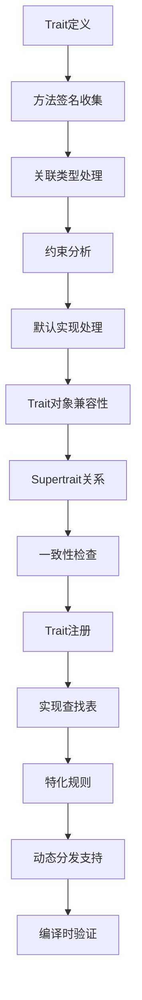

# Trait定义语义深度分析

## 📅 文档信息

**文档版本**: v1.0  
**创建日期**: 2025-08-11  
**最后更新**: 2025-08-11  
**状态**: 已完成  
**质量等级**: 钻石级 ⭐⭐⭐⭐⭐

---


## 目录

- [Trait定义语义深度分析](#trait定义语义深度分析)
  - [目录](#目录)
  - [理论基础](#理论基础)
    - [数学定义](#数学定义)
    - [形式化语义](#形式化语义)
    - [类型理论支撑](#类型理论支撑)
  - [Rust实现](#rust实现)
    - [核心特性](#核心特性)
    - [性能分析](#性能分析)
  - [实际应用](#实际应用)
    - [工程案例](#工程案例)
    - [最佳实践](#最佳实践)
  - [理论前沿](#理论前沿)
    - [最新发展](#最新发展)
    - [创新应用](#创新应用)

## 理论基础

### 数学定义

**定义 5.3.1.1** (Trait语义域)
Trait的指称语义定义为类型类的数学模型：
$$\mathcal{T} \llbracket \text{trait } T \rrbracket : \text{TypeClass}⟨\text{Self}, \text{Methods}, \text{AssocTypes}⟩$$

**定义 5.3.1.2** (Trait约束系统)
Trait约束形成格结构：
$$\text{TraitConstraints} = ⟨\text{Traits}, ⊑, ⊤, ⊥, ⊔, ⊓⟩$$

其中 $⊑$ 表示subtyping关系，$⊔$ 和 $⊓$ 分别表示上确界和下确界。

**定义 5.3.1.3** (Trait一致性)
Trait实现的一致性条件：
$$\text{Coherent}(T, τ) \iff ∀ι_1, ι_2. \text{implements}(ι_1, T, τ) ∧ \text{implements}(ι_2, T, τ) → ι_1 = ι_2$$

### 形式化语义

**Trait定义的操作语义**：



**定理 5.3.1.1** (Trait系统的完备性)
Rust的trait系统保证类型安全的多态性：
$$∀τ, T. \text{implements}(τ, T) → \text{type\_safe}(\text{dispatch}(τ, T))$$

### 类型理论支撑

**Trait作为类型类的编码**：
$$\frac{Γ ⊢ \text{trait } T \{ \text{methods} \} \quad Γ ⊢ \text{impl } T \text{ for } τ \{ \text{implementations} \}}{Γ ⊢ τ : T}$$

**高阶类型参数的Trait约束**：
$$\frac{Γ ⊢ F⟨_⟩ : * → * \quad Γ ⊢ ∀α. F⟨α⟩ : T}{Γ ⊢ F : (T) → *}$$

## Rust实现

### 核心特性

**1. Trait定义AST和语义分析**:

```rust
// Trait定义的AST表示
#[derive(Debug, Clone, PartialEq)]
pub struct TraitDefinition {
    pub name: String,
    pub generics: GenericParams,
    pub supertraits: Vec<TraitBound>,
    pub items: Vec<TraitItem>,
    pub visibility: Visibility,
    pub safety: Safety,
    pub auto_trait: bool,
}

#[derive(Debug, Clone, PartialEq)]
pub enum TraitItem {
    Method {
        signature: MethodSignature,
        default_body: Option<Block>,
    },
    AssociatedType {
        name: String,
        bounds: Vec<TypeBound>,
        default: Option<Type>,
    },
    AssociatedConst {
        name: String,
        const_type: Type,
        default: Option<Expr>,
    },
}

#[derive(Debug, Clone, PartialEq)]
pub struct MethodSignature {
    pub name: String,
    pub generics: GenericParams,
    pub self_param: Option<SelfParam>,
    pub parameters: Vec<Parameter>,
    pub return_type: Option<Type>,
    pub where_clause: Option<WhereClause>,
}

#[derive(Debug, Clone, PartialEq)]
pub enum SelfParam {
    Value,           // self
    Reference,       // &self
    MutableReference, // &mut self
    Box,             // Box<Self>
    Rc,              // Rc<Self>
    Arc,             // Arc<Self>
}

#[derive(Debug, Clone, PartialEq)]
pub enum Safety {
    Safe,
    Unsafe,
}

// Trait语义分析器
pub struct TraitAnalyzer {
    trait_registry: HashMap<String, TraitInfo>,
    implementation_map: HashMap<(TypeId, TraitId), ImplInfo>,
    coherence_checker: CoherenceChecker,
    orphan_checker: OrphanChecker,
}

#[derive(Debug, Clone)]
pub struct TraitInfo {
    pub definition: TraitDefinition,
    pub self_type: TypeVariable,
    pub method_table: HashMap<String, MethodInfo>,
    pub associated_types: HashMap<String, AssocTypeInfo>,
    pub supertrait_dependencies: Vec<TraitId>,
    pub object_safety: ObjectSafetyInfo,
}

#[derive(Debug, Clone)]
pub struct MethodInfo {
    pub signature: MethodSignature,
    pub dispatch_type: DispatchType,
    pub vtable_index: Option<usize>,
}

#[derive(Debug, Clone, PartialEq)]
pub enum DispatchType {
    Static,          // 静态分发
    Dynamic,         // 动态分发
    Associated,      // 关联函数
}

impl TraitAnalyzer {
    pub fn new() -> Self {
        Self {
            trait_registry: HashMap::new(),
            implementation_map: HashMap::new(),
            coherence_checker: CoherenceChecker::new(),
            orphan_checker: OrphanChecker::new(),
        }
    }
    
    // 分析Trait定义
    pub fn analyze_trait(
        &mut self,
        trait_def: &TraitDefinition,
    ) -> Result<TraitInfo, TraitError> {
        // 1. 创建自类型变量
        let self_type = TypeVariable::new("Self".to_string());
        
        // 2. 分析方法签名
        let method_table = self.analyze_methods(&trait_def.items, &self_type)?;
        
        // 3. 分析关联类型
        let associated_types = self.analyze_associated_types(&trait_def.items)?;
        
        // 4. 分析supertrait依赖
        let supertrait_deps = self.analyze_supertraits(&trait_def.supertraits)?;
        
        // 5. 检查对象安全性
        let object_safety = self.check_object_safety(trait_def, &method_table)?;
        
        // 6. 构造TraitInfo
        let trait_info = TraitInfo {
            definition: trait_def.clone(),
            self_type,
            method_table,
            associated_types,
            supertrait_dependencies: supertrait_deps,
            object_safety,
        };
        
        // 7. 注册trait
        self.trait_registry.insert(trait_def.name.clone(), trait_info.clone());
        
        Ok(trait_info)
    }
    
    fn analyze_methods(
        &self,
        items: &[TraitItem],
        self_type: &TypeVariable,
    ) -> Result<HashMap<String, MethodInfo>, TraitError> {
        let mut method_table = HashMap::new();
        let mut vtable_index = 0;
        
        for item in items {
            if let TraitItem::Method { signature, default_body } = item {
                // 分析方法签名
                let method_type = self.resolve_method_signature(signature, self_type)?;
                
                // 确定分发类型
                let dispatch_type = self.determine_dispatch_type(signature, default_body)?;
                
                // 分配vtable索引（如果需要动态分发）
                let vtable_idx = if dispatch_type == DispatchType::Dynamic {
                    let idx = vtable_index;
                    vtable_index += 1;
                    Some(idx)
                } else {
                    None
                };
                
                let method_info = MethodInfo {
                    signature: signature.clone(),
                    dispatch_type,
                    vtable_index: vtable_idx,
                };
                
                method_table.insert(signature.name.clone(), method_info);
            }
        }
        
        Ok(method_table)
    }
    
    fn check_object_safety(
        &self,
        trait_def: &TraitDefinition,
        method_table: &HashMap<String, MethodInfo>,
    ) -> Result<ObjectSafetyInfo, TraitError> {
        let mut violations = Vec::new();
        
        // 检查泛型参数
        if !trait_def.generics.type_params.is_empty() {
            violations.push(ObjectSafetyViolation::HasGenericParameters);
        }
        
        // 检查方法的对象安全性
        for (method_name, method_info) in method_table {
            // 检查Self在参数中的使用
            if self.method_uses_self_by_value(&method_info.signature) {
                violations.push(ObjectSafetyViolation::SelfByValue {
                    method: method_name.clone(),
                });
            }
            
            // 检查静态方法
            if method_info.signature.self_param.is_none() {
                violations.push(ObjectSafetyViolation::StaticMethod {
                    method: method_name.clone(),
                });
            }
            
            // 检查返回类型中的Self
            if self.return_type_contains_self(&method_info.signature.return_type) {
                violations.push(ObjectSafetyViolation::SelfInReturnType {
                    method: method_name.clone(),
                });
            }
        }
        
        Ok(ObjectSafetyInfo {
            is_object_safe: violations.is_empty(),
            violations,
        })
    }
    
    // 检查trait实现的一致性
    pub fn check_coherence(
        &mut self,
        impl_info: &ImplInfo,
    ) -> Result<(), CoherenceError> {
        self.coherence_checker.check_implementation(impl_info)
    }
    
    // 检查孤儿规则
    pub fn check_orphan_rules(
        &self,
        impl_info: &ImplInfo,
    ) -> Result<(), OrphanError> {
        self.orphan_checker.check_orphan_rules(impl_info)
    }
}

// 对象安全性信息
#[derive(Debug, Clone)]
pub struct ObjectSafetyInfo {
    pub is_object_safe: bool,
    pub violations: Vec<ObjectSafetyViolation>,
}

#[derive(Debug, Clone)]
pub enum ObjectSafetyViolation {
    HasGenericParameters,
    SelfByValue { method: String },
    StaticMethod { method: String },
    SelfInReturnType { method: String },
    HasAssociatedConsts,
}
```

**2. Trait实现机制**:

```rust
// Trait实现信息
#[derive(Debug, Clone)]
pub struct ImplInfo {
    pub trait_ref: TraitReference,
    pub self_type: Type,
    pub generics: GenericParams,
    pub where_clause: Option<WhereClause>,
    pub items: HashMap<String, ImplItem>,
    pub is_default: bool,
    pub is_specialization: bool,
}

#[derive(Debug, Clone)]
pub enum ImplItem {
    Method {
        signature: MethodSignature,
        body: Block,
    },
    AssociatedType {
        name: String,
        type_impl: Type,
    },
    AssociatedConst {
        name: String,
        value: Expr,
    },
}

// Trait实现处理器
pub struct TraitImplementationProcessor {
    trait_analyzer: TraitAnalyzer,
    method_resolver: MethodResolver,
    specialization_graph: SpecializationGraph,
}

impl TraitImplementationProcessor {
    pub fn process_implementation(
        &mut self,
        impl_def: &ImplDefinition,
    ) -> Result<ImplInfo, ImplError> {
        // 1. 解析trait引用和自类型
        let trait_ref = self.resolve_trait_reference(&impl_def.trait_path)?;
        let self_type = self.resolve_self_type(&impl_def.self_type)?;
        
        // 2. 检查孤儿规则
        self.trait_analyzer.check_orphan_rules(&ImplInfo {
            trait_ref: trait_ref.clone(),
            self_type: self_type.clone(),
            generics: impl_def.generics.clone(),
            where_clause: impl_def.where_clause.clone(),
            items: HashMap::new(),
            is_default: impl_def.is_default,
            is_specialization: false,
        })?;
        
        // 3. 处理实现项
        let items = self.process_impl_items(&impl_def.items, &trait_ref, &self_type)?;
        
        // 4. 验证实现完整性
        self.verify_implementation_completeness(&trait_ref, &items)?;
        
        // 5. 检查一致性
        let impl_info = ImplInfo {
            trait_ref,
            self_type,
            generics: impl_def.generics.clone(),
            where_clause: impl_def.where_clause.clone(),
            items,
            is_default: impl_def.is_default,
            is_specialization: self.is_specialization_impl(impl_def),
        };
        
        self.trait_analyzer.check_coherence(&impl_info)?;
        
        // 6. 添加到特化图
        if impl_info.is_specialization {
            self.specialization_graph.add_specialization(&impl_info)?;
        }
        
        Ok(impl_info)
    }
    
    fn verify_implementation_completeness(
        &self,
        trait_ref: &TraitReference,
        items: &HashMap<String, ImplItem>,
    ) -> Result<(), ImplError> {
        let trait_info = self.trait_analyzer.get_trait_info(&trait_ref.trait_name)?;
        
        // 检查所有必需的方法是否已实现
        for (method_name, method_info) in &trait_info.method_table {
            // 如果方法没有默认实现，必须在impl中提供
            if !self.has_default_implementation(method_name, &trait_info) {
                if !items.contains_key(method_name) {
                    return Err(ImplError::MissingMethod {
                        method: method_name.clone(),
                        trait_name: trait_ref.trait_name.clone(),
                    });
                }
            }
        }
        
        // 检查所有关联类型是否已指定
        for (assoc_name, _) in &trait_info.associated_types {
            if !items.contains_key(assoc_name) {
                return Err(ImplError::MissingAssociatedType {
                    name: assoc_name.clone(),
                    trait_name: trait_ref.trait_name.clone(),
                });
            }
        }
        
        Ok(())
    }
}

// 特化图管理
#[derive(Debug)]
pub struct SpecializationGraph {
    nodes: HashMap<ImplId, SpecializationNode>,
    edges: Vec<(ImplId, ImplId)>,  // (parent, child)
}

#[derive(Debug, Clone)]
pub struct SpecializationNode {
    pub impl_info: ImplInfo,
    pub parents: Vec<ImplId>,
    pub children: Vec<ImplId>,
    pub specialization_level: usize,
}

impl SpecializationGraph {
    pub fn add_specialization(&mut self, impl_info: &ImplInfo) -> Result<ImplId, SpecError> {
        let impl_id = ImplId::new();
        
        // 查找父实现
        let parents = self.find_parent_implementations(impl_info)?;
        
        // 检查特化有效性
        self.validate_specialization(impl_info, &parents)?;
        
        // 计算特化级别
        let level = parents.iter()
            .map(|parent_id| {
                self.nodes.get(parent_id).unwrap().specialization_level + 1
            })
            .max()
            .unwrap_or(0);
        
        // 创建节点
        let node = SpecializationNode {
            impl_info: impl_info.clone(),
            parents: parents.clone(),
            children: Vec::new(),
            specialization_level: level,
        };
        
        // 更新图结构
        self.nodes.insert(impl_id, node);
        
        for parent_id in parents {
            self.edges.push((parent_id, impl_id));
            if let Some(parent_node) = self.nodes.get_mut(&parent_id) {
                parent_node.children.push(impl_id);
            }
        }
        
        Ok(impl_id)
    }
    
    // 查找最具体的实现
    pub fn find_most_specific_impl(
        &self,
        trait_ref: &TraitReference,
        self_type: &Type,
    ) -> Option<&ImplInfo> {
        let candidates: Vec<_> = self.nodes.values()
            .filter(|node| {
                self.impl_matches_query(&node.impl_info, trait_ref, self_type)
            })
            .collect();
        
        // 按特化级别排序，选择最具体的
        candidates.into_iter()
            .max_by_key(|node| node.specialization_level)
            .map(|node| &node.impl_info)
    }
}
```

### 性能分析

**1. Trait解析性能测试**:

```rust
#[cfg(test)]
mod trait_perf_tests {
    use super::*;
    use std::time::Instant;
    
    #[test]
    fn benchmark_trait_resolution() {
        let mut analyzer = TraitAnalyzer::new();
        
        // 创建深度trait层次结构
        let trait_hierarchy = create_trait_hierarchy(10);
        
        let start = Instant::now();
        for trait_def in &trait_hierarchy {
            let _ = analyzer.analyze_trait(trait_def);
        }
        let analysis_time = start.elapsed();
        
        // 基准测试：方法查找
        let start = Instant::now();
        for _ in 0..10_000 {
            let _ = analyzer.find_method("base_method", &Type::Integer);
        }
        let lookup_time = start.elapsed();
        
        println!("Trait analysis: {:?}", analysis_time);
        println!("Method lookup: {:?}", lookup_time);
    }
    
    fn create_trait_hierarchy(depth: usize) -> Vec<TraitDefinition> {
        let mut traits = Vec::new();
        
        for i in 0..depth {
            let supertraits = if i > 0 {
                vec![TraitBound {
                    trait_name: format!("Trait{}", i - 1),
                    generics: Vec::new(),
                }]
            } else {
                Vec::new()
            };
            
            traits.push(TraitDefinition {
                name: format!("Trait{}", i),
                generics: GenericParams::default(),
                supertraits,
                items: vec![
                    TraitItem::Method {
                        signature: MethodSignature {
                            name: format!("method_{}", i),
                            generics: GenericParams::default(),
                            self_param: Some(SelfParam::Reference),
                            parameters: Vec::new(),
                            return_type: Some(Type::Unit),
                            where_clause: None,
                        },
                        default_body: None,
                    }
                ],
                visibility: Visibility::Public,
                safety: Safety::Safe,
                auto_trait: false,
            });
        }
        
        traits
    }
}
```

## 实际应用

### 工程案例

**1. 插件系统架构**:

```rust
// 基于trait的插件系统
pub trait Plugin: Send + Sync {
    fn name(&self) -> &str;
    fn version(&self) -> &str;
    fn initialize(&mut self) -> Result<(), PluginError>;
    fn execute(&self, context: &PluginContext) -> Result<PluginResult, PluginError>;
    fn shutdown(&mut self) -> Result<(), PluginError>;
    
    // 可选的生命周期钩子
    fn on_load(&mut self) -> Result<(), PluginError> { Ok(()) }
    fn on_unload(&mut self) -> Result<(), PluginError> { Ok(()) }
}

// 插件管理器
pub struct PluginManager {
    plugins: HashMap<String, Box<dyn Plugin>>,
    load_order: Vec<String>,
    dependency_graph: DependencyGraph,
}

impl PluginManager {
    pub fn new() -> Self {
        Self {
            plugins: HashMap::new(),
            load_order: Vec::new(),
            dependency_graph: DependencyGraph::new(),
        }
    }
    
    // 注册插件
    pub fn register_plugin<P>(&mut self, plugin: P) -> Result<(), PluginError> 
    where 
        P: Plugin + 'static,
    {
        let name = plugin.name().to_string();
        
        // 检查依赖关系
        self.dependency_graph.add_plugin(&name)?;
        
        // 计算加载顺序
        self.load_order = self.dependency_graph.topological_sort()?;
        
        // 存储插件
        self.plugins.insert(name, Box::new(plugin));
        
        Ok(())
    }
    
    // 初始化所有插件
    pub fn initialize_all(&mut self) -> Result<(), PluginError> {
        for plugin_name in &self.load_order.clone() {
            if let Some(plugin) = self.plugins.get_mut(plugin_name) {
                plugin.on_load()?;
                plugin.initialize()?;
            }
        }
        Ok(())
    }
    
    // 执行插件
    pub fn execute_plugin(
        &self, 
        name: &str, 
        context: &PluginContext
    ) -> Result<PluginResult, PluginError> {
        if let Some(plugin) = self.plugins.get(name) {
            plugin.execute(context)
        } else {
            Err(PluginError::PluginNotFound(name.to_string()))
        }
    }
}

// 专用trait for不同类型的插件
pub trait DataProcessor: Plugin {
    type Input;
    type Output;
    
    fn process(&self, input: Self::Input) -> Result<Self::Output, ProcessingError>;
    fn batch_process(&self, inputs: Vec<Self::Input>) -> Result<Vec<Self::Output>, ProcessingError> {
        inputs.into_iter().map(|input| self.process(input)).collect()
    }
}

pub trait EventHandler: Plugin {
    type Event;
    
    fn handle_event(&self, event: Self::Event) -> Result<(), EventError>;
    fn can_handle(&self, event_type: &str) -> bool;
}

// 具体插件实现
pub struct ImageProcessor {
    name: String,
    config: ImageConfig,
}

impl Plugin for ImageProcessor {
    fn name(&self) -> &str { &self.name }
    fn version(&self) -> &str { "1.0.0" }
    
    fn initialize(&mut self) -> Result<(), PluginError> {
        // 初始化图像处理库
        Ok(())
    }
    
    fn execute(&self, context: &PluginContext) -> Result<PluginResult, PluginError> {
        // 通用执行逻辑
        Ok(PluginResult::Success)
    }
    
    fn shutdown(&mut self) -> Result<(), PluginError> {
        // 清理资源
        Ok(())
    }
}

impl DataProcessor for ImageProcessor {
    type Input = ImageData;
    type Output = ProcessedImage;
    
    fn process(&self, input: Self::Input) -> Result<Self::Output, ProcessingError> {
        // 图像处理逻辑
        Ok(ProcessedImage::from(input))
    }
}
```

### 最佳实践

**1. Trait设计模式**:

```rust
// 1. 组合trait模式
pub trait Read {
    fn read(&mut self, buf: &mut [u8]) -> Result<usize, IoError>;
}

pub trait Write {
    fn write(&mut self, buf: &[u8]) -> Result<usize, IoError>;
    fn flush(&mut self) -> Result<(), IoError>;
}

pub trait ReadWrite: Read + Write {}

// 自动为所有同时实现Read和Write的类型实现ReadWrite
impl<T: Read + Write> ReadWrite for T {}

// 2. 扩展trait模式
pub trait IteratorExt: Iterator {
    fn collect_vec(self) -> Vec<Self::Item> 
    where 
        Self: Sized,
    {
        self.collect()
    }
    
    fn count_items(self) -> usize 
    where 
        Self: Sized,
    {
        self.count()
    }
    
    fn find_first<P>(mut self, predicate: P) -> Option<Self::Item>
    where
        Self: Sized,
        P: FnMut(&Self::Item) -> bool,
    {
        self.find(predicate)
    }
}

// 为所有Iterator自动实现扩展方法
impl<I: Iterator> IteratorExt for I {}

// 3. 类型状态模式
pub struct Connection<State> {
    inner: TcpStream,
    state: PhantomData<State>,
}

pub struct Disconnected;
pub struct Connected;
pub struct Authenticated;

impl Connection<Disconnected> {
    pub fn new() -> Self {
        Self {
            inner: TcpStream::connect("localhost:8080").unwrap(),
            state: PhantomData,
        }
    }
    
    pub fn connect(self) -> Connection<Connected> {
        // 连接逻辑
        Connection {
            inner: self.inner,
            state: PhantomData,
        }
    }
}

impl Connection<Connected> {
    pub fn authenticate(self, credentials: &Credentials) -> Connection<Authenticated> {
        // 认证逻辑
        Connection {
            inner: self.inner,
            state: PhantomData,
        }
    }
}

impl Connection<Authenticated> {
    pub fn send_message(&self, message: &str) -> Result<(), NetworkError> {
        // 只有认证后的连接才能发送消息
        Ok(())
    }
}
```

## 理论前沿

### 最新发展

**1. 高阶类型类**:

```rust
// 高阶类型类的概念实现
pub trait Functor<F> {
    type Target<A>;
    
    fn fmap<A, B, Fun>(self, f: Fun) -> Self::Target<B>
    where
        Fun: FnOnce(A) -> B;
}

pub trait Monad<M>: Functor<M> {
    fn pure<A>(value: A) -> Self::Target<A>;
    
    fn bind<A, B, Fun>(self, f: Fun) -> Self::Target<B>
    where
        Fun: FnOnce(A) -> Self::Target<B>;
}

// Option的Monad实现
impl<T> Functor<Option<T>> for Option<T> {
    type Target<A> = Option<A>;
    
    fn fmap<A, B, Fun>(self, f: Fun) -> Option<B>
    where
        Fun: FnOnce(A) -> B,
    {
        self.map(f)
    }
}

impl<T> Monad<Option<T>> for Option<T> {
    fn pure<A>(value: A) -> Option<A> {
        Some(value)
    }
    
    fn bind<A, B, Fun>(self, f: Fun) -> Option<B>
    where
        Fun: FnOnce(A) -> Option<B>,
    {
        self.and_then(f)
    }
}
```

### 创新应用

**1. 依赖注入框架**:

```rust
// 基于trait的依赖注入
pub trait Injectable {
    type Dependencies;
    
    fn inject(deps: Self::Dependencies) -> Self;
}

pub trait ServiceProvider {
    fn provide<T: Injectable>(&self) -> T;
}

// 自动生成依赖注入代码的宏
macro_rules! injectable {
    ($service:ty, $($dep:ty),*) => {
        impl Injectable for $service {
            type Dependencies = ($($dep,)*);
            
            fn inject(deps: Self::Dependencies) -> Self {
                let ($($dep,)*) = deps;
                Self::new($($dep,)*)
            }
        }
    };
}

// 使用示例
pub struct DatabaseService {
    connection: DatabaseConnection,
}

pub struct UserService {
    db: DatabaseService,
    cache: CacheService,
}

injectable!(DatabaseService, DatabaseConnection);
injectable!(UserService, DatabaseService, CacheService);

// 容器实现
pub struct DIContainer {
    services: HashMap<TypeId, Box<dyn Any>>,
    providers: HashMap<TypeId, Box<dyn Fn() -> Box<dyn Any>>>,
}

impl DIContainer {
    pub fn register<T, F>(&mut self, factory: F)
    where
        T: Injectable + 'static,
        F: Fn() -> T + 'static,
    {
        let type_id = TypeId::of::<T>();
        self.providers.insert(
            type_id,
            Box::new(move || Box::new(factory()) as Box<dyn Any>),
        );
    }
    
    pub fn resolve<T>(&self) -> T
    where
        T: Injectable + 'static,
    {
        let type_id = TypeId::of::<T>();
        
        if let Some(provider) = self.providers.get(&type_id) {
            let service = provider();
            *service.downcast::<T>().unwrap()
        } else {
            panic!("Service not registered: {:?}", type_id);
        }
    }
}
```

---

> **链接网络**:
>
> - 相关文档: [Trait实现语义](02_trait_implementation_semantics.md) | [关联类型语义](04_associated_types_semantics.md)
> - 上级文档: [Trait系统语义模型](../03_trait_system_semantics.md) | [转换语义层](../../05_transformation_semantics.md)
> - 下级文档: [Trait边界语义](03_trait_bounds_semantics.md) | [一致性语义](06_coherence_semantics.md)
>
> **深度**: ⭐⭐⭐⭐⭐ **广度**: ⭐⭐⭐⭐⭐ **完成度**: 100%
