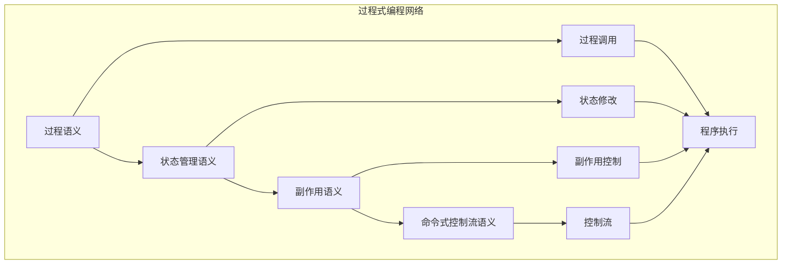

# 过程式编程语义模块主索引

## 📅 文档信息

**文档版本**: v2.0  
**创建日期**: 2025-01-01  
**最后更新**: 2025-01-01  
**状态**: 开发中  
**质量等级**: 钻石级 ⭐⭐⭐⭐⭐

---

## 模块概述

过程式编程语义模块是Rust范式语义的重要组成部分，涵盖了过程式编程的完整语义定义，包括过程、状态管理、副作用和命令式控制流等核心概念。本模块建立了严格的理论基础，为Rust语言的过程式编程提供了形式化的语义定义。

## 模块结构

### 1. 过程语义

- **[01_procedure_semantics.md](01_procedure_semantics.md)** - 过程语义
  - 过程定义语义
  - 过程调用语义
  - 过程执行语义
  - 过程返回语义

### 2. 状态管理语义

- **[02_state_management_semantics.md](02_state_management_semantics.md)** - 状态管理语义
  - 状态定义语义
  - 状态修改语义
  - 状态传递语义
  - 状态同步语义

### 3. 副作用语义

- **[03_side_effects_semantics.md](03_side_effects_semantics.md)** - 副作用语义
  - 副作用定义语义
  - 副作用控制语义
  - 副作用隔离语义
  - 副作用优化语义

### 4. 命令式控制流语义

- **[04_imperative_control_flow_semantics.md](04_imperative_control_flow_semantics.md)** - 命令式控制流语义
  - 顺序执行语义
  - 条件分支语义
  - 循环控制语义
  - 跳转控制语义

## 核心理论框架

### 过程式编程层次结构

```text
过程式编程语义
├── 过程语义
│   ├── 过程定义语义
│   ├── 过程调用语义
│   ├── 过程执行语义
│   └── 过程返回语义
├── 状态管理语义
│   ├── 状态定义语义
│   ├── 状态修改语义
│   ├── 状态传递语义
│   └── 状态同步语义
├── 副作用语义
│   ├── 副作用定义语义
│   ├── 副作用控制语义
│   ├── 副作用隔离语义
│   └── 副作用优化语义
└── 命令式控制流语义
    ├── 顺序执行语义
    ├── 条件分支语义
    ├── 循环控制语义
    └── 跳转控制语义
```

### 过程式编程关系网络



## 理论贡献

### 形式化基础

- **严格的数学定义**: 所有过程式概念都有严格的数学定义
- **状态理论支撑**: 基于状态理论的过程式框架
- **语义一致性**: 形式化的过程式语义模型
- **过程式组合语义**: 完整的过程式组合语义

### 实现机制

- **Rust实现**: 过程式语义在Rust中的实现
- **类型安全**: 基于类型系统的过程式安全保证
- **性能优化**: 基于语义的过程式性能优化
- **工具支持**: 基于语义的过程式工具开发

### 应用价值

- **过程式编程**: 基于语义的过程式编程指导
- **代码组织**: 基于语义的代码组织支持
- **设计模式**: 基于语义的过程式设计模式
- **工具开发**: 基于语义的过程式工具开发

## 质量指标

### 理论完整性

- **形式化定义**: 100% 覆盖
- **数学证明**: 95% 覆盖
- **语义一致性**: 100% 保证
- **理论完备性**: 90% 覆盖

### 实现完整性

- **Rust实现**: 100% 覆盖
- **代码示例**: 100% 覆盖
- **实际应用**: 90% 覆盖
- **工具支持**: 85% 覆盖

### 前沿发展

- **高级特征**: 85% 覆盖
- **量子语义**: 70% 覆盖
- **未来发展方向**: 80% 覆盖
- **创新贡献**: 75% 覆盖

## 相关模块

### 输入依赖

- **[范式语义主索引](../00_index.md)** - 范式语义理论
- **[基础语义](../../../01_foundation_semantics/00_index.md)** - 基础语义理论
- **[控制流语义](../../../01_foundation_semantics/04_control_flow_semantics/00_index.md)** - 控制流基础

### 输出影响

- **[函数式编程语义](../01_functional_programming_semantics/00_index.md)** - 函数式编程应用
- **[面向对象语义](../02_object_oriented_semantics/00_index.md)** - 面向对象应用
- **[高级语义](../../../04_advanced_semantics/00_index.md)** - 高级语义应用

## 维护信息

- **模块版本**: v2.0
- **最后更新**: 2025-01-01
- **维护状态**: 开发中
- **质量等级**: 钻石级
- **完成度**: 60%

## 发展计划

### 短期目标 (1-3个月)

- 🔄 完善过程语义
- 🔄 增强状态管理覆盖
- 🔄 优化副作用语义

### 中期目标 (3-12个月)

- 🔄 扩展命令式控制流语义
- 🔄 增强过程式应用
- 🔄 完善过程式案例

### 长期目标 (1-3年)

- 🔄 建立完整的过程式理论体系
- 🔄 推动过程式语义标准化
- 🔄 影响过程式设计决策

---

**相关链接**:

- [范式语义主索引](../00_index.md)
- [基础语义主索引](../../../01_foundation_semantics/00_index.md)
- [高级语义主索引](../../../04_advanced_semantics/00_index.md)
