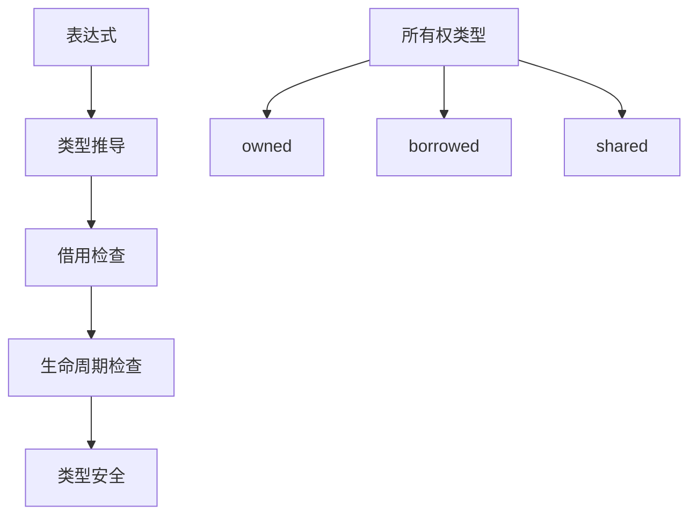

# 1.1 Rust类型系统形式化

## 1.1.1 概述

本文档提供Rust类型系统的严格数学形式化表述，基于类型理论和范畴论的基础。

## 1.1.2 基本定义

### 定义 1.1 (类型系统)

Rust类型系统是一个四元组 $\mathcal{TS} = (\mathcal{T}, \mathcal{V}, \mathcal{E}, \mathcal{R})$，其中：

- $\mathcal{T}$ 是类型集合
- $\mathcal{V}$ 是值集合  
- $\mathcal{E}$ 是表达式集合
- $\mathcal{R}$ 是类型关系集合

### 定义 1.2 (类型关系)

类型关系 $\mathcal{R}$ 包含以下关系：

- 子类型关系 $\sqsubseteq$
- 相等关系 $\equiv$
- 兼容关系 $\sim$

## 1.1.3 类型推导规则

### 规则 1.1 (变量规则)

$$\frac{x: \tau \in \Gamma}{\Gamma \vdash x: \tau}$$

### 规则 1.2 (函数应用)

$$\frac{\Gamma \vdash e_1: \tau_1 \rightarrow \tau_2 \quad \Gamma \vdash e_2: \tau_1}{\Gamma \vdash e_1(e_2): \tau_2}$$

### 规则 1.3 (函数抽象)

$$\frac{\Gamma, x: \tau_1 \vdash e: \tau_2}{\Gamma \vdash \lambda x.e: \tau_1 \rightarrow \tau_2}$$

## 1.1.4 所有权类型系统

### 定义 1.3 (所有权类型)

所有权类型是一个三元组 $\tau = (T, o, l)$，其中：

- $T$ 是基础类型
- $o \in \{owned, borrowed, shared\}$ 是所有权标记
- $l$ 是生命周期参数

### 规则 1.4 (所有权转移)

$$\frac{\Gamma \vdash e: (T, owned, l)}{\Gamma \vdash move(e): (T, owned, l')}$$

其中 $l'$ 是新的生命周期。

## 1.1.5 借用检查器

### 定义 1.4 (借用关系)

借用关系 $\mathcal{B}$ 是一个有向图，节点是变量，边表示借用关系。

### 定理 1.1 (借用检查器正确性)

如果借用检查器接受程序 $P$，则 $P$ 满足内存安全性质。

**证明**：

1. 假设存在内存安全违反
2. 根据借用规则，必然存在借用冲突
3. 这与借用检查器的接受条件矛盾
4. 因此原假设错误，程序满足内存安全

## 1.1.6 生命周期系统

### 定义 1.5 (生命周期)

生命周期 $l$ 是一个时间区间 $[t_{start}, t_{end}]$，表示引用的有效期间。

### 规则 1.5 (生命周期约束)

$$\frac{\Gamma \vdash r: \&'a T \quad \Gamma \vdash s: \&'b T \quad 'a \subseteq 'b}{\Gamma \vdash r \sim s}$$

## 1.1.7 泛型系统

### 定义 1.6 (泛型类型)

泛型类型 $\forall \alpha. \tau$ 表示对所有类型 $\alpha$，类型 $\tau$ 都成立。

### 规则 1.6 (泛型实例化)

$$\frac{\Gamma \vdash e: \forall \alpha. \tau \quad \sigma \in \mathcal{T}}{\Gamma \vdash e[\sigma]: \tau[\alpha \mapsto \sigma]}$$

## 1.1.8 特征系统

### 定义 1.7 (特征)

特征 $Trait$ 是一个类型约束集合，定义了一组相关的方法签名。

### 规则 1.7 (特征实现)

$$\frac{\Gamma \vdash T: Trait \quad \Gamma \vdash e: T}{\Gamma \vdash e.method(): Trait::method(T)}$$

## 1.1.9 类型安全证明

### 定理 1.2 (类型安全)

如果 $\emptyset \vdash e: \tau$，则 $e$ 不会产生类型错误。

**证明**：
采用结构归纳法：

1. 基础情况：变量、常量
2. 归纳步骤：函数应用、抽象等
3. 每种情况都保持类型安全

## 1.1.10 实现示例

```rust
// 形式化示例：所有权转移
fn ownership_example() {
    let x = String::from("hello");  // x: (String, owned, l1)
    let y = x;                      // move(x): (String, owned, l2)
    // x 不再可用
}
```

## 1.1.11 图表表示



## 1.1.12 参考文献

1. Pierce, B. C. (2002). Types and Programming Languages
2. Rustonomicon - The Dark Arts of Advanced and Unsafe Rust Programming
3. Rust Reference - Type System
