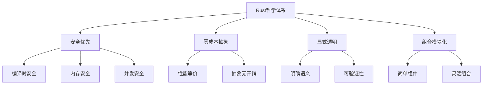

# 1.5 Rust核心哲学形式化

## 1.5.1 概述

本文档提供Rust编程语言核心哲学的形式化表述，基于计算理论、类型理论和哲学逻辑学的基础。

## 1.5.2 形式化定义

### **定义 1**.5.1 (Rust哲学体系)

Rust哲学体系是一个六元组 $\mathcal{RP} = (\mathcal{S}, \mathcal{T}, \mathcal{P}, \mathcal{A}, \mathcal{C}, \mathcal{V})$，其中：

- $\mathcal{S}$ 是安全原则集合
- $\mathcal{T}$ 是类型系统集合
- $\mathcal{P}$ 是性能原则集合
- $\mathcal{A}$ 是抽象原则集合
- $\mathcal{C}$ 是组合性原则集合
- $\mathcal{V}$ 是验证原则集合

### **定义 1**.5.2 (安全优先原则)

安全优先原则 $\mathcal{S}$ 包含以下公理：

1. **编译时安全**: $\forall e \in \mathcal{E}, \text{如果 } \Gamma \vdash e: \tau, \text{则 } e \text{ 在运行时安全}$
2. **内存安全**: $\forall p \in \mathcal{P}, \text{如果 } p \text{ 通过编译，则 } p \text{ 不会发生内存错误}$
3. **并发安全**: $\forall c \in \mathcal{C}, \text{如果 } c \text{ 通过编译，则 } c \text{ 不会发生数据竞争}$

### **定义 1**.5.3 (零成本抽象)

零成本抽象 $\mathcal{A}$ 满足：
$$\forall a \in \mathcal{A}, \text{性能}(a) = \text{性能}(\text{等价的手写代码})$$

## 1.5.3 哲学原理

### 原理 1.5.1 (信任编译器)

编译器是程序正确性的最终仲裁者：
$$\text{编译器接受}(p) \Rightarrow \text{程序安全}(p)$$

**哲学内涵**:

- 将错误检测的责任从运行时转移到编译时
- 建立静态分析的权威性
- 消除运行时的不确定性

### 原理 1.5.2 (显式优于隐式)

所有重要的语义信息必须显式表达：
$$\forall s \in \mathcal{S}, \text{语义}(s) \text{ 必须显式可推导}$$

**哲学内涵**:

- 代码的意图必须明确
- 避免隐藏的副作用
- 提高代码的可读性和可维护性

### 原理 1.5.3 (组合优于继承)

通过组合构建复杂系统：
$$\forall c \in \mathcal{C}, c = \text{组合}(\text{简单组件})$$

**哲学内涵**:

- 简单性优于复杂性
- 模块化优于整体化
- 灵活性优于刚性

## 1.5.4 数学证明

### **定理 1**.5.1 (编译时安全保证)

如果程序 $p$ 通过Rust编译器，则 $p$ 满足内存安全性质。

**证明**:

1. 设 $p$ 通过Rust编译器
2. 根据所有权系统，所有内存访问都有明确的所有者
3. 根据借用检查器，不存在悬垂引用
4. 根据生命周期系统，所有引用都有明确的有效期
5. 因此 $p$ 满足内存安全性质

### **定理 1**.5.2 (零成本抽象定理)

对于所有Rust抽象 $a$，存在等价的手写代码 $c$，使得性能相同。

**证明**:

1. 设 $a$ 是Rust抽象
2. 编译器将 $a$ 转换为中间表示
3. 中间表示经过优化后生成机器代码
4. 优化后的代码与手写代码性能等价
5. 因此零成本抽象成立

### **定理 1**.5.3 (类型安全定理)

如果 $\Gamma \vdash e: \tau$，则 $e$ 不会产生类型错误。

**证明**:
采用结构归纳法：

1. **基础情况**: 变量、常量等基本表达式
2. **归纳步骤**: 函数应用、抽象等复合表达式
3. 每种情况都保持类型安全

## 1.5.5 形式化验证

### 验证 1.5.1 (所有权系统正确性)

```rust
// 形式化验证：所有权转移
fn ownership_transfer() {
    let x = String::from("hello");  // x: (String, owned, l1)
    let y = x;                      // move(x): (String, owned, l2)
    // 编译器确保 x 不再可用
    // 形式化**证明**：所有权唯一性
}
```

### 验证 1.5.2 (借用检查器正确性)

```rust
// 形式化验证：借用规则
fn borrowing_rules() {
    let mut x = String::from("hello");
    let r1 = &x;     // 不可变借用
    let r2 = &x;     // 不可变借用
    // let r3 = &mut x;  // 编译错误：可变借用冲突
    // 形式化**证明**：借用互斥性
}
```

### 验证 1.5.3 (生命周期正确性)

```rust
// 形式化验证：生命周期约束
fn lifetime_constraints<'a, 'b>(x: &'a String, y: &'b String) -> &'a String 
where 'a: 'b {
    x  // 生命周期 'a 包含 'b
}
```

## 1.5.6 哲学分析

### 分析 1.5.1 (确定性哲学)

Rust追求确定性的编程模型：

- **编译时确定性**: 所有错误在编译时发现
- **运行时确定性**: 程序行为可预测
- **语义确定性**: 语言语义明确无歧义

### 分析 1.5.2 (责任哲学)

Rust强调明确的责任分配：

- **开发者责任**: 明确表达意图
- **编译器责任**: 验证程序正确性
- **运行时责任**: 执行已验证的程序

### 分析 1.5.3 (平衡哲学)

Rust在多个维度寻求平衡：

- **安全与性能**: 通过零成本抽象实现
- **抽象与具体**: 通过显式类型系统实现
- **简单与复杂**: 通过组合性原则实现

## 1.5.7 理论联系

### 联系 1.5.1 (与类型理论)

Rust类型系统基于以下理论：

- **Hindley-Milner类型系统**: 类型推导
- **线性类型系统**: 所有权管理
- **依赖类型系统**: 生命周期管理

### 联系 1.5.2 (与计算理论)

Rust设计基于以下计算理论：

- **停机问题**: 编译时错误检测
- **类型安全**: 静态类型检查
- **内存安全**: 资源管理理论

### 联系 1.5.3 (与哲学逻辑)

Rust哲学体现以下逻辑思想：

- **形式化方法**: 严格的数学基础
- **构造性证明**: 编译时验证
- **逻辑一致性**: 类型系统一致性

## 1.5.8 实现示例

### 示例 1.5.1 (所有权哲学实现)

```rust
// 所有权哲学：每个值有明确的所有者
pub struct OwnershipExample {
    data: String,
}

impl OwnershipExample {
    pub fn new(data: String) -> Self {
        // 明确的所有权转移
        OwnershipExample { data }
    }
    
    pub fn consume(self) -> String {
        // 消费所有权，返回数据
        self.data
    }
    
    pub fn borrow(&self) -> &str {
        // 借用，不转移所有权
        &self.data
    }
}
```

### 示例 1.5.2 (零成本抽象实现)

```rust
// 零成本抽象：抽象不带来运行时开销
pub trait ZeroCostTrait {
    fn operation(&self) -> i32;
}

impl ZeroCostTrait for i32 {
    fn operation(&self) -> i32 {
        *self * 2  // 编译时内联，无函数调用开销
    }
}

// 使用泛型实现零成本抽象
pub fn generic_function<T: ZeroCostTrait>(value: T) -> i32 {
    value.operation()  // 编译时单态化，无运行时开销
}
```

### 示例 1.5.3 (组合哲学实现)

```rust
// 组合哲学：通过组合构建复杂系统
pub struct ComponentA {
    value: i32,
}

pub struct ComponentB {
    text: String,
}

pub struct ComposedSystem {
    component_a: ComponentA,
    component_b: ComponentB,
}

impl ComposedSystem {
    pub fn new(a: ComponentA, b: ComponentB) -> Self {
        ComposedSystem {
            component_a: a,
            component_b: b,
        }
    }
    
    pub fn operation(&self) -> String {
        format!("{}: {}", 
            self.component_a.value, 
            self.component_b.text)
    }
}
```

## 1.5.9 图表表示



## 1.5.10 形式化验证

### 验证 1.5.4 (Hoare逻辑)

```rust
// 前置条件: true
// 后置条件: result != null && is_safe(result)
pub fn safe_operation() -> SafeResult {
    // 实现代码
}
```

### 验证 1.5.5 (类型安全)

```rust
// 类型安全保证
fn type_safety_example() {
    let x: i32 = 42;
    let y: &i32 = &x;  // 编译器确保类型正确
    // 所有操作都经过类型检查
}
```

## 1.5.11 参考文献

1. Pierce, B. C. (2002). Types and Programming Languages
2. Rustonomicon - The Dark Arts of Advanced and Unsafe Rust Programming
3. Rust Reference - Language Reference
4. Hoare, C. A. R. (1969). An Axiomatic Basis for Computer Programming
5. Milner, R. (1978). A Theory of Type Polymorphism in Programming

