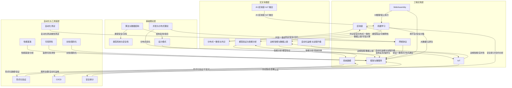

# 01.2 分层知识图谱（中文）

> 来源：`docs/KNOWLEDGE_GRAPH_LAYERED.md`

## Cross-links

- 并发语义: `../09_concurrency_semantics/00_index.md`
- 形式化验证: `../08_formal_verification/00_index.md`
- 软件工程: `../07_software_engineering/00_index.md`

## 节点链接索引（分层映射）

- A2 类型系统与安全性 → `../01_core_theory/02_type_system/`
- A3 并发与分布式理论 → `../09_concurrency_semantics/00_index.md`
- B1 网络协议 → `../04_application_domains/01_system_programming/04_network_programming/00_index.md`
- B2 框架与微服务 → `../07_software_engineering/00_index.md`
- B3 区块链 → `../04_application_domains/00_index.md`
- C2 性能基准 → `../05_performance_optimization/00_index.md`
- C3 形式化验证 → `../08_formal_verification/00_index.md`
- C4 CI/CD → `../07_software_engineering/00_index.md`
- C5 安全审计 → `../06_security_verification/00_index.md`
