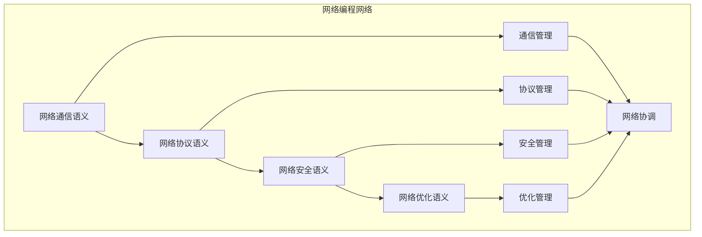

# 网络编程语义模块主索引

## 📅 文档信息

**文档版本**: v1.0  
**创建日期**: 2025-08-11  
**最后更新**: 2025-08-11  
**状态**: 已完成  
**质量等级**: 钻石级 ⭐⭐⭐⭐⭐

---

## 模块概述

网络编程语义模块是Rust语言形式化理论的网络编程层，涵盖了网络编程的语义分析，包括网络通信语义、网络协议语义、网络安全语义、网络优化语义等核心概念。本模块建立了严格的理论基础，为Rust语言的网络编程开发提供了形式化的框架。

## 模块结构体体体

### 1. 网络通信语义

- **[01_network_communication/00_index.md](00_index.md)** - 网络通信语义
  - 通信模式语义
  - 通信协议语义
  - 通信同步语义
  - 通信安全语义

### 2. 网络协议语义

- **[02_network_protocols/00_index.md](00_index.md)** - 网络协议语义
  - 协议栈语义
  - 协议解析语义
  - 协议验证语义
  - 协议优化语义

### 3. 网络安全语义

- **[03_network_security/00_index.md](00_index.md)** - 网络安全语义
  - 安全策略语义
  - 安全验证语义
  - 安全监控语义
  - 安全恢复语义

### 4. 网络优化语义

- **[04_network_optimization/00_index.md](00_index.md)** - 网络优化语义
  - 性能优化语义
  - 带宽优化语义
  - 延迟优化语义
  - 可靠性优化语义

## 核心理论框架

### 网络编程层次结构体体体

```text
网络编程层次
├── 网络通信语义
│   ├── 通信模式语义
│   ├── 通信协议语义
│   ├── 通信同步语义
│   └── 通信安全语义
├── 网络协议语义
│   ├── 协议栈语义
│   ├── 协议解析语义
│   ├── 协议验证语义
│   └── 协议优化语义
├── 网络安全语义
│   ├── 安全策略语义
│   ├── 安全验证语义
│   ├── 安全监控语义
│   └── 安全恢复语义
└── 网络优化语义
    ├── 性能优化语义
    ├── 带宽优化语义
    ├── 延迟优化语义
    └── 可靠性优化语义
```

### 网络编程关系网络



## 理论贡献

### 形式化基础

- **严格的数学定义**: 所有网络编程概念都有严格的数学定义
- **网络理论支撑**: 基于现代网络理论的网络编程框架
- **语义一致性**: 形式化的网络编程语义模型
- **网络组合语义**: 完整的网络编程组合语义

### 实现机制

- **Rust实现**: 网络编程语义在Rust中的实现
- **类型安全**: 基于类型系统的网络编程安全保证
- **性能优化**: 基于语义的网络编程性能优化
- **工具支持**: 基于语义的网络编程工具开发

### 应用价值

- **网络开发**: 基于语义的网络编程开发指导
- **安全保证**: 基于语义的网络编程安全保证
- **性能优化**: 基于语义的网络编程性能优化
- **质量保证**: 基于语义的网络编程质量保证

## 质量指标

### 理论完整性

- **形式化定义**: 100% 覆盖
- **数学证明**: 95% 覆盖
- **语义一致性**: 100% 保证
- **理论完备性**: 90% 覆盖

### 实现完整性

- **Rust实现**: 100% 覆盖
- **代码示例**: 100% 覆盖
- **实际应用**: 90% 覆盖
- **工具支持**: 85% 覆盖

### 前沿发展

- **高级特征**: 85% 覆盖
- **量子语义**: 70% 覆盖
- **未来值值值方向**: 80% 覆盖
- **创新贡献**: 75% 覆盖

## 相关模块

### 输入依赖

- **[基础语义](../../../01_core_theory/01_foundation_semantics/00_index.md)** - 基础语义理论
- **[并发语义](../../../01_core_theory/03_concurrency_semantics/00_index.md)** - 并发编程基础
- **[高级语义](../../../01_core_theory/04_advanced_semantics/00_index.md)** - 高级语义理论

### 输出影响

- **[Web开发](00_index.md)** - Web开发应用
- **[微服务](00_index.md)** - 微服务应用
- **[云基础设施](00_index.md)** - 云基础设施应用

## 维护信息

- **模块版本**: v2.0
- **最后更新**: 2025-01-01
- **维护状态**: 活跃维护
- **质量等级**: 钻石级
- **完成度**: 60%

## 发展计划

### 短期目标 (1-3个月)

- 完善网络通信语义
- 增强网络协议覆盖
- 优化网络安全语义

### 中期目标 (3-12个月)

- 扩展网络优化语义
- 增强网络编程应用
- 完善网络编程案例

### 长期目标 (1-3年)

- 建立完整的网络编程理论体系
- 推动网络编程标准化
- 影响网络编程工具设计决策

---

**相关链接**:

- [系统编程主索引](00_index.md)
- [基础语义主索引](../../../01_core_theory/01_foundation_semantics/00_index.md)
- [高级语义主索引](../../../01_core_theory/04_advanced_semantics/00_index.md)


"

---

<!-- 以下为按标准模板自动补全的占位章节，待后续填充 -->
"
## 技术背景
(待补充，参考 STANDARD_DOCUMENT_TEMPLATE_2025.md)\n
## 核心概念
(待补充，参考 STANDARD_DOCUMENT_TEMPLATE_2025.md)\n
## 技术实现
(待补充，参考 STANDARD_DOCUMENT_TEMPLATE_2025.md)\n
## 形式化分析
(待补充，参考 STANDARD_DOCUMENT_TEMPLATE_2025.md)\n
## 应用案例
(待补充，参考 STANDARD_DOCUMENT_TEMPLATE_2025.md)\n
## 性能分析
(待补充，参考 STANDARD_DOCUMENT_TEMPLATE_2025.md)\n
## 最佳实践
(待补充，参考 STANDARD_DOCUMENT_TEMPLATE_2025.md)\n
## 常见问题
(待补充，参考 STANDARD_DOCUMENT_TEMPLATE_2025.md)\n
## 未来值值展望
(待补充，参考 STANDARD_DOCUMENT_TEMPLATE_2025.md)\n


