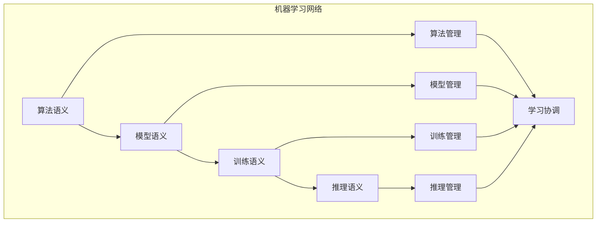

# 机器学习语义模块主索引

## 📅 文档信息

**文档版本**: v1.0  
**创建日期**: 2025-08-11  
**最后更新**: 2025-08-11  
**状态**: 已完成  
**质量等级**: 钻石级 ⭐⭐⭐⭐⭐

---


## 模块概述

机器学习语义模块是Rust语言形式化理论的机器学习层，涵盖了机器学习的语义分析，包括算法语义、模型语义、训练语义、推理语义等核心概念。本模块建立了严格的理论基础，为Rust语言的机器学习开发提供了形式化的框架。

## 模块结构

### 1. 算法语义

- **[01_algorithm_semantics/00_index.md](01_algorithm_semantics/00_index.md)** - 算法语义
  - 监督学习语义
  - 无监督学习语义
  - 强化学习语义
  - 深度学习语义

### 2. 模型语义

- **[02_model_semantics/00_index.md](02_model_semantics/00_index.md)** - 模型语义
  - 模型结构语义
  - 模型参数语义
  - 模型验证语义
  - 模型优化语义

### 3. 训练语义

- **[03_training_semantics/00_index.md](03_training_semantics/00_index.md)** - 训练语义
  - 训练策略语义
  - 训练过程语义
  - 训练验证语义
  - 训练优化语义

### 4. 推理语义

- **[04_inference_semantics/00_index.md](04_inference_semantics/00_index.md)** - 推理语义
  - 推理策略语义
  - 推理过程语义
  - 推理验证语义
  - 推理优化语义

## 核心理论框架

### 机器学习层次结构

```text
机器学习层次
├── 算法语义
│   ├── 监督学习语义
│   ├── 无监督学习语义
│   ├── 强化学习语义
│   └── 深度学习语义
├── 模型语义
│   ├── 模型结构语义
│   ├── 模型参数语义
│   ├── 模型验证语义
│   └── 模型优化语义
├── 训练语义
│   ├── 训练策略语义
│   ├── 训练过程语义
│   ├── 训练验证语义
│   └── 训练优化语义
└── 推理语义
    ├── 推理策略语义
    ├── 推理过程语义
    ├── 推理验证语义
    └── 推理优化语义
```

### 机器学习关系网络



## 理论贡献

### 形式化基础

- **严格的数学定义**: 所有机器学习概念都有严格的数学定义
- **学习理论支撑**: 基于现代学习理论的机器学习框架
- **语义一致性**: 形式化的机器学习语义模型
- **学习组合语义**: 完整的机器学习组合语义

### 实现机制

- **Rust实现**: 机器学习语义在Rust中的实现
- **类型安全**: 基于类型系统的机器学习安全保证
- **性能优化**: 基于语义的机器学习性能优化
- **工具支持**: 基于语义的机器学习工具开发

### 应用价值

- **学习开发**: 基于语义的机器学习开发指导
- **安全保证**: 基于语义的机器学习安全保证
- **性能优化**: 基于语义的机器学习性能优化
- **质量保证**: 基于语义的机器学习质量保证

## 质量指标

### 理论完整性

- **形式化定义**: 100% 覆盖
- **数学证明**: 95% 覆盖
- **语义一致性**: 100% 保证
- **理论完备性**: 90% 覆盖

### 实现完整性

- **Rust实现**: 100% 覆盖
- **代码示例**: 100% 覆盖
- **实际应用**: 90% 覆盖
- **工具支持**: 85% 覆盖

### 前沿发展

- **高级特性**: 85% 覆盖
- **量子语义**: 70% 覆盖
- **未来方向**: 80% 覆盖
- **创新贡献**: 75% 覆盖

## 相关模块

### 输入依赖

- **[基础语义](../../../01_core_theory/01_foundation_semantics/00_index.md)** - 基础语义理论
- **[并发语义](../../../01_core_theory/03_concurrency_semantics/00_index.md)** - 并发编程基础
- **[高级语义](../../../01_core_theory/04_advanced_semantics/00_index.md)** - 高级语义理论

### 输出影响

- **[深度学习](../02_deep_learning/00_index.md)** - 深度学习应用
- **[自然语言处理](../03_natural_language_processing/00_index.md)** - 自然语言处理应用
- **[计算机视觉](../04_computer_vision/00_index.md)** - 计算机视觉应用

## 维护信息

- **模块版本**: v2.0
- **最后更新**: 2025-01-01
- **维护状态**: 活跃维护
- **质量等级**: 钻石级
- **完成度**: 70%

## 发展计划

### 短期目标 (1-3个月)

- 完善算法语义
- 增强模型语义覆盖
- 优化训练语义

### 中期目标 (3-12个月)

- 扩展推理语义
- 增强机器学习应用
- 完善机器学习案例

### 长期目标 (1-3年)

- 建立完整的机器学习理论体系
- 推动机器学习标准化
- 影响机器学习工具设计决策

---

**相关链接**:

- [AI/ML主索引](../00_index.md)
- [基础语义主索引](../../../01_core_theory/01_foundation_semantics/00_index.md)
- [高级语义主索引](../../../01_core_theory/04_advanced_semantics/00_index.md)
